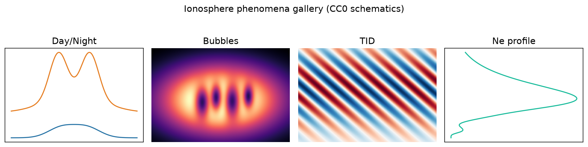
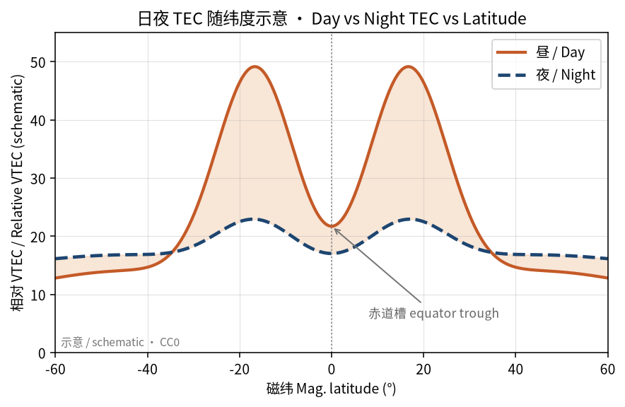
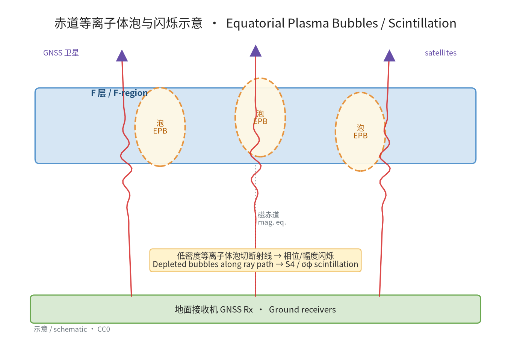
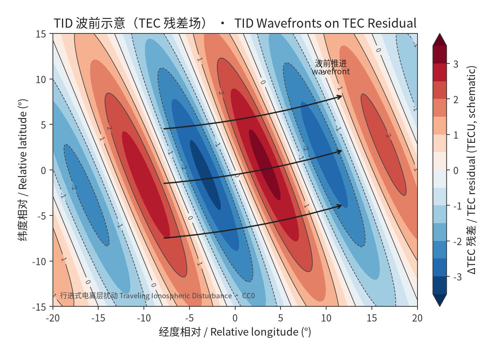
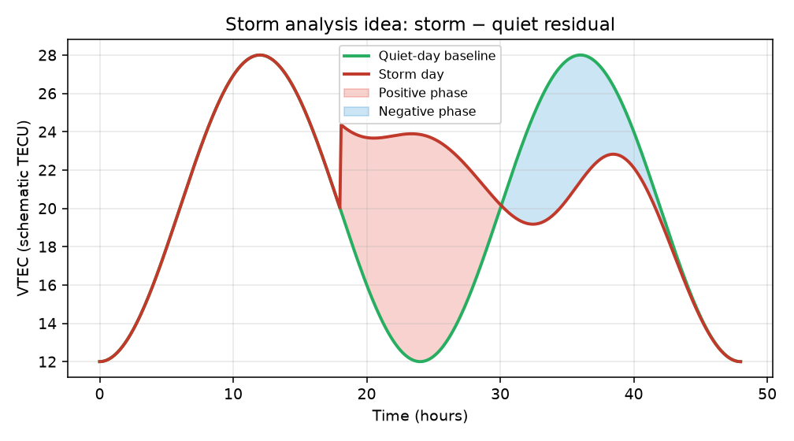
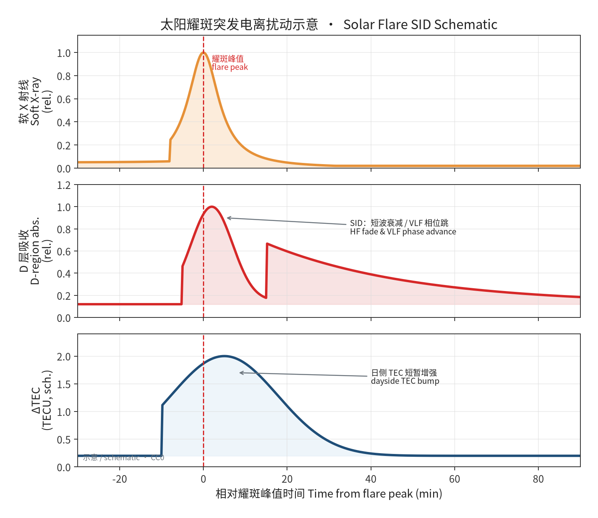
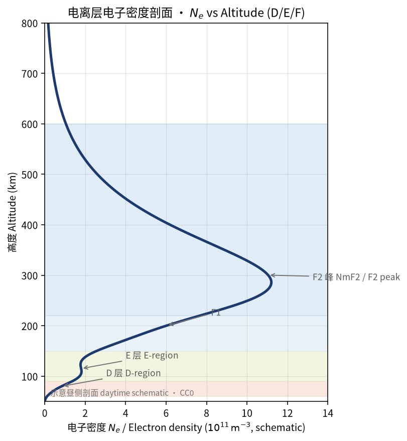
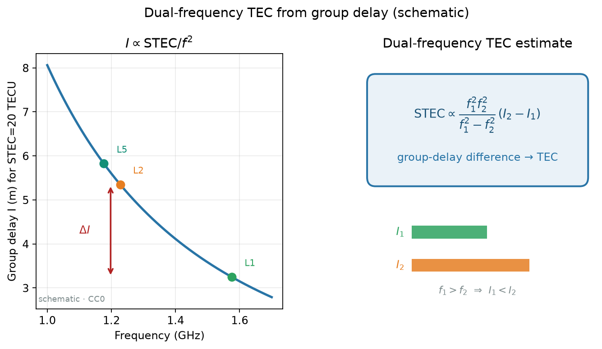
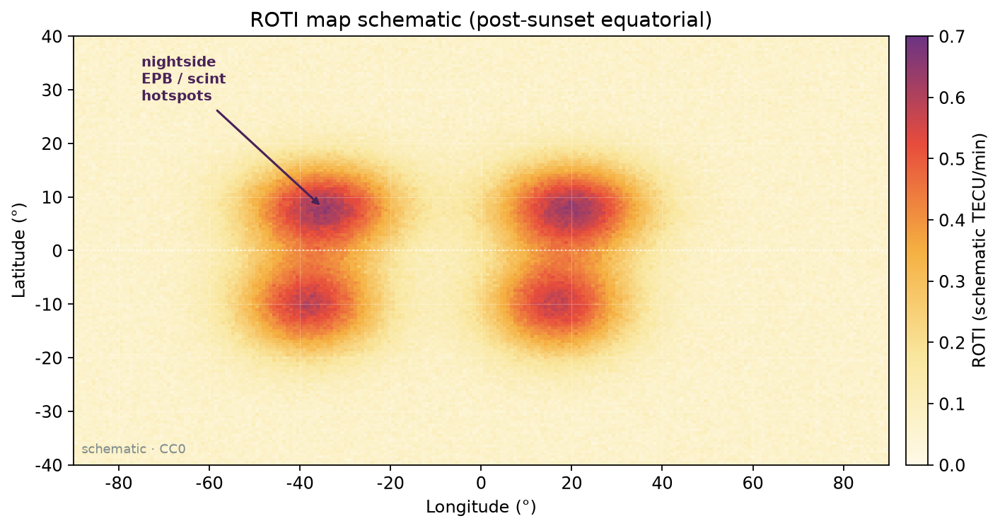

# Ionosphere-GNSS-OpenSource

**电离层 · GNSS · 导航开源索引**（链接精选，不是代码大合集）

  

自绘示意（日夜 TEC · 气泡闪烁 · TID · Ne 剖面）· CC0 · 非实测产品图

---

## 三条路（先选路）

| | 目标 | 入口 |
|:---:|---|---|
| **A** | 弄懂 TEC / 闪烁 / 磁暴长什么样 | [教程](./docs/tutorials/README.md) · [现象课 19–23](./docs/tutorials/19-phenomena-overview.md) |
| **B** | 下载 RINEX / IONEX / CORS / 实时流 | [数据怎么下](./docs/data-access.md) · [数据源列表](./lists/10-gnss-datasets.md) |
| **C** | 选开源软件动手算 | [软件怎么用](./docs/software/README.md) · 下方分类表 · [`PROJECTS.json`](./PROJECTS.json) |

---

## 现象一眼看懂

| 现象 | 图 | 课文 |
|---|---|---|
| 日夜 TEC + EIA |  | [21 赤道异常](./docs/tutorials/21-equatorial-anomaly-bubbles.md) |
| 等离子体气泡 / 闪烁 |  | [05 闪烁](./docs/tutorials/05-scintillation-roti.md) |
| TID 行波 |  | [22 TID](./docs/tutorials/22-tid-traveling-disturbances.md) |
| 磁暴残差 |  | [20 磁暴](./docs/tutorials/20-storm-tec-analysis.md) |
| 耀斑突增 |  | [23 耀斑日食](./docs/tutorials/23-flare-eclipse-special.md) |
| Ne 高度剖面 |  | [01 基础](./docs/tutorials/01-ionosphere-tec-basics.md) |
| 双频 → TEC |  | [02 双频](./docs/tutorials/02-gnss-dualfreq-tec.md) |
| ROTI 示意 |  | [05 闪烁](./docs/tutorials/05-scintillation-roti.md) |

---

## 软件 / 数据分类

| 分类 | 列表 | 数 |
|---|---|---:|
| 电离层 | [01](./lists/01-ionosphere.md) | 244 |
| 对流层 | [02](./lists/02-troposphere.md) | 39 |
| GNSS 数据与格式 | [03](./lists/03-gnss-data.md) | 120 |
| 精密定位 | [04](./lists/04-gnss-positioning.md) | 95 |
| 轨道与钟差 | [05](./lists/05-orbit-clock.md) | 16 |
| 导航 | [06](./lists/06-navigation-ins.md) | 63 |
| 软件接收机 | [07](./lists/07-gnss-sdr.md) | 62 |
| 移动应用 | [08](./lists/08-mobile-apps.md) | 22 |
| 学习工具 | [09](./lists/09-tools-learning.md) | 44 |
| **数据源门户** | [10](./lists/10-gnss-datasets.md) | 125 |
| **合计** | [PROJECTS.json](./PROJECTS.json) | **830** |

标记：🏷️ 官方 / 高校实验室 / 个人社区 · 官方 236 · 高校 298 · 社区 296 · 细则 [categories.md](./docs/categories.md)

---

## 许可

目录文本与元数据 [CC0](https://creativecommons.org/publicdomain/zero/1.0/)。上游软件与数据仍按各自条款。
