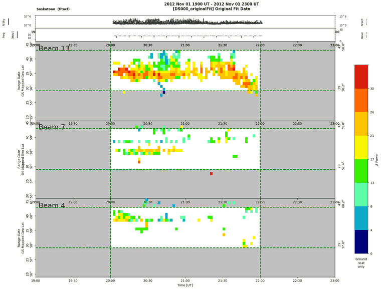

# DARNtids · SuperDARN 地面散射 → MUSIC 求 MSTID 波长/方向/速度 操作手册

目录：PROJECTS 登记的 <https://github.com/w2naf/DARNtids> 已**弃用**（README 首行写明迁移，tip `ce39085`，2026-01-11 08:18 EST，★4）。现行仓库是 <https://github.com/w2naf-academia/DARNtids>，tip **`6effcd0`**（2026-09-01 13:34 EDT）· tag `v0.2.0` / `20250930-research` · PyPI **`darntids` 0.2.0**（2026-08-02 13:40 EDT 发布）· ★2 · 作者 N. A. Frissell（Scranton / HamSCI），F. H. Tholley（Py3 + pyDARN 迁移），N. J. Guerra（pickle → HDF5）。

> 本文实测：2026-09-26 04:05–04:20 EDT，Debian，`uv` 建 **Python 3.11.16** venv。数据是 Zenodo [10.5281/zenodo.7005203](https://doi.org/10.5281/zenodo.7005203)（pyDARN 论文配套，CC-BY-4.0）里的**真实** SAS / PGR FITACF。
> 冲突时：**本机源码 > 上游 README > 本文**。

## 1. 它解决什么问题

- **MSTID / LSTID**：行进式电离层扰动（TID）按尺度分类。MSTID（中尺度）的水平波长约 50–500 km，周期 15–60 min，常见于中纬度冬季白天，多被认为由低层大气重力波驱动。LSTID（大尺度）的波长上千 km，周期 1–3 h，多与磁暴或极光带加热有关。尺度口径见课 [22](../tutorials/22-tid-traveling-disturbances.md) §4。DARNtids 只针对 **MSTID**。
- **地面散射（ground scatter, GS）**：SuperDARN HF 雷达的信号经 F 层折射后打到地面（或海面），再沿原路返回。这部分回波的强度和“落地距离”受 F 层密度调制，所以 MSTID 经过时，RTI 图（距离–时间–强度图）上会出现一条条**斜纹**。FITACF 每个距离门都带 `gflg` 标记（1 = 地面散射）。DARNtids 默认 `gscat=1`，只用地面散射。
- **GS 映射（`fovModel='GS'`）**：地面散射走的是“雷达 → 电离层 → 地面”的一跳路径，所以落地点离雷达约为斜距的一半，不是标准视场模型假设的全斜距。距离门到经纬度的映射见 [pydarn](./pydarn.md) §4。
- **MUSIC**（Multiple Signal Classification）：把一个 2 h 窗口里“波束 × 距离门 × 时间”的功率三维数组，先带通滤波（默认 0.3–1.2 mHz，即 14–56 min）、去趋势、加 Hann 窗、补零，再做 FFT。然后在主频上求**水平波数谱 k(kx, ky)**。谱上的每个峰就是一个候选平面波，由它可得波长 λ = 2π/|k|、传播方位角，以及相速度 v = λ·f。
- **MSTID 指数 / 分类**：批量处理多年的数据时，对每个 2 h 窗口求带内积分谱，按排序与阈值分成 `mstid` / `quiet`（`classify.py`），结果写进 MongoDB，最后出日历图。**这一段依赖 MongoDB，本文未运行**（§7）。

**不做的事：** 不从 RAWACF 做拟合（那是 RST `make_fit`）；不做去斑点。0.2.0 起去斑点交给上游 C 程序 `fitexfilter`，仓里附带一个 x86 二进制。也不下载数据（下载见 [superdarn-data](./superdarn-data.md)）。

## 2. 安装（**必须钉版**）

```bash
git clone https://github.com/w2naf-academia/DARNtids && cd DARNtids
uv venv -p 3.11 .venv && . .venv/bin/activate
uv pip install -e . pytest
# 关键：pyDARNmusic 0.2.0 读文件用 pydarnio.SDarnRead（1.x API）+ pydarn.RadarID（4.x 才有）
uv pip install "pydarn==4.1.2" "pydarnio~=1.3.0" "scipy<1.15" "matplotlib<3.9" "numpy<2.3"
uv pip check                      # All installed packages are compatible
python -m pytest -q tests         # 19 passed, 15 warnings in 1.27s（钉版后；钉版前也是 19 passed）
```

实测解析出的版本：darntids 0.2.0（但 `darntids.__version__` 仍打印 `0.1.0`）、pydarnmusic 0.2.0、pydarn 4.1.2、pydarnio 1.3、numpy 2.2.6、scipy 1.14.1、matplotlib 3.8.4、h5py 3.16.0、pymongo 4.18.2。venv 约 514 MB。不钉版时 uv 会装 pydarn 4.3 + pydarnio 2.1，import 和 19 个单元测试都能过，但**一读 FITACF 就崩**（坑 1）。

## 3. 数据：Zenodo 7005203 的真实 FITACF

```bash
curl -L -o example_data.zip "https://zenodo.org/api/records/7005203/files/example_data.zip/content"   # 218324968 B
md5sum example_data.zip        # fbbe3be6a39ced59bf0bec76d731d885（与 Zenodo 记录一致）
# DARNtids 只认 <fitacf_dir>/<YYYY>/<fit_sfx>/<radar>/YYYYMMDD*<radar>*.fitacf.bz2
mkdir -p sd-data/2012/fitacf/sas sd-data/2016/fitacf/pgr
unzip -j example_data.zip example_data/20121101.2002.00.sas.fitacf.bz2 -d sd-data/2012/fitacf/sas
unzip -j example_data.zip example_data/20160125.0002.00.pgr.fitacf.bz2 -d sd-data/2016/fitacf/pgr
```

用 pyDARN 看文件覆盖范围（记录数 / 首尾时间 / 控制程序 cp / 距离门数 / 波束数）：

```text
20121101.2002.00.pgr.fitacf.bz2 1070 2012-11-01 20:02:00 -> 2012-11-01 21:10:55 cp [(200, 1070)] nrang {75} beams 16
20121101.2002.00.sas.fitacf.bz2 1860 2012-11-01 20:02:00 -> 2012-11-01 22:01:51 cp [(200, 1860)] nrang {75} beams 16
20160125.0002.00.pgr.fitacf.bz2 2280 2016-01-25 00:02:00 -> 2016-01-25 02:01:54 cp [(3300, 2280)] nrang {75} beams 16
```

PGR 2012 文件只有 69 min，不够一个 2 h 窗口，所以选 **SAS（Saskatoon）2012-11-01 20:00–22:00 UT**（当地约 13–15 LT，白天）做主例，PGR 2016-01-25 00–02 UT 做对照。

## 4. 端到端：单事件 MUSIC（不需要 MongoDB）

```python
# run_sas.py
import datetime, time, matplotlib; matplotlib.use("Agg")
import darntids
t = time.time()
darntids.run_music("sas", datetime.datetime(2012,11,1,20,0), datetime.datetime(2012,11,1,22,0),
                   process_level="music", make_plots=True, data_path="music_data/music",
                   fitacf_dir="../sd-data", db_name=None, bad_range_km=500)
print(f"elapsed {time.time()-t:.0f}s")
```

```text
2026-09-26 08:14:33.103853 Processing:  sas 2012-11-01 20:00:00
Loading fitacf Files: 100%|██████████| 1/1 [00:02<00:00,  2.26s/it]
/…/pydarn/utils/range_estimations.py: 159: RuntimeWarning: invalid value encountered in arccos
WARNING:root:An error occured while defining limits.  No limits set.  Check your input values.
music_data/music/sas/20121101.2000-20121101.2200
PROCESING TIME: 0.9145407676696777
elapsed 30s
```

（`Processing:` 行用的是本机 UTC 时钟，08:14 UTC = 04:14 EDT。`WARNING … defining limits` 在传 `gate_limits=(0,74)` 后照样出现，结果逐行不变。仓内 `run_single_event.py` 专门加了日志过滤器屏蔽这句，可以忽略。）

输出目录 `music_data/music/sas/20121101.2000-20121101.2200/` 下有 **26 个文件**：18 张 png（`000_originalFit_RTI.png` … `015_karrDetected.png` 共 16 张分步图，加上 `999_impulseResponse.png`、`999_transferFunction.png` 两张滤波器图），另有 `sas-…h5`（全部中间数据集）、`*.runfile.json/.h5`（本次参数；auto_range 选中的门号 `"gate_limits": [29, 43]`）、`karr.txt`（检出信号表）、`messages.txt`、`processing_level_completed.txt`（内容 `music`），以及 2 个网页用的 `.php`。



`karr.txt` 表头 + 前 6 行（共 42 个信号，原样）：

```text
Number        Kx        Ky       |K|    lambda       Azm         f         T         v     Value      Area
         [1/km]    [1/km]    [1/km]      [km]     [deg]     [mHz]     [min]     [m/s]                [px]
1         0.016     0.020     0.026       245        39     0.893        19       219     0.783        22
2         0.015     0.019     0.024       260        38     0.893        19       232     0.781       101
3         0.017     0.022     0.028       226        38     0.893        19       202     0.747        73
4        -0.011    -0.027     0.029       216      -158     0.893        19       192     0.605       533
5         0.032     0.014     0.035       180        66     0.893        19       161     0.585       317
6         0.011     0.001     0.011       569        85     0.893        19       508     0.559        81
```

读 HDF5（`hdf5_api` 是仓库根目录的顶层模块，`pip install -e .` 已经把它装成可导入的模块）：

```python
import sys, glob, numpy as np
from hdf5_api import loadMusicArrayFromHDF5
d = loadMusicArrayFromHDF5(glob.glob("music_data/music/sas/*/sas-*[0-9].h5")[0])
a = d.active; print(d.get_data_sets(), a.data.shape, a.metadata.get("good_period"), a.dominantFreq)
```

```text
dataSets: ['DS000_originalFit', 'DS001_limitsApplied', 'DS002_beamInterpolated', 'DS003_timeInterpolated', 'DS004_nan_to_num', 'DS005_filtered', 'DS006_limitsApplied', 'DS007_detrended', 'DS008_windowed', 'DS009_windowed_gate', 'DS010_windowed_beam', 'DS011_zeropad']
active = b'DS011_zeropad' | data shape (time,beam,gate): (57, 16, 15)
  metadata['good_period'] = True
  dominantFreq [Hz] = 0.0008928571428571434 -> period [min] = 18.666666666666654
originalFit shape: (60, 16, 47) finite fraction: 0.114
signals detected: 42
{'area': 22.0, 'azm': 38.6598, 'freq': 0.0009, 'k': 0.0256, 'kx': 0.016, 'ky': 0.02, 'lambda': 245.3172, 'max': 0.7828, 'order': 1.0, 'period': 1120.0, 'vel': 219.0332}
```

对照事件 PGR 2016-01-25 00–02 UT（同样的脚本只改雷达和时间）：auto_range 选中门号 `[24, 34]`，检出 14 个信号，前 4 个是：

```text
1        -0.021     0.045     0.050       127       -25     0.893        19       113     0.607       192
2        -0.021     0.041     0.046       136       -27     0.893        19       122     0.599       295
3        -0.008     0.009     0.012       522       -42     0.893        19       466     0.578       652
4        -0.010     0.016     0.019       333       -32     0.893        19       297     0.549       347
```

两个事件的主频都是 0.893 mHz，这不是巧合。检查频率轴：

```text
pgr active shape (57, 16, 11) time 2016-01-25 00:34:00 -> 2016-01-25 01:30:00 | freqVec len 57 df[mHz]=0.2976 | bins in 0.3-1.2 mHz: [0.595 0.893 1.19 ] | dominant 0.893 mHz
sas active shape (57, 16, 15) time 2012-11-01 20:34:00 -> 2012-11-01 21:30:00 | freqVec len 57 df[mHz]=0.2976 | bins in 0.3-1.2 mHz: [0.595 0.893 1.19 ] | dominant 0.893 mHz
```

## 5. 怎么读结果

1. **先看 `000_originalFit_RTI.png`**：地面散射（`gscat=1`）要连续成带，才谈得上 MSTID。SAS 这次波束 13 在门 30–40 有较连续的带，波束 4 和 7 很稀疏。整个原始数组只有 **11.4 %** 的格子有值（`finite fraction: 0.114`）。
2. **有效时间窗只有 56 min，不是 2 h**：FIR 带通有 101 个抽头、按 60 s 采样，首尾各吃掉约 50 min。正式跑批时，前后 2 h 的 FITACF 都在目录里，能补上这段边缘；本例只有一个 2 h 文件，active 时间轴就只剩 **20:34–21:30**（57 个样本）。
3. **f / T / v 是量化的**：57 点对应频率分辨率 0.2976 mHz，通带 0.3–1.2 mHz 里只有 **0.595 / 0.893 / 1.19 mHz（T ≈ 28 / 19 / 14 min）3 个格点**。`karr.txt` 里所有信号共用同一个 `dominantFreq`（源码 `musicUtils.py` 第 801 行 `argmax(avg_psd)`），`v` 就是 λ × 这个主频。因此在这种短窗下，T 与 v 只能当作量级参考。
4. **λ 与方位角看前几个高 `Value` 的峰**：SAS 前 3 个峰彼此靠近（λ 226–260 km、Azm 38–39°、Value 0.75–0.78），在 k 谱图上是同一团。第 4 个峰方向正相反（−158°），属于另一团。PGR 的前两个峰 λ≈130 km、Azm −25°～−27°。`Azm = degrees(arctan2(kx, ky))`，源码注释写的是“传播方位角，从北向顺时针量”（`musicUtils.py` 第 1259 行）。kx/ky 的坐标轴来自 `determineRelativePosition`：`relative_x = dist·sin(azm)` 指向东，`relative_y = dist·cos(azm)` 指向北，以视场中心格为原点。所以 SAS 第 1 峰 39° 表示向东北传播。
5. **42 个“信号”≠ 42 个波**：`autodetect_threshold=0.35` 是相对归一化谱的阈值，k 谱噪声团也会被当成峰。本例 k 谱斑驳，没有一个孤立的主峰。结合第 2、3 点，**这两个 2 h 窗口都不能据此判定为 MSTID 事件**。原论文的判定方式是先按 MSTID 指数分类（§1 最后一条），再只对 `mstid` 类窗口跑 MUSIC。

## 6. `run_music()` 参数（默认值取自源码）

| 参数 | 默认 | 含义 |
| --- | --- | --- |
| `radar`, `sTime`, `eTime` | — | 三字母雷达代码；惯例是 2 h 窗口 |
| `process_level` | `'music'` | `rti_interp` → `fft` → `music`，逐级累加 |
| `fitacf_dir` / `fit_sfx` | `'/sd-data'` / `'fitacf'` | 按 `<dir>/<YYYY>/<sfx>/<radar>/YYYYMMDD*<radar>*.<sfx>.bz2` 查找；FITACF3 用 `'fitacf3'` |
| `fovModel` / `gscat` | `'GS'` / `1` | GS 映射；`gscat` 0=全部 1=仅地面散射 2=仅电离层散射 3=全部并带地面散射标记 |
| `auto_range_on` / `bad_range_km` | True / None | 自动选门号；MUSIC 建议 500 km，跳过近距离视场畸变 |
| `gate_limits` / `beam_limits` | (0,80) / (None,None) | auto_range 会覆盖 `gate_limits` |
| `interp_resolution` | 60. | 时间插值步长（s） |
| `filter_numtaps` / `filter_cutoff_low` / `_high` | 101 / 0.0003 / 0.0012 | FIR 带通（Hz）→ 14–56 min |
| `detrend`, `hanning_window_space`, `hanning_window_time`, `zeropad` | 全部 True | FFT 前处理 |
| `kx_max` / `ky_max` | 0.05 | k 谱范围（rad/km）：单轴 λ ≥ 126 km，对角方向可到约 89 km（SAS 第 39 号信号 λ=93 km） |
| `autodetect_threshold` / `neighborhood` | 0.35 / (10,10) | 峰检测阈值与邻域 |
| `db_name` / `mstid_list` / `mongo_port` | `'mstid'` / None / 27017 | `mstid_list=None` 时不连 Mongo |
| `data_path` | `'music_data/music'` | 输出根目录；**每次运行都会清空**该事件目录 |
| `boxcar_filter` | — | 0.2.0 已删除，传入即 `TypeError` |

`karr.txt` 列：`Kx/Ky/|K|`（1/km，注意是角波数口径，λ=2π/|K|）、`lambda`（km）、`Azm`（°）、`f`（mHz，主频）、`T`（min）、`v`（m/s = λ·f）、`Value`（归一化谱峰值，0–1）、`Area`（峰区域像素数）。

## 7. 坑（现象 → 原因 → 修复）

1. **`AttributeError: module 'pydarnio' has no attribute 'SDarnRead'`，随后又报 `… has no attribute 'dmap_exceptions'`**（实测，默认安装） → 默认装上的 pydarnio 2.1 删了 1.x 的 `SDarnRead`，而 pyDARNmusic 0.2.0 的 `load_fitacf` 还在用它。修复：`uv pip install "pydarn==4.1.2" "pydarnio~=1.3.0" "scipy<1.15" "matplotlib<3.9" "numpy<2.3"`
2. **退到 pydarn 3.x 后报 `ImportError: cannot import name 'RadarID' from 'pydarn'`**（实测 3.1.1） → pyDARNmusic 需要 pydarn ≥4 的 `RadarID`，而 pydarn 4.2 起又强制要求 pydarnio ≥2。能同时满足两边的只有 **pydarn 4.1.2 + pydarnio 1.3**。修复：同坑 1 的命令
3. **`ImportError: cannot import name 'InsetPosition'`**（实测 pydarn 3.1.1 + matplotlib 3.11） → matplotlib 3.9 移除了该类。修复：`uv pip install "matplotlib<3.9"`
4. **只打印 `No data for this time period.` 就结束，不报错**（实测：bz2 平铺放在一个目录里） → 加载器只按 `<dir>/<年>/fitacf/<雷达>/` 查找，找不到文件时静默返回空。修复：`mkdir -p sd-data/2012/fitacf/sas && mv *.sas.fitacf.bz2 sd-data/2012/fitacf/sas/`
5. **批处理 `run_helper.get_events_and_run(...)` 卡 30 s 后报 `pymongo.errors.ServerSelectionTimeoutError: localhost:27017 … Connection refused`**（实测） → 事件列表生成、分类、日历图都要读写 MongoDB。单事件只要 `mstid_list=None`（默认）就不连库。修复（批处理，本机未测）：`docker run -d --name mongo -p 27017:27017 mongo:7`
6. **旧配置报 `TypeError: run_music() no longer accepts 'boxcar_filter'`**（实测） → 0.2.0 删除了 Python 版去斑点，改由上游 `fitexfilter` 生成去斑点后的 FITACF 目录。修复：`sed -i "/boxcar_filter/d" my_run_config.py`，并让 `fitacf_dir` 指向 fitexfilter 的输出
7. **所有信号的 f 都是 0.893 mHz，T 都是 19 min**（实测，两个事件完全相同） → 数据只有 2 h，滤波吃掉边缘后只剩 57 点，通带内只有 3 个频率格点（§5 第 3 点）。修复：把前后相邻的 FITACF 放进同一目录，让滤波边缘由真实数据填充，例如 `ls sd-data/2012/fitacf/sas/20121101.{18,20,22}*`（至少覆盖 sTime−1 h 到 eTime+1 h）
8. **重跑同一事件后，之前改名保存的图不见了** → `run_music` 调用 `prepare_output_dirs(..., clear_output_dirs=True)`，会先清空事件目录。修复：每组参数用独立的 `data_path`，例如 `data_path="music_data/thr040"`
9. **按 PROJECTS 链接克隆到的是旧代码** → `w2naf/DARNtids` 已弃用，还是 `mstid` 包名、pickle 存储。修复：`git clone https://github.com/w2naf-academia/DARNtids`

## 8. 诚实边界

- 本机跑通的是 **单事件 `run_music(process_level='music')`**：读真实 FITACF → GS 映射 → auto_range → 插值 → 滤波/去趋势/加窗/补零 → FFT → k 谱 → 峰检测 → HDF5 + 16 张图。两个 2 h 窗口（SAS 2012-11-01、PGR 2016-01-25）都完成了。
- **没有跑**：MongoDB 事件列表、`rti_fraction` / 晨昏线质量筛选、MSTID 指数分类、日历图、多雷达、`webserver/`。原因是本机没有 MongoDB，而且一两个 2 h 窗口也构不成分类所需的统计样本。也没有运行 `fitexfilter` 去斑点。
- 公开样例只有单个 2 h 文件，有效窗口只剩 56 min，频率被量化到 3 个格点（§5）。本文给出的 λ/方位角只用来演示字段含义，**不构成 MSTID 检测结论**。
- 许可：`LICENSE` 与 `pyproject.toml` 写的是 **GPL-3.0**（GitHub 也识别为 GPL-3.0），但 README 末尾写着“MIT License”，两处互相矛盾，**以 LICENSE 文件为准**。SuperDARN 数据使用请遵守各雷达 PI 的致谢规则（见 [superdarn-data](./superdarn-data.md)），并引用 pyDARN DOI 10.5281/zenodo.3727269。

## 9. 相关

- 课：[22 TID/MSTID](../tutorials/22-tid-traveling-disturbances.md)
- 读/画同一批 FITACF：[pydarn](./pydarn.md)（RTI 上先目视斜纹，门号→经纬度）· 数据获取 [superdarn-data](./superdarn-data.md)
- GNSS 侧 TID：[tidd](./tidd.md)（sTEC 变化率 + CNN）· [varion](./varion.md) · [gnss-tec](./gnss-tec.md)
- 其它 TID 观测：[hamsci-lstid-detection](./hamsci-lstid-detection.md)（HF spot 跳距，LSTID）· [lstid-processing](./lstid-processing.md)
