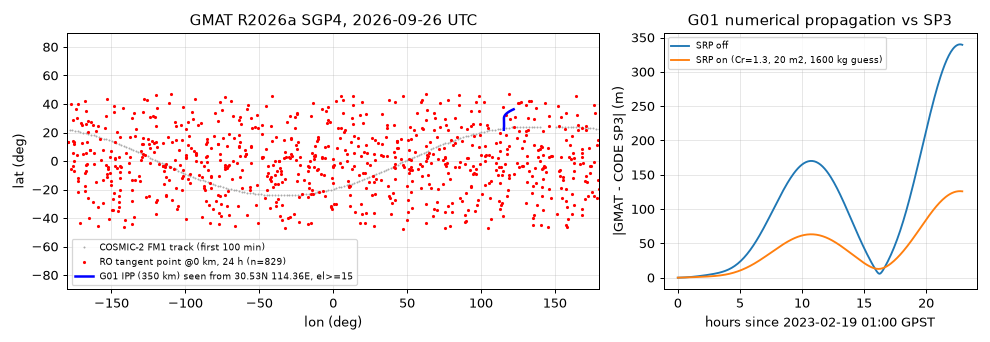

# GMAT：NASA 通用任务分析工具（轨道传播 → 星历/报告 → 给电离层用的卫星几何）

> 实测环境：Debian 13 x86_64，官方 Linux 包 **R2026a**（SourceForge `gmat-ubuntu-x64-R2026a.tar.gz`，sha256 前 12 位 `fe124b4a606b`，解压 663 MB，Build Date: Mar 30 2026），无 root、无 GUI，只用 `GmatConsole`。2026-09-26 02:00–02:10 EDT 实跑。
> **质检复跑通过**（2026-09-26 02:14–02:30 EDT，独立解压同一 R2026a 包到新目录复跑）：下载 401664992 B，sha256 前 12 位 `fe124b4a606b`，解压 663 MB，`ldd` 无缺库，Build Date Mar 30 2026，与文中一致。官方样例首行完全一致。实跑 A：用作者当时的 `tle_all.txt`（99 行），从本文代码块原样抽出 `gen_script.py` 与 `ro_body.script`，EXIT 0，用时 6.122 s。`c2e1_report.txt`（605220 B / 2882 行）与 `gps_ecef.txt`（7271286 B / 97 列）**逐字节相同**；`c2e1.oem` 为 242586 B，首行与文中一致；G01–WUH 窗口 11:53:46.694–16:51:11.522 完全一致。实跑 B：初值与 SP3 01:00 位置、13 点 8 次多项式速度逐位一致；有/无光压两次均 EXIT 0（0.372 s / 0.397 s）；自写比对脚本得 1 h/6 h/12 h/22.92 h 误差 0.94/44.64/155.06/339.42 m（无光压）和 0.57/18.87/58.16/125.88 m（有光压），与文中一致。坑 1/2/3/4/5/6/8 逐条复现，报错原文和怪起点 `25 Sep 2026 18:49:39.402` 均一致。修正：stdout 原样块漏了控制台模式一定会出现的 `libOVtoOFI did not open` 两行；坑 7 原说注释两行插件后就“不再打印”，实测仍报 `libOVtoOFI`，现改为注释三行；补充 276 个对齐历元的口径说明。未复跑：§3.1 `analyze.py`（文中只给了核心片段）、python-sgp4 互证、SPK `.bsp`。
> 许可：**Apache-2.0**（GitHub `nasa/GMAT`，★112；main `9363e12`，2026-09-25 18:22 EDT）。GitHub 只放源码，**二进制只在 SourceForge**。

## 1. 它解决什么问题（先把词讲清）

| 词 | 意思 | 在本仓的用处 |
| --- | --- | --- |
| 轨道传播（propagation） | 给定某时刻卫星位置速度，按力学模型算出之后任意时刻的位置 | 算 GPS/LEO 在你关心时段在哪 |
| TLE / SGP4 | 两行根数 + 配套解析模型；CelesTrak 免费下；精度通常只到公里级 | 快速拿 COSMIC-2、GPS 的“大概位置” |
| 数值积分 + 力模型 | 地球重力场、日月引力、光压（SRP）等逐步积分 | 从 SP3 精密初值外推，米～百米级 |
| 惯性系 / 地固系 | EarthMJ2000Eq（不随地球转）/ EarthFixed（随地球转，≈ITRF） | 算经纬高、仰角、IPP 必须用地固系 |
| 星历文件（ephemeris） | 按固定步长写出的轨道表；GMAT 可写 CCSDS-OEM、SPK（`.bsp`）、STK-TimePosVel、Code-500 | 交给别的程序插值 |
| RO（无线电掩星） | LEO 收到被地球大气“擦边”的 GNSS 信号；**切点**=信号直线离地最近点 | 判断掩星何时何地发生 |
| IPP（穿刺点） | 站→卫星视线与单层电离层（常取 350 km）的交点 | STEC→VTEC 的位置与映射函数 |

GMAT 本身**不读 RINEX、不算 TEC、不做掩星反演**；它负责“卫星在哪、谁看得见谁”。本篇把它接到 RO 切点和 IPP 计算上（后处理用十几行 numpy）。

## 2. 安装（官方 Linux 包，免编译）

```bash
mkdir -p ~/gmat && cd ~/gmat
curl -L -o gmat-ubuntu-x64-R2026a.tar.gz \
  "https://sourceforge.net/projects/gmat/files/GMAT/GMAT-R2026a/gmat-ubuntu-x64-R2026a.tar.gz/download"   # 约 401 MB
tar xzf gmat-ubuntu-x64-R2026a.tar.gz          # → GMAT/R2026a/{bin,data,samples,output,plugins,...}
cd GMAT/R2026a/bin && ldd ./GmatConsole-R2026a | grep "not found"   # 本机为空
./GmatConsole --help
```

实测 `--help` 尾部（原样）：

```text
Usage: One of the following
   GmatConsole
   GmatConsole ScriptFileName
   GmatConsole <option> <string>
...
   --run, -r <filename>          Runs the input script once, then exits
   --logfile, -l <filename>      Specify the log file (ignored in Console interactive mode)
   --verbose <on/off>            Dump info messages to screen during run (default is on)
```

同目录还有 `rhel7` 包、`GMAT-R2026a`（GUI，需要 X）、`gmatpy`（Python API，要 libpython3.12）。脚本一律 `GmatConsole --run xxx.script`。

冒烟：官方样例（SGP4 传播 1 天）

```bash
./GmatConsole --run ../samples/Ex_TLE_Propagation.script   # 输出写到 ../output/Ex_TLE_Propagation.txt
```

```text
===> Total Run Time: 0.047 seconds
ExampleSat.UTCGregorian    ExampleSat.X              ExampleSat.Y              ExampleSat.Z
04 May 2002 11:45:15.695   -6775.105759552147        -2396.512640028521        3.17775066150299
```

## 3. 实跑 A：COSMIC-2 FM1 + 32 颗 GPS（TLE/SGP4）→ 报告 + OEM + 可见窗口

TLE 取自 CelesTrak（2026-09-26 02:01 EDT 下载）：`FORMOSAT 7-1`（NORAD 44349，倾角 23.998°）+ `gps-ops` 组 32 颗，合并成 `tle_all.txt`（99 行）。

```bash
curl -s "https://celestrak.org/NORAD/elements/gp.php?NAME=FORMOSAT%207&FORMAT=tle" > f7.tle
curl -s "https://celestrak.org/NORAD/elements/gp.php?GROUP=gps-ops&FORMAT=tle"     > gps-ops.tle
(grep -A2 "FORMOSAT 7-1" f7.tle; cat gps-ops.tle) > tle_all.txt
```

33 颗星手写太长，用 Python 生成航天器块（`Id` 填 NORAD 号，**必须显式给同一 `Epoch`**，见坑 2）：

```python
# gen_script.py：tle_all.txt + ro_body.script → ro_ipp.script
import re
L = open('tle_all.txt').read().splitlines(); sats = []
for i in range(0, len(L), 3):
    m = re.search(r'PRN (\d+)', L[i]); sats.append(('G%02d' % int(m.group(1)) if m else 'C2E1', L[i+1][2:7]))
out = []
for g, norad in sats:
    out += [f"Create Spacecraft {g};", f"{g}.EphemerisName = '/abs/path/tle_all.txt';", f"{g}.Id = '{norad}';",
            f"{g}.DateFormat = UTCGregorian;", f"{g}.Epoch = '26 Sep 2026 00:00:00.000';"]
gps = [g for g, _ in sats if g != 'C2E1']
body = open('ro_body.script').read().splitlines()
body[body.index('%GPSREPORT')] = "GPSRF.Add = {C2E1.UTCModJulian, " + ', '.join(f'{g}.EarthFixed.{a}' for g in gps for a in 'XYZ') + "};"
open('ro_ipp.script', 'w').write('\n'.join(out + [l.replace('%ALLSATS', ', '.join(['C2E1'] + gps)) for l in body]) + '\n')
```

`ro_body.script`（纯 ASCII，**不能写中文注释**，见坑 1）：

```text
Create Propagator TLEProp;
TLEProp.Type = SPICESGP4;
TLEProp.InitialStepSize = 30;
Create ReportFile LEORF;
LEORF.Filename = '/abs/path/c2e1_report.txt';
LEORF.Precision = 12;
LEORF.Add = {C2E1.UTCGregorian, C2E1.UTCModJulian, C2E1.EarthFixed.X, C2E1.EarthFixed.Y, C2E1.EarthFixed.Z, C2E1.Earth.Latitude, C2E1.Earth.Longitude, C2E1.Earth.Altitude};
Create ReportFile GPSRF;
GPSRF.Filename = '/abs/path/gps_ecef.txt';
GPSRF.Precision = 12;
%GPSREPORT
Create EphemerisFile C2E1Eph;
C2E1Eph.Spacecraft = C2E1;
C2E1Eph.Filename = '/abs/path/c2e1.oem';
C2E1Eph.FileFormat = CCSDS-OEM;
C2E1Eph.CoordinateSystem = EarthMJ2000Eq;
C2E1Eph.StepSize = 60;
Create GroundStation WUH;
WUH.CentralBody = Earth;
WUH.StateType = Spherical;
WUH.HorizonReference = Ellipsoid;
WUH.Location1 = 30.53;
WUH.Location2 = 114.36;
WUH.Location3 = 0.03;
WUH.MinimumElevationAngle = 15;
Create ContactLocator CL01;
CL01.Target = G01;
CL01.Observers = {WUH};
CL01.Filename = '/abs/path/contact_G01_WUH.txt';
CL01.UseLightTimeDelay = true;
CL01.StepSize = 60;
BeginMissionSequence;
Propagate TLEProp(%ALLSATS) {C2E1.ElapsedDays = 1.0};
```

（`WUH` 只是一个自定义地面点 30.53°N 114.36°E，不是某个 IGS 站的精确坐标。）

```bash
python3 gen_script.py && time ./GmatConsole --run /abs/path/ro_ipp.script > ro_ipp.stdout 2>&1; echo EXIT $?
```

实测 stdout 关键行（原样，省略 SPICE 内核加载行）：

```text
libpython3.12.so.1.0: cannot open shared object file: No such file or directory
*** Library "../plugins/libPythonInterface_py312" did not open.
libmex.so: cannot open shared object file: No such file or directory
*** Library "../plugins/libMatlabInterface" did not open.
Skipping "../plugins/libOpenFramesInterface": GUI plugins are skipped in console mode
libOpenFramesInterface.so.R2026a: cannot open shared object file: No such file or directory
*** Library "../plugins/libOVtoOFI" did not open.
Successfully interpreted the script
Finding events for ContactLocator CL01 ...
Mission run completed.
===> Total Run Time: 6.789 seconds
*** GMAT Integration test (Console version) successful! ***
real	0m7.035s
EXIT 0
```

产物：`c2e1_report.txt` 605220 B / 2882 行（表头 + 24 h×30 s 共 2881 历元），`gps_ecef.txt` 7271286 B（97 列），`c2e1.oem` 242586 B，`contact_G01_WUH.txt` 207 B。

`c2e1_report.txt` 片段：

```text
C2E1.UTCGregorian          C2E1.UTCModJulian         C2E1.EarthFixed.X         C2E1.EarthFixed.Y         C2E1.EarthFixed.Z         C2E1.Earth.Latitude       C2E1.Earth.Longitude      C2E1.Earth.Altitude
26 Sep 2026 00:00:00.000   31309.5                   -5563.32508339            3074.82337895             2808.78879927             23.9702564576             151.070779389             574.78869892
26 Sep 2026 00:00:30.000   31309.5003472             -5660.08107291            2884.74676114             2817.09582379             24.0454939425             152.993640283             574.801634
```

`contact_G01_WUH.txt`（仰角 ≥15°）：

```text
Target: G01
Observer: WUH
Start Time (UTC)            Stop Time (UTC)               Duration (s)
26 Sep 2026 11:53:46.694    26 Sep 2026 16:51:11.522      17844.828007
Number of events : 1
```

`c2e1.oem` 头（CCSDS-OEM 1.0，`REF_FRAME = EME2000`，`TIME_SYSTEM = UTC`，`INTERPOLATION = LAGRANGE` 7 阶），数据行 = 时间 + X Y Z (km) + VX VY VZ (km/s)：

```text
2026-09-26T00:00:00.000  -5.778786789790471e+03   2.631757399133350e+03   2.823808694710435e+03  -3.001154462871645e+00  -6.950455505708129e+00   3.352243813822059e-01
```

独立核对：python-sgp4 2.27 用同一 TLE 算 00:00 UTC、只做 GMST 旋转（不含极移）得 C2E1 地固坐标 `(-5563.343, 3074.802, 2808.777) km`，与 GMAT 差 **0.03 km**——说明 GMAT 的 SGP4 与地固转换没用错。

### 3.1 后处理：RO 切点 + 站星 IPP（`analyze.py`，只依赖 numpy）

核心几何如下（numpy 片段 + 两行公式；本机完整脚本约 70 行，另含 WGS84 ECEF↔经纬高互转与 ENU 旋转）：

```python
# RO：LEO→GPS 直线上离地心最近的点就是切点；参数 t 在 (0,1) 之间才表示线段被地球“挡在中间”
d  = rG - rL[:, None, :]                                    # (历元, 卫星, 3)  km，地固系
t  = -np.einsum('ij,ikj->ik', rL, d) / np.einsum('ikj,ikj->ik', d, d)
tp = rL[:, None, :] + t[..., None] * d                      # 切点 ECEF → WGS84 高度 h_tan
# h_tan 相邻两历元跨过 0 km = 一次掩星（下降=set，上升=rise），线性插值得时刻与切点经纬度
# IPP：站 ENU 下算仰角 E/方位 A，单层 H=350 km，Re=6371 km
psi = np.pi/2 - E - np.arcsin(Re/(Re+H)*np.cos(E))           # 站与 IPP 的地心角
ipp_lat = asin(sin φ cos ψ + cos φ sin ψ cos A);  ipp_lon = λ + asin(sin ψ sin A / cos ipp_lat)
mf = 1/np.sqrt(1 - (Re*np.cos(E)/(Re+H))**2)                # STEC = mf × VTEC
```

实测输出（原样）：

```text
历元 2881 个, GPS 32 颗, GMAT MJD 31309.5 = 标准 MJD 61309.0
24 h 内切点穿过 0 km 的 GPS 掩星事件: 829 次 (set 415 / rise 414)
前 5 个:  分钟  卫星  类型  切点纬度  切点经度
     2.37  G23  set     37.32    137.40
     4.00  G08  rise    39.71   -172.88
     7.27  G04  rise    15.31   -157.51
     8.25  G29  set     22.76    157.22
    11.16  G12  set     -0.29     63.07
第 1 个事件前 30 min 内切点高度(km, 每 30 s): [232.6 187.6 140.5  91.1  39.8 -13.6]
G01 仰角≥15° 历元 595 个，首 11.900 h / 末 16.850 h (UTC 当日小时)
  时刻h   仰角    方位   IPP纬度  IPP经度  映射函数
  11.900  15.08  172.87   21.919  115.516  2.482
  14.375  69.93   91.66   30.492  115.620  1.058
  16.850  15.07   46.40   36.285  122.151  2.483
```

两条互证：自算 G01 可见段 11:54–16:51（30 s 采样）与 GMAT ContactLocator 11:53:46.694–16:51:11.522 一致；切点高度每 30 s 降约 50 km，即一次掩星穿过电离层 F 区到地面只有几分钟。



**诚实边界**：829 次是**纯几何**（地球遮挡直线），没算 COSMIC-2 天线视场（真实只收前/后向）、没算 GLONASS、没做信号强度门限，不能当作实际廓线数。真实掩星产品看 [awsgnssroutils](./awsgnssroutils.md) / [pysatcdaac](./pysatcdaac.md)。

## 4. 实跑 B：GPS G01 从 SP3 精密初值数值积分，与 CODE 终轨逐历元比

初值：CODE MGEX 终轨 `COD0MGXFIN_20230500000_01D_05M_ORB.SP3.gz`（2023-02-19，5 min，IGS20）里 G01 在 01:00 GPST 的地固位置；速度用 ±30 min 13 点 8 次多项式求导（SP3 无速度）。GMAT 时间用 TAI = GPST + 19 s。

```text
% G01: integrate 23 h from CODE SP3 Earth-fixed state, report every 300 s
Create Spacecraft G01;
G01.DateFormat = TAIGregorian;
G01.Epoch = '19 Feb 2023 01:00:19.000';
G01.CoordinateSystem = EarthFixed;
G01.DisplayStateType = Cartesian;
G01.X = 22337.747965;
G01.Y = 14594.580398;
G01.Z = 1619.847496;
G01.VX = 0.103112473;
G01.VY = 0.272457799;
G01.VZ = -3.205684098;
G01.DryMass = 1600;
G01.Cr = 1.3;
G01.SRPArea = 20;

Create ForceModel FM;
FM.CentralBody = Earth;
FM.PrimaryBodies = {Earth};
FM.PointMasses = {Sun, Luna};
FM.SRP = On;
FM.RelativisticCorrection = On;
FM.GravityField.Earth.Degree = 12;
FM.GravityField.Earth.Order = 12;
FM.GravityField.Earth.PotentialFile = 'EGM96.cof';
FM.GravityField.Earth.TideModel = 'SolidAndPole';

Create Propagator Prop;
Prop.FM = FM;
Prop.Type = PrinceDormand78;
Prop.InitialStepSize = 60;
Prop.Accuracy = 1e-12;
Prop.MaxStep = 300;

Create ReportFile RF;
RF.Filename = '/abs/path/gps_prop.txt';
RF.Precision = 14;
RF.WriteHeaders = true;

Create EphemerisFile Eph;
Eph.Spacecraft = G01;
Eph.Filename = '/abs/path/G01_gmat.oem';
Eph.FileFormat = CCSDS-OEM;
Eph.CoordinateSystem = EarthFixed;
Eph.StepSize = 300;

Create Variable k;
BeginMissionSequence;
Report RF G01.TAIModJulian G01.EarthFixed.X G01.EarthFixed.Y G01.EarthFixed.Z G01.Earth.Altitude;
For k = 1:276;
   Propagate Prop(G01) {G01.ElapsedSecs = 300};
   Report RF G01.TAIModJulian G01.EarthFixed.X G01.EarthFixed.Y G01.EarthFixed.Z G01.Earth.Altitude;
EndFor;
```

（`Cr/SRPArea/DryMass` 是**粗估的示意值**，不是 GPS 卫星的真实参数。）另存一份 `FM.SRP = Off` 对照。两次均 `EXIT 0`，`Total Run Time` 0.379 s / 0.391 s。与 SP3 同历元比（原样）：

```text
gps_prop_nosrp.txt     对齐历元 276  3D差(m): 1h      0.94  6h     44.64  12h    155.06  末(22.92h)   339.42
gps_prop.txt           对齐历元 276  3D差(m): 1h      0.57  6h     18.87  12h     58.16  末(22.92h)   125.88
```

（对齐只用 2023-02-19 当天的 SP3 历元：01:00 起点到 23:55 共 276 个；SP3 文件末尾还有 2023-02-20 00:00 一个历元，算上它则 23.00 h 处为 338.68 m / 125.63 m。）

读法：光压一项就让 23 h 误差从 339 m 降到 126 m；剩余主要是光压模型太粗（盒翼/ECOM 类经验模型 GMAT 默认没有）和初速度来自多项式求导。结论：GMAT 数值传播适合**几何规划/可见性**，做不到 IGS 终轨的 cm 级；要精密轨道直接用 SP3（[sp3](./sp3.md)、[gnssanalysis](./gnssanalysis.md)）。

## 5. 常用字段速查

| 对象.字段 | 取值举例 | 说明 |
| --- | --- | --- |
| `Sat.EphemerisName` + `Sat.Id` | TLE 文件路径 + NORAD 号或 line-0 名 | 配 `Propagator.Type = SPICESGP4` |
| `Sat.DateFormat` / `Sat.Epoch` | `UTCGregorian` / `'26 Sep 2026 00:00:00.000'` | 也有 `TAIGregorian`、`UTCModJulian` 等 |
| `Sat.CoordinateSystem` | `EarthMJ2000Eq`（默认）/ `EarthFixed` | SP3 初值用 `EarthFixed` |
| `ForceModel.GravityField.Earth.PotentialFile` | `EGM96.cof` `JGM3.cof` `JGM2.cof` | 在 `data/gravity/earth/` |
| `ForceModel.SRP` / `PointMasses` / `Drag.AtmosphereModel` | `On` / `{Sun, Luna}` / `MSISE90`、`JacchiaRoberts` | LEO 要开阻力并给空间天气文件 |
| `Propagator.Type` | `PrinceDormand78` `RungeKutta89` `SPICESGP4` | `Accuracy`、`MaxStep` 控精度 |
| `ReportFile.Add` | `Sat.EarthFixed.X`、`Sat.Earth.Latitude/Longitude/Altitude`、`Sat.UTCModJulian` | 高度为椭球高，km |
| `EphemerisFile.FileFormat` | `CCSDS-OEM` `SPK` `STK-TimePosVel` `Code-500` | `StepSize` 秒；SPK 实测需惯性系 `EarthMJ2000Eq`（G01 23 h → 24576 B `.bsp`） |
| `GroundStation.Location1/2/3` | 纬度、经度（°）、高（km） | `StateType = Spherical` 时 |
| `ContactLocator.Target/Observers/StepSize` | 一颗星 / `{站}` / 60 | 输出可见起止时刻 |

## 6. 坑（现象 → 原因 → 修复）

1. **现象**：`contains characters outside of the ASCII character set`，`EXIT 1`。**原因**：脚本里有中文注释（任何非 ASCII 都拒）。**修复**：`grep -nP '[^\x00-\x7F]' my.script` 找出后删改成英文。
2. **现象**：多星 SGP4 打出 `Epochs do not match`，但仍 `Mission run completed`、EXIT 0，报告从 `25 Sep 2026 18:49:39.402` 这种怪时刻开始。**原因**：没设 `Epoch` 时起点取第一颗星自己的 TLE 历元，各星不同。**修复**：每颗星都加 `Sat.DateFormat = UTCGregorian; Sat.Epoch = '26 Sep 2026 00:00:00.000';`。
3. **现象**：报告里 `UTCModJulian` = 31309.5，当标准 MJD 用会落到 1944 年。**原因**：GMAT 的 ModJulian 零点是 1941-01-05 12:00，比标准 MJD 小 29999.5。**修复**：`python3 -c "print(31309.5+29999.5)"` → 61309.0（=2026-09-26）。
4. **现象**：`The field name "Step" on object "CL01" is not permitted`。**原因**：ContactLocator 的步长字段叫 `StepSize`。**修复**：`sed -i 's/\.Step = /.StepSize = /' my.script`。
5. **现象**：报告第 1、3 行都是表头，`np.loadtxt` 报错。**原因**：`ReportFile` 初始化写一次表头，`Report` 命令第一次调用又写一次。**修复**：读时跳过以对象名开头的行：`grep -v '^G01\.' gps_prop.txt > clean.txt`。
6. **现象**：OEM 里 `OBJECT_ID = SatId`、地固系输出 `REF_FRAME = TDR`、时间比 SP3 早 18 s。**原因**：没设 `Sat.Id` 用默认值；GMAT 地固轴名叫 TDR；OEM 默认写 UTC（GPST−18 s）。**修复**：加 `G01.Id = 'G01';`（实测 OEM 变成 `OBJECT_ID = G01`），下游按 UTC 读、需要 GPST 再 +18 s。
7. **现象**：每次启动都打印 `libpython3.12.so.1.0 ... did not open`、`libmex.so ... did not open`、`libOpenFramesInterface.so.R2026a ... libOVtoOFI did not open`。**原因**：Python/MATLAB 插件缺运行库；`libOVtoOFI` 依赖控制台模式下被跳过的 GUI 插件 OpenFrames。三者都与普通脚本无关。**修复**：不用可忽略；想清掉就注释这三行插件（质检实测：只注释前两行时 `libOVtoOFI` 仍会报，三行都注释后只剩一行 `Skipping ... GUI plugins` 提示，脚本照常跑）：`sed -i 's|^PLUGIN *= ../plugins/libPythonInterface_py312|# &|; s|^PLUGIN *= ../plugins/libMatlabInterface|# &|; s|^PLUGIN *= ../plugins/libOVtoOFI|# &|' bin/gmat_startup_file.txt`。
8. **现象**：`"22337.747965;  G01.Y = 14594.580398" is not a valid RHS of assignment`。**原因**：一行只能写一条赋值，`;` 后面的内容被当成同一个右值。**修复**：拆成一行一条：`sed -i 's/;  */;\n/g' my.script`。
9. **现象**：`Filename = 'a.txt'` 找不到输出。**原因**：相对路径落在 `GMAT/R2026a/output/`，不在当前目录。**修复**：`ls ../output/` 查看，或脚本里一律写绝对路径。

## 7. 怎么读结果、接到哪

- 报告列单位：位置 km、速度 km/s、角度 °、`Earth.Altitude` 为 WGS84 椭球高 km。地固列可直接喂 [pymap3d](./pymap3d.md) 算 ENU/AER。
- RO：切点跨 0 km 的时刻与经纬度就是“掩星发生在哪”；与真实产品对照走 [awsgnssroutils](./awsgnssroutils.md)（calibratedPhase）、[pysatcdaac](./pysatcdaac.md)（ionPrf）、[cosmic-crunch](./cosmic-crunch.md)（COSMIC-1 L2）。概念课：[07 测高仪与掩星](../tutorials/07-ionosonde-occultation.md)。
- IPP：`ipp_lat/ipp_lon/mf` 对应 [gnss-tec](./gnss-tec.md)、[pytecgg](./pytecgg.md) 里 STEC→VTEC 的那一步；读 GIM 在 IPP 处取值见 [ionex-gim](./ionex-gim.md)，课 [01](../tutorials/01-ionosphere-tec-basics.md)/[02](../tutorials/02-gnss-dualfreq-tec.md)。
- 磁坐标（IPP 转磁纬）接 [apexpy](./apexpy.md)；时间系统换算接 [hifitime](./hifitime.md)。

## 8. 边界

- 没跑 GUI、`gmatpy`（缺 libpython3.12）、MATLAB 接口、轨道确定（`libGmatEstimation`/EKF 插件在，未测）。
- 实跑 A 用的是当天 TLE，结果只在 TLE 精度（公里级）内有效；实跑 B 的光压参数是猜的，数字只说明量级和“开/关光压”的差别。
- GMAT 不含电离层/掩星反演模型，所有电离层相关量都在 GMAT 外面用 numpy 算。
