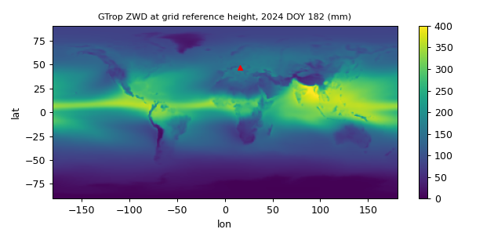

# GTrop · 全球对流层延迟 + 加权平均温度经验模型操作手册

目录：[`PROJECTS.json`](../../PROJECTS.json) → `GTrop` · 上游 <https://github.com/sun1753814280/GTrop> · tip **`2b31ae7`**（2019-07-10，此后无提交）· ★**5** · forks **1** · **仓内无 LICENSE 文件**（GitHub API `license=null`，即默认保留所有权利；引用论文，不要转发 `coefficient.mat`）· 语言 **MATLAB**（3 个 `.m` 共约 190 行 + `coefficient.mat` **18343857** B，MATLAB 5.0 MAT-file，2019-01-27 生成）

本机验证（**2026-09-26 01:49–01:58 EDT**）：GNU Octave **9.4.0**，**未装 MATLAB**。上游 `example.m` 在 Octave 原样跑通（0.96 s）；GRAZ 2024 DOY 1 端到端、高度/季节扫描、8 类错误输入都在本机跑过，stdout 全部原样贴在下文。 **质检复跑通过**（2026-09-26 02:00–02:05 EDT，独立 clone + Octave 9.4.0）：tip `2b31ae7`（全历史 7 commit）/★5/3 个 `.m` 194 行/`coefficient.mat` 18343857 B 头 `MATLAB 5.0 MAT-file, Platform: PCWIN64, Created on: Sun Jan 27 15:12:48 2019`；`example` 三行、§4b 全部 15 行、全球 DOY182 统计（ZWD 1.3–418.9 mm、Tm 221.64–296.50 K、h0 −0.111–5.359 km）、Π 0.1521/0.1515、§4d 引用的 GPT3/VMF3 数与 [tu-wien](./tu-wien-vmf-gpt-codes.md) 页一致、PWV 8.8/15.9 复算一致、坑 1–4/6/7 **逐字复现**。修：§7 南极点例补 `lon=15`（原省略经度；`%.2f` 下 Tm **240.75**）。无需网络、无需 ERA5/CDS 账号（系数已预先拟合好放在仓内）。

> 岗位：**没有任何气象数据**时，给任意经纬度/高度/日期一个 ZHD、ZWD、Tm 的**气候学先验**（PPP 对流层初值、PWV 反演里的 Tm）。冲突时：**源码 > 本文 > 上游 README**。  
> 同类经验模型官方源码（GPT3）与实测 NWM 格网（VMF3）→ [tu-wien-vmf-gpt-codes](./tu-wien-vmf-gpt-codes.md)；ZTD 投影成斜路径 → [std-swd-calc](./std-swd-calc.md)；沿 NWM 射线积分 → [radiate](./radiate.md)；AI 格网降尺度 → [tropds](./tropds.md)。

## 1. 用途与边界

**先弄懂 6 个词：**

| 术语 | 含义 | 本文 GRAZ 实测量级 |
| --- | --- | --- |
| ZTD | 天顶总延迟 = ZHD + ZWD，信号穿过中性大气多走的路程 | **2250.3** mm |
| ZHD（干/静力学延迟） | 基本只由地面气压决定，~2.3 m，随高度指数下降 | **2186.2** mm |
| ZWD（湿延迟） | 由水汽决定，几 cm 到 40 cm，变化快、最难建模 | **64.1** mm |
| Tm（加权平均温度） | 以水汽密度加权的大气柱平均温度；把 ZWD 换成 PWV 的关键参数 | **266.51** K |
| PWV（可降水量） | 整柱水汽凝结成液态水的高度，`PWV = Π(Tm)·ZWD`，Π≈0.15 | **9.7** mm |
| 格网插值 + 高程归算 | 模型参数存在 1°×1° 格点及其参考高度 h0 上；先把 4 个邻点各自归算到测站高度，再双线性插值 | 邻点 h0 **0.469–0.870** km，站高 0.538 km |

**做（读 `GTrop.m`/`GTrop_grid.m` 得出，非 README）：**

- 每个格点 37 个数：ZHD/ZWD/Tm 在参考高度处的值各 6 个系数，三者的"高度递减率"各 6 个系数，外加格点高度 h0（km）
- 每组 6 系数 = `线性趋势·Tr + 常数 + 年周期(cos,sin) + 半年周期(cos,sin)`，`Tr = year + doy/365.25 − 1980`（**带长期趋势**，GPT3 没有）
- 高程归算：`ZHD = ZHD0·(1 − β_h·(h − h0))^5.225`，ZWD 同形，`Tm = Tm0 − β_T·(h − h0)`
- 4 邻格点各算一次再双线性插值（落在格线上时退化成线性/直接取值）

**不做：**

- **无日内变化**：输入只有 `doy`，没有小时；`doy=1.5` 与 `doy=1` 只差 0.1 mm（坑 6）
- 不出映射函数、梯度、气压/温度/水汽压（要这些用 GPT3）
- 不算 PWV（本文 §4c 用 Tm 自己算）；不读任何实测数据；不支持向量化输入

## 2. 安装

```bash
git clone --depth 1 https://github.com/sun1753814280/GTrop && cd GTrop   # 36 MB（系数文件 18 MB）
sudo apt-get install -y octave          # 或用 MATLAB；无工具箱依赖
octave --no-gui --quiet --eval "example"
```

本机 stdout（`real 0m0.960s`）：

```text
warning: function /tmp/GTrop/example.m shadows a core library function
ZHD is 2015.7722 mm
ZWD is 63.2508 mm
Tm is 277.196 K
```

第一行警告是因为 Octave 自带同名 `example` 函数，无害（坑 8）。上游 README 未给期望值，以上即本机基线（示例点 24.4333°N 54.65°E，1.1809 km，2018 DOY 1）。

## 3. 函数签名与字段

`[zhd, zwd, tm] = GTrop(lat, lon, h, year, doy, coefficient)`

| 参数 | 单位 / 取值 | 注意 |
| --- | --- | --- |
| `lat` | **度**，[-90, 90]，椭球纬度 | 传弧度不会报错，结果悄悄错（坑 3） |
| `lon` | **度**，**[-180, 180]** | 传 0–360 的 195° 直接越界报错（坑 2） |
| `h` | **km**，椭球高 | 传米 → 复数（坑 1） |
| `year` | 整年，如 2024 | 参与 `Tr` 长期趋势项 |
| `doy` | 年积日 1–366 | 小数可传，但无日内项 |
| `coefficient` | `load('coefficient.mat')` 得到的 `181×361×37 double` | 必须先 `load`；函数内部不读文件 |
| 输出 `zhd` / `zwd` | **mm** | GPT3/VMF3 页面全是 **m**，对比时要 ÷1000 |
| 输出 `tm` | K | |

`coefficient(i,j,k)`：`i = lat + 91`（-90…90，步长 1°），`j = lon + 181`（-180…180），第三维 1–6 ZHD、7–12 ZWD、13–18 Tm、19–24/25–30/31–36 三者递减率、37 格点高度 km。本机全球统计（DOY 182、格点高度处）：`ZWD 1.3–418.9 mm；Tm 221.64–296.50 K；h0 −0.111–5.359 km`。

## 4. 端到端（本机 · GRAZ 2024-01-01，与 TU Wien 页同站同日）

### 4a. 脚本

在仓目录新建 `run_graz.m`（坐标取自 [tu-wien-vmf-gpt-codes](./tu-wien-vmf-gpt-codes.md) 的 `gnss.ell`：47.0671°N 15.4935°E 538.30 m）：

```matlab
load('coefficient.mat');
printf('coefficient size = %s, class=%s\n', mat2str(size(coefficient)), class(coefficient));
lat=47.0671; lon=15.4935; h=0.53830; year=2024; doy=1;
tic; [zhd,zwd,tm]=GTrop(lat,lon,h,year,doy,coefficient); t=toc;
printf('GRAZ 2024 doy1  ZHD=%.1f mm  ZWD=%.1f mm  ZTD=%.1f mm  Tm=%.2f K  (%.4f s)\n',zhd,zwd,zhd+zwd,tm,t);
for B=[47 48], for L=[15 16], printf('node %d,%d  h0=%.4f km\n',B,L,coefficient(B+91,L+181,37)); end, end
k2p=0.221; k3=3739; Rv=461.5; rho=1000;   % SI: K/Pa, K^2/Pa (Bevis 1994)
Pi=1e6/(rho*Rv*(k3/tm+k2p)); printf('Pi=%.4f  PWV=%.1f mm\n',Pi,Pi*zwd);
for hh=[0 0.5383 1 2 3], [a,b,c]=GTrop(lat,lon,hh,year,doy,coefficient); printf('h=%.4f km  ZHD=%.1f ZWD=%.1f Tm=%.2f\n',hh,a,b,c); end
for d=[1 91 182 274], [a,b,c]=GTrop(lat,lon,h,year,d,coefficient); printf('doy=%3d  ZHD=%.1f ZWD=%.1f ZTD=%.1f Tm=%.2f\n',d,a,b,a+b,c); end
```

### 4b. 本机 stdout

`octave --no-gui --quiet run_graz.m`（`real 0m0.607s`，单点调用 1.8 ms）：

```text
warning: function /tmp/GTrop/example.m shadows a core library function
coefficient size = [181 361 37], class=double
GRAZ 2024 doy1  ZHD=2186.2 mm  ZWD=64.1 mm  ZTD=2250.3 mm  Tm=266.51 K  (0.0018 s)
node 47,15  h0=0.8697 km
node 47,16  h0=0.4980 km
node 48,15  h0=0.7077 km
node 48,16  h0=0.4690 km
Pi=0.1521  PWV=9.7 mm
h=0.0000 km  ZHD=2334.3 ZWD=80.5 Tm=269.00
h=0.5383 km  ZHD=2186.2 ZWD=64.1 Tm=266.51
h=1.0000 km  ZHD=2065.4 ZWD=52.4 Tm=264.37
h=2.0000 km  ZHD=1822.0 ZWD=32.8 Tm=259.74
h=3.0000 km  ZHD=1602.5 ZWD=19.6 Tm=255.11
doy=  1  ZHD=2186.2 ZWD=64.1 ZTD=2250.3 Tm=266.51
doy= 91  ZHD=2179.8 ZWD=79.5 ZTD=2259.3 Tm=270.36
doy=182  ZHD=2183.3 ZWD=164.6 ZTD=2347.9 Tm=280.92
doy=274  ZHD=2185.8 ZWD=125.5 ZTD=2311.3 Tm=276.72
```

### 4c. 怎么读

- **高程归算是最大的量**：同一点从 0 升到 3 km，ZHD 少 732 mm、ZWD 少 61 mm；低层每 1 km ZHD 约少 220–275 mm。4 个邻点 h0 相差 400 m，不归算直接插值 ZHD 可差到约 100 mm
- **季节看 ZWD**：GRAZ 1 月 64 mm → 7 月 165 mm，ZHD 全年只动 6 mm——冬季先验误差主要在湿延迟
- **PWV**：`Π = 10⁶ / (ρw·Rv·(k3/Tm + k2'))`，本机 Π=0.1521 → PWV 9.7 mm。Tm 差 1 K，Π 只变约 0.0006（Tm=265.49 K 时 Π=0.1515），所以 Tm 用经验模型足够，**ZWD 必须来自实测**（PPP 估计值）
- 输出是**日气候值**，不是当天天气

### 4d. 与 GPT3 / VMF3 对照（同站同日 2024-01-01）

GTrop 行本机 §4b；其余三行摘自 [tu-wien-vmf-gpt-codes §4](./tu-wien-vmf-gpt-codes.md)（同一台机器，00 UTC）。PWV 列用本页 Π 公式、各自 Tm（VMF3 无 Tm，借 GTrop 266.51 K）本机算出。

| 来源 | 类型 | ZHD [m] | ZWD [m] | ZTD [m] | Tm [K] | PWV [mm] |
| --- | --- | ---: | ---: | ---: | ---: | ---: |
| **GTrop**（1°，日分辨率） | 经验 | 2.1862 | 0.0641 | 2.2503 | 266.51 | 9.7 |
| GPT3 5°（`gpt3_5` + Saastamoinen/Askne） | 经验 | 2.1847 | 0.0580 | 2.2427 | 265.49 | 8.8 |
| VMF3 站点文件 00 UTC | NWM | 2.1686 | 0.1047 | 2.2733 | — | 15.9 |
| VMF3 1° 格网 00 UTC | NWM | 2.1677 | 0.1015 | 2.2693 | — | — |

读法：两个经验模型的 ZTD 相差 7.6 mm，都比当天 NWM 少 2–3 cm，差距几乎全在湿延迟（GTrop 少 40.6 mm）。这就是为什么 GTrop/GPT3 只能当先验或无数据时的兜底，PPP 里 ZWD 仍要估计。

| 维度 | GTrop | GPT3（[tu-wien-vmf-gpt-codes](./tu-wien-vmf-gpt-codes.md)） | VMF3 格网 |
| --- | --- | --- | --- |
| 输入 | lat/lon/h/年/doy | MJD/lat/lon/h | 需下载 6 h 格网文件 |
| 时间分辨率 | 日（无日内项）+ 线性趋势 | 年/半年周期（`gpt3_5` 无日内项） | 6 h 实况 |
| 直接给 ZHD/ZWD | 是（mm） | 否，给 p/e/Tm/λ，再代公式 | 是（m） |
| Tm | 是 | 是 | 否 |
| 映射函数/梯度 | 否 | ah/aw + 梯度 | ah/aw |
| 语言 | MATLAB/Octave | MATLAB/Fortran/Python | 数据 + MATLAB 读取 |
| 许可 | 无 LICENSE | 源码无许可证文本；数据 CC BY 4.0 | CC BY 4.0 |

## 5. 批量与向量化

`GTrop` 里的 `if B1==B2&&L1==L2` 只接受标量，向量输入会报错（坑 4）。批量写法：

```matlab
load('coefficient.mat');
lat=[47.0671 30.5]; lon=[15.4935 114.3]; h=[0.5383 0.03];
[zhd,zwd,tm] = arrayfun(@(a,b,c) GTrop(a,b,c,2024,1,coefficient), lat, lon, h);
```

全球出图：格点高度处（`h=h0`，归算因子=1）直接用系数算 1 行矩阵运算即可。本机 DOY 182 ZWD（红三角 GRAZ）：



## 6. 坑（全部本机复现）

1. **现象** 输出一串复数，`ZHD=-608579420.6889-519775928.7809i`，`Tm=-2223.2677` → **原因** `h` 传了米（538.30），`(1−β(h−h0))` 变负再开 5.225 次方 → **修复** `[zhd,zwd,tm]=GTrop(lat,lon,h_m/1000,year,doy,coefficient)`
2. **现象** `coefficient(_,376,_): out of bound 361 (dimensions are 181x361x37)` → **原因** 经度用了 0–360（195°），索引 `lon+181` 越界 → **修复** `lon = mod(lon+180,360)-180;`（195° → −165°，本机可算）
3. **现象** 无报错但 ZWD=248.5 mm、Tm=285.08 K（GRAZ 冬季不可能） → **原因** 经纬度传了弧度，实际算的是 (0.82°N, 0.27°E) 赤道几内亚湾 → **修复** `GTrop(rad2deg(lat),rad2deg(lon),h,year,doy,coefficient)`
4. **现象** `=: nonconformant arguments (op1 is 1x2, op2 is 2x2)` → **原因** 传了向量，函数只支持标量 → **修复** 用 §5 的 `arrayfun(@(a,b,c) GTrop(a,b,c,2024,1,coefficient), lat, lon, h)`
5. **现象** 和 GPT3/VMF3 比差了 1000 倍 → **原因** GTrop 输出 **mm**，TU Wien 系列全部 **m** → **修复** `ztd_m = (zhd+zwd)/1000;`
6. **现象** 想要 00/06/12/18 UTC 的变化，结果 `doy=1.5: ZWD=64.0` vs `doy=1: 64.1` 几乎不变 → **原因** 模型只有年/半年项，没有日内项 → **修复** 需要亚日分辨率改用 VMF3 格网：`curl -fsSL -O https://vmf.geo.tuwien.ac.at/trop_products/GRID/1x1/VMF3/VMF3_OP/2024/VMF3_20240101.H06`
7. **现象** `h=12 km` 时 `ZWD=1.7498e-05`、ZHD=426.0 mm，看似合理却无依据 → **原因** 格点 h0 最高 5.359 km，更高属于外推；递减率公式再往上会让底数为负、出复数 → **修复** 调用前 `assert(h <= 6, 'GTrop: 高空外推');`，飞行器/探空用射线追踪（[radiate](./radiate.md)）
8. **现象** 每次运行首行 `warning: function .../example.m shadows a core library function`（同目录 `grid.m` 也会 shadow） → **原因** Octave 自带 `example()`/`grid()`，仓内同名脚本遮蔽它们 → **修复** `mv example.m gtrop_example.m && octave --no-gui --quiet gtrop_example.m`
9. **现象** 想把系数随自己的软件发布 → **原因** 仓内无 LICENSE（API `license=null`），默认保留所有权利 → **修复** 只在文档里写获取方式并引用论文：`git clone https://github.com/sun1753814280/GTrop`；再分发前联系作者

## 7. 诚实边界

- 本页所有 GTrop 数字均为本机 Octave 9.4.0 输出；**未在 MATLAB 上交叉验证**，但代码无 MATLAB 专有函数，`example.m` 在 Octave 原样跑通
- 系数的来源资料、拟合年份以论文题目为准（"atmospheric reanalysis data from 1979 to 2017"），仓内**没有**拟合脚本，无法本机重训或更新到 2017 年以后；2024 年的值依赖线性趋势外推
- 精度只做了单站单日对照（§4d），不是统计验证；需要统计精度请读原论文
- 未测极点（lat=±90 时 `B1==B2` 分支）以外的边界；`lat=-89.5, lon=15, h=2.8 km`（2024 DOY1）本机得 `ZHD=1564.2 ZWD=6.6 Tm=240.75`，量级合理

## 8. 选型

| 需求 | 用 |
| --- | --- |
| 无数据、要 ZHD/ZWD/Tm 一行出（MATLAB） | **GTrop** |
| 要映射函数 ah/aw、梯度、p/T/e，或需要 Fortran/Python | GPT3（[tu-wien-vmf-gpt-codes](./tu-wien-vmf-gpt-codes.md)） |
| 要当天真实 ZTD 先验（6 h） | VMF3 格网/站点文件（同上页） |
| 已有 ZTD，要斜路径湿延迟 | [std-swd-calc](./std-swd-calc.md) |
| 粗格网 ZHD/ZWD 提高分辨率（AI） | [tropds](./tropds.md) |
| ZTD 本身从 GNSS 观测估计 | [pride-pppar](./pride-pppar.md) / [ginan](./ginan.md) / [rtklib](./rtklib.md) |
