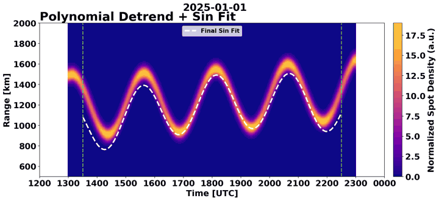

# hamsci-lstid-detection · 业余无线电 HF spot 跳距边缘 → LSTID 正弦拟合操作手册

目录：上游 <https://github.com/HamSCI/hamsci_LSTID_detection>（HamSCI / NASA SWO2R 团队，Frissell W2NAF 等）· tip **`8c43cd2`**（2026-05-14）· 无 PyPI、无 tag（`setup.py` 写 0.1，包名 `hamsci_LSTID_detect`，只打包 `scripts/`）· **MIT**（Copyright 2024 Nathaniel Frissell）· ★7 · Zenodo DOI 10.5281/zenodo.13630866。

> 本文实测：2026-09-26 01:19–01:32 EDT，Debian 本机，`uv` 建 **Python 3.11.16** venv，按 `requirements.txt` 精确钉版（numpy 1.26.4、polars 1.35.1、cartopy 0.24.1、scipy 1.13.1、statsmodels 0.14.2）。
> 冲突时：**本机源码 > 上游 README > 本文**。

## 1. 它解决什么问题

**LSTID（大尺度行进式电离层扰动）**：周期约 1–3 h、波长上千 km 的电离层波动，常在磁暴后或冬季白天出现（尺度口径见课 [22](../tutorials/22-tid-traveling-disturbances.md) §4）。GNSS 看 LSTID 的做法是 dTEC 去趋势（[gnss-tec](./gnss-tec.md)），本仓库换了一种观测手段：**业余无线电 HF 通联报告（spot）**。

- **spot**：一条记录“发射台 A 的信号被接收台 B 在频率 f 收到”。来源有 **RBN**（Reverse Beacon Network，CW 自动解码）、**PSKReporter**（FT8/FT4 等数字模式）和 **WSPRNet**（WSPR 弱信号信标）。CEDAR Madrigal 按天汇成 HDF5（仪器号 **8308**，“Amateur Radio Signal Report”）。每行有收发台经纬度、`tfreq`（Hz）、`pthlen`（大圆距离 km）、`latcen/loncen`（路径中点）、`ssrc`（来源）。
- **跳距（skip distance）**：HF 靠 F 层反射。离发射台太近时入射角过陡，信号穿透电离层回不来，形成一片收不到的“寂静区”。能收到天波的最近距离就是跳距。F 层电子密度越高，跳距越短。
- **LSTID 在这里的样子**：LSTID 让 F 层密度和高度周期性起伏，所以某个频段（默认 14 MHz）spot 的“距离–时间热图”下沿会随之**上下摆动**。本仓库的做法是：把 spot 装箱成热图 → 找出下沿（edge）→ 用二次多项式去掉日变化趋势 → 在 1–4.5 h 带通内拟合一条正弦。拟合周期 `T_hr` 和振幅 `amplitude_km` 就是 LSTID 的特征量。
- 它**不**给波长、传播方向或相速度。单一热图只有时间和距离两个维度，没有空间阵列可用。多站测向请看 PROJECTS 里的 Grape 多普勒类项目。

**管线 5 步**（`run_LSTID_detection.py::process_one_day`，每天一个进程）：

| 步 | 模块 | 做什么 |
| --- | --- | --- |
| 1 | `hdf5_loader.HDF5PolarsLoader` | 按 50 万行分块读 HDF5，用 polars 过滤区域（按**路径中点**）、频段、距离，然后装箱成 **1 min × 10 km** 的 2D 直方图，缓存为 parquet |
| 2 | `heatmap_preprocess.preprocess_heatmap` | 补齐到 (1440, 300) → **只保留后半天 12–24 UTC** → 裁边 → 按列 MAD 归一 → 高斯滤波 σ=4.2 → 重标定为 0–`i_max` |
| 3 | `edge_detect.detect_edge` | 取分位数阈值 q=0.4/0.5/0.6，逐分钟求“超阈的最小距离”（`select_min=True`，即下沿）→ LOWESS 平滑 → 剔除离群点 → 选最稳的一条 → 截取 **13:00–23:00 UTC** |
| 4 | `sinusoid_fitting.sin_fit` | 计算 15 min 滚动变异系数 CV → 取 CV<0.05 的最长连续段（再内缩 30 min）→ 二次多项式去趋势 → 4 阶 Butterworth 带通 1–4.5 h → 对 T 初值 1,1.5,…,4 h 各跑一次 `curve_fit`，按 R² 排序 |
| 5 | `plot_lstid_paper` / `dfs_thesis` | 每天出 13 张分步面板，外加 thesis 的 `full`/`strip_all`/`strip_titles` 3 组，每组 14 张（共 55 张 png） |

拟合模型（源码 `sinusoid()`）：`|A|·sin(2π t/T + 2π φ/T) + (slope/3600)·t + offset`，t 为当日零点起算的秒数。

## 2. 安装

```bash
git clone https://github.com/HamSCI/hamsci_LSTID_detection && cd hamsci_LSTID_detection
uv venv -p 3.11 .venv && . .venv/bin/activate      # README 要求 3.11+；钉版 numpy 1.26.4 在 3.11 有 wheel
uv pip install -r requirements.txt pytest madrigalWeb
uv pip install -e .
python -m pytest tests/ -q
# 52 passed, 3 warnings in 6.99s
```

3 个 warning 都是 `sinusoid_fitting.py` 在平直数据上 `ss_tot=0` 导致的 `divide by zero`，属于测试用例故意构造的情况，不影响结果。

## 3. 数据

| 数据 | 获取 | 大小（本机实测） |
| --- | --- | --- |
| 仓内合成样例 `tests/data/madrigal/rsd2025-01-0{1,2}.01.hdf5` | 随仓库 | 各 325448 B。README 与测试注释写明：01 日为正弦+二次日变化（有 LSTID），02 日只有趋势（安静日）。**注入的真值 T/A 仓内未写明** |
| 真实 Madrigal 日文件 `rsd2019-12-01.01.hdf5` | cedar.openmadrigal.org，**不需要账号**，但 API 要求填姓名/邮箱/单位（只记录不验证） | **782215264 B**，**19187799** 行，本机下载约 1 min |

下载一天（等价于仓库 `download_madrigal/download_madrigal_daily_hdf5.sh`，这里换成 Python 写法，方便只取一天）：

```python
# dl.py —— python dl.py 2019-12-01
import sys, madrigalWeb.madrigalWeb as mw
m = mw.MadrigalData('http://cedar.openmadrigal.org')
y, mo, d = map(int, sys.argv[1].split('-'))
for e in m.getExperiments(8308, y, mo, d, 0, 0, 0, y, mo, d, 23, 59, 59):
    for f in m.getExperimentFiles(e.id):
        out = "data/madrigal/" + f.name.split('/')[-1]
        print("downloading", f.name, "->", out, flush=True)
        m.downloadFile(f.name, out, "Your Name", "you@example.org", "Your Affiliation", format="hdf5")
```

```text
downloading /opt/openmadrigal/madroot/experiments3/2019/rsd/01dec19/rsd2019-12-01.01.hdf5 -> data/madrigal/rsd2019-12-01.01.hdf5
```

表 `Data/Table Layout` 的列：`year month day hour min sec recno kindat kinst ut1_unix ut2_unix call_sign_tx txlat txlon call_sign_rx rxlat rxlon tfreq sn smode ssrc pthlen latcen loncen`。实测前几行的 `ssrc` 为 `b'PSK'`/`b'WSP'`，`smode` 为 `'FT4'`/`wspr`。

## 4. 端到端 A：仓内合成两天（本机真跑）

```bash
python - <<'PY'
import json
c = json.load(open('config/config_test.json'))
c.update(region_name="Continental US", start="2025-01-01T00:00:00", end="2025-01-02T23:59:59",
         data_dir="tests/data/madrigal", cache_dir="cache_synth", n_workers=2)
c["plotting"]["output_dir"] = "output/synth_plots"
json.dump(c, open('config/config_synth.json', 'w'), indent=2)
PY
python run_LSTID_detection.py -p config/config_synth.json 2>&1 | grep -v "Saving:\|Warning\|set_.lim\|tight_layout"
```

```text
2026-09-26 05:19:57,428 - INFO - Loading JSON file config/config_synth.json...
2026-09-26 05:19:57,428 - INFO - Processing 2 day(s) with 2 worker(s)...
2026-09-26 05:19:57,482 - INFO - Loading tests/data/madrigal/rsd2025-01-02.01.hdf5...
2026-09-26 05:19:57,482 - INFO - Loading tests/data/madrigal/rsd2025-01-01.01.hdf5...
2026-09-26 05:19:57,500 - INFO - Cached DataFrame to cache_synth/dataframes/2025-01-01 00:00:00_2025-01-01 23:59:59_lat24.5_49.5_lon-125_-66.5_14_0_3000km.parquet
...
2026-09-26 05:20:09,774 - INFO - Completed: 2025-01-02
2026-09-26 05:20:10,036 - INFO - Completed: 2025-01-01
2026-09-26 05:20:10,085 - INFO - Writing CSV summary...
2026-09-26 05:20:10,094 - INFO - CSV summary saved: output/summary_csv/20250101-20250102_Continental_US_14MHz_0-3000km_sinfit.csv
```

（日志时间戳是 UTC，本机进程时区为 UTC，所以 05:19 UTC 对应 01:19 EDT。）

CSV 中 `selected=True` 的两行（数值原样保留，只截掉末尾的计时列）：

```text
date,selected,T_hr,T_hr_guess,amplitude_km,phase_hr,offset_km,slope_kmph,r2,fitStart,fitEnd,duration_hr,...,n_spots
2025-01-01,True,2.5545466369720127,3.0,270.6340242897959,-2.1725310349555538,-176.9080334919309,10.3303662401771,0.9096059531644032,2025-01-01 13:30,2025-01-01 22:30,9.0,...,1442
2025-01-02,True,1.2219710034831603,1.0,1.143899996970153,2.768694771154405,-1.048229841849141,0.05281837459132598,0.3031404816073625,2025-01-02 13:30,2025-01-02 22:30,9.0,...,1440
```



**怎么读：** 有 LSTID 的一天，热图下沿（亮带底部）呈现清楚的波浪。白虚线是“多项式趋势 + 正弦”的合成拟合，两条绿竖线之间是自动选出的稳定窗口。01 日 T≈**2.55 h**、A≈**271 km**、R²≈**0.91**，窗口 9 h，前 4 个初值（2.5–3.5 h）都收敛到同一个解，说明结果稳定。02 日安静日 A 只有 **1.1 km**、R²≈**0.30**，7 个初值给出的 T 散布在 1.2–3.9 h，这正是“没有 LSTID”的特征。

## 5. 端到端 B：真实 Madrigal 2019-12-01（本机真跑）

仓库自带的 `config/config_test.json` 只改一处 `end="2019-12-01T23:59:59"`（Global），另外复制一份改 `region_name="Continental US"`，然后执行 `mkdir -p data && ln -sfn /path/to/madrigal data/madrigal`。

```text
# Global
2026-09-26 05:25:34,656 - INFO - Loading data/madrigal/rsd2019-12-01.01.hdf5...
2026-09-26 05:26:47,523 - INFO - Cached DataFrame to cache/dataframes/2019-12-01 00:00:00_2019-12-01 23:59:59_lat-90_90_lon-180_180_14_0_3000km.parquet
2026-09-26 05:27:00,195 - INFO - Completed: 2019-12-01
2026-09-26 05:27:00,352 - INFO - Pipeline complete!
real	1m27.318s
# Continental US
2026-09-26 05:28:35,108 - INFO - Completed: 2019-12-01
real	1m29.458s
```

| run | n_spots（过滤后） | 选中拟合 T_hr | amplitude_km | r2 | 窗口 | duration_hr |
| --- | ---: | ---: | ---: | ---: | --- | ---: |
| Global 14 MHz 0–3000 km | 3171570 | 1.2743 | 10.80 | 0.9966 | 13:30–15:13 | 1.72 |
| Continental US 同参 | 1458869 | 1.3281 | 18.02 | 0.9912 | 20:42–22:30 | 1.80 |

CONUS 子集的来源分布（读缓存 parquet）：PSK 1366433 / WSP 84335 / RBN 8101；`dist_Km` 中位数 1711.8 km。冷读 HDF5 占了约 73 s（CSV 列 `t_load_cold_sec=73.25`），预处理、边缘检测和拟合合计不到 0.3 s。

**诚实解读：这一天不能据此宣称检测到 LSTID。** R²>0.99 看着很高，但两个窗口都只有约 1.7–1.8 h，而拟合周期是 1.27–1.33 h，窗口里只装得下约 1.3 个周期。而且数据先经过 1–4.5 h 带通，本身已经很平滑，用任何一条正弦去贴都会得到高 R²。从边缘叠加图看，CONUS 的下沿在 13–16 UTC 剧烈跳动，只有 20:42 以后才平稳，但那一段是单调上升的日落趋势。判读时至少要求 `duration_hr ≥ 2×T_hr`，并与合成日那种多个初值收敛到同一解、窗口覆盖多个周期的情况对照。

## 6. 配置字段（`config/*.json`）

| 键 | 示例 | 含义 / 约束 |
| --- | --- | --- |
| `region_name` | `"Global"` | 必须是 `scripts/regions.py` 的键：`Equatorial America Smaller`、`Equatorial America`、`North America`、`South America`、`Continental US`、`Global`；按**路径中点**筛选 |
| `start` / `end` | ISO 字符串 | 按天拆分，每天一个进程 |
| `freq` | `14` | 必须是 `utils_freq.FREQ` 的键：1/3/7/14/21/28（±1 MHz 频段）；写 10 会报 `KeyError: 10` |
| `data_dir` / `cache_dir` | 相对路径 | **相对当前工作目录** |
| `distance_range` | `{min_dist:0,max_dist:3000}` | 按 `pthlen` km 过滤 |
| `use_cache` / `chunk_size` / `n_workers` | true / 500000 / 省略=CPU 数 | 缓存键 = 日期+区域+频段+距离 |
| `preprocess.expected_shape` | [1440, 300] | 1440 min × 300 个 10 km 距离格 |
| `preprocess.x_trim` / `y_trim` | 0.08333 / 0.08 | 时间/距离两侧各裁掉的比例（720 min×0.0833≈60 min） |
| `preprocess.min_dev` | 0.05 | MAD 归一时分母的下限（单元测试用 1.0） |
| `preprocess.sigma` | 4.2 | 高斯滤波 σ（格） |
| `preprocess.occurrence_n` / `i_max` | 60 / 30 | 重标定参数 |
| `edge_detection.qs` | [0.4,0.5,0.6] | 候选阈值分位数 |
| `edge_detection.lower_cutoff` | 10 | 距离索引 <10（<100 km）的检测记为 NaN |
| `edge_detection.select_min` | true | true 取下沿（跳距）；false 取上沿 |
| `edge_detection.lowess_window_size` / `max_abs_dev` | 10 / 20 | 平滑窗口与离群阈值（格） |
| `fitting.bandpass` / `lstid_T_hr_lim` | true / [1, 4.5] | 带通开关，同时作为 `curve_fit` 周期的硬边界 |
| `fitting.roll_win` / `stab_thresh` / `margin_minutes` | 15 / 0.05 / 30 | 稳定窗口判据 |
| `plotting.output_dir` / `ylim` / `cb_pad` | `output/daily_plots` / [500,2000] / 0.125 | 面板输出目录；thesis 图写到它的**父目录**下的 `thesis/` |

## 7. 输出字段（`output/summary_csv/<起>-<止>_<区域>_<f>MHz_<min>-<max>km_sinfit.csv`）

每天每个 T 初值一行，按 R² 降序排列，第一行 `selected=True`。

| 列 | 含义 |
| --- | --- |
| `T_hr` / `T_hr_guess` | 拟合周期 / 初值（h） |
| `amplitude_km` | 正弦振幅（km，下沿摆幅的一半） |
| `phase_hr`、`offset_km`、`slope_kmph` | 相位（h）、偏置、残余线性漂移（km/h） |
| `r2` | 对**带通后**去趋势序列的 R² |
| `fitStart` / `fitEnd` / `duration_hr` | 自动选出的稳定窗口 |
| `min_combined_fit` | 趋势+正弦合成曲线的最小值（km，仅 selected 行） |
| `t_load_cold_sec` / `t_load_cached_sec` / `t_preprocess_sec` / `t_edge_sec` / `t_fit_sec` | 各步耗时 |
| `n_spots` | 过滤后的 spot 数 |

没有找到稳定窗口时，该日只输出一行 NaN。图输出在 `<output_dir>/panels/YYYYMMDD/` 下，共 13 张（`01_spot_location` … `13_selected_sin_fit`），另有 `<parent>/thesis/{full,strip_all,strip_titles}/<面板名>/`。缓存为 `cache/dataframes/*.parquet`（列 `date freq band dist_Km source mid_lat mid_long rx_lat tx_lat rx_long tx_long freq_MHz`）和 `cache/heatmaps/*.parquet`。本次两个区域的缓存共 133 MB。

## 8. 坑（现象 → 原因 → 修复）

1. **从别的目录启动时报 `FileNotFoundError: Data directory not found: tests/data/madrigal`**（实测） → `data_dir`、`cache_dir` 和 `output/summary_csv` 都是相对当前工作目录解析的。修复：`cd hamsci_LSTID_detection && python run_LSTID_detection.py -p config/xxx.json`
2. **`KeyError: 10`**（实测，`freq: 10`） → 频段只认 `FREQ` 字典里的 1/3/7/14/21/28。修复：`sed -i 's/"freq": 10/"freq": 14/' config/xxx.json`
3. **换了区域重跑，上一次的 png 不见了**（实测：CONUS 覆盖了 Global 的 `panels/20191201/`） → 图文件名只含日期，不含区域和频段。修复：每个配置设独立目录，例如 `python -c "import json;c=json.load(open('config/x.json'));c['plotting']['output_dir']='output/conus/daily_plots';json.dump(c,open('config/x.json','w'),indent=2)"`
4. **R² 高达 0.99 却是假阳性**（实测 2019-12-01：窗口 1.7 h、T 1.27 h） → 窗口内不足 2 个周期，而且带通后的信号本身就像正弦。修复：`python -c "import pandas as p;d=p.read_csv('output/summary_csv/X.csv');print(d[d.selected & (d.duration_hr>=2*d.T_hr)])"`
5. **安装卡在 `Building numpy==1.26.4`**（实测：在 Python 3.13 上源码编译约 1.5 min，需要编译工具链） → 钉版 numpy 1.26.4 没有 cp313 wheel。修复：`uv venv -p 3.11 .venv`
6. **按 README 执行 `./download_madrigal/download_madrigal_daily_hdf5.sh`，文件落到仓库外面** → 脚本写死了 `--outputDir=../data/madrigal`（相对 CWD），而 README 说落在 `data/madrigal/`；日期和邮箱也需要手改。修复：`sed -i 's#--outputDir=../data/madrigal#--outputDir=data/madrigal#' download_madrigal/download_madrigal_daily_hdf5.sh`
7. **改了原始 HDF5（例如重新下载了更新版本）结果却没变** → `use_cache: true` 时直接读 parquet，缓存键不含文件时间戳。修复：`rm -rf cache/dataframes cache/heatmaps`
8. **分析亚洲或欧洲白天的 LSTID 结果全是 NaN 或乱拟合** → `cut_half` 只保留 12–24 UTC，`detect_edge` 又把窗口写死在 13–23 UTC（`edge_detect.py` 第 176–177 行），是为北美白天设计的。修复：只能改源码，例如先定位 `grep -n "hours=13\|hours=23\|expected_size // 2" scripts/*.py`，再同步修改两处窗口

## 9. 诚实边界

- 合成数据和真实数据两条路径都在本机跑通。真实数据只跑了 **1 天**（2019-12-01，这是仓库 `config_test.json` 里的日期），这一天**没有**得到可信的 LSTID 检测（§5）。没有挑选已发表的 LSTID 事件日做复现。
- 第一次冷启动跑合成两天时，2025-01-02 曾报一次 `1 day(s) failed`，之后连续 4 次都复现不了，原因未确认。批量跑完请检查日志末尾有没有 `WARNING - N day(s) failed`。
- 分析窗口只覆盖 12–24 UTC，而且只看一个频段、一个区域的**下沿**。输出只有周期和振幅，**没有**波长、方向和相速度。
- 仓库没有 CLI 参数说明（只有 `-p`），没有 tag，也没有 PyPI 发布。`synthetic_data_gen/` 用于生成 ML 训练集，本文未运行。
- 许可：MIT。数据使用请遵守 Madrigal / RBN / PSKReporter / WSPRNet 的致谢要求。

## 10. 相关

- 课：[22 TID/MSTID](../tutorials/22-tid-traveling-disturbances.md) · [20 磁暴 TEC](../tutorials/20-storm-tec-analysis.md) · [19 现象总览](../tutorials/19-phenomena-overview.md)
- 同类（卫星原位 / 模式）：[lstid-processing](./lstid-processing.md)（NRL，C/NOFS + SAMI3）
- GNSS dTEC 对照：[gnss-tec](./gnss-tec.md) · [pytecgg](./pytecgg.md) · [oasis-roti](./oasis-roti.md)
- Madrigal 也提供 GNSS TEC：[geospacelab](./geospacelab.md) · 数据入口 [data-access](../data-access.md)
