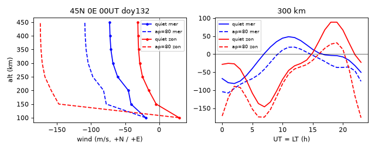

# hwm14 · NRL HWM14 水平中性风模型（gfortran/CMake 库）操作手册

目录：[`PROJECTS.json` → `hwm14`](../../PROJECTS.json) · 上游 <https://github.com/gemini3d/hwm14>（gemini3d 维护的 NRL HWM14 可构建版）· **Apache-2.0** · ★7 · main **`1f289bf`**（2026-09-11 19:14 EDT）· 最新 tag `v1.2.5`，CMake 里写的是 `VERSION 1.2.6` · 不在 PyPI。
同表另一条：[`hwm93`](https://github.com/space-physics/hwm93)（HWM93 的 Python/Matlab 封装，MIT，★23，**2022 起归档只读**，tip `5575db7` 2021-03-22）。
本机验证 **2026-09-26 06:25–06:31 EDT**：Debian，gfortran 14.2.0，CMake 3.31.6；HWM93 用同一 gfortran。

> 岗位：给 **日序 + UT + 高度 + 地理纬经 + ap**，返回热层 **经向风 / 纬向风（m/s）**。只是一个 Fortran 库，不带命令行程序，要自己写 10 行调用程序。
> 输出方向：`w(1)` = 经向风，**+ 向北**；`w(2)` = 纬向风，**+ 向东**（`src/hwm14.f90` 头注释与 `hwm_interface.f90` 都这么写，本机 45°N 午夜输出为负 = 向赤道/向西，与常识一致）。

---

## 1. 它解决什么问题

电离层 F 层的等离子体只能沿磁力线自由运动。热层中性风吹过时，离子-中性碰撞把等离子体沿磁力线推上或拉下：

| 风向（北半球） | 沿磁力线的效果 | F 层 | 典型时段 |
| --- | --- | --- | --- |
| **向赤道**（经向风 < 0） | 把等离子体沿磁力线推**上** | hmF2 升高，复合变慢，夜间 NmF2 能维持 | 夜间；磁暴时的扰动风 |
| **向极**（经向风 > 0） | 把等离子体沿磁力线压**下** | hmF2 降低，进入复合快的低高度，NmF2 下降 | 白天 |
| 纬向风 | 不直接沿 B 推；通过 F 区发电机产生电场间接起作用 | 影响日落后抬升、赤道异常 | 黄昏 |

竖直分量的粗估（忽略磁偏角 D）：**W_up = −U_north · sin I · cos I**，I 是磁倾角。所以 HWM 给出的经向风可以直接换算成“风把 F 层往上/往下推多快”，下文 §3.3 用本机 IGRF 倾角算了一遍。

HWM14 = 气候态平静风（HWM14 quiet，`hwmqt`）+ **DWM07 扰动风**（只看 ap，`dwm07`）。`ap(2) ≥ 0` 时两者相加，`ap(2) < 0` 时只给平静风。

它**不做**：电离层密度、hmF2 本身（要 [iri2020](./iri2020.md) 或物理模式）、中性密度/成分（[pymsis](./pymsis.md)）、竖直风。

---

## 2. 安装（gfortran + CMake，约 2 s）

```bash
unset TMPDIR VIRTUAL_ENV; export HOME=/home/box
mkdir -p /workspace/scratch_hwm && cd /workspace/scratch_hwm
git clone https://github.com/gemini3d/hwm14.git && cd hwm14
cmake -B build            # 必须 out-of-source，见坑 3
cmake --build build
ctest --test-dir build    # HWM14check + HWM14test
```

本机输出（尾部）：

```text
2/2 Test #2: HWM14test ........................   Passed    0.00 sec

100% tests passed, 0 tests failed out of 2
```

产物：`build/libhwm14.a`（原始 F77 风格 `hwm14`/`dwm07` 子程序）、`build/libhwm_ifc.a` + `build/include/hwm_interface.mod`（现代接口 `hwm_14`/`dwm_07`，单/双精度都行）。系数文件在仓内 `data/`：`hwm123114.bin`、`dwm07b104i.dat`、`gd2qd.dat`。**运行时要 `HWMPATH` 指到这个目录**（坑 1）。

---

## 3. 真实端到端：45°N 平静 vs ap=80 扰动风

### 3.1 调用程序

场景：45.0°N、0.0°E，2024 年第 132 天（2024-05-11），00 UT（经度 0°，所以 UT≈地方时）。平静用 `ap(2)=-1`，扰动用 `ap(2)=80`（3 小时 ap；80 对应 Kp 6o，属强扰动）。

```fortran
! wind45n.f90
program wind45n
use, intrinsic :: iso_fortran_env, only : real32
implicit none
external :: hwm14, dwm07
integer :: iyd, ialt, ih
real(real32) :: sec, alt, glat, glon, stl, f107a, f107, apq(2), apd(2), qw(2), dw(2), w(2)
iyd = 24132; glat = 45.0; glon = 0.0; stl = 0.; f107a = 0.; f107 = 0.
apq = [0., -1.]      ! ap(2)<0 -> 只算平静风 (HWMQT)
apd = [0., 80.]      ! ap(2)=80 -> 平静 + DWM07 扰动
sec = 0.0
print '(a)', '# HWM14 45.0N 0.0E doy=132 UT=00:00  units m/s  mer:+north  zon:+east'
print '(a6,6a10)', 'alt_km','qMer','qZon','dMer','dZon','tMer','tZon'
do ialt = 100, 450, 50
  alt = real(ialt)
  call hwm14(iyd,sec,alt,glat,glon,stl,f107a,f107,apq,qw)
  call dwm07(iyd,sec,alt,glat,glon,apd,dw)
  call hwm14(iyd,sec,alt,glat,glon,stl,f107a,f107,apd,w)
  print '(f6.0,6f10.2)', alt, qw, dw, w
end do
print '(/,a)', '# LT series at 300 km (UT=LT at 0E)  units m/s'
print '(a6,4a10)', 'UT_h','qMer','qZon','tMer','tZon'
alt = 300.
do ih = 0, 23
  sec = real(ih)*3600.
  call hwm14(iyd,sec,alt,glat,glon,stl,f107a,f107,apq,qw)
  call hwm14(iyd,sec,alt,glat,glon,stl,f107a,f107,apd,w)
  print '(i6,4f10.2)', ih, qw, w
end do
end program
```

```bash
gfortran -O2 wind45n.f90 /workspace/scratch_hwm/hwm14/build/libhwm14.a -o wind45n
HWMPATH=/workspace/scratch_hwm/hwm14/data ./wind45n
```

### 3.2 本机 stdout（原样；列名：q=平静，d=DWM07 扰动分量，t=合计；Mer=经向 +北，Zon=纬向 +东；单位 m/s）

```text
# HWM14 45.0N 0.0E doy=132 UT=00:00  units m/s  mer:+north  zon:+east
alt_km      qMer      qZon      dMer      dZon      tMer      tZon
  100.    -19.73     29.39     -0.07     -0.28    -19.80     29.12
  150.    -41.35     -4.38    -36.35   -143.10    -77.70   -147.48
  200.    -45.26    -15.27    -36.42   -143.38    -81.68   -158.64
  250.    -61.06    -24.46    -36.42   -143.38    -97.47   -167.83
  300.    -67.92    -28.45    -36.42   -143.38   -104.34   -171.82
  350.    -70.90    -30.18    -36.42   -143.38   -107.32   -173.56
  400.    -72.20    -30.94    -36.42   -143.38   -108.62   -174.31
  450.    -72.76    -31.26    -36.42   -143.38   -109.18   -174.64

# LT series at 300 km (UT=LT at 0E)  units m/s
  UT_h      qMer      qZon      tMer      tZon
     0    -67.92    -28.45   -104.34   -171.82
     3    -74.60    -42.05    -83.82    -92.87
     6    -18.54   -137.28    -57.48   -174.35
     9     34.38   -103.02     -3.36   -118.69
    12     45.87    -32.45     19.29    -41.21
    15     12.99      3.78     -3.45    -17.19
    18     -3.65     88.64    -30.35     27.74
    21    -17.02     31.76    -35.73    -39.94
```

（时间序列原输出是 0–23 h 每小时一行，这里只摘每 3 h 一行，数字未改。）

自检：300 km `tMer = qMer + dMer` → −67.92 + (−36.42) = −104.34，与输出一致；即 `hwm14(ap≥0)` 确实是平静+扰动之和。



左：00 UT 高度剖面；右：300 km 一天变化（实线平静，虚线 ap=80；蓝经向、红纬向）。

### 3.3 换算成“把 F 层往上推多快”

磁倾角用 ionFR 自带的 NOAA geomag70 + IGRF13 算（见 [ionfr.md](./ionfr.md)），输入 `2024,5,11 D K300 45 0`，本机输出表头与数值：

```text
Date Coord-System Altitude Latitude Longitude D_deg D_min I_deg I_min H_nT X_nT Y_nT Z_nT F_nT ...
2024,5,11 D K300 45 0     0d 41m    60d 10m   20328.8  20327.4    243.8  35449.8  40865.0 ...
```

I = 60°10′，sin I·cos I = 0.4316。按 `W_up = −U_north·sinI·cosI`（本机 Python 计算，经向风取上表 300 km）：

```text
UT_h  qMer_mps  W_up_quiet_mps  tMer_mps  W_up_ap80_mps   (W_up = -U_north*sinI*cosI)
   0    -67.92           29.31   -104.34          45.03
   6    -18.54            8.00    -57.48          24.81
  12     45.87          -19.80     19.29          -8.32
  18     -3.65            1.58    -30.35          13.10
```

读法：平静午夜向赤道风 68 m/s ≈ 把等离子体以 29 m/s 往上推（hmF2 抬升）；正午向极风 46 m/s ≈ 往下压 20 m/s。ap=80 时午夜上推变成 45 m/s，正午的下压几乎消失（−8 m/s）。这就是磁暴“扰动风”让中纬 hmF2 抬高的机制之一；同时扰动风把富 N₂ 空气带到中纬，造成 O/N₂ 下降和负暴（见 [pymsis](./pymsis.md) 的 O/N₂ 暴时对比）。竖直速度只是单点估算，真实 hmF2 还取决于电场、扩散、复合，要进物理模式（[sami2py](./sami2py.md) 用 `hwm_model=14`，[gitm](./gitm.md) 自带风场）。

---

## 4. hwm93 顺带对比（同表 `space-physics/hwm93`）

| 项 | HWM14（gemini3d/hwm14） | HWM93（space-physics/hwm93） |
| --- | --- | --- |
| 能否构建（本机） | CMake + ctest 2/2 通过 | **Python 包装装不上**：`pip install hwm93`（0.9.1）→ `ModuleNotFoundError: No module named 'numpy'`（隔离构建），加 `--no-build-isolation` 后 `ModuleNotFoundError: No module named 'numpy.distutils'`（Py3.13 + numpy 2.5.3 已无此模块）。**纯 Fortran 能编**：`cmake -B build && cmake --build build && ctest` 2/2 通过（含与 `tests/test.log` diff） |
| 输入 | 只用 ap(2)；**stl、f107、f107a 不用**；年份不用 | 用 F10.7、F10.7A、日 Ap、STL（地方时要自己算一致） |
| 扰动 | DWM07（按 ap → Kp，磁纬/MLT 函数） | 旧式 Ap 项 |
| 状态 | 在维护（2026-09 有提交） | 归档 |

同一点（45°N 0°E，第 132 天，00 UT，STL=0，F10.7=F10.7A=150）本机 HWM93 stdout：

```text
# HWM93 45.0N 0.0E doy=132 UT=00 STL=0 F107=F107A=150  units m/s  mer:+north zon:+east
alt_km   Mer_Ap4   Zon_Ap4  Mer_Ap80  Zon_Ap80
  100.     -7.30      2.49     -7.30      2.49
  300.   -125.50    -30.06    -89.71   -119.16
  450.   -134.26    -19.77    -98.07   -109.86
```

（原输出 100–450 km 每 50 km 一行，这里摘 3 行。）差异要看清：300 km 平静经向风 HWM93 −125.50 m/s vs HWM14 −67.92 m/s；Ap 80 时 HWM93 经向风变**小**（−89.71），HWM14 变**大**（−104.34），两者纬向风都转成强西向。本文没有实测风做真值，**不判断谁更准**；新工作按 PROJECTS 说明优先 HWM14。

HWM93 驱动 `w93.f90`（`gws5` 参数顺序同 HWM14；按源码注释 STL、F10.7、`ap(1)` 日 Ap 都参与计算，本机只验证了 F10.7 会改变输出）：

```fortran
program w93
implicit none
external :: gws5
integer :: iyd, ialt
real :: sec, alt, glat, glon, stl, f107a, f107, apq(2), apd(2), wq(2), wd(2)
iyd = 24132; sec = 0.; glat = 45.; glon = 0.; stl = sec/3600. + glon/15.
f107a = 150.; f107 = 150.; apq = [4., 4.]; apd = [80., 80.]
print '(a)', '# HWM93 45.0N 0.0E doy=132 UT=00 STL=0 F107=F107A=150  units m/s  mer:+north zon:+east'
print '(a6,4a10)', 'alt_km','Mer_Ap4','Zon_Ap4','Mer_Ap80','Zon_Ap80'
do ialt = 100, 450, 50
  alt = real(ialt)
  call gws5(iyd,sec,alt,glat,glon,stl,f107a,f107,apq,wq)
  call gws5(iyd,sec,alt,glat,glon,stl,f107a,f107,apd,wd)
  print '(f6.0,4f10.2)', alt, wq, wd
end do
end program
```

编译 `gfortran w93.f90 hwm93/src/hwm93_sub.f -o w93`（有一条数组越界编译警告，见坑 8；不需要 `-std=legacy`）。

---

## 5. 参数与输出字段

`subroutine hwm14(iyd,sec,alt,glat,glon,stl,f107a,f107,ap,w)`（全部 `real(4)`，`iyd` 为 `integer(4)`）

| 参数 | 单位/格式 | 说明（本机实测行为） |
| --- | --- | --- |
| `iyd` | YYDDD | **只用日序**；24132 与 95132 输出完全相同（−67.92/−28.45） |
| `sec` | UT 秒 | 0–86400 |
| `alt` | km | 本机测 100–450 km；上游测试覆盖 0–400 km |
| `glat`, `glon` | 地理（大地）纬经，度 | 东经为正 |
| `stl`, `f107a`, `f107` | — | **不使用**：传 stl=12、F10.7=250 结果不变 |
| `ap(1)` | — | 不使用 |
| `ap(2)` | 3 小时 ap | **< 0 → 只平静风**；≥ 0 → 加 DWM07。注意 0 不是“平静” |
| `w(1)` | m/s | 经向风，+北 |
| `w(2)` | m/s | 纬向风，+东 |

`subroutine dwm07(iyd,sec,alt,glat,glon,ap,dw)`：只返回扰动分量 `dw(1)` 经向、`dw(2)` 纬向，同单位同符号。本机 45°N 00 UT：100 km 近 0（−0.07/−0.28），200–450 km 输出完全相同（−36.42/−143.38）。

现代接口 `hwm_14(day, utsec, alt_km, glat, glon, Ap, Wmeridional, Wzonal)`、`dwm_07(...)`：`use hwm_interface`，链接 `libhwm_ifc.a libhwm14.a`（顺序见坑 4）。上游测试 `test_hwm`：day 150、12 UT、400 km、45°S 85°W、Ap 80 → `51.259384 -100.946259 44.557793 -18.965160`（本机重编后输出一致）。

---

## 6. 坑（现象 → 原因 → 一条修复命令）

| # | 现象 | 原因 | 修复（均本机验证） |
| ---: | --- | --- | --- |
| 1 | `ERROR:HWM14:findandopen: Can not find file hwm123114.bin` + `ERROR STOP` | 找系数只看当前目录、`$HWMPATH`、`../Meta/`；CMake 里的 `DATADIR` 宏没被源码用上 | `HWMPATH=/workspace/scratch_hwm/hwm14/data ./wind45n` |
| 2 | 想要“平静风”却传了 `ap(2)=0`，300 km 纬向风 −12.18 而不是 −28.45 | 只有 `ap(2) < 0` 才跳过 DWM07；ap=0 仍会叠加扰动模型 | 平静一律写 `ap = [0., -1.]` |
| 3 | `CMake Error at CMakeLists.txt:4 (message): please use out of source build` | 在源码目录 `cmake .` 被拒 | `cmake -B build` |
| 4 | 用现代接口时 `undefined reference to 'dwm07_'` | 静态库顺序：`libhwm14.a` 写在 `libhwm_ifc.a` 前面 | `gfortran test_hwm.f90 -Ibuild/include build/libhwm_ifc.a build/libhwm14.a` |
| 5 | 改 F10.7 / 地方时 / 年份，输出纹丝不动 | HWM14 设计上不用这些（与 HWM93 不同） | 要随太阳活动变的风就改用 HWM93 并显式传 F10.7（本机 250 km 纬向风 F10.7=150→250：−35.45→−16.59 m/s）：`gfortran w93.f90 hwm93/src/hwm93_sub.f -o w93 && ./w93` |
| 6 | `pip install hwm93` 失败：`No module named 'numpy.distutils'` | hwm93 的 `setup.py` 用 numpy.distutils，Python ≥3.12 / numpy 2 已删除 | 只用它的 Fortran：`cd hwm93 && cmake -B build && cmake --build build && ctest --test-dir build` |
| 7 | 把 `w(1)` 当纬向风画图，方向全反 | 顺序是 **(经向, 纬向)**；而 [pyglow](./pyglow.md) 的 `u`=纬向、`v`=经向，正好相反 | 打印时写明列名：`print *, 'mer(+N)=', w(1), ' zon(+E)=', w(2)` |
| 8 | 编 HWM93 时出现 `Warning: Array reference at (1) out of bounds (25 > 1)`（`SVV(I)=SAV(I)`） | 老代码把数组声明成长度 1 再越界写；只是警告，本机仍正常出数、ctest 过 | 不想看警告就加 `-w`：`gfortran -w w93.f90 hwm93/src/hwm93_sub.f -o w93` |
---

## 7. 结果怎么读

- 先看符号：经向 < 0 = 向赤道（北半球）→ F 层被推高；> 0 → 被压低。南半球“向赤道”是 > 0，推高/压低的判断要跟着换。
- 平静 45°N：夜里向赤道（300 km 00 UT −67.92 m/s），白天向极（12 UT +45.87 m/s），这是日侧加热驱动的全球环流。
- 扰动风（DWM07）是在平静风上**叠加**的：本例 ap=80 在 200 km 以上给出固定的 −36.42（向赤道）/ −143.38（向西）m/s。
- 风是气候态平均，不是某一天的实况；要和 FPI/流星雷达实测或 [gitm](./gitm.md) 输出比较才谈得上验证。
- ap 从哪来：[geomagindices](./geomagindices.md) / [pysatspaceweather](./pysatspaceweather.md) / [space-weather-indices](./space-weather-indices.md)。

---

## 8. 相关手册

| 你要… | 打开 |
| --- | --- |
| 中性密度、O/N₂（负暴成因的另一半） | [pymsis](./pymsis.md) · [msise00](./msise00.md) |
| 气候态 Ne 剖面、hmF2 | [iri2020](./iri2020.md) |
| 带 HWM 风的低纬物理模式（可 `wind_scale=0` 关风对照） | [sami2py](./sami2py.md) |
| 全球热层-电离层物理模式（自算风场） | [gitm](./gitm.md) |
| Python 里一次拿 IRI/HWM/IGRF/MSIS | [pyglow](./pyglow.md) |
| 测高仪实测 hmF2 | [polan](./polan.md) · [giro-ionosonde](./giro-ionosonde.md) |

---

## 9. 许可与诚实局限

- hwm14 仓库 **Apache-2.0**；模型本体来自 NRL（Drob et al. 2015, *Earth and Space Science*, HWM14）。hwm93 **MIT**（封装），模型 Hedin et al. 1996。
- 本文实跑：hwm14 构建 + ctest、45°N 剖面与日变化、`ap=0`/年份/F10.7 行为、链接顺序；hwm93 的 pip 失败与 Fortran 构建 + ctest + 同点对比。
- **未实跑**：`cmake --install` 安装后的数据路径（`share/data/hwm14`）；Windows / ifort；hwm93 的 Python 与 Matlab 接口（装不上，故未跑）；把风喂进 SAMI2/GITM 的完整耦合。
- 竖直漂移 W_up 是单点几何估算（忽略磁偏角 D≈0°41′、扩散和电场），只用于说明方向和量级。
- DWM07 只随 ap 变，不代表某一次磁暴的真实时序；强暴（ap>200）时经验模型外推的可靠性未验证。
