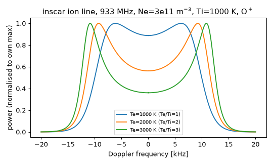

# inscar · 非相干散射雷达（ISR）理论谱计算 操作手册

目录：[`PROJECTS.json` → `inscar`](../../PROJECTS.json) · 上游 <https://github.com/engeir/inscar>（Eirik Enger，UiT；main `eedbe1e`，2024-06-21 07:00 EDT）· PyPI **`inscar` 3.3.2** · 许可 **MIT**（`LICENSE.rst`）· 本机验证 **2026-09-26 06:14–06:30 EDT**：CPython 3.13.5 venv，inscar 3.3.2 / numba 0.67.0 / numpy 2.5.3 / scipy 1.18.1 / matplotlib 3.11.2。

> 岗位：给定电子/离子温度、密度、离子质量、雷达频率、磁场与视线夹角，算出**理论** ISR 功率谱（离子线为主）。它**不读**雷达实测数据、**不做**拟合反演。冲突时：本机 `site-packages/inscar/config.py` 源码 > 上游 README > 本文。

## 1. ISR 测什么，为什么对电离层剖面重要

| 概念 | 一句话 |
| --- | --- |
| 非相干散射 | 大功率 UHF/VHF 雷达向上发射，电子对电波做 Thomson 散射；回波极弱，但能从 D/E 区一直测到**顶部**（F2 峰以上） |
| 离子线（ion line） | 散射被离子声波调制 → 谱在 ±f_ia 处有两个“肩”（双峰）；宽度约 ∝ √(Ti/mi)，本文 E2E 就算它 |
| 等离子体线 | 电子等离子体波引起、偏离中心约等离子体频率的两条窄线；本文**未实跑** |
| 从谱到参数 | 总功率 → Ne；肩/谷比 → Te/Ti；谱宽 → Ti/mi；整体多普勒偏移 → 视线离子速度 Vi |
| 为什么重要 | 按距离门切片 → Ne、Te、Ti、Vi **随高度的剖面**。测高仪只看到 hmF2 以下（见 [polan](./polan.md)），GNSS TEC 只是积分；ISR 是校核 IRI/NeQuick、TEC 分解和顶部剖面的“金标准” |

实测 ISR 数据（EISCAT、AMISR、Millstone）从 Madrigal 取，见 [madrigal.md](./madrigal.md)。inscar 是这条链上“正演理论谱”的一环：理解谱形、检验拟合假设（非麦克斯韦电子、斜视角）。

## 2. 安装

```bash
unset TMPDIR VIRTUAL_ENV; export HOME=/home/box
mkdir -p /workspace/scratch_x && cd /workspace/scratch_x
python3 -m venv venv && . venv/bin/activate
pip install --no-cache-dir inscar==3.3.2 matplotlib   # 拉 numba/scipy/numpy>=2/attrs/contourpy
python -u -c "import inscar; print(inscar.__version__)"
# 3.3.2
```

venv 本身无特殊系统依赖（numba 走 wheel）。仓内 `rye` 开发环境**未实跑**。

## 3. 端到端：EISCAT UHF 933 MHz，F 区 O⁺，Te 从 1000 K 到 3000 K

脚本 `is_e2e.py`（全文，就是本机跑的那份）：

```python
import time, numpy as np, scipy.constants as const
import inscar as isr
import matplotlib; matplotlib.use("Agg"); import matplotlib.pyplot as plt

NE = 3e11          # m^-3
TI = 1000.0        # K
MI_U = 16.0        # O+ , atomic mass units
F_RADAR = 933e6    # Hz (EISCAT UHF)
B = 50000e-9       # T
ASPECT = 45        # deg
print(f"inscar {isr.__version__}")
print(f"radar_frequency_Hz={F_RADAR:.3e} B_T={B:.1e} aspect_angle_deg={ASPECT} Ne_m-3={NE:.1e} Ti_K={TI:.0f} ion_mass_u={MI_U:.0f}")
print(f"radar_wavenumber_rad_per_m={isr.Parameters(radar_frequency=F_RADAR).radar_wavenumber:.3f}  (= -4*pi*f/c)")
res = {}
for TE in (1000.0, 2000.0, 3000.0):
    t0 = time.time()
    p = isr.Parameters(radar_frequency=F_RADAR, frequency_range=(-2e4, 2e4),
                       frequency_size=int(2e3 + 1), magnetic_field_strength=B, aspect_angle=ASPECT)
    e = isr.Particle(temperature=TE, number_density=NE)
    i = isr.Particle(gordeyev_upper_lim=1.5e-2, temperature=TI, number_density=NE,
                     mass=MI_U * const.m_u)          # 质量要给 kg（坑 1）
    sim = isr.SpectrumCalculation()
    sim.set_params(p); sim.set_electron(e); sim.set_ion(i)
    sim.set_electron_integration_function(isr.IntMaxwell())
    sim.set_ion_integration_function(isr.IntMaxwell())
    f, s = sim.calculate_spectrum()                  # f: Hz, s: 未归一功率
    ok = np.isfinite(s)
    pos = (f > 0) & ok
    kpk = np.argmax(np.where(pos, s, -np.inf))
    c = np.argmin(np.abs(f[ok & (f != 0)]))
    fc = f[ok & (f != 0)][c]; sc = s[ok & (f != 0)][c]
    res[TE] = (f, s)
    print(f"Te_K={TE:.0f} Te/Ti={TE/TI:.1f}  n_points={f.size} n_nonfinite={int((~ok).sum())} "
          f"shoulder_freq_kHz={f[kpk]/1e3:.2f} shoulder_power={s[kpk]:.3e} "
          f"center_freq_Hz={fc:.1f} center_power={sc:.3e} shoulder/center={s[kpk]/sc:.2f} "
          f"runtime_s={time.time()-t0:.1f}")
    cs = np.sqrt(const.k * (TE + 3 * TI) / (MI_U * const.m_u))
    print(f"    rough ion-acoustic estimate f_ia_kHz=|k|/(2pi)*sqrt(kB(Te+3Ti)/mi)/1e3={abs(p.radar_wavenumber)/(2*np.pi)*cs/1e3:.2f}")
# ……画图（每条曲线各自归一到最大值）+ 对有限点做 np.trapezoid 求总功率，打印与 2/(1+Te/Ti) 对比
```

```bash
python -u is_e2e.py
```

本机真实 stdout（2026-09-26 06:17 EDT，三次各约 4.7 s）：

```text
inscar 3.3.2
radar_frequency_Hz=9.330e+08 B_T=5.0e-05 aspect_angle_deg=45 Ne_m-3=3.0e+11 Ti_K=1000 ion_mass_u=16
radar_wavenumber_rad_per_m=-39.108  (= -4*pi*f/c)
Te_K=1000 Te/Ti=1.0  n_points=2001 n_nonfinite=1 shoulder_freq_kHz=6.14 shoulder_power=1.176e+06 center_freq_Hz=-20.0 center_power=1.044e+06 shoulder/center=1.13 runtime_s=4.7
    rough ion-acoustic estimate f_ia_kHz=|k|/(2pi)*sqrt(kB(Te+3Ti)/mi)/1e3=8.97
Te_K=2000 Te/Ti=2.0  n_points=2001 n_nonfinite=1 shoulder_freq_kHz=9.26 shoulder_power=8.285e+05 center_freq_Hz=-20.0 center_power=4.658e+05 shoulder/center=1.78 runtime_s=4.7
    rough ion-acoustic estimate f_ia_kHz=|k|/(2pi)*sqrt(kB(Te+3Ti)/mi)/1e3=10.03
Te_K=3000 Te/Ti=3.0  n_points=2001 n_nonfinite=1 shoulder_freq_kHz=10.84 shoulder_power=7.346e+05 center_freq_Hz=-20.0 center_power=2.648e+05 shoulder/center=2.77 runtime_s=4.9
    rough ion-acoustic estimate f_ia_kHz=|k|/(2pi)*sqrt(kB(Te+3Ti)/mi)/1e3=10.99
saved inscar-ion-line-te-ti.png
--- integrated ion-line power (trapezoid over finite points, arbitrary units) ---
Te_K=1000 Te/Ti=1.0 P_total=2.3031e+10 P_total/P_total(Te=1000)=1.000 theory_2/(1+Te/Ti)=1.000
Te_K=2000 Te/Ti=2.0 P_total=1.5120e+10 P_total/P_total(Te=1000)=0.657 theory_2/(1+Te/Ti)=0.667
Te_K=3000 Te/Ti=3.0 P_total=1.1267e+10 P_total/P_total(Te=1000)=0.489 theory_2/(1+Te/Ti)=0.500
```



读法（数字都来自上面 stdout）：

| 量 | Te/Ti=1 | Te/Ti=2 | Te/Ti=3 | 物理含义 |
| --- | ---: | ---: | ---: | --- |
| `shoulder_freq_kHz`（正频侧峰位） | 6.14 | 9.26 | 10.84 | Te 升高 → 离子声速升高 → 双峰外移 |
| `shoulder/center`（肩/谷比） | 1.13 | 1.78 | 2.77 | 谷越深 Te/Ti 越大；这是实测拟合 Te 的主要抓手 |
| `P_total/P_total(Te=1000)` | 1.000 | 0.657 | 0.489 | 与 kλD≪1 近似 2/(1+Te/Ti)=1/0.667/0.500 差 ≤2.2%（有限 ±20 kHz 积分窗 + 德拜项） |
| `rough ion-acoustic estimate f_ia_kHz` | 8.97 | 10.03 | 10.99 | 粗估（Ti 取 γ=3）；Te/Ti 小时离子声波强阻尼，峰位远低于粗估，Te/Ti=3 时两者接近 |

要点：Ne 不变、只升 Te，总功率反而**下降**。所以实测时如果假设 Te=Ti 去把功率换成 Ne，会低估 Ne——这就是 ISR 必须同时拟合 Ne/Te/Ti 的原因。

## 4. 参数表（单位已按源码核对）

`isr.Parameters(...)`：

| 字段 | 默认 | 单位 | 说明 |
| --- | --- | --- | --- |
| `radar_frequency` | 430e6 | Hz | 自动更新 `radar_wavenumber` = −4πf/c（rad/m；933 MHz → −39.108） |
| `frequency_range` | (−2e6, 2e6) | Hz | 谱的多普勒频率轴范围；离子线要收窄（坑 5） |
| `frequency_size` | 10001 | 点 | **必须奇数**（坑 4） |
| `frequency_exp` | 1 | — | 频率轴非线性加密指数，奇数 |
| `magnetic_field_strength` | 35000e-9 | T | 高纬 ~5e-5 T |
| `aspect_angle` | 45 | 输入**度**，内部存**弧度** | 设 45 读回 0.7853981633974483（本机打印） |

`isr.Particle(...)`（电子、离子各建一个）：

| 字段 | 默认 | 单位 | 说明 |
| --- | --- | --- | --- |
| `temperature` | 5000 | K | 必须 Python `int`/`float`（坑 3） |
| `number_density` | 2e11 | m⁻³ | 电子、离子**各自**用于德拜长度；两个都要设（坑 2） |
| `mass` | `const.m_e`（9.109e-31） | **kg** | README 写“u”，源码按 kg 用（坑 1） |
| `collision_frequency` | 0 | Hz | 碰撞项；本文未改 |
| `kappa` | 20 | — | 仅 `IntKappa` 用 |
| `gordeyev_upper_lim` | 1.5e-4 | s | Gordeyev 积分上限；上游离子示例用 1.5e-2 |
| `gordeyev_size` / `velocity_size` | 80001 / 40001 | 点 | 奇数 |

积分函数：`IntMaxwell`（本文实跑）、`IntKappa`、`IntLong`（任意各向同性 VDF，配 `Vdf*`）——后两者**未实跑**。

输出：`calculate_spectrum()` 返回 `(f, s)`：`f` 为线性频率（Hz，= `params.linear_frequency`），`s` 为 `Ne/(π·ω)·…` 形式的功率，上游未给物理单位，**只用相对形状、比值**。

## 5. 坑（现象 → 原因 → 一条修复命令）

以下每条都在本机用同一套参数（Te=2000 K、Ti=1000 K、933 MHz）复现过；基准值 `shoulder_freq_kHz=9.26 P_total=1.5120e+10`。

**坑 1 · 离子质量按 README 给“16”，谱塌成中心一根**
- 现象：`[mass_in_u_not_kg] OK shoulder_freq_kHz=0.02 ... P_total=7.5441e+09`，没有双峰，也不报错。
- 原因：`config.Particle.mass` 默认 `const.m_e`，按 kg 参与计算；README 写“Ion mass in atomic mass units [u]”与源码不符。
- 修复：`i = isr.Particle(temperature=1000.0, number_density=3e11, mass=16*scipy.constants.m_u)`（已验证 → 9.26 kHz）。

**坑 2 · 只给电子设了 Ne，离子保留默认 2e11**
- 现象：`[forgot_ion_density(default 2e11)] OK shoulder_freq_kHz=7.48 ... P_total=1.9170e+10`，谱形和功率都变了，但不报错。
- 原因：`_susceptibility_function` 对电子、离子分别用各自 `number_density` 算德拜长度。
- 修复：两个 Particle 都传同一个 `number_density=3e11`（已验证 → 9.26 kHz / 1.5120e+10）。

**坑 3 · 用 numpy float32 传温度直接 ValueError**
- 现象：`ValueError: Attribute(name='temperature', ...) must be a positive number`。
- 原因：`is_positive` 校验 `isinstance(value, (int, float))`；`np.float64` 是 float 子类能过，`np.float32` 不是。
- 修复：`isr.Particle(temperature=float(te32), number_density=3e11)`（已验证 → 9.26 kHz）。

**坑 4 · `frequency_size=2000` 报 “must be odd”**
- 现象：`ValueError: Attribute(name='frequency_size', ...) must be odd`。
- 原因：`is_odd` 校验（对称频率轴要含 0 点）。
- 修复：`isr.Parameters(frequency_size=2001, frequency_range=(-2e4, 2e4), radar_frequency=933e6)`（已验证）。

**坑 5 · 默认 ±2 MHz / 10001 点，离子线只有十几个采样**
- 现象：`[default_range_2MHz_coarse] OK shoulder_freq_kHz=9.20 df_Hz=400.0 ... P_total=1.5287e+10`，峰位与总功率都偏（对比 20 Hz 步长的 9.26 / 1.5120e+10）。
- 原因：默认轴按等离子体线尺度设，933 MHz 离子线只在 ±15 kHz 内。
- 修复：`isr.Parameters(frequency_range=(-2e4, 2e4), frequency_size=2001, radar_frequency=933e6)`（已验证 df=20 Hz）。

**坑 6 · f=0 处出现 NaN，`np.max`/`np.trapz` 全变 NaN**
- 现象：每次 `n_nonfinite=1`；用 `s.max()` 得 `nan`。
- 原因：谱公式分母含 `angular_frequency`，f=0 时 0/0（源码 `np.errstate(divide="ignore", invalid="ignore")` 只是静音）。
- 修复：`ok = np.isfinite(s); P = np.trapezoid(s[ok], f[ok])`（已验证；画图用 `np.nanmax`）。

**坑 7 · 以为 `p.aspect_angle` 读回的是度**
- 现象：设 45，打印 `0.7853981633974483`。
- 原因：`converter=to_radians`，每次赋值都转成弧度。
- 修复：`print(np.degrees(p.aspect_angle))`（未验证：只核对了读回值为弧度）。

**坑 8 · 拿 `s` 的绝对值当雷达接收功率 / 直接换 Ne**
- 现象：`shoulder_power=8.285e+05` 之类数字没有物理单位。
- 原因：`calculate_spectrum` 未乘雷达常数、距离、系统增益；实测拟合（GUISDAP 等）另有定标。
- 修复：只比较比值：`r = s[k]/s_center`（本文 `shoulder/center`）——属用法约束，无命令可“修”。

## 6. 怎么把结果接回电离层分析

- 想理解**实测** EISCAT/AMISR 剖面里的 Te/Ti 怎么来的：用本文脚本改 Te/Ti，看肩/谷比变化；实测文件从 [madrigal.md](./madrigal.md) 取。
- 想对照 ISR Ne 与模型剖面：[iri2020.md](./iri2020.md) / [iricore.md](./iricore.md) 出 Ne(h)，ISR 给 Ne/Te/Ti(h)。
- 想对照测高仪底部剖面：[polan.md](./polan.md)（虚高→真高）、[giro-ionosonde.md](./giro-ionosonde.md)（foF2/hmF2）。
- 物理模式给 Te/Ti 输入：[sami2py.md](./sami2py.md)、[gitm.md](./gitm.md)。
- 概念课：[教程 07 测高仪与掩星](../tutorials/07-ionosonde-occultation.md)（剖面观测手段总览）。

## 7. 许可与诚实边界

- 许可：MIT（`LICENSE.rst`）；引用见仓内 `CITATION.cff`。理论依据 Hagfors (1961)、Mace (2003)，作者硕士论文在 munin.uit.no。
- 已实跑：`IntMaxwell` 离子线、Te/Ti 扫描、上面 8 条坑中 1–6（坑 7 仅核读回值）。
- **未实跑**：等离子体线（需 MHz 级窗口 + 电子 Gordeyev 高分辨，耗时大）、`IntKappa` / `IntLong` / 自定义 `Vdf`、碰撞频率 ≠ 0、多离子成分、仓内 `assets/examples.py`（依赖仓外 `.mat` 数据）、`pytest`。
- 不能做：读实测 ISR 数据、拟合 Ne/Te/Ti、雷达定标、距离门/脉冲码处理（那是 GUISDAP、LPI 等的事）。
- 单离子 O⁺ + 麦克斯韦 + 无碰撞，只适合 F 区；E 区（NO⁺/O₂⁺、碰撞）需自己改参数，本文未验证。
