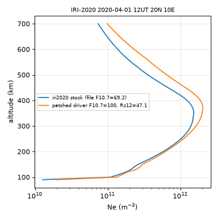

# iri2020 · IRI-2020 Fortran 的 Python 驱动（space-physics）操作手册

目录：[`PROJECTS.json` → `iri2020`](../../PROJECTS.json) · 上游 <https://github.com/space-physics/iri2020> · 许可：包装 **MIT**（© 2023 Space Physics）；内含 IRI-2020 Fortran 与系数（IRI 官方为 AS IS + 署名，见 [iri-fortran](./iri-fortran.md)）· `pyproject` 版本 **1.0.0**，main **`8b6ab9e`**（2025-06-06 11:35 EDT）· **不在 PyPI**（`pip install iri2020` → `No matching distribution`，上游 issue #2）· 本机实跑 2026-09-26 05:18–05:25 EDT（Python 3.13.5，GNU Fortran 14.2.0，CMake 3.31.6）

> **质检复跑通过（2026-09-26 05:50 EDT）**：重新克隆（main `8b6ab9e`），`-e` 安装后首次调用自动构建（GNU Fortran 14.2.0、CMake 3.31.6，`build.log` 1108 行）。PyPI 仍为 404，`IRI()` 签名只有 `time, altkmrange, glat, glon`，Python 层确实不能设 F10.7。§3.1 输出**逐行一致**（F10.7 69.2、NmF2 1.494191e12、TEC 38.113 TECU）；TEC 上限 700 / 2000 / 380 km 分别为 38.11 / 42.96 / 24.99 TECU。§3.3 的 A/B/C 三个驱动变体重编后逐字一致，C 变体 ne_max 2.0318e12 @ 370 km、梯形积分 51.502 TECU。§3.4 捆带文件（`apf107.dat` 止于 2023-06-29、`ig_rz.dat` 止于 2023-11）四个日期的输出逐字一致，2024-05-11 静默给出 `f107=63.75 ap=-11.0`。irimodel.org 新文件为 1402576 B / 10559 B（853 个月）：新 apf + 旧 ig_rz 的 rc 为 0，旧 apf + 新 ig_rz 为 rc 139（SIGSEGV），`806→1200` 修补重编后 2024-05-11 得 `f107=218.0 ap=271.0`，§3.1 逐位不变。坑 5（`FFLAGS=-O2` 使 TEC 变成 34.78）、坑 7（单设 `jf(32)` 出现 NaN）也复现了；issue #5 仍为 OPEN。已修正：198 条告警的构成。
>
> 岗位：用 Python 一行调 **IRI-2020 官方 Fortran**，得到高度剖面 `xarray.Dataset`（`ne`/`Te`/离子成分）+ `NmF2/hmF2/foF2/TEC`。接口与 [iri2016](./iri2016.md) 几乎相同，只是核心换成 2020 版。冲突时：**上游源码（`base.py` / `iri_driver.f90`）> 本文**。

## 1. 它解决什么 / 不做什么

**做：**

- `IRI(time, altkmrange=(min,max,step), glat, glon) → xarray.Dataset`，首次调用自动 CMake+gfortran 编 `iri2020_driver`
- 捆带 `data/`：CCIR/URSI 系数、IGRF、`apf107.dat`、`ig_rz.dat`（**2023-06 的快照**）
- 另有 `timeprofile` / `geoprofile`（时间序列、经纬扫描）

**不做 / 做不到：**

- Python 层 **不能** 传 F10.7/Rz12/JF 开关；要改只能改 Fortran 驱动并重编（§3.3）
- **不是** 当日实况；指数文件过期后**静默**给气候值（§3.4）
- 不是 IRI-2026；要最新版官方树看 [iri-fortran](./iri-fortran.md)

| 同族页面 | 核心 | 装法 | 能否设 F10.7 | 本文取舍 |
| --- | --- | --- | --- | --- |
| **本文 iri2020** | IRI-2020 Fortran | `git clone` + `pip install -e .` | 仅改驱动 | 要 2020 版且要 xarray |
| [iri2016](./iri2016.md) | IRI-2016 Fortran | PyPI `iri2016` | 仅改驱动 | 老论文复现 |
| [pyiri](./pyiri.md) | 纯 Python（SH 系数） | PyPI `PyIRI` | **可**（`F107=`） | 无编译器、批量网格 |
| [iri-fortran](./iri-fortran.md) | 官方 IRI-2026 树 | 手编 `iritest` | 交互输入 | 金标准对照 |
| [pymsis](./pymsis.md) / [msise00](./msise00.md) | 中性大气 MSIS | PyPI | 可 | 看 O/N₂，不出 Ne |

## 2. 安装与构建

```bash
sudo apt-get install -y gfortran cmake        # 本机已有 14.2.0 / 3.31.6
mkdir -p ~/iono_ops && cd ~/iono_ops
git clone https://github.com/space-physics/iri2020.git
python3 -m venv iri2020/.venv && source iri2020/.venv/bin/activate
pip install --no-cache-dir -e ./iri2020        # 依赖 numpy / xarray / python-dateutil
python -u -c "from iri2020 import IRI; IRI('2020-04-01T12:00', (100, 500, 50), 20.0, 10.0)" > build.log 2>&1
grep -E "compiler identification|Built target iri2020_driver" build.log
```

```text
-- The Fortran compiler identification is GNU 14.2.0
[100%] Built target iri2020_driver
```

首跑把 CMake 输出和 **198 条** gfortran `Warning:` 全打到 **stdout**：其中 165 条是 `Fortran 2018 deleted feature …`，33 条是 `Array reference at (1) out of bounds …`（本机 `build.log` 1108 行），可执行文件落在 `iri2020/src/iri2020/iri2020_driver`，每次运行 `cwd` 切到 `src/iri2020/data/` 读系数与指数。建议用 editable 安装：之后要换指数文件或改驱动都在这个源码树里改。

## 3. 端到端

### 3.1 与 pyiri 同一场景：2020-04-01 12 UT，20°N 10°E，90–700 km / 10 km

```bash
python -u - <<'PY'
import numpy as np
from iri2020 import IRI
iono = IRI("2020-04-01T12:00", altkmrange=(90, 700, 10), glat=20.0, glon=10.0)
s = lambda k: float(iono[k].values.ravel()[0])
print("data_vars", list(iono.data_vars))
print("n_alt", iono.sizes["alt_km"], "attrs_f107", iono.attrs["f107"], "attrs_ap", iono.attrs["ap"])
print(f"NmF2_m-3={s('NmF2'):.6e} hmF2_km={s('hmF2'):.2f} foF2_MHz={s('foF2'):.4f}")
print(f"NmF1_m-3={s('NmF1'):.4e} hmF1_km={s('hmF1'):.2f} NmE_m-3={s('NmE'):.4e} hmE_km={s('hmE'):.2f}")
ne, alt = iono["ne"].values, iono["alt_km"].values
print(f"TEC_var_m-2={s('TEC'):.6e} -> TECU={s('TEC')/1e16:.3f}  (integral 0..700 km)")
print(f"vTEC_trapz_90-700km_TECU={np.trapezoid(ne, alt*1e3)/1e16:.3f}")
print(f"ne_max_m-3={ne.max():.4e} at alt_km={alt[ne.argmax()]:.0f}")
for a in (250, 300, 400):
    r = iono.sel(alt_km=a)
    print(f"alt_km={a} ne_m-3={float(r.ne):.4e} nO+_m-3={float(r['nO+']):.4e} nH+_m-3={float(r['nH+']):.4e} Te_K={float(r.Te):.1f} Ti_K={float(r.Ti):.1f} Tn_K={float(r.Tn):.1f}")
PY
```

**本机 stdout（已编译后再跑；2026-09-26 05:24 EDT）：**

```text
data_vars ['ne', 'Tn', 'Ti', 'Te', 'nO+', 'nH+', 'nHe+', 'nO2+', 'nNO+', 'nCI', 'nN+', 'NmF2', 'hmF2', 'NmF1', 'hmF1', 'NmE', 'hmE', 'TEC', 'EqVertIonDrift', 'foF2']
n_alt 62 attrs_f107 69.1999969 attrs_ap 5.0
NmF2_m-3=1.494191e+12 hmF2_km=335.00 foF2_MHz=10.9772
NmF1_m-3=2.3973e+11 hmF1_km=145.00 NmE_m-3=1.4169e+11 hmE_km=110.00
TEC_var_m-2=3.811326e+17 -> TECU=38.113  (integral 0..700 km)
vTEC_trapz_90-700km_TECU=38.149
ne_max_m-3=1.5289e+12 at alt_km=350
alt_km=250 ne_m-3=1.0181e+12 nO+_m-3=1.0006e+12 nH+_m-3=0.0000e+00 Te_K=1979.4 Ti_K=814.5 Tn_K=798.4
alt_km=300 ne_m-3=1.3986e+12 nO+_m-3=1.3752e+12 nH+_m-3=2.0032e+09 Te_K=1571.3 Ti_K=864.4 Tn_K=806.5
alt_km=400 ne_m-3=1.2387e+12 nO+_m-3=1.2073e+12 nH+_m-3=9.2478e+09 Te_K=1229.6 Ti_K=957.2 Tn_K=808.9
```

单位核对：`foF2 = sqrt(NmF2/1.24e10)` = sqrt(1.494191e12/1.24e10) = 10.977 MHz，与输出一致 → `NmF2` 确是 **m⁻³**；驱动设 `jf(22)=.false.`，离子列也是 **m⁻³**（不是 %），300 km 处 `nO+` 占 `ne` 的 98%。

### 3.2 与 pyiri 数字为什么对不上：F10.7 不是 100

`attrs_f107 69.2` 说明 iri2020 用的是 `apf107.dat` 里 2020-04-01 的真实值（太阳极小），而 [pyiri](./pyiri.md) 那一页是 **手给 F10.7=100**。Python 层没有参数可改，只能改驱动（下一节）。

### 3.3 改驱动把 F10.7 设成 100（在副本里做，不动上游）

IRI 里 foF2 由 **Rz12/IG12** 驱动，hmF2（Shubin）与顶部由 **F10.7** 驱动，二者要一起改。在 `iri_driver.f90` 副本的 `call read_ig_rz` 前插入（C 变体）：

```fortran
oarr = -1.
jf(17) = .false.; jf(25) = .false.
oarr(41) = 100.
oarr(33) = (-0.728 + sqrt(0.728**2 + 4*0.00089*(100.-63.75))) / (2*0.00089)   ! Rz12 from COV=100
```

```bash
cd ~/iono_ops && cp iri2020/src/iri2020/src/iri_driver.f90 drv_C.f90   # 再把上面 4 行插到 call read_ig_rz 之前
S=~/iono_ops/iri2020/src/iri2020/src
gfortran -O0 -std=legacy -w -o iri_C drv_C.f90 $S/{irisub,irifun,iritec,iridreg,iriflip,igrf,cira,rocdrift}.for
cd $S/../data && ~/iono_ops/iri_C 2020 4 1 12 0 0 20 10 90 700 10 | awk 'NF==100{print "NmF2="$1,"hmF2="$2,"TEC="$37,"Rz12="$33,"IG12="$39,"F107="$41,"F107_81="$46,"foF2="$100}'
```

本机三种变体（A 只改 F10.7；B 只改 Rz12；C 两者都改）stdout（`oarr` 下标：1 NmF2 m⁻³、2 hmF2 km、37 TEC m⁻²、33 Rz12、39 IG12、41 F10.7、46 F10.7_81、100 foF2 MHz）：

```text
A NmF2=1.49419065E+12 hmF2=3.64024139E+02 TEC=3.77821951E+17 Rz12=2.33032250E+00 IG12=-9.11612892E+00 F107=1.00000000E+02 F107_81=1.00000000E+02 foF2=1.09772148E+01
B NmF2=2.01790036E+12 hmF2=3.35004669E+02 TEC=5.19890295E+17 Rz12=4.70837822E+01 IG12=5.37531204E+01 F107=6.91999969E+01 F107_81=6.96999969E+01 foF2=1.27567196E+01
C NmF2=2.01790036E+12 hmF2=3.64024139E+02 TEC=5.14613155E+17 Rz12=4.70837822E+01 IG12=5.37531204E+01 F107=1.00000000E+02 F107_81=1.00000000E+02 foF2=1.27567196E+01
patchC alt_km[0,-1]=90.0,700.0 ne_max_m-3=2.0318e+12@370.0km vTEC_trapz_90-700_TECU=51.502 oarr37_TECU=51.461
```

| 量（同场景） | [pyiri](./pyiri.md)（F10.7=100） | iri2020 原样（F10.7=69.2） | iri2020 C 变体（F10.7=100，Rz12=47.08） |
| --- | ---: | ---: | ---: |
| `NmF2` (m⁻³) | 1.941519e12 | 1.494191e12 | 2.01790e12 |
| `hmF2` (km) | 364.62 | 335.00 | 364.02 |
| `foF2` (MHz) | 12.5130 | 10.9772 | 12.7567 |
| 梯形 vTEC 90–700 km (TECU) | 43.194 | 38.149 | 51.502 |

读法：输入对齐后 hmF2 只差 0.6 km、foF2 差 2%，NmF2 差 4%；TEC 差 19%，主要在剖面形状（C 变体 `ne_max` 2.03e12 在 370 km，顶部更厚），pyiri 的 SH 顶部与 IRI-2020 默认 IRIcor2 顶部不同。F10.7→Rz12 用的是 IRI 自己的 `COV=63.75+R(0.728+0.00089R)` 反解，PyIRI 内部换算未必相同，所以**别期望逐位一致**。



### 3.4 指数文件过期：静默给错值 → 更新 → 段错误 → 修补

同一命令在 45°N 0°E、100–500 km 下打印 `NmF2/hmF2/foF2` 与 `attrs` 里的 `f107/ap`。**捆带文件**（`apf107.dat` 止于 2023-06-29，`ig_rz.dat` 止于 2023-11）：

```text
2023-06-29T12:00 NmF2_m-3=7.9352e+11 hmF2_km=299.93 foF2_MHz=8.000 f107=167.600006 ap=14.0
2023-07-15T12:00 NmF2_m-3=7.9076e+11 hmF2_km=266.86 foF2_MHz=7.986 f107=128.548553 ap=-11.0
2024-05-11T12:00 NmF2_m-3=3.2252e+11 hmF2_km=210.70 foF2_MHz=5.100 f107=63.75 ap=-11.0
2026-09-26T12:00 NmF2_m-3=1.6038e+12 hmF2_km=210.69 foF2_MHz=11.373 f107=63.75 ap=-11.0
```

没有报错也没有告警：`ap=-11` 是“缺值”哨兵，`f107=63.75` 是 Rz12=0 时的 COV——Gannon 暴日被当成太阳极小的安静日。换成 irimodel.org 最新 `indices/`（本机 `apf107.dat` 1 402 576 B 止于 2026-07-28，`ig_rz.dat` 10 559 B 覆盖 1958-01…2028-11）后：

```text
subprocess.CalledProcessError: Command '[…/iri2020_driver', '2024', '5', '11', '12', '0', '0', '45.0', '0.0', '100', '500', '50']' died with <Signals.SIGSEGV: 11>.
```

逐个替换确认：新 `apf107.dat` + 旧 `ig_rz.dat` 正常；旧 `apf107.dat` + 新 `ig_rz.dat` **rc=139**。原因是 `irifun.for` 里 `aig(806),arz(806)` / `ionoindx(806),indrz(806)` 只能装 806 个月，新文件有 853 个（上游 issue #5 同症状）。修补并重编：

```bash
cd ~/iono_ops/iri2020/src/iri2020
curl -fsSL -A 'Mozilla/5.0' -o data/apf107.dat https://irimodel.org/indices/apf107.dat
curl -fsSL -A 'Mozilla/5.0' -o data/ig_rz.dat  https://irimodel.org/indices/ig_rz.dat
sed -i 's/(806)/(1200)/g' src/irifun.for && rm -rf build iri2020_driver   # 下次 IRI() 自动重编
```

```text
2020-04-01T12:00 NmF2_m-3=2.8254e+11 hmF2_km=222.33 foF2_MHz=4.773 f107=69.1999969 ap=5.0
2024-05-11T12:00 NmF2_m-3=4.8537e+11 hmF2_km=328.70 foF2_MHz=9.216 f107=218.0 ap=271.0
2026-09-26T12:00 NmF2_m-3=8.8951e+11 hmF2_km=256.63 foF2_MHz=8.470 f107=129.728485 ap=-11.0
```

2024-05-11 现在拿到 `f107=218.0 ap=271.0`；2026-09-26 仍 `ap=-11`（新 `apf107.dat` 也只到 07-28），F10.7 来自 `ig_rz.dat` 的预测。§3.1 的 2020 场景换文件后逐位不变（已复跑）。

## 4. 字段与参数

| 字段 | 维度 | 单位 / 含义 |
| --- | --- | --- |
| `ne` | `alt_km` | 电子密度 **m⁻³**（÷10⁶ → cm⁻³，才可与 [iri-fortran](./iri-fortran.md) 的 `fort.7` 表对比） |
| `nO+ nH+ nHe+ nO2+ nNO+ nN+` | `alt_km` | 离子密度 **m⁻³**（`jf(22)=.false.`）；`nCI` 为团簇离子 |
| `Te Ti Tn` | `alt_km` | K |
| `NmF2 NmF1 NmE` | `time` | m⁻³ |
| `hmF2 hmF1 hmE` | `time` | km |
| `foF2` | `time` | MHz（`oarr(100)`） |
| `TEC` | `time` | **m⁻²**，÷1e16 → TECU；积分 **0 km → `altkmrange` 的上限** |
| `EqVertIonDrift` | `time` | 赤道竖直漂移 `oarr(44)` |
| `attrs['f107']` / `attrs['ap']` | — | 实际用到的指数；**-11 = 缺值** |

| 参数 | 说明 |
| --- | --- |
| `time` | ISO 字符串或 `datetime`，UT |
| `altkmrange` | 必须 3 元 `(min, max, step)` km；`max` 同时决定 TEC 上限 |
| `glat, glon` | 地理纬经度，Python 标量（驱动 `jmag=0`） |
| 驱动 JF 默认 | `jf(4:6,22,23,30,33,34,35,39,40,47)=.false.`，其余 `.true.`；即 URSI foF2、Shubin hmF2、IRIcor2 顶部 |

## 5. 怎么读结果

- 先看 `attrs`：`ap=-11` 或 `f107=63.75` → 指数过期，数字不可用（§3.4）。
- `TEC` 不是“全柱”：同场景 `max=700` 得 38.11 TECU，`max=2000` 得 42.96 TECU（`TEC_m-2=4.296032e+17`）。和 GIM/GNSS vTEC 比时至少积到 2000 km，并注明上限。
- 本场景剖面最大值（1.5289e12 @ 350 km）比 `NmF2`（1.4942e12 @ 335 km）高 2.3%：驱动输出的 `NmF2/hmF2` 与 `ne` 剖面不完全自洽，求峰请以 `oarr`（`NmF2/hmF2`）为准并注明。原因未查明。
- 暴时：IRI 的 foF2 storm 模型（`jf(26)`）只按 ap 做统计修正，不会重现 O/N₂ 耗空造成的负相细节；成分背景用 [pymsis](./pymsis.md) 看，实况用 [ionex-gim](./ionex-gim.md)。

## 6. 坑（现象 → 原因 → 一条修复命令）

| # | 现象 | 原因 | 修复 |
| ---: | --- | --- | --- |
| 1 | `pip install iri2020` → `No matching distribution found for iri2020` | 没发 PyPI（issue #2） | `git clone https://github.com/space-physics/iri2020.git && pip install --no-cache-dir -e ./iri2020` |
| 2 | 2023-07 以后的日期 `ap=-11.0`、`f107=63.75`，结果像太阳极小 | 捆带指数文件止于 2023-06/11，过期**不报错** | `curl -fsSL -A 'Mozilla/5.0' -o src/iri2020/data/apf107.dat https://irimodel.org/indices/apf107.dat`（`ig_rz.dat` 同理，再做第 3 条） |
| 3 | 换新 `ig_rz.dat` 后 `died with <Signals.SIGSEGV: 11>` | 数组只开 806 个月，新文件 853 | `sed -i 's/(806)/(1200)/g' src/iri2020/src/irifun.for && rm -rf src/iri2020/build src/iri2020/iri2020_driver` |
| 4 | TEC 随 `altkmrange` 上限变化（380 km 上限只得 24.99 TECU） | 驱动把 TEC 积分到请求的最高高度 | 求 TEC 另调一次：`IRI(t, (90, 2000, 10), lat, lon)['TEC']/1e16` |
| 5 | 同源码 TEC 38.11 → 34.78 TECU（`NmF2` 不变） | 环境里 `FFLAGS=-O2` 被 CMake 吃进；-O0 与默认构建一致（疑似未初始化变量，未证实） | `unset FFLAGS; rm -rf src/iri2020/build src/iri2020/iri2020_driver` 后重跑 |
| 6 | 想按论文设 F10.7=100，改了 `oarr(41)` 但 foF2 不变（A 变体） | foF2 由 Rz12/IG12 驱动 | 同时设 `jf(17)=.false.` 和 `oarr(33)=Rz12`（§3.3 C 变体） |
| 7 | 只设 `jf(32)=.false.` + `oarr(46)` 后 `hmF2=NaN`、TEC=NaN（本机） | 未查明；设 `jf(25)` 时 F10.7_81 会自动取同值 | 改设 `jf(25)=.false.; oarr(41)=100.`，不单独动 `jf(32)` |
| 8 | 管道解析 stdout 时首跑多出上千行 CMake/Warning | 构建日志走 stdout | 先单独编一次：`python -c "from iri2020.build import build; build()"` |
| 9 | 与 [iri-fortran](./iri-fortran.md) 的 `fort.7` 差 10⁶ | 这里 m⁻³，`fort.7` 是 cm⁻³ | `float(iono.ne.sel(alt_km=250))/1e6` |
| 10 | 与 [pyiri](./pyiri.md) 数字差 25% | F10.7 69.2 vs 100、顶部模型不同 | 先对齐输入（§3.3），再比 hmF2/foF2，TEC 只比量级 |

## 7. 许可与诚实边界

- 包装 MIT；IRI Fortran 与系数按 IRI 官方条款（AS IS，引用 Bilitza et al. 2022 IRI 综述, *Rev. Geophys.* 60, e2022RG000792, doi:10.1029/2022RG000792；包装的 Zenodo DOI 为 10.5281/zenodo.240895（README 徽章，与 iri2016 共用））；CCIR/URSI/IGRF 数据各自署名。
- 上游最后提交 2025-06，issue #5（换指数后崩溃）仍开着；本页的 `806→1200` 是本地补丁，不是上游修复。
- 只在 Linux + gfortran 14.2 验证；没测 Windows（`build.py` 会切 MinGW Makefiles）与 macOS。
- 没有把 IRI-2020 与 [iri-fortran](./iri-fortran.md) 的 IRI-2026 同点逐层比对；§3.3 的 F10.7=100 是改驱动的实验，不是上游功能。
- `-O2` 改变 TEC、剖面峰值高于 `NmF2`、`jf(32)` 单设出 NaN 三处均为本机观测，根因未查。

## 8. 链接

- 教程：[04 IRI 与 NeQuick](../tutorials/04-iri-nequick.md) · [20 磁暴与 TEC](../tutorials/20-storm-tec-analysis.md) · [14 空间天气案例](../tutorials/14-space-weather-case.md) · [03 GIM/IONEX](../tutorials/03-gim-ionex.md)
- 兄弟：[pyiri](./pyiri.md) · [iri2016](./iri2016.md) · [iri-fortran](./iri-fortran.md) · [iri-2026-package](./iri-2026-package.md) · [pymsis](./pymsis.md) · [msise00](./msise00.md) · [ionex-gim](./ionex-gim.md)
- 上游 issue：<https://github.com/space-physics/iri2020/issues/5> · <https://github.com/space-physics/iri2020/issues/2> · IRI 开关说明 <https://irimodel.org/IRI-Switches-options.pdf>
