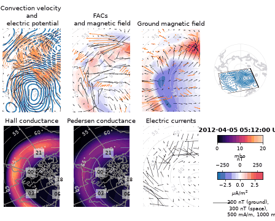

# Lompe · 极区电离层电动力学局地反演（klaundal/lompe）操作手册

目录：[`PROJECTS.json` → `Lompe`](../../PROJECTS.json) · 上游 <https://github.com/klaundal/lompe> · **不在 PyPI**（`pip index versions lompe` → `No matching distribution found`），从 GitHub 装 · main `c73d0ed`（2026-09-07 10:04 EDT；`git describe` = `v1.1.1-75-gc73d0ed`，pip 显示 `1.1.2.dev75+gc73d0edb0`）· 许可 **MIT** · 本机实跑 2026-09-26 05:30–05:37 EDT（CPython 3.13.5，venv，无 conda）

> 岗位：在一块**局地**立方球网格上，把 SuperDARN 视线速度、Iridium/AMPERE 卫星磁扰、SuperMAG 地面磁扰等**异构观测一起反演**，得到一致的电势、电场、对流速度、水平电流和场向电流（FAC）。冲突时：**`help(lompe.Data)` / 上游 examples > 本文**。

## 1. 它解决什么 / 不做什么

**做：**

- 模型参数是网格上的电场 SECS 振幅；用户给 Hall/Pedersen **电导函数**，Ohm 定律把 E 连到电流，电流再连到磁扰 → 所有数据类型进入同一个最小二乘
- 数据类型（`lompe.Data(datatype=...)`）：`convection`（m/s，可只给视线分量+`LOS`）、`efield`（V/m）、`ground_mag` / `space_mag_fac` / `space_mag_full`（T）、`fac`（A/m²）
- 输出函数：`E_pot`（V）、`E`（V/m）、`v`（m/s）、`j`（A/m）、`FAC`（A/m²，向上为正）、`B_ground` / `B_space`（T）；`lompe.lompeplot` 一张 7 面板总图
- 自带电导经验模型 `lompe.utils.conductance.hardy_EUV`（Hardy 极光 + 日照 EUV）；`lompe/data_tools/` 有 SuperDARN/SuperMAG/AMPERE/SSUSI/SSIES/Swarm/CHAMP 读取器

**不做：**

- **不是**全球对流模型（不像 SuperDARN MAP 球谐拟合）；网格外没有定义，边缘几格受边界效应
- 不下载也不预处理原始数据的全部流程：`data_tools` 多数要网络/账号（SuperMAG API 需用户名），本文只用仓内**已处理好的 HDF5 样例**
- 不做时间演化；每个时刻独立反演
- 不算电导：`hardy_EUV` 是统计模型，真实研究常用 SSUSI/SSIES 反推电导（仓内有示例，本文未跑）

| 相邻页面 | 关系 |
| --- | --- |
| [pydarn](./pydarn.md) | 读 SuperDARN FITACF/MAP 原始文件、画全球对流图；Lompe 用的是已经网格化的 grdmap 视线速度 |
| [superdarn-data](./superdarn-data.md) | SuperDARN 原始数据从哪下 |
| [apexpy](./apexpy.md) / [aacgmv2](./aacgmv2.md) | 磁坐标；Lompe 依赖 apexpy（`lompeplot` 需要 `apex=`） |
| [gitm](./gitm.md) | 全球物理模式；GITM 的高纬驱动是经验电势（Weimer 等），Lompe 给的是**观测约束**的局地电势 |
| [pyspedas](./pyspedas.md) | 选事件：OMNI IMF/AE/SYM-H 时间线 |

## 2. 安装

```bash
mkdir -p ~/iono_ops && cd ~/iono_ops
git clone https://github.com/klaundal/lompe.git          # 工作树 325 MB（含 290 MB 样例数据），.git 362 MB
python3 -m venv .venv && source .venv/bin/activate
pip install --no-cache-dir "./lompe[deps-from-github]"   # dipole/polplot/secsy 三个依赖只在 GitHub
pip install --no-cache-dir tables                        # pd.read_hdf 读样例需要 PyTables（不在依赖表里）
pip list | grep -i -E "lompe|apexpy|secsy|polplot|dipole|ppigrf"
python -u -m pytest -q lompe/tests                       # 本机：6 passed, 2 warnings in 0.99s
```

本机版本：lompe `1.1.2.dev75+gc73d0edb0`、apexpy 2.1.1、ppigrf 2.1.0、secsy `6f699cb`、polplot `b062136`、dipole `8acb535`、numpy 2.5.3、scipy 1.18.1、pandas 3.0.6、matplotlib 3.11.2、tables 3.11.1。上游 README 推荐 conda + `binder/environment.yml`，本文只验证了纯 pip。

## 3. 端到端：2012-04-05 05:12 UT，三种观测联合反演

来源：把 `examples/demoscripts/demo.py`（整天每 3 分钟循环、存图路径写死 `/Users/amalie/...`）改成**单时刻**脚本；数据全部来自仓内 `examples/sample_dataset/`：`20120405_iridium.h5`（AMPERE/Iridium 磁扰，nT，`r` 为米）、`20120405_supermag.h5`（地面磁扰 nT）、`20120405_superdarn_grdmap.h5`（视线速度 `vlos` m/s + 视线单位矢量 `le/ln`）。无需任何账号。

```bash
cd ~/iono_ops            # 脚本里 D 指向 ./lompe/examples/sample_dataset/
python -u lompe_one.py
```

`lompe_one.py`：

```python
import time, logging; t0 = time.time()
import numpy as np, pandas as pd, apexpy, lompe, matplotlib
matplotlib.use('Agg'); logging.getLogger('matplotlib.font_manager').setLevel(logging.ERROR)
from datetime import timedelta
from lompe.utils.conductance import hardy_EUV
D = 'lompe/examples/sample_dataset/'                  # 仓库自带样例（2012-04-05）
t, DT = pd.Timestamp('2012-04-05 05:12'), timedelta(minutes=2)
# 网格：中心 (lon -90, lat 65)，朝向 (east -1, north 2)，4200 km x 7000 km，100 km 分辨率，电离层半径 R
grid = lompe.cs.CSgrid(lompe.cs.CSprojection((-90, 65), (-1, 2)), 4200e3, 7000e3, 100e3, 100e3, R=6481.2e3)
print('grid shape (interior centres):', grid.lat.shape, '| R_iono [m] =', grid.R)
amp = pd.read_hdf(D + '20120405_iridium.h5'); sm = pd.read_hdf(D + '20120405_supermag.h5'); sd = pd.read_hdf(D + '20120405_superdarn_grdmap.h5')
a = amp[(amp.time >= t - DT) & (amp.time <= t + DT)]; s = sm[t - DT:t + DT]; d = sd.loc[(sd.index >= t - DT) & (sd.index <= t + DT)]
print('rows in +-2 min window: iridium=%d supermag=%d superdarn=%d' % (len(a), len(s), len(d)))
amp_data = lompe.Data(np.vstack((a.B_e.values, a.B_n.values, a.B_r.values)) * 1e-9,        # nT -> T
                      np.vstack((a.lon.values, a.lat.values, a.r.values)), datatype='space_mag_fac', error=30e-9, iweight=1.0)
sm_data = lompe.Data(np.vstack((s.Be.values, s.Bn.values, s.Bu.values)) * 1e-9, np.vstack((s.lon.values, s.lat.values)),
                     datatype='ground_mag', error=10e-9, iweight=0.4)
sd_data = lompe.Data(d['vlos'].values, coordinates=np.vstack((d['glon'].values, d['glat'].values)),
                     LOS=np.vstack((d['le'].values, d['ln'].values)), datatype='convection', error=50, iweight=1.0)
SH = lambda lon=grid.lon, lat=grid.lat: hardy_EUV(lon, lat, 4, t, 'hall')       # Kp=4
SP = lambda lon=grid.lon, lat=grid.lat: hardy_EUV(lon, lat, 4, t, 'pedersen')
model = lompe.Emodel(grid, Hall_Pedersen_conductance=(SH, SP), epoch=2012.26)
model.add_data(amp_data, sm_data, sd_data)
model.run_inversion(l1=2, l2=0)
print('model vector m: size =', model.m.size)
V = model.E_pot(); Ee, En = model.E(); ve, vn = model.v(); je, jn = model.j(); fac = model.FAC()
print('E_pot [kV]: min=%.1f max=%.1f  -> potential drop in grid [kV]=%.1f' % (V.min()/1e3, V.max()/1e3, (V.max()-V.min())/1e3))
print('|E| [mV/m]: max=%.1f median=%.1f' % (np.hypot(Ee, En).max()*1e3, np.median(np.hypot(Ee, En))*1e3))
print('|v| [m/s]: max=%.0f median=%.0f' % (np.hypot(ve, vn).max(), np.median(np.hypot(ve, vn))))
print('|j| horizontal [A/m]: max=%.3f median=%.3f' % (np.hypot(je, jn).max(), np.median(np.hypot(je, jn))))
print('FAC (upward +) [uA/m^2]: min=%.2f max=%.2f' % (fac.min()*1e6, fac.max()*1e6))
print('SH [S]: min=%.2f max=%.2f | SP [S]: min=%.2f max=%.2f' % (SH().min(), SH().max(), SP().min(), SP().max()))
lompe.lompeplot(model, include_data=True, time=t, apex=apexpy.Apex(2012, refh=110), figheight=6,
                savekw={'fname': 'lompe_20120405_0512.png', 'dpi': 60})
print('saved lompe_20120405_0512.png | elapsed [s] = %.1f' % (time.time() - t0))
```

**本机 stdout（2026-09-26 05:36 EDT，完整）：**

```text
grid shape (interior centres): (53, 37) | R_iono [m] = 6481200.0
rows in +-2 min window: iridium=815 supermag=1280 superdarn=1438
ground_mag: Measurement uncertainty effectively changed from 1e-08 to 1.5811388300841896e-08
model vector m: size = 2052
E_pot [kV]: min=-58.3 max=45.6  -> potential drop in grid [kV]=103.9
|E| [mV/m]: max=64.8 median=27.1
|v| [m/s]: max=1217 median=490
|j| horizontal [A/m]: max=0.887 median=0.073
FAC (upward +) [uA/m^2]: min=-1.45 max=2.26
SH [S]: min=0.00 max=16.14 | SP [S]: min=0.00 max=8.60
saved lompe_20120405_0512.png | elapsed [s] = 40.6
```



面板（`lompeplot` 默认）：左上 对流速度矢量 + 电势等值线（橙色箭头为输入数据，各面板同理）；上中 FAC 色块 + 空间磁扰矢量；右上 地面磁扰；下排 Hall、Pedersen 电导与水平电流；右侧小图是网格在北半球的位置，色标单位为 mho（=S）、μA/m²、nT。

## 4. 输入 / 输出字段

**`lompe.Data(values, coordinates, LOS=None, datatype=..., error=..., iweight=...)`**（单位出自 `lompe/model/data.py` 文档串）：

| datatype | `values` 形状与单位 | `coordinates` | 默认 `error` / `iweight`（未给时告警） |
| --- | --- | --- | --- |
| `convection` | (2,N) 东/北 m/s；或 N 个视线值 + `LOS`(2,N) 东/北单位矢量 | (2,N) 经度°、纬度° | 50 m/s / 1.0 |
| `efield` | 同上，V/m | (2,N) | 3e-3 V/m / 1.0 |
| `ground_mag` | (3,N) 东/北/上，**T** | (2,N) 或 (3,N)+地心半径 m | 10e-9 T / 0.5 |
| `space_mag_fac` | (3,N) 东/北/上 T（上分量不用但必须给） | (3,N) 经、纬、半径 m | 30e-9 T / 0.5 |
| `space_mag_full` | 同上（低轨精密磁强计，如 Swarm/CHAMP） | (3,N) | 30e-9 T / 0.5 |
| `fac` | A/m²，按模型网格排列 | 可省略 | 1e-6 / 1.0 |

`iweight` 的作用是把误差放大为 `error/sqrt(iweight)`：本例 `ground_mag` 的 `10e-9/sqrt(0.4)=1.58e-8`，就是 stdout 里那行 `Measurement uncertainty effectively changed from 1e-08 to 1.58…e-08`。

**`CSgrid(CSprojection(position, orientation), L, W, Lres, Wres, R)`**：`position`=(lon°, lat°) 网格中心；`orientation`=(东, 北) 分量给出网格"L 方向"；`L`/`W` 边长 m；`Lres`/`Wres` 分辨率 m；`R` 电离层半径 m（例子用 6481.2e3 = 地球半径 6371.2 km + 110 km）。本例 4200×7000 km / 100 km → 内部 **53×37** 格，模型参数 **2052** 个。

**`run_inversion(l1, l2, l3, FAC_reg=False, data_density_weight=True, perimeter_width=10)`**：`l1` 模型范数阻尼、`l2`/`l3` 磁东/磁北方向梯度阻尼；`perimeter_width` 网格外扩多少格来收数据。

| 输出（默认在网格内部中心求值） | 单位 | 本例 |
| --- | --- | --- |
| `E_pot()` | V，展平，**任意常数偏移** | −58.3 … 45.6 kV，网格内电势差 103.9 kV |
| `E()` → (Ee, En) | V/m | \|E\| 最大 64.8 mV/m，中位 27.1 mV/m |
| `v()` → (ve, vn) | m/s | \|v\| 最大 1217，中位 490 |
| `j()` → (je, jn) | A/m（面电流密度） | \|j\| 最大 0.887，中位 0.073 |
| `FAC()` | A/m²，向上为正 | −1.45 … 2.26 μA/m² |
| `hardy_EUV(..., 'hall'/'pedersen')` | S | SH 0.00–16.14，SP 0.00–8.60 |

## 5. 怎么读结果

- **电势差 ≠ 全球 CPCP**：103.9 kV 只是这块 4200×7000 km 网格里的最大减最小；电势本身只定义到常数，比较时只看差值/等值线形状。
- \|E\| 与 \|v\| 相互一致：v ≈ E/B，高纬 B≈5×10⁻⁵ T 时 27 mV/m ↔ 约 540 m/s，与中位 490 m/s 同量级。
- FAC 正负对应上/下行电流片；本例 −1.45…+2.26 μA/m² 落在常见的 Region 1/2 电流量级（1 μA/m² 上下）。
- 电导函数决定"电场怎样变成电流"：`hardy_EUV` 在本例约 18.4% 格点 SH≤0.01 S（夜侧、极光椭圆外），这些格点上 E 再大也不产生电流，地面磁扰对 E 的约束也就弱。
- 与 GNSS 结合：把 `v()`/`E()` 插到 GNSS 穿刺点（IPP，[pydarn](./pydarn.md) 页有门号→经纬度），看 TEC 斑块/闪烁与强对流、FAC 边界的位置关系（教程 05）。

## 6. 坑（现象 → 原因 → 一条修复命令）

| # | 现象 | 原因 | 修复 |
| ---: | --- | --- | --- |
| 1 | `pip install lompe` → `No matching distribution found for lompe` | 不在 PyPI | `pip install "lompe[deps-from-github] @ git+https://github.com/klaundal/lompe.git@main"` |
| 2 | `import lompe` → `ModuleNotFoundError: No module named 'secsy'` | 裸装 `pip install ./lompe` 不带 dipole/polplot/secsy | `pip install --no-cache-dir "./lompe[deps-from-github]"` |
| 3 | `pd.read_hdf(...)` → ``ImportError: `Import pytables` failed.`` | 样例是 PyTables HDF5，`tables` 不在依赖表 | `pip install --no-cache-dir tables` |
| 4 | 每画一张图刷出数百行 `findfont: Generic family 'sans-serif' not found because none of the following families were found: Verdana`（本机一次 670 行） | `visualization.py` 全局 `rc` 设了 Verdana，Linux 通常没有 | 脚本开头加 `logging.getLogger('matplotlib.font_manager').setLevel(logging.ERROR)`（本机 3→0 行） |
| 5 | 反演后地面磁扰在夜侧拟合差、电流为零 | `hardy_EUV` 默认 `starlight=0`，本例 18.4% 格点 SH≤0.01 S | `hardy_EUV(lon, lat, 4, t, 'hall', starlight=0.5)`（本机 SH 最小值 0.00→0.50；是否合理取决于事件，未评估对结果的影响） |
| 6 | 照抄 README 的 `model.lompeplot()` → `AttributeError` | 画图是模块函数，不是 `Emodel` 方法（`hasattr(lompe.Emodel,'lompeplot')` = False） | `lompe.lompeplot(model, include_data=True, time=t, apex=apexpy.Apex(2012, refh=110))` |
| 7 | 直接跑 `examples/demoscripts/demo.py` 写图失败、且要循环 479 个时刻 | `savepath` 写死 `/Users/amalie/Downloads/demofigs/`；`times[1:]` 为整天 3 分钟步 | `sed -i "s#^savepath = .*#savepath = './'#" examples/demoscripts/demo.py`，并按 §3 只取一个时刻 |
| 8 | demo 里注释写 `Kp = 4`，结果却对应 Kp 5 | `Kp` 变量没被用，`hardy_EUV(lon, lat, 5, ...)` 写死 5 | 统一改成变量：`hardy_EUV(lon, lat, Kp, t, 'hall')` |
| 9 | 磁扰量级错 10⁹ 倍、反演发散 | `Data` 要求 **T**，样例文件是 nT | `lompe.Data(B_nT * 1e-9, coords, datatype='ground_mag', ...)` |
| 10 | `UserWarning: 'error' keyword not set for datatype ...`（`data.py` 源码中的告警文本，本例显式给了未触发） | 没给 `error`/`iweight` 时用默认值（见 §4 表） | 显式给：`lompe.Data(..., error=10e-9, iweight=0.4)` |
| 11 | 自己写 `np.hypot(sd.le, sd.ln)` → `AttributeError: 'function' object has no attribute 'hypot'` | grdmap 表的视线列名 `le`/`ln` 与 `DataFrame.le()`（≤ 比较方法）重名，属性访问拿到的是方法 | 一律用下标：`np.vstack((sd['le'].values, sd['ln'].values))`（本机 hypot 0.99999983–1.00000016，确为单位矢量） |

## 7. 许可与诚实边界

- MIT（© 2021 Karl M. Laundal）；引用见 `CITATION.cff`：Zenodo 10.5281/zenodo.5973739、Laundal et al. 2022 JGR（10.1029/2022JA030356）、Frontiers 2022 “The Lompe code: A Python toolbox for ionospheric data analysis”（10.3389/fspas.2022.1025823）。样例数据各自有 SuperDARN / SuperMAG / AMPERE 的使用与致谢规则，发表时须按各数据方要求致谢。
- **实跑**：纯 pip 安装、`pytest` 6 项、`demo.py` 的单时刻版本（真实 2012-04-05 样例，三种数据联合），输出数值与图均为本机结果。
- **未实跑**：各 `.ipynb`（含 `lompe_demo.ipynb`、`synthetic_global_data_example.ipynb`）、`data_tools` 在线下载（SuperMAG 需账号）、SSUSI/SSIES 电导、`calc_resolution`、`FAC_reg=True`、`extras`（pyAMPS/pydarn/cdflib）、conda 安装路径；没有对 `l1/l2` 做 L 曲线选择，`l1=2, l2=0` 直接取自 demo。
- 本页数值不代表对 2012-04-05 事件的物理解释，只说明"管线跑通、单位正确"。

## 8. 链接

- 教程：[05 闪烁与 ROTI（高纬斑块）](../tutorials/05-scintillation-roti.md) · [12 数据同化入门（反演/正则化思路）](../tutorials/12-data-assimilation-intro.md) · [14 空间天气案例](../tutorials/14-space-weather-case.md)
- 兄弟：[pydarn](./pydarn.md) · [superdarn-data](./superdarn-data.md) · [apexpy](./apexpy.md) · [aacgmv2](./aacgmv2.md) · [pyspedas](./pyspedas.md) · [gitm](./gitm.md) · [pymsis](./pymsis.md)
