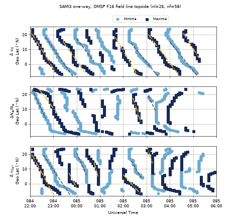

# lstid-processing · NRL 大尺度 TID（LSTID）识别与 SAMI3 模式处理操作手册

目录：上游 <https://github.com/USNavalResearchLaboratory/lstid_processing>（NRL，维护者 Angeline G. Burrell）· PyPI **`lstid_processing` 0.0.2** · tip **`80b576d`**（2026-09-10，提交信息 “REL: copy of repository”）· **MIT** · ★0 · Zenodo DOI 10.5281/zenodo.15528276 · 论文复现包，对应 Burrell et al. (2026) JGR doi:10.1029/2025JA034335，作者说明**不会频繁更新**。

> 本文实测：2026-09-26 01:18–01:32 EDT，Debian / Python **3.13.5**，venv 里 `lstid_processing 0.0.2`、pysat **3.2.2**、pysatNASA **0.0.6**、numpy **2.2.6**、pandas **2.3.3**、xarray **2026.7.0**、scipy **1.18.1**。
> 冲突时：**本机源码 > ReadTheDocs > 本文**。
> **质检复跑通过**（2026-09-26 01:38–01:52 EDT，独立 venv / Python 3.13.5）：tip `80b576d`、★0、MIT 2025 Burrell 一致；fsspec Range 抽取 347 s；§4.2 全部 21 条拟合（含省略的 vsi2 3+5 条）与 `max|diff|=6.887752087431087e-14` **逐位一致**；CINDI 71156 行、3 个滤波量 p50/p99、**9** 个事件起止/经度/幅度、283 行 >1、最小 980 cm⁻³、15065 s 缺口、下载 0326（25945098 B）+0327（31402027 B）**全部一致**；坑 1/2/3/5/8 实测复现（坑 2 在 numpy 2.5.3 下 `import` 即报）。修：6 文件总量实为 **277 GB** 不是 314 GB（且其中 1 个是 1490 B 的 txt）；§4.2 原本指向仓外 `/workspace/lstid_data` 的完整脚本，已把打印循环补进正文。

## 1. 它解决什么问题

**TID（Travelling Ionospheric Disturbance，行进式电离层扰动）**：电离层电子密度里一串往前推进的波纹，多数由大气重力波（AGW）拖动等离子体造成。按尺度粗分两类（口径见课 [22](../tutorials/22-tid-traveling-disturbances.md) §4）：

| | MSTID（中尺度） | LSTID（大尺度） |
| --- | --- | --- |
| 周期 | 十几分钟–约 1 h | 常见 1–3 h |
| 水平波长 | 几百 km | 可达上千 km |
| 典型来源 | 中性风/Es 耦合，地磁宁静也有 | 磁暴时极区加热，向赤道传播 |

本包**不处理 GNSS TEC**。它做两件事，都是为一篇论文服务的：

1. **卫星原位观测**：C/NOFS 卫星 CINDI 离子速度计（IVM）的离子密度 `ionDensity`、沿磁力线/经向漂移。用 Butterworth 带通滤出扰动，然后用阈值规则 `identify_tid()` 找“密度和速度同时起伏”的时段，这些就是 TID 事件。只有密度在跳、速度不动的是等离子体泡，会被排除。
2. **SAMI3 电离层模式**（NRL 物理模式，与 WACCM-X 耦合）：对 2014-03-25/26 磁暴的模拟输出，沿 DMSP F16 / C/NOFS 经过的磁力线取相对扰动，找各高度上扰动的**极大/极小值**，再对“极值纬度随时间”做直线拟合，斜率就是**波前在纬度方向的视移动速度**。

**关键术语在本代码里的样子：**

- **去趋势 / 相对扰动**：GNSS 里的 dTEC 是 TEC 减去一条平滑曲线（见 [gnss-tec](./gnss-tec.md)）。本包的做法是 `rel_data_butter()`：12 阶 Butterworth 带通 + `sosfiltfilt` 零相位滤波，再做 `filtered / raw`，得到 ΔN/N（无量纲）。速度类变量则设 `relative=False`，直接保留滤波后的 m/s。
- **周期窗**：SAMI3 用 30–120 min（`min_period=1800, max_period=7200` s，采样 300 s），对应 LSTID。CINDI 默认 150–300 s（采样 1 s），这是卫星以约 7.5 km/s 飞过时，千公里级波长在时间序列里表现出的**视周期**，不是 TID 本身的周期（源码 docstring：“determined using the orbital period and the wavelength of LSTIDs”）。
- **相速度**：本包没有直接输出。`fit_lines_to_peaks()` 给出的是 `linregress(秒, 纬度)` 的斜率，单位 °/s。乘 111.2 km/° 可以换成经向 m/s，这个换算是本文加的，上游没有。

## 2. 安装

```bash
python3 -m venv ~/.venv-lstid && . ~/.venv-lstid/bin/activate
pip install lstid_processing                  # 0.0.2，会拉 pysat / pysatNASA / cmocean / xarray
pip install "numpy<2.3" "pandas<3"            # 必需，原因见 §7 坑 2、坑 3
mkdir -p ~/pysatData && python -c "import pysat; pysat.params['data_dirs'] = '$HOME/pysatData'"   # 必需，见坑 1
python -c "import lstid_processing, lstid_processing.model as m; print(lstid_processing.__file__)"
# 只有 SAMI3 远程抽子集才需要：
pip install fsspec aiohttp h5py h5netcdf
```

`import lstid_processing` 会自动导入 `cindi` 子模块，进而 `import pysatNASA`。所以即使你只用 SAMI3 部分，pysat 的数据目录也要先设置好。

## 3. 数据从哪来

| 数据 | 来源 | 大小 | 本机实测 |
| --- | --- | --- | --- |
| SAMI3 模式（官方下载器列 6 个文件：5 个 nc + `model_description.txt` 1490 B） | `https://map.nrl.navy.mil/map/pub/nrl/lstids/`，公开，不需要账号 | nc **32–74 GB/个**（HEAD `Content-Length`：oneway 74205114622 B、fejer 74205048375 B、nohpopcoll 59009590031 B、twoway 37161109231 B、diagh 32503859767 B） | 可达；整文件没下，用 HTTP Range 抽一条磁力线（§4.1） |
| C/NOFS CINDI IVM | NASA CDAWeb，由 pysatNASA `cnofs_ivm` 自动下载，不需要账号 | 约 26–31 MB/天（`cnofs_cindi_ivm_500ms_20140326_v01.cdf` 25945098 B） | 可达，已下载并跑通（§5） |

```bash
curl -sI https://map.nrl.navy.mil/map/pub/nrl/lstids/oneway_sami3_rel_w_hmf2_nmf2_2014084_85.nc | grep -i content-length
# Content-Length: 74205114622
```

官方下载器 `lstid_processing.model.io.download_nrl_files(outdir)` 在 `filename=None` 时会**把 6 个文件全部下载**，总量 **277084723516 B（约 277 GB / 258 GiB）**，并且用 `requests.get(url).content` 把整个文件读进内存再写盘。普通机器请不要这样调用，要么只传 `filename=`，要么走 §4.1 的抽取方式。

注意：`model_description.txt` 正文写的是 “25-26 March **2015**”，文件名和源码用的却是 2014084/085（**2014**-03-25/26）。以文件名和源码为准。

## 4. 端到端 A：SAMI3 → 带通 → 极值 → 线性拟合（本机真跑）

### 4.1 从 74 GB 文件里只取 DMSP F16 磁力线

oneway 文件是 HDF5（netCDF4），变量采用 contiguous 存储，形状为 `dene (575, 90, 160, 160)` = (时间, nl 经度, nf 磁力线, nz 沿线格点)。源码 `get_default_indices()` 写死了 DMSP 那条磁力线：`nl=26, nf=58`（11.3°N 33.2°E，845.8 km，会合时刻 2014-03-26 02:49:59 UT）。

```python
# extract_fieldline.py
import time, fsspec, h5py, xarray as xr
URL = "https://map.nrl.navy.mil/map/pub/nrl/lstids/oneway_sami3_rel_w_hmf2_nmf2_2014084_85.nc"
NL, NF = 26, 58
t0 = time.time()
h = h5py.File(fsspec.open(URL, block_size=65536).open(), "r")
ds = {k: (("num_times",), h[k][:]) for k in ["year", "day", "hrut"]}
for k in ["rel_dene_d", "rel_vnq_d", "rel_vsi2_d"]:          # 文件里已算好的 d 线相对扰动 (575,160)
    ds[k] = (("num_times", "nz"), h[k][:])
for k in ["dene", "glat", "zalt"]:
    ds[k] = (("num_times", "nl", "nf", "nz"), h[k][:, NL:NL+1, NF:NF+1, :])
    print(f"{k}: {ds[k][1].shape}  {time.time()-t0:.0f}s", flush=True)
xr.Dataset(ds).to_netcdf("sami3_oneway_fieldline_d.nc")
print("saved", time.time()-t0)
```

```text
dene: (575, 1, 1, 160)  128s
glat: (575, 1, 1, 160)  255s
zalt: (575, 1, 1, 160)  390s
saved 390.71331882476807
```

输出 `sami3_oneway_fieldline_d.nc` 为 **3332761 B**（质检复跑 3331684 B，数据相同、容器元数据差约 1 KB；耗时 347 s，随网络浮动），从 74 GB 文件中只读了约 3 MB 的数据，耗时约 6.5 min，基本都花在每个时刻一次 Range 请求上。子集里 `nl`、`nf` 维长度都是 1，所以后面所有函数的索引都传 `0, 0`。

### 4.2 跑论文 Fig.13 的流程

```python
# run_lstid_e2e.py（原作者完整脚本不在仓库里；下面补全了打印部分，可直接跑出下方 stdout）
import datetime as dt, numpy as np, matplotlib; matplotlib.use("Agg")
import lstid_processing, lstid_processing.model as lsmod
from lstid_processing.smoothing.filter_rout import rel_data_butter

print(lstid_processing.model.io.download_nrl_files("nrl", filename="model_description.txt"))
sami = lsmod.io.load_concat_file("sami3_oneway_fieldline_d.nc")      # 用 year/day/hrut 拼出 datetime
rel = rel_data_butter(sami["dene"].values[:, 0, 0, :], 300, min_period=1800, max_period=7200, axis=0)
print("recomputed vs stored rel_dene_d @nz=80, max|diff| =", np.nanmax(abs(rel[:, 80] - sami["rel_dene_d"].values[:, 80])))
estart, estop = dt.datetime(2014, 3, 25, 22), dt.datetime(2014, 3, 26, 6)
nt0 = lsmod.analysis.get_time_index(sami["datetime"].values, estart)
nt1 = lsmod.analysis.get_time_index(sami["datetime"].values, estop) + 1
f2 = lsmod.analysis.get_f2_peaks(0, 0, sami)                        # 南北半段各自的 F2 峰
nzinds = np.arange(f2["south"][nt0:nt1].min(), f2["north"][nt0:nt1].max() + 1)   # 两峰之间 = 顶部电离层
out = lsmod.plots.get_plot_tid_peaks(sami, nt0, nt1, 0, 0, nzinds, "d", add_lines=True)
min_lat, min_sec, _, min_fit, max_lat, max_sec, _, max_fit, fig = out
for name, lat, fits in [("minima", min_lat, min_fit), ("maxima", max_lat, max_fit)]:
    for key in lat:
        print(f"{name:6s} {key:11s} n_peaks={len(lat[key]):4d} n_fits={len(fits[key])}")
        for fit, t0, t1 in fits[key]:   # slope °/s ×3600 → °/h；×111.2e3 → m/s
            print(f"    {estart+dt.timedelta(seconds=t0):%H:%M}-{estart+dt.timedelta(seconds=t1):%H:%M} UT "
                  f"slope={fit.slope*3600:+.2f} deg/h  ~{fit.slope*111.2e3:+.0f} m/s  r={fit.rvalue:+.2f}")
fig.savefig("lstid_processing_tid_peaks.png", dpi=60)
```

真实 stdout（`python -W ignore run_lstid_e2e.py`，墙钟约 3 s）：

```text
INFO Successfully downloaded: nrl/model_description.txt
['nrl/model_description.txt']
dims: {'num_times': 575, 'nz': 160, 'nl': 1, 'nf': 1} time: 2014-03-25T00:05:00.000000000 -> 2014-03-26T23:55:00.000000000
recomputed vs stored rel_dene_d @nz=80, max|diff| = 6.887752087431087e-14
time idx 263:360, topside nz 24..137 (883 km max alt)
minima rel_vnq_d   n_peaks= 537 n_fits=4
    22:40-23:50 UT slope=-22.64 deg/h  ~-699 m/s  r=-0.98
    00:00-00:45 UT slope=-20.70 deg/h  ~-639 m/s  r=-0.93
    02:20-03:30 UT slope=-19.26 deg/h  ~-595 m/s  r=-0.98
    04:00-05:10 UT slope=-19.61 deg/h  ~-606 m/s  r=-0.97
minima rel_dene_d  n_peaks= 412 n_fits=2
    22:05-22:40 UT slope=-34.14 deg/h  ~-1054 m/s  r=-0.99
    03:05-03:25 UT slope=-33.05 deg/h  ~-1021 m/s  r=-0.73
...（rel_vsi2_d minima 3 条）
maxima rel_vnq_d   n_peaks= 568 n_fits=5
    22:05-23:05 UT slope=-25.69 deg/h  ~-794 m/s  r=-0.98
    23:25-00:20 UT slope=-22.32 deg/h  ~-689 m/s  r=-0.85
    01:40-02:45 UT slope=-26.96 deg/h  ~-833 m/s  r=-0.95
    03:05-04:24 UT slope=-21.03 deg/h  ~-650 m/s  r=-0.97
    04:35-05:15 UT slope=-24.94 deg/h  ~-770 m/s  r=-0.96
maxima rel_dene_d  n_peaks= 434 n_fits=2
    22:10-23:10 UT slope=-20.88 deg/h  ~-645 m/s  r=-0.89
    02:25-02:45 UT slope=-48.72 deg/h  ~-1505 m/s  r=-0.95
maxima rel_vsi2_d  n_peaks= 655 n_fits=5
...（5 条，−532 至 −1696 m/s）
saved lstid_processing_tid_peaks.png
```

`max|diff| = 6.9e-14` 说明：用包里的 `rel_data_butter`（300 s 采样、30–120 min）对原始 `dene` 重新计算，得到的就是 NRL 文件里存的 `rel_dene_d`，差异只到浮点误差。



### 4.3 怎么读这张图 / 这些数

- 三个面板分别是 Δu∥（中性风沿磁力线分量，`rel_vnq_d`）、ΔNe/Ne（`rel_dene_d`）、Δv∥(O⁺)（`rel_vsi2_d`）。横轴是 UT（`%j\n%H:%M`，084=3 月 25 日），纵轴是极值所在的地理纬度。
- **一个 LSTID 在图上的样子**：一串从约 20°N 向 0° 斜着往下走的点列（方块=极大，圆点=极小），虚线/点划线是线性拟合。斜率为负表示波前**由北向赤道**移动，符合磁暴时 LSTID 从高纬向赤道传播的图像。
- 本次 Δu∥ 的 9 条拟合 r 都在 −0.85 到 −0.98 之间，折合 **约 600–830 m/s 向赤道**，间隔约 1–1.5 h 出现一道波前。ΔNe/Ne 的点列更破碎（竖直的点柱是某一时刻很多高度同时出现峰值，不是传播），只拟合出 2 条，速度分散（−645 到 −1505 m/s）。
- `min_pnts=40`：少于 40 个极值的段不拟合，所以 `n_fits` 比肉眼能看到的斜列要少。
- 这个“速度”是**极值沿磁力线在纬度上的视移动**，把磁力线几何和高度混在了一起，不等于水平相速度，只能用来对比论文 Fig.13。

## 5. 端到端 B：C/NOFS CINDI → 带通 → `identify_tid`（本机真跑）

```python
# run_cindi.py（节选）
import datetime as dt, numpy as np, lstid_processing.cindi as lc
day = dt.datetime(2014, 3, 26)
cindi = lc.init_cindi_tid_data()          # pysat Instrument + 3 个 custom 带通（150–300 s）
cindi.download(start=day, stop=day)       # CDAWeb，~26 MB
cindi.load(date=day)
st, en = lc.identify_tid(cindi)           # 默认阈值见 §6
```

真实 stdout（节选，已去掉 pysat 横幅；另外实测 `cindi.download` 落了 0326 和 0327 两个文件）：

```text
rows: 71156 2014-03-26 00:00:04.500000 -> 2014-03-26 23:59:59.280000
filtered vars: ['ionDensity_rel_butter_Tmin150s_Tmax300s', 'ionVelparallel_rel_butter_Tmin150s_Tmax300s', 'ionVelmeridional_rel_butter_Tmin150s_Tmax300s']
  ionDensity_rel_butter_Tmin150s_Tmax300s: |x| p50=0.0221 p99=0.3661
  ionVelparallel_rel_butter_Tmin150s_Tmax300s: |x| p50=1.2745 p99=9.7337
  ionVelmeridional_rel_butter_Tmin150s_Tmax300s: |x| p50=1.4444 p99=16.1832
events: 9
  00:34:01-00:46:25 UT   12.4 min  glon  265.4-> 311.3  max|dNi/Ni|=104.877
  00:54:27-01:19:35 UT   25.1 min  glon  340.8->  71.3  max|dNi/Ni|=0.250
  02:11:54-02:53:29 UT   41.6 min  glon  253.0->  44.3  max|dNi/Ni|=44.219
  04:19:09-04:36:32 UT   17.4 min  glon  347.5->  50.4  max|dNi/Ni|=0.555
  07:21:37-07:35:43 UT   14.1 min  glon  274.3-> 325.2  max|dNi/Ni|=0.512
  09:03:09-09:14:42 UT   11.6 min  glon  274.8-> 316.7  max|dNi/Ni|=0.284
  15:14:24-15:20:25 UT    6.0 min  glon  151.1-> 172.7  max|dNi/Ni|=0.566
  16:31:56-16:45:53 UT   13.9 min  glon   64.5-> 115.4  max|dNi/Ni|=3.891
  22:44:05-23:29:42 UT   45.6 min  glon  303.6-> 109.7  max|dNi/Ni|=19.407
```

**解读：**

- 论文里 C/NOFS–DMSP 会合时刻是 02:49:59 UT。实测此刻 C/NOFS 位于 glat 10.77°、glon 31.6°、472.9 km，正好落在第 3 个事件（02:11:54–02:53:29）里。
- `max|dNi/Ni|` 出现 104.9、44.2 这种远大于 1 的值：`init_cindi_tid_data` 用的是 `clean_level='none'`（源码注释写着 temporary），`filtered/raw` 在低密度或坏点处会被放大。当天 |ΔNi/Ni|>1 的行有 **283** 行，`ionDensity` 最小值为 980 cm⁻³。事件边界本身由阈值决定，受影响不大，但**幅度不能直接引用**。
- 当天时间戳中位间隔 1.00 s，但有一个 **15065 s** 的数据缺口。`fill_data` 只插补坏值，不会重新网格化时间轴，所以跨缺口的滤波结果不可靠。

## 6. 参数与输出字段

**主要函数参数（默认值取自源码）**

| 函数 | 参数 | 默认 | 含义 |
| --- | --- | --- | --- |
| `rel_data_butter` | `samp_period` | 必填 | 采样间隔 s（SAMI3 300，CINDI 1） |
| | `min_period` / `max_period` | −1 / −1 | 两者都给=带通；只给 min=低通；只给 max=高通；都不给则 ValueError |
| | `relative` | True | True 返回 filtered/raw（ΔN/N）；False 返回 filtered 本身 |
| `init_cindi_tid_data` | `min_period`, `max_period` | 150, 300 | 生成变量名 `<var>_rel_butter_Tmin150s_Tmax300s` |
| `identify_tid` | `dens_pert_thresh` | 0.2 | \|ΔNi/Ni\| 超过此值算扰动 |
| | `dens_quiet_thresh` | 0.1 | 低于此值且速度也平静才算安静 |
| | `vel_pert_thresh` | 10.0 | \|Δv\| m/s 超过此值算速度扰动 |
| | `vel_sec` | 60 | 密度扰动点 60 s 内必须有速度扰动，否则当作泡 |
| | `join_sec` | 300 | 间隔 300 s 内的触发合并成同一事件 |
| `get_topside_peaks`（经 `get_plot_tid_peaks` 的 `'d'` 预设） | `dat_scale` | [100, 1, 100] | 找峰前先除以此值 |
| | `peak_heights` | [5.0, 0.025, 5.0] | `scipy.signal.find_peaks(height=)`；ΔNe/Ne 须 >2.5%（`'c'` 预设为 [None, 0.025, None]） |
| `find_linear_breaks` | `lat_break`, `sec_break`, `max_lat` | 6.0°, 900 s, 20° | 相邻极值纬度跳 >6° 或时间跳 >15 min 就断开成新波前 |
| `fit_lines_to_peaks` | `min_pnts` | 40 | 一段至少 41 个极值才拟合 |
| `create_concat_files` | `nl_inds`/`nf_inds`/`key_inds` | [26,26]/[44,58]/['c','d'] | c=C/NOFS 线，d=DMSP F16 线 |

**输出**

| 输出 | 类型 | 字段/含义 |
| --- | --- | --- |
| `identify_tid` | `(event_start, event_end)` | 两个等长的 `Timestamp` 列表 |
| `get_plot_tid_peaks` | 9 元组 | `min_lat, min_sec, min_lat_break, min_lin_fit, max_lat, max_sec, max_lat_break, max_lin_fit, fig` |
| `*_lat` / `*_sec` | dict→ndarray | 每个极值的地理纬度 / 距起始时刻的秒数，按“时间、再按距 20°N 的纬度差”排序 |
| `*_lin_fit[key]` | list of `[LinregressResult, tmin, tmax]` | `.slope` °/s、`.intercept`、`.rvalue`；tmin/tmax 为该段秒数范围 |
| `create_concat_files` | 两个 nc | `sami_<run>_f1_f2_f3_<dates>.nc` 与 `…_rel_max.nc`（加 `rel_<var>_<c|d>`、`rel_u1/2/3`、`rel_u*_max`） |
| `get_dominant_acceleration` | ndarray | 1=等离子体压力梯度，2=离子–中性碰撞，3=离子–离子碰撞 |
| NRL oneway 文件 | 变量 | `dene` 电子密度、`vsi2` O⁺ 沿线速度、`u1p/u3h` 加速度项、`denn2`/`un`/`vn`/`wn`/`vnq`/`vnp`/`vnphi` 中性量、`rel_*_c/d`、`rel_hmf2_*`/`rel_nmf2_*` |

## 7. 坑（现象 → 原因 → 修复）

1. **`import lstid_processing` 报 `NameError: pysat's data_dirs hasn't been set`** → `__init__` 导入 cindi → pysatNASA 的 constellations 在导入时实例化 Instrument → 需要数据目录。修复：`mkdir -p ~/pysatData && python -c "import pysat; pysat.params['data_dirs']='$HOME/pysatData'"`
2. **`TypeError: data type 'a' not understood`（pysat `_files.py` `pds.Series([], dtype='a')`）** → numpy 2.5 已删除 `'a'` 别名，pysat 3.2.2 还在用；2.2.6 只报 DeprecationWarning。修复：`pip install "numpy<2.3"`
3. **`cindi.load()` 报 `ValueError: assignment destination is read-only`（`fill_rout.fill_data`）** → pandas 3 默认 Copy-on-Write，`inst[key].copy()` 得到的 `.values` 仍是只读视图。修复：`pip install "pandas<3"`（实测 2.3.3 正常）
4. **`download_nrl_files(outdir)` 把内存和磁盘都撑爆** → 不传 `filename` 时会下载 6 个文件共约 277 GB，而且整文件先读进内存。修复：`download_nrl_files(outdir, filename="model_description.txt")`，大文件用 §4.1 的 Range 子集
5. **把 `get_default_indices()` 的结果传给子集后报 `IndexError: index 26 is out of bounds for axis 1 with size 1`**（实测） → 它写死了 `nl=26, nf=58/44`，子集里这两个维度只剩长度 1。修复：子集里索引一律传 `0, 0`，例如 `lsmod.analysis.get_f2_peaks(0, 0, sami)`
6. **自己用 `xr.open_dataset(nc)` 打开后没有可用的 `datetime`，`get_time_index` 无从下手** → 源码注释原话 “Time decoding doesn't work because there are multiple time variables”，所以必须 `decode_times=False`，再由 `year/day/hrut` 拼出时间。修复：`sami = lstid_processing.model.io.load_concat_file("sami3_oneway_fieldline_d.nc")`
7. **CINDI ΔNi/Ni 出现几十甚至上百** → `clean_level='none'`，相对量在低密度处被放大（本次 283 行 >1）。修复：判事件时只用阈值，报告幅度前先裁掉：`cindi.data = cindi.data[abs(cindi['ionDensity_rel_butter_Tmin150s_Tmax300s']) < 1]`
8. **`fsspec` 远程读 HDF5 报 `ImportError: HTTPFileSystem requires "requests" and "aiohttp" to be installed`**（干净 venv 实测） → fsspec 的 HTTP 后端依赖 aiohttp，而它不会自动安装。修复：`pip install aiohttp h5py`

## 8. 诚实边界

- 只跑通了**论文案例**：2014-03-25/26、DMSP 那条磁力线、CINDI 一天。换别的 SAMI3 运行时，`create_concat_files` 需要本地的 `sami3_f1/f2/f3_YYYYDDD.nc`，这类文件不公开，本机没有，所以没跑。
- 没有下载完整的 74 GB 文件，所有 SAMI3 结果都来自一条磁力线的子集。文件里预先算好的 `rel_dene_d` 与本机复算结果一致（6.9e-14）。
- 本包**没有** GNSS TEC 接口，不能拿来对 RINEX 做 dTEC 分析。那条路线请用 [gnss-tec](./gnss-tec.md) → [pytecgg](./pytecgg.md) 做去趋势。
- 没有 CLI，全部通过 Python API 调用。ReadTheDocs 上的 `ex_dmsp_peak_plot` 示例假定你已经把 74 GB 文件完整加载进内存。
- 许可：MIT（`LICENSE` 版权人 Angeline G. Burrell 2025）。源码头注有 “DISTRIBUTION STATEMENT A: Approved for public release”。

## 9. 相关

- 课：[22 TID/MSTID](../tutorials/22-tid-traveling-disturbances.md)（尺度与去趋势）· [20 磁暴 TEC](../tutorials/20-storm-tec-analysis.md) · [19 现象总览](../tutorials/19-phenomena-overview.md)
- 同类（不同观测手段）：[hamsci-lstid-detection](./hamsci-lstid-detection.md)（业余无线电 HF 跳距边缘，同样针对 LSTID）
- GNSS 侧：[gnss-tec](./gnss-tec.md) · [pytecgg](./pytecgg.md) · [oasis-roti](./oasis-roti.md)（ΔTEC）
- pysat 家族：[pysatcdaac](./pysatcdaac.md) · 数据入口 [data-access](../data-access.md)
