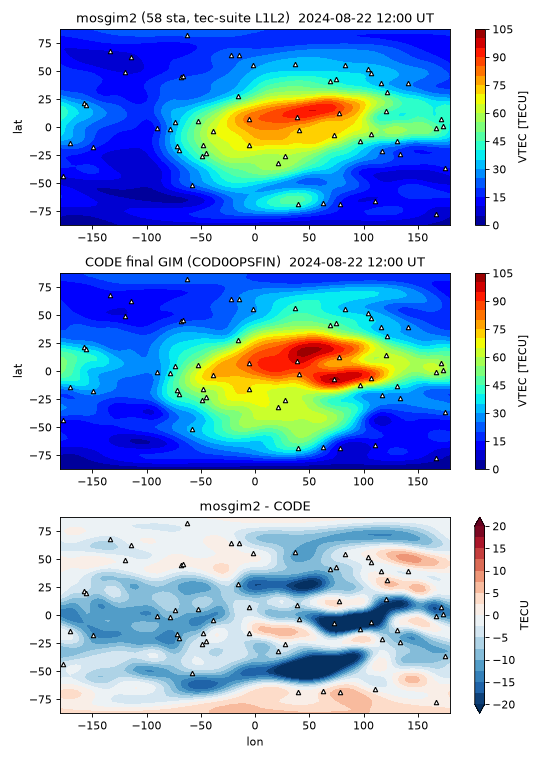

# mosgim2 · 仅用相位差的开源全球电离层图（GIM）求解器操作手册

目录：上游 <https://github.com/PadArt/mosgim2> · tip **`fc42e31`**（2023-08-09，共 13 commit，无 tag/PyPI）· **MIT**（Copyright 2023 Artem Padokhin, Artem Vesnin）· 方法论文：Padokhin et al., *Radiophysics and Quantum Electronics* 65(7):481–495, 2023（用于研究须引用，见仓内 `CITATION.cff`）· 本机验证 **2026-09-26 02:25–02:50 EDT**：CPython 3.11.16，scipy **1.14.1** / numpy **2.1.3** / h5py 3.16.0 / lemkelcp 0.1（打 README 所述补丁）/ cartopy 0.26.0；输入 = [tec-suite](./tec-suite.md) 处理的 BKG 2024-08-22 **58 站** GPS+GLONASS 相位 TEC；`process.py` 两层球谐（15×15 + 10×10）一日 **25 幅**，墙钟 **6 m 49 s**；与 CODE 终版 GIM 对比 corr **0.951**、偏差 **−5.58 TECU**、RMS **9.67 TECU**。

> 岗位：把多站“连续弧上的相位 TEC”拼成全球 VTEC 球谐系数（HDF5），再画图或自行格网化。  
> 冲突时：**仓内 `config.py` 注释 / 本机实跑 > 本文**。维护者自有的 SH-GIM 求解器未开源，边界见 [sh-gim](./sh-gim.md)；本工具是独立第三方开源实现。

## 1. 它解决什么问题

| 概念 | 在 mosgim2 里怎么处理 |
| --- | --- |
| **STEC / VTEC** | 输入是斜 TEC（STEC）；模型输出壳层上的垂直 TEC（VTEC）。STEC = VTEC(IPP)·M(el)，M = 1/√(1−(R cos el/(R+H))²)（`coords/geom.py: MF`） |
| **薄壳 IPP** | 视线与 R+H 球面的交点。默认**两层**：H₁ = 300 km、H₂ = 750 km，各自一套球谐；总 VTEC = 两层相加 |
| **DCB 与相位模糊度** | 不估计。同一连续弧里取 TEC 最小的历元作参考，观测量 = `tec(t) − tec(t_ref)`（`derivative=False`），常数项（模糊度 + 卫星/接收机 DCB）直接消掉——所以**不需要**码观测、不需要 DCB、也不需要整平 |
| **球谐 / GIM** | VTEC 在**日固地磁坐标**（地磁纬度 × 磁地方时 MLT，`coords='mag'`）展开成实球谐，阶 15；时间上 24 段分段线性（25 个节点 = 00:00…24:00 UT） |
| **正值约束** | 最小二乘后在稀疏网格上查负值，用 Lemke 法解线性互补问题（LCP）修正，最多 10 轮 |
| **IONEX** | **不写 IONEX**；输出只有球谐系数 HDF5。要 IONEX/格网，自己用 `mosgim2.plot.frames.makeframes` 计算（§4 脚本就是） |

与 CODE/IGS 的区别：它们用码+相位、同时估 DCB（CODE 头注明约 300 站、单层、改进 MSLM）；mosgim2 只用相位差，天然多系统混用，代价是**绝对量级只能靠弧内差分的几何变化间接约束**。

## 2. 安装

```bash
cd ~/iono_ops && git clone https://github.com/PadArt/mosgim2 && cd mosgim2
git log -1 --format='%h %ci'                 # fc42e31 2023-08-09 19:30:47 +0300
python3 -m venv ~/iono_ops/mg-venv && . ~/iono_ops/mg-venv/bin/activate
# requirements.txt 钉的是 2017 年版本（numpy 1.13 / scipy 0.19 / "Cartopy==0.0.0"），在 Py3.11 装不上；用：
pip install "scipy==1.14.1" "numpy<2.2" h5py lemkelcp pyIGRF matplotlib cartopy
# README 要求的 lemkelcp 补丁（range → list）
L=$(python -c "import lemkelcp.lemkelcp as l; print(l.__file__)")
sed -i 's/self.wPos = range(n)/self.wPos = list(range(n))/; s/self.zPos = range(n,2\*n)/self.zPos = list(range(n,2*n))/' $L
# 三处兼容补丁（原因见 §6）
sed -i 's/np\.int(/int(/g' mosgim2/mosgim/mosgim.py mosgim2/mosgim/mosgim2.py
sed -i 's/x.decode("utf-8"), self.dformat/x.decode("utf-8") if isinstance(x, bytes) else x, self.dformat/' mosgim2/data/loader.py
sed -i "s/'zamb'$/'zamb',/" mosgim2/data/tec_prepare.py
```

## 3. 端到端：RINEX →（tec-suite）→ mosgim2 → 对比 CODE GIM（本机真跑）

**第 1 步：tec-suite 产生输入。** 按 [tec-suite](./tec-suite.md) §5 下载 BKG 2024/235 的 19 个 RINEX 2 + 39 个 RINEX 3.04 站（全球分布，且都在 mosgim2 内置站名表里），`tecs.cfg` 关键行必须是：

```text
recFields = 'datetime, sat.x, sat.y, sat.z, tec.l1l2'
datetimeFormat = '%Y-%m-%dT%H:%M:%S'
```

结果：`tec/2024/235/<站>/<站>_<星>_235_24.dat`，58 个站目录、3073 个文件。站名：adis alic alrt areq aspa auck bako barh bjfs bogt braz brft cas1 chpi chti chum coco darw dav1 dgar drao faa1 falk glps hnlc hofn hrao iisc invk iqqe irkj karr kiri kour maju mal2 mas1 maw1 mcm4 mdvj mizu mkea morp naur novm pimo reyk riop shao sthl suth syog tash ufpr ulab unbj yell ykro。

**第 2 步：改 `config.py` 并求解。**

```bash
cd ~/iono_ops/mosgim2
sed -i "s#^data_path = .*#data_path = '$HOME/iono_ops/run/tec/2024/235'#; s#^res_path = .*#res_path = '$HOME/iono_ops/res'#" config.py
mkdir -p ~/iono_ops/res
time python -u process.py 2>&1 | tee mosgim.log
```

stdout 节选（共 333 行；中间每个文件一行 `not processed` 或每站一行 `contribute`）：

```text
Collected 58 sites
…/alrt/alrt_R06_235_24.dat not processed. Reason: not enough values to unpack (expected 2, got 0)
alrt contribute 56 files, takes 0.5650293827056885
…
['adis', 'alic', 'alrt', … , 'yell', 'ykro']
Preprocessing done, took 27.972596883773804
start, nbig_l1=15, mbig_l1=15, nbig_l2=10, mbig_l2=10, nT=24, ndays=1, sigma0=0.5, sigma_v=0.02, number of observations=98657, number of chuncks=3
constructing normal system for series
coefs done 377 24 1 32885
matrix (A) for subset done
normal matrix (N) for subset done
…
lcp refinement iteration=10
Constructing observation matrix (G)
coefs done 377
matrix (G) done
constructing matrix (M)
solving lcp
lcp adjustment done
Computation done, took 379.95469331741333

real	6m48.715s
```

180 条 `not processed`：179 条是 GLONASS 文件里没有可用样本（R06/R10/R13/R23 当日无 G2 观测导致 174 个文件全天 0；其余 5 个也没有同时满足 el>10° 且 tec≠0 的样本），`getContInt` 返回空列表导致解包异常；1 条是 `coco_R26` 只有 1 行数据（`Calling nonzero on 0d arrays is not allowed`）。均可忽略。`number of observations=98657` 是 600 s 稀疏化、≥1 h 弧、el>10° 之后的差分观测数。

**第 3 步：看输出结构。** 结果 `res/2024-08-22.hdf5`（83792 B）：

| 键 | 本次值 | 含义 |
| --- | --- | --- |
| `layer1_SHcoefs` | (25, 256) | 第 1 层每个时间节点 256 个实球谐系数（阶 15 → (15+1)² ） |
| `layer2_SHcoefs` | (25, 121) | 第 2 层，阶 10 → 121 |
| `timestamps` | (25,) | UNIX 秒，00:00 … 次日 00:00 UT 每小时 |
| attrs `coord` / `nlayers` / `linear` | `mag` / 2 / True | 坐标系、层数、时间分段线性 |
| attrs `layer1_height` / `layer2_height` | 300000.0 / 750000.0 | 壳高（m） |
| attrs `layer1_dims` / `layer2_dims` | [15 15] / [10 10] | 阶 n / 次 m |
| attrs `pole_colat` / `pole_long` | 0.1658 / −1.2671 | 地磁北极（rad，代码写死 2017 年值 80.5°N, 72.6°W） |
| attrs `sites` | 58 个站名 | 实际参与的站 |

**第 4 步：格网化并与 CODE 比。** CODE 终版 `COD0OPSFIN_20242350000_01D_01H_GIM.INX`（71×73 格网、25 幅）。把下面脚本存到 mosgim2 仓根目录（要 `import mosgim2.*`）：

```python
# gim_vs_ionex.py — 在 mosgim2 仓根目录运行: python gim_vs_ionex.py <res.hdf5> <CODE.INX> [out.png]
import sys, datetime as dt, numpy as np, h5py
from mosgim2.plot.frames import makeframes
h5, inx = sys.argv[1], sys.argv[2]
L = open(inx).read().splitlines(); M, ep = [], []
for i, s in enumerate(L):
    if s[60:].strip() == 'START OF TEC MAP':
        ep.append(dt.datetime(*map(int, L[i+1][:36].split()))); g, j = [], i + 2
        while len(g) < 71:
            v = ''.join(L[j+1:j+6]); g.append([int(v[k:k+5]) * 0.1 for k in range(0, 365, 5)]); j += 6
        M.append(g)
    elif s[60:].strip() == 'START OF RMS MAP': break
M = np.array(M); lat = np.arange(87.5, -88, -2.5); lon = np.arange(-180, 181, 5.)
f = h5py.File(h5, 'r'); ts = f['timestamps'][:]; c = f.attrs['coord']
Z = sum(np.array(makeframes(lon, 90 - lat, c, *f.attrs[f'layer{n}_dims'], f[f'layer{n}_SHcoefs'][:], ts))
        for n in range(1, f.attrs['nlayers'] + 1))                        # 各层 VTEC 相加 = 总 VTEC
assert [dt.datetime.utcfromtimestamp(float(t)) for t in ts] == ep
w = np.cos(np.radians(lat))[None, :, None] * np.ones_like(M); d = Z - M
wm = lambda x, ww: float((x * ww).sum() / ww.sum())
print(f'{len(ts)} maps, {len(f.attrs["sites"])} sites: mosgim2 mean={wm(Z, w):.2f} CODE mean={wm(M, w):.2f} '
      f'bias={wm(d, w):.2f} RMS={np.sqrt(wm(d**2, w)):.2f} corr={np.corrcoef(Z.ravel(), M.ravel())[0, 1]:.3f} '
      f'min/max={Z.min():.2f}/{Z.max():.2f} CODE max={M.max():.1f}')
for a, b in ((60, 91), (30, 60), (-30, 30), (-60, -30), (-91, -60)):
    s = (lat >= a) & (lat < b)
    print(f'  lat {a:+d}..{b:+d}: bias={wm(d[:, s], w[:, s]):.2f} RMS={np.sqrt(wm(d[:, s]**2, w[:, s])):.2f}')
if len(sys.argv) > 3:
    import matplotlib; matplotlib.use('Agg'); import matplotlib.pyplot as plt
    k = 12; fig, ax = plt.subplots(3, 1, figsize=(7, 9.5)); lv = np.arange(0, 106, 5)
    for a_, g, t in ((ax[0], Z[k], 'mosgim2'), (ax[1], M[k], 'CODE final GIM')):
        fig.colorbar(a_.contourf(lon, lat, g, lv, cmap='jet'), ax=a_, label='VTEC [TECU]'); a_.set_title(f'{t} {ep[k]} UT')
    fig.colorbar(ax[2].contourf(lon, lat, d[k], np.arange(-20, 21, 2.5), cmap='RdBu_r', extend='both'), ax=ax[2], label='TECU')
    ax[2].set_title('mosgim2 - CODE'); plt.tight_layout(); plt.savefig(sys.argv[3], dpi=80)
```

```bash
python gim_vs_ionex.py ~/iono_ops/res/2024-08-22.hdf5 COD0OPSFIN_20242350000_01D_01H_GIM.INX 2>&1 | grep -v '^2024-08'
```

（`makeframes` 每幅图会打印一行时间戳，用 grep 滤掉。）真实输出（纬度用 cos 加权）：

```text
25 maps, 58 sites: mosgim2 mean=32.86 CODE mean=38.44 bias=-5.58 RMS=9.67 corr=0.951 min/max=0.93/95.13 CODE max=124.8
  lat +60..+91: bias=-3.01 RMS=4.43
  lat +30..+60: bias=-3.16 RMS=6.27
  lat -30..+30: bias=-8.14 RMS=11.55
  lat -60..-30: bias=-4.32 RMS=9.26
  lat -91..-60: bias=1.19 RMS=6.60
```

各时刻峰值：00/06/12/18 UT mosgim2 最大 87.9/88.5/95.0/88.0 TECU，CODE 108.7/114.0/101.8/106.2 TECU。



（三角 = 58 个测站。）读图：大尺度形态（白天侧赤道异常、夜侧低值、极区低值）一致，相关 0.95；mosgim2 **整体偏低 5.6 TECU**，赤道带最差（−8.1 / RMS 11.6），把 CODE 12 UT 的南北双峰抹成一个宽峰，南印度洋 −20 TECU 处正好没站。不能据此说谁更准：CODE 用约 300 站 + 码观测定绝对量级，本次只有 58 站、只用相位差，而且 30 s 数据按 600 s 稀疏化。

上游 `plot.py` 也能跑：`python plot.py --in_file ~/iono_ops/res/2024-08-22.hdf5 --out_file anim.gif` → 本机提示 `MovieWriter imagemagick unavailable; using Pillow instead.`，输出 2676400 B 的三行（layer1 / layer2 / GIM）动图；cartopy 首次会联网下海岸线。

## 4. 参数（`config.py`）

| 参数 | 默认 | 作用 / 调参提示 |
| --- | --- | --- |
| `data_path` / `res_path` | 占位符 | 输入 = 某一天的 `tec/YYYY/DDD`；输出 `<res_path>/<YYYY-MM-DD>.hdf5` |
| `nworkers` | 1 | 法方程分块并行进程数；**每块约 2 GB**（`gigs=2`），本机 6 进程 OOM |
| `coords` | `mag` | `mag`（地磁纬度+MLT）/ `geo`（地理纬度+LT）/ `modip`（需 `modip.npz`，仓内只带 2017 年、300 km） |
| `nlayers` | 2 | 1 或 2；1 层时只用 `IPPh_layer1` |
| `IPPh_layer1/2` | 300000 / 750000 | 壳高（m） |
| `el_cutoff` | 10° | 高度角截止 |
| `maxgap` / `maxjump` | 35 s / 1 TECU | 断档或跳变超过则新开一条弧（兼作简易周跳探测） |
| `derivative` | False | False = 弧内对最小值做差；True = 相邻历元差（导数型） |
| `short` / `sparse` | 3600 / 600 s | 丢弃短于 1 h 的弧；只取 `秒 % 600 == 0` 的历元 |
| `nbig/mbig_layer1/2` | 15/15、10/10 | 球谐阶/次；系数数 = (n+1)² − (n−m)(n−m+1) |
| `tint` | 24 | 每天时间段数（节点数 = tint+1） |
| `sigma0` / `sigma_v` | 0.5 / 0.02 TECU | 观测噪声；相邻时刻系数允许变化量（时间平滑） |
| `linear` / `lcp` | True / True | 时间分段线性；是否做 LCP 正值修正 |

只接受 **1 天或连续 3 天**的数据（3 天时只输出中间一天）。站点过滤用 `mosgim2/data/tec_prepare.py` 里写死的 319 个小写站名表。

## 5. 输入格式要求（tec-suite 文件）

- 目录：`data_path/<site>/<site>_*.dat`，`<site>` 必须 = 文件名前 4 字符 = 目录名末 4 字符，否则 `ValueError: … wrong site name`；非 `.dat` 文件只警告。
- 文件头须有 `# Position (X, Y, Z): x, y, z`（从这里取测站坐标）。
- 列固定 5 列 `datetime, sat.x, sat.y, sat.z, tec.l1l2`，时间格式 `%Y-%m-%dT%H:%M:%S`；`tec == 0` 视作缺测。
- 不看 `validity`、不看码观测；GLONASS/GPS 混在一起没问题。

## 6. 坑（现象 → 原因 → 修复）

| # | 现象 | 原因 | 一条修复命令 |
| --- | --- | --- | --- |
| 1 | `pip install -r requirements.txt` → `ERROR: No matching distribution found for Cartopy==0.0.0` | 钉 numpy 1.13 / scipy 0.19 / 不存在的 `Cartopy==0.0.0` | `pip install "scipy==1.14.1" "numpy<2.2" h5py lemkelcp pyIGRF matplotlib cartopy` |
| 2 | `ImportError: cannot import name 'sph_harm' from 'scipy.special'` | scipy 1.17 已删 `sph_harm` | `pip install "scipy==1.14.1"` |
| 3 | 每个文件都 `not processed. Reason: 'str' object has no attribute 'decode'`，随后 `ValueError: need at least one array to concatenate` | 新 numpy `genfromtxt` 给转换器传 str | §2 `loader.py` 的 `isinstance(x, bytes)` 补丁 |
| 4 | `AttributeError: module 'numpy' has no attribute 'int'` | `np.int` 在 numpy ≥1.24 删除 | `sed -i 's/np\.int(/int(/g' mosgim2/mosgim/mosgim*.py` |
| 5 | `TypeError: 'range' object does not support item assignment`（上游 README 记载；本机预先打了补丁未复现） | lemkelcp 0.1 老代码 | §2 lemkelcp `sed`（上游 README 同样要求） |
| 6 | `Collected 0 sites`，随后同样 `need at least one array to concatenate` | `os.walk` 不跟随符号链接；站目录是 symlink | 用真实目录：`mv par/*/tec/2024/235/* tec/2024/235/` |
| 7 | 站 `zamb` 和 `ab12` 永远不参与 | 站名表 `'zamb'` 后漏逗号，被拼成 `'zambab12'` | `sed -i "s/'zamb'$/'zamb',/" mosgim2/data/tec_prepare.py` |
| 8 | 站点有数据却没进解（名字大写或不在表里） | 只收表内小写站名 | tec-suite 输入文件名先转小写；或把站名追加进 `sites` 列表 |
| 9 | `BrokenProcessPool: A process in the process pool was terminated abruptly` | `nworkers=6` 时 3 个 ~2 GB 分块同时建法方程，内存不够被杀 | `sed -i 's/^nworkers = .*/nworkers = 1/' config.py`（本机单进程观测到约 4 GB RSS） |
| 10 | 只放 1 个站：跑完但 VTEC 到 ±10¹² 量级，`no lcp solution found` | 377×25 个系数、单站覆盖完全不定 | 至少几十个全球分布站；先 `python gim_vs_ionex.py` 看 min/max 是否在 0–200 |
| 11 | `procedure only works with 1 or 3 consecutive days data`（`process.py` 源码提示，本机未触发） | 输入跨了 2 天或 >3 天 | `data_path` 只指向单个 `DDD` 目录 |

## 7. 怎么读结果、接到哪步

- **HDF5 里没有 TEC 值**，只有系数；任何格网/IPP 处的 VTEC 都要 `makeframes`（或自己用 `make_matrix`）重建，两层相加才是总 VTEC。
- 系数在日固地磁系：同一组系数在不同 UT 对应不同地理位置，别直接当地理格网。
- 数值合理性：`min` 接近 0、`max` 与同日 CODE 同量级；出现负值说明 LCP 没收敛或站太少。
- 想要 IONEX 文件：用 §3 脚本得到的 `Z[25,71,73]` 自己按 IONEX 1.0 写；读/比 IONEX 用 [ionex](./ionex.md) / [ionex-gim](./ionex-gim.md) / [ionex-rs](./ionex-rs.md)，并排看图用 [diffionmap](./diffionmap.md)。
- 上游数据准备：[tec-suite](./tec-suite.md)；更完整的单站校准 TEC：[pytecgg](./pytecgg.md)；粗相对 TEC：[gnss-tec](./gnss-tec.md)。
- 原理：教程 [03 GIM 与 IONEX](../tutorials/03-gim-ionex.md)、[10 自建 GIM 流程](../tutorials/10-build-gim-workflow.md)、[18 GIM 对比实验](../tutorials/18-lab-compare-gims.md)。

## 8. 许可与诚实局限

- MIT；研究使用按作者要求引用 2023 年 RQE 论文。
- 上游 2023-08 后无更新，依赖钉在 2017 年；本文 5 处补丁（lemkelcp、scipy 版本、`np.int`、`decode`、站名表逗号）都是兼容性修复，未改算法。
- 本次只验证了 1 天、58 站、默认两层配置、`coords='mag'`；未试 `modip`、单层、3 天模式。地磁极坐标写死为 2017 年值，2024 年数据未修改。
- 与 CODE 的 −5.6 TECU 偏差/9.7 TECU RMS 是本次配置的结果，不是 mosgim2 的精度标称；上游提供的约 300 站 2017-002 测试包（`atm007-3.phys.msu.ru`）本机连接超时，未能复现作者示例。
- 不产出 RMS 图、不产出 DCB、不写 IONEX。
