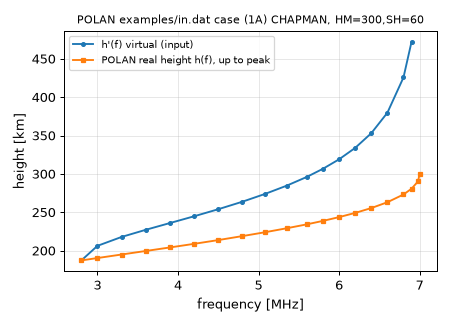

# POLAN · 电离图虚高 h′(f) → 真高剖面（Titheridge Fortran）操作手册

目录：[`PROJECTS.json` → `POLAN`](../../PROJECTS.json) · 上游 <https://github.com/space-physics/POLAN>（SciVision 现代化维护；算法 J. E. Titheridge，UAG-93 报告；main `23c0056`，2026-06-22 15:58 EDT）· Python 包版本 **1.1.0**（`meson.build`/`__init__.py`，无 PyPI 发布，需从源码装）· 许可 **MIT**（`LICENSE`，Copyright 2017, 2026 SciVision）· 本机验证 **2026-09-26 06:14–06:35 EDT**：Debian gfortran 14.2.0、CMake 3.31.6、CPython 3.13.5 venv（numpy 2.5.3、meson-python 构建）。

> 岗位：输入测高仪描迹得到的**虚高** h′(f)（频率–虚高对），输出**真高** h(f) 剖面，以及每层峰值 foE/hmE、foF2/hmF2、标高、误差。只能反演到 F2 峰，峰上三点是 Chapman 外推。冲突时：`src/polrun.f` / `src/polan.f` 源码 > 仓内 `Readme_polan.md` > 本文。

## 1. 它解决什么

| 概念 | 一句话 |
| --- | --- |
| 虚高 h′(f) | 测高仪按回波时延 × c/2 折算的“高度”。电波在电离层里群速 < c，越靠近反射点越慢，所以 h′ **总高于**真实反射高度，接近 foF2 时 h′ 猛增（群延迟发散） |
| 真高 h(f) | 频率 f 的 O 波在等离子体频率 fN = f 处反射的真实高度；fN² ∝ Ne（Ne[m⁻³] ≈ 1.24×10¹⁰·f²[MHz]），所以 h(f) 就是 Ne(h) 剖面 |
| 反演 | h′(f) = ∫ μ′(f, fN(h), 磁场) dh，μ′ 为群折射指数；POLAN 从最低频开始逐段用多项式表示 h(fN)，最小二乘拟合虚高，逐层往上“剥” |
| foF2 / hmF2 | F2 层临界频率 / 峰高；POLAN 用 Chapman 层拟合最后几个真高点得出，并给标准误差 |
| 起始 / 谷区 | 最低可测频率以下的电离（START）和 E–F 之间的谷（VALLEY）测高仪看不到，只能按模型假设；X 波描迹可以约束它们 |
| 看不见的部分 | F2 峰以上（顶部）测高仪完全看不到：POLAN 只按 Chapman 外推 3 个点；真实顶部要靠 ISR（见 [inscar](./inscar.md)）或掩星 |

这是“把测高仪 foF2/hmF2 和 GNSS TEC 放一起分析”的前置步骤：TEC 是积分，测高仪给底部剖面形状，两者一比就能看出顶部贡献。

## 2. 安装与构建

仓库自带 CMake（独立可执行）和 meson（Python 扩展）两套：

```bash
unset TMPDIR VIRTUAL_ENV; export HOME=/home/box
cd /workspace/scratch_x && git clone https://github.com/space-physics/POLAN && cd POLAN
cmake --workflow default          # = configure + build + ctest（CMakePresets.json）
ls build/polan build/out.dat      # 可执行 + 测试跑出的结果
```

本机 `cmake --workflow default` 末尾真实输出（节选）：

```text
1: (5B) BAD START DATA         Start =  0.000
1: Note: The following floating-point exceptions are signalling: IEEE_INVALID_FLAG IEEE_UNDERFLOW_FLAG IEEE_DENORMAL
1/1 Test #1: basic ............................   Passed    0.01 sec

100% tests passed, 0 tests failed out of 1
```

`CMakeLists.txt` 对 GNU 编译器加了 `-std=legacy`；构建不到 1 s。

可选 Python 接口（meson + f2py）：

```bash
python3 -m venv venv && . venv/bin/activate
pip install --no-cache-dir ./POLAN pytest
cd POLAN && python -m pytest -q src/polan/tests     # 本机：2 passed in 0.05s
```

## 3. 端到端

### 3.1 跑仓内示例电离图全集

```bash
cd build && ./polan ../examples/in.dat      # 结果写到**当前目录**的 out.dat
```

本机结果：`out.dat` 707 行，27 个电离图（`grep -c 'Start =' out.dat` → 27）；与仓内 `examples/out.dat` 用 `diff <(tail -n +2 build/out.dat) <(tail -n +2 examples/out.dat)` 逐行比对，**除第 1 行（数据文件路径 + 运行日期）外 706 行完全相同**。

第一个电离图（E + F 双层合成数据）的真实输出：

```text
Chapman Layer, E + F.       FH-1.20  Dip 20.0    Amode  0.0  Valy  0.00  List 0

(A) Accurate data.          Start = -1.000

Input data
  1.00  91.7    1.20  96.2    1.60 100.2    1.80 102.1    2.00 103.9    2.20 106.0    2.40 108.2
  ...
  3.35 132.5    3.40 136.9    3.45 143.7    3.50 157.1    3.54   0.0    3.60 276.0    3.70 247.8
  ...
  6.40 309.6    6.50 320.9    6.60 334.8    6.70 352.8    6.80 378.3    6.90 422.0    7.00   0.0
PEAK  3.529 (0.011) MHz,  Height 115.8 ( 0.3) km.    ScaleHt 11.9 ( 0.4) km  SlabT  15.2 km
 2 Valley  22.1 km wide,  0.08 MHz deep.  Devn 0.92 km.  7 terms fit  7 O + 0 X + 4.  hx= 141.2
PEAK  6.999 (0.009) MHz,  Height 250.1 ( 0.4) km.    ScaleHt 59.7 ( 0.5) km  SlabT  86.8 km
```

读法：第一条 `PEAK` 是 E 层（foE = 3.529 MHz，hmE = 115.8 km），第二条是 F 层（foF2 = 6.999 MHz，hmF2 = 250.1 km）；输入里 `3.54   0.0` 这种“频率 + 虚高 0”就是层的临界频率标记（见 §4.2）。

### 3.2 单独跑一个电离图（最小输入）

从示例里取单层 Chapman 合成数据 (1A)：1 行“站/场”参数 + 3 行数据 + 2 个空行结束：

```text
(1)  SINGLE LAYER.        -1.0  30.   0.   0.    0
(1A)CHAPMAN, HM=300,SH=60  -1. 2.8 18729 3.0 20633 3.3 21791 3.6 22720 3.9 23597
 4.2 24478 4.5 25396 4.8 26380 5.0827385 5.3528469 5.6 29615 5.8 30670 6.0 31901
 6.2 33391 6.4 35296 6.6 37973 6.8 42566 6.9 47209 


```

```bash
mkdir -p run1 && cd run1 && /path/to/POLAN/build/polan one.dat && cat out.dat
```

本机 `out.dat` 全文（除 `Data file:`/`Run:` 头行外）：

```text
(1)  SINGLE LAYER.          FH-1.00  Dip 30.0    Amode  0.0  Valy  0.00  List 0

(1A)CHAPMAN, HM=300,SH=60   Start = -1.000

Input data
  2.80 187.3    3.00 206.3    3.30 217.9    3.60 227.2    3.90 236.0    4.20 244.8    4.50 254.0
  4.80 263.8    5.08 273.9    5.35 284.7    5.60 296.1    5.80 306.7    6.00 319.0    6.20 333.9
  6.40 353.0    6.60 379.7    6.80 425.7    6.90 472.1    0.00   0.0
PEAK  6.999 (0.020) MHz,  Height 299.7 ( 0.5) km.    ScaleHt 59.6 ( 0.6) km  SlabT  75.9 km

Real Heights
  2.80 187.3    3.00 190.4    3.30 195.0    3.60 199.6    3.90 204.2    4.20 208.9    4.50 213.8
  4.80 219.0    5.08 224.0    5.35 229.2    5.60 234.3    5.80 238.8    6.00 243.7    6.20 249.2
  6.40 255.5    6.60 263.1    6.80 273.2    6.90 280.7    6.98 290.2    7.00 299.7    6.90 321.0
  6.53 352.6    5.84 396.3    0.02   0.5  460.78  59.6

Coefficients QQ
   15.00      6.00    243.73      6.00     26.45      3.59     -7.58     86.59   -146.81     86.06
    0.08      6.83      7.00    299.73     59.57    -99.00
 ====================================================
```



这组合成数据的标题写明真值 HM=300 km、SH=60 km；POLAN 反演出 hmF2 = 299.7 ± 0.5 km、ScaleHt = 59.6 ± 0.6 km，foF2 = 6.999 ± 0.020 MHz。6.90 MHz 处虚高 472.1 km、真高只有 280.7 km——越接近 foF2，虚高越“虚”。

### 3.3 批量提取每个电离图的 foF2/hmF2

```bash
awk '/Start =/{if(pk!="")print hdr" | "pk; hdr=substr($0,1,25); pk=""} /^PEAK/{pk=$0} END{if(pk!="")print hdr" | "pk}' out.dat
```

对示例全集本机输出 26 行（27 个电离图中 (5A) 没有 `PEAK` 行），前 3 行：

```text
(A) Accurate data.        | PEAK  6.999 (0.009) MHz,  Height 250.1 ( 0.4) km.    ScaleHt 59.7 ( 0.5) km  SlabT  86.8 km
(1A)CHAPMAN, HM=300,SH=60 | PEAK  6.999 (0.020) MHz,  Height 299.7 ( 0.5) km.    ScaleHt 59.6 ( 0.6) km  SlabT  75.9 km
(1B) TRUNCATED:  WITH FO  | PEAK  7.000 (0.014) MHz,  Height 299.9 ( 0.2) km.    ScaleHt 59.8 ( 0.3) km  SlabT  61.0 km
```

⚠ 取“最后一条 PEAK”只在数据真的扫到 F2 峰时才是 foF2（坑 5）。

## 4. 字段表

### 4.1 输出 `out.dat`

| 行 / 字段 | 含义 | 单位 | 来源核对 |
| --- | --- | --- | --- |
| 场行 `FH` | 地面电子回旋频率；负值 = 不随高度变化的 FH | MHz | `Readme_polan.md` §B |
| `Dip` | 磁倾角；负值关闭物理约束 | 度 | 同上 |
| `Amode` / `Valy` / `List` | 分析模式（0→mode 6）/ 谷模型 / 打印详略 | — | 同上 |
| `Start =` | 起始模型：-1 直接从第一点起；0 按前几点外推；>44 为 0.5 MHz 处模型高度 km | km 或 MHz | 同上 |
| `PEAK f (σf) MHz, Height h (σh) km` | 该层临界频率与峰高 ± 标准误差；最后一层即 foF2/hmF2 | MHz / km | `polmis.f` 格式 750 |
| `ScaleHt s (σs)` | 拟合 Chapman 标高；负值表示用了模型标高 | km | 同上 |
| `SlabT` | 板厚 = 峰下电子含量 / 峰密度（`tcont/fc**2`） | km | `polmis.f:188` |
| `Valley … wide, … deep` | 谷宽 / 谷深 | km / MHz | 输出文本 |
| `Real Heights` 前 N 对 | (fN, 真高)；峰为第 N−3 对，N−2…N 为峰上 0.35/0.85/1.5 标高外推点（频率回落） | MHz, km | `polan.f` §7.2 |
| 倒数第 2 对 | (σfoF2, σhmF2)，与 PEAK 行括号内相同（1A：0.02 / 0.5） | MHz, km | `Readme_polan.md` §C |
| 倒数第 1 对 | (`FV(N+2)`, `HT(N+2)`) = (0.124·tcont, 标高) | 见右 / km | 源码注释为 `T.E.C.`；Readme 写“slab thickness”，**与源码不符** |
| `Coefficients QQ` | 多项式系数（`QQ(1)` 为个数） | — | `Readme_polan.md` §D.2 |

`FV(N+2)`：1A 为 460.78；75.9 × 6.999² × 0.124 = 461.0，与之相符（差异来自打印舍入），说明它是 0.124·SlabT·foF2²。按 Ne=1.24×10¹⁰ f² 推算，这是以 10¹⁴ m⁻² 为单位的**峰下电子含量**（460.78 → ≈4.6 TECU）——此单位是本文推算，上游未写，**使用前自行核对**。

### 4.2 输入格式（固定列宽，`polrun.f` 格式 120/220/320）

| 行 | 格式 | 内容 |
| --- | --- | --- |
| 场行 | `a25, 4f5.0, i5` | 25 字符标题，FH、DIP、AMODE、VALLEY，LIST |
| 数据首行 | `a25, f5.3, 5(f5.3,f5.2)` | 25 字符标题，START，5 对 (f, h′) |
| 续行 | `8(f5.3,f5.2)` | 每行 8 对，每对 10 字符 |
| 结束 | 两对 0 → 本电离图结束；1 空行 → 回到读场行；再空行（FH=0）→ 程序结束 | |

数字无小数点时按隐含小数读：`18729` 在 f5.2 里是 187.29 km，`5.0827385` 是 f=5.08、h′=273.85。层标记：`fc  0.0` = 临界频率（Chapman 峰 + 正常谷），`fc 10.0` = 峰后无谷，`-f` = X 波数据，末频 `-1.0` = 不含峰结束（`Readme_polan.md` §A）。

## 5. 坑（现象 → 原因 → 一条修复命令）

**坑 1 · 自己用 gfortran 直接编，报 Rank mismatch 编不过**
- 现象：`Error: Rank mismatch in argument ‘b’ at (1) (rank-1 and scalar)`（`polmis.f:69`），外加一串 Fortran 2018 deleted feature 警告。
- 原因：1993 年代码把标量传给数组形参，gfortran ≥10 默认视为错误。
- 修复：`gfortran -O2 -std=legacy src/{polrun,polan,polmis,polsin,polsub}.f -o polan`（已验证：降为警告，1A 结果 PEAK 行与 CMake 版一致）。

**坑 2 · 列错一格，结果全错但退出码 0**
- 现象：把 1A 第 2 数据行行首空格删掉后，`Input data` 里变成 `4.22  44.8  4.52  54.0 …`，得到 `PEAK  4.230 (0.401) MHz, Height 221.2 ( 3.7) km. ScaleHt-23.5`，`echo $?` → 0。
- 原因：固定列宽 f5.3/f5.2，错位后频率吃掉虚高首位。
- 修复：用程序生成输入而不是手敲，例如 `awk -F, '…printf "%5.2f%5.1f"…' trace.csv > my.dat`（见 §6；已验证：18 点 CSV 生成后 `PEAK 6.999 (0.020) MHz, Height 299.8`，与原 1A 的 299.7 差 0.1 km 来自虚高只保留 1 位小数）。之后必查 `grep -n '>>>>>error' out.dat` 和 `Input data` 回显。

**坑 3 · 缺场行，参数被数据行吞掉**
- 现象：文件直接以 `(1A)…` 数据行开头 → `FH-1.00  Dip  2.8    Amode*****  Valy  3.00  List**`，随后 `>>>>>error at f,h = …`。
- 原因：程序先按场行格式读第一行，数据被当成 DIP/AMODE。
- 修复：`sed -i '1i (1)  SINGLE LAYER.        -1.0  30.   0.   0.    0' one.dat`（已验证：补行后 `PEAK  6.999 (0.020) MHz,  Height 299.7`，同 §3.2）。

**坑 4 · 输入里有 Tab（`expand` 也救不回来）**
- 现象：把 1A 标题后的两个空格换成 Tab → `Fortran runtime error: Bad value during floating point read`（`polrun.f` 第 63 行），退出码 2。用 `expand -t1`/`-t2` 转空格后能跑、退出码 0，但结果变成 `PEAK 7.030 (0.034) MHz, Height 269.7`（多出一个假的 `3.274 MHz / 76.2 km` 层），`-t4` 仍退出码 2，`-t8` 退出码 0 但没有任何 PEAK 行。
- 原因：固定列宽读入；Tab 转成几个空格都对不上原来的列。
- 修复：先检测 `grep -nP '\t' my.dat`（已验证：报出第 2 行），再用 §6 的 awk 从 CSV 重新生成（已验证）。

**坑 5 · 把最后一条 PEAK 当 foF2，其实是 E 层**
- 现象：示例 (2C)“40KM VALLEY;NO FPEAK”唯一的 PEAK 是 `2.988 (0.030) MHz, Height 120.9`，批量 awk 会把它当 foF2。
- 原因：数据以 `-1.00` 结束（没扫到 F2 峰），POLAN 只算到最高频 4.70 MHz 的真高 214.1 km；`Real Heights` 行尾 `4.99 263.5` 是上一个电离图残留在数组里的旧值。
- 修复：先列出以 -1 结束（无峰）的电离图再剔除：`awk '/Start =/{h=substr($0,1,25)} /Input data/{f=1;next} f&&(/^PEAK/||/^ *$/||/^#/||/^\*/||/^ [0-9] /){f=0} f&&/-1\.00   0\.0/{print h}' out.dat`（已验证：对示例全集输出 `(2C) 40KM VALLEY;NO FPEAK` 与 `(5A)TEST 6B NIGHT,DIP 30`）。

**坑 6 · 结果不在屏幕上，而且会被覆盖**
- 现象：终端只打印场行和 `Start =` 行；第二次运行后上一次结果没了。
- 原因：`polrun.f` 固定 `OPEN(UNIT=2, FILE='out.dat', status='replace')`，写到**当前目录**。
- 修复：`d=run_$(date +%H%M%S); mkdir -p $d && cd $d && /path/to/polan ../my.dat`（每个电离图批次一个目录；本机按此方式在不同子目录各跑一次，互不覆盖）。

**坑 7 · 不给文件名，“失败”却返回 0**
- 现象：`./polan` → `STOP must specify input file`，`echo $?` → 0；文件不存在则 `Cannot open file 'nofile.dat'`，退出码 2。
- 原因：Fortran `stop('…')` 默认退出码 0。
- 修复：脚本里用 `test -s out.dat && grep -q '^PEAK' out.dat`（已验证：对正常 1A 结果为真）判断成败。

**坑 8 · stderr 的 IEEE 浮点提示**
- 现象：每次都打印 `Note: The following floating-point exceptions are signalling: IEEE_INVALID_FLAG …`。
- 原因：gfortran 运行时在结束时报告被置位的浮点标志；仓内示例的 out.dat 与本机结果逐行一致，说明这不影响输出。
- 修复：`./polan in.dat 2>/dev/null`（已验证：out.dat 照常生成）。

**坑 9 · Python 接口返回的 `dip` 是 0、分段不对应**
- 现象：对 §3.2 的 one.dat，`polan.gopolan('one.dat')` 返回 `dip 0.0`、`n_segments 2`，第 2 段前几点 `fv_MHz 2.8, 2.8, 3.0 … height_km 187.29, 187.29, 206.33 …` 是虚高而非真高。仓内测试本身就断言 `iono["dip"] == 0.0`。
- 原因（按源码推断）：`polrunsub.f` 循环读到结尾空行（FH=0）才返回，`dip` 等被最后那行覆盖；数组是循环结束时的残留状态，`gopolan` 再按单调性切段。
- 修复：要真高请用 CLI 的 out.dat：`./build/polan in.dat && awk …`（已验证）；Python 接口仅作参考。

## 6. 把自己的描迹变成 POLAN 输入

CSV 两列 `f_MHz,hvirt_km`（按频率升序）。下面这条本机实测可用（以 1A 数据验证）：

```bash
awk -F, 'BEGIN{printf "%-25s%5.1f%5.0f%5.0f%5.0f%5d\n","MYSTATION FIELD",-1.0,30,0,0,0; printf "%-25s%5.1f","MY IONOGRAM 1200UT",-1.0; n=0}
{p=sprintf("%5.2f%5.1f",$1,$2); if(n<5){printf "%s",p} else {if((n-5)%8==0)printf "\n"; printf "%s",p}; n++}
END{printf "\n\n\n"}' trace.csv > my.dat
```

场行里 `-1.0` 是 FH（MHz），`30` 是 DIP（度），要换成台站实际值：FB = FH_h·(1 + h/6371.2)³（`Readme_polan.md` §B）。描迹从哪来：GIRO/DIDBase 的 SAO 文件（见 [giro-ionosonde.md](./giro-ionosonde.md)，有账号门槛），或自己在电离图上手工判读。若结尾要标 foF2，把最后一对写成 `fc   0.0`。

## 7. 怎么读、接到哪里

- 只要 foF2/hmF2 时间序列、不需要自己反演：直接拿台站自动判读值——[giro-ionosonde.md](./giro-ionosonde.md)、[digisondeindices.md](./digisondeindices.md)、[ionosonde-data-downloader.md](./ionosonde-data-downloader.md)。
- 要从 Ne 剖面正演 h′(f) 做对照，或用 PyIRI 参数拟合虚高：[pyrayhf.md](./pyrayhf.md)（`vertical_forward_operator` / `model_VH`）。
- 与模型剖面对比：[iri2020.md](./iri2020.md) / [iricore.md](./iricore.md)（可传实测 foF2/hmF2）。
- 顶部与 Te/Ti：ISR，理论谱见 [inscar.md](./inscar.md)，实测见 [madrigal.md](./madrigal.md)。
- 概念课：[教程 07 测高仪与掩星](../tutorials/07-ionosonde-occultation.md)。

## 8. 许可与诚实边界

- 许可：仓库 MIT（SciVision）；算法与原始代码来自 Titheridge（UAG-93，1985/1993），引用时同时引用原报告。
- 已实跑：CMake 构建 + ctest；示例全集与仓内 out.dat 逐行比对；单电离图 1A；手工 gfortran 构建；输入生成 awk；坑 1–9 的现象与修复（坑 6 用的是等价的分目录运行）。
- **未实跑**：meson 独立（非 pip）构建、Windows/MinGW、`polplot.f`/`POLPLOT.EXE`（DOS 绘图）、`polrunew.f`/`polsin.f` 替代主程序、真实台站 SAO → POLAN 全流程、`LIST ≥ 2` 调试输出解读。
- 本文所有 E2E 数据都是仓内**合成**电离图（Chapman 层），能验证反演自洽，不代表真实描迹的误差水平；真实数据的起始/谷区假设会显著影响 hmF2，需用 X 波或 `VALLEY` 选项做敏感性试验。
