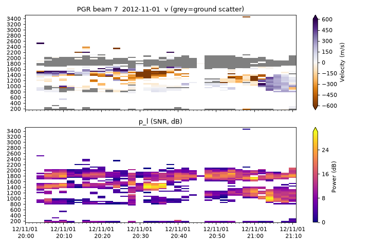
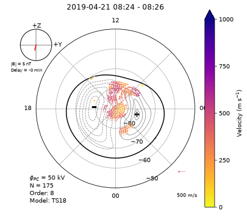

# pyDARN · SuperDARN 高频雷达数据读图（RTI / 扇形图 / 对流图）操作手册

目录：上游 <https://github.com/SuperDARN/pydarn> · PyPI **`pydarn` 4.3**（release v4.3 发布于 2026-06-23 17:28 EDT，develop tip `203ad04`）· **LGPL-3.0** · ★38 · 读文件靠姊妹包 **pyDARNio 2.1**（同为 LGPL-3.0）· 本机验证 **2026-09-26 03:05–03:25 EDT**：Python 3.11.16，numpy 2.4.6、matplotlib **3.11.2**、cartopy 0.26.0、aacgmv2 2.7.1，venv 约 430 MB。数据是 **真实观测**：Zenodo 记录 [10.5281/zenodo.7005203](https://doi.org/10.5281/zenodo.7005203)（pyDARN 论文配套数据）里的 PGR 雷达 FITACF 和南半球 MAP 文件。

> 冲突时：**本机 `help(pydarn.RTP.plot_range_time)` 等 docstring > 官方文档 <https://pydarn.readthedocs.io> > 本文**。

## 1. 它解决什么

**SuperDARN**（Super Dual Auroral Radar Network）是南北半球中高纬 30 多部 **HF（8–20 MHz）相干散射雷达**。每部雷达用 16（或 24）个**波束**（beam）扇形扫描，每个波束沿视线分 70–110 个**距离门**（range gate，常见 45 km 一格，首门 180 km），1–2 分钟扫完一圈。回波来自两类目标：

| 术语 | 一句话 | 对你有什么用 |
| --- | --- | --- |
| **电离层散射**（ionospheric scatter） | HF 波被 F 区沿磁力线排列的小尺度不规则体（~10 m）反射回来 | Doppler 速度 ≈ 等离子体 E×B 漂移沿视线分量 → **对流** |
| **地面散射**（ground scatter, `gflg=1`） | 波经电离层折射打到地面/海面，再原路返回；速度接近 0 | 回波距离随 F 区高度/密度变化 → **TID（行进式电离层扰动）** 在 RTI 上表现为斜纹 |
| **FITACF** | 原始自相关函数（RAWACF）逐门拟合后的产品，一个文件通常 2 h | 字段 `v`（m/s）、`p_l`（dB）、`w_l`（m/s）、`elv`（°） |
| **GRID / MAP** | 多部雷达视线速度拼到等面积网格（GRID），再用球谐拟合出静电势（MAP） | 极区对流图、跨极盖电势 `pot.drop` |
| **RTI**（range-time-intensity） | 固定一个波束，横轴时间、纵轴距离、颜色是某参数 | 看时间演化：TID 斜纹、对流突变 |
| **扇形图**（fan plot） | 固定一个扫描时刻，所有波束×距离门画在地图/磁坐标上 | 看空间结构 |
| **对流图**（convection map） | MAP 文件的等势线 + 拟合速度矢量 | 看全局 E×B 流型、IMF 控制 |

pyDARN 只做 **读 + 画**：`read_fitacf / read_grid / read_map` 读 DMap 二进制（自动识别 `.bz2`），`RTP / Fan / Grid / Maps / FOV` 出图。它**不**从 RAWACF 做拟合（那是 C 语言的 RST `make_fit`），**不**做 MAP 球谐拟合（RST `map_fit`），**不**下载数据。

## 2. 安装

```bash
mkdir -p ~/iono_ops/pydarn && cd ~/iono_ops/pydarn     # 先 cd，再建 venv
python3 -m venv venv && . venv/bin/activate
pip install --no-cache-dir pydarn                      # 拉上 pydarnio、aacgmv2、cartopy、matplotlib、numpy
pip show pydarn pydarnio | grep -E "Name|Version"
# Name: pydarn / Version: 4.3 / Name: pydarnio / Version: 2.1
du -sh venv                                            # 430M（cartopy+shapely+pyproj 占大头）
```

## 3. 拿真实数据（小文件）

| 来源 | 免账号？ | 本机结果 |
| --- | --- | --- |
| Zenodo 7005203 `example_data.zip`（218 MB，含 10 个真实 fitacf/rawacf/grid/map） | 是 | 用 `remotezip` HTTP Range 只抽 2 个文件，**7.1 MB** |
| USask 网页 <https://superdarn.usask.ca/data-download>（加拿大雷达 FITACF 3.0） | 网页可用 | `curl` 拿到的是 JS 反爬挑战页，**脚本拉不到**；浏览器手动下 |
| BAS / USask Globus 镜像、NSSC 镜像 <https://superdarn.nssdc.ac.cn> | 需申请/注册 | 未测 |
| FRDR（1993–2019 RAWACF，每年一个 DOI） | 是，但文件巨大 | 未测；RAWACF 还要 RST 拟合 |
| pyDARNio `tests/` | — | 只有 Python 字典构造的**假数据**，不能拿来出科学图 |

```bash
pip install --no-cache-dir remotezip
Z="https://zenodo.org/records/7005203/files/example_data.zip?download=1"
remotezip -l "$Z" | grep -E "fitacf|map2|grid2"          # 先看清单和大小
mkdir -p data && cd data
remotezip "$Z" example_data/20121101.2002.00.pgr.fitacf.bz2 example_data/20190421.south.map2.bz2
md5sum example_data/*
# 64fa41f065497355a6f2be804a1fedb1  example_data/20121101.2002.00.pgr.fitacf.bz2   (2 826 596 B)
# 465dd77c36290b1d87ba0be977866625  example_data/20190421.south.map2.bz2           (4 536 437 B)
cd ..
```

PGR = Prince George（加拿大 BC，53.98°N 122.59°W，stid 6）。

## 4. 端到端 A：读 FITACF，先看数据长什么样

```python
# rd.py
import pydarn, numpy as np
f='data/example_data/20121101.2002.00.pgr.fitacf.bz2'
recs,_=pydarn.read_fitacf(f)                      # 返回 (list[dict], 损坏起点)；每条 = 一个波束一次积分
print('records:',len(recs))
r=recs[0]
print('keys(first 20):',sorted(r.keys())[:20])
print('stid',r['stid'],'bmnum',r['bmnum'],'nrang',r['nrang'],'frang',r['frang'],'rsep',r['rsep'],'tfreq',r['tfreq'],'cp',r['cp'])
fmt=lambda x:'%04d-%02d-%02d %02d:%02d:%02d'%(x['time.yr'],x['time.mo'],x['time.dy'],x['time.hr'],x['time.mt'],x['time.sc'])
print('span',fmt(recs[0]),'->',fmt(recs[-1]))
print('beams',sorted(set(x['bmnum'] for x in recs)))
v=np.concatenate([x['v'] for x in recs if 'v' in x]); p=np.concatenate([x['p_l'] for x in recs if 'p_l' in x])
gs=np.concatenate([x['gflg'] for x in recs if 'gflg' in x])
print('echoes',v.size,'ground-flag frac %.3f'%gs.mean())
print('v m/s  p5/p50/p95: %.1f %.1f %.1f'%tuple(np.percentile(v,[5,50,95])))
print('p_l dB p5/p50/p95: %.1f %.1f %.1f'%tuple(np.percentile(p,[5,50,95])))
print('no-slist records:',sum('slist' not in x for x in recs))
```

本机 stdout（完整）：

```text
records: 1070
keys(first 20): ['atten', 'bmazm', 'bmnum', 'channel', 'combf', 'cp', 'elv', 'elv_high', 'elv_low', 'ercod', 'fitacf.revision.major', 'fitacf.revision.minor', 'frang', 'gflg', 'ifmode', 'intt.sc', 'intt.us', 'lagfr', 'ltab', 'lvmax']
stid 6 bmnum 15 nrang 75 frang 180 rsep 45 tfreq 10555 cp 200
span 2012-11-01 20:02:00 -> 2012-11-01 21:10:55
beams [0, 1, 2, 3, 4, 5, 6, 7, 8, 9, 10, 11, 12, 13, 14, 15]
echoes 20784 ground-flag frac 0.361
v m/s  p5/p50/p95: -543.2 -4.3 276.9
p_l dB p5/p50/p95: 0.7 8.7 24.7
no-slist records: 0
```

要点：文件名写 `2002` 但实际只覆盖 **20:02–21:10 UT**（约 69 分钟，不是标准 2 h）；1070 条记录 = 16 波束 × 约 67 次扫描；36% 的回波被标成地面散射。

### FITACF 常用字段

| 字段 | 形状 | 单位 | 含义 |
| --- | --- | --- | --- |
| `time.yr/mo/dy/hr/mt/sc/us` | 标量 | UT | 该波束积分起始时刻 |
| `stid` / `bmnum` / `channel` | 标量 | — | 雷达号 / 波束号 / 通道（双通道雷达区分用） |
| `nrang` / `frang` / `rsep` | 标量 | 个 / km / km | 门数 / 首门距离 / 门宽 |
| `tfreq` | 标量 | kHz | 发射频率（这里 10.555 MHz） |
| `cp` | 标量 | — | 控制程序号（扫描模式） |
| `slist` | 1D | — | **有回波的门号**；下列数组都与它等长，不是 `nrang` 长 |
| `v` / `v_e` | 1D | m/s | 视线 Doppler 速度及误差；**正 = 朝向雷达** |
| `p_l` | 1D | dB | 拟合功率（λ 模型），约等于信噪比 |
| `w_l` | 1D | m/s | 谱宽，越大越湍动（尖点/极隙区常 >200） |
| `gflg` | 1D | 0/1 | 1 = 判为地面散射（按 |v| 小、w 小的经验阈值） |
| `elv` | 1D | ° | 到达仰角（需干涉仪；可反推虚高） |

## 5. 端到端 B：RTI + 扇形图

```python
# plot.py
import matplotlib; matplotlib.use('Agg')
import matplotlib.pyplot as plt, pydarn, datetime as dt
recs,_=pydarn.read_fitacf('data/example_data/20121101.2002.00.pgr.fitacf.bz2')
fig,axs=plt.subplots(2,1,figsize=(9,6),sharex=True)
plt.sca(axs[0])                                   # pyDARN 画在“当前轴”上
pydarn.RTP.plot_range_time(recs,beam_num=7,parameter='v',range_estimation=pydarn.RangeEstimation.SLANT_RANGE,
    colorbar_label='Velocity (m/s)',cmap='PuOr',zmin=-600,zmax=600,groundscatter=True)
axs[0].set_title('PGR beam 7  2012-11-01  v (grey=ground scatter)')
plt.sca(axs[1])
pydarn.RTP.plot_range_time(recs,beam_num=7,parameter='p_l',range_estimation=pydarn.RangeEstimation.SLANT_RANGE,
    colorbar_label='Power (dB)',zmin=0,zmax=30)
axs[1].set_title('p_l (SNR, dB)')
plt.tight_layout(); plt.savefig('pgr_rti.png',dpi=80); print('rti ok')
plt.figure(figsize=(6,6))
r=pydarn.Fan.plot_fan(recs,scan_time=dt.datetime(2012,11,1,20,30),parameter='v',coords=pydarn.Coords.AACGM_MLT,
    colorbar_label='Velocity (m/s)',lowlat=50,groundscatter=True,zmin=-600,zmax=600)   # 注意：这里不传 cmap，见坑 2
print('fan return type',type(r))
plt.savefig('pgr_fan.png',dpi=70,bbox_inches='tight'); print('fan ok')
```

```text
rti ok
fan return type <class 'dict'>
fan ok
```



**怎么读这张图（只描述本图可见的东西）：**

- 灰色带在斜距 **~1700–2100 km**、几乎贯穿全时段 → 地面散射（`gflg=1`）。它的上下边缘随时间起伏就是 F 区高度/密度在变；若出现周期 20–60 min、向近距或远距移动的斜纹，就是 **MSTID/LSTID** 的典型签名（本段只有 69 min，只能看到边缘的轻微起伏，不足以判定 TID 周期）。
- 彩色回波集中在 **~900–1600 km** → 电离层散射。20:30–20:35 UT 在 1300–1500 km 有一团 **-450 ~ -600 m/s**（远离雷达）、功率 >24 dB 的强回波；21:00 后 900–1200 km 转为正速度（朝向雷达，紫色）。速度符号翻转意味着该视线方向上的对流分量换了方向。
- PGR 20:30 UT 对应当地时约 12:20；扇形图（`pgr_fan.png`，未入库）在 AACGM-MLT 极坐标里落在正午前后、磁纬 60° 以上的扇区，同一时刻仍是远距地面散射 + 近距正负速度电离层回波并存。

## 6. 端到端 C：对流图（MAP 文件）

```python
# mp.py
import matplotlib; matplotlib.use('Agg')
import matplotlib.pyplot as plt, pydarn, numpy as np
m,_=pydarn.read_map('data/example_data/20190421.south.map2.bz2')
print('map records:',len(m))
r=m[0]
print('hemisphere',r['hemisphere'],'fit.order',r['fit.order'],'IMF Bz',r['IMF.Bz'],'By',r['IMF.By'])
pd=np.array([x['pot.drop'] for x in m])/1e3
print('pot.drop kV min/median/max: %.1f %.1f %.1f'%(pd.min(),np.median(pd),pd.max()))
i=int(np.argmax(pd)); x=m[i]
print('max at %02d:%02d UT, nvec=%d, stid n=%d'%(x['start.hour'],x['start.minute'],len(x['vector.mlat']),len(x['stid'])))
plt.figure(figsize=(6,6))
pydarn.Maps.plot_mapdata(m,record=i,parameter=pydarn.MapParams.FITTED_VELOCITY,lowlat=50,contour_fill=False)
plt.savefig('map.png',dpi=70,bbox_inches='tight'); print('map ok')
```

```text
map records: 718
hemisphere -1 fit.order 8 IMF Bz -1.1399999856948853 By 4.116666793823242
pot.drop kV min/median/max: 10.7 28.8 49.9
max at 08:24 UT, nvec=175, stid n=8
map ok
```



读法：虚线/实线是静电势等值线（两个对流涡），黑粗线是 Heppner–Maynard 边界（对流区低纬边界，`hmb=True`），彩色箭头是拟合速度；左上 IMF 表盘 By≈+4 nT、Bz≈-1 nT；左下 `φ_PC = 50 kV`（跨极盖电势）、`N = 175` 个视线速度、8 阶球谐、统计模型 TS18。全天 `pot.drop` 在 10.7–49.9 kV 之间，属于平静到弱扰动水平。

### MAP 常用字段

| 字段 | 含义 |
| --- | --- |
| `hemisphere` | 1 北 / -1 南 |
| `pot.drop` | 跨极盖电势（V），衡量对流强度 |
| `fit.order` | 球谐阶数 |
| `IMF.Bx/By/Bz`、`IMF.delay` | 拟合时用的上游 IMF（nT）及延迟（分钟） |
| `vector.mlat/mlon/vel.median` | 每个网格点的观测视线速度 |
| `stid` | 参与本张图的雷达列表 |
| `start.hour/minute` | 本记录起始时刻（UT），通常 2 min 一张 |

## 7. 和 GNSS TEC 对齐

1. **时间**：FITACF/MAP 都是 UT；FITACF 一个波束约 3–7 s、一圈扫描 1–2 min，GNSS 30 s 采样的 dTEC/ROTI 先对齐到同一分钟。
2. **位置**：电离层散射用斜距（`SLANT_RANGE`，默认 300 km 高度映射）；地面散射的“反射点”在一半斜距处，用 `HALF_SLANT`。拿门号换经纬度：

```python
# geo.py
import pydarn
from pydarn.utils.coordinates import gate2geographic_location as g2g
sid=pydarn.RadarID(6)
lat,lon=g2g(sid,7,height=300,center=True,range_gate=27,frang=180,rsep=45,range_estimation=pydarn.RangeEstimation.SLANT_RANGE)
print('iono scatter  beam7 gate27: lat=%.2f lon=%.2f'%(lat,lon))
lat,lon=g2g(sid,7,height=300,center=True,range_gate=38,frang=180,rsep=45,range_estimation=pydarn.RangeEstimation.HALF_SLANT)
print('ground scatter beam7 gate38 half-slant: lat=%.2f lon=%.2f'%(lat,lon))
```

```text
iono scatter  beam7 gate27: lat=65.50 lon=-125.86
ground scatter beam7 gate38 half-slant: lat=61.53 lon=-124.48
```

   再挑 IPP（350 km 薄壳）落在这些经纬度 ±2° 以内的 GNSS 卫星弧段做对比。
3. **物理量对应**：
   - **TID**：地面散射边缘的周期性斜纹 ↔ GNSS 去趋势 dTEC 的同周期波包。先在 RTI 上量周期和移动方向，再在 dTEC keogram 里找同周期。
   - **对流/极区斑块**：电离层散射强速度 + 大谱宽 ↔ 高纬 ROTI 升高；MAP 的对流涡形状告诉你斑块会往哪飘。
   - `p_l` 是回波信噪比，**不是**电子密度，不能直接和 TEC 数值比。
4. 磁坐标统一：SuperDARN 画图默认 AACGM；GNSS 侧可用 [aacgmv2](./aacgmv2.md) 把 IPP 转到同一坐标，别混用 [apexpy](./apexpy.md) 的 QD。

## 8. 常用参数

| 函数 / 参数 | 默认 | 说明 |
| --- | --- | --- |
| `RTP.plot_range_time(beam_num=)` | 0 | 波束号，没有该波束数据会抛 `NoDataFoundError` |
| `parameter=` | `'v'` | `'v'`/`'p_l'`/`'w_l'`/`'elv'` |
| `groundscatter=` | False | True 时地面散射画灰色 |
| `remove_ground_scatter=` / `remove_iono_scatter=` | False | 只看一类回波 |
| `range_estimation=` | `SLANT_RANGE` | 还有 `RANGE_GATE`、`HALF_SLANT`、`GSMR`、`TIME_OF_FLIGHT` |
| `channel=` | `'all'` | 双通道雷达要指定 1/2 |
| `start_time=` / `end_time=` | 文件首尾 | 截时段 |
| `Fan.plot_fan(scan_index=)` | 1 | **整数**，第几次扫描 |
| `Fan.plot_fan(scan_time=, scan_time_tolerance=)` | None / 30 s | 按 datetime 选扫描 |
| `coords=` | `AACGM_MLT` | 还有 `AACGM`、`GEOGRAPHIC` |
| `Maps.plot_mapdata(record=)` | 0 | 第几张图 |
| `parameter=pydarn.MapParams.*` | `FITTED_VELOCITY` | 另有观测速度、模型速度、原始/拟合比等 |

## 9. 坑（现象 → 原因 → 修复）

1. **`plot_fan(scan_index=datetime(...))` → `IndexError: list index out of range`（fan.py 230 行）**  
   原因：4.x 里 `scan_index` 只收整数，datetime 要走 `scan_time`。  
   修复：`pydarn.Fan.plot_fan(recs, scan_time=dt.datetime(2012,11,1,20,30))`

2. **`plot_fan(..., cmap='PuOr')` → `AttributeError: module 'matplotlib.cm' has no attribute 'get_cmap'`（matplotlib 3.11.2 实测）**  
   原因：fan.py 第 292/667 行只要传了 `cmap`（字符串或对象都一样）就调 `matplotlib.cm.get_cmap`，该函数在 matplotlib 3.11 被删；同一脚本在 3.10.9 下传字符串 cmap 正常。RTI（rtp.py）已改用 `colormaps`，不受影响。  
   修复：扇形图不传 `cmap`（用默认 `pydarn_velocity`）；非要自选色表就 `pip install --no-cache-dir "matplotlib<3.11"`

3. **`read_fitacf()` 读 MAP 文件不报错，返回空列表，后面 `recs[0]` 才 `IndexError`**  
   原因：专用读函数对“类型不符”静默给 0 条记录。  
   修复：`recs,_=pydarn.read_fitacf(f); assert recs, f"0 records: {f} 不是 fitacf？"`（MAP 用 `read_map`，GRID 用 `read_grid`）

4. **`NoDataFoundError: There is no Data for beam number 7 ... Try beam, for example: 15`，但波束 7 明明有数据**  
   原因：传了 `channel=2`，而 PGR 是单通道；报错信息把“通道不对”也说成“波束没数据”。  
   修复：`sorted({(r['bmnum'],r['channel']) for r in recs})` 先看有哪些组合，再 `channel='all'`

5. **`UnknownParameterError: The following parameter xyz was not found`**  
   原因：参数名拼错，或 FITACF 没有干涉仪导致没有 `elv`。  
   修复：`print(sorted(recs[0].keys()))` 查字段后再传 `parameter=`

6. **RTI 是空白或只有一半有颜色**  
   原因：`zmin/zmax` 与参数量级不符（例如 `p_l` 用了 ±600）。  
   修复：`pydarn.RTP.plot_range_time(recs,beam_num=7,parameter='p_l',zmin=0,zmax=30)`

7. **拿 `v`、`p_l` 数组按 `nrang` 下标取第 27 门，取到的不是第 27 门**  
   原因：数组只存有回波的门，门号在 `slist`。  
   修复：`i=list(r['slist']).index(27); v27=r['v'][i]`

8. **想用 `curl` 从 USask 下载页批量拉 FITACF，拿到 11 KB 的 HTML**  
   原因：页面前置 JS 反爬挑战，非浏览器请求拿不到文件。  
   修复：浏览器手动下，或学习/测试用 Zenodo：`remotezip "https://zenodo.org/records/7005203/files/example_data.zip?download=1" example_data/20121101.2002.00.pgr.fitacf.bz2`

9. **把地面散射的位置直接当成电离层扰动位置去对 GNSS IPP，差了几百 km**  
   原因：地面散射路径的电离层反射点约在一半斜距处。  
   修复：`g2g(sid,beam,height=300,center=True,range_gate=g,frang=180,rsep=45,range_estimation=pydarn.RangeEstimation.HALF_SLANT)`

## 10. 边界

- 只用了 Zenodo 论文配套的 2 个真实文件（2012 PGR、2019 南半球 MAP）；未连 Globus/BAS/NSSC 镜像，未处理多文件拼接一整天。
- 没有同一时段的 GNSS 数据，第 7 节是对齐方法 + 真实经纬度换算，**没有做 SuperDARN–TEC 实际比对**。
- 本机后来同一 venv 被装入 basemap，matplotlib 降到 3.10.9；坑 2 的报错在 3.11.2 下实测，3.10.9 下同脚本传 `cmap='PuOr'` 正常。
- RAWACF → FITACF、GRID → MAP 需要 RST（C 语言，<https://github.com/SuperDARN/rst>），本文未编译。

## 11. 相关

- TID 概念与 GNSS 侧做法：教程 [22 · TID](../tutorials/22-tid-traveling-disturbances.md)、[20 · 磁暴 TEC](../tutorials/20-storm-tec-analysis.md)
- GNSS 侧 ROTI/ΔTEC：[oasis-roti](./oasis-roti.md)；闪烁概念：教程 [05](../tutorials/05-scintillation-roti.md)
- 其他 TID 工具：[lstid-processing](./lstid-processing.md)、[hamsci-lstid-detection](./hamsci-lstid-detection.md)、[varion](./varion.md)
- 太阳风/IMF 背景：[pyspedas](./pyspedas.md)；磁坐标：[aacgmv2](./aacgmv2.md)
- Swarm 原位不规则体指数（同一“极区/高纬不规则体”问题的卫星视角）：[titipy](./titipy.md)
