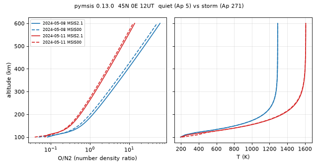

# pymsis · NRLMSIS 2.1 / 2.0 / 00 中性大气（SWxTREC）操作手册

目录：[`PROJECTS.json` → `pymsis`](../../PROJECTS.json) · 上游 <https://github.com/SWxTREC/pymsis> · 文档 <https://swxtrec.github.io/pymsis/> · PyPI **`pymsis` 0.13.0**（annotated tag `v0.13.0` 的 tag 对象是 `0846792`，它指向的提交就是 main 的 `d8170cb`，2026-09-08 19:08 EDT）· 许可：包装 **MIT**；MSIS2 Fortran 另受 **NRL 许可**（`MSIS2_LICENSE`，**商用须联系 NRL**）· 本机实跑 2026-09-26 05:18–05:22 EDT（Python 3.13.5，manylinux 轮子，无需 gfortran）

> **质检复跑通过（2026-09-26 05:45 EDT）**：新建 uv venv 装 `pymsis==0.13.0`（numpy 2.5.3），§3.1 / §3.2 / §3.3 三段脚本原样复跑，输出与文中**逐行一致**：2024-05-11 自动拉到 Ap 271、F10.7 223.4、f107a 177.1；300 km O/N₂ 3.460→1.364（MSIS2.1）、2.919→1.249（MSIS00）；ρ ×1.64；`SW-All.csv` 2888771 B，权限 `-rw-------`。坑 1（超出 1957-10-01…2026-11-09T21:00 报 ValueError）、坑 4（shape `(1,11)` 与 `(2,1,1,1,11)`）、坑 8（2.0/00 的 NO 为 nan）、经度 −80 与 280 同为 1577.07 K、`PYMSIS_SPACE_WEATHER_FILE` 环境变量均已复核。已修正：tag 对象与提交的关系、坑 2 的实际行为（每次调用都重下，但告警只打印一次）、坑 3 注明 00 UT。
>
> 岗位：给定 **时间/经纬/高度** 算 NRLMSIS **中性密度、成分、温度**，自动从 CelesTrak 拉 F10.7/ap。电离层里最常用它看 **O/N₂**（暴时负相的化学原因）。冲突时：**上游文档 / `help(msis.calculate)` > 本文**。

## 1. 它解决什么 / 不做什么

**做：**

- `msis.calculate(dates, lons, lats, alts, …, version=2.1)` → `ndarray`，最后一维 11 个变量（见 §4）
- 一个包里三代模型：`version=2.1`（默认）/ `2.0` / `0`（=NRLMSISE-00）；同输入可直接对比
- 自动下载 `SW-All.csv`（CelesTrak）得 F10.7、81 天均值、日 Ap 与 3 h ap；也可手给 `f107s/f107as/aps`
- `geomagnetic_activity=-1` 启用 3 h ap 历史（暴时更贴切）

**不做：**

- **不是** 电子密度 / TEC 模型 → [iri2020](./iri2020.md) · [iri2016](./iri2016.md) · [pyiri](./pyiri.md)
- **不** 返回 xarray、不带 CLI、不画图（要 xarray 风格见 [msise00](./msise00.md)）
- 不是暴时物理模式：MSIS 是经验气候模型，只按 Ap 做统计响应，**没有**成分扰动的传播时延与经度结构

| 同族页面 | 模型 | 接口 | 指数来源 | 何时选 |
| --- | --- | --- | --- | --- |
| **本文 pymsis** | MSIS 2.1/2.0/00 | `ndarray (…,11)` | CelesTrak `SW-All.csv`（本机 2024-05-11 Ap=271 正确） | 要新版 MSIS、批量、三代对比 |
| [msise00](./msise00.md) | 仅 NRLMSISE-00 | `xarray.Dataset` + CLI | `geomagindices`（见 [geomagindices](./geomagindices.md) 的日值退化问题） | 老脚本、要 NetCDF |
| [iri2020](./iri2020.md) / [iri2016](./iri2016.md) / [pyiri](./pyiri.md) / [iri-fortran](./iri-fortran.md) | IRI（电子密度） | 各异 | `apf107.dat`/`ig_rz.dat` 或手给 F10.7 | 要 Ne/foF2/TEC |

## 2. 安装

```bash
mkdir -p ~/iono_ops/pymsis-demo && cd ~/iono_ops/pymsis-demo
python3 -m venv .venv && source .venv/bin/activate
pip install --no-cache-dir -U pip
pip install --no-cache-dir 'pymsis==0.13.0'
python -c "import pymsis; print(pymsis.__version__)"
# 期望：0.13.0（依赖只有 numpy；本机 numpy 2.5.3）
```

轮子里已含编译好的 `msis00f/msis20f/msis21f*.so` 与 `msis21.parm`，Linux x86_64 下**不需要** Fortran 编译器。首次用到指数时才联网下载 `SW-All.csv`（本机 **2 888 771 B**），落在 **包安装目录** `…/site-packages/pymsis/SW-All.csv`。

## 3. 端到端：Gannon 暴（2024-05-11）vs 安静日（2024-05-08）

### 3.1 先看它自动拉到了什么指数

```bash
python -u - <<'PY'
import numpy as np, warnings
from pymsis import utils
warnings.simplefilter("always")
dates = np.arange(np.datetime64("2024-05-06T12:00"), np.datetime64("2024-05-13T12:00"), np.timedelta64(1, "D"))
f107, f107a, ap = utils.get_f107_ap(dates)
print("source", utils._F107_AP_URL)
print(f"{'date_UT':<17} {'f107(prev day)':>14} {'f107a(81d)':>10} {'Ap_daily':>8} {'ap_3h_now':>9}")
for d, a, b, c in zip(dates, f107, f107a, ap):
    print(f"{str(d):<17} {a:14.1f} {b:10.1f} {c[0]:8.0f} {c[1]:9.0f}")
PY
```

**本机 stdout（首次运行，含下载告警）：**

```text
…/pymsis/utils.py:104: UserWarning: Downloading ap and F10.7 data from https://celestrak.org/SpaceData/SW-All.csv
source https://celestrak.org/SpaceData/SW-All.csv
date_UT           f107(prev day) f107a(81d) Ap_daily ap_3h_now
2024-05-06T12:00           176.9      175.2       16        27
2024-05-07T12:00           171.2      175.1        6         7
2024-05-08T12:00           203.6      175.2        5         6
2024-05-09T12:00           227.1      175.5        5         4
2024-05-10T12:00           233.2      176.2      105        22
2024-05-11T12:00           223.4      177.1      271       300
2024-05-12T12:00           213.7      178.0       53         7
```

读法：`f107` 是 **前一天** 的日值（MSIS 约定），`f107a` 是以当天为中心的 81 天均值；安静日选 05-08（Ap=5），暴日选 05-11（Ap=271）。注意两天的 F10.7 也不同（203.6 vs 223.4），§3.3 会把 Ap 效应单独剥出来。

### 3.2 剖面 + 两代模型对比

```bash
python -u - <<'PY'
import numpy as np, pymsis
from pymsis import msis, Variable as V
print("pymsis", pymsis.__version__)
lon, lat = 0.0, 45.0
alts = np.array([120, 200, 250, 300, 400, 500])
days = {"quiet_2024-05-08": np.datetime64("2024-05-08T12:00"),
        "storm_2024-05-11": np.datetime64("2024-05-11T12:00")}
out = {}
for ver in (2.1, 0):
    for tag, d in days.items():
        out[(ver, tag)] = msis.calculate(d, lon, lat, alts, version=ver)
print("output_shape(dates,lons,lats,alts,vars)", out[(2.1, "quiet_2024-05-08")].shape)
for (ver, tag), r in out.items():
    r = r.reshape(len(alts), -1)
    print(f"--- MSIS{ver} {tag} lat45N lon0E 12UT (auto F10.7/Ap)")
    print(f"{'alt_km':>6} {'T_K':>8} {'rho_kg_m3':>11} {'O_m-3':>11} {'N2_m-3':>11} {'O/N2':>7}")
    for a, row in zip(alts, r):
        print(f"{a:6d} {row[V.TEMPERATURE]:8.1f} {row[V.MASS_DENSITY]:11.4e} {row[V.O]:11.4e} {row[V.N2]:11.4e} {row[V.O]/row[V.N2]:7.3f}")
i = list(alts).index(300)
print("=== ratio storm/quiet at 300 km")
for ver in (2.1, 0):
    q = out[(ver, "quiet_2024-05-08")].reshape(len(alts), -1)[i]
    s = out[(ver, "storm_2024-05-11")].reshape(len(alts), -1)[i]
    print(f"MSIS{ver}: rho x{s[V.MASS_DENSITY]/q[V.MASS_DENSITY]:.2f}  T {q[V.TEMPERATURE]:.0f}->{s[V.TEMPERATURE]:.0f} K  O/N2 {q[V.O]/q[V.N2]:.3f}->{s[V.O]/s[V.N2]:.3f}")
print("=== MSIS2.1 vs MSIS00 at 300 km (00/2.1)")
for tag in days:
    a = out[(2.1, tag)].reshape(len(alts), -1)[i]; b = out[(0, tag)].reshape(len(alts), -1)[i]
    print(f"{tag}: rho {b[V.MASS_DENSITY]/a[V.MASS_DENSITY]:.3f}  O {b[V.O]/a[V.O]:.3f}  N2 {b[V.N2]/a[V.N2]:.3f}  T_diff_K {b[V.TEMPERATURE]-a[V.TEMPERATURE]:+.1f}  NO_2.1 {a[V.NO]:.3e} NO_00 {b[V.NO]}")
PY
```

**本机 stdout（2026-09-26 05:19 EDT）：**

```text
pymsis 0.13.0
output_shape(dates,lons,lats,alts,vars) (1, 1, 1, 6, 11)
--- MSIS2.1 quiet_2024-05-08 lat45N lon0E 12UT (auto F10.7/Ap)
alt_km      T_K   rho_kg_m3       O_m-3      N2_m-3    O/N2
   120    368.6  1.7933e-08  7.4110e+16  2.9599e+17   0.250
   200   1132.8  3.1503e-10  4.6273e+15  3.9028e+15   1.186
   250   1237.9  1.0259e-10  2.0264e+15  9.8248e+14   2.063
   300   1273.2  4.0764e-11  9.8943e+14  2.8600e+14   3.460
   400   1289.4  8.5138e-12  2.6090e+14  2.7982e+13   9.324
   500   1291.4  2.1669e-12  7.2789e+13  2.9969e+12  24.288
--- MSIS2.1 storm_2024-05-11 lat45N lon0E 12UT (auto F10.7/Ap)
alt_km      T_K   rho_kg_m3       O_m-3      N2_m-3    O/N2
   120    458.2  1.7942e-08  4.4136e+16  3.0235e+17   0.146
   200   1343.6  4.5561e-10  3.8490e+15  6.8350e+15   0.563
   250   1501.3  1.5865e-10  1.8639e+15  2.0865e+15   0.893
   300   1564.9  6.6932e-11  1.0175e+15  7.4591e+14   1.364
   400   1601.7  1.5763e-11  3.4192e+14  1.1246e+14   3.040
   500   1608.1  4.6478e-12  1.2220e+14  1.8618e+13   6.564
--- MSIS0 quiet_2024-05-08 lat45N lon0E 12UT (auto F10.7/Ap)
alt_km      T_K   rho_kg_m3       O_m-3      N2_m-3    O/N2
   120    372.1  2.1672e-08  8.5997e+16  3.7046e+17   0.232
   200   1132.2  3.7190e-10  4.9546e+15  4.9369e+15   1.004
   250   1237.6  1.1853e-10  2.1644e+15  1.2424e+15   1.742
   300   1273.0  4.6156e-11  1.0557e+15  3.6169e+14   2.919
   400   1289.4  9.3537e-12  2.7821e+14  3.5411e+13   7.857
   500   1291.4  2.3435e-12  7.7601e+13  3.7954e+12  20.446
--- MSIS0 storm_2024-05-11 lat45N lon0E 12UT (auto F10.7/Ap)
alt_km      T_K   rho_kg_m3       O_m-3      N2_m-3    O/N2
   120    487.4  2.0809e-08  5.4347e+16  3.5578e+17   0.153
   200   1334.8  5.4895e-10  4.4122e+15  8.5137e+15   0.518
   250   1495.4  1.8926e-10  2.1128e+15  2.5787e+15   0.819
   300   1561.5  7.9236e-11  1.1466e+15  9.1787e+14   1.249
   400   1600.7  1.8427e-11  3.8386e+14  1.3795e+14   2.783
   500   1607.9  5.3903e-12  1.3707e+14  2.2829e+13   6.004
=== ratio storm/quiet at 300 km
MSIS2.1: rho x1.64  T 1273->1565 K  O/N2 3.460->1.364
MSIS0: rho x1.72  T 1273->1562 K  O/N2 2.919->1.249
=== MSIS2.1 vs MSIS00 at 300 km (00/2.1)
quiet_2024-05-08: rho 1.132  O 1.067  N2 1.265  T_diff_K -0.2  NO_2.1 2.178e+11 NO_00 nan
storm_2024-05-11: rho 1.184  O 1.127  N2 1.231  T_diff_K -3.4  NO_2.1 8.003e+11 NO_00 nan
```



### 3.3 暴时开关与剥离 Ap 效应

```bash
python -u - <<'PY'
import numpy as np
from pymsis import msis, Variable as V
d = np.datetime64("2024-05-11T12:00")
s1 = msis.calculate(d, 0.0, 45.0, 300).ravel()
s2 = msis.calculate(d, 0.0, 45.0, 300, geomagnetic_activity=-1).ravel()
print(f"storm 300km MSIS2.1 daily-Ap(default)  T_K={s1[V.TEMPERATURE]:.1f} rho={s1[V.MASS_DENSITY]:.4e} O/N2={s1[V.O]/s1[V.N2]:.3f}")
print(f"storm 300km MSIS2.1 geomagnetic_activity=-1 T_K={s2[V.TEMPERATURE]:.1f} rho={s2[V.MASS_DENSITY]:.4e} O/N2={s2[V.O]/s2[V.N2]:.3f}")
s3 = msis.calculate(d, 0.0, 45.0, 300, f107s=[203.6], f107as=[175.2], aps=[[5]*7]).ravel()
print(f"storm date, manual f107=203.6 f107a=175.2 ap=5 -> T_K={s3[V.TEMPERATURE]:.1f} O/N2={s3[V.O]/s3[V.N2]:.3f}")
PY
```

```text
storm 300km MSIS2.1 daily-Ap(default)  T_K=1564.9 rho=6.6932e-11 O/N2=1.364
storm 300km MSIS2.1 geomagnetic_activity=-1 T_K=1586.8 rho=6.8876e-11 O/N2=1.381
storm date, manual f107=203.6 f107a=175.2 ap=5 -> T_K=1274.7 O/N2=3.334
```

第三行：把暴日的指数手动换成安静日的 F10.7 与 ap=5，300 km 的 O/N₂ 回到 3.334（安静日 3.460），T 回到 1274.7 K——说明 §3.2 里 O/N₂ 从 3.46 掉到 1.36 **主要来自 Ap**，不是 F10.7 差异。

## 4. 输出字段与参数

`Variable` 枚举 = 最后一维下标（单位来自 `pymsis.msis.Variable` 文档串）：

| 下标 | `Variable.` | 含义 | 单位 |
| ---: | --- | --- | --- |
| 0 | `MASS_DENSITY` | 总质量密度 | **kg m⁻³**（不是 g cm⁻³；×10⁻³ 才是 g cm⁻³） |
| 1 / 2 / 3 | `N2` / `O2` / `O` | 数密度 | **m⁻³**（÷10⁶ → cm⁻³） |
| 4 / 5 / 6 / 7 | `HE` / `H` / `AR` / `N` | 数密度 | m⁻³ |
| 8 | `ANOMALOUS_O` | 异常氧（高空热氧） | m⁻³ |
| 9 | `NO` | 一氧化氮（仅 MSIS 2.1；00 为 `nan`） | m⁻³ |
| 10 | `TEMPERATURE` | 中性温度 | K |

| 参数 | 说明 |
| --- | --- |
| `dates` | `np.datetime64` / ISO 字符串 / 其序列；UT |
| `lons, lats` | **先经后纬**（与 msise00 的 `glat, glon` 相反）；经度 −80 与 280 等价（本机 T 同为 1577.07 K） |
| `alts` | km，大地高 |
| `f107s, f107as, aps` | 可只给其中一部分，其余仍自动取；`aps` 每点 7 个值（日 Ap + 6 个 3 h 量） |
| `version` | `2.1`（默认）/ `2.0` / `0` 或 `"00"` |
| `geomagnetic_activity` | 默认 `1`（只用日 Ap）；`-1` 用 3 h ap 历史 |
| `PYMSIS_SPACE_WEATHER_FILE` | 环境变量，指向自备 CelesTrak 格式 CSV（离线/集中管理） |

## 5. 怎么读结果（电离层视角）

- **O/N₂ 是关键**：F 区电子由 O 光电离产生，由 N₂/O₂ 参与的复合损失。O/N₂ 降 → 损失相对增加 → NmF2/TEC 降，这就是中纬 **暴时负相** 的化学主因（教程 [20 链 C](../tutorials/20-storm-tec-analysis.md)）。本例 300 km O/N₂ 3.46→1.36（MSIS2.1）。
- **密度↑ 与负相并不矛盾**：总质量密度 ×1.64 是加热膨胀（T 1273→1565 K），同时重分子上翘使 O/N₂ 下降。
- **2.1 vs 00**：同输入下温度几乎一致（差 ≤3.4 K），但 MSIS00 的 N₂ 在 300 km 高 23–27%，O/N₂ 因此系统偏低；做“相对安静日”的差分时必须**同一版本**，不要混用。
- 高度剖面的 O/N₂ 随高度单调增（扩散分离）；做与 GUVI/TIMED 类“柱 O/N₂”对比时要自己做柱积分，不能拿单点比值直接比。
- 本模型只知道当天的 Ap，不知道暴在哪个经度、何时注入；当日 TEC 实况请看 [ionex-gim](./ionex-gim.md)，时间线/指数见 [pyspedas](./pyspedas.md)（同一场 Gannon 暴的 OMNI 数据）。

## 6. 坑（现象 → 原因 → 一条修复命令）

| # | 现象 | 原因 | 修复 |
| ---: | --- | --- | --- |
| 1 | `ValueError: The geomagnetic data is not available for these dates. Dates should be between 1957-10-01T00:00 and 2026-11-09T21:00.`（本机查 2030-01-01 与 1955-01-01） | CelesTrak 文件只覆盖观测+约 45 天预报 | 手给指数：`msis.calculate(d, lon, lat, alt, f107s=[150], f107as=[150], aps=[[10]*7])` |
| 2 | 超范围日期每次调用都会**重新下载** `SW-All.csv`（复跑时连续两次调用，文件都被重写）；默认告警过滤下，同一进程里 `Downloading ap and F10.7 data …` 只打印第一次，所以看起来像只下载了一次 | 请求越过文件末尾会**触发重下载**再报错 | 先 `python -c "from pymsis import utils; utils.download_f107_ap()"` 一次，脚本里过滤掉超范围日期 |
| 3 | `UserWarning: There is data that was either interpolated or predicted (not observed)`（本机 0°E 45°N 300 km、`np.datetime64("2026-10-20")` 即 00 UT 得 T=823.8 K；同日 12 UT 为 918.2 K。预报值会随 CelesTrak 文件更新而变） | 近期/未来日期用的是 CelesTrak 预报或插值 | 论文里避开或覆盖：`utils.use_space_weather_file("my_SW.csv")` |
| 4 | 同样是单点，有时 shape 是 `(1, 11)`，有时 `(2, 1, 1, 1, 11)` | 全标量输入会压维，多日期/数组不会 | 一律按最后一维取：`r[..., Variable.O] / r[..., Variable.N2]` |
| 5 | 密度差 10⁶ 或 10³ 倍 | 数密度 m⁻³、质量密度 kg m⁻³ | cm⁻³：`r[..., Variable.O]/1e6`；g cm⁻³：`r[..., 0]*1e-3` |
| 6 | 纬度、经度对调后结果“差一点” | 签名是 `(dates, lons, lats, alts)` | 用关键字：`msis.calculate(d, lons=0.0, lats=45.0, alts=300)` |
| 7 | 暴时用了日 Ap，主相峰值被抹平 | 默认 `geomagnetic_activity=1` | `msis.calculate(d, 0, 45, 300, geomagnetic_activity=-1)` |
| 8 | 读 `Variable.NO` 得 `nan` | MSIS00 / 2.0 不含 NO | `msis.calculate(d, 0, 45, 300, version=2.1)[..., Variable.NO]` |
| 9 | 别的用户/容器读不了 `SW-All.csv` | 下载文件由 `mkstemp` 建，本机权限 `-rw-------` | `chmod 644 "$(python -c 'import pymsis,os;print(os.path.dirname(pymsis.__file__))')/SW-All.csv"` |
| 10 | 与 [msise00](./msise00.md) 同日同点对不上 | 指数源不同（msise00 走 `geomagindices`，2024-05-11 曾给 Ap 24） | 两边都手给同一 `f107/f107a/Ap` 再比 |

## 7. 许可与诚实边界

- 包装代码 MIT（© Regents of the University of Colorado）；MSIS2 源码属美国海军研究实验室，`MSIS2_LICENSE` 为非独占、不可转让授权，上游 README 明确 **MSIS2 商用须联系 NRL**；使用自动下载的指数时上游要求同时引用 CelesTrak 与 GFZ Kp（Matzka et al. 2021）。
- 本页只在 Linux x86_64 + PyPI 轮子上验证；没有从源码编译 MSIS，也没有测 Windows/macOS。
- 没有与卫星加速度计密度或 GUVI O/N₂ 做实测对比；§3 的数字只是模型值，不代表 2024-05-11 真实大气。
- 上游 README 说并发 `calculate()` 会串行执行底层 Fortran；本文没有测多线程性能。

## 8. 链接

- 教程：[20 磁暴与 TEC（成分鼓包 → 负相）](../tutorials/20-storm-tec-analysis.md) · [14 空间天气案例](../tutorials/14-space-weather-case.md) · [04 IRI/NeQuick 与背景模型](../tutorials/04-iri-nequick.md)
- 兄弟：[msise00](./msise00.md) · [geomagindices](./geomagindices.md) · [iri2020](./iri2020.md) · [pyiri](./pyiri.md) · [iri2016](./iri2016.md) · [pyspedas](./pyspedas.md) · [ionex-gim](./ionex-gim.md)
- 引用：Lucas 2022（pymsis，doi:10.5281/zenodo.5348502）· Emmert et al. 2020（NRLMSIS 2.0，doi:10.1029/2020EA001321）· Emmert et al. 2022（NRLMSIS 2.1 含 NO，doi:10.1029/2022JA030896）· Picone et al. 2002（NRLMSISE-00，doi:10.1029/2002JA009430）
