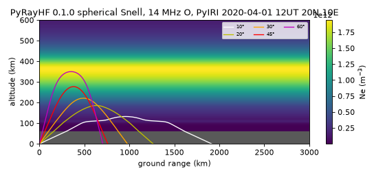

# PyRayHF · 纯 Python 高频（HF）射线追踪 操作手册

目录：[`PROJECTS.json` → `PyRayHF`](../../PROJECTS.json) · 上游 <https://github.com/victoriyaforsythe/PyRayHF>（NRL Victoriya Forsythe；main `8fef3ac` 2025-12-23）· PyPI **`PyRayHF` 0.1.0**（Alpha）· 许可 **MIT**（`LICENSE`；`pyproject` classifier 写成 BSD，以 LICENSE 为准，与 [pyiri](./pyiri.md) 同样的笔误）· 本机验证 **2026-09-26 03:44–03:50 EDT**：CPython 3.13.5 venv，PyIRI 0.1.7 / numpy 2.5.3 / scipy 1.18.1 / lmfit 1.3.4；仓内 `pytest` **35 passed**。

> 岗位：给一条（或一片）电子密度剖面 + 地磁场，算 HF 电波**斜向**传播的落地距离、路径长度、群时延，以及**垂测**虚高 h'(f)。不需要 MATLAB/PHaRLAP。冲突时：本机 `site-packages/PyRayHF/library.py` docstring > 上游 notebook > 本文。

## 1. 它解决什么（术语先讲清）

HF（3–30 MHz）电波打到电离层会被“折回”地面，这就是短波能跨洲通信、测高仪能测电离层的原因。PyRayHF 回答：**某频率、某仰角发出去，在哪儿落地？路上花多久？最高到多高？**

| 术语 | 一句话 | 在 PyRayHF 里 |
| --- | --- | --- |
| **等离子体频率 fN** | 电子密度 Ne 对应的临界频率，fN[Hz] ≈ 8.98·√Ne[m⁻³]；电波频率低于它就过不去 | `den2freq(Ne)` / `freq2den(f)` |
| **foF2 / hmF2 / NmF2** | F2 层峰值的临界频率 / 峰高 / 峰密度；foF2 是**垂直**入射能被反射的最高频 | 剖面 `argmax(den)`；`generate_input_1D` 另返 PyIRI 的 `F2['fo'/'hm'/'Nm']` |
| **X、Y** | X=(fN/f)²，Y=fH/f（fH 电子回旋频率，约 0.8–1.6 MHz） | `find_X`、`find_Y` |
| **Appleton–Hartree 公式** | 磁化等离子体里的折射指数 μ(X,Y,磁场夹角)；有两个解 | `find_mu_mup` 同时给相折射率 μ 和群折射率 μ′ |
| **O / X 模** | 寻常波 / 非寻常波，AH 公式的两个根；O 在 X=1 反射，X 在 X=1−Y 反射（更低处），所以 X 模“先回头” | 所有追踪函数 `mode="O"` 或 `"X"` |
| **bpsi** | 地磁场与**竖直方向**的夹角（度），= 90° − |磁倾角| | `calculate_magnetic_field` 用 PyIRI 内置 IGRF 算 |
| **虚高 h′** | 假设电波在真空里以光速走，按往返时延折算的“反射高度”；因为电离层里群速 < c，h′ 总高于真实反射高度 | `vertical_forward_operator(freq, …)` |
| **群路径 P′ / 群时延 τ** | P′ = c·τ = ∫μ′ds，比几何路径长 | 返回 `group_delay_sec`；⚠ `group_path_km` 其实是**几何**长度（坑 3） |
| **地面距离 / 跳距（skip distance）** | 落地点沿地表的距离；同频率下所有能反射的仰角里最近的落地点就是跳距，跳距以内（地波之外）收不到 | `ground_range_km`；跳距要自己扫仰角取最小值（§3.3） |
| **MUF** | 给定距离 D 能被电离层送到的最高可用频率；距离越远 MUF 越高（MUF ≈ foF2·secφ 的思想） | 无单独函数，靠“扫频率看跳距”得到（§6） |

四个追踪器（均为 2-D，大圆平面内）：

| 函数 | 几何 | 介质假设 | 用途 |
| --- | --- | --- | --- |
| `trace_ray_cartesian_snells` | 平地 | 水平分层（只随高度变） | 最快，近距离、教学 |
| `trace_ray_spherical_snells` | 球面地球 | 水平分层 | 本文 E2E；千公里级斜测 |
| `trace_ray_cartesian_gradient` | 平地 | 2-D 网格（有水平梯度） | TID/晨昏线等倾斜层 |
| `trace_ray_spherical_gradient` | 球面地球 | 2-D 网格 | 最真实也最慢；输入用 `generate_input_2D` |

另有 `model_VH` / `minimize_parameters`：用 lmfit 调 PyIRI 的 F2/F1/E 参数去拟合**实测**虚高，即把测高仪描迹反演成剖面。

## 2. 安装

```bash
mkdir -p /workspace/scratch_x && cd /workspace/scratch_x
python3 -m venv venv && . venv/bin/activate
pip install --no-cache-dir PyRayHF==0.1.0 matplotlib   # 会拉 PyIRI>=0.1.5、lmfit、scipy、pytest
python -u -c "import PyRayHF, PyIRI; print(PyRayHF.__version__, PyIRI.__version__)"
# 0.1.0 0.1.7
```

- 纯 Python 轮子，无编译；venv 装完约 **463 MB**（scipy + matplotlib 占大头）。
- PyIRI 的 CCIR/URSI/IGRF 系数随包附带，**离线可用**。
- 想跑上游测试：`git clone https://github.com/victoriyaforsythe/PyRayHF && cd PyRayHF && python -m pytest -q PyRayHF/tests` → 本机 `35 passed in 1.32s`。

## 3. 端到端：PyIRI 剖面 → 垂测 h′(f) → 斜向射线（本机真跑）

场景与 [pyiri.md](./pyiri.md) 相同，便于互相核对：2020-04-01 12 UT，20°N / 10°E（非洲中北部），F10.7 = 100，CCIR + SHU2015。

### 3.1 脚本 `ray_e2e.py`（核心部分）

```python
import numpy as np
from PyRayHF import library as lib

aalt = np.arange(60, 1000, 1.0)                          # km，上限 1000
d = lib.generate_input_1D(2020, 4, 1, 12, 20.0, 10.0, aalt, 100.0)  # 纬, 经 顺序！
alt, Ne, B, psi = d["alt"], d["den"], d["bmag"], d["bpsi"]
i = np.argmax(Ne)
print(f"NmF2={Ne[i]:.4e} m^-3  hmF2={alt[i]:.0f} km  foF2={lib.den2freq(Ne[i])/1e6:.3f} MHz")

# 垂测：频率单位 MHz
fr = np.array([2, 4, 6, 8, 10, 11, 12, 12.3])
for m in ("O", "X"):
    vh = lib.vertical_forward_operator(fr, Ne, B, psi, alt, mode=m)

# 斜测：频率单位 Hz，仰角单位度
for f in (10.0, 14.0, 21.0):
    for el in (10, 20, 30, 45, 60, 75):
        r = lib.trace_ray_spherical_snells(f*1e6, el, alt, Ne, B, psi, mode="O")
        # 穿透时返回 NaN 且缺 z_apex_km 键 → 用 r.get()
        print(f, el, r["ground_range_km"], r["group_path_km"], r.get("z_apex_km", np.nan),
              r["group_delay_sec"]*1e3, r["group_delay_sec"]*299792.458)
```

完整脚本另有：跳距扫描（仰角 5–89° 每 1°）、画 PNG。运行 `python -u ray_e2e.py`，单次 PyIRI 约 3.4 s，全部追踪 < 2 s。

### 3.2 真实输出（去掉 PyIRI 的 FutureWarning）

```text
PyRayHF 0.1.0 PyIRI 0.1.7
generate_input_1D: 3.4 s
shapes alt/den/bmag/bpsi: (940,) (940,) (940,) (940,)
NmF2=1.9414e+12 m^-3  hmF2=365 km  foF2=12.510 MHz
PyIRI F2 dict: NmF2=1.9415e+12 hmF2=364.62 foF2=12.5130
|B|@300km=31364 nT  psi@300km=68.06 deg
gyrofreq fH@300km=0.878 MHz
O h'(f): 2MHz=106.1 4MHz=197.3 6MHz=261.4 8MHz=315.0 10MHz=389.0 11MHz=440.1 12MHz=531.7 12.3MHz=598.4
X h'(f): 2MHz=106.8 4MHz=134.7 6MHz=276.0 8MHz=309.1 10MHz=379.8 11MHz=425.8 12MHz=494.8 12.3MHz=528.6
f_MHz mode elev  ground_km path_km apex_km delay_ms  cTau_km
 10.0 O   10    1006.1   1034.9   101.1    3.462   1038.0
 10.0 O   20     983.7   1041.3   138.0    3.583   1074.1
 10.0 O   30     869.2    968.4   180.0    3.463   1038.1
 10.0 X   30     842.1    937.7   174.0    3.367   1009.3
 10.0 O   45     561.3    730.8   214.0    2.752    825.1
 10.0 O   60     376.6    638.9   243.0    2.636    790.3
 10.0 O   75     189.6    569.7   261.0    2.612    782.9
 14.0 O   10    1915.2   1964.2   132.4    6.655   1995.1
 14.0 O   20    1264.1   1345.5   185.0    4.642   1391.6
 14.0 O   30     978.2   1104.8   221.0    3.923   1176.0
 14.0 X   30     960.2   1084.2   217.0    3.859   1156.9
 14.0 O   45     760.1    982.2   277.2    3.776   1132.0
 14.0 O   60     704.8   1074.3   349.0    5.075   1521.4
  [14.0 MHz el=75] no z_apex_km key -> penetrates (NaN)
 14.0 O   75       nan      nan     nan      nan      nan
 21.0 O   10    2163.8   2238.3   193.3    7.583   2273.2
 21.0 O   20    1645.3   1764.9   246.0    6.112   1832.4
 21.0 O   30    1637.8   1841.4   324.3    6.723   2015.6
 21.0 X   30    1555.4   1751.7   316.0    6.386   1914.6
  [21.0 MHz el=45] no z_apex_km key -> penetrates (NaN)
 21.0 O   45       nan      nan     nan      nan      nan
  [21.0 MHz el=60] no z_apex_km key -> penetrates (NaN)
 21.0 O   60       nan      nan     nan      nan      nan
  [21.0 MHz el=75] no z_apex_km key -> penetrates (NaN)
 21.0 O   75       nan      nan     nan      nan      nan
skip scan (O):
  10.0 MHz: reflects el<=85 deg; skip~76 km @ el=84; n_nan=4
  14.0 MHz: reflects el<=60 deg; skip~656 km @ el=57; n_nan=29
  21.0 MHz: reflects el<=31 deg; skip~1550 km @ el=27; n_nan=58
saved pyrayhf_rays.png
```

剖面峰值与 pyiri.md 记录的 `NmF2=1.941519e+12 / hmF2=364.62 / foF2=12.5130` 一致（1 km 网格取 argmax 得 365 km / 12.510 MHz）。

### 3.3 射线图



背景是水平均匀的 Ne；灰色区是剖面下界 60 km 以下（程序把 0–60 km 当真空直线段）。10° 射线在 E 层（~110–130 km）就被折回，落地 1915 km；30°→45° 落地距离反而缩短，到 57° 附近达到最近点 656 km（跳距）；再抬高到 75° 就穿透 F2 峰飞走（NaN）。

## 4. 参数与输出字段

`trace_ray_spherical_snells(f0_Hz, elevation_deg, alt_km, Ne, Babs, bpsi, mode="O", *, dz_target_km=1.0, apex_boost=200.0, max_substeps=400, R_E=None)`

| 参数 | 单位 | 说明 |
| --- | --- | --- |
| `f0_Hz` | **Hz** | 注意与 `vertical_forward_operator` 的 MHz 不同 |
| `elevation_deg` | 度 | 相对当地水平 |
| `alt_km`, `Ne`, `Babs`, `bpsi` | km, m⁻³, **T**, 度 | 同长度一维；若 `alt_km[0]>0` 函数自动在 0 km 插值补一点 |
| `mode` | — | `"O"` / `"X"` |
| `dz_target_km` / `apex_boost` / `max_substeps` | km / — / — | 反射点附近加密积分步；一般不用动 |
| `R_E` | km | 默认取 `constants()` 的地球半径 |

| 返回键 | 含义 | 注意 |
| --- | --- | --- |
| `x`, `z` | 沿地表距离 / 高度数组（km） | 只在剖面网格节点处有点；0 km→首个网格是一条直线 |
| `ground_range_km` | 落地距离 | 未落回 0 km（穿透）→ NaN |
| `group_path_km` | 沿射线**几何**长度 ∫ds | 不是群路径 |
| `group_delay_sec` | ∫μ′/c ds | 乘 c 才是真群路径 P′ |
| `x_midpoint`, `z_midpoint` | 按路径长度一半处的点 | |
| `x_apex_km`, `z_apex_km` | 等于上面的 midpoint（分层对称所以≈顶点） | **穿透时这两个键不存在** |

`generate_input_1D(year, month, day, UT, tlat, tlon, aalt, F107, save_path='')` → dict：`alt, den, bmag, bpsi, F2, F1, E, year…tlon`。`save_path` 以 `.p` 结尾就 pickle 存盘，上游 notebook 的 `Example_Input_Day.p` 就是这样生成的。
`generate_input_2D(..., dx, aalt, gcd, az, F107)` 多出 `xgrid, zgrid, xlat, xlon`，`den/bmag/bpsi` 变二维，喂给 `*_gradient` 追踪器（先用 `build_refractive_index_interpolator_*`）。

`vertical_forward_operator(freq_MHz, den, bmag, bpsi, alt, mode='O', n_points=200)` → h′ 数组（km）；频率 ≥ foF2 时无意义。

## 5. 坑（现象 → 原因 → 一条修复命令）

1. **`KeyError: 'z_apex_km'`** → 射线穿透时函数提前返回，字典只有 7 个 NaN 键，没有 apex 键 → 一律 `r.get("z_apex_km", np.nan)`，或先判 `np.isfinite(r["ground_range_km"])`。
2. **射线“全部 NaN”或落地距离离谱** → 频率单位错：斜测要 Hz，垂测要 MHz → `trace_ray_spherical_snells(14e6, …)` 与 `vertical_forward_operator(np.array([14.0]), …)`。
3. **拿 `group_path_km` 当群路径和斜测仪对不上**（上表 14 MHz/60°：1074.3 vs c·τ = 1521.4 km）→ 该键是几何长度，docstring 写着 “total geometric path length” → `P = r["group_delay_sec"] * 299792.458`。
4. **近垂直（本例 ≥ 86°）明明 f < foF2 却 NaN；85° 落地 503 km 比 84° 的 76 km 还远** → 分层 Snell 在 p→0、反射点极尖锐时数值不稳 → 近垂直改用 `lib.vertical_forward_operator(fr, Ne, B, psi, alt)`，斜向只信 ≤ 80° 左右的结果并画图目检。
5. **经纬度填反，剖面跑到别处** → `generate_input_1D(…, tlat, tlon, …)` 先纬后经，而 PyIRI 的 `IRI_density_1day(…, alon, alat, …)` 先经后纬 → `lib.generate_input_1D(2020,4,1,12, 20.0, 10.0, aalt, 100.0)  # lat, lon`。
6. **`aalt` 给到 2000 km 或从 0 起算 E 层下出怪值** → docstring 限定上限 1000 km；D 层以下 PyIRI 密度无物理意义 → `aalt = np.arange(60, 1000, 1.0)`。
7. **每次都刷一屏 `FutureWarning: … old_output …`** → PyRayHF 0.1.0 按旧 6 输出调用 PyIRI 0.1.7 → `python -W ignore::FutureWarning -u ray_e2e.py`（只是告警；PyIRI 0.2 若改默认值，0.1.0 会解包失败，届时 `pip install "PyIRI<0.2"`）。
8. **X 模全 NaN、O 模落地距离也变了（14 MHz/30° O：978.2→871.0 km），垂测 h′ 恒等于下界 60 km** → `Babs` 必须是 **T**（`calculate_magnetic_field` docstring 写 nT，但代码已除 1e9）；把别的 IGRF 包的 nT 直接喂进去就是这样（本机把 T×1e9 实测复现） → `Babs = B_nT * 1e-9`。
9. **射线图 0–60 km 看不到线** → 剖面下界以下画布是空白、白线画在白底上 → `ax.set_facecolor("0.35")`。

## 6. 怎么读结果

- **先看剖面**：foF2 = 12.51 MHz、hmF2 = 365 km（低纬白天，偏高偏强正常）。垂测 h′ 在 12→12.3 MHz 从 532 猛增到 598 km，这就是逼近 foF2 时的“群时延发散”，电离图上 F2 描迹尾巴上翘就是这个。
- **O/X 分裂**：同频 X 模 h′ 低（10 MHz：389.0 vs 379.8 km），斜测时 X 落地也更近（30°：869.2 vs 842.1 km）。X 模临界频率 fxF2 比 foF2 高约 fH/2（本例 fH ≈ 0.88 MHz → 约 0.44 MHz），频率越高两模差别越小。
- **跳距与 MUF 是一回事的两面**：本剖面 14 MHz 跳距约 656 km，21 MHz 约 1550 km。反过来说，656 km 链路的 MUF ≈ 14 MHz、1550 km 链路 MUF ≈ 21 MHz，都远高于 foF2 = 12.5 MHz——斜入射能用更高频率。
- **低仰角走 E 层**：10 MHz/10° 顶点只有 101 km，是 E 层反射，不是 F 层；判断“哪层反射”看 `z_apex_km`。
- **时延量级**：千公里链路 3–7 ms。与 [hamsci-lstid-detection](./hamsci-lstid-detection.md) 用的“HF spot 跳距边缘”思路一致：电离层起伏（TID）会让跳距周期性伸缩，可用 PyRayHF 正演“剖面变化 X% → 跳距变化多少 km”。
- **和 SuperDARN 对照**：[pydarn](./pydarn.md) 的回波门号→地面距离同样依赖虚高假设；PyRayHF 可给出真实剖面下的“门号↔地面距离”映射。
- 概念背景见教程 [22 · TID](../tutorials/22-tid-traveling-disturbances.md)（TID 让等密度面倾斜 → 要用 `*_gradient` 追踪器）与 [21 · 赤道异常](../tutorials/21-equatorial-anomaly-bubbles.md)（EIA 区南北梯度大，分层假设最容易失效）。

## 7. 与相邻工具怎么选

| 需求 | 用 |
| --- | --- |
| 只要背景剖面 / NmF2 / vTEC | [pyiri](./pyiri.md) |
| 物理模式给出的低纬剖面（喷泉、EIA 双峰） | [sami2py](./sami2py.md) → 取某经度剖面再喂 PyRayHF |
| 3-D 磁离子射线追踪、吸收、多跳 | PHaRLAP（MATLAB，DST 申请制，本仓未收录）；PyRayHF 目前只有 2-D、单跳 |
| 实测 HF 传播数据（spot / 雷达） | [hamsci-lstid-detection](./hamsci-lstid-detection.md)、[pydarn](./pydarn.md) |

## 8. 许可与诚实局限

- **MIT**（LICENSE，Copyright 2023 victoriyaforsythe）。PyPI 元数据 classifier 写 BSD，属笔误。
- 0.1.0 标 **Alpha**；API 小写不统一，返回字典随路径（反射/穿透）缺键。
- 只做 **2-D**（大圆平面内），**无横向偏离、无吸收（D 层损耗）、无多跳、无碰撞项**；功率/信噪比一概不算。
- Snell 版假设**水平分层**：本文 E2E 属于此类，结果只对“剖面在整条路径上都一样”成立；千公里以上链路应改用 `generate_input_2D` + `trace_ray_spherical_gradient`（本文未跑）。
- 近垂直（≥ 86°）数值不稳（坑 4），85° 处出现非单调落地距离，本文如实保留。
- 本文剖面是 **PyIRI 气候态**，不是当天实况；数字只说明工具行为，不代表 2020-04-01 当天真实传播条件。
