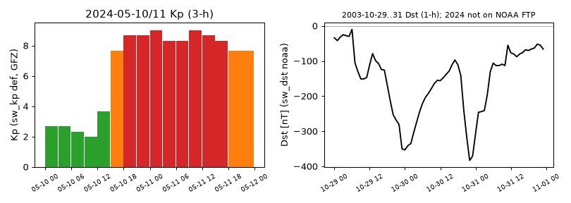

# pysatSpaceWeather · 空间天气指数（Kp/ap/F10.7/Dst…）→ pysat Instrument 操作手册

目录：[`PROJECTS.json` → `pysatSpaceWeather`](../../PROJECTS.json) · 上游 <https://github.com/pysat/pysatSpaceWeather> · 文档 <https://pysatspaceweather.readthedocs.io/> · PyPI **0.2.2**（main HEAD `e36d39d`）· 依赖 **pysat 3.2.2** · 许可 **BSD-3-Clause**（pysat 同为 BSD-3）· 本机实跑 2026-09-26 05:54–06:07 EDT（CPython 3.13.5，venv；最终环境 numpy 2.2.6 / pandas 2.3.3 / xarray 2026.7.0）

> 岗位：用同一套 `pysat.Instrument` 接口下载、缓存、加载各家空间天气指数（GFZ Kp/ap/F10.7、SWPC 预报、NOAA Dst、LASP 预测 Dst/AE…），外加 Kp↔ap 换算、81 天 F10.7 平均、多源合并这几个小工具。给磁暴 TEC 分析、IRI/MSIS 驱动、"只取平静日"筛选用。冲突时：**本机 `pysatSpaceWeather/instruments/*.py` 源码 > 本文**。

## 1. 它解决什么 / 不做什么

**做：**

- 每个指数一个 Instrument 模块：`sw_kp` `sw_ap` `sw_f107` `sw_dst` `sw_ae/al/au` `sw_cp` `sw_hpo/apo` `sw_ssn` `sw_mgii` `sw_flare` `sw_stormprob` `sw_polarcap` `sw_sbfield` `norp_rf` `ace_*`（本机 `psw.instruments.__all__` 列出 21 个）
- 下载缓存到 `pysat.params['data_dirs']`，之后离线 `load()`，数据是带时间索引的 pandas DataFrame + 元数据（单位、描述）
- `methods.kp_ap`：`convert_3hr_kp_to_ap` / `calc_daily_Ap` / `combine_kp` / `filter_geomag`；`methods.f107`：`calc_f107a` / `combine_f107`

**不做：**

- 不算 TEC、不读 RINEX；只给驱动/背景指数
- 不存历史预报（预报类 tag 只能拿"今天"的那一份）
- 2024 年的 **Dst 拿不到**（见 §3.4、坑 6）；LISIRD 历史 F10.7 截止 2018（坑 7）

| 相邻页面 | 关系 |
| --- | --- |
| [pysatcdaac](./pysatcdaac.md) | 同属 pysat 生态（COSMIC 掩星）；`data_dirs` 设置方式相同 |
| [geomagindices](./geomagindices.md) | 另一个"按时刻取 Ap/F10.7/Kp"的小库；源已部分失效 |
| [pymsis](./pymsis.md) | MSIS 自己拉 F10.7/ap；可用本页的 GFZ 值交叉核对 |
| [ocbpy](./ocbpy.md) | 同一场 2024-05-10 暴在极盖边界坐标下的样子 |

## 2. 安装

```bash
python3 -m venv venv && . venv/bin/activate
pip install --no-cache-dir pysat pysatSpaceWeather matplotlib 'numpy<2.3' 'pandas<3'
```

两个版本上限都是本机踩出来的：numpy 2.5.3 下创建任何 Instrument 就报 `TypeError: data type 'a' not understood`（坑 2）；pandas 3.0.6 下 `sw_dst` 加载报 `Invalid frequency: H`（坑 3）。

首次使用必须指定数据目录（否则 import 时打印 `Hi there! pysat will nominally store data in a 'pysatData' directory which needs to be assigned`）：

```python
import pysat
pysat.params['data_dirs'] = '/path/to/pysatData'   # 目录必须已存在；写入 ~/.pysat/pysat_settings.json，永久生效
```

本机为了不碰共享的 `~/.pysat`，所有脚本用 `HOME=$PWD/home python -u ...` 跑，设置文件落在 scratch 里。

## 3. 端到端（2024-05-10/11 "Gannon" 磁暴）

公共开头：

```python
import datetime as dt, pysat, pysatSpaceWeather as psw
I, M = psw.instruments, psw.instruments.methods
s, e = dt.datetime(2024,5,10), dt.datetime(2024,5,12)   # load 的 end_date 不含当天 → 实际是 10、11 两天
kp = pysat.Instrument(inst_module=I.sw_kp, tag='def'); kp.download(start=s, stop=e); kp.load(date=s, end_date=e)
ap = pysat.Instrument(inst_module=I.sw_ap, tag='def'); ap.download(start=s, stop=e); ap.load(date=s, end_date=e)
```

### 3.1 Kp / ap（GFZ 定值，3 小时）

变量与元数据（本机打印）：

```
variables: ['Bartels_solar_rotation_num', 'Kp', 'daily_Kp_sum', 'day_within_Bartels_rotation']
  Kp: units='' desc='Planetary K-index'
variables: ['Bartels_solar_rotation_num', 'ap', 'daily_Ap', 'day_within_Bartels_rotation']
  ap: units='' desc='ap (equivalent range) index'
```

`pd.concat([kp['Kp'], ap['ap'], ap['daily_Ap']], axis=1)` 的真实输出：

```
                           Kp   ap  daily_Ap
2024-05-10 00:00:00  2.666667   12       105
2024-05-10 03:00:00  2.666667   12       105
2024-05-10 06:00:00  2.333333    9       105
2024-05-10 09:00:00  2.000000    7       105
2024-05-10 12:00:00  3.666667   22       105
2024-05-10 15:00:00  7.666667  179       105
2024-05-10 18:00:00  8.666667  300       105
2024-05-10 21:00:00  8.666667  300       105
2024-05-11 00:00:00  9.000000  400       271
2024-05-11 03:00:00  8.333333  236       271
2024-05-11 06:00:00  8.333333  236       271
2024-05-11 09:00:00  9.000000  400       271
2024-05-11 12:00:00  8.666667  300       271
2024-05-11 15:00:00  8.333333  236       271
2024-05-11 18:00:00  7.666667  179       271
2024-05-11 21:00:00  7.666667  179       271
max Kp = 9.0 at 2024-05-11 00:00:00 ; max ap = 400
```



左：`Kp`（`sw_kp` def），≥8 红、≥5 橙。右：`dst`（`sw_dst` noaa，nT）——只能画 2003 万圣节暴，原因见 §3.4。

### 3.2 换算工具：Kp → ap、日 Ap

```python
M.kp_ap.convert_3hr_kp_to_ap(kp)                     # 新增列 '3hr_ap'
M.kp_ap.calc_daily_Ap(kp, ap_name='3hr_ap', daily_name='Ap_calc')
```

```
new vars: ['Bartels_solar_rotation_num', 'Kp', 'daily_Kp_sum', 'day_within_Bartels_rotation', '3hr_ap']
                           Kp  3hr_ap
2024-05-10 15:00:00  7.666667     179
2024-05-11 00:00:00  9.000000     400
                     3hr_ap  Ap_calc
2024-05-10 00:00:00      12  105.125
2024-05-11 00:00:00     400  270.750
```

`3hr_ap` 与 GFZ 自带 `ap` 逐点一致；`Ap_calc`（8 个 ap 的均值）105.125 / 270.750，GFZ `daily_Ap` 取整成 105 / 271。

### 3.3 F10.7（GFZ `now`，`inst_id='obs'`）+ 81 天平均

```python
f = pysat.Instrument(inst_module=I.sw_f107, tag='now', inst_id='obs')
f.download(date_array=pysat.utils.time.create_date_range(dt.datetime(2024,3,1), dt.datetime(2024,7,1), freq='MS'))
f.load(date=dt.datetime(2024,3,1), end_date=dt.datetime(2024,8,1))
M.f107.calc_f107a(f, f107_name='f107', f107a_name='f107a')
```

```
download date_array freq=MS took 8.1 s
n = 153 unique = True 2024-03-01 -> 2024-07-31
vars: ['f107', 'f107a'] | units f107 = 'SFU' f107a = 'SFU'
             f107       f107a
Epoch
2024-05-08  227.1  175.216049
2024-05-09  233.2  175.529630
2024-05-10  223.4  176.225926
2024-05-11  213.7  177.086420
2024-05-12  221.8  178.030864
2024-05-13  215.4  179.054321
```

`f107a` 是居中 81 天滑动平均（源码 `rolling(window=81, center=True)`），所以要多下前后各 40 天；只下 5 月会得到 NaN。**一定要按月（`freq='MS'`）下**，否则文件内容错位（坑 4）。

### 3.4 Dst（NOAA/NCEI 小时值）

`sw_dst` `tag='noaa'` 走 `ftp.ngdc.noaa.gov/STP/space-weather/geomagnetic-data/INDICES/DST`。本机实测：

- 该 FTP 目录 `nlst()` 共 59 项，年文件最后一个是 `dst2008.txt`（之后只有 `Q-LOOK_*`）；HTTPS 镜像 `.../DST/dst2024.txt` 返回 404 → **2024 年 Dst 这个包拿不到**
- 本机 FTP 被动数据连接超时（`TimeoutError: timed out`），并留下 0 字节 `dst2003.txt`（坑 5）

用 HTTPS 手动下 `dst2003.txt` 后走 `mock_download_dir` 加载 2003 万圣节暴：

```python
d = pysat.Instrument(inst_module=I.sw_dst, tag='noaa')
d.download(start=dt.datetime(2003,1,1), stop=dt.datetime(2003,1,1), mock_download_dir='/abs/path/dstmock')
d.load(date=dt.datetime(2003,10,29), end_date=dt.datetime(2003,11,1))
```

```
vars: ['dst'] | units dst = 'nT' | desc = 'Disturbance storm-time index'
min dst = -383 at 2003-10-30 22:00:00 n = 72
                     dst
2003-10-30 20:00:00 -240
2003-10-30 21:00:00 -316
2003-10-30 22:00:00 -383
2003-10-30 23:00:00 -371
2003-10-31 00:00:00 -307
```

2024 年要 Dst：直接去 Kyoto WDC（本文未实跑），或用 [geomagindices](./geomagindices.md) 页里的替代源。

### 3.5 预报与合并（运行日 2026-09-26）

```python
kfc = pysat.Instrument(inst_module=I.sw_kp, tag='forecast'); kfc.download(start=today, stop=today); kfc.load(date=today)
krc = pysat.Instrument(inst_module=I.sw_kp, tag='recent');   krc.download(start=today, stop=today)
kdf = pysat.Instrument(inst_module=I.sw_kp, tag='now');      kdf.download(start=today-dt.timedelta(days=3), stop=today)
kc = M.kp_ap.combine_kp(standard_inst=kdf, recent_inst=krc, forecast_inst=kfc,
                        start=today-dt.timedelta(days=2), stop=today+dt.timedelta(days=3))
```

```
sw_kp forecast: vars=['Kp'] n=24 (Timestamp('2026-09-26 00:00:00'), Timestamp('2026-09-28 21:00:00'))
--- combine_kp(standard=now, recent, forecast)
vars ['Kp'] n 40
                       Kp
2026-09-24 00:00:00  3.00
2026-09-25 00:00:00  3.67
2026-09-26 00:00:00  3.33
2026-09-26 12:00:00  2.00
2026-09-27 00:00:00  2.67
2026-09-28 12:00:00  1.67
```

（节选；合并优先级按源码文档串：standard > recent > forecast。文档写 standard 应传 `def`，本机传 `now` 也能跑。）

F10.7 的 `45day` 预报**坏了**：`pysat WARNING: File 45-day-ap-forecast.txt not found: https://services.swpc.noaa.gov/text/`，得到空表；于是 `combine_f107(now_obs, 45day)` 的未来 5 天全是 NaN：

```
vars ['f107'] n 10
2026-09-25  105.4
2026-09-26    NaN
```

`sw_dst` `tag='lasp'`（LASP 用 ACE/DSCOVR 实时太阳风预测的 Dst）能用：

```
sw_dst lasp: vars=['dst'] n=575 (Timestamp('2026-09-22 10:23:22'), Timestamp('2026-09-26 09:35:06'))
2026-09-26 09:35:06 -48.0
```

（时间戳是文件里的 UT；09:35 UT = 05:35 EDT。只保留最近约 4 天。）

## 4. 参数 / 字段

| Instrument（本文用到的） | tag / inst_id | 来源 | 变量（单位） | 文件粒度 |
| --- | --- | --- | --- | --- |
| `sw_kp` | `def` | GFZ 定值 | `Kp`（无量纲，三分之一步长） `daily_Kp_sum` `Bartels_solar_rotation_num` `day_within_Bartels_rotation`（day） | 年文件 `Kp_def2024.txt` |
| `sw_ap` | `def` | GFZ | `ap`、`daily_Ap`（无量纲，"等效幅度"） | 年文件 |
| `sw_f107` | `now` / `obs` 或 `adj` | GFZ JSON | `f107`（SFU） | **月文件** `Fobs_2024-05.txt` |
| `sw_f107` | `historic` | LASP LISIRD | `f107`（SFU） | 月文件；**数据止于 2018** |
| `sw_dst` | `noaa` | NCEI FTP | `dst`（nT，1 h） | 年文件；**止于 2008** |
| `sw_dst` | `lasp` | LASP 实时预测 | `dst`（nT，约 10 min） | 当天文件 |
| `sw_kp` | `forecast` / `recent` / `now` | SWPC / SWPC / GFZ | `Kp` | 只有当前 |

| 调用 | 关键参数 | 说明 |
| --- | --- | --- |
| `pysat.Instrument(inst_module=..., tag=, inst_id=)` | 必须传模块对象 | 写 `'sw','kp'` 字符串会报 `unknown platform`（坑 1） |
| `inst.download(start, stop)` 或 `date_array=` | `update_files=True` 重下 | 没有 `freq=` 参数；按月下用 `create_date_range(..., freq='MS')` |
| `inst.load(date, end_date)` | `end_date` 不含 | 两天 → `end_date = 第三天 00:00` |
| `calc_f107a(inst, f107_name, f107a_name, min_pnts=41)` | 81 天窗口 | 点数不够给 NaN |
| `combine_kp(standard_inst, recent_inst, forecast_inst, start, stop)` | 至少两个源 | 只合并已下载数据，不会自己下载 |

## 5. 怎么读结果

- `Kp` 是 0–9、三分之一步长：`2.666667` = 3−，`8.333333` = 8+，`9.0` = 9o。本次 `Kp` 在 2024-05-10 15 UT 从 3.67 跳到 7.67，从这一段起连续 11 个 3 小时段都 ≥ 7.67（到表尾 05-11 21 UT），峰值 9.0 出现两次（05-11 00 UT、09 UT）。
- `ap` 是非线性映射：`Kp` 9 → `ap` 400，所以 `daily_Ap` 271 比 `daily_Kp_sum` 67 更能看出暴有多强。拿来驱动 MSIS/IRI 时注意模型要的是 `ap` 还是 `Ap`。
- `f107` 暴期 213.7–233.2 SFU，`f107a` 约 176 SFU：说明这是高太阳活动背景下的暴，暴前 TEC 基线就偏高。
- `dst` 最低 −383 nT（2003-10-30 22 UT）属超强暴（< −250 nT）。Dst 是环电流的小时指数，Kp 是 3 小时中纬扰动，两者峰值时间不必一致。

## 6. 坑（现象 → 原因 → 一条修复命令）

| # | 现象 | 原因 | 修复 |
| --- | --- | --- | --- |
| 1 | `pysat.Instrument('sw','kp',tag='def')` → `KeyError: 'unknown platform supplied: sw'` | 字符串方式只认已注册模块；pysatSpaceWeather 装上不会自动注册 | `pysat.Instrument(inst_module=psw.instruments.sw_kp, tag='def')` |
| 2 | 创建任何 Instrument 都报 `TypeError: data type 'a' not understood` | pysat 3.2.2 `_files.py` 用 `'a'` dtype 别名，numpy 2.5 已删 | `pip install --no-cache-dir 'numpy<2.3'` |
| 3 | `sw_dst` load 报 `ValueError: Invalid frequency: H ... Did you mean h?` | `sw_dst.py` 用 `freq='H'`，pandas 3 已删大写别名 | `pip install --no-cache-dir 'pandas<3'` |
| 4 | `sw_f107 now` 多天加载报 `Loaded data is not unique ... not monotonically increasing`；或 `Fobs_2024-05.txt` 里装的是 05-31…06-29 | `download(start, stop)` 默认按天循环，每天都用 `%Y-%m` 文件名写"当天起一个月"的数据，互相覆盖 | `python -c "import pysat,datetime as dt,pysatSpaceWeather as p; f=pysat.Instrument(inst_module=p.instruments.sw_f107,tag='now',inst_id='obs'); f.download(date_array=pysat.utils.time.create_date_range(dt.datetime(2024,3,1),dt.datetime(2024,7,1),freq='MS'),update_files=True)"` |
| 5 | `sw_dst noaa` 下载 `TimeoutError: timed out`，之后 load 报 `KeyError: 'dst'` | FTP 被动数据口不通，留下 0 字节年文件，pysat 当作已下载 | `find <data_dir>/sw/dst -size 0 -delete` 再用 HTTPS 下文件 + `mock_download_dir=` |
| 6 | `sw_dst noaa` 下 2024 年一直失败 | NCEI 目录年文件止于 `dst2008.txt`，`dst2024.txt` 404 | 2024 起不要用 `noaa` tag；改用 Kyoto WDC（未实跑）或 `tag='lasp'`（只有最近几天） |
| 7 | `sw_f107 historic` 下载不报错，load 得到 `variables: []` | LISIRD `noaa_radio_flux` 只到 2018，2019 起返回 `{"": {}}` | 用 `tag='now', inst_id='obs'`（GFZ） |
| 8 | `sw_f107 45day` 空表，`combine_f107` 未来全 NaN | SWPC 已不提供 `45-day-ap-forecast.txt` | 预报改用 `tag='forecast'`（3 天，本文未实跑）或直接看 SWPC 页面 |
| 9 | `import pysat` 打印 `Hi there!  pysat will nominally store data in a 'pysatData' directory which needs to be assigned` | `~/.pysat/pysat_settings.json` 里 `data_dirs` 为空（新用户或换了 `HOME`） | `mkdir -p ~/pysatData && python -c "import pysat; pysat.params['data_dirs']='$HOME/pysatData'"` |

## 7. 许可与诚实边界

- pysatSpaceWeather、pysat 都是 BSD-3-Clause。数据各有条款：GFZ Kp（`inst.acknowledgements` 打印 `CC BY 4.0`，引用 Matzka et al. 2021, doi:10.5880/Kp.0001）、NOAA/SWPC、LASP；`inst.acknowledgements` / `inst.references` 会打印对应要求。
- **实跑**：§3.1–3.5 全部输出；坑 1–7、9 复现过；坑 8 看到了 WARNING 和空表。
- **未实跑**：`sw_ae/al/au`、`ace_*`、`sw_hpo/apo`、`sw_mgii`、`norp_rf`；`filter_geomag`；`sw_f107 forecast/prelim/daily`；`sw_kp prediction`；Kyoto Dst 替代方案。版本上限（numpy<2.3、pandas<3）只在本机 Python 3.13 验证过。
- 缓存不会自动失效：`now`/`recent` 这种会变的数据，重跑前加 `update_files=True`。

## 8. 链接

- 教程：[20 磁暴 TEC 分析](../tutorials/20-storm-tec-analysis.md) · [14 空间天气案例](../tutorials/14-space-weather-case.md)
- 兄弟：[pysatcdaac](./pysatcdaac.md) · [geomagindices](./geomagindices.md) · [pymsis](./pymsis.md) · [ocbpy](./ocbpy.md)
