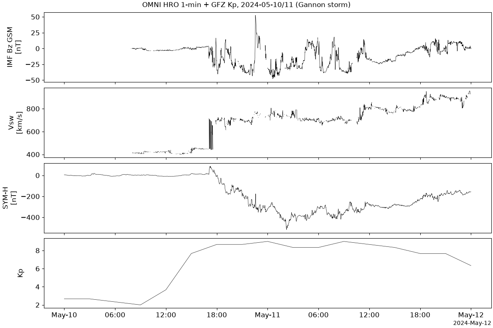

# PySPEDAS · 空间天气背景数据（OMNI / Kp / Dst）拉取与对时 操作手册

目录：上游 <https://github.com/spedas/pyspedas> · HEAD **`723c6a2`** · PyPI **2.2.0**（`requires_python >=3.10`）· **MIT** · ★204 · 本机验证 **2026-09-26 02:53–03:05 EDT**：CPython 3.11.16 venv，`pip --no-cache-dir install pyspedas` 装完 **670 MB**（含 astropy/spacepy/xarray/netCDF4/s3fs）；真实下载 OMNI HRO 1 分钟 CDF（2024-05，**8.37 MB**）+ GFZ Kp 年文件 + Kyoto Dst 暂定值，跑 2024-05-10/11 “Gannon” 超级磁暴。

> 岗位：给 TEC / ROTI / TID 分析配“太阳风 + 地磁指数”时间轴。PySPEDAS 本身**不读 RINEX、不算 TEC**。  
> 冲突时：**本机 `help(pyspedas.projects.omni.data)` / 上游文档 > 本文**。

## 1. 它解决什么

做磁暴电离层（教程 [20](../tutorials/20-storm-tec-analysis.md)）时，第一件事是回答“暴什么时候开始、主相多深、哪段 Bz 南向”。这些量散在 NASA SPDF、Kyoto WDC、GFZ 三处，格式各异（CDF / HTML / WDC 文本）。PySPEDAS 把它们统一成 **tplot 变量**（名字 → 时间数组 + 数值数组），一行加载、一行作图、一行重采样。

| 术语 | 一句话 | 本文用的变量 |
| --- | --- | --- |
| **OMNI HRO** | NASA 把 ACE/Wind/DSCOVR 太阳风数据**时移到地球弓激波鼻点**的 1 分钟/5 分钟合成集 | `omni.data(datatype='1min', level='hro')` |
| **IMF Bz (GSM)** | 行星际磁场南北分量；持续南向（负）= 能量灌进磁层 | `BZ_GSM`（nT） |
| **太阳风速度/密度/动压** | CME 到达时三者跳升；动压冲击触发“急始” | `flow_speed`（km/s）、`proton_density`（cm⁻³）、`Pressure`（nPa） |
| **SYM-H** | 1 分钟分辨的环电流指数（≈高分辨 Dst）；负得越深暴越强 | `SYM_H`（nT，OMNI 自带） |
| **Dst** | Kyoto 小时环电流指数，final / provisional / realtime 三档 | `kyoto_dst` |
| **Kp** | 3 小时全球地磁活动等级 0–9（以 1/3 为步长） | `Kp`（GFZ 源） |
| **AE** | 极光电急流指数，高纬加热/扰动发电机的驱动量 | `AE_INDEX`（OMNI 自带） |
| **SSC / 急始** | CME 激波撞上磁层，SYM-H 突然**正跳** | 从 `SYM_H` 找 |
| **tplot 变量** | PySPEDAS 的全局数据仓库条目；`get_data(name)` 取出 `.times`（Unix 秒）和 `.y` | — |

2.x 起旧的独立 `pytplot` 已并入 `pyspedas.tplot_tools`，`from pyspedas import get_data, tplot` 即可。

## 2. 安装

```bash
python3 -m venv ~/iono_ops/spedas-venv && . ~/iono_ops/spedas-venv/bin/activate
pip install --no-cache-dir pyspedas          # 本机约 30 s，venv 670 MB
pip show pyspedas | grep -E '^(Version|Requires)'
# Version: 2.2.0
# Requires: aioboto3, astropy, bottleneck, cdasws, cdflib, fsspec, geopack, hapiclient, matplotlib, netCDF4, numpy, pandas, platformdirs, pywavelets, requests, s3fs, scipy, spacepy, tomli, tomlkit, xarray
export SPEDAS_DATA_DIR=~/iono_ops/spedas_data   # 所有任务的下载根目录（见坑 1）
```

## 3. 端到端：Gannon 磁暴（2024-05-10/11）

`storm.py`：

```python
import os
os.environ.setdefault("SPEDAS_DATA_DIR", os.path.abspath("spedas_data"))
import numpy as np
from pyspedas import get_data
from pyspedas.projects import omni, kyoto, noaa

def utc(t): return np.datetime64(int(t*1e9), 'ns').astype('datetime64[s]')
tr = ['2024-05-10', '2024-05-12']
v = omni.data(trange=tr, datatype='1min', level='hro')
print("OMNI vars:", len(v), v[:10])
for name, f in [('BZ_GSM', 'min'), ('flow_speed', 'max'), ('proton_density', 'max'),
                ('Pressure', 'max'), ('SYM_H', 'min'), ('AE_INDEX', 'max')]:
    d = get_data(name); y = np.asarray(d.y, float)
    i = np.nanargmin(y) if f == 'min' else np.nanargmax(y)
    print(f"{name:15s} n={y.size} nan={int(np.isnan(y).sum())} {f}={y[i]:.1f} @ {utc(d.times[i])}")
dst = kyoto.dst(trange=tr)
print("Kyoto vars:", dst)
if dst:
    d = get_data(dst[0]); i = np.nanargmin(d.y)
    print("Dst n=", len(d.y), "min", d.y[i], "@", utc(d.times[i]))
kp = noaa.noaa_load_kp(trange=tr)
print("Kp vars:", kp)
d = get_data('Kp')
if d is not None:
    i = np.nanargmax(d.y)
    print("Kp n=", len(d.y), "max", d.y[i], "@", utc(d.times[i]))
```

本机 stdout（日志行节选，时间戳为本机 UTC）：

```text
26-Sep-26 06:59:39: Downloading https://spdf.gsfc.nasa.gov/pub/data/omni/omni_cdaweb/hro_1min/2024/omni_hro_1min_20240501_v01.cdf to .../spedas_data/omni/hro_1min/2024/omni_hro_1min_20240501_v01.cdf
26-Sep-26 06:59:40: Download of .../omni_hro_1min_20240501_v01.cdf complete, 8.366 MB in 0.7 sec (11.391 MB/sec) (transfer_normal)
26-Sep-26 06:59:42: Remote file not found: http://wdc.kugi.kyoto-u.ac.jp/dst_final/202405/index.html
26-Sep-26 06:59:43: Downloading http://wdc.kugi.kyoto-u.ac.jp/dst_provisional/202405/index.html to .../geom_indices/kyoto/dst_provisional/202405/index.html
26-Sep-26 06:59:44: Downloading https://datapub.gfz-potsdam.de/download/10.5880.Kp.0001/Kp_definitive/Kp_def2024.wdc to .../geom_indices/Kp_def2024.wdc
OMNI vars: 42 ['IMF', 'PLS', 'IMF_PTS', 'PLS_PTS', 'percent_interp', 'Timeshift', 'RMS_Timeshift', 'RMS_phase', 'Time_btwn_obs', 'F']
BZ_GSM          n=2881 nan=647 min=-47.8 @ 2024-05-11T00:36:00
flow_speed      n=2881 nan=1143 max=955.0 @ 2024-05-11T23:50:00
proton_density  n=2881 nan=1143 max=70.1 @ 2024-05-11T09:42:00
Pressure        n=2881 nan=1143 max=70.0 @ 2024-05-11T09:42:00
SYM_H           n=2881 nan=0 min=-518.0 @ 2024-05-11T02:14:00
AE_INDEX        n=2881 nan=0 max=4098.0 @ 2024-05-10T19:48:00
Kyoto vars: ['kyoto_dst']
Dst n= 48 min -406.0 @ 2024-05-11T02:30:00
Kp vars: ['Kp', 'ap', 'Sol_Rot_Num', 'Sol_Rot_Day', 'Kp_Sum', 'ap_Mean', 'Cp', 'C9']
Kp n= 17 max 9.0 @ 2024-05-11T00:00:00
```

总耗时 8.9 s，数据目录 8.5 MB（OMNI 按**月**文件下载，哪怕只要两天）。

### 3.1 逐 3 小时 Kp 与急始

```python
d = get_data('Kp')   # 打印 (时间, Kp)
```

```text
[('05-10T00:00', 2.667), ('05-10T03:00', 2.667), ('05-10T06:00', 2.333), ('05-10T09:00', 2.0),
 ('05-10T12:00', 3.667), ('05-10T15:00', 7.667), ('05-10T18:00', 8.667), ('05-10T21:00', 8.667),
 ('05-11T00:00', 9.0),   ('05-11T03:00', 8.333), ('05-11T06:00', 8.333), ('05-11T09:00', 9.0),
 ('05-11T12:00', 8.667), ('05-11T15:00', 8.333), ('05-11T18:00', 7.667), ('05-11T21:00', 7.667),
 ('05-12T00:00', 6.333)]
```

（原始输出是完整浮点，如 `2.6666666666666665`，此处保留 3 位。）找急始：

```python
from pyspedas import time_clip
time_clip('SYM_H', '2024-05-10/16:00', '2024-05-10/20:00', newname='SYMH_clip')
# clip n= 241 SSC max SYM_H= 88 @ 2024-05-10 17:15:00
```

### 3.2 出图

```python
import matplotlib; matplotlib.use("Agg")
from pyspedas import tplot, options, tplot_options
options('BZ_GSM', 'ytitle', 'IMF Bz GSM'); options('SYM_H', 'ytitle', 'SYM-H')
options('flow_speed', 'ytitle', 'Vsw'); options('Kp', 'ytitle', 'Kp')
tplot_options('title', 'OMNI HRO 1-min + GFZ Kp, 2024-05-10/11 (Gannon storm)')
tplot(['BZ_GSM', 'flow_speed', 'SYM_H', 'Kp'], save_png='pyspedas-omni-gannon-20240510', display=False)
# 文件实际落在 ./pyspedas_plots/pyspedas-omni-gannon-20240510.png（106796 B），见坑 2
```



## 4. 和 TEC / ROTI 对齐

TEC 与 ROTI 常见的时间格是 30 s（RINEX）或 5 分钟（ROTI 窗）。把 1 分钟 OMNI 重采样到 5 分钟，再与 ROTI 表按时间合并：

```python
from pyspedas import avg_data
import pandas as pd
avg_data('SYM_H', res=300, newname='SYMH_5min')
avg_data('BZ_GSM', res=300, newname='BZ_5min')
s, b = get_data('SYMH_5min'), get_data('BZ_5min')
df = pd.DataFrame({'SYM_H': s.y}, index=pd.to_datetime(s.times, unit='s'))
df['BZ_GSM'] = pd.Series(b.y, index=pd.to_datetime(b.times, unit='s'))
print(df.loc['2024-05-10 16:50':'2024-05-10 17:30'].round(1).to_string())
df.to_csv('omni_5min_20240510_11.csv')      # 577 行，19292 B
```

```text
                     SYM_H  BZ_GSM
2024-05-10 16:52:30   13.4     3.2
2024-05-10 16:57:30   16.0     3.4
2024-05-10 17:02:30   12.4    -0.2
2024-05-10 17:07:30   46.2   -10.0
2024-05-10 17:12:30   79.4    -4.6
2024-05-10 17:17:30   78.6    -1.3
2024-05-10 17:22:30   67.2    -6.7
2024-05-10 17:27:30   55.2    -4.6
```

注意时间标在**箱中心**（`:02:30`），ROTI 输出若标在窗起点，要先 `df.index -= pd.Timedelta('150s')` 再合并（坑 5）。合并模板（ROTI 表来自 [oasis-roti](./oasis-roti.md) 或 [ionomoni](./ionomoni.md)，列名按你的文件改）：

```python
roti = pd.read_csv('roti_5min.csv', parse_dates=['time']).sort_values('time')
m = pd.merge_asof(roti, df.reset_index(names='time'), on='time',
                  tolerance=pd.Timedelta('150s'), direction='nearest')
```

判读顺序（教程 20 §4 的“指数时间线”）：SSC 时刻 → Bz 转南起点 → SYM-H 最低点 → 恢复相；在同一条时间轴上看 TEC 正相（PPEF，主相早期日侧）和负相（成分变化，常滞后到恢复相）。

## 5. 常用加载器与参数

| 调用 | 数据源 | 关键参数 | 本机结果 |
| --- | --- | --- | --- |
| `omni.data(trange, datatype, level)` | SPDF CDF | `datatype='1min'/'5min'`；`level='hro'/'hro2'`；`varnames=[...]` 只载部分变量；`no_update=True` 只用本地 | 42 个变量，每个 2881 点 |
| `kyoto.dst(trange)` | Kyoto WDC HTML | `datatypes=['final','provisional','realtime']` 逐档回退 | final 404 → provisional，48 点 |
| `noaa.noaa_load_kp(trange)` | GFZ `Kp_def{yyyy}.wdc`（默认） | `gfz=False` 默认实际走 GFZ 目录；另出 `ap`、`Cp`、`C9` | 17 点 |
| `swarm.mag(...)` | Swarm VFM L1b | `probe='a'/'b'/'c'`，`datatype='hr'/'lr'` | 未跑；**只是磁场**，Swarm TEC 走 [viresclient](./viresclient.md) |
| `get_data(name)` | 内存 | `xarray=True` 返回 DataArray | 名字不存在返回 `None` |
| `time_clip(name, t0, t1, newname)` | 内存 | 字符串时间 `'YYYY-MM-DD/hh:mm'` | 241 点 |
| `avg_data(name, res=秒, newname)` | 内存 | 箱均值，NaN 箱给 RuntimeWarning | 577 点 |
| `tinterpol(name, ref, newname)` | 内存 | 插值到另一变量的时间 | SYM-H→Kp 时刻 |
| `tplot(names, save_png=, display=False)` | — | 无显示器必须 `display=False` + Agg | PNG 106796 B |

## 6. 坑（现象 → 原因 → 修复）

1. **数据下到了奇怪目录 / 换目录后又重下** → 每个任务 `config.py` 在**子模块 import 时**读 `SPEDAS_DATA_DIR`，默认是相对路径 `omni_data/` 等 → 在 import 前设好：
   `export SPEDAS_DATA_DIR=$HOME/iono_ops/spedas_data`
2. **`tplot(save_png='x')` 后当前目录找不到 x.png** → 2.2.0 把相对文件名放进 `./pyspedas_plots/` → 给绝对路径：
   `tplot(['SYM_H'], save_png=os.path.abspath('symh'), display=False)`
3. **日志 `Remote file not found .../dst_final/202405/`** → 近两年 Dst 还没有 final 版，自动退到 provisional（再退 realtime）；Kyoto 声明 Dst **不可再分发** → 论文注明版本，不要把下载的 HTML 放进仓库：
   `kyoto.dst(trange=tr, datatypes=['provisional'])`
4. **Kp 最大值落在 “00:00”，和别处表格差 3 小时** → tplot 里 Kp 时间戳是 **3 小时区间起点**，数值以 1/3 为步长（8.667 = 9−，9.0 = 9o）→ 要中心时刻就平移：
   `d = get_data('Kp'); tc = d.times + 5400`
5. **5 分钟平均后和 ROTI 错半格** → `avg_data` 的时间是**箱中心**（`hh:m2:30`）→ 合并前统一：
   `df.index = df.index - pd.Timedelta('150s')`
6. **`np.min(y)` 得 NaN 或 Bz 曲线大段空白** → OMNI 填充值已转 NaN，本例 `BZ_GSM` 2881 点里 647 个 NaN、`flow_speed` 1143 个 → 一律用 nan 系函数：
   `np.nanmin(get_data('BZ_GSM').y)`
7. **`get_data('BZ')` 返回 None，后面 `.y` 报 AttributeError** → 变量名大小写敏感、要用 OMNI 原名 → 先列出：
   `from pyspedas import tnames; print(tnames('*Z*'))`
8. **import 时提示旧 pytplot 冲突 / 画图函数行为怪** → 环境里残留 1.x 时代独立的 `pytplot` / `pytplot-mpl-temp` → 删掉：
   `pip uninstall -y pytplot pytplot-mpl-temp`
9. **只要一天却下了 8 MB，离线重跑又去联网** → OMNI HRO 按月存档；默认每次检查远端 → 已有文件时：
   `omni.data(trange=tr, datatype='1min', level='hro', no_update=True)`
10. **共享机磁盘爆满** → 依赖链很重（venv 670 MB）→ 装完清缓存、用完删 venv：
    `pip install --no-cache-dir pyspedas`

## 7. 结果怎么读（本例）

| 时刻（UTC） | 量 | 含义 |
| --- | --- | --- |
| 05-10 17:15 | SYM-H 峰 **+88 nT**（17:05 前后 5 分钟均值 12→46→79） | CME 激波到达，急始 |
| 05-10 19:48 | AE 峰 **4098 nT** | 极光带强加热，扰动发电机 / 大尺度 TID 的源 |
| 05-11 00:36 | Bz 最南 **−47.8 nT** | 主相驱动最强 |
| 05-11 02:14 | SYM-H 最低 **−518 nT** | 主相底 |
| 05-11 02:00–03:00 | Dst 暂定最低 **−406 nT**（标在 02:30） | 小时分辨同一低谷 |
| 05-11 00–03、09–12 | Kp **9o** | 最高档 |
| 05-11 23:50 | 太阳风 **955 km/s** | 后续高速流，恢复相拖长 |

读 TEC 时：急始到 SYM-H 谷之间看 PPEF 引起的低纬正相与赤道异常扩张；Kp≥8 且 AE 强的时段注意高纬 ROTI 暴增、大尺度 TID（教程 [22](../tutorials/22-tid-traveling-disturbances.md)）；负相通常出现在 05-11 白天以后的恢复相。

## 8. 边界与交叉

- 做的是**背景指数**；TEC 来自 [pytecgg](./pytecgg.md) / [gnss-tec](./gnss-tec.md) / [tec-suite](./tec-suite.md)，GIM 来自 [ionex](./ionex.md)，ROTI 来自 [oasis-roti](./oasis-roti.md)。
- 同类“一站式”工具：[geospacelab](./geospacelab.md)（OMNI + Madrigal TEC 地图一起画）；Swarm TEC/磁场切片用 [viresclient](./viresclient.md)（需 token）。
- 磁坐标换算：[apexpy](./apexpy.md) / [aacgmv2](./aacgmv2.md)。
- 本文未跑：THEMIS/GOES/MMS 粒子与场（下载体量大，与电离层 TEC 工作流关系较远）、`pyspedas.vires`（需 VirES token）。
- 数据许可：OMNI（NASA SPDF）公开；Kyoto Dst 禁止再分发；GFZ Kp 为 CC BY 4.0（引用 Matzka et al. 2021）。
