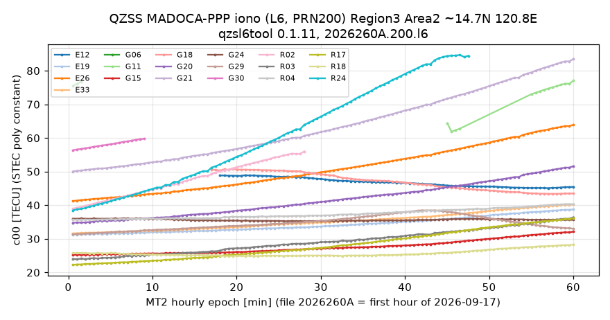

# qzsl6tool · QZSS L6（CLAS / MADOCA-PPP）等 GNSS 电文解码操作手册

目录：[`PROJECTS.json` → `qzsl6tool`](../../PROJECTS.json) · 上游 <https://github.com/yoronneko/qzsl6tool> · PyPI **`qzsl6tool` 0.1.11**（2026-09-15）· tip **`60a5b93`** · 许可 **BSD-2-Clause** · ★**35** · 纯 Python（≥3.10），依赖 `bitstring` / `galois` / `numpy` · 本机验证：Python **3.11.16** venv；上游 `test/do_test.sh` **47 Passed / 0 Failed**；官方归档 **2026-09-17** CLAS 前 300 s + MADOCA-PPP 电离层 1 h 真解码 · 2026-09-26 01:37–01:46 EDT

> 岗位：**看电文，不定位**。把接收机原始流里的 QZSS L6（以及 Galileo E6B HAS、北斗 B2b、QZSS L1S/SBAS、RTCM）抽出来、逐帧逐子类型打印成人能读的文本，或把 CLAS/MADOCA 转成 RTCM 喂给别的软件。要用这些改正数**解算坐标** → [claslib](./claslib.md)（CLAS）/ [madocalib](./madocalib.md)（MADOCA-PPP）/ [cssrlib](./cssrlib.md)（Python PPP-RTK）/ [haslib](./haslib.md)（Galileo HAS）。参数冲突时：**本机 `-h` / 上游 `docs/en/*.md` > 本文**。

---

## 1. 它解决什么问题

你手里有一段 L6 归档或接收机 log，想知道：里面到底播了哪些卫星、哪些信号的改正？STEC 多大？某秒是不是丢帧、重复帧？CLASLIB/MADOCALIB 只给最终坐标，出问题时看不到中间电文。qzsl6tool 就是这层“示波器”：`stdin → stdout` 的一组小脚本，可用管道串 `nc`、RTKLIB `str2str`。

| 术语 | 一句话 |
| --- | --- |
| **L6** | QZSS 1278.75 MHz 频点，专播增强电文；每帧 **250 字节 / 1 秒**（2000 bit，含 RS 校验） |
| **L6D / L6E** | L6 的两路信号：**L6D** 播 CLAS，**L6E** 播 MADOCA-PPP |
| **CLAS** | Centimeter Level Augmentation Service，日本国内厘米级 **PPP-RTK**；播轨道、钟差、码/相位偏差、**区域网格的对流层与 STEC** |
| **MADOCA-PPP** | 广域 PPP 改正（轨道/钟差/偏差），另有 **电离层增强电文**（本工具显示为 `MADOCA-PPP (Iono)`，Region/Area 内 STEC 多项式） |
| **CSSR** | Compact SSR：把 SSR 改正按“子类型 ST1…ST12”紧凑编码，RTCM 私有号 **4073** 承载 |
| **subframe（SF）/ data part（DP）** | CLAS 以 **5 帧 = 1 个 subframe（5 s）** 组织；每帧是一个 data part。子类型可跨 DP 续写（行尾 `...`） |
| **ST1 / ST2 / ST3 / ST4 / ST5 / ST6 / ST7 / ST8·ST9·ST12 / ST11** | 掩码（哪些星哪些信号）/ 轨道 / 钟差 / 码偏差 / 相位偏差 / 网络码+相位偏差 / URA / **大气（ST8 STEC 多项式、ST9 网格对流层+STEC 残差、ST12 二者合一）** / 网络轨钟组合 |
| **NID** | CLAS 网络号（全日本分若干网络，如 `NID=12 (OGASAWARA)`） |
| **TECU** | 10¹⁶ e⁻/m²；L1 上 1 TECU ≈ 0.162 m 群延迟 |

## 2. 安装（2 分钟）

```bash
python3 -m venv ~/venv/qzl6 && . ~/venv/qzl6/bin/activate
pip install qzsl6tool==0.1.11          # 装的是 qzsl6read.py / alstread.py 等 16 个脚本进 PATH
qzsl6read.py -h | head -3              # 应显示 "QZS L6 Tool ver.0.1.11"
git clone --depth 1 https://github.com/yoronneko/qzsl6tool   # 只为拿 sample/ 与 test/
```

**脚本分两层**（先抽、后解）：

| 层 | 脚本 | 输入 → 输出 |
| --- | --- | --- |
| 接收机抽取 | `alstread.py`（Allystar HD9310）、`septread.py`（Septentrio SBF）、`novread.py`（NovAtel）、`ubxread.py`（u-blox）、`psdrread.py`（PocketSDR log） | 专有二进制 → `-l` L6 / `-e` E6B / `-b` B2b / `--l1s` 等纯载荷流 |
| 电文解码 | `qzsl6read.py`（L6）、`gale6read.py`（E6B HAS）、`bdsb2read.py`（B2b）、`qzsl1sread.py`（L1S/SBAS）、`galinavread.py`、`rtcmread.py` | 载荷流 → 文本；`-r` → RTCM |
| 转换 | `l6rtcm4050.py` | L6 → RTCM 4050（Magellan 私有封装整帧） |
| 小工具 | `gps2utc.py` `utc2gps.py` `ecef2llh.py` `llh2ecef.py` | 时间/坐标换算 |

## 3. 端到端实跑（本机真实输出）

### 3.1 冒烟：上游回归测试

```bash
cd qzsl6tool/test && sed -i 's/|lv$/| head -40/' do_test.sh   # 原脚本失败时调用 lv 分页器，本机没有
./do_test.sh | grep -c Passed; ./do_test.sh | grep -c Failed
```

```text
47
0
```

### 3.2 官方归档 CLAS：下载 → 逐帧 → 统计

归档是按天/小时的 `.l6` 纯帧文件，**无需账号**。用 HTTP Range 只取前 300 帧（300 × 250 B）：

```bash
curl -fsS -r 0-74999 -o 2026260A_300s.l6 https://sys.qzss.go.jp/archives/l6/2026/2026260A.l6
qzsl6read.py < 2026260A_300s.l6 | head -6
```

```text
195 Kobe:0         CLAS  SF1 DP1 P1: ST1 ST3 ST2 ST4...
195 Kobe:0         CLAS  SF1 DP2 P1: ST4 ST7 ST11 ST6 ST12...
195 Kobe:0         CLAS  SF1 DP3 P1: ST12 ST6 ST12...
195 Kobe:0         CLAS  SF1 DP4 P1: ST12
195 Kobe:0         CLAS  SF1 DP5 P1: (null)
195 Kobe:0         CLAS  SF2 DP1 P1: ST3 ST11 ST6 ST12...
```

```bash
qzsl6read.py < 2026260A_300s.l6 | awk '{print $1,$2,$3}' | sort | uniq -c
qzsl6read.py -s < 2026260A_300s.l6 | grep stat | tail -1
```

```text
    300 195 Kobe:0 CLAS
stat n_sat 18 n_sig 54 bit_sat 25988 bit_sig 10334 bit_other 3515 bit_null 0 bit_total 39837
```

300 帧 = 300 行、全部来自 PRN 195、神户（Kobe）主控站。`-s` 统计：这一轮掩码覆盖 18 颗星 54 个信号。

**看细节（`-t 1`）——电离层研究者最关心 ST12 的 STEC：**

```bash
qzsl6read.py -t 1 < 2026260A_300s.l6 > clas_t1.txt
grep -m1 -A14 '^ST12' clas_t1.txt
```

```text
ST12 Trop NID=12 (OGASAWARA) qual=0.25[mm] t00=0.104[m] offset=0.280[m]
ST12 Trop  Lat.   Lon. residual[m]
ST12 Trop 27.07 142.20       0.000
ST12 Trop 26.64 142.16       0.000
ST12 STEC G05  Lat.   Lon. residual[TECU] qual=21.500[TECU] c00=23.150[TECU]
ST12 STEC G05 27.07 142.20          -0.28
ST12 STEC G05 26.64 142.16           0.28
ST12 STEC G06  Lat.   Lon. residual[TECU] qual=66.500[TECU] c00=111.200[TECU]
ST12 STEC G06 27.07 142.20           0.28
ST12 STEC G06 26.64 142.16          -0.24
ST12 STEC G11  Lat.   Lon. residual[TECU] qual=1.750[TECU] c00=35.900[TECU]
ST12 STEC G11 27.07 142.20          -0.08
ST12 STEC G11 26.64 142.16           0.08
ST12 STEC G15  Lat.   Lon. residual[TECU] qual=1.750[TECU] c00=34.400[TECU]
ST12 STEC G15 27.07 142.20          -0.24
```

`-t 1` 输出 300 s 里各子类型行数（`awk '{print $1}' | sort | uniq -c`）：ST12 **34386**、ST6 5372、ST11 1128、ST3 1125、ST4 554、ST2 191、ST7 186、ST1 181。

### 3.3 官方归档 MADOCA-PPP 电离层：1 小时 → 区域 STEC → 画图

```bash
curl -fsS -o 2026260A.200.l6 https://l6msg.go.gnss.go.jp/archives/2026/260/2026260A.200.l6   # 900000 B = 3600 帧
qzsl6read.py < 2026260A.200.l6 | awk '{print $1,$2,$3,$4}' | sort | uniq -c
qzsl6read.py -t 1 < 2026260A.200.l6 > mdc_t1.txt
grep -m1 -A6 'Region=3' mdc_t1.txt
```

```text
   3600 200 Hitachi-Ota:0 MADOCA-PPP (Iono)
MT1 Epoch=00:00:32+4 UI=30s(5) MMI=0 IODSSR=2 Region=3  3085bit  NumAreas=5
 # shape lat[deg] lon[deg] lats lons / radius[km]
 1 RECT      17.4    121.4  1.3  1.1
 2 RECT      14.7    120.8  1.4  1.0
 3 RECT      12.0    123.8  2.4  2.0
 4 RECT       7.6    124.2  2.0  2.4
 5 RECT      10.8    119.5  2.5  2.3
```

同文件里 MT1 还宣布了 Region=1（澳大利亚西/南部，`-34.0 132.5` 等 3 个 Area）与 Region=4（`-6.8 107.0`，爪哇，`IODSSR=0`、G/R/E 均 0 颗）。Region=3 就是**菲律宾**——赤道异常北峰附近。取 Area 2（≈14.7°N 120.8°E）的 MT2：

```text
MT2 Epoch=00:00:30 IODSSR=2 Region=1 Area=5 G=4 R=0 E=3 C=0 J=0
SAT  qual[mm] c00[TECU] c01[TECU/deg] c10[TECU/deg] c11[TECU/deg^2]
G12      8.00     40.80          1.20          0.04            0.16
G19      8.00     42.65          1.50         -0.16            0.10
G22     26.00     68.75          2.06         -0.92            0.02
```

（上面是 `grep -m1 -A4 '^MT2' mdc_t1.txt` 的第一块，属 Region=1；Region=3 Area=2 结构相同，每 30 s 一块，1 h 共 120 块。）

把 Region=3 Area=2 各星 `c00` 随时间画出（解析脚本 ~30 行：匹配 `MT2 … Region=3 Area=2` 后读 `[GREJC]nn` 行第 3 列；注意坑 9 跨小时回绕）：



本机统计（每星点数 / c00 最小 / 最大，TECU）：R24 95 / 38.45 / 84.70，G21 120 / 50.05 / 83.55，E26 120 / 41.25 / 63.95，G15 120 / 25.25 / 32.15，R18 120 / 24.90 / 28.35。多数星 c00 随时间上升（当地 UTC+8 08–09 时，日出后电离层增长期），少数下降（G18 约 50→43、E12 约 49→45，斜路径几何在变）；本页未解算仰角，不对单星高低做归因。G11 在 ~45–57 min 有空缺（图中直线连过去的那段）。

### 3.4 接收机 log → L6 → 文本 / RTCM（仓内样例）

```bash
cd qzsl6tool/sample
alstread.py -l < 20220326-231200clas.alst > clas.l6          # Allystar → 纯 L6
qzsl6read.py < clas.l6 | awk '{print $1,$2}' | sort | uniq -c
qzsl6read.py -r < clas.l6 > clas.rtcm && rtcmread.py < clas.rtcm | head -3
```

```text
      1 194 Hitachi-Ota:1
      2 196 Hitachi-Ota:1
     56 199 Hitachi-Ota:1
RTCM 4073   CSSR          ST1  Epoch=23:12:30+6 (601950) UI=30s (5) IODSSR=0 
RTCM 4073   CSSR          ST3  Epoch=12:30 (750) UI= 5s (2) IODSSR=0
RTCM 4073   CSSR          ST2  Epoch=12:30 (750) UI=30s (5) IODSSR=0
```

`alstread.py` 按 C/N0 在多颗 QZS 间挑最强者，所以 PRN 会跳（199 为主，偶尔 194/196）。开头 **14** 行 `(syncing)`：要等到一个 subframe 起点才能开始解。`clas.rtcm` **7915 B**、62 条 RTCM 4073。

官方归档同理：`qzsl6read.py -r < 2026260A_300s.l6 | rtcmread.py` 按子类型计数 ST12 120、ST6 120、ST3 60、ST11 60、ST1/ST2/ST4/ST7 各 10；`l6rtcm4050.py < 2026260A_300s.l6` 得 **67500 B**、300 条 `4050 Raw`（每帧整包封装，不解 CSSR）。

同一套管道还能解 Galileo HAS / 北斗 B2b（本机跑过）：

```bash
novread.py -e < 20230819-053733has.nov | gale6read.py | head -2
```

```text
E03 HASS=Operational(1) MT=1 MID=13 MS=11 PID= 37 -> A new page for MID=13
E09 Dummy page (0xaf3bc3)
```

## 4. 参数速查

| 脚本 | 参数 | 作用 |
| --- | --- | --- |
| `qzsl6read.py` | `-t 1` / `-t 2` | 子类型明细 / 再加比特图（排查解码错） |
| | `-s` | 结束时打印 CSSR 容量统计 `stat …` |
| | `-r` | stdout 改为 **RTCM 二进制**（同时关闭显示，`-m` 可把显示送 stderr） |
| | `-P {1,2}` | CLAS 发送模式（Transmit Pattern），默认 1；另一模式的帧打印 `skipped` |
| | `-c` | 非终端也输出 ANSI 颜色 |
| `alstread.py` | `-l` / `-m` / `-p PRN` | 输出 L6 / 状态到 stderr / 只要某颗星（193–211） |
| `septread.py` | `-l` / `-e` / `-b` | SBF → L6 / E6B / B2b |
| `novread.py` | `-e` / `-q` | NovAtel → E6B / QZSS LNAV |
| `bdsb2read.py` | `-p PRN` | 选 B2b 卫星（测试用 `-p 60`） |
| `rtcmread.py` | `-t N` | RTCM 解码明细 |

### 4.1 主行字段（`qzsl6read.py` 默认输出）

| 字段 | 例 | 含义 |
| --- | --- | --- |
| 1 | `195` | 发射该帧的 QZS PRN |
| 2 | `Kobe:0` / `Hitachi-Ota:1` | 电文生成站（神户 / 常陆太田）: 发送系统号 |
| 3 | `CLAS` / `MADOCA-PPP` / `QZNMA` | 电文种类（QZNMA = 导航电文认证） |
| 4 | `SF1 DP2 P1:` | subframe 号、data part 号、发送模式 |
| 5… | `ST4 ST7 ST11 ST6 ST12...` | 本 DP 内出现的子类型；`...` = 续到下一 DP；`(null)` = 整个 DP 为空 |

### 4.2 `-s` 统计行

| 字段 | 含义 |
| --- | --- |
| `n_sat` / `n_sig` | 被增强的卫星数 / 信号数 |
| `bit_sat` / `bit_sig` / `bit_other` | 与卫星相关 / 与信号相关 / 其他 的信息比特数 |
| `bit_null` / `bit_total` | 空比特 / 总比特 —— 用来估 CLAS 信道容量占用 |

## 5. 怎么读结果

- **先看主行是否连续**：正常是 `SF1 DP1…DP5, SF2 DP1…` 递增。`(syncing)` 只应出现在开头；中途出现说明丢帧或切站。`(duplicate data part, skipped)` 是同一秒从两颗星收到同一 DP（0.1.10 起自动跳过）。
- **STEC 怎么用**：CLAS ST8/ST12 与 MADOCA MT2 给的是**每颗星的斜向 STEC 多项式**，`c00` 为网格/区域参考点常数项，`c01/c10/c11` 为随纬度、经度的梯度；ST12 还给逐网格点残差。它是**卫星+路径相关**的改正量，不是垂直 TEC，也不是绝对校准 TEC——做 VTEC/ROTI 请回到 RINEX → [gnss-tec](./gnss-tec.md) / [pytecgg](./pytecgg.md) / [oasis-roti](./oasis-roti.md)。
- **`qual`** 是质量指示（越小越好）；单位按工具原样打印（CLAS 行为 TECU，MADOCA MT2 表头印 `[mm]`），比较时别跨电文混用。
- **ST11 `NID=1 (ISHIGAKI)`** 等：网络号 → 地理区域；你所在网络的行才对你有用。
- **RTCM 4073 / 4050**：4073 是 CSSR 原子类型逐条；4050 是整帧封装，给只认 4050 的接收机/软件（如部分 RTKLIB 分支）用。

## 6. 坑（现象 → 原因 → 修复）

1. **系统 Python 直接跑报红字 `This code needs bitstring module.`** → 仓内脚本不自带依赖 → `python3 -m venv ~/venv/qzl6 && . ~/venv/qzl6/bin/activate && pip install qzsl6tool==0.1.11`
2. **把 `.alst` 直接喂 `qzsl6read.py`，输出 480 行、PRN 乱跳、大量 `(duplicate data part, skipped)`**（本机实测 1 分钟样例）→ 解码器在专有 log 里“捡到”多星的 L6 前导码，未做选星 → `alstread.py -l < x.alst | qzsl6read.py`
3. **E6B（HAS）流喂 `qzsl6read.py`，0 行输出、无报错** → L6 解码器找不到 L6 前导码，静默 → `novread.py -e < x.nov | gale6read.py`（B2b 用 `septread.py -b | bdsb2read.py`）
4. **`-P 2` 后 300 行全是 `(Pattern 1, skipped)`** → 数据只有发送模式 1 → 去掉 `-P` 或 `qzsl6read.py -P 1 < x.l6`
5. **截取片段后前几行全 `(syncing)`，甚至无内容** → 从帧中间切（字节数非 250 倍数）或没从 subframe 头开始 → `dd if=day.l6 of=cut.l6 bs=250 count=300`（或 `curl -r 0-$((250*N-1))`）
6. **`-r` 后终端满屏乱码** → `-r` 输出 RTCM 二进制 → `qzsl6read.py -r < x.l6 > x.rtcm && rtcmread.py < x.rtcm | head`
7. **MADOCA 电离层文件默认输出 3600 行全是 `(Iono) (null)`**，以为没数据 → 默认级别只显示 L6 头；MT1/MT2 内容在明细级 → `qzsl6read.py -t 1 < 2026260A.200.l6 | grep -A12 '^MT2' | head`
8. **下载的 `.l6` 解出 0 行** → URL 不存在时服务器回 403 + HTML 页（本机实测 DOY 300 未来日期）且 curl 默认照存 → `curl -fsS -o x.l6 URL || echo 'no such file'`
9. **画 1 h MT2 时间序列出现水平长线** → MT2 历元是“小时内秒”，文件末块已是下一小时 `Epoch=00:00:02` → 解析时若 `t < 上一点 - 30 min` 则 `t += 60 min`（本页图已处理）
10. **`do_test.sh` 失败时卡住/报 `lv: command not found`** → 失败分支调 `lv` 分页器 → `sed -i 's/|lv$/| head -40/' test/do_test.sh`

## 7. 与相邻工具

| 需求 | 去哪 |
| --- | --- |
| CLAS 改正 → 定位（PPP-RTK/VRS） | [claslib](./claslib.md) |
| MADOCA-PPP → PPP / PPP-AR | [madocalib](./madocalib.md) |
| Python 里解 CSSR 并做 PPP-RTK | [cssrlib](./cssrlib.md) |
| Galileo HAS 解码成 SSR/RTCM | [haslib](./haslib.md) |
| 北斗 PPP-B2b | [b2blib](./b2blib.md) / [navdecoder](./navdecoder.md) |
| L6 由软件接收机抓 | [pocketsdr](./pocketsdr.md)（仓内 `.psdr` 样例即出自它） |
| 通用 RTCM3 Python 编解码 | [pyrtcm](./pyrtcm.md)；SBF → [pysbf2](./pysbf2.md)；UBX → [pyubx2](./pyubx2.md) |
| 电离层改正如何进定位 | 课 [06-iono-positioning](../tutorials/06-iono-positioning.md)；赤道异常背景 [21-equatorial-anomaly-bubbles](../tutorials/21-equatorial-anomaly-bubbles.md) |

## 8. 诚实边界

- 本机**无 L6 接收机**：未跑 `str2str … | alstread.py -l` 实时管道，只跑归档与仓内样例。
- 只验证了 CLAS（ST1–ST12）、MADOCA-PPP 电离层（MT1/MT2）、HAS 首页、RTCM 往返；MADOCA-PPP 轨钟 L6E、QZNMA、L1S/SBAS/DCX 仅通过上游回归测试（47 项）间接覆盖，未逐字段核对 ICD。
- 输出格式随版本变（0.1.8 起主行加 `P1:`），脚本解析请锁版本。
- 显示的物理量是**播发值**，本工具不做正确性校验；图中 c00 曲线只说明“电文里播了什么”，不作为电离层科学产品。
