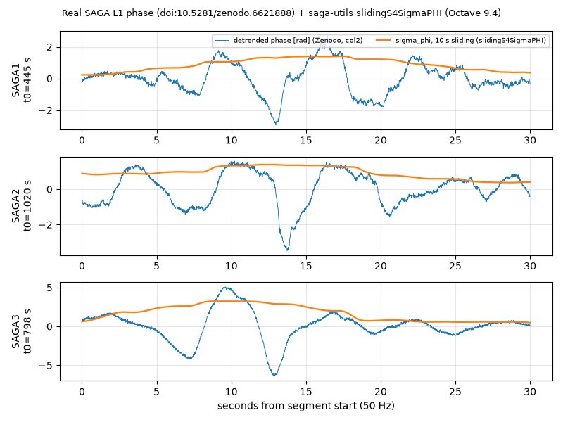

# saga-utils · SAGA 阵列 / CASES 高采样率闪烁数据（S4、σφ、漂移）操作手册

目录：[`PROJECTS.json` → `saga-utils`](../../PROJECTS.json) · 上游 <https://github.com/perrysou/saga-utils> · tip **`94c7cdd`**（2018-08-21，全仓仅 **1** 个 commit，无 tag / 无发行版）· 许可 **GPL-3.0** · ★**10** · MATLAB（顶层 **76** 个 `.m`，含 `include/` 共 **274** 个 `.m/.M`）· 本机验证：GNU Octave **9.4.0**（无 MATLAB）；`main.m` 真跑到“找不到数据”为止；上游滤波与 `slidingS4SigmaPHI` 在**合成**数据（已知真值）与 **Zenodo 公开 SAGA 相位**上实跑 · 2026-09-26 01:40–01:50 EDT

> 岗位：**研究组内部流水线的源码参考**，不是开箱即用工具。它假设你有伊利诺伊理工（IIT）服务器上的 CASES 原始 `.bin` 目录树和一个不在仓里的解包脚本。能直接复用的是几块**算法函数**：去趋势滤波、滑窗 S4/σφ、空间接收机漂移估计。要从 RINEX 1 Hz 数据做 ROTI → [oasis-roti](./oasis-roti.md)；要合成闪烁信号 → [iono-scintillation](./iono-scintillation.md)；要下载 ISMR 闪烁指数 → [ismr-downloader](./ismr-downloader.md)。

---

## 1. 它是什么、解决什么

**SAGA**（Scintillation Auroral GPS Array）：2013 年底起部署在阿拉斯加 Poker Flat 的 6 台 + ASTRA 1 台 **CASES** 软件接收机，基线 200 m–3.1 km，用于看极光带 L 波段闪烁的**空间–时间结构**（First light 论文，GRL 2015，见 PMC4681424）。每台输出三类数据：100 s 闪烁指数、1 Hz 低速观测、高速（论文写 100 Hz；本仓滤波代码写死 `fsamp = 50`）I/Q 与载波相位。

saga-utils 是这套数据的处理链（作者 Yang Su / IIT，内含 Virginia Tech K. Deshpande 的 CASES 后处理代码）：

| 概念 | 一句话 | 代码里 |
| --- | --- | --- |
| **S4** | 幅度闪烁指数：信号强度 I 的归一化标准差 `std(I)/mean(I)` | `slidingS4SigmaPHI.m`（**注意坑 1：它算的是幅度版，≈ S4/2**） |
| **σφ（sigma_phi）** | 相位闪烁指数：去趋势后载波相位的标准差 [rad] | 同上，`std(PHin)` |
| **去趋势（detrending）** | 去掉卫星运动/钟差造成的慢变化，只留电离层引起的快起伏 | 相位：FFT 域 6 阶 Butterworth **高通 0.1 Hz**（`AJbutter.m` 的 `1 - 低通核`）；功率：6 阶 IIR **低通 0.1 Hz**（段长 ≤60 s 用 0.2 Hz）后 `P ./ LP`（`butterworth_discrete.m`）；两端各丢 **10 s** |
| **高速 I/Q、相位** | I、Q 为相关器累加值；功率 `I²+Q²`、IQ 相位 `atan2(Q,I)` | `Fn_ReadHighRate_CASESdata_sdb.m` |
| **参考通道差分** | 闪烁星相位减去同时段不闪烁的参考星相位，抵消接收机钟相位噪声 | 同上，按 `scint.log` 第 13 列（0=闪烁，1/2=参考）切段 |
| **τ0 / SPR** | 去相关时间 / 窄带功率比（CASES 触发高速记录用） | `scint.log` 第 11、12 列 |
| **漂移估计** | 多站互相关 → 相关椭圆 → 电离层不规则体水平漂移速度、轴比、方向（spaced-receiver / FCA） | `estimate_SAGA.m`、`drvel.m` |

## 2. 仓里有什么（按用途）

| 用途 | 文件 |
| --- | --- |
| 总入口（逐日批处理） | `main.m(yearin, doyin, lronlyflag[, prnlist, init_time, xtime])`：先低速→叠图→阈值（σφ 固定 0.6 rad / 当日均值，S4 固定 0.4）→挑事件→高速放大图 |
| 低速读数 | `scint_el_stackplot.m` → `read_data.m`（`scint*.log`、`txinfo*.log`）、`read_navsol.m`、`read_iono.m`、`read_channel.m` |
| 高速画图 | `zoomin_hrplot_iq_carrier.m` → `hrplot_iq_carrier.m`（读已处理的 `.mat`，出“Detrended Power / Phase”图） |
| CASES 后处理（VT） | `include/CASES_DataProcessingSoftware/`：`Fn_ReadHighRate_*`、`Fn_Plot_HighRate_*`（各 ~2.8k 行）、`AJbutter.m`、`butterworth_discrete.m`、`slidingS4SigmaPHI.m` |
| 漂移 / 理论 | `estimate_SAGA.m`、`drvel.m`、`Lz.m`（Rytov 近似）、`rytov.m`、`noise_simulation.m`（噪声对 τa/τc 估计的影响） |
| 对照 | `dlPFISR.m`、`plotPFISR*.m`（Poker Flat 非相干散射雷达）、`getTEC.m`/`getStec.m`/`getRinex.m`（双频 TEC） |
| 第三方工具箱 | `include/navutils_for_mmae552`、`time_conversion`、`tight_subplot`、`tightfig` |

### 2.1 代码读取的日志列（从源码反推，列义以 CASES 官方 `scintdef`/`iqdef` 文档为准）

| 文件 | 列 | 代码用作 |
| --- | --- | --- |
| `scint*.log` | 1 / 2 / 3 | GPS 周 / 周内整秒 / 小数秒 |
| | 5 | S4（接收机算）；第 5–10 列须 > −1，第 8–10 列须 < 10 才保留 |
| | 8 | σφ（接收机算） |
| | 11 / 12 | τ0 / SPR（须 > −80） |
| | 13 / 14 / 15 | 通道类型（0 闪烁，1/2 参考）/ 信号类型（0=L1CA，2=L2CL…）/ PRN |
| `iq*.log` | 3 / 4 / 5 | 周（须 < 2000）/ 秒 / 小数秒 |
| | 6 / 7 / 8 | 载波相位 [cycle] / I / Q |
| | 10 / 11 | 信号类型 / PRN |
| `txinfo*.log` | 4 / 5 / 8 | 方位 / 仰角（>30° 进掩膜）/ PRN |

期望目录：`cases_folder/<年>/<年积日>/grid108/{bin/*YYYY_DDD_*.bin, txt/scint*YYYY_DDD_*.log …}`；`.bin → .log` 靠 `/data1/home/ysu27/unpack_v1.sh`（**仓内没有**；解包程序 `binflate` 见 VT 的 CASES_Post_Processing_Software 仓）。

## 3. 安装

```bash
git clone --depth 1 https://github.com/perrysou/saga-utils
sudo apt-get install -y octave          # 无 MATLAB 时；本机 9.4.0
# MATLAB 用户：addpath(genpath('saga-utils'))；Octave 用户还需下面两个垫片（见坑 3）
mkdir -p saga-shim
echo "function init(); disp('init stub (Octave)'); end" > saga-shim/init.m
cat > saga-shim/ver_chk.m <<'M'
function [prop, out_path, in_path] = ver_chk()
global home_dir mat_dir sep;
prop = 'limits'; out_path = [home_dir, sep, mat_dir, sep]; in_path = out_path;
end
M
```

## 4. 实跑

### 4.1 总入口 `main.m`（真实输出：一路跑到“没有数据”）

```bash
HOME=/tmp/sagahome octave-cli -q --eval "addpath(genpath('saga-utils')); addpath('saga-shim'); main(2015,76,1)" < /dev/null
```

```text
warning: function /tmp/saga-utils/statistics.m shadows a core library function
init stub (Octave)
year = 2015
doy = 076
…（matfile / flag3 / flag4 等空 struct 打印省略）
dir: cannot access '/data1/public/Data/cases/pfrr/2015/076/grid*': No such file or directory
No receiver structure for doy 076
…
rcvr_struct = ASTRArx
rcvr_name = ASTRArx
offsett_str = 03/16/2015 23:00:00
Unable to find any binaries for ASTRArx on the server, please download manually
…
op_path = /tmp/sagahome//matfiles//ASTRArx/2015/076/
Unable to continue w/o any logfile of any receiver for doy 076.  Now exiting...
No data for this day, exiting....
ans = 1
```

结果：只生成空的 `$HOME/matfiles/ScintillationEvents_short_2015.csv`。2015-076（3 月 17 日圣帕特里克日磁暴）是代码里写死的特例日之一。**SAGA 原始数据门户 `http://apollo.tbc.iit.edu/~spaceweather/live/?q=SAGA` 本机 20 s 连接超时**，未取得任何 `.bin/.log`。

### 4.2 合成数据验证上游算法（**SYNTHETIC，非观测**）

构造 50 Hz、300 s 信号：功率 = 慢趋势 ×(1+δA)²，相位 = 二次慢趋势 + δφ；δA、δφ 为 0.2–5 Hz 带限高斯噪声，std 分别 0.15 与 0.50 rad。然后**原样调用**上游 `AJbutter`（相位高通）、`butterworth_discrete`（功率低通归一）、`slidingS4SigmaPHI`（60 s 窗），常数照抄 `Fn_Plot_HighRate_CASESdata_v1.m`：

```matlab
addpath('saga-utils/include/CASES_DataProcessingSoftware'); randn('state',42);
fs=50; T=300; t=(0:1/fs:T-1/fs)'; L=numel(t); f=(-L/2:L/2-1)'*(fs/L);
mk=@(x) real(ifft(ifftshift(fftshift(fft(x)).*(abs(f)>0.2 & abs(f)<5))));
na=mk(randn(L,1)); na=na/std(na); np=mk(randn(L,1)); np=np/std(np);
dA=0.15*na; dphi=0.50*np;
P=1e4*(1+0.3*t/T).*(1+dA).^2;  PH=40*(t/T).^2+3*t/T+dphi;
bl=AJbutter(L,0.1,6,1/(t(end)-t(1)));
ph_f=real(fftshift(ifft(ifftshift(fftshift(fft(ifftshift(PH))).*(1-bl)'))));
lp=butterworth_discrete(P',fs,0.1,6,'lp'); P_f=(P'./lp(1:L))';
e=10*fs; ph_f=ph_f(e+1:end-e); P_f=P_f(e+1:end-e); dphi_c=dphi(e+1:end-e); dA_c=dA(e+1:end-e);
FL=floor(60/(T-20)*numel(P_f)); [S4,SPH]=slidingS4SigmaPHI(P_f,ph_f,FL);
% 之后 printf 真值与估计值（完整脚本 ~35 行）
```

```text
samples after edge cut : 14000 (280 s @ 50 Hz), FL=3000
truth  sigma_phi (std of injected dphi)        : 0.5003 rad
saga   sigma_phi median (slidingS4SigmaPHI)    : 0.5027 rad
truth  S4 = std(I)/mean(I), I=(1+dA)^2          : 0.2932
truth  std(A)/mean(A)                           : 0.1494
saga   "S4" median (slidingS4SigmaPHI)          : 0.1487
standard S4 on same detrended power (60 s win)  : 0.2922
residual phase trend check: corr(ph_f, dphi)    : 0.9848
fix: movvar/movmean standard S4 median          : 0.2931
```

读法：**σφ 链路正确**（0.5027 vs 真值 0.5003；高通后相位与注入扰动相关 0.985，40 rad 的二次趋势被干净去掉）。**“S4” 只有 0.1487，等于 std(A)/mean(A)，约为标准强度 S4（0.2932）的一半**——见坑 1。

### 4.3 真实 SAGA 相位（Zenodo 公开，已去趋势）

公开可下的 SAGA 观测只找到论文配套数据 **doi:10.5281/zenodo.6621888**（284674 B zip，许可 `other-open`，无账号）：3 台接收机各一段 30 s、50 Hz 相位。`SAGA*_Hyb.mat` 与 `SAGA*_Shk.mat` 的第 1、2 列逐位相同、第 3 列不同 → 本文**推断**第 2 列为观测相位、第 3 列为两种谱模型的仿真（Zenodo 无说明，出处论文 Sensors 2023, 23, 2477 称其已按 0.1 Hz 高通去趋势）。

```bash
curl -sSL -o z.zip "https://zenodo.org/records/6621888/files/VAGGUP/SAGA_Paper1-datav2.zip?download=1" && unzip -q z.zip
octave-cli -q real_phase.m     # 对第 2 列调 slidingS4SigmaPHI（功率置 1），30 s 整窗 + 10 s 滑窗
```

```text
SAGA1 t=445-475 s  n=1501 fs=50Hz  sigma_phi(30s)=0.9640 rad  sigma_phi(10s) min/med/max=0.2239/0.8870/1.4056  after extra 0.1Hz HP: 0.8336
SAGA2 t=1020-1050 s  n=1501 fs=50Hz  sigma_phi(30s)=1.0059 rad  sigma_phi(10s) min/med/max=0.3738/0.8827/1.3977  after extra 0.1Hz HP: 0.8725
SAGA3 t=798-828 s  n=1501 fs=50Hz  sigma_phi(30s)=1.9987 rad  sigma_phi(10s) min/med/max=0.4805/1.8024/3.2449  after extra 0.1Hz HP: 1.6340
```



读法：σφ ≈ 1–2 rad 属**强相位闪烁**（常用经验：>0.5 rad 已明显，本仓 `main.m` 固定阈值 0.6 rad）。图中相位有数秒尺度、峰峰值数 rad（SAGA3 约 −6…+5 rad）的“大摆”，对应极光带常见的**折射型**相位起伏；10 s 滑窗 σφ 在大摆处冲到 1.4 / 3.2 rad。再叠一次 0.1 Hz 高通后下降 13–18%：30 s 段内 0.1 Hz 以下仍有能量，**σφ 数值强烈依赖截止频率与窗长**，跨论文比较前先对齐这两个参数。本段无功率数据，S4 未算。

## 5. 参数速查（上游写死的常数）

| 常数 | 值 | 位置 | 改了会怎样 |
| --- | --- | --- | --- |
| 相位高通 `cutoff` / `order` | 0.1 Hz / 6 | `Fn_Plot_HighRate_CASESdata_v1.m` | 提高 → σφ 变小，折射成分被砍 |
| 相位采样 `fsamp` | 50 Hz（写死） | 同上 | 数据若 100 Hz，`AJbutter` 用的是 `dfreq=1/段长`，不受影响；但注释/图标题可能误导 |
| 功率低通 `fc` | 0.1 Hz（段长 ≤60 s 用 0.2） | 同上 | 影响 S4 基线 |
| 边缘丢弃 `edgeT` | 10 s | 同上 | 滤波器暖机段 |
| S4/σφ 窗 `Tfilt` | 60 s（段长 ≥60 s 才算） | 同上 | 窗短 → 指数更抖 |
| σφ 阈值 `sp_fixed` / S4 阈值 `s4_fixed` | 0.6 rad / 0.4 | `main.m` | 决定哪些时段被挑去做高速分析 |
| 仰角掩膜 | 30° | `read_data.m` | 低仰角多径被当闪烁 |

## 6. 坑（现象 → 原因 → 修复）

1. **高速“S4”比接收机 `scint.log` 的 S4 小一半左右** → `slidingS4SigmaPHI` 用 `amp=sqrt(Powin)` 算 `sqrt((mean(P)-mean(amp)^2)/mean(amp)^2)` = std(A)/mean(A)，不是强度 S4（4.2 节合成：0.1487 vs 0.2932）→ 自己算标准 S4：`S4 = sqrt(movvar(P_f, FL, 1) ./ movmean(P_f, FL).^2);`（本机 0.2931）
2. **`main` 一跑就打印 `dir: cannot access '/data1/public/Data/cases/pfrr/...'` 并退出** → 数据根目录、输出目录、解包脚本路径全写死在 IIT 服务器 → `sed -i "s#^cases_folder = .*#cases_folder = '/你的/cases/pfrr/';#" main.m`，并按 §2.1 目录树放好 `txt/*.log`
3. **Octave 下 `error: invalid default property specification`（`init.m` 第 6 行），垫掉后又 `verLessThan: package "matlab" is not installed`** → `init.m` 设 MATLAB 专有 `groot` 默认属性，`ver_chk.m` 调 `verLessThan('matlab',…)` → 按 §3 建 `saga-shim/{init,ver_chk}.m` 后 `addpath('saga-shim')`（放在仓路径之后，优先级更高）
4. **样例驱动 `Run_Read_Plot_HighRateCASESdata_routines_sdb` 报 `error: Unknown signal.`** → 它按 6 个参数 `(folder_path,signal_type,doy,tstart,tend,hour)` 调用，而文件里函数签名是 7 个参数 `(KK,op_path,cases_folder,rcvr_name,signal_type,tstart,tend)`，第 5 位收到了时间数组；另有函数名与文件名不一致警告 → 按真实签名直接调（`op_path` 下须先有 `read_data` 生成的 `prn_files_L1CA/scintdata.mat`）：`Fn_ReadHighRate_CASESdata_sdb(prn, op_path, cases_folder, 'grid108', 0, tstart, tend)`
5. **每次启动 `warning: function .../statistics.m shadows a core library function`，后续调 Octave/MATLAB 自带 `statistics` 行为异常** → 仓内同名脚本 → `git mv statistics.m saga_statistics.m`
6. **任意年份跑 DOY 051 或 280，指定的 PRN 被悄悄换成 29 或 3** → `main.m` 里 `switch doy` 写死了个案 PRN，且位于用户 `prnlist` 之后 → 删掉该 `switch doy … end` 块：`grep -n "case '051'" main.m` 定位后注释
7. **段短于 80 s 时高速图出来了但没有 S4/σφ 曲线** → 去掉两端各 10 s 后要求 `Tdata >= 60` 才调 `slidingS4SigmaPHI`，否则静默跳过 → 取段 ≥ 80 s，或把 `Tfilt` 改小
8. **批处理出错时 MATLAB 停在调试提示符不退出** → `main.m` 第 8 行 `dbstop if error;` → `sed -i 's/^dbstop if error;/% dbstop if error;/' main.m`
9. **macOS 上“昨天”的 DOY 为空** → `main.m` 用 GNU `date -u -d "a day ago"` → `brew install coreutils` 后把 `date` 换成 `gdate`，或显式传 `main(年, 年积日, 1)`

## 7. 与相邻工具 / 课程

| 需求 | 去哪 |
| --- | --- |
| S4/σφ/ROTI 概念、阈值、为什么要去趋势 | 课 [05-scintillation-roti](../tutorials/05-scintillation-roti.md)、[13-scintillation-modeling](../tutorials/13-scintillation-modeling.md) |
| 低纬（等离子体泡）场景 | 课 [21-equatorial-anomaly-bubbles](../tutorials/21-equatorial-anomaly-bubbles.md)；磁暴个例 [14-space-weather-case](../tutorials/14-space-weather-case.md) |
| 1 Hz RINEX → ROTI / ΔTEC | [oasis-roti](./oasis-roti.md)、[ionomoni](./ionomoni.md) |
| 合成已知 S4/τ0 的闪烁信号来测算法 | [iono-scintillation](./iono-scintillation.md) |
| 拿现成闪烁指数（ISMR） | [ismr-downloader](./ismr-downloader.md)；Septentrio SBF 里的闪烁块 → [sbfparser](./sbfparser.md) / [pysbf2](./pysbf2.md) |
| 软件接收机自己出 I/Q | [gnss-sdr](./gnss-sdr.md)、[pocketsdr](./pocketsdr.md) |

## 8. 诚实边界

- **没有跑通任何一天的 SAGA 原始数据**：门户超时，仓内无样例、无解包脚本；4.1 只证明入口在 Octave 下能走到数据读取层。
- 4.2 为**合成数据**（已标注），用来验证上游函数的数学行为，数值不代表任何真实电离层。
- 4.3 用的是论文作者**已处理**的 30 s 相位片段，只复用了 `slidingS4SigmaPHI`；参考通道差分、功率归一、漂移估计（`estimate_SAGA`/`drvel`）均未实跑。
- 本机无 MATLAB；`Fn_Plot_*` 的出图（LaTeX 解释器、`datetick`）未验证。仓库 2018 年后无更新，依赖原始格式须自行适配。
