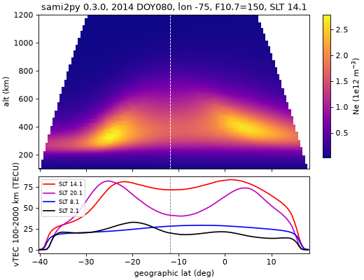

# sami2py · SAMI2 低纬电离层物理模式（Python 驱动）操作手册

目录：[`PROJECTS.json` → `sami2py`](../../PROJECTS.json) · 上游 <https://github.com/sami2py/sami2py>（NASA GSFC Jeff Klenzing 等；tag **v0.3.0** = main `c6d3c5b` 2022-11-03；`develop` 分支最后 `b796fae` 2023-06-27，未发版）· **不在 PyPI**（`pypi.org/pypi/sami2py/json` → 404），只能源码装 · 许可 **BSD-3-Clause**（`License.md`）· 本机验证 **2026-09-26 03:47–04:00 EDT**：gfortran 14.2.0，CPython 3.13.5 venv，numpy 2.5.3 / xarray 2026.7.0 / netCDF4 1.7.4 / scipy 1.18.1；上游 `pytest` **47 passed**。

> **质检复跑通过（有修正）**（2026-09-26 04:03–04:21 EDT）。
> - 环境：`git clone` 得 tag v0.3.0 = `c6d3c5b`，develop `b796fae`；gfortran 14.2.0；CPython 3.13.15 标准 venv 下 `pip install -e .` 用 20 s，`sami2py.x` 573360 B；numpy 2.5.3 / xarray 2026.7.0 / netCDF4 1.7.4 / scipy 1.18.1；`pytest` 47 passed。
> - 逐字复现：§3.1 运行（25 行 istep，最后为 `istep = 8486 … hour = 48.0017891`，IEEE 下溢提示）；归档文件逐个字节数一致（denif/tif/vsif 31178700、tef 4454100、glatf/glonf/zaltf 178164，合计 95 MB）；`version.txt` 为 v0.3.0 / c6d3c5b；§3.2 `print(M)` 全文、dims、glat/glon/zalt 范围、Ne 全局最大 3.368e12、磁赤道 −11.92°，以及四个 SLT 行逐位一致（SLT 14 赤道 71.4 TECU，双峰 +1.5° 83.6 / −21.5° 81.1）；坑 2（`GIT_DIR=/nonexistent` 下 2 h 探测跑 22 s 后 exit 128）、坑 3（day=81 时 FileNotFoundError）、坑 7（ion 维为 7）、坑 9（每帧 1.247 MB）复现。
> - 修正：`ut` 实际是 0.0025、1.0025 …，最后一帧 0.00167，原文 `2.000e-03 … 2.0000e-03` 的写法不对；§3.2 输出和坑 5 已按实测改（最后一帧回绕后排在第一帧之前，但并非同值）。墙钟本次 716.8 s（原 598.6 s，机器负载 9–12），§3.1 改为约 10–12 min。新增两条坑：用 `uv pip install -e .`（隔离构建）时 setup.py 把设置写进 `~/.sami2py/.tmpXXXX/`，import 时报找不到 `fortran_path.txt`，必须用标准 venv 的 `pip install -e .`；在克隆目录的**父目录**里运行脚本时，`import sami2py` 会解析成命名空间包（没有 `__version__`，`s_run.py` 首行就报 AttributeError），要换到别的目录运行。
> - 未完全复现：三行离子成分的取点方法原文没有给出；按「顶点最近磁力线 + SLT 14 帧」自取，量级一致（300 km O⁺ 0.995；600 km H⁺ 0.004 / O⁺ 0.989 / Te 1165 K；1500 km H⁺ 0.606 / O⁺ 0.258 / He⁺ 0.124），但不逐位相同。未复跑：坑 1、6、10，出图（未重画 PNG），傅里叶漂移和 `outn`。

> 岗位：用**物理方程**（不是经验拟合）算出一条磁子午面内、磁赤道两侧的电离层 Ne/Ti/Te/离子速度随时间演化，看**赤道喷泉 → 赤道异常（EIA）双峰**怎么长出来、F10.7/漂移/风改了之后怎么变。冲突时：本机 `sami2py/_core.py` docstring > readthedocs > 本文。

## 1. 它解决什么（术语先讲清）

IRI / PyIRI 这类经验模式告诉你“平均来说”电离层长什么样；SAMI2（NRL Huba 等 2000）是**第一性原理**模式：沿偶极磁力线解 7 种离子（H⁺ He⁺ N⁺ O⁺ N₂⁺ NO⁺ O₂⁺）的连续、动量、能量方程。sami2py 只是 Python 外壳：写 namelist → 调 Fortran 可执行 `sami2py.x` → 把输出归档 → 读成 xarray。

| 术语 / 输入 | 一句话 | 在 sami2py 里 |
| --- | --- | --- |
| **F10.7 / F10.7A** | 10.7 cm 太阳射电通量（SFU），当日值与 81 日均值；代表太阳 EUV 强弱 → 电离产率 | `f107`, `f107a`，喂 EUVAC 光电离与 MSIS |
| **EUVAC** | 由 F10.7 推太阳 EUV 光谱的经验模型 | 内置；`euv_scale` 倍乘 |
| **NRLMSISE-00（MSIS）** | 中性大气密度（O、N₂、O₂、H、He…）与温度模型；离子由中性成分电离、复合 | 内置；`o_scale`/`n2_scale`/`tinf_scale` 等倍乘 |
| **HWM（水平风模型）** | 中性风经验模型；经向风沿磁力线推/拉等离子体，造成南北不对称 | `hwm_model=14`（可 93/7）；`wind_scale` |
| **E×B 垂直漂移** | 赤道处东向电场 × 北向磁场 → 等离子体向上漂移（白天 ~20 m/s，日落前 PRE 增强） | `fejer=True` 用 Fejer–Scherliess 经验漂移；`False` 用 10×2 傅里叶系数 `exb_drifts`；`exb_scale` |
| **喷泉效应 → EIA** | 赤道等离子体被 E×B 抬高，再沿磁力线在重力/压力梯度下落到磁纬 ±10–20°，形成两个“峰”（crest），赤道反成“谷”（trough） | 看输出里 Ne/vTEC 随纬度的双峰 |
| **ap** | 3 小时地磁活动指数（整数） | `ap`；只进 MSIS/HWM，**不会**产生暴时穿透电场 |
| **磁子午面** | SAMI2 是 2-D：一个经度附近、沿偶极磁力线的面 | `lon`（和 `lat` 截距）选面；网格固定 101（沿线）× 98（磁力线条数） |

与 SAMI3 的关系：SAMI3 是同一团队的**三维**全球版本（加入经向/纬向输运，可与 WACCM-X 等耦合），[lstid-processing](./lstid-processing.md) 里处理的就是 NRL SAMI3 输出（74 GB 远程文件按 HTTP Range 抽子集）；SAMI3 不随 sami2py 发布，本机也跑不了。想在自己机器上**亲手**跑出低纬物理剖面，sami2py 是门槛最低的办法。

## 2. 安装（必须源码 + gfortran）

```bash
sudo apt-get install -y gfortran            # 本机已有 GNU Fortran 14.2.0
mkdir -p /workspace/scratch_x && cd /workspace/scratch_x
git clone https://github.com/sami2py/sami2py.git      # 必须 git clone，不能下 zip（坑 2）
python3 -m venv venv_s2 && . venv_s2/bin/activate
cd sami2py && pip install --no-cache-dir -e . matplotlib
ls -la sami2py/fortran/sami2py.x            # 本机 573360 B；setup.py 构建时自动 gfortran 编译
```

- `setup.py` 在 `~/.sami2py/<venv 目录名>/` 写 `fortran_path.txt`、`test_data_path.txt`；第一次 `import sami2py` 再写 `archive_path.txt`。**venv 目录名就是键**，两个同名 venv 会互相覆盖（坑 6）。
- 编译失败时手动：`make -C sami2py/fortran compile`。
- 装完约 17 s（编译 + 依赖）；上游测试：`python -m pytest -q sami2py/tests` → `47 passed, 38 warnings in 7.86s`（测试不跑 Fortran）。

## 3. 端到端：秘鲁扇区春分一模式日（本机真跑）

场景：2014 年第 80 天（春分，太阳活动高年），经度 −75°（Jicamarca 所在扇区），F10.7 = F10.7A = 150，ap = 4，Fejer–Scherliess 漂移 + HWM-14。前 24 h 是**预热**（让初始条件的瞬变散掉），只输出第 24–48 h，每小时一帧。

### 3.1 跑模式 `s_run.py`

```python
import time, sami2py
print("sami2py", sami2py.__version__, "fortran_dir", sami2py.fortran_dir)
sami2py.utils.set_archive_dir(path='/workspace/scratch_x/archive')   # 输出根目录
t = time.time()
sami2py.run_model(tag='eia', lon=-75.0, year=2014, day=80,
                  f107=150.0, f107a=150.0, ap=4,
                  hrinit=0.0, hrpr=24.0, hrmax=48.0, dthr=1.0,
                  fejer=True, hwm_model=14, clean=True)
print("wall_s", round(time.time() - t, 1))
```

`python -u s_run.py > s_run.log 2>&1` 的真实输出（节选，Fortran stdout 被重定向时是块缓冲，**跑完才一次性出现**）：

```text
sami2py 0.3.0 fortran_dir /workspace/scratch_pyrayhf_sami2py/sami2py/sami2py/fortran
Note: The following floating-point exceptions are signalling: IEEE_UNDERFLOW_FLAG IEEE_DENORMAL
  finished initialization
 no output yet -- hour =    1.00833333
 ...
 istep =         8186 ntm =           24 time step =    12.0000000      hour =    47.0017891
 istep =         8486 ntm =           25 time step =    30.0000000      hour =    48.0017891
wall_s 598.6
```

- 48 模式小时 = **598.6–716.8 s** 单核墙钟（两次实测，随机器负载变；Fortran 不并行）；只算 2 h 的探测跑约 18–22 s。
- 归档目录 `archive/eia/lon-75/2014_080/`：`denif.dat`/`tif.dat`/`vsif.dat` 各 31178700 B，`tef.dat` 4454100 B，`glatf/glonf/zaltf.dat` 各 178164 B，外加 namelist、`time.dat`、`version.txt`（`sami2py v0.3.0` / `short hash c6d3c5b`）；合计 **95 MB**（25 帧文本格式）。

### 3.2 读回 + 求 Ne、vTEC、EIA 峰 `s_load.py`（核心部分）

```python
import numpy as np, sami2py
from scipy.interpolate import griddata
sami2py.utils.set_archive_dir(path='/workspace/scratch_x/archive')
M = sami2py.Model(tag='eia', lon=-75.0, year=2014, day=80)   # 四个键必须与 run_model 一致
print(M)
ds = M.data                                    # xarray.Dataset
ne = ds.deni.sum("ion") * 1e6                  # 各离子相加，N/cc → m^-3（准中性 Ne≈ΣNi）
glat, zalt = ds.glat.values, ds.zalt.values    # (101, 98) 场向网格
lat_eq = float(glat[50, :].mean())             # 每条磁力线顶点（z 下标 50）= 磁赤道
lat_g = np.arange(-40, 18.01, 0.5); alt_g = np.arange(100, 2001, 10.0)
LA, AL = np.meshgrid(lat_g, alt_g)
for target in (2.0, 8.0, 14.0, 20.0):          # 按太阳地方时 SLT 取帧
    k = int(np.argmin(np.abs(((ds.slt.values - target + 12) % 24) - 12)))
    grid = griddata((glat.ravel(), zalt.ravel()), ne.isel(ut=k).values.ravel(), (LA, AL))
    vtec = np.nansum(grid, axis=0) * 10e3 / 1e16   # 100–2000 km 竖直积分 → TECU
    # …在 lat_eq±3° 以外南北各找 vTEC 最大值作为 crest
```

真实输出：

```text
Model Run Name = eia
Day 080, 2014
Longitude = -75.0 deg
25 time steps from  0.0 to 23.0 UT
Ions Used: H+, O+, NO+, O2+, He+, N2+

Solar Activity
--------------
F10.7: 150.0 sfu
F10.7A: 150.0 sfu
ap: 4

Component Models Used
---------------------
Neutral Atmosphere: NRLMSISe-2000
Winds: HWM-14
Photoproduction: EUVAC
ExB Drifts: Fejer-Scherliess

No modifications to empirical models
dims: {'z': 101, 'f': 98, 'ion': 7, 'ut': 25}
glat range -40.15..17.94  glon range 280.45..286.06  zalt range 85.0..2000.0 km
ut: [0.0025 1.0025 2.0025] ... [2.30016667e+01 1.66666667e-03]
Ne global max 3.368e+12 m^-3
dip-equator geo lat (field-line apex) = -11.92
SLT= 2.12 UT= 7.00: NeMax=1.616e+12 at lat=-19.5 alt=300 | dipEq NmF2=7.663e+11 hmF2=300 vTEC_eq=20.0 | crest N -0.5 21.4 TECU, S -19.5 32.7 TECU
SLT= 8.12 UT=13.01: NeMax=1.544e+12 at lat=+1.0 alt=290 | dipEq NmF2=1.510e+12 hmF2=290 vTEC_eq=28.0 | crest N -5.5 29.1 TECU, S -15.0 26.8 TECU
SLT=14.12 UT=19.00: NeMax=2.786e+12 at lat=-24.5 alt=330 | dipEq NmF2=1.673e+12 hmF2=380 vTEC_eq=71.4 | crest N +1.5 83.6 TECU, S -21.5 81.1 TECU
SLT=20.12 UT= 1.00: NeMax=3.332e+12 at lat=-27.0 alt=420 | dipEq NmF2=1.214e+12 hmF2=520 vTEC_eq=41.3 | crest N +4.5 73.7 TECU, S -25.5 82.0 TECU
eq ~300 km ion fractions: O+=0.992 NO+=0.002 O2+=0.001 N+=0.003 Te=1381 K
eq ~600 km ion fractions: H+=0.005 O+=0.988 N+=0.006 Te=1165 K
eq ~1500 km ion fractions: H+=0.573 O+=0.298 He+=0.116 N+=0.013 Te=2290 K
saved sami2py_eia.png
```

读一遍全部 25 帧 + 插值 + 画图约 2.5 s。

### 3.3 图



上：SLT 14.1 的 Ne（竖虚线 = 磁赤道 −11.9°），两个亮块分别在 −24.5°/330 km 与磁赤道北侧，就是 EIA 双峰；白色外缘是最外层磁力线（顶点 2000 km）以外的无数据区。下：四个地方时的 vTEC。

## 4. 参数与输出字段

`run_model` 常用参数（全部见 docstring，默认值为本机 v0.3.0 源码）：

| 参数 | 默认 | 说明 |
| --- | --- | --- |
| `tag` | `'model_run'` | 归档子目录名；路径 `tag/lon{int(lon):03d}/{year}_{day:03d}`（本例 `eia/lon-75/2014_080`）；同路径**直接覆盖**，且 `lon=-75.4` 与 `-75` 截断到同一目录 |
| `lon`, `lat` | 0, 0 | 磁子午面经度（输入可负，输出 `glon` 为 0–360）/ 纬度截距 |
| `year`, `day` | 2018, 1 | 年、年积日 1–366 |
| `f107`, `f107a`, `ap` | 120, 120, 0 | 太阳 / 地磁驱动 |
| `hrinit`, `hrpr`, `hrmax`, `dthr` | 0, 24, 48, 0.25 | 起始 UT、开始输出前的预热时长、总时长、输出间隔（h） |
| `rmin`, `rmax` | 100, 2000 | 最低 / 最高磁力线顶点高度（km，rmax < 20000） |
| `nion1`, `nion2` | 1, 7 | 离子种类范围；`nion2=4` 只算 H⁺ O⁺ NO⁺ O₂⁺，docstring 称快约 30% |
| `fejer`, `exb_drifts`, `ve01`, `exb_scale` | True, None, 0, 1 | 漂移来源；`exb_drifts` 为 10×2 傅里叶系数（或 `'default'`：正午 +30 / 午夜 −30 m/s 余弦） |
| `hwm_model`, `wind_scale` | 14, 1 | 风模型版本与倍乘（`wind_scale=0` 关风，做对照实验） |
| `*_scale`（o/n2/o2/h/he/n/no、`tinf_scale`、`euv_scale`） | 1 | MSIS / EUVAC 倍乘 |
| `fmtout`, `outn`, `clean` | True, False, False | 文本/二进制输出；是否输出中性密度与风；是否把 .dat 从 fortran 目录移走 |

`Model(tag, lon, year, day, outn=False, test=False).data`（xarray）：

| 变量 | 维度 | 单位 | 说明 |
| --- | --- | --- | --- |
| `deni` | z, f, ion, ut | **N/cc**（cm⁻³） | 离子密度；ion 顺序 H⁺ O⁺ NO⁺ O₂⁺ He⁺ N₂⁺ N⁺ |
| `vsi` | z, f, ion, ut | cm/s | 沿磁力线离子速度 |
| `ti` / `te` | z,f,ion,ut / z,f,ut | K | 离子 / 电子温度 |
| `slt` | ut | h | 参考点太阳地方时（含均时差修正） |
| 坐标 `glat`, `glon`, `zalt` | z, f | deg, deg, km | 场向网格的地理位置；z=沿线 101 点（下标 50 为顶点），f=98 条磁力线 |
| `denn`, `u4` | 仅 `outn=True` | N/cc, m/s | 中性密度、中性风 |
| `exb` | ut | m/s | 仅傅里叶漂移时 |

## 5. 坑（现象 → 原因 → 一条修复命令）

1. **`NameError: Archive Directory Not Specified: Run sami2py.utils.set_archive_dir`（import 时也会打印同句提示）** → 首次使用没有归档根目录 → `python -u -c "import sami2py; sami2py.utils.set_archive_dir(path='/workspace/scratch_x/archive')"`（写入 `~/.sami2py/<venv>/archive_path.txt`，只需一次）。
2. **跑完 10 分钟最后崩 `CalledProcessError: ['git', 'rev-parse', '--short', 'HEAD'] … 128`** → 归档时在 fortran 目录里调 git 记版本，zip/tarball 安装或非 git 目录必挂（本机 `GIT_DIR=/nonexistent` 复现） → `git clone https://github.com/sami2py/sami2py.git && cd sami2py && pip install --no-cache-dir -e .`。
3. **`Model(...)` 报 `FileNotFoundError: …/2014_081/sami2py-1.00.namelist`** → `Model` 靠 tag/lon/year/day 拼路径，任何一个与 `run_model` 不同就找不到 → `sami2py.Model(tag='eia', lon=-75.0, year=2014, day=80)` 与跑的时候逐字一致。
4. **找“赤道处”数值找错地方，南北峰不对称得离谱** → 网格沿**磁**力线，−75° 经度处磁赤道在地理 −11.9°，网格南到 −40.15°、北只到 17.94° → `lat_eq = float(ds.glat.values[50, :].mean())`，峰值按 `lat_eq±…` 找。
5. **按 `ut` 排序/插值出现时间倒退** → 48 h 输出的最后一帧 hour=48 回绕成 `ut≈0.00167`，排到第一帧（0.0025）之前 → 用帧下标或 `ds.slt`：`k = int(np.argmin(np.abs(((ds.slt.values - 14 + 12) % 24) - 12)))`。
6. **另一个项目的 sami2py 突然读到别人的 fortran/归档目录** → 设置存在 `~/.sami2py/<venv 目录名>/`，同名 venv（如都叫 `venv`）共用 → 给 venv 起唯一名：`python3 -m venv venv_sami2py_<项目名>`。
7. **`print(M)` 显示 `Ions Used: H+, O+, NO+, O2+, He+, N2+`，少了 N⁺** → 元数据拼串 `ions[nion1:nion2]` 差一位，数据里其实是 7 种 → 以数组为准：`ds.deni.sizes['ion']  # 7`。
8. **Ne 小了 10⁶ 倍，和 IRI/PyIRI（m⁻³）对不上** → `deni` 单位是 N/cc → `ne = ds.deni.sum("ion") * 1e6`。
9. **日志半天不动，以为卡死** → Fortran stdout 重定向到文件时块缓冲；48 h 本机就是要 ~600 s → 看进度用 `ls -la $(python -c "import sami2py;print(sami2py.fortran_dir)")/denif.dat`（每小时帧增长约 1.25 MB）。
10. **`Note: … IEEE_UNDERFLOW_FLAG IEEE_DENORMAL`** → gfortran 程序结束时汇总浮点下溢，SAMI2 极小密度项的正常现象，不是错误、不影响输出 → 嫌吵就带 `-ffpe-summary=none` 重编：`make -C sami2py/fortran clean compile gf="gfortran -fno-range-check -fno-automatic -ffixed-line-length-none -ffpe-summary=none"`（本文未重编）。
11. **`import sami2py` 后 `FileNotFoundError: …/.sami2py/<venv>/fortran_path.txt`** → 用了隔离构建的安装方式（如 `uv pip install -e .`），setup.py 按构建环境名把设置写到了 `~/.sami2py/.tmpXXXX/` → 用标准 venv 的 `pip install -e .`（本机 pip 26.2.1 正常写到 `~/.sami2py/<venv 名>/`）。
12. **`AttributeError: module 'sami2py' has no attribute '__version__'`** → 在克隆目录的父目录里运行脚本，`sami2py/` 克隆目录被当成命名空间包 → 换个目录运行：`mkdir job && cd job && python -u ../s_run.py`。

## 6. 怎么读结果

- **EIA 双峰（SLT 14）**：磁赤道 vTEC 71.4 TECU，北峰 +1.5°（磁赤道北 13.4°）83.6、南峰 −21.5°（南 9.6°）81.1 TECU；赤道 hmF2 = 380 km 被 E×B 抬高，峰区 Ne 最大 2.786e12 m⁻³ 在 330 km。“峰/谷比”约 1.15，是教程 [21 · 赤道异常](../tutorials/21-equatorial-anomaly-bubbles.md) 讲的喷泉图像的数值版。
- **日落后（SLT 20）更强的谷**：赤道 vTEC 掉到 41.3，而两峰仍有 73.7/82.0 且外移到 +4.5°/−25.5°，赤道 hmF2 升到 520 km——Fejer–Scherliess 里的日落前增强（PRE）把等离子体再抬一次。这正是等离子体泡（EPB）常在这之后出现的背景；但 SAMI2 是 2-D 平滑模式，**不会**自己长出泡。
- **早晨（SLT 8）无双峰**：29.1/26.8 vs 28.0 TECU，喷泉尚未建立；夜里（SLT 2）南侧 32.7 TECU 残留的南北不对称，多半来自 HWM 经向风（可用 `wind_scale=0` 对照验证，本文未跑）。
- **成分**：赤道 300/600 km O⁺ 占 99%；1500 km H⁺ 57%、O⁺ 30%、He⁺ 12%——O⁺/H⁺ 过渡高度在 1000 km 以上，GNSS 的 vTEC 有一部分就来自这段等离子体层底。
- **vTEC 只算到 2000 km**（`rmax`），比 GNSS 真 TEC（到 2 万 km）偏小；两侧边缘骤降到 0 是网格边界，不是物理。
- 对照 GNSS 观测：拿同日同扇区的 GIM（[ionex](./ionex.md)）或 [pyiri](./pyiri.md) 气候态，比较峰纬度和峰谷比，而不是逐点比 TECU。要把 sami2py 某纬度的剖面喂给 HF 射线追踪，见 [pyrayhf](./pyrayhf.md)（它接受任意 alt/Ne 一维数组）。
- TID 方面：SAMI2 没有重力波源，**不产生** TID；做 LSTID 物理模拟看 SAMI3（[lstid-processing](./lstid-processing.md)），概念见教程 [22](../tutorials/22-tid-traveling-disturbances.md)。

## 7. 与相邻工具怎么选

| 需求 | 用 |
| --- | --- |
| 快速气候态 Ne / NmF2 / vTEC，秒级 | [pyiri](./pyiri.md) |
| 物理驱动的低纬剖面、做“改漂移/改风/改 F10.7”敏感性实验 | **sami2py**（每模式日约 5 min 单核） |
| 三维、全球、耦合热层的 SAMI3 结果 | 向 NRL 取输出；处理示例见 [lstid-processing](./lstid-processing.md) |
| 实测 EIA / 泡：GNSS TEC、ROTI | 教程 [21](../tutorials/21-equatorial-anomaly-bubbles.md) 与路径 B 手册 |

## 8. 许可与诚实局限

- **BSD-3-Clause**（Copyright 2021 sami2py development team）；内置 SAMI2 Fortran 由 NRL 发布，HWM/MSIS 源码随包。
- main 自 2022-11、develop 自 2023-06 起无提交，classifier 只写到 Python 3.9；本机 3.13 + numpy 2.5 可用，但没有官方保证。
- **2-D、偶极磁场、单经度**：没有纬向输运，没有等离子体泡/不稳定性，没有 TID；暴时穿透电场、扰动发电机不在其中（`ap` 只改经验中性模型）。
- Fejer–Scherliess / HWM / MSIS 都是**气候态**经验驱动，所以结果是“某类日子的物理响应”，不是某一天的实况重现；本文数字只说明工具行为，别当 2014-03-21 秘鲁当天真值。
- 本文只跑了默认网格与 Fejer 漂移；傅里叶漂移、二进制输出、`outn` 中性输出未实跑。
