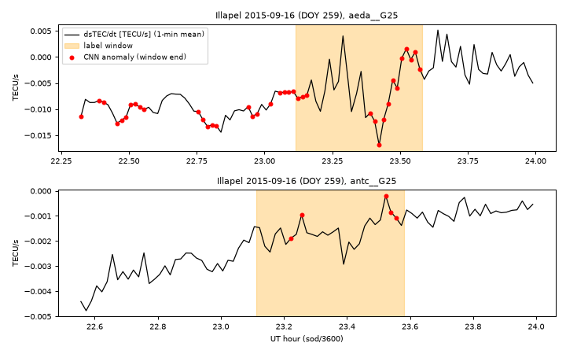

# tidd · GNSS sTEC 变化率 → GADF 图像 → CNN 判 TID（海啸/地震电离层扰动）操作手册

目录：上游 <https://github.com/vc1492a/tidd>（JPL + 罗马大学 + UCLA；V. Constantinou、M. Ravanelli 等）· main tip **`cd15176`**（2024-06-27 11:52 EDT）· 无 tag、**无 PyPI**（`pypi.org/pypi/tidd` 返回 404）；README 徽章写 0.1.2，`setup.py` 写 0.1.1 · **Apache-2.0**（`license.txt`，Copyright 2020 Caltech；GitHub 因文件名识别为 NOASSERTION）· ★10 · Zenodo DOI 10.5281/zenodo.12571499 · 论文 IGARSS 2023，doi 10.1109/igarss52108.2023.10282501。

> 本文实测：2026-09-26 04:05–05:15 EDT，Debian 8 核、无 GPU，`uv` 建 **Python 3.11.16** venv（上游只声明支持 3.7/3.8）。数据为上游 S3 上的**真实** 2012 夏威夷 / 2015 智利 sTEC 变化率文件。
> 冲突时：**本机源码 > 上游 README > 本文**。

## 1. 它解决什么问题

- **TID（行进式电离层扰动）与海啸**：海啸或强震会把大气重力波（AGW，README 称内重力波 IGW）向上送到电离层，引起电子密度起伏。GNSS 的斜路径总电子含量 **sTEC** 随之出现周期几分钟到十几分钟的扰动。尺度与术语见课 [22](../tutorials/22-tid-traveling-disturbances.md)。
- **dsTEC/dt（sTEC 变化率）**：相邻历元的 sTEC 差分，单位 TECU/s。差分本身就是一种**去趋势**：卫星仰角变化造成的慢变斜路径几何项大部分被消掉，留下的是快变扰动。这也是 [varion](./varion.md)（同一罗马大学团队）的做法：VARION 输出的是 dsTEC 积分量，tidd 读的是**变化率本身**。tidd **不从 RINEX 计算**这个量，只读已经算好的文本文件（§3）。
- **GAF / GADF**（Gramian Angular Field）：把长度 N 的时间序列缩放到 [−1, 1]，令 φ = arccos(x)，构造 N×N 矩阵并画成一张图。差分场 GADF 的元素是 sin(φi − φj)，求和场 GASF 的元素是 cos(φi + φj)。README 和论文都说用的是 **GADF**，但代码 `Transform.data_to_image` 调用 `GramianAngularField()` 时没有传 `method`，而 pyts 的默认值是 `method='summation'`（本机 0.13.0 实测签名），所以**实际生成的是 GASF**（坑 10）。tidd 以 **60 min 窗口、1 min 步长**滑动，每个窗口画一张 500×500 的 jpg（viridis 色表）。
- **异常分数 / 标签**：用 fastai 的 ResNet 做二分类，类别为 `anomalous` / `normal`。当窗口**末端**的 sod（当日秒）落在专家标注的 `[start, finish)` 区间内时，该窗口记为 anomalous。`predict` 返回的 `confidence` 是预测类别的最大 softmax 概率，**不是**“异常程度”。
- **样本外评估**：以“整段异常”为单位。只要预测的连续异常段和标注区间有交集，就记 1 个 TP；没有任何交集则记 1 个 FN；每一段不与标注相交的连续预测都记 1 个 FP。

**不做的事：** 不处理 RINEX、不估计 TEC/偏差、不给 TID 的波长和速度，也**不发布训练好的模型**（仓内没有权重，README 表里 recall 84.6% / precision 100% 那组数字无法复核）。

## 2. 安装

```bash
git clone https://github.com/vc1492a/tidd && cd tidd
uv venv -p 3.11 .venv && . .venv/bin/activate
uv pip install --index-url https://download.pytorch.org/whl/cpu torch torchvision   # 只要 CPU 版
uv pip install "pandas<3" numpy matplotlib seaborn pyts natsort tqdm pytest fastai accelerate
export PYTHONPATH=$PWD            # setup.py 里 packages=['']，pip install . 装不出可导入的 tidd
python -m pytest -q
# 10 passed, 1 warning in 15.95s
```

实测版本：torch 2.14.0+cpu、fastai 2.8.12、pyts 0.13.0、numpy 1.26.4、pandas 2.0.3、accelerate 1.15.0。venv 约 1.6 GB，主要是 torch。`requirements.txt` 钉的 torch 1.7.0 / fastai 2.1.8 只有 3.7/3.8 的 wheel，这里没有用。另外 `hyperdash` 云服务已关停，`Experiment` 又在构造时就调用它，所以本文放了一个 8 行的**离线桩**（§4.2），只记录 `param/metric`。

## 3. 数据（上游 S3，**19.2 GB 单一 tar.gz**）

```bash
curl -sI https://tsunami-detection.s3-us-west-1.amazonaws.com/data.tar.gz | grep -i content-length
# Content-Length: 19177325223
```

完整下载需要约 19 GB，再解压一倍，当前机器放不下。tar 流是顺序排列的，所以用 HTTP Range **只流式读取前 2.5 GB**，并只解出需要的成员（两次共读取约 2.8 GB，落盘 264 MB）：

```bash
curl -s -r 0-2500000000 https://tsunami-detection.s3-us-west-1.amazonaws.com/data.tar.gz \
 | tar -xz --wildcards 'data/hawaii/tid_start_finish_times.json' 'data/chile/tid_start_finish_times.json' 'data/hawaii/2012/302/*'
# 末尾报 tar: Unexpected EOF（主动截断造成，属预期）；hawaii/2012/302 得到 1597 个文件
curl -s -r 0-330000000 … | tar -xz --wildcards 'data/chile/2015/259/*_G12.txt' 'data/chile/2015/259/*_G24.txt' 'data/chile/2015/259/*_G25.txt'
# chile/2015/259 得到 264 个文件
```

tar 里的顺序是：`chile/2015/259`（约 2700 个文件）→ `hawaii/2012/299` → 其它天。夏威夷共 290–304 共 15 天，但**只有 302（2012-10-28 Haida Gwaii 地震海啸）有标签**。标签文件原样如下（每颗卫星一段，单位 sod）：

```text
hawaii 302: G04 31400-33200 | G07 31160-32960 | G08 31900-33700 | G10 29900-31700 | G20 31150-32950
chile  259: G12 83059-84600 | G24 83179-84469 | G25 83209-84889
```

**每个文件 = 一个测站 × 一颗卫星 × 一天**，文件名为 `<站4字符><doy>0[.12o|_no_glo_new]_<Gxx>.txt`，制表符分隔，共 7 列。仓内测试文件 `tests/data/ahup3020.12o_G20.txt` 与 S3 里的同名文件 md5 相同（`38ec4e35…`）。

| 列（夏威夷表头） | 智利表头 | 含义 |
| --- | --- | --- |
| `sod` | `# sod` | 当日秒（GPS 时），夏威夷 30 s 采样，智利 15/30 s |
| `dsTEC/dt` | `dsTEC/dt [TECU/s]` | sTEC 变化率，TECU/s |
| `lon` `lat` | **`lat` `lon`** | IPP 经纬度（**两个数据集的列顺序相反**） |
| `h_ipp` | `h_ipp` | IPP 高度，m（350000 或 290000） |
| `elev` | `ele` | 仰角 °（**未做 20° 截止**，文件里有 6° 的低仰角数据） |
| `azi` | `azi` | 方位角 ° |

`Data.read_data_from_file` 按表头名重命名列：变化率列改名为 `<站>__<星>`，其余列改名为 `<站>__<星>_<列名>`。所以用它读就不会受列顺序影响，自己用 `iloc` 取列会取错（坑 5）。

## 4. 端到端（本机真跑）

子集的选取方式：训练用夏威夷 302 的 **ahup / kfap / mkea / uwev 4 个站 × 5 颗有标签卫星 = 20 个文件**；样本外验证按作者的设计用**智利 259**，取站名字母序前 4 个站 **aeda / antc / arjf / cern × 3 颗卫星 = 12 个文件**。目录照上游约定摆放：`data/{hawaii,chile}/<年>/<doy>/` 加上各自的 `tid_start_finish_times.json`。

### 4.1 读一条弧 + 仓库自带的图像生成

```python
from tidd.utils import Data, Transform
df = Data.read_data_from_file("data/hawaii/2012/302/ahup3020.12o_G20.txt")
# … 打印表头/前 3 行、标签窗口内外 |dsTEC/dt|，再调用：
tr, va = Data.prepare_training_validation_data(experiment_name="e2e", training_data_paths=["data/hawaii"],
                                               validation_data_paths=["data/chile"], window_size=60)
```

```text
columns: ['ahup__G20', 'ahup__G20_lon', 'ahup__G20_lat', 'ahup__G20_h_ipp', 'ahup__G20_ele', 'ahup__G20_azi']
rows: 849 sod range: 7260.0 - 37050.0
        ahup__G20  ahup__G20_lon  ahup__G20_lat  ahup__G20_h_ipp  ahup__G20_ele  ahup__G20_azi
sod
7260.0   0.011272    -166.990794      12.833790    350002.465068       6.636825     241.722844
7290.0   0.015500    -166.932173      12.911805    349966.778812       6.768721     241.884804
7320.0   0.015451    -166.874732      12.988652    349966.077185       6.900429     242.047312
label G20 sod 31150-32950
ahup__G20 (dsTEC/dt) |max| inside label = 0.00424, outside = 0.01994, std in/out = 0.00108/0.00569
1-min rows: 497 continuous segments >100 min: [394]
INFO:root:100%|##########| 32/32 [01:08<00:00,  2.15s/it]
returned paths: data/experiments/e2e/train data/experiments/e2e/validation exists: False False (69s)
data/experiments/e2e/hawaii/train {'normal': 6617, 'anomalous': 514}
data/experiments/e2e/chile/validation {'normal': 3185, 'anomalous': 304, 'unlabeled': 3489}
```

两点要注意：(1) ahup/G20 标签窗口内的 |dsTEC/dt| 最大值（0.00424）反而**小于**窗口外（0.01994）。窗口外的大值来自弧段开头 6° 仰角的噪声，这说明标签按卫星统一给出，与单站信号强弱无关。(2) 函数**返回的路径不存在**，图片实际写在 `experiments/<名>/<地点>/<train|validation>`（坑 3）。32 个文件共生成 14 109 张 jpg（6617+514+3185+304+3489），占 **551 MB**。

### 4.2 训练 + 样本外（上游 `Experiment.run`）

```python
# hyperdash.py —— 放在当前目录的离线桩
class Experiment:
    def __init__(self, name): self.name = name
    def param(self, k, v): return v
    def metric(self, k, v): print(f"[metric] {k} = {v}", flush=True); return v
    def end(self): pass
```

```python
# step2_train.py（节选）
from fastai.vision.all import Adam, resnet18, ImageDataLoaders
_ff = ImageDataLoaders.from_folder.__func__          # 容器 /dev/shm 只有 64 MB → 关闭 worker
ImageDataLoaders.from_folder = classmethod(lambda cls, *a, **k: _ff(cls, *a, num_workers=0, **k))
from tidd.modeling import Experiment, Model
M = Model(architecture=resnet18, batch_size=64, learning_rate=1e-3, optimization_function=Adam)
E = Experiment(model=M, name="e2e", training_data_paths="data/experiments/e2e/hawaii/train",
               validation_data_paths="data/experiments/e2e/chile/validation",
               generate_data=False, max_epochs=2, window_size=60, save_path="out")
E.run(verbose=False)
```

`_out_of_sample` 要从 `experiments/e2e/tid_start_finish_times.json` 读**按地点嵌套**的标签（`{"hawaii": {"302": …}, "chile": {"259": …}}`），需要手工合并两份标签文件后放进去。架构（resnet18，上游默认 resnet34）、学习率 1e-3（默认 1e-4）、2 个 epoch（默认 50）都是本文为了在 CPU 上跑得完而改的。

```text
epoch     train_loss  valid_loss  error_rate  accuracy  time
0         0.516046    0.213154    0.059607    0.940393  12:25
1         0.241668    0.106634    0.027349    0.972651  12:45
[metric] training_accuracy = 0.9726507713884993
[metric] training_precision = 0.7142857142857143
[metric] recall = 0.8928571428571429
[metric] f1_score = 0.7936507936507937
[metric] anomaly coverage = 0.4
[metric] normal coverage = 0.8758516275548827
[metric] validation_precision = 0.0
[metric] validation_recall = 0.0
[metric] validation_f1_score = 0.0
tp fn fp = 0 12 40 | tp_lengths [] | fp_lengths [3, 3, 3, 10, 3, 4, 1, 1, 1, 3, 1, 2, 7, 5, 3, 1, 7, 12, 2, 5, 1, 5, 1, 4, 2, 2, 0, 1, 2, 1, 2, 1, 1, 3, 9, 6, 2, 6, 4, 0]
elapsed 3732s
```

输出：`out/model_output/{history.csv, models/model.pth, tidd_e2e_resnet18.pkl}`（`export` 写到 learner 的 path 下，不在当前目录）以及 `out/out_of_sample/<站>__<星>_results.csv`，共 12 个。

**这组数字不能直接用**，原因有三：
1. `training_precision` 和 `recall` **互换了**。fastai 的混淆矩阵是“行 = 真值，列 = 预测”，而 `metrics.confusion_matrix_scores` 用行和做 precision 的分母。所以真正的 precision 是 0.893，recall 是 0.714。
2. 训练集内的验证集是 `valid_pct=0.2` **随机抽取**的滑窗。相邻窗口有 59/60 重叠，信息泄漏严重，0.97 的 accuracy 只比“全判 normal”的基线 6617/7131 = 0.928 高一些。
3. 样本外的 **tp=0 是代码 bug**：`adjusted_ground_truth_sequence = [x - 60 for x in 时间戳]` 是在 `datetime64` 上减 60 **纳秒**（实测 `2015-09-16T23:07:00` → `23:06:59.999999940`），和整数位置索引永远没有交集。另外 `group_consecutive_values([])` 返回 `[[]]`，一个异常都没报的弧也会被记 1 个长度为 0 的 FP（上面 `fp_lengths` 里有两个 0）。`metrics["validation_recall"]` 也被错误赋值成了 precision。

### 4.3 用 tidd 自己的判分函数重算（只修正索引）

保持 tidd 的判分口径不变（`confusion_matrix_classification`、`precision_score` 等），只把真值换成 CSV 的**行位置**，并丢掉空段：

```text
pass        rows  label_rows  flagged  flagged_in_label  tp fn fp
aeda__G12    220         26       27                4   1  0  4
aeda__G24    214         22       27                3   1  0  6
aeda__G25    101         28       38               15   1  0  6
antc__G12    159         26        2                0   0  1  1
antc__G24    252         22        2                0   0  1  1
antc__G25     87         28        5                5   1  0  0
arjf__G12    159         26        8                3   1  0  4
arjf__G24    256         22       14                0   0  1  5
arjf__G25     79         28        0                0   0  1  0
cern__G12    167         26        3                0   0  1  1
cern__G24    224         22        0                0   0  1  0
cern__G25     77         28        4                0   0  1  1
TOTAL tp=5 fn=7 fp=29 precision=0.147 recall=0.417 f1=0.217
```



## 5. 怎么读结果

- `*_results.csv` 列：`timestamp, sod, <站>__<星>`（dsTEC/dt 的 1 min 均值）、`…_lat, …_lon, …_h_ipp, …_ele, …_azi, anomaly`（1 = 判为 anomalous）、`confidence`。**每一行代表以该行为末端的 60 min 窗口**（`event.iloc[59:]`），所以报警时刻天然滞后于扰动开始。
- 本次样本外结果（小模型、只训 2 个 epoch、4 站训练）：12 条弧里有 5 条命中标注区间，29 段误报。误报集中在 aeda（上图上半部分，22:20–23:05 UT 的平缓段也在报）。antc/G25 的 5 个报警全在标注区间内，但幅度只有约 0.001 TECU/s 量级。这个结果说明整条流程走得通，**不能说明方法的真实性能**。要复核论文，需要完整的 15 天夏威夷数据、上游默认的 resnet34 × 50 epoch，以及 GPU。
- 判读时同时看 `…_ele`：tidd 不做仰角截止。本次 4 条智利 G25 弧在 results CSV 里的仰角为 20.7–54.0°，标签窗口内为 27.7–48.8°，所以这里的误报不是低仰角造成的。但训练用的夏威夷弧里有 6° 的数据（§4.1）。

## 6. 主要参数

| 位置 | 参数 | 默认 | 说明 |
| --- | --- | --- | --- |
| `Model` | `architecture` / `batch_size` / `learning_rate` / `optimization_function` | resnet34 / 256 / 1e-4 / Adam | fastai `cnn_learner`，`pretrained=False` |
| `Experiment` | `training_data_paths` / `validation_data_paths` | `["./"]` / None | `generate_data=True` 时传原始数据目录；False 时传**图片目录字符串** |
| | `generate_data` | False | True 时调用 `prepare_training_validation_data`（有路径 bug，坑 3） |
| | `share_testing` | 0.2 | 只打印，不起作用；实际划分由 `_set_data` 写死的 `valid_pct=0.2` 决定 |
| | `max_epochs` / `window_size` | 50 / 60 | epoch 上限、窗口长度（min） |
| | `cuda_device` / `parallel_gpus` | 0 / False | 无 GPU 时只打一条 WARNING |
| `Model.fit` 回调 | CSVLogger、ReduceLROnPlateau(patience 3)、EarlyStopping(patience 5)、SaveModelCallback | — | 写死在代码里 |
| `Transform.split_by_nan` | `min_sequence_length` | 100 | 只保留长度超过 100 min 的连续段 |
| 重采样 | `resample("1min").mean()` | 写死 | 原始 15/30 s 数据先求 1 min 均值 |

## 7. 坑（现象 → 原因 → 修复）

1. **`pip install .` 成功，但换个目录就 `ModuleNotFoundError: No module named 'tidd'`**（实测） → `setup.py` 写的是 `packages=['']`，什么模块也没装进去。测试之所以能过，是因为 cwd 恰好在仓库根目录。修复：`export PYTHONPATH=/path/to/tidd`
2. **`test_transform_split_by_nan`、`test_transform_generate_images` 失败，报 `assert 0 > 0`**（实测 pandas 3.0.6） → pandas 3 下 `np.split(DataFrame)` 返回 ndarray，被 `split_by_nan` 当成无效段全部丢弃，于是**一张图也不生成且不报错**。pandas 2.0.3/2.2.3/2.3.3 配 numpy 1.26–2.2 都正常。修复：`uv pip install "pandas<3"`
3. **`Experiment(generate_data=True)` 生成完图片后找不到数据**（实测返回 `…/experiments/e2e/train`，路径不存在） → 图片写在 `experiments/<名>/<地点>/train`，返回值却少了 `<地点>` 这一级。修复：先单独生成图片，再用 `generate_data=False, training_data_paths="data/experiments/e2e/hawaii/train"`
4. **`NameError: name 'Accelerator' is not defined`（`import fastai.distributed` 时）**（实测） → 新版 fastai 的 distributed 模块依赖 `accelerate`。修复：`uv pip install accelerate`
5. **自己用 `pd.read_csv(...).iloc[:,2]` 当经度，智利数据的 IPP 跑到了海里** → 智利文件的列序是 `lat lon`，夏威夷是 `lon lat`；智利表头还多了 `#` 和 `[TECU/s]`。修复：`python -c "print(open('data/chile/2015/259/aeda2590_G12.txt').readline())"`，先看表头，或一律用 `Data.read_data_from_file`
6. **训练第 2 个 batch 报 `RuntimeError: unable to allocate shared memory(shm) … No space left on device`**（实测，Docker 默认 `/dev/shm` 64 MB；改 `set_sharing_strategy("file_system")` 无效） → DataLoader 的多个 worker 通过 shm 传张量。修复：用 §4.2 的 `num_workers=0` 补丁，或者启动容器时加 `docker run --shm-size=2g …`（本机未测）
7. **样本外 precision/recall 永远是 0**（实测 tp=0 fn=12 fp=40） → 时间戳减 60 ns 的 bug 加上空段计 FP（§4.2）。修复：按 §4.3 用行位置重算，`python -u step3_rescore.py`
8. **`Experiment.run(verbose=True)` 报 `AttributeError: 'NoneType' object has no attribute 'append'`**（源码 `modeling.py` 第 101 行：`self.callbacks` 默认为 None 时执行 `.append`） → verbose 分支没有判空。修复：`Model(..., callbacks=[])` 或 `run(verbose=False)`
9. **`from hyperdash import Experiment` 失败，或者装上后要求 API key** → hyperdash.io 已停止服务，`Experiment.__init__` 却无条件调用它。修复：在工作目录放 §4.2 的 8 行 `hyperdash.py` 桩
10. **按论文复现 GADF，但图像统计和论文对不上** → `data_to_image` 使用 pyts 默认的 `method='summation'`，实际生成的是 GASF（§1）。本文的训练和评估都**沿用了上游行为（GASF）**。修复（如果要用 GADF）：`sed -i 's/GramianAngularField()/GramianAngularField(method="difference")/' tidd/utils.py`，然后重新生成全部图片

## 8. 诚实边界

- **没有预训练模型**。本文从零训练了一个 resnet18（2 epoch，CPU，每个 epoch 约 12.5 min，全程 62 min），只用于演示流程。样本外 F1 0.217 是**这个小模型**的成绩，不代表论文结果。
- 数据只取了 19.2 GB 中的一小部分：夏威夷 302 天 4 站 20 条弧，智利 259 天 4 站 12 条弧。夏威夷 302 天的 1597 个文件来自截断的流，**不保证是那一天的全部文件**。其余 14 天（没有标签，按设计全部作为 normal）没有使用。
- `examples/` 用的是相对路径 `../data/...`，注释和 notebook 输出里还残留作者本机路径（`/home/vconstan/...`）。本文没有运行 notebook。`_out_of_sample` 里年份写死为 2012（非 chile）/ 2015。
- 如果要从自己的 RINEX 得到输入，需要另外用 VARION 类工具算 dsTEC/dt，并整理成上述 7 列格式（[varion](./varion.md) 输出的是积分后的 dsTEC，与 tidd 要的变化率不同）。本文没有做这一步。
- 许可：Apache-2.0。数据本身在 README 里没有单独的许可说明，来源测站网（夏威夷 / 智利 CORS）的致谢要求请自行确认。

## 9. 相关

- 课：[22 TID/MSTID](../tutorials/22-tid-traveling-disturbances.md)
- 同类 GNSS 输入：[varion](./varion.md)（单站 sTEC 变化 / 海啸 TID，同一团队）· [tec-suite](./tec-suite.md)（RINEX → 逐星 STEC 文本）· [gnss-tec](./gnss-tec.md)
- 其它 TID 手段：[darntids](./darntids.md)（SuperDARN MSTID + MUSIC）· [hamsci-lstid-detection](./hamsci-lstid-detection.md)（HF spot 跳距 LSTID）
