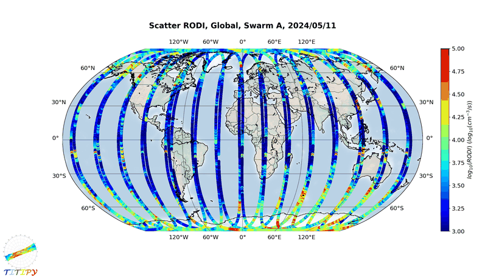

# TITIPy · Swarm 顶部电离层不规则体指数（RODI / ROTI / ROTEI）操作手册

目录：上游 <https://github.com/pignalberi/TITIPy> · 唯一分支 `master` tip **`223ace7`**（2025-02-05 11:14 EST，“User registration”）· 无 release、无 PyPI · ★8 · 作者 A. Pignalberi（INGV，ESA INTENS 项目）· **许可证：GitHub 显示 NOASSERTION，实际 `LICENSE` 是 CC BY-NC-SA 3.0**（署名-非商业-相同方式共享；不是 OSI 开源许可，商用须另行授权）· 本机验证 **2026-09-26 03:05–03:30 EDT**：Python 3.11.16，numpy 2.3.5、matplotlib 3.10.9、basemap 2.0.0、apexpy 2.1.1、cdflib 1.3.14、spacepy 0.7.0、patool 4.0.7；数据 = **Swarm A 2024-05-11（Gannon 磁暴主相次日）真实 L1b LP + L2 TEC**。

> 冲突时：**仓内 `.py` 源码 > 上游 README > 本文**。本文对源码打了 3 处补丁才跑通（见第 4 节），都标了原因。

## 1. 它解决什么

ESA **Swarm** 三颗卫星（A/C 约 460 km 并飞，B 约 510 km）上有两类电离层探测：

| 仪器 / 产品 | 量 | 采样 |
| --- | --- | --- |
| **Langmuir 探针（LP）**，L1b `EFIx_LP_1B` | 原位等离子体密度（cm⁻³）、电子温度 Te（K） | 2 Hz |
| **GPS 定轨天线（POD）**，L2 `TECxTMS_2F` | 卫星→GPS 视线的**顶部** TEC（只含卫星以上的等离子体层/顶部电离层） | 1 Hz（2014-07-15 前 0.1 Hz） |

TITIPy 把这两类数据变成“小尺度起伏有多剧烈”的指数：

| 指数 | 定义（按 `Functions.rod_rodi_calculation`） | 单位 |
| --- | --- | --- |
| **ROD** | 相邻两点密度差 / 时间差（rate of change of density） | cm⁻³/s |
| **RODI** | 滑动窗口内 ROD 的**标准差**（ddof=1）；窗口默认 10 s = 21 个 2 Hz 点，缺点≤一半才算 | cm⁻³/s |
| **ROTE / ROTEI** | 同上，换成 Te | K/s |
| **ROT / ROTI** | 同上，换成 TEC（默认绝对斜 TEC），窗口 10 s = 11 个 1 Hz 点 | **TECU/s** |
| `*_grad` | 相邻点差 / 两点球面距离 | cm⁻³/km、TECU/km |

卫星速度约 7.6 km/s，10 s 窗 ≈ 76 km 沿轨尺度——这是 Swarm 版“不规则体强度”，和地面接收机 ROTI（5 min 窗、TECU/min，见 [oasis-roti](./oasis-roti.md)）**同名不同物**。另外它还把每点转成 QD 磁纬 / MLT（apexpy）、按 MLT×磁纬分箱出极区图，TEC 部分按 400 km 薄壳（卫星以上）算穿刺点 IPP。

## 2. 安装

README 建议 conda；以下是纯 pip 实测可用组合（basemap 2.0 已有 manylinux 轮子）：

```bash
mkdir -p ~/iono_ops/titipy && cd ~/iono_ops/titipy          # 先 cd 再建 venv
python3 -m venv venv && . venv/bin/activate
pip install --no-cache-dir cdflib apexpy patool spacepy basemap
# 注意：basemap 2.0.0 会把 matplotlib 降到 3.10.9、numpy 降到 2.3.5
git clone --depth 1 https://github.com/pignalberi/TITIPy && cd TITIPy
git log -1 --format='%h %ci'      # 223ace7 2025-02-05 17:14:33 +0100
head -3 LICENSE                   # This work is licensed under the Creative Commons Attribution-NonCommercial-ShareAlike 3.0 ...
```

## 3. 拿数据：HTTPS 免账号，FTPS 要账号

`Downloading_Swarm_data.py` 用 **FTPS** 登录 `swarm-diss.eo.esa.int`，账号密码读 `User_credentials.txt`（仓内是占位符两行 `USERNAME` / `PASSWORD`）。本机用占位符登录：

```text
220-This is a private system - No anonymous login
error_perm 530 Login authentication failed
```

即 FTPS 必须先在 ESA 注册账号。**同一台服务器的 HTTPS 网页接口本机免登录可列目录、可下载**（2026-09-26 实测；ESA 随时可能改策略）：

```bash
cd ~/iono_ops/titipy                 # zip 放在 TITIPy/ 的上一级
B="https://swarm-diss.eo.esa.int/?do"
P="swarm%2FLevel1b%2FLatest_baselines%2FEFIx_LP%2FSat_A"
curl -s "$B=list&maxfiles=10000&pos=0&file=$P" | python3 -c "import json,sys;[print(x['name'],x['size']) for x in json.load(sys.stdin)['results'] if '20240511' in x['name']]"
# SW_OPER_EFIA_LP_1B_20240511T000000_20240511T235959_0701.CDF.ZIP 12205184
curl -o lp.zip  "$B=download&file=$P%2FSW_OPER_EFIA_LP_1B_20240511T000000_20240511T235959_0701.CDF.ZIP"
curl -o tec.zip "$B=download&file=swarm%2FLevel2daily%2FLatest_baselines%2FTEC%2FTMS%2FSat_A%2FSW_OPER_TECATMS_2F_20240511T000000_20240511T235959_0502.ZIP"
```

| 文件 | zip | 解出 `.cdf` | 本机下载耗时 |
| --- | --- | --- | --- |
| `EFIA_LP_1B …_0701` | 12 205 184 B | 12 543 787 B | 158 s（这台机器到 ESA 时快时慢） |
| `TECATMS_2F …_0502` | 43 093 068 B | 43 241 760 B | 8.9 s |

VirES（[viresclient](./viresclient.md)）也能取同样的数据，但**需要 token**，本机未测。

## 4. 端到端：Swarm A 2024-05-11

### 4.1 必须的 3 个源码补丁（tip `223ace7` 在 2026 年的数据/库上直接跑会崩）

```bash
cd ~/iono_ops/titipy/TITIPy
# (a) LP 产品 2025 年升到 baseline 0701：Ne/Te/Flags_Ne/Flags_Te 改名
sed -i "s/varget('Ne')/varget('N_ion')/; s/varget('Te')/varget('T_elec')/; s/varget('Flags_Ne')/varget('Flags_N_ion')/; s/varget('Flags_Te')/varget('Flags_T_elec')/" Reading_Swarm_data_cdf.py
# (b) cdflib ≥1.0 的 CDF 对象没有 close()
sed -i 's/^\(\s*\)cdf\.close()/\1pass/' Reading_Swarm_data_cdf.py
# (c) numpy ≥1.24 不再自动造“参差数组”
sed -i 's/binned=np.array(binned)$/binned=np.array(binned,dtype=object)/' Functions.py
```

(a) 选 `N_ion` 的依据：ESA 说明旧 `Ne` 实际来自离子导纳，已更名为 `N_ion`；新增的 `N_elec` 是另一套电子密度估计。

### 4.2 跳过 FTPS，用已下好的 CDF

`Main.py` 先建 `YYYYMMDDS/` 目录树，再 `import Downloading_Swarm_data`。在 `sys.path` 最前面放一个同名替身模块，让它把 zip 里的 `.cdf` 解到 TITIPy 期望的位置，原文件一行不改（本机实际用的就是下面这版）：

```bash
mkdir -p ../override && cat > ../override/Downloading_Swarm_data.py <<'PY'
# 替身：不走 FTPS，解压已用 HTTPS 下好的 zip
import os, zipfile
from Terminal_interface import *
base=os.path.join(os.getcwd(),'%04d%02d%02d%s'%(YEAR,MONTH,DOM,SAT),'Downloaded_data')
for z,sub in (('../lp.zip','LP'),('../tec.zip','TEC')):
    zf=zipfile.ZipFile(z)
    for n in zf.namelist():
        if n.endswith('.cdf'): zf.extract(n,os.path.join(base,sub)); print('    unpacked',sub,n)
PY
cat > ../run_titipy.py <<'PY'
import sys, os, runpy
sys.path[:0]=[os.path.abspath('../override'), os.getcwd()]
runpy.run_path('Main.py', run_name='__main__')
PY
printf '2024\n5\n11\nA\n' | python -u ../run_titipy.py | tee ../run.log   # 年、月、日、卫星四个 input() 用管道喂
```

`TITIPy_input_parameters.txt` 第 4–6 行是开关：

| 行 | 默认 | 含义 |
| --- | --- | --- |
| 4 | `Y` | 是否出图（Y 很慢、很占盘，见坑 7） |
| 5 | `10` | RODI/ROTEI/ROTI 窗口宽度（秒，整数） |
| 6 | `1` | ROTI 用哪种 TEC：1 绝对斜 TEC，2 绝对垂直 TEC，3 相对斜 TEC |

本机 stdout（LP 段；`Directory ... already exists` 是第二次运行的正常提示）：

```text
**********Input time and satellite**********
Valid dates are from 05/12/2013 to 20/09/2026
Insert year: Insert month: Insert day of the month: Insert Swarm satellite (A,B,C): Directory  /workspace/scratch_pydarn_titipy/titipy/20240511A  already exists
    unpacked LP SW_OPER_EFIA_LP_1B_20240511T000000_20240511T235959_0701_MDR_EFI_LP.cdf
    unpacked TEC SW_OPER_TECATMS_2F_20240511T000000_20240511T235959_0502.cdf
Reading and converting downloaded data...

**********Swarm data analysis module**********
Working on Swarm A 2024/05/11 LP data...
    Calculating RODI, ROTEI, and other LP parameters...
    Saving output file...
    Binning data in magnetic coordinates...
```

（这段来自补丁 (c) 之前的一次运行，随后在 `binning_2D` 崩溃；打上 (c) 后的完整运行 stdout 因管道块缓冲、进程被中止而丢失——所以上面的命令都加了 `-u`。）完整运行的时间线：07:14 UTC 开跑，LP 读转换 + 指数约 3 min，LP 图 07:17–07:18，TEC 每颗 PRN（含 6 张图）约 20 s，**07:26 UTC 处理到 PRN24 时整机磁盘写满**，中止。LP 全部产出，TEC 得到 PRN02–PRN23（PRN01 当天无数据）。

### 4.3 输出与统计

```text
20240511A/Organized_data/LP/Swarm_LP_A_2024_05_11_data.txt        29 MB（中间文件）
20240511A/Organized_data/TEC/…_PRNxx_data.txt × 32               136 MB（中间文件）
20240511A/Output/data/LP/Swarm_LP_A_2024_05_11_output.txt         50 MB，172 776 行 × 32 列
20240511A/Output/data/TEC/Swarm_TEC_2Hz_A_2024_05_11_PRNxx_output.txt   每颗 0.7–6.6 MB
20240511A/Output/figures/LP/{Ne,RODI,ROTEI,…}_…_{Global_scatter,North_Pole_scatter,…}.png
```

LP 输出统计（脚本 `lpstat.py`，列号按表头：17 Ne、21 RODI、25 Te、28 ROTEI、15 QD 磁纬）：

```text
rows 172776 valid Ne 169487 valid RODI 171524 valid Te 104453 valid ROTEI 111986
|QDlat|  0-30: n= 56899 RODI median=  1320 p95=  9683 cm-3/s  Ne median= 353926 cm-3
|QDlat| 30-60: n= 60059 RODI median=  2644 p95= 22210 cm-3/s  Ne median=  96786 cm-3
|QDlat| 60-90: n= 54566 RODI median=  6007 p95= 28516 cm-3/s  Ne median=  65299 cm-3
max RODI 136680 at 11:18:14 UT lat=-12.91 lon=117.63 QD=-21.56 MLT=18.99
```

TEC 输出统计（`tecstat.py`，PRN02–23，丢弃可能截断的 PRN24；列 21 仰角、28 ROTI）：

```text
PRN files 22 _PRN02 .. _PRN23 rows 318075
most common dt (s): 1
elev deg min/max 19.94 89.90; elev<30 frac 0.271
valid ROTI 317855
all elev |QDlat|  0-30: n=109181 ROTI median=0.0112 p95=0.2610 TECU/s
all elev |QDlat| 30-60: n=110937 ROTI median=0.0012 p95=0.1527 TECU/s
all elev |QDlat| 60-90: n= 97737 ROTI median=0.0028 p95=0.0732 TECU/s
elev>=30 |QDlat|  0-30: n= 79967 ROTI median=0.0083 p95=0.2279 TECU/s
elev>=30 |QDlat| 30-60: n= 83495 ROTI median=0.0013 p95=0.1338 TECU/s
elev>=30 |QDlat| 60-90: n= 68469 ROTI median=0.0024 p95=0.0727 TECU/s
max ROTI(elev>=30) 1.570 TECU/s PRN11 09:27:10 UT LEO lat=52.16 lon=141.47 QD=46.01 MLT=18.77 el=58.8
```



### 4.4 怎么读

- **RODI 随磁纬升高**：中位数 1320 → 2644 → 6007 cm⁻³/s，而背景 Ne 反而从 3.5e5 降到 6.5e4 cm⁻³——高纬（极光椭圆/极盖，磁暴期扩张）相对起伏最强。图上南半球高纬的红黄段就是这个。
- **最大 RODI 出现在 MLT≈19、QD −21.6°**（印尼以南洋面，11:18 UT）：日落后赤道异常峰附近，典型的**赤道等离子体泡（EPB）**时段/位置；与地面 GNSS 的日落后 ROTI 爆发是同一类现象（教程 [21](../tutorials/21-equatorial-anomaly-bubbles.md)）。
- **ROTI（顶部 TEC）** 在 |QD|<30° 的 p95 最高（0.26 TECU/s），高纬反而最低——顶部 TEC 只含卫星以上 ~460 km 起的等离子体，极区顶部密度低，扰动绝对值小；想看高纬不规则体用 RODI 更直接。
- 最大 ROTI（仰角≥30°）出现在 09:27 UT、52°N 141°E（QD 46°、MLT 18.8）的中纬黄昏侧，与磁暴期扰动向中纬扩张的图像一致；本文未用其他数据核实。
- 仰角 ≥30° 过滤后低纬 p95 从 0.261 降到 0.228：低仰角斜路径长、放大 ROT，做统计先定仰角掩膜。
- 相对 vs 绝对：RODI 是绝对量，高密度区天然偏大；比较不同纬度时可以再算 `RODI/mean_Ne`（输出里有 `mean_Ne` 列）。

## 5. 输出字段（LP `…_output.txt`）

| 列 | 名 | 说明 |
| --- | --- | --- |
| 0–7 | year…doy | UT 时间 |
| 8–10 | hourUT / hourLT / MLT | LT = UT + 经度/15 |
| 11–14 | LatGeo / LonGeo / Radius [m] / Height [km] | 本日高度 468–487 km |
| 15–16 | LatMag_QD / LonMag_QD | apexpy QD，参考高度 = 当日平均高度 |
| 17 | Ne [cm⁻³] | 实际是 `N_ion`（补丁 a）；被标志过滤掉的点为 nan |
| 18–19 | Flag_LP / Flag_Ne | 只保留 `Flag_LP==1` 且 `Flag_Ne≤29` |
| 20–24 | ROD / RODI / mean_ROD / Ne_grad / mean_Ne | 见第 1 节 |
| 25–26 | Te [K] / Flag_Te | 只保留 `Flag_Te ∈ {10,20}`（见坑 5） |
| 27–31 | ROTE / ROTEI / mean_ROTE / Te_grad / mean_Te | |

TEC `…_PRNxx_output.txt` 另有 `Abs_STEC/Abs_VTEC/Rel_STEC/Rel_STEC_RMS`、`Elev_Angle`（**弧度**）、`PRN`、`LatGeo_IPP/LonGeo_IPP/Height_IPP`（卫星高度 + 400 km）、`ROT/ROTI/ROT_mean [TECU/s]`、`TEC_grad`、`mean_TEC`。

## 6. 坑（现象 → 原因 → 修复）

1. **`ValueError: Variable name 'Ne' not found.`（Reading_Swarm_data_cdf.py 60 行）**  
   原因：2025 年 LP L1b 升级到 baseline 0701，变量改名 `N_ion/T_elec/Flags_N_ion/Flags_T_elec`，TITIPy 未跟进。  
   修复：执行 4.1 节补丁 (a) 的 `sed`

2. **`AttributeError: 'CDF' object has no attribute 'close'`（66 行）**  
   原因：cdflib 1.x 删了 `close()`（README 要求的是 0.3.x 时代）。  
   修复：`sed -i 's/^\(\s*\)cdf\.close()/\1pass/' Reading_Swarm_data_cdf.py`

3. **`ValueError: setting an array element with a sequence ... inhomogeneous shape after 1 dimensions`（Functions.py 137 行，出现在 `Binning data in magnetic coordinates...` 之后）**  
   原因：每个 MLT×磁纬箱里点数不同，numpy ≥1.24 拒绝隐式造 object 数组。  
   修复：`sed -i 's/binned=np.array(binned)$/binned=np.array(binned,dtype=object)/' Functions.py`

4. **下载阶段 `error_perm 530 Login authentication failed`**  
   原因：FTPS 不允许匿名，`User_credentials.txt` 是占位符。  
   修复：注册 ESA 账号后把用户名、密码各写一行进 `User_credentials.txt`；或按第 3 节用 HTTPS 下载 + 第 4.2 节替身模块：`printf '2024\n5\n11\nA\n' | python -u ../run_titipy.py`

5. **valid Te 只有 104 453 / 172 776，ROTEI 大片 nan**  
   原因：代码只认 `Flag_Te` 为 10 或 20（旧 baseline 语义）；0701 的 `Flags_T_elec` 本日分布为 20:105270、21:65193、30:1550、40:409…，21 全被丢。21 是否可用要查 ESA `SW_EFIx_LP_1B` 手册的标志表后自行决定。  
   修复（确认可用后）：`sed -i 's/(flag_Te\[i\]!=10 and flag_Te\[i\]!=20)/(flag_Te[i] not in (10,20,21))/' Parameters_calculation_and_mapping.py`

6. **管道喂输入时屏幕长时间只停在 `Insert Swarm satellite (A,B,C):`，进程被杀后日志里什么都没有**  
   原因：stdout 接管道时是块缓冲。  
   修复：`printf '2024\n5\n11\nA\n' | python -u ../run_titipy.py | tee run.log`

7. **跑到一半 `No space left on device` / 整机磁盘写满**  
   原因：出图模式下每颗 PRN 生成 6 张 1–2 MB 的 PNG（约 8.5 MB/PRN），加上 136 MB 的 TEC 中间文本、50 MB 的 LP 输出，一天一颗星轻松 >500 MB。  
   修复：先关图：`sed -i '4s/^Y/N/' TITIPy_input_parameters.txt`，跑完删 `Organized_data/`

8. **拿 TITIPy 的 ROTI 直接和地面站 ROTI（如 0.5 TECU/min 阈值）比**  
   原因：这里是 1 Hz、10 s 窗、TECU/s，且是移动 LEO 的顶部 TEC；地面是 30 s、5 min 窗、TECU/min 的全路径 TEC，物理尺度和单位都不同。  
   修复：只做同源相对比较；若要更长窗口：`sed -i '5s/^10/60/' TITIPy_input_parameters.txt`

9. **按仰角 20° 过滤后一条不剩**  
   原因：输出的 `Elev_Angle` 是**弧度**（本日 0.35–1.57）。  
   修复：`python -c "import numpy as np;d=np.genfromtxt('X_output.txt',skip_header=1);print(np.degrees(d[:,21]).min())"`

10. **TEC 输出文件名里写 `2Hz`，以为 TEC 是 2 Hz**  
    原因：文件名模板写死；实测相邻历元间隔众数 1 s（`FREQUENCY=1`，2014-07-15 前为 0.1）。  
    修复：用第 4.3 节 `tecstat.py` 的 `most common dt` 自己确认

11. **重跑时 `FileNotFoundError`，路径指向 `…/Output/data/LP`（按源码推断，未实测）**  
    原因：`Main.py` 在顶层目录已存在时打印 `already exists` 并**跳过全部子目录创建**；若上次只留下半棵树就会缺目录。  
    修复：`rm -rf 20240511A` 后重跑（先挪走已下载的 CDF）

## 7. 边界

- 只跑了 **1 天 × Swarm A**；TEC 部分因整机磁盘写满只完成 22/31 颗有数据的 PRN，没有得到程序末尾的 `Done` 与 `TITIPy_run_info_*.txt`；LP 部分完整。
- FTPS 下载模块未能实跑（无 ESA 账号）；HTTPS 免登录是 2026-09-26 的现状，不保证长期可用。
- 补丁 (a) 选 `N_ion` 对应旧 `Ne`；若改用 `N_elec`，RODI 数值会不同，本文未比较。
- CC BY-NC-SA 3.0：可改可再分发，但须署名、非商业、衍生作品同协议。
- 本文没有和地面 GNSS ROTI 做同时段比对，第 4.4 节的解释是按指数分布与已知现象的对应，不是定量验证。

## 8. 相关

- 地面 ROTI / 闪烁概念：教程 [05](../tutorials/05-scintillation-roti.md)、[oasis-roti](./oasis-roti.md)、[iono-scintillation](./iono-scintillation.md)
- 赤道等离子体泡：教程 [21](../tutorials/21-equatorial-anomaly-bubbles.md)；磁暴 TEC：教程 [20](../tutorials/20-storm-tec-analysis.md)
- 同一磁暴的太阳风背景：[pyspedas](./pyspedas.md)（Gannon 暴 OMNI/Dst/Kp）
- Swarm 数据的另一条路（需 token）：[viresclient](./viresclient.md)；QD/MLT：[apexpy](./apexpy.md)
- 高纬对流背景（地基 HF 雷达）：[pydarn](./pydarn.md)
