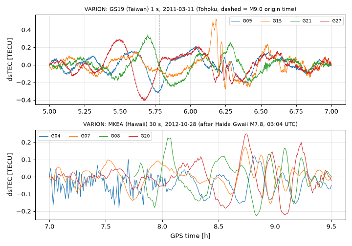

# VARION · 单站实时 sTEC 变化率（海啸/TID 探测）操作手册

目录：上游 <https://github.com/giorgiosavastano/VARION> · 唯一分支 tip **`905f456`**（2020-05-14）· **GPL-3.0** · ★15 · 无 release、无 PyPI 包 · **只支持 Python 2.7** · 作者 G. Savastano、M. Ravanelli（罗马大学 + JPL）· 本机验证 **2026-09-26 02:53–03:05 EDT**：micromamba 建 conda-forge **Python 2.7.15 + numpy 1.16.5 + pandas 0.24.2**；跑仓库自带的 **2011-03-11 东日本大地震日台湾 GS19 1 Hz** RINEX，以及 NOAA NGS 下载的 **2012-10-28 海达瓜伊地震后夏威夷 MKEA 30 s** RINEX。

> **PyPI 上的 `varion` 0.1.0 不是它**：那是 BrightMinding 的“hybrid random number generator”（2025-06 上传，2.8 kB）。不要 `pip install varion`。  
> 冲突时：**`VARION.py` 源码 > 上游 README > 本文**。

## 1. 它解决什么

大地震/海啸在海面激起重力波，重力波上传到 300 km 左右的电离层，推着电子密度起伏，这就是 **TID**（行进式电离层扰动，见教程 [22](../tutorials/22-tid-traveling-disturbances.md)）；海啸引起的叫 **TIDs of tsunami origin**。起伏只有零点几 TECU，要从 GNSS 相位里抠出来，还想**实时**做（海啸预警），就不能等精密轨道、DCB 或多站联合。

VARION = **VARI**ometric approach for real-time I**ON**osphere observation。做法：

| 概念 | 一句话 | 在代码里 |
| --- | --- | --- |
| **sTEC** | 接收机→卫星视线上的电子总量，1 TECU = 10¹⁶ e/m² | — |
| **几何无关组合 L4** | `L1 − L2`（米），几何距离、钟差都消掉，只剩电离层 + 常数模糊度 | `myObs.geometry_free` |
| **变分（variometric）** | 相邻历元相减 `L4(t+1) − L4(t)`，**常数模糊度被消掉**，不需要整平/DCB | `myObs.obs_sat` |
| **sTEC 变化率** | 差值 × `f1²f2²/(40.308e16·(f1²−f2²))` ÷ 采样间隔 → TECU/s | `const_tec / rinex_obs.int` |
| **粗差剔除** | 变化率绝对值 ≥ 0.02 TECU/s 的点丢掉 | `myFunc.no_outlayer_mask` |
| **去趋势** | 对 `-time` 窗内的变化率做 **10 阶多项式**拟合，取残差 | `np.polyfit(..., 10)` |
| **积分** | 残差用梯形法累积 → 窗内**相对** sTEC 扰动（TECU），窗首为 0 | `myFunc.integrate` |
| **IPP** | 视线与 `-height` 高度（默认 300 km）薄壳的交点，给出扰动“发生在哪” | `mySatsFunc.coord_ipps` |

所以输出列名写着 `sTEC`，实际是 **去趋势后的 sTEC 变化量 dsTEC**，不是绝对 TEC。

## 2. 安装（Python 2.7 专用环境）

脚本全是 `print "..."`、`xrange`，Python 3 直接 SyntaxError。用 micromamba 从 conda-forge 拉 2.7（约 250 MB，不污染系统）：

```bash
mkdir -p ~/iono_ops && cd ~/iono_ops
git clone --depth 1 https://github.com/giorgiosavastano/VARION && cd VARION
git log -1 --format='%h %ci'        # 905f456 2020-05-14 21:31:55 +0200
du -sh .                            # 68M（obs/ 里带了 52 MB 的 1 Hz RINEX）
curl -sL https://micro.mamba.pm/api/micromamba/linux-64/latest | tar -xj bin/micromamba
export MAMBA_ROOT_PREFIX=~/iono_ops/mamba
./bin/micromamba create -y -p ~/iono_ops/py27 -c conda-forge python=2.7 numpy pandas
~/iono_ops/py27/bin/python -c "import sys,numpy,pandas;print(sys.version,numpy.__version__,pandas.__version__)"
# ('2.7.15 | packaged by conda-forge | (default, Mar  5 2020, 14:56:06) \n[GCC 7.3.0]', '1.16.5', u'0.24.2')
```

目录约定写死在代码里：`scripts/` 里运行，`os.chdir('..')` 后读 `obs/`、写 `outputs/`。

## 3. 端到端 A：2011 东日本大地震，台湾 GS19（仓库自带数据）

`obs/gs190700.11o`：RINEX 2.10，台湾经济部中央地质调查所（CGS）站 GS19，Leica GRX1200PRO，**1 s** 采样，GPS only，观测 `C1 L1 P2 L2`，2011-03-11 全天；`obs/brdc0700.11n` 是当天合并广播星历。主震发震 05:46:24 UTC（GPS 时 +15 s）。

```bash
cd ~/iono_ops/VARION/scripts
mkdir -p ../outputs_ref && mv ../outputs/*.txt ../outputs_ref/     # 先挪走仓库自带的样例输出
time ~/iono_ops/py27/bin/python VARION.py -staz gs19 -time 05:00 07:00 -brdc
```

本机 stdout（完整，除首行 numpy RuntimeWarning）：

```text
VARION is a free and open source software that processes RINEX obs files in order to estimate sTEC values.
author: Giorgio Savastano - giorgiosavastano@gmail.com 
author: Michela Ravanelli - michela.ravanelli@uniroma1.it
 
Namespace(analysisTime=['05:00', '07:00'], brdcOrb=True, hIono=300, satNumber=0, stazName=['gs19'])
['brdc0700.11n']
gs19 gs190700.11o  brdc0700.11n True
18000.0 25200.0
['G01' 'G02' 'G03' 'G04' 'G05' 'G06' 'G07' 'G08' 'G09' 'G10' 'G11' 'G12'
 'G13' 'G14' 'G15' 'G16' 'G17' 'G18' 'G19' 'G20' 'G21' 'G22' 'G23' 'G24'
 'G25' 'G26' 'G27' 'G28' 'G29' 'G30' 'G31']
RINEX file gs190700.11o has been read in
--- 8.75996685028 seconds ---
G05
G09
G12
G15
G18
G21
G22
G26
G27
Coord satellites has been computed in
--- 15.8784210682 seconds ---
VARION algorithm has been computed and
IPP location has been computed for the satellites selected in
--- 16.6652550697 seconds ---

real	0m43.677s
```

`outputs/` 得到 9 个文件 `gs190700.11o_G05_300.txt` … `_G27_300.txt`（命名：`RINEX名_卫星_壳高km.txt`）。开头：

```text
sod			sTEC			lon			lat			ele			azi
18000.0		0.0		123.87904484038874		28.108652697347924		34.31391732637512		32.57855440009974
18001.0		0.005958014268797777		123.87955132133592		28.108823144926024		34.307448027936566		32.58298499657909
```

（这是 G26。）用 numpy 统计每颗星（本机脚本输出，未改动）：

```text
G05 n=2021 05:00:00-06:16:53 ele 10.9-29.6 std=0.060 max|dsTEC|=0.168 TECU @ 05:10:13 IPP 25.01N 126.76E
G09 n=7174 05:00:00-07:00:00 ele 49.6-83.8 std=0.104 max|dsTEC|=0.322 TECU @ 05:46:03 IPP 24.33N 121.90E
G12 n=1931 05:46:12-07:00:00 ele 10.0-32.7 std=0.080 max|dsTEC|=0.192 TECU @ 06:17:14 IPP 19.66N 125.45E
G15 n=7193 05:00:00-07:00:00 ele 33.4-62.9 std=0.117 max|dsTEC|=0.527 TECU @ 06:10:54 IPP 27.33N 122.99E
G18 n=6482 05:00:00-07:00:00 ele 17.5-58.5 std=0.104 max|dsTEC|=0.294 TECU @ 06:06:00 IPP 27.69N 119.53E
G21 n=7201 05:00:00-07:00:00 ele 44.6-59.7 std=0.113 max|dsTEC|=0.349 TECU @ 05:41:54 IPP 25.56N 119.96E
G22 n=1906 06:17:52-07:00:00 ele 13.3-27.9 std=0.048 max|dsTEC|=0.147 TECU @ 06:40:31 IPP 29.36N 117.00E
G26 n=3026 05:00:00-06:15:10 ele 10.1-34.3 std=0.048 max|dsTEC|=0.172 TECU @ 05:29:49 IPP 29.07N 125.67E
G27 n=7201 05:00:00-07:00:00 ele 43.1-73.9 std=0.136 max|dsTEC|=0.408 TECU @ 05:40:32 IPP 25.20N 122.52E
```

2 h × 1 Hz = 7201 行是满弧；G05/G26 少于弧长是被 0.02 TECU/s 阈值剔点后留下的。

## 4. 端到端 B：2012 海达瓜伊地震后的夏威夷 MKEA（NOAA NGS 30 s）

上游 README 的示例 `-staz ahup ainp -time 08:00 09:30` 就是这次事件（M7.8，2012-10-28 03:04 UTC；仓库只带了 `obs/haida/ainp3020.12n` 星历，观测被 `.gitignore` 的 `*.12o` 挡掉）。NGS 上没有 AHUP/AINP，改用同在夏威夷岛的 **MKEA**：

```bash
mkdir -p ~/iono_ops/haida/{obs,outputs} && cp -r ~/iono_ops/VARION/scripts ~/iono_ops/haida/
cd ~/iono_ops/haida/obs
curl -s -O https://geodesy.noaa.gov/corsdata/rinex/2012/302/mkea/mkea3020.12d.gz   # 409674 B
gunzip mkea3020.12d.gz && crx2rnx mkea3020.12d && rm mkea3020.12d                  # → 3161435 B, RINEX 2.11, 30 s
cp ~/iono_ops/VARION/obs/haida/ainp3020.12n brdc3020.12n     # 借 AINP 的 GPS 星历当 brdc（同日、同地区）
cd ../scripts && ~/iono_ops/py27/bin/python VARION.py -staz mkea -time 07:00 09:30 -brdc
```

stdout 关键行：`mkea mkea3020.12o  brdc3020.12n True` → 选中 12 颗星 `G01 G04 G07 G08 G10 G11 G13 G16 G17 G20 G23 G30`，读 RINEX 0.43 s，全程 `real 0m2.386s`。统计：

```text
G01 n=146 07:00:00-08:21:00 ele 13.3-49.8 std=0.043 max|dsTEC|=0.115 TECU @ 07:41:30 IPP 15.77N -154.39E
G04 n=301 07:00:00-09:30:00 ele 16.2-42.8 std=0.060 max|dsTEC|=0.181 TECU @ 07:37:00 IPP 22.57N -158.95E
G07 n=301 07:00:00-09:30:00 ele 36.3-79.9 std=0.060 max|dsTEC|=0.169 TECU @ 08:44:30 IPP 19.91N -155.92E
G08 n=210 07:45:00-09:30:00 ele 21.7-61.5 std=0.098 max|dsTEC|=0.227 TECU @ 08:03:00 IPP 16.07N -157.65E
G10 n=130 08:25:30-09:30:00 ele 24.7-51.7 std=0.049 max|dsTEC|=0.137 TECU @ 08:39:00 IPP 23.27N -157.97E
G11 n=66 07:00:00-07:41:00 ele 13.8-29.5 std=0.042 max|dsTEC|=0.112 TECU @ 07:08:30 IPP 15.10N -154.31E
G13 n=301 07:00:00-09:30:00 ele 37.9-51.5 std=0.036 max|dsTEC|=0.122 TECU @ 07:52:00 IPP 21.74N -156.52E
G16 n=276 07:00:00-09:23:00 ele 4.5-15.8 std=0.065 max|dsTEC|=0.211 TECU @ 09:17:00 IPP 28.46N -146.15E
G17 n=172 07:00:00-08:25:30 ele 3.9-16.2 std=0.085 max|dsTEC|=0.246 TECU @ 07:54:00 IPP 14.78N -165.09E
G20 n=301 07:00:00-09:30:00 ele 24.9-55.7 std=0.088 max|dsTEC|=0.249 TECU @ 08:45:00 IPP 18.39N -152.78E
G23 n=301 07:00:00-09:30:00 ele 20.6-51.9 std=0.027 max|dsTEC|=0.072 TECU @ 08:33:00 IPP 22.81N -152.51E
G30 n=124 07:00:00-08:01:30 ele 4.1-9.2 std=0.037 max|dsTEC|=0.101 TECU @ 07:31:30 IPP 24.94N -145.12E
```



## 5. 参数与输出字段

| 参数 | 默认 | 说明 |
| --- | --- | --- |
| `-staz s1 s2 …` | 全部 `*.??o` | 4 字符站名；文件名其余部分取自第一个站的匹配（`glob(s1+'*.??o')[0][4:]`），多站必须同后缀 |
| `-time HH:MM HH:MM` | 无（**实际必填**，见坑 2） | GPS 时的分析窗；也是多项式拟合窗 |
| `-sat G04 G07 …` | G01–G31 全部 | 可见弧不足窗长 1/4 的星自动丢弃 |
| `-brdc` | 关 | 用 `obs/brdc*.??n` 第一个文件；不加则找同名 `ssssDDD0.YYn` |
| `-height km` | 300 | IPP 薄壳高度，只影响 lon/lat，不影响 dsTEC |

| 输出列 | 单位 | 含义 |
| --- | --- | --- |
| `sod` | s | 当日秒（seconds of day，GPS 时） |
| `sTEC` | TECU | 去趋势积分后的 **dsTEC**，窗首为 0 |
| `lon` / `lat` | ° | IPP 经纬度（西经为负） |
| `ele` / `azi` | ° | 卫星高度角 / 方位角 |

另外每次运行都会**覆盖** `obs/info.txt`（站名、采样间隔、测站纬经度）。

## 6. 坑（现象 → 原因 → 修复）

1. **`SyntaxError: Missing parentheses in call to 'print'`** → 用了 Python 3；代码是 2.7 → 用 2.7 解释器：
   `~/iono_ops/py27/bin/python VARION.py -h`
2. **不给 `-time` 就 `NameError: name 'start' is not defined`**（本机实测，出错在 `sat_selection`）→ 默认值 `"all"` 分支没给 `start/stop` 赋值 → 永远显式给窗：
   `python VARION.py -staz mkea -time 00:00 23:59 -brdc`
3. **跑完无报错、`outputs/` 却没有新文件** → 不加 `-brdc` 时要同名 `mkea3020.12n`，找不到就 `process_able=False` 静默跳过（stdout 那行末尾是 `False`）→ 加 `-brdc` 或复制星历：
   `cp brdc3020.12n mkea3020.12n`
4. **`OSError: [Errno 2] No such file or directory: 'obs'`（在仓库根目录运行）或算完才 `IOError ... outputs/xxx.txt`（缺 `outputs/`）** → 脚本先 `os.chdir('..')` 再进 `obs/`，结果写 `../outputs/`，两者都是本机实测 → 在 `scripts/` 里运行并先建目录：
   `mkdir -p ../outputs && cd scripts && python VARION.py -staz mkea -time 07:00 09:30 -brdc`
5. **读不到 `.d` / `.crx` / `.gz`** → 只认明文 RINEX 2 `*.YYo`；星历解析函数也只有 `read_rinex_v2` → 先解压：
   `gunzip x.12d.gz && crx2rnx x.12d`（Python 版见 [hatanaka](./hatanaka.md)）
6. **两天的数据放同一 `obs/`，可能静默用错日星历** → `-brdc` 取 `glob('brdc*.??n')[0]`，不按日期匹配（stdout 第 6 行打印了实际选中的文件，务必核对） → 一天一个工作目录：
   `mkdir -p ~/iono_ops/day302/{obs,outputs} && cp -r scripts ~/iono_ops/day302/`
7. **上次的结果被冲掉** → 输出名只含 RINEX 名+星+壳高，同参数重跑直接覆盖 → 每次跑完归档：
   `mv ../outputs ../outputs_$(date +%H%M) && mkdir ../outputs`
8. **GLONASS/Galileo/北斗没结果，G32 也没有** → 卫星表写死 `G01…G31`、频率写死 GPS L1/L2 → 多系统需求换工具（[tec-suite](./tec-suite.md)、[pytecgg](./pytecgg.md)），或先确认：
   `grep -n "sats = np.asarray" scripts/VARION.py`
9. **`pip install varion` 装上了却 import 不到这些脚本** → PyPI 同名包是随机数生成器 → 卸掉：
   `pip uninstall -y varion`
10. **输出首尾大起大落** → 10 阶多项式在窗两端拟合差，积分又把端点误差累积 → 窗至少前后各留 30 min 余量，判读只看中段：
    `python VARION.py -staz gs19 -time 05:00 07:00 -brdc`（关心 05:30–06:30）

## 7. 结果怎么读

- **单位与零点**：dsTEC 是窗内相对量，窗首强制 0；不同窗、不同星之间只能比**形状和时刻**，不能比绝对值。
- **噪声底**：本机两例各星 std 0.03–0.14 TECU；高仰角（>40°）星（GS19 的 G09/G21/G27，MKEA 的 G07/G13/G23）最干净，低于 15° 的弧（MKEA G16/G17/G30）要谨慎。
- **判断是不是 TID**：一颗星的一次起伏不算。要找**多颗星、IPP 位置有序、到达时间随离震中距离单调推迟**的波列，再用 距离/时间差 估视速度（海啸型约为海啸速度 ~200 m/s 量级，与教程 22 §4 的尺度尺子对照）。
- **本文两例的诚实边界**：我们只证明了软件能在真实 1 Hz / 30 s RINEX 上端到端跑出 dsTEC 与 IPP；GS19 距震中约 2400 km（大圆距离，按震中 38.30N 142.37E 计），MKEA 是 30 s 数据、单站，**没有**做多站走时拟合，因此**不宣称**图中哪一个峰就是海啸 TID。复现论文结论需要按 Savastano et al. 2017（Sci. Rep. 7, 46607）的站网和海啸到达时刻逐一比对。
- **和背景对时**：同一时段地磁是否平静，用 [pyspedas](./pyspedas.md) 拉 SYM-H/Kp；磁暴日的大尺度 TID 会盖过海啸信号（教程 [20](../tutorials/20-storm-tec-analysis.md)）。

## 8. 边界与交叉

- 是“单站、实时友好”的**变化率**方法：不需要 DCB、精密轨道、整平；换来的是只有相对量、依赖窗长与多项式阶数。
- 绝对 sTEC/vTEC：[pytecgg](./pytecgg.md) / [gnss-tec](./gnss-tec.md) / [tec-suite](./tec-suite.md)；ROTI：[oasis-roti](./oasis-roti.md)；TID 专用去趋势与识别：[hamsci-lstid-detection](./hamsci-lstid-detection.md) / [lstid-processing](./lstid-processing.md)。
- RINEX 获取与解压：[georinex](./georinex.md)、[hatanaka](./hatanaka.md)。本机实测 CDDIS / IGN FTP 返回 425，NOAA NGS 与 BKG 可用。
- 未验证：RINEX 3 观测（`RinexClass` 里有 3.01/3.02 分支，但本文未跑）、Windows、`-sat` 单星筛选以外的组合。
- 上游 2020 年后无提交；License GPL-3.0，发表成果时作者要求引用 Savastano et al. 2017。
