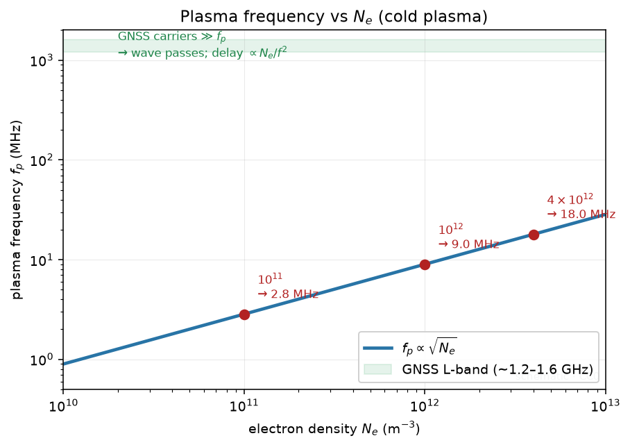
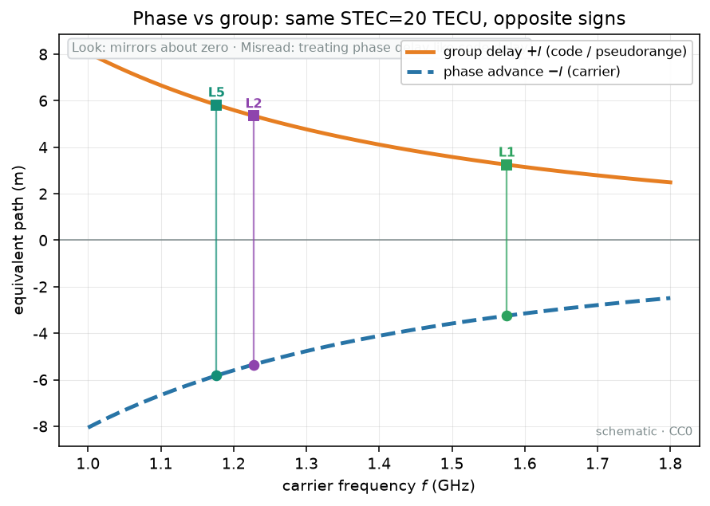
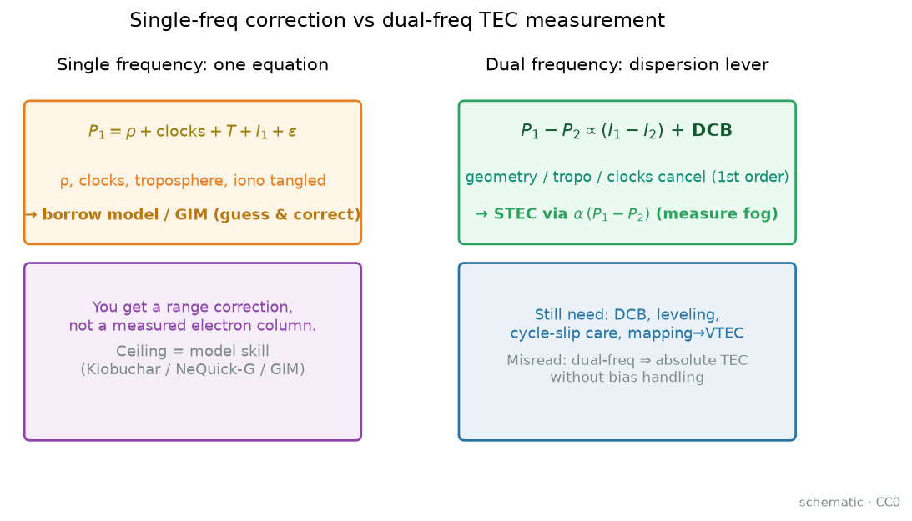

# 01 · 电离层是什么？TEC / STEC / VTEC 怎么从物理读到工程

> **课堂定位**：零基础第一课，但**不浅**。路线固定为四段：
> **机制 → 公式拆解（逐步推导）→ 观测签名 → 分析步骤**。
> 你会听到「雾」「水管」「尺子」类比；每条后面立刻配符号、单位与可追问的机制。
>
> **写给谁**：第一次碰到「电离层延迟」「TEC 图」的人；以及要用本仓库 `PROJECTS.json` 工具却还没建立量感的人。
>
> **学完交付**：指出电离层高度量级；区分 $N_e$ 与 TEC；默写 TECU；解释一阶群延迟每个符号；口头画出 $M(E)$ 与 IPP；用因果讲昼夜/纬度/太阳周期；完成带演算测验；能在 `PROJECTS.json` 点名若干真实工具。

---

## 0. 开场：三个真实场景

请先把手机锁屏，想三件事：

1. **导航漂了**：晴天郊外，单频轨迹几分钟漂十几米。有人说多路径，有人说「电离层活跃」。后者在砸什么？卫星信号穿过带电介质，自由电子让**群路径**变长；改正不准就进位置误差。双频可消一阶项，但你仍要懂 TEC，才能读残差、完好性与空间天气产品。
2. **领导要 TEC 图**：要的是某时刻某区域**竖直电子柱有多厚**（VTEC 场）。GNSS 直接给的却是斜路径 STEC。中间隔着映射与建图——本课先把「柱」说透；画图留给 [03](./03-gim-ionex.md)。
3. **单频能不能省钱**：单频 + 模型可以，但模型在猜延迟，延迟的一阶驱动是 TEC / $f^{2}$。不会区分「猜」和「测」，后面全盘对比都会歪。Klobuchar、NeQuick-G、IRI 给经验/广播答案；双频 GNSS 给观测答案。

**本课地图（请对照目录）：**

| 段落 | 你在学什么 | 类比 |
|---|---|---|
| §1 词表 | 先认名字 | 进厨房前认厨具 |
| §2–4 **机制** | 雾从哪来、为何是电子 | 谁开雾机、雾怎么散 |
| §5–8 **公式拆解** | 每个符号从哪来 | 把菜谱拆成一步一步 |
| §9–10 **观测签名** | 图上长什么样 | 监控录像怎么认人 |
| §11–15 **分析步骤** | 怎么用、别踩坑 | 值班清单与测验 |

配图均在 [`images/`](./images/)，版权见 [`images/SOURCES.md`](./images/SOURCES.md)。

---

## 1. 词表（先扫一遍，主讲后再回看）

### 1.1 大气与等离子体

| 术语 | 人话 | 稍严 |
|---|---|---|
| 对流层 | 呼吸、云雨那一层 | 约 0–10/18 km；GNSS 另有对流层延迟 |
| 平流层 / 中间层 | 民航巡航附近 / 再往上过渡 | 约 10–50 / 50–90 km |
| 热层 | 很稀、被太阳烤的高层 | 约 90 km 以上 |
| 电离层 | 被打出自由电子的带电区域 | 约 60–1000+ km 显著等离子体 |
| EUV / X 射线 | 太阳「打电子」的主光 | 极端紫外 / X 射线光致电离 |
| 自由电子 / 离子 | 影响电波的负电荷 / 丢掉电子的原子分子 | 共同构成准中性等离子体 |
| $N_e$ | 某点每立方米电子数 | 单位：m⁻³ |
| $f_p,\omega_p$ | 等离子体特征振荡频率 | $f_p\propto\sqrt{N_e}$ |

### 1.2 TEC 家族与几何

| 术语 | 人话 | 稍严 |
|---|---|---|
| TEC | 沿一条柱子把电子加总 | 路径积分电子含量 |
| STEC / VTEC | 斜着积 / 竖直等效 | Slant / Vertical TEC |
| TECU | TEC 的大包单位 | 1 TECU = 10¹⁶ m⁻² |
| 仰角 $E$ / 天顶角 | 抬离地平 / 离头顶 | E=0° 地平，90° 天顶 |
| IPP | 斜线戳到假定壳的点 | Ionospheric Pierce Point |
| 薄壳 / 映射 $M(E)$ | 假装挤成薄壳 / 斜↔竖因子 | 三维→壳上二维的压缩 |

### 1.3 波与 GNSS

| 术语 | 人话 | 稍严 |
|---|---|---|
| 相折射率 $n_p$ / 群折射率 $n_g$ | 相位尺子 / 能量（码）尺子 | 色散介质中二者不同 |
| 群延迟 / 相位超前 | 码变慢 / 相位超前 | 一阶符号相反 |
| 伪距 / 载波相位 | 粗糙有刻度 / 精密缺零点 | [02](./02-gnss-dualfreq-tec.md) 展开 |
| GIM / 闪烁 | 电子含量图 / 信号发抖 | 格点多为 VTEC；闪烁≠TEC |

**纪律**：未定义前禁止把 TEC 说成电子密度；STEC↔VTEC 必须提映射。

---

# 第一段 · 机制

> 目标：用「因果」讲清——雾从哪来、为何积分电子、为何昼夜/纬度/太阳周会变。公式只在需要时点名，完整推导留给第二段。

---

## 2. 大气分层：电离层不是「新盖的一层楼」

> 图源：本仓库自制示意，见 [`images/SOURCES.md`](./images/SOURCES.md)。请对照：对流层→平流层→中间层→热层；电离层是**状态命名**，不是新盖的楼。

> 图源：自制 Chapman 型廓线示意。教学上用「单峰随高度先升后降」建立 $N_e(h)$ 直觉；VTEC 是整柱积分，不是峰密度 NmF2。

请画地球圆弧，向外标高度。

**步骤 1 — 对流层（约 0–10/18 km）**  
我们生活的楼层。空气密、有天气。GNSS 信号穿过时，中性大气与水汽造成**对流层延迟**。关键对比：对流层在 L 波段几乎**不色散**（两频延迟几乎一样）；电离层**强烈色散**（$\propto 1/f^{2}$）。所以双频能「看见」电离层，却几乎消不掉对流层——这是后面几何无关组合只留电离层信息的物理前提之一。

**步骤 2 — 平流层（约 10–50 km）、中间层（约 50–90 km）**  
本课不展开臭氧化学与中间层动力学，只防止你以为「对流层上面直接就是电离层薄片」。白天 D 区电离可从约 60–90 km 开始出现，对高频吸收重要；对 GNSS L 波段一阶 TEC，D 区柱贡献通常远小于 F 区，但耀斑时可相对变显眼。

**步骤 3 — 热层（约 90 km 以上）**  
气体极稀，太阳 EUV 强。「稀」≠「不能电离」：粒子少，光子照样拆电子；碰撞对手少，复合也相对慢，电子能维持。F 区峰值常落在热层高度段。

**步骤 4 — 命名「电离层」**  
电离层不是物流公司新盖的楼，而是**原有高层大气进入电离状态**后单独命名的物理区域。约从 60 km 量级到 1000 km 以上；对 GNSS TEC 贡献最大的往往在 F2 峰附近（约 200–400 km 量级，随地方时、纬度、季节变）。再往上仍有电子（含等离子体层贡献），是否单独建模看应用。

**类比**：干空气是关着的雾机；太阳开机后出现带电雾——浓度随高度变，不是匀浆。E、F1、F2 等「层」是密度廓线上的峰/肩，不是水泥楼板。

> 图源：自制昼侧 $N_e(h)$ 示意。VTEC 是整柱积分；峰密度 NmF2 / 临界频率 foF2 才直接谈「某一层楼有多挤」。GNSS TEC **不是**直接测到 F2 峰密度。

---

## 3. 电离从哪里来？电子 vs 离子

### 3.1 三个必要条件（机制清单）

1. **有中性成分可电离**（O、N₂、O₂ 等）；  
2. **有电离能源**——主线是太阳 **EUV** 与 **X 射线**（光致电离）；高纬还有沉降粒子；  
3. **复合与输运没有快到让电子瞬间清零**。

**光致电离（人话）**：光子能量高于某成分电离能时，打出自由电子并留下正离子——像拆掉积木的一块，积木变成「带正电的骨架 + 自由电子」。  
EUV 对 F 区/E 区至关重要；硬 X 射线更容易在更低高度沉积（与 D 区相关）。夜晚光致电离几乎关掉，复合与化学过程让电子下降——但高层复合慢，夜侧仍可有可观 TEC。

**输运（别忽略）**：中性风、电场 $\mathbf{E}\times\mathbf{B}$ 漂移、扩散可以把电子「搬走」而不是就地产生/消灭。赤道喷泉就是输运塑造形态的经典例子（见 §9.2）。

### 3.2 为什么公式写 $N_e$，不是离子密度？

等离子体**准中性**：宏观上电子数密度 ≈ 正离子数密度。但无线电一阶折射里，关键是**质量小、对交变电场响应快**的自由电子：$m_e$ 远小于离子质量，同样电场下加速度大得多，对介电响应主导。

**厨房类比**：雾机喷出的「雾滴」里，真正让微波慢下来的是那些极轻、跟得上电场抖动的电子；重离子几乎跟不上——所以 TEC 定义为自由电子柱积分。

### 3.3 等离子体频率直觉（机制入口，正式推导见 §5）

电子越密，介质「自己喜欢振荡」的特征频率越高：

$$
\omega_p=\sqrt{\frac{N_e e^{2}}{\varepsilon_0 m_e}},\qquad f_p=\frac{\omega_p}{2\pi}.
$$

人话：$N_e$ 越高，$f_p$ 越高——雾越浓，特征振荡越快。数量级：$N_e\sim10^{11}$–$10^{12}$ m⁻³ 时 $f_p$ 约数 MHz 量级，远低于 GNSS 的 ~1.2–1.6 GHz。因此波能穿过（$f\gg f_p$），但折射率仍偏离 1，偏离量 $\propto f_p^{2}/f^{2}\propto N_e/f^{2}$。

> **看图**：纵轴 $f_p$ 随 $\sqrt{N_e}$ 上升；对照 GNSS 的 GHz 带远在上方。**误读**：把 $f_p$ 当成 GNSS 载波频率。

**课堂追问**：若某处 $N_e$ 突然高到 $f_p$ 接近载波频率，会发生什么？——反射/截止风险上升（短波通信常见；GNSS 正常电离层通常仍 $f\gg f_p$）。这帮助你理解「为什么公式里是 $N_e/f^{2}$ 这种结构」。

### 3.4 形态机制预告（细节与图见 §9）

| 形态 | 机制一句话 |
|---|---|
| 昼夜 | 白天 EUV 开、夜晚关；高层复合慢 → 夜侧不归零 |
| 赤道异常 (EIA) | 喷泉抬升 + 沿磁力线扩散 → 磁纬约 ±15°–20° 双峰 |
| 太阳周期 | EUV 流量随约 11 年升降 → 气候态 TEC 基线升降 |
| 扰动（预告） | 耀斑/磁暴/TID 改写「安静日形态」——专题见 19–23，本课只认长相 |

---

# 第二段 · 公式拆解（逐步推导）

> 目标：每个符号有单位、有人话、有「这一步在干什么」。不要背结论，要能复述推导链。

---

## 4. 公式路线图（先看全图，再逐步拆）

$$
N_e
\;\xrightarrow{\text{plasma}}\;
f_p,\omega_p
\;\xrightarrow{\text{A--H}}\;
n_p,n_g
\;\xrightarrow{\int\mathrm{d}s}\;
I(f)=\frac{40.3}{f^{2}}\,\mathrm{STEC}
\;\xrightarrow{\text{shell}}\;
\mathrm{STEC}\approx M(E)\,\mathrm{VTEC}.
$$

读法（中文在公式外）：电子密度 → 等离子体频率 → Appleton–Hartree 折射率 → 路径积分得群延迟 → 薄壳映射把斜路径钉到竖直图上。

---

## 5. 解剖台 A：等离子体频率——每个符号 + 数字

### 5.1 公式与符号表

$$
\omega_p=\sqrt{\frac{N_e\,e^{2}}{\varepsilon_0\,m_e}},\qquad f_p=\frac{\omega_p}{2\pi}.
$$

| 符号 | 含义 | 单位 / 典型值 |
|---|---|---|
| $N_e$ | 电子数密度 | m⁻³；F2 峰白天可取 $10^{11}$–$10^{12}$ |
| $e$ | 元电荷 | $1.602\times10^{-19}$ C |
| $\varepsilon_0$ | 真空介电常数 | $8.854\times10^{-12}$ F·m⁻¹ |
| $m_e$ | 电子质量 | $9.109\times10^{-31}$ kg |
| $\omega_p$ | 等离子体角频率 | rad/s |
| $f_p$ | 等离子体频率 | Hz（常说成 MHz） |

### 5.2 逐步数值例（建立量感）

取 $N_e=1.0\times10^{12}$ m⁻³（即 $10^{6}$ cm⁻³）：

1. $e^{2}\approx(1.602\times10^{-19})^{2}\approx2.566\times10^{-38}$；  
2. $\varepsilon_0 m_e\approx8.854\times10^{-12}\times9.109\times10^{-31}\approx8.065\times10^{-42}$；  
3. $e^{2}/(\varepsilon_0 m_e)\approx3.18\times10^{3}$；  
4. $N_e e^{2}/(\varepsilon_0 m_e)\approx3.18\times10^{15}$，开方得 $\omega_p\approx5.64\times10^{7}$ rad/s；  
5. $f_p=\omega_p/(2\pi)\approx9.0$ MHz。

**对照 GNSS**：L1 ≈ 1575 MHz，$f_1/f_p\approx175$，$X=(f_p/f_1)^{2}\approx3.3\times10^{-5}\ll1$，故可作微扰展开。  
**变密度**：若 $N_e\to4\times10^{12}$，则 $f_p\to18$ MHz，$X$ 变 4 倍，一阶 $n_g-1$ 也变 4 倍。

**类比**：雾越浓，雾机马达的「特征转速」越高；但 GNSS 载波仍远高于这个转速，所以波能过，只是略慢。

---

## 6. 解剖台 B：Appleton–Hartree → 相/群折射率（逐步）

### 6.1 完整公式在怕什么？我们保留什么？

完整 Appleton–Hartree 含：地磁场（电子回旋频率 $f_B$）、碰撞频率、波法向与磁场夹角、寻常/非常波。GNSS TEC 工程一阶主项，走**无磁场、无碰撞**极限已够用；地磁场带来的高阶/二阶项在精密应用才细抠。本课把一阶主项钉死。

### 6.2 从介电常数到折射率

真空中电磁波以 $c$ 传播。等离子体中，自由电子被电场加速，产生极化电流，等效相对介电常数小于 1：

$$
\varepsilon_r\approx1-\frac{\omega_p^{2}}{\omega^{2}}=1-X,\qquad X=\frac{f_p^{2}}{f^{2}}=\frac{\omega_p^{2}}{\omega^{2}}.
$$

| 符号 | 含义 |
|---|---|
| $\varepsilon_r$ | 相对介电常数（无量纲） |
| $X$ | 无量纲等离子体参数 |
| $f$ | 载波频率（Hz）；$\omega=2\pi f$ |

折射率 $n=\sqrt{\varepsilon_r\mu_r}$（非磁介质 $\mu_r\approx1$）于是：

$$
n_p=\sqrt{1-X}.
$$

当 $X\to1$（$f\to f_p$），$n\to0$，波难以穿透——短波垂直探测的「临界频率」故事就在这里。GNSS 工作在 $X\ll1$ 的微扰区：波能过，但迟到一点点。

### 6.3 二项式展开（逐步）

因 $X\ll1$：

$$
n_p=\sqrt{1-X}=1-\frac{X}{2}-\frac{X^{2}}{8}-\cdots\approx1-\frac{X}{2}=1-\frac{1}{2}\frac{f_p^{2}}{f^{2}}.
$$

把 $f_p^{2}=N_e e^{2}/(4\pi^{2}\varepsilon_0 m_e)$ 代入，并整理常数，工程上写成：

$$
n_p\approx1-\frac{40.3\,N_e}{f^{2}}.
$$

系数 **40.3**（约 $40.3\,\mathrm{m}^{3}\mathrm{s}^{-2}$）来自 $e^{2}/(8\pi^{2}\varepsilon_0 m_e)$ 等常数组合；当 $N_e$ 用 m⁻³、$f$ 用 Hz 时，$40.3 N_e/f^{2}$ 无量纲。

### 6.4 群折射率：码为什么「变慢」？

色散介质中，群速度对应信息/能量传播。群折射率定义：

$$
n_g=n_p+f\frac{\partial n_p}{\partial f}.
$$

对 $n_p\approx1-\frac{1}{2}f_p^{2}/f^{2}$（$f_p$ 与 $f$ 无关的冷等离子体近似）：

$$
\frac{\partial n_p}{\partial f}=+\frac{f_p^{2}}{f^{3}}
\implies
f\frac{\partial n_p}{\partial f}=+\frac{f_p^{2}}{f^{2}}.
$$

于是

$$
n_g\approx\left(1-\frac{1}{2}\frac{f_p^{2}}{f^{2}}\right)+\frac{f_p^{2}}{f^{2}}=1+\frac{1}{2}\frac{f_p^{2}}{f^{2}}\approx1+\frac{40.3\,N_e}{f^{2}}.
$$

### 6.5 对照表（钉死符号）

| 量 | 一阶结果 | 对 GNSS 观测的含义 |
|---|---|---|
| $n_p-1$ | $-\,40.3 N_e/f^{2}$ | 相路径变短 → **相位超前** |
| $n_g-1$ | $+\,40.3 N_e/f^{2}$ | 群路径变长 → **码/伪距延迟** |

**同一份电子柱，一阶码延迟与相位超前符号相反。** 这不是口诀炫技，是色散关系的直接推论；[02](./02-gnss-dualfreq-tec.md) 观测方程会写成 $+I$ 与 $-I$。

**尺子类比**：相位尺子被电子「往前拽」一点；码（能量）尺子被电子「往后拖」一点——两把尺子读数相反，但都在汇报同一份雾。

> **看图**：两条曲线关于零线镜像，$\propto 1/f^{2}$。**误读**：把相位「延迟」和码延迟当成同号。

### 6.6 迷你数值（局部均匀段，只练感觉）

取 $f_p=9$ MHz，$f=1575.42$ MHz，$X=(9/1575.42)^{2}\approx3.26\times10^{-5}$。  
则 $n_g-1\approx X/2\approx1.63\times10^{-5}$。  
若路径上等效均匀段长 $L=200$ km $=2\times10^{5}$ m（仅示意），多余群路径 $\approx(n_g-1)L\approx3.3$ m。真实要用 $\int N_e\,\mathrm{d}s$，不能假设整段均匀——此处只练「小 $X$ 也能积出米级延迟」。

---

## 7. 解剖台 C：路径积分 → STEC → 一阶群延迟

### 7.1 STEC 与 TECU

$$
\mathrm{STEC}=\int_{\mathrm{receiver}}^{\mathrm{sat}} N_e(s)\,\mathrm{d}s\quad[\mathrm{m}^{-2}],
\qquad
1\,\mathrm{TECU}=10^{16}\,\mathrm{m}^{-2}.
$$

人话：横截面积 1 m² 的柱子里，电子按 $10^{16}$ 一包数。32 TECU = $3.2\times10^{17}$ m⁻²。

**VTEC**：沿当地天顶的柱积分；在薄壳流程里，更常是由斜路径映射得到的**等效**竖直量——措辞要诚实。

**电子密度 vs TEC**：

| | $N_e(h)$ | TEC |
|---|---|---|
| 人话 | 某一楼层每立方米多少人 | 从一楼走到顶，把一路的人按规则加总 |
| 单位 | m⁻³ | m⁻²（或 TECU） |
| 谁更常直接给 | 测高仪 / 雷达 / 掩星廓线 | GNSS 双频路径积分 |

把 GNSS TEC 说成「测到了 F2 峰密度」是口误。

### 7.2 水管与雾（主类比，配符号）

| 类比 | 符号 |
|---|---|
| 水管 | 站星视线路径 |
| 雾浓度 | $N_e$ |
| 管内雾总量 | STEC |
| 竖直水管 | VTEC |
| 雾挤在某一楼层薄壳 | 薄壳假设，壳高 $H$ |
| 斜管与壳交点 | IPP |
| 水流变慢 | $I_{\mathrm{group}}$ |
| 碎涡乱闪 | 闪烁（见 [05](./05-scintillation-roti.md)） |

### 7.3 一阶群延迟（等效距离）

$$
I_{\mathrm{group}}(f)=\int(n_g-1)\,\mathrm{d}s
\approx\frac{40.3}{f^{2}}\int N_e\,\mathrm{d}s
=\frac{40.3}{f^{2}}\,\mathrm{STEC}.
$$

| 符号 | 含义 | 单位 |
|---|---|---|
| $I_{\mathrm{group}}$ | 电离层一阶群延迟（等效距离） | m |
| $f$ | 载波频率 | Hz |
| $40.3$ | 常数系数 | m³·s⁻² 量级 |
| $N_e(s)$ | 路径上电子数密度 | m⁻³ |
| $\mathrm{d}s$ | 路径微元 | m |
| $\mathrm{STEC}$ | $\int N_e\,\mathrm{d}s$ | m⁻² |

**推论**：同一路径同一 STEC，$f$ 越低延迟越大；两频延迟差携带 STEC——双频测 TEC 的根。单频没有第二把尺子，只能用模型猜 $I$。

### 7.4 系数 40.3 与单位陷阱

把

$$
\frac{1}{2}\frac{f_p^{2}}{f^{2}}=\frac{1}{2}\cdot\frac{N_e e^{2}}{4\pi^{2}\varepsilon_0 m_e}\cdot\frac{1}{f^{2}}
$$

中的物理常数收成一个数，得到工程常用的 $40.3\,N_e/f^{2}$。考试若被问「40.3 是什么」，合格答法是：**由元电荷、电子质量、真空介电常数等组合而成的系数，使 $N_e$（m⁻³）与 $f$（Hz）代入后给出无量纲的折射率改正，再沿路径积分得到米级延迟。** 不要假装它是「随便取的整数」。

文献里也能见到 $40.308$，或把 STEC 用 TECU、频率用 GHz 改写的等价形式，例如：

$$
I[\mathrm{m}]\approx\frac{40.3}{f_{\mathrm{Hz}}^{2}}\cdot(\mathrm{STEC}_{\mathrm{m}^{-2}})
=\frac{0.403}{f_{\mathrm{GHz}}^{2}}\cdot(\mathrm{STEC}_{\mathrm{TECU}}).
$$

（请自己核对单位：$10^{16}$ 与 GHz 换算会改变数值前因子）。**读软件时以该软件文档的单位约定为准**，不要混用两套前因子。本课统一：$f$ 用 Hz，STEC 用 m⁻²，系数 40.3。

### 7.5 配图 + L1/L2/L5 数值表

> 图源：本仓库按 $I\approx 40.3\cdot\mathrm{STEC}/f^{2}$ 计算绘制，见 [`images/SOURCES.md`](./images/SOURCES.md)。频率越低，同一 STEC 的延迟越大——色散的可视化。

> 图源：自制示意。L1/L2/L5 等落在 GHz 量级；同一 STEC 下频率越低延迟越大（$\propto 1/f^{2}$）——与上图同一物理。

> 图源：自制示意。$P_1-P_2$ 消去公共几何，留下色散项（及 DCB）。细节见 02 课。

> 图源：自制示意。未改正 DCB ≈ 整条 STEC 曲线整体平移数 TECU；本课先认长相，标定见 [09](./09-dcb-biases-deep.md)。

取 $\mathrm{STEC}=10^{17}\,\mathrm{m}^{-2}=10\,\mathrm{TECU}$：

| 频率 | $f$ (Hz) | $f^{2}$ | $I\approx40.3\times10^{17}/f^{2}$ |
|---|---|---|---|
| L1 | $1.57542\times10^{9}$ | $2.482\times10^{18}$ | ≈ 1.62 m |
| L2 | $1.22760\times10^{9}$ | $1.507\times10^{18}$ | ≈ 2.67 m |
| L5 | $1.17645\times10^{9}$ | $1.384\times10^{18}$ | ≈ 2.91 m |

**验算比例**：$I_2/I_1=(f_1/f_2)^{2}=(1575.42/1227.60)^{2}\approx1.647$，且 $1.62\times1.647\approx2.67$，吻合。  
**若 STEC=35 TECU**：各 $I$ 乘 3.5 → L1 约 5.7 m，L2 约 9.3 m。差额 $I_2-I_1$ 就是几何无关组合「能看见」的东西（还混着偏差，见 02 课）。

### 7.6 为何双频能测、单频只能猜？（方程预告）

> **看图要点**：同一份真延迟，单频模型只能贴近；双频用第二把尺子直接量。图源：自制 CC0。

> **看图**：左=一项方程缠死；右=色散差分抽出雾柱。**误读**：以为单频模型改正等于「测到了 TEC」。

单频伪距（极简）：

$$
P_1=\rho+c(\mathrm{d}t-\mathrm{d}T)+T_{\mathrm{trop}}+I_1+\varepsilon_1,
$$

其中 $\rho$ 几何距离，钟差、对流层、电离层缠在一起。只有一个方程，无法分离 $I_1$。

双频有 $I_2=(f_1^{2}/f_2^{2})I_1$（同一 STEC），于是 $P_1-P_2$ 中 $\rho$、对流层、钟差（一阶公共）消掉，留下与 STEC 成比例的项——这是 02 课几何无关的预告。

> 图源：自制示意。本课只需记住「两把尺子差分消公共项、留下色散项」；完整观测方程与 DCB 见 02 课。

### 7.7 高阶项课堂上怎么诚实表态？

一阶 $\propto1/f^{2}$ 是主食。地磁场、弯曲路径、$1/f^{3}$ 等项是配菜。对大多数入门 TEC 估计与单频改正，一阶够用；对精密定位与某些空间天气极端条件，才需要声明「残差里可能有高阶」。本课不把高阶公式摊开，但要求你以后看到「一阶电离层」六个字时知道：作者在说 $40.3\,\mathrm{STEC}/f^{2}$ 这一层。

---

## 8. 解剖台 D：薄壳映射 $M(E)$ 与 IPP

> 图源：本仓库自制示意，见 [`images/SOURCES.md`](./images/SOURCES.md)。斜水管穿薄壳 → IPP；竖直雾厚 = VTEC；斜管总量 ≈ $M(E)\times$ VTEC。

> 图源：自制示意。视线与薄壳交点 = IPP；VTEC 挂在 IPP，不是挂在测站正上方。IPP **一般不是**卫星星下点。

> **看图**：仰角越低 $M$ 越大；约 15° 以下陡升。**误读**：全程当 $M\approx1$。

> **看图**：红线=斜水管 STEC；紫点=IPP 钉到竖柱。**误读**：口头说 VTEC 却忘了先映射。

> 图源：自制计算示意。天顶附近 $M\approx1$；低仰角 $M$ 陡增——几何放大，不是「雾突然变厚」。壳高差会改映射与 IPP 位置。

### 8.1 几何逐步推

1. 地球半径 $R_E\approx6371$ km；壳高 $H$（常见 350–450 km，**以产品为准**）。  
2. 接收机在地面；卫星仰角 $E$；视线与半径 $R_E+H$ 的球壳相交 → **IPP** 的经纬与时间。  
3. 在 IPP，视线相对当地竖直的天顶角为 $z'$。球面几何：

$$
\sin z'=\frac{R_E}{R_E+H}\cos E.
$$

4. 映射函数（斜路径相对竖直的放大）：

$$
M(E)=\frac{1}{\cos z'}=\left(1-\left(\frac{R_E}{R_E+H}\cos E\right)^{2}\right)^{-1/2},
$$

$$
\mathrm{STEC}\approx M(E)\cdot\mathrm{VTEC}_{\mathrm{IPP}}.
$$

**几何直觉：**

- **A**：固定当地竖直雾厚 = VTEC。  
- **B**：卫星在天顶，$E=90°$，$\cos E=0$，$z'=0$，$M=1$，STEC≈VTEC。  
- **C**：卫星往地平倒，斜管变长，$M>1$，STEC 变大。  
- **D**：低仰角不仅 $M$ 大，多路径、水平梯度、壳高敏感也放大 → 设截止仰角（常见 10°–20° 量级，视应用）。  
- **E**：两家软件壳高差 50 km，低仰角 IPP 水平位置与 $M$ 都可能差一截——比 VTEC 前先对齐假设。

### 8.2 三仰角 + 三壳高对照表

取 $R_E=6371$ km，$H=450$ km，$R_E/(R_E+H)\approx0.934$：

| 仰角 $E$ | $\cos E$ | $\sin z'$ | $\cos z'$ | $M(E)$ | 若 VTEC=15 TECU，STEC≈ |
|---|---|---|---|---|---|
| 90° | 0 | 0 | 1 | 1.00 | 15.0 |
| 60° | 0.500 | 0.467 | 0.884 | 1.13 | 17.0 |
| 30° | 0.866 | 0.809 | 0.588 | 1.70 | 25.5 |
| 15° | 0.966 | 0.902 | 0.431 | 2.32 | 34.8 |
| 10° | 0.985 | 0.920 | 0.392 | 2.55 | 38.3 |

**读表训练**：仰角从 90° 降到 15°，同样 VTEC=15，斜路径 STEC 从 15 涨到约 35——不是电离层「突然变厚了一倍多」，而是**几何放大**。若你不懂 $M$，会把低仰角的几何效应讲成空间天气事件。

壳高敏感（固定 $E=25°$，$\cos 25°\approx0.9063$）：

| $H$ (km) | $R_E/(R_E+H)$ | $\sin z'$ | $\cos z'$ | $M$ | VTEC=18 时 STEC |
|---|---|---|---|---|---|
| 350 | 0.948 | 0.859 | 0.512 | 1.953 | 35.2 |
| 450 | 0.934 | 0.847 | 0.532 | 1.880 | 33.8 |
| 550 | 0.920 | 0.834 | 0.552 | 1.812 | 32.6 |

同一仰角同一 VTEC，壳高从 350→550 km，STEC 估测差约 2.6 TECU。低仰角时差更大。

### 8.3 薄壳的香与臭

- **香**：降维；全球建模、IONEX、实时播发变可行。  
- **臭**：真实电子有厚度、可多层、可强梯度；扰动期误差放大。  
- **三问**：壳高？映射形式？仰角截止？三问不清，没有资格百分比对比「我的 VTEC vs 官方 GIM」。

本仓库 `Get_IPP`（已核验）帮你算穿刺点几何，不自动等于 TEC 流水线完成。

> **看图要点**
> - **看什么**：多站–星视线在薄壳上的穿刺点如何铺到海岸线地理上，而不是挂在测站正上方。
> - **别误判**：轨迹密度≠当地 VTEC 真值；稀钉区颜色仍可能靠外推。
> 图源：自制示意场 + Natural Earth 海岸线（非实测）。现象细读见 19–23。

---

# 第三段 · 观测签名

> 目标：看见图/时间序列时，能说出「这是什么长相、因果是什么、别和什么搞混」。  
> 深度现象分析剧本留给 [19–23](./19-phenomena-overview.md)；本课只建立**第一眼签名**。

---

## 9. 安静日形态签名（昼夜 · 纬度 · 太阳周）

### 9.1 昼夜：能源开关 + 复合时标

> 图源：自制示意。昼侧整体更高、双峰（EIA）更醒目；夜侧整体偏低但仍非零——提醒先认「气候日变化」，再谈扰动差分。

**观测签名：**

| 看什么 | 安静日常见长相 |
|---|---|
| 单站 VTEC 日变化 | 正午前后升高，夜间下降，但夜里常仍有数 TECU |
| 全球图 | 昼夜分界大体跟**地方时**走，不是跟 UTC 钟面走 |
| 因果 | 白天 EUV/X 开 → 产生率高；夜间产生≈0，复合主导；F 区高层复合慢 |

**别误读**：夜里 TEC≈0 是神话；等离子体层/管贡献、中纬谷、极光粒子沉淀都会改写夜侧。

> **看图要点**
> - **看什么**：对照海岸与低纬带，先认日侧高、夜侧低与 EIA 双峰雏形落在哪片洋/陆。
> - **别误判**：示意场非某日实测 GIM；勿把平滑色块读成泡丝或风暴锋。
> 图源：自制示意场 + Natural Earth 海岸线（非实测）。现象细读见 19–23。

### 9.2 纬度：赤道异常（EIA）双峰

> 图源：自制示意。赤道附近电场把等离子体向上抬升，再沿磁力线向南北扩散。

> 图源：自制示意。磁纬约 ±15°–20° 两侧 TEC 驼峰；下午地方时常常很显眼。

**观测签名：**

| 看什么 | 长相 |
|---|---|
| 低纬 TEC 地图 | 赤道两侧两个亮带（双峰），中间相对槽 |
| 时间 | 下午地方时常最显眼 |
| 因果 | 东向电场 → $\mathbf{E}\times\mathbf{B}$ 抬升 → 沿磁力线扩散 |

**别误读**：「纬度越高 TEC 越小」不是定律；只在地理赤道取一个点的时间序列，可能错过驼峰主体。中纬日变化相对规矩；高纬另有粒子沉降与对流电场（机制不同）。

### 9.3 太阳周期与季节

**观测签名**：同一日历日、相似地磁安静条件，太阳活动高年全球 TEC 基线往往更高。  
**因果链**：光子流量（可用 F10.7 等代理）→ 光致电离率 → $N_e$ 廓线 → 柱积分。  
季节：太阳天顶角与中性大气成分（如 O/N₂）季节变化，改变产生率与损失率。对比两张 GIM 时，先问是在比「天气」还是「气候」。

### 9.4 扰动长相预告（本课只认脸，不跑剧本）

| 扰动 | 第一眼签名 | 专题课 |
|---|---|---|
| 耀斑 | 日侧短时 TEC 突增（分钟级），常伴低高度电离 | [23](./23-flare-eclipse-special.md) |
| 磁暴 | 区域可正可负（正相/负相），强烈依赖地方时与纬度 | [20](./20-storm-tec-analysis.md) |
| TID | TEC 场上波纹扫过 | [22](./22-tid-traveling-disturbances.md) |
| 赤道泡 | 夜侧耗空通道 + 常伴 ROTI/闪烁升高 | [21](./21-equatorial-anomaly-bubbles.md) |

**分析纪律**：**没有安静日基线，就没有资格说「增强了 30%」**。

### 9.5 TEC 大 ≠ 闪烁强

闪烁看的是小尺度不规则性（信号发抖），不是柱含量大小。高 TEC 安静等离子体可以几乎不闪；低平均 TEC 的陡梯度泡壁可以猛闪。详见 [05](./05-scintillation-roti.md)。

---

# 第四段 · 分析步骤

> 目标：给你一套可执行的值班清单——从「看见延迟/TEC」到「对上仓库工具」，并完成演算过关。

---

## 10. 分析步骤清单（从物理量到产品）

遇到「电离层 / TEC」相关任务时，按顺序问：

1. **问物理量**：对方要的是 $N_e$ 廓线、STEC、还是格点 VTEC？单位是 m⁻² 还是 TECU？  
2. **问路经几何**：单站斜路径？多站建图？仰角截止多少？壳高与映射写明了吗？  
3. **问观测手段**：双频 GNSS（测）还是单频+模型（猜）？有没有第二频？  
4. **问偏差**：DCB、周跳、码相 leveling 是否处理？（细节进 02 / 09）  
5. **问对照**：谈「增强/减弱」时，安静对照日是谁？地方时对齐了吗？  
6. **问假象**：低仰角 $M$ 放大？单位前因子混用？把 STEC 当 VTEC？把闪烁当 TEC？  
7. **问工具**：在本仓库 `PROJECTS.json` 点名真实 `name`（见下表），读上游 README。

**误读训练题（口答）**：仰角从 90°→20°，$M:1\to\sim2$。若 VTEC 不变 = 20 TECU，STEC 从 20→40。不懂映射的人会喊「TEC 翻倍的扰动」——其实是几何。

---

## 11. 常见误解专节

| # | 误解 | 打假 |
|---|---|---|
| A | TEC = 电子密度 | 积分 vs 局地 |
| B | STEC、VTEC 随便换 | 必须 $M(E)$；低仰角更险 |
| C | GIM 读数 = 我的站星 STEC | GIM 多为格点 VTEC；需插值+映射 |
| D | TEC 大 ⇒ 闪烁强 | 闪烁看不规则性；见 `05-scintillation-roti.md` |
| E | 薄壳是自然定律 | 工程压缩 |
| F | 夜里 TEC≈0 | 常降，不归零 |
| G | 对流层延迟用 TEC 公式改 | 机制与色散都不同 |
| H | 开源 TEC = IGS 官方 | DCB/周跳/壳高不同 |
| I | 负 TEC = 负电子 | 先查周跳、DCB、单位、符号 |
| J | 高仰角 ⇒ 映射完美 | 更舒服≠零误差 |
| K | TECU 是 SI 基本单位 | 实用单位，像「万人」 |
| L | 相位超前说明延迟公式写错了 | 群/相本就符号相反 |

---

## 12. 和本仓库工具对上号

下列 `name` 均已对照根目录 `PROJECTS.json` 核验存在。本仓是索引，不内嵌上游完整源码。

| 你想做的事 | name |
|---|---|
| 从 GNSS 估 TEC | `gnss-tec`、`pygnss-tec`、`tec-suite`、`Seemala-GPS-TEC`、`Okoh-MATLAB-TEC-from-RINEX`、`IONOLAB-TEC-Software`、`TEC-calculation-MATLAB`、`ionotec`、`PyTECGg`、`TEC_calculation_RINEX3` |
| 穿刺点 | `Get_IPP` |
| 可视化/小工具 | `vtec`、`IonoMoni`、`ionopy` |
| IONEX 入口 | `CDDIS-IONEX`、`JPL-IONEX-Rapid`、`UPC-IONEX-Archive`、`ionex`、`ionex_reader` |
| 分析中心/产品 | `CODE-AIUB-Analysis-Center`、`WHU-IGS-Ionosphere-AC`、`GFZ-Global-Ionosphere-Maps`、`IGS-Ionosphere-WG`、`ROB-IONEX-Products`、`INPE-TEC-Maps-IONEX`、`ESA-TIO-NRT-TEC`、`NOAA-SWPC-GloTEC`、`CAS-BDsmart-Iono-Products` |
| GIM 相关开源线索 | `SH-GIM`、`mosgim` |
| 经验模型预告 | `IRI-2020-package`、`iri2020`、`Galileo-NeQuick-G`、`Klobuchar-study-code` |

流程细节 → [02-gnss-dualfreq-tec.md](./02-gnss-dualfreq-tec.md)；读 IONEX → [03-gim-ionex.md](./03-gim-ionex.md)。

**别做**：把本索引仓当数据中心；混用 A 的 STEC 与 B 的 VTEC 却不声明映射；未懂 TECU 就改他人尺度因子。

---

## 13. 课堂测验（带演算的完整答案）

> **阅读提示：** 请在 github.com 网页预览本文。下面答案刻意写成纯文本，避免公式块在测验区露源码。

**题 1.** 定义 STEC 并写积分式；TECU 定义。  
**答：** STEC = ∫ Nₑ ds（单位 m⁻²）；1 TECU = 10¹⁶ m⁻²。

**题 2.** 写出 I ≈ (40.3 / f²) · STEC。f 加倍，I 如何变？若 STEC 从 10 增到 40 TECU（f 不变），I 如何变？  
**答：** f → 2f ⇒ I → I/4；STEC ×4 ⇒ I ×4。

**题 3.** 用 n_g 与 n_p 各一句说明码延迟与相位超前为何一阶符号相反。  
**答：** n_g − 1 > 0（群路径变长，码延迟）；n_p − 1 < 0（相路径变短，相位超前）。

**题 4.** 仰角 E=30°，R_E=6371 km，H=450 km。计算 sin z′、cos z′、M(E)（三位小数）。若 IPP 处 VTEC=20 TECU，STEC 约多少？  
**答：** cos30°≈0.866；R_E/(R_E+H)=6371/6821≈0.934；sin z′≈0.809；cos z′≈0.588；M≈1.701；STEC≈34.0 TECU。

**题 5.** 天顶时 M 等于多少？为何低仰角要截止？  
**答：** M=1。低仰角 M 大，且多路径/水平梯度/壳高误差一起放大。

**题 6.** IPP 是卫星星下点吗？薄壳「壳」指什么？三问是什么？  
**答：** 一般不是。壳 = 假定高度 H 的电子薄球壳。三问：壳高、映射、仰角截止。

**题 7.** 用因果解释：白天 TEC 常更高；太阳活动高年气候态 TEC 常更高；低纬下午常现双峰。  
**答：** 白天电离源打开；高年 EUV 更强→产生率高；赤道喷泉+沿磁力线扩散形成 EIA 驼峰。

**题 8.** f_p ∝ √N_e。当 N_e → 4 N_e（f 固定）时，f_p 与 (n_g−1) 各如何变？  
**答：** f_p → 2 f_p；n_g−1 ∝ N_e → 变为 4 倍。

**题 9.** TEC 大是否等于闪烁强？对流层延迟能否用 TEC 公式改？GIM 格点常见给 STEC 还是 VTEC？  
**答：** 否；不能；多为 VTEC。

**题 10.** 指出两个 RINEX→TEC 的 name、两个 IONEX 相关 name（须真实存在于本仓）。  
**答：** 例：`gnss-tec`、`Seemala-GPS-TEC`；`CDDIS-IONEX`、`ionex`（以仓内实际条目为准）。

**题 11.** 取 L1，STEC=10 TECU，课文近似 I₁≈1.62 m。若某单频用户未改正，这笔延迟主要污染什么？双频消掉一阶后还要不要懂 TEC？  
**答：** 主要污染伪距/定位（等价距离误差）。要：残差、DCB、周跳、映射与空间天气解释仍依赖 TEC 概念。

**题 12.** 看见中纬某站 VTEC=500 TECU 的白天安静图，先怀疑什么？还要核对什么？  
**答：** 先怀疑单位/映射/DCB/码相组合搞错；再核对数据源、仰角截止与处理选项。

**题 13.** $N_e=5\times10^{11}$ m⁻³。相对课文例（$10^{12}$ 时 $f_p\approx9$ MHz），$f_p\approx?$  
**答：** ∝√N_e，故 9/√2≈6.4 MHz。

**题 14.** STEC=25 TECU，用比例法算 L1、L2 的 I（以 10 TECU 时 I₁≈1.62 m、I₂≈2.67 m）。  
**答：** ×2.5 → I₁≈4.05 m，I₂≈6.68 m。

---

## 14. 综合演算作业（建议限时 25 分钟）

某中纬测站，某历元跟踪一颗 GPS 卫星，仰角 $E=40°$。设壳高 $H=400$ km，$R_E=6371$ km。由双频（假设已完美改正偏差与模糊度，本课只练几何与延迟）得到 STEC = 28.0 TECU。

**(1)** 计算 $M(E)$ 与 IPP 处等效 VTEC。  
**(2)** 估算 L1 与 L2 一阶群延迟（米）。取 $f_1=1575.42$ MHz，$f_2=1227.60$ MHz，$I=40.3\cdot\mathrm{STEC}/f^{2}$（STEC 用 m⁻²）。  
**(3)** 若有人把 28 TECU 直接当成 VTEC 填进地图，错在哪里？误差大约多少 TECU？

**参考答案（纯文本）：**

(1) cos40°≈0.766；R_E/(R_E+H)=6371/6771≈0.941；sin z′≈0.721；cos z′≈0.693；M≈1.443。  
VTEC≈STEC/M≈28.0/1.443≈19.4 TECU。

(2) STEC=2.8×10¹⁷ m⁻²。  
I₁≈40.3×2.8×10¹⁷/(1.57542×10⁹)²≈4.55 m。  
I₂≈40.3×2.8×10¹⁷/(1.22760×10⁹)²≈7.49 m。

(3) 错在把斜路径值当竖直值；偏高约 8.6 TECU（28.0−19.4；相对真等效 VTEC 约 44%）。低仰角时这类错误更夸张。

---

## 15. 板书六行 · 符号速查 · 口述检查

**板书六行：**

1. 电离层=高层带电状态；能源主线 EUV/X。  
2. $f_p\propto\sqrt{N_e}$；GNSS 仍有 $N_e/f^{2}$ 色散。  
3. Appleton–Hartree 无磁极限 → $n_g\approx1+40.3 N_e/f^{2}$，$n_p\approx1-40.3 N_e/f^{2}$。  
4. $I\approx(40.3/f^{2})\,\mathrm{STEC}$；1 TECU = 10¹⁶ m⁻²。  
5. $\mathrm{STEC}\approx M(E)\,\mathrm{VTEC}$；IPP+薄壳是压缩。  
6. 形态=能源+输运：昼夜、EIA、太阳周期。

**符号速查卡：**

$$
\omega_p=\sqrt{\frac{N_e e^{2}}{\varepsilon_0 m_e}},\quad
n_p\approx1-\frac{40.3 N_e}{f^{2}},\quad
n_g\approx1+\frac{40.3 N_e}{f^{2}},
$$

$$
I_{\mathrm{group}}\approx\frac{40.3}{f^{2}}\,\mathrm{STEC},\quad
\mathrm{STEC}=\int N_e\,\mathrm{d}s,\quad
1\,\mathrm{TECU}=10^{16}\,\mathrm{m}^{-2},
$$

$$
\sin z'=\frac{R_E}{R_E+H}\cos E,\quad
M(E)=\frac{1}{\cos z'},\quad
\mathrm{STEC}\approx M(E)\,\mathrm{VTEC}_{\mathrm{IPP}}.
$$

**口述检查（任抽三问）：**

1. 为什么公式积分的是电子不是离子？  
2. $n_g$ 与 $n_p$ 谁大于 1、谁小于 1（一阶）？  
3. 写出 $M(E)$ 并解释天顶极限。  
4. 给一个「几何放大被误读成空间天气」的例子。  
5. 说出本仓两个估 TEC 的 `name`。  
6. EIA 双峰的机制一句话？

合格标准：能讲机制，不只能背缩写。合上笔记画出地球、壳高、接收机、卫星、斜线、IPP、竖柱与斜柱，并用两分钟讲清「为何 $\propto$ TEC / $f^{2}$」。

---

## 16. 与后续课的接口

| 你现在会的 | 下一课才会的 | 不要提前假装会 |
|---|---|---|
| $I\propto\mathrm{STEC}/f^{2}$ | 如何从 $P_1,P_2$ 解出 STEC | 「我已经测到真 TEC」 |
| $M(E)$、IPP | 多站建 GIM、IONEX 字段 | 「彩图 = 真值」 |
| 形态因果与第一眼签名 | 耀斑/暴/TID/泡专题分析流程 | 「活跃」二字交差 |
| 点名 `gnss-tec` 等 | DCB、周跳、平滑参数 | 不问 README 就发论文图 |

你现在握的是尺子刻度的名字与物理根，还不是测量工艺。没有 DCB、周跳、RINEX 类型对齐，就谈不上可靠 STEC——请带着问题进 02 课。

---

## 17. 下一课预告与出门任务

**[02-gnss-dualfreq-tec.md](./02-gnss-dualfreq-tec.md)**：码与相位观测方程；符号相反如何写入；几何无关逐步推导与假但真实的 L1/L2 数字；模糊度、leveling/平滑；DCB 进入 GF 的预告方程；RINEX→STEC 全清单与失效模式。

**出门任务**：向他人讲清延迟为何 $\propto$ TEC / $f^{2}$，必须提到 $n_g-1$ 与路径积分；若对方能复述「频率平方在分母、码相符号相反」，本课及格。

**版本说明**：本文件按「机制 → 公式拆解 → 观测签名 → 分析步骤」重写；嵌入大气分层、Ne 剖面、延迟–频率、薄壳、日夜、喷泉/EIA、双频预告等自制图；引用项目名均来自 `PROJECTS.json` 核验。现象课 19–23 保持独立短文，不回灌成长文墙。

（完）
