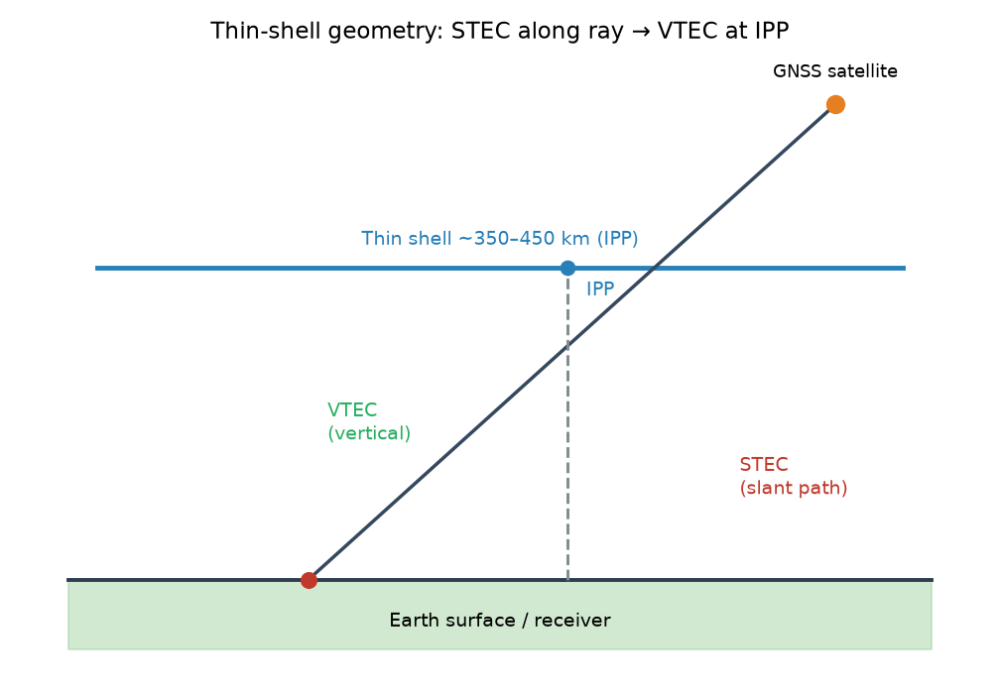
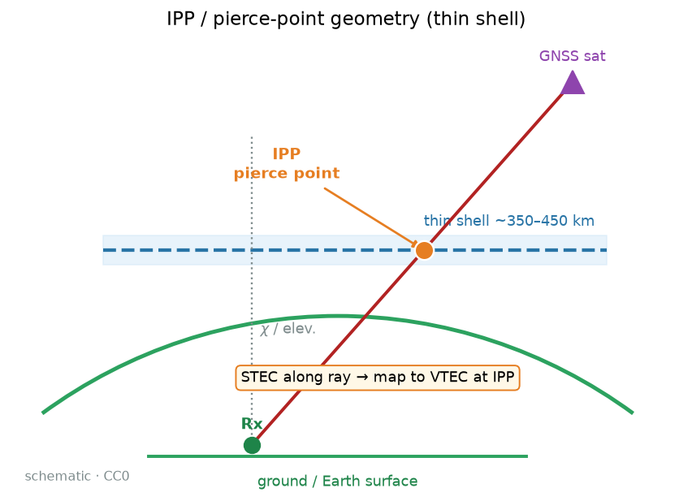
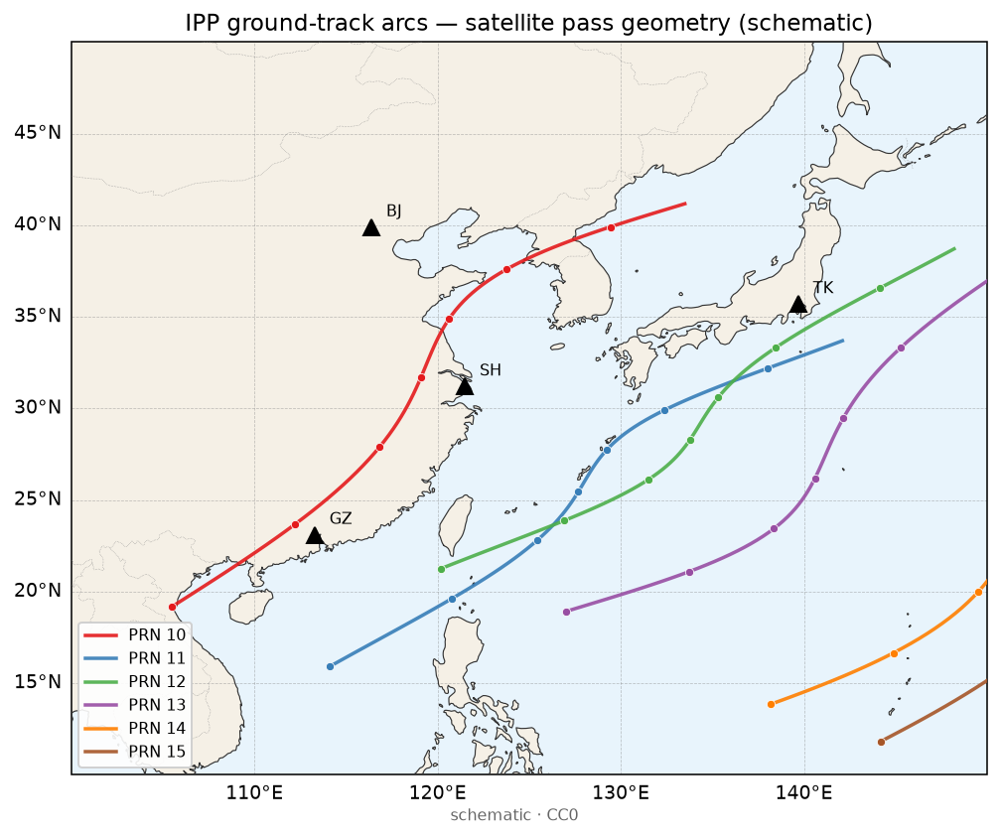
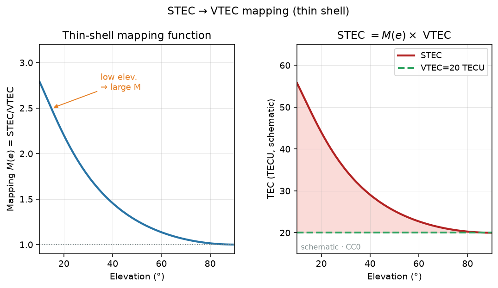
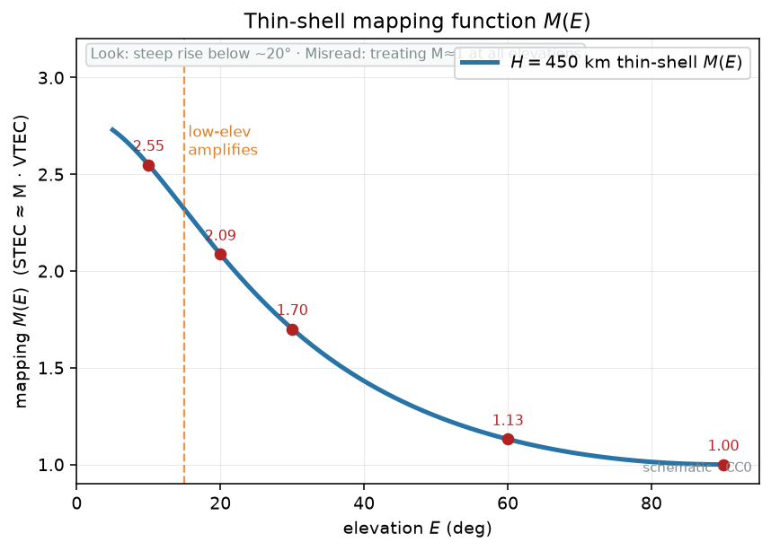
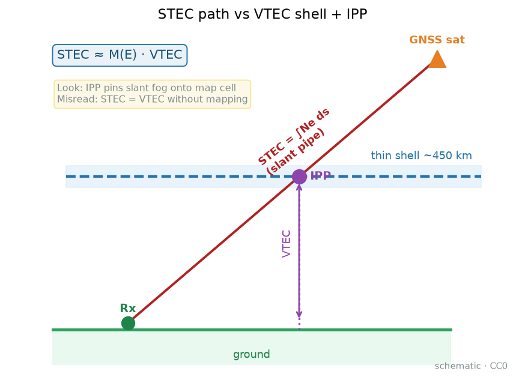
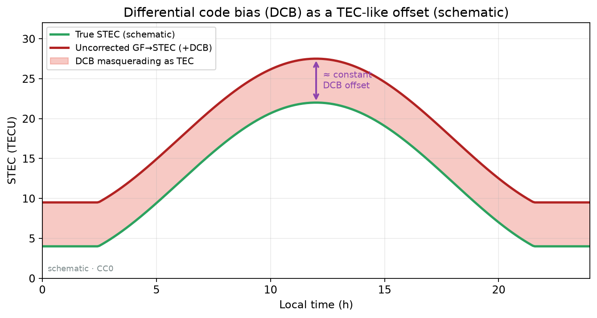
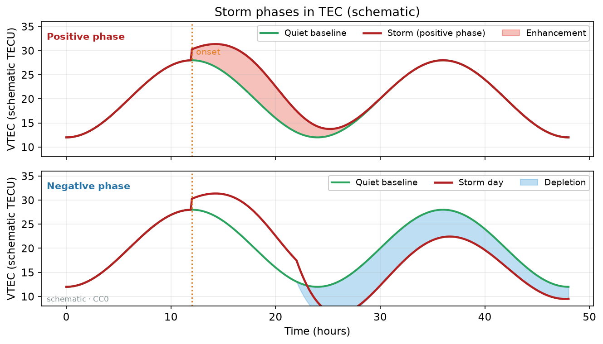
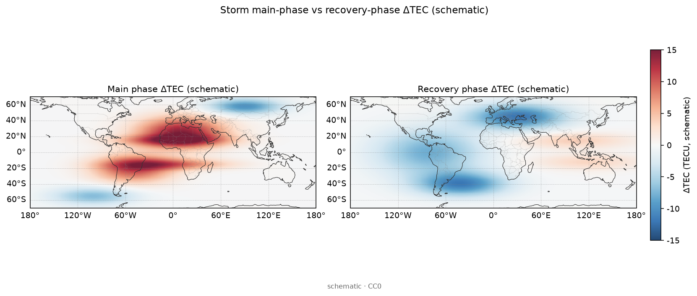
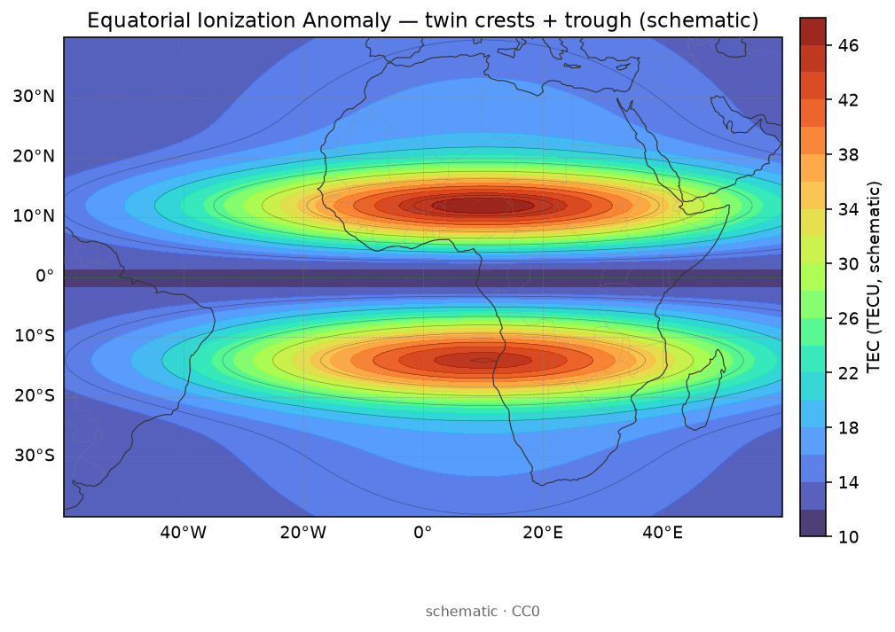

# 03 · GIM 是什么？从多站 STEC 到 VTEC 场，再到 IONEX

> **课堂定位**：接 01（TEC / 薄壳 / 映射）与 02（双频估 STEC）。你已经会说「斜的是 STEC、竖的是 VTEC」。本课把**建图原理**钉死：全球电子含量图怎样从一堆斜路径观测**估计**出来；球谐系数在拧什么、Gibbs/振铃从哪来；IONEX 头与身子逐字段管什么；为何 CODE/JPL/UPC/WHU 会差几个 TECU；风暴−安静差值图在物理上到底在比什么。
> 路线固定为四段：**机制 → 公式拆解（逐步推导）→ 观测签名 → 分析步骤**。
>
> **写给谁**：第一次下载 IONEX、第一次听到各分析中心、第一次把 GIM 当「真值」的人；以及觉得「建图=插值上色」、原理过粗的人。
>
> **学完交付**：口述从多站 STEC 到 VTEC 场的观测方程；用三站玩具说明欠定与正则；解释球谐与 Gibbs；逐字段读 IONEX 头 + 历元 map + RMS；说出 AC 差异的 WHY；解释风暴−安静差值的物理含义；能点名本仓真实 `name`。

---

## 0. 开场：三个真实场景

请先合上笔记本，想三件事：

1. **领导要「今天全球 TEC 图」**：你要的是某一时刻的 **VTEC 场（GIM）**，交换格式常见为 **IONEX**。彩图从哪来？不是卫星拍的照片，是多站斜路径观测的**估计产品**。
2. **自建 STEC 与 GIM「同站」差十几 TECU**：多半在比斜柱与格点竖柱，且未对齐时间、壳高、DCB。差不等于「GIM 错了」或「你算法赢了」。
3. **用三天前 Final 假装「现在的空间天气」**：时延档选错——Final / Rapid / NRT 不是同一件货。

**本课地图（请对照目录）：**

| 段落 | 你在学什么 | 类比 |
|---|---|---|
| §1 词表 | 先认名字 | 进厨房前认厨具 |
| §2–5 **机制** | 为何多站能建图、映射/DCB/欠定如何进账 | 钉子、床垫、校准故事 |
| §6–11 **公式拆解** | 观测方程 → 映射 → 估计/正则 → 球谐 → IONEX 尺子 → ΔVTEC | 把菜谱拆成一步一步 |
| §12–13 **观测签名** | 图上长什么样、假象怎么认 | 监控录像怎么认人 |
| §14–19 **分析步骤** | 读图清单、打假、测验、出门 | 值班清单与过关 |

配图均在 [`images/`](./images/)，版权见 [`images/SOURCES.md`](./images/SOURCES.md)。

**边界**：不重讲 RINEX→STEC（见 [02](./02-gnss-dualfreq-tec.md)）；不把 IRI 当 GIM（见 [04](./04-iri-nequick.md)）；GIM 是观测反演**产品**，不是绝对真值。现象课 19–23 保持独立短文，不回灌成长文墙。

---

## 1. 词表（先扫一遍，主讲后再回看）

### 1.1 场与几何

| 术语 | 人话 | 稍严 |
|---|---|---|
| STEC / VTEC | 斜柱 / 天顶等效柱 | 观测单元 / 常用状态量 |
| GIM | 全球或大区域场产品 | 由许多 STEC 约束估计的时空场 |
| IPP / 壳高 $h_s$ | 穿刺点 / 假想薄壳高度 | 3D→2D 挂钩；壳高改则 IPP 挪 |
| 映射 $M(e)$ | 仰角相关换算 | 低仰角误差放大器 |
| 薄壳近似 | 把厚雾压成一张壳 | 降维香，扰动期臭 |

### 1.2 估计、产品与交换

| 术语 | 人话 | 稍严 |
|---|---|---|
| DCB | 硬件延迟差 | 与 TEC 纠缠的慢变项；秩亏来源 |
| 欠定 / 正则 | 钉不够、床垫可乱抖 / 偏爱光滑 | 观测少、未知多；罚函数捏解 |
| 球谐系数 / $N_{\max}$ | 全球波形的旋钮 / 截断阶 | 控制可表示的最短空间波长 |
| Gibbs / 振铃 | 陡变附近过冲与旁瓣 | 截断级数副作用 |
| IONEX | 交换文本 | 头=说明书；身=历元格网 |
| EXPONENT | 整数 → TECU 的尺子 | 乘错 = 数量级灾难 |
| AC、Final/Rapid/NRT | 分析中心、时延档 | 算法+站网+时效折中不同 |
| ΔVTEC（风暴−安静） | 相对安静基线的偏离场 | 掀气候底子，不是判决书 |

**纪律**：禁止格点 VTEC 叫「我的 STEC」；禁止不看 EXPONENT；禁止 Final≡Rapid；禁止把彩图当拍照真值。

---

# 第一段 · 机制

> 目标：用「因果」讲清——为何多站斜路径能约束一张全球图、映射与 DCB 如何进账、欠定为何是问题本性。完整公式留给第二段。

---

## 2. 从许多斜水管到一张地图：GIM 在干什么？

> **看图要点**
> - **看什么**：三角测站、IPP 小点与 GIM 细格如何叠在海岸地理上。
> - **别误判**：海岸底图只帮忙落点；不是把上游源码/实测 IONEX 拷进本仓。
> 图源：自制 CC0 示意。

> 图源：本仓库自制示意，见 [`images/SOURCES.md`](./images/SOURCES.md)。GIM 可以理解为把许多斜路径观测「摊」成一张 VTEC 地图——但「摊」不是简单平均上色，而是带几何与偏差的估计。

> 图源：自制示意。视线与薄壳交点 = IPP；VTEC 挂在 IPP，不是挂在测站正上方。IPP **一般不是**卫星星下点。

> **看图要点**
> - **机制**：多站斜路径经映射钉在 IPP，估计出全球/区域 VTEC 场；海岸线帮你把色块落到大洲大洋。
> - **看什么**：日侧偏高、低纬双峰雏形；洋面与陆面是否同样「被钉死」。
> - **别误判**：示意场非某日 IONEX；平滑色块 ≠ 处处有观测约束。
> 图源：本仓库自制示意场 + Natural Earth 海岸线（非实测事件）。

> **看图要点**
> - **机制**：GIM 是格网点上的估计场；红点示意 IPP 采样——钉子密处约束强，疏处靠正则外推。
> - **看什么**：格网轮廓与 IPP 点是否围住你关心的区域；大洋空白意味着什么。
> - **别误判**：点密 ≠ 分辨率魔法；输出格距不等于有效分辨率。
> 图源：本仓库自制示意场 + Natural Earth 海岸线（非实测事件）。

> **看图要点**
> - **机制**：一颗星过境时 IPP 在薄壳上扫出弧线；建图用的是弧上的采样，不是测站正上方一点。
> - **看什么**：测站三角与弧线覆盖范围；低仰角弧会滑到很远的海域。
> - **别误判**：示意几何非实测星历；勿把弧线当 TID 波前。
> 图源：本仓库自制示意场 + Natural Earth 海岸线（非实测事件）。

手里是大量 $\mathrm{STEC}_{r}^{s}(t)$（02 课产物）。想要的是连续场 $\mathrm{VTEC}(\lambda,\varphi,t)$。

**机制一句话**：每条站–星斜路径，经映射与壳高，在 IPP「钉」住当地竖直等效柱的一个约束；成千上万颗钉子 + 偏差约束 + 时空正则 → 一张可用的全球（或区域）图。

**床垫类比**：三颗钉子定不了一整张床垫——无数曲面穿过三钉。站网密的地方钉子密，大洋/极区钉子稀，颜色主要靠外推与「偏爱光滑」的先验。**颜色连续 ≠ 处处被观测钉死。**

结论：GIM 不是「STEC 平均上色」，而是**带几何扭曲与偏差纠缠的空间场估计**。

> **看图要点**
> - **看什么**：成千上万颗 IPP「钉子」如何铺到海岸线地理上——密站区钉密、大洋稀。
> - **别误判**：轨迹铺满≠处处被观测钉死；稀区光滑常来自先验。
> 图源：自制示意场 + Natural Earth 海岸线（非实测）。现象细读见 19–23。

---

## 3. 映射：低仰角为何是放大器

> **看图**：低仰角是放大器，坏观测会灌进格点。**误读**：把门限仰角当「可有可无」。

> **看图**：多站斜水管经 IPP 落到地图。**误读**：把 STEC 直接当格点 VTEC 填色。

> 图源：自制计算示意。天顶附近 $M\approx1$；低仰角 $M$ 陡增——几何放大，不是「雾突然变厚」。壳高差会改映射与 IPP 位置。

- **高仰角**：近竖直，壳高错一点伤得少；IPP 离测站近。  
- **低仰角**：IPP 滑远，$M$ 大；水平梯度与多层结构被折进「等效 VTEC」；多路径也放大。

**机制口诀**：映射是杠杆——杠杆比写错，等于把错误的竖直高度硬塞进 IPP。壳高与映射通常绑定：只改一个不改另一个，等于改几何故事的一半。

对比纪律：必须声明仰角截止与映射；低仰角时段单独评估。几何上可用 `Get_IPP` 等算穿刺点（以项目文档为准）。细节公式见第二段与 01 课 §8。

---

## 4. DCB：慢变常数如何污染整张图

> 图源：自制示意。未改正 / 约束不当的 DCB ≈ 整条曲线或整片场整体平移数 TECU；形状像「电离层多了一层楼」，其实是硬件延迟差。

未约束时，整体抬升场与整体改偏差在观测方程里几乎同效果——这叫**基准秩亏**。实务靠：外部 DCB 产品、基准站、零均值约束、多系统策略。

**自建 STEC（策略 A）减 GIM（策略 B）** 出现数 TECU 系统差，优先怀疑口径，不要先喊「GIM 错了」。

**温度计类比**：未校准的零点不同的温度计联网画「全国气温图」——地图会吸收校准故事。AC 之间差 2–5 TECU 常见，往往先是方法身份，再谈地球物理。

---

## 5. 欠定是本性：三站玩具预告

刻意简化（非真实算法）：

- 映射已做完，三站给出 IPP 上等效竖直观测：欧洲 $y_A=20$、东亚 $y_B=35$、太平洋 $y_C=28$（单位 TECU）。  
- 「全球场」却有成百上千格点，或几十个球谐系数。

**问 1**：三数能否唯一定全球图？不能。无数曲面穿过三钉。  
**问 2**：若强行全球常数且无偏差？三式矛盾，最小二乘得折中常数、残差巨大。  
**问 3**：加公共偏差 $b$ + 两三个低阶系数？未知数仍可能 ≥ 有效约束；**换先验，图换脸**——多 AC 差异的玩具版。  
**问 4**：太平洋点为何「虚」？四周无站时颜色主要靠外推/平滑。

**收束**：欠定是问题本性。IGS GIM 用站网+映射+DCB+时空正则把欠定压成可用产品。建图=正则化估计，不是拍照。

相关 `name`：建图 `mosgim`、`mosgim2`、`SH-GIM`、`csonde-gnss-ionosphere`、`GNSS.IonosphereMaps`、`m_gim`、`M_GIM`；STEC 侧 `gnss-tec`。

---

# 第二段 · 公式拆解（逐步推导）

> 目标：每个符号有单位、有人话、有「这一步在干什么」。不要背「GIM」三个字母，要能复述观测方程 → 估计问题 → IONEX 尺子 → 差值公式。

---

## 6. 公式路线图（先看全图，再逐步拆）

$$
\mathrm{STEC}_{r}^{s}(t)
\;\xrightarrow{M(e),\,h_s,\,\mathrm{IPP}}\;
\mathrm{VTEC}(\lambda,\varphi,t)+b_r+b^{s}
\;\xrightarrow{\text{多站堆叠 + 正则}}\;
\hat{\mathrm{VTEC}}\ \text{场}
\;\xrightarrow{\text{IONEX}}\;
\text{格网整数}\times 10^{\mathrm{EXPONENT}}
\;\xrightarrow{\text{storm}-\text{quiet}}\;
\Delta\mathrm{VTEC}.
$$

读法（中文在公式外）：斜柱观测 → 映射钉在 IPP 并纠缠 DCB → 多站估计出场 → 写成交换文件 →（可选）减安静基线看扰动笔迹。

---

## 7. 解剖台 A：单链路观测方程——每个符号

薄壳近似下，课堂骨架为：

$$
\mathrm{STEC}_{r}^{s}(t)
\approx
M(e_{r}^{s})\,\mathrm{VTEC}(\lambda_{\mathrm{IPP}},\varphi_{\mathrm{IPP}},t)
+ b_{r} + b^{s} + \varepsilon.
$$

| 符号 | 含义 | 单位 / 备注 |
|---|---|---|
| $\mathrm{STEC}_{r}^{s}$ | 接收机 $r$、卫星 $s$ 的斜柱 | TECU；02 课产物 |
| $e_{r}^{s}$ | 仰角 | 度或弧度（公式内一致即可） |
| $M(e)$ | 映射函数 | 无量纲；低仰角 ≫ 1 |
| $\mathrm{VTEC}(\lambda_{\mathrm{IPP}},\varphi_{\mathrm{IPP}},t)$ | 穿刺点处竖直等效柱 | TECU；状态量 |
| $b_r,b^{s}$ | 接收机 / 卫星 DCB（课堂合并写法） | TECU 等效；慢变 |
| $\varepsilon$ | 噪声、多路径、映射/薄壳误差等 | TECU |

逐项人话：

1. **左边**：斜路径柱（已含周跳、平滑等预处理假设）。  
2. **$M(e)$**：斜穿比竖直「更长」。  
3. **VTEC(IPP)**：把信息钉在穿刺点；$h_s$ 一改，钉子的经纬就滑。  
4. **$b_r,b^s$**：与绝对 TEC 可互换「谁吃常数」，造成基准秩亏。  
5. **$\varepsilon$**：噪声、多路径、映射误差、薄壳误差、未模型化上层贡献等。

---

## 8. 解剖台 B：映射公式——从 01 课接到建图

取地球半径 $R_E\approx6371\,\mathrm{km}$、壳高 $h_s$（常见 350–450 km，**以产品为准**）。球面几何：

$$
\sin z'=\frac{R_E}{R_E+h_s}\cos e,
$$

$$
M(e)=\frac{1}{\cos z'}=\left(1-\left(\frac{R_E}{R_E+h_s}\cos e\right)^{2}\right)^{-1/2}.
$$

（单层常见形式；以软件/产品为准。）

**迷你数值**（$h_s=450\,\mathrm{km}$，$R_E/(R_E+h_s)\approx0.934$）：

| 仰角 $e$ | $M(e)$ 约 | 若 VTEC=20 TECU，STEC≈ |
|---|---|---|
| 90° | 1.00 | 20.0 |
| 60° | 1.13 | 22.6 |
| 30° | 1.70 | 34.0 |
| 15° | 2.32 | 46.4 |

**读表**：仰角从天顶降到 15°，同样 VTEC=20，斜路径 STEC 从 20 涨到约 46——不是雾突然变厚一倍多，是**几何放大**。建图时若低仰角权重大且 $M$ 写错，整张图会被拧。

壳高改两件事同时发生：

1. $M$ 变；  
2. IPP 水平位置变。

自建对比 GIM 前，壳高必须写进方法声明。

---

## 9. 解剖台 C：堆成估计问题 + 正则

把所有历元、所有站星堆起来，形式上像：

$$
\mathbf{y} = \mathbf{A}\,\mathbf{x} + \mathbf{B}\,\mathbf{b} + \boldsymbol{\varepsilon}.
$$

| 符号 | 含义 |
|---|---|
| $\mathbf{y}$ | STEC 观测向量 |
| $\mathbf{x}$ | VTEC 场参数（格节点或球谐系数，可含若干时间片） |
| $\mathbf{b}$ | DCB 等偏差 |
| $\mathbf{A}$ | 由映射与 IPP 几何决定——哪条斜路径「看见」场的哪一部分 |
| $\mathbf{B}$ | 把偏差吸进方程的设计阵 |

若只最小化 $\|\mathbf{y}-\mathbf{A}x-\mathbf{B}b\|^2$，在列相关、海洋空洞、偏差与场耦合时，解不稳定。于是加正则：

$$
\min\;
\|\mathbf{y}-\mathbf{A}x-\mathbf{B}b\|^2
+
\lambda_s \,\mathrm{Smooth}(x)
+
\lambda_t \,\mathrm{TimePen}(x)
+
\lambda_b \,\mathrm{Constr}(b).
$$

$\lambda$ 不是宇宙常数，是各 AC 的「审美与工程折中」。**这正是「同日多中心图不完全重合」的线性代数故事。**

课堂若只能记住一句：**观测方程告诉我们「测的是什么」；正则告诉我们「在欠定时偏爱什么长相的场」。**

### 9.1 映射误差如何进入 $\mathbf{A}$

$M(e)$ 写错，等于整行 $\mathbf{A}$ 乘错系数。低仰角行权重若仍很大，错误映射会把错误竖直场「拧」进解。故有的中心提高仰角截止，或降权低仰角——这又改变有效站网几何。

### 9.2 时间参数与「假静稳」

常用：分片常数/线性（如 1 h、2 h 一张）；时间样条；近实时递推。  
若时间罚过强，风暴主相快速抬升会被拖成钝坡；过弱则空洞区噪声斑块乱跳。产品时间分辨率必须写进方法。

### 9.3 三站玩具的「加正则」面孔

观测：欧 $y_A=20$、亚 $y_B=35$、洋 $y_C=28$。设四区均值 + 公共 $b$ → 未知多于观测。加「四区尽量靠近」的平滑罚后：亚洲偏高、欧洲偏低、洋美靠全局均值，$b$ 吞部分绝对水平。平滑极强 → 四区几乎相等；极弱 → 解发野。

**站数 ≠ 全球可观测性**：十站若挤在同一经度带，只加密该带纬度剖面，太平洋仍虚。

---

## 10. 解剖台 D：球谐系数、截断与 Gibbs

### 10.1 格网 vs 球谐

| | 格网 | 球谐 |
|---|---|---|
| 未知数 | 节点 VTEC | $a_{nm},b_{nm}$ 至 $N_{\max}$ |
| 直觉 | 位图像素 | 有限全球波形叠加 |
| 用户常见下载 | IONEX 格网 | 常已由系数合成格网 |
| 擅长 | 直观、区域加密 | 全球尺度、紧凑、周期边界自然 |

### 10.2 系数在拧什么？

- **低阶**：全球平均、粗日夜差、粗纬度结构。  
- **中阶**：大陆尺度起伏、EIA 两驼峰轮廓。  
- **高阶**：更窄的脊谷与区域梯度——前提是 $N_{\max}$ 真开到那儿。

$N_{\max}$ 决定可表示的最短波长。格网步长很细、但截断阶对应波长很粗时，**多出来的格点只是光滑插值**，不是新观测信息。

口头区分：

- **阶 $n$**：大致对应空间波长——$n$ 大，纹波更碎。  
- **位 $m$**：大致对应经度方向有多少瓣（$m=0$ 常与经度无关的纬向结构相关）。

### 10.3 Gibbs / 振铃：台阶思想实验

真场若有理想台阶（左 20、右 40 TECU），有限阶逼近会：主跃迁变斜坡；两侧过冲；远处弱波纹。电离层中的赤道异常壁、风暴锋、数据空洞边界都会激发类似振铃。

口诀：**先怀疑产品，再认领波动**；认领前要有多站时间延迟或独立仪器。格网 + 强平滑的隐式低通同类。

**假分辨率纪律**：禁止写「本 GIM 分辨率为 2.5°」而不提方法截断——应写「输出格距 2.5°，空间表示受球谐截断/平滑约束，有效分辨率随地区站网变化」。

---

## 11. 解剖台 E：IONEX 尺子与 ΔVTEC 公式

### 11.1 EXPONENT：整数编码的尺子

IONEX 数据段常见为**整数**，用头里的指数还原：

$$
\mathrm{TECU} = \mathrm{整数} \times 10^{\mathrm{EXPONENT}}.
$$

（具体以文件说明为准；常见有 0.1 TECU 量级编码。）

**手算例**：看见整数 123，指数 $-1$，则 $12.3\,\mathrm{TECU}$。形状可以完全「像样」，色标也漂亮，但绝对值乘错 10——数量级灾难第一名。

壳高写入观测方程：

$$
\mathrm{STEC}\approx M(e;h_s)\,\mathrm{VTEC}(\mathrm{IPP}(h_s))+\cdots.
$$

### 11.2 风暴 − 安静

> 图源：自制示意。绝对场永远带着气候日变化；相减是为了掀气候底子，让相对安静基线的扰动笔迹显形。

> 图源：自制示意。主相抬升、恢复相耗空等是**候选叙事**；GIM 差值是证据板，不是判决书。现象细节见 19–20，本课不展开成文墙。

> **看图要点**
> - **机制**：主相常显日侧低纬正 ΔTEC；恢复相中纬负相更常见——同一「风暴−安静」配方，相位不同长相不同。
> - **看什么**：左右两幅红/蓝斑相对海岸的落点是否换区、换号。
> - **别误判**：教学示意双联，不是某次暴的实测差分；勿单凭一幅定因果链。
> 图源：本仓库自制示意场 + Natural Earth 海岸线（非实测事件）。

$$
\Delta\mathrm{VTEC}(\lambda,\varphi,t)
=\mathrm{VTEC}_{\mathrm{storm}}(\lambda,\varphi,t)
-\overline{\mathrm{VTEC}}_{\mathrm{quiet}}(\lambda,\varphi,t).
$$

物理意图：去掉大部分规则日变化，让事件扰动更好读。ΔVTEC 可与正暴抬升、负相耗空、EIA 变形等叙事**相容**，但不能单独排除别的候选——还要指数窗口与多源。

---

# 第三段 · 观测签名

> 目标：看见 GIM 彩图、多 AC 对比、差值图时，能说出「这是什么长相、因果是什么、别和什么搞混」。  
> 深度现象剧本留给 [19–23](./19-phenomena-overview.md)；本课只建立**产品与估计工艺的第一眼签名**。

---

## 12. GIM / IONEX 图上会长什么样？

### 12.1 安静日「气候」场（产品侧）

| 看什么 | 常见长相 | 别误读 |
|---|---|---|
| 日侧中低纬 | VTEC 高、可有 EIA 双峰轮廓 | 双峰被低阶抹成高原 ≠ 物理消失 |
| 夜侧 | 明显偏低 | 夜侧负值离谱 → 先查 EXPONENT/解析 |
| 大洋 / 极区 | 仍光滑美丽 | 光滑常来自先验，不是当地钉死 |
| 1 h / 2 h 切片 | 地方时结构随经度挪 | 短于间隔的耀斑/陡 TID 会被抹钝 |

> **看图要点**
> - **看什么**：日侧低纬南北双峰与赤道槽落到海岸线地理上的位置（GIM 安静气候场常见长相）。
> - **别误判**：双峰是产品侧气候轮廓，不是 EPB；低阶球谐可把双峰抹成高原。
> 图源：自制示意场 + Natural Earth 海岸线（非实测）。现象细读见 19–23。

> **看图要点**
> - **看什么**：一张「气候」VTEC 场挂上海岸线后，日夜分界与低纬高值带如何随经度铺开。
> - **别误判**：这是产品长相示意，不是某分析中心某日 Final；大洋光滑≠钉死。
> 图源：自制示意场 + Natural Earth 海岸线（非实测）。现象细读见 19–23。

### 12.2 映射 / 壳高错配签名

| 签名 | 长相 | 因果 |
|---|---|---|
| 自建 vs GIM | 低仰角时段差急剧变大，高仰角还好 | $M$ 或 $h_s$ 口径不一致 |
| 全日曲线 | 卫星东升西落低仰角段「喇叭口」残差 | 杠杆比写错 |
| 换壳高重算 | IPP 水平挪、差值型变 | 几何故事改了一半 |

### 12.3 DCB / 基准签名

| 签名 | 长相 | 因果 |
|---|---|---|
| 相对其它 AC | 整张图或某区**整体平移**数 TECU，空间型仍相似 | 偏差基准不同 |
| 某接收机相关 IPP 片 | 长期偏高/偏低 | 接收机 DCB 未约束好 |
| 自建−GIM | 白天夜里一起偏 | 优先查 DCB/类型，勿先喊增强 |

### 12.4 欠定 / 正则 / 空洞签名

| 签名 | 长相 | 因果 |
|---|---|---|
| 大洋斑 | 换 AC 后分歧最大；RMS（若有）偏大 | 外推 + 先验 |
| 时间罚过强 | 主相抬升降峰，差值幅度偏小 | 假静稳 |
| 时间罚过弱 | 空洞区斑块随天乱跳 | 噪声进场 |
| 邻点平滑极强 | 漂亮穿过稀钉、别处平坦 | 漂亮来自罚函数 |

### 12.5 Gibbs / 振铃签名

| 签名 | 长相 | 处置 |
|---|---|---|
| 陡锋附近 | 过冲假脊 + 远处弱波纹 | 先疑产品，再认领 TID |
| 差值高通 | 一串「波」但无传播延迟 | 回密集站 STEC 交叉 |
| 空洞边界 | 假同心纹 | 降级解读 |

### 12.6 风暴−安静差值签名与假象

| 签名 / 假象 | 长相 | 纪律 |
|---|---|---|
| 合格正异常 | 日侧中低纬、时间贴主相、多 AC 同号 | 仍属候选，需指数与多源 |
| 跨档 / 跨 AC 相减 | 「假风暴」色斑 | 同 AC 同档 |
| 色标不对称 | 吞掉负相 | 对称色标 |
| 只减第一张 map | 鬼影 / 乱型 | 按历元循环 |
| 经度约定乱 | 太平洋镜像 | 读头：±180 还是 0–360 |

**诊断口诀（产品侧）：**

| 症状 | 优先怀疑 |
|---|---|
| 绝对值差约 10 倍 | EXPONENT 未乘 |
| 南北或太平洋对调 | 经纬走向 / 经度约定 |
| 与自建全日平移数 TECU | DCB / 基准口径 |
| 仅低仰角对比炸裂 | 映射 / 壳高 |
| 大洋细结构故事 | 空洞外推；换 AC 检验 |
| 漂亮小尺度同心纹 | Gibbs / 平滑旁瓣 |
| 差值很猛但一边 Final 一边 Rapid | 产品伪差 |

---

# 第四段 · 分析步骤

> 目标：给你一套可执行的值班清单——从下载 IONEX 到读图、对比、做差值，并完成演算过关。

---

## 13. IONEX：头 + 身子字段级阅读清单

> 关键字以规范与具体文件为准；下列是「打开必须会找」的课堂字段级清单。生产读取优先：`ionex`、`ionex_reader`、`ionex-rs`、`Ionex_Parser`、`MathWorks-ionex_reader`。

### 13.1 头段：你要回答的问题

| 字段直觉 | 你要回答 | 读错后果 |
|---|---|---|
| 版本/类型 | 是否 IONEX？产品类型？ | 解析假设错 |
| 分析中心 | 哪家 AC？ | 引用串台 |
| 首末历元与间隔 | 时间范围与切片 | 插错时刻；耀斑被抹 |
| 经纬起止步长 | 格网几何；0–360 还是 ±180？ | 太平洋镜像 |
| 壳高/高度行 | 薄壳或层高 | IPP/映射理解错 |
| 地球半径等 | 与映射一致吗？ | 自建对比系统偏 |
| **EXPONENT** | 整数如何还原 TECU？ | **数量级灾难** |
| map 数、是否 RMS | 循环多少张？有无不确定度？ | 只读首张；RMS 当 TEC |
| DCB 表（若有） | 是否附带偏差？ | 与自建口径冲突未声明 |
| 注释/模型简述 | 壳高、方法线索 | 漏掉关键假设 |

头=坐标轴+单位+作者+快门间隔；未读完就渲染，等于没看色标开发布会。

### 13.2 历元 map 怎么读

1. 历元标记开启一张图；  
2. 按纬度带（或规范次序）列各经度**整数**编码；  
3. × EXPONENT 还原 TECU；  
4. 拼成该时刻二维场；  
5. 用户点 $(t,\varphi,\lambda)$ → 时间插值 + 空间双线性等。

口诀：先时间片，再四个格点，再插值；有 RMS 别装误差为零。

### 13.3 RMS map

伴生不确定度/离散度，**不是**第二张 TEC。用于质控与差分显著性保守判断。写出/编辑：`ionex_formatter`、`INX_Editor`；`rtcm2ionex`；画图 `IonMap`、`INPE-TEC-Maps-IONEX`；差分 `DiffIonMap`。

### 13.4 使用者最小检查单（建议打印）

1. AC 与时延档是否正是我要引用的？  
2. EXPONENT 是否已乘？抽一格手算验证。  
3. 经度约定是否与我的脚本一致？  
4. 壳高是否写入方法？  
5. 是否按历元循环而非只读第一张？  
6. 若做相减，两边是否同 AC、同档、同格网定义？

### 13.5 90 秒口播稿（可直接背）

「打开 IONEX：先看头——哪家 AC、哪一档、从何时到何时、间隔多久一张；纬度经度怎么走、是 ±180 还是 0–360；壳高多少；EXPONENT 多少；有没有 RMS 与 DCB 表。再进身子：每个历元一张 map，按纬带读整数，乘指数变 TECU。查点时先时间插值再空间插值。和自建 STEC 比，必须统一映射壳高与偏差口径。两家 AC 差几个 TECU，先当方法身份，再谈地球物理。风暴减安静：同中心同档，对称色标，大洋降级，句子里写清身份、基线、幅度、一致性与局限。」

---

## 14. IGS AC 差异的 WHY + 选品实验设计

框架入口：`IGS-Ionosphere-WG`；综合/验证相关：`UWM-IGS-Iono-Combination`。下载：`CDDIS-IONEX`（常需 `NASA-Earthdata-Login`）、`CODE-AIUB-Analysis-Center`、`CODE-AIUB-Product-Download`、`JPL-IONEX-Rapid`、`UPC-IONEX-Archive`、`WHU-IGS-Ionosphere-AC`、`GFZ-Global-Ionosphere-Maps`、`CAS-BDsmart-Iono-Products`、`CAS-BDsmart-RTS-Iono`、`ROB-IONEX-Products` 等。

**为何不同（背这六条）：**

1. **站网**：哪些站/星座/质控门槛 → IPP 密度地图不同；欧密洋疏是结构性的。  
2. **壳高与映射**：$h_s$ 差几十公里，低仰角 IPP 可水平大挪；映射族不同=改观测方程系数。  
3. **DCB/偏差约束**：基准、外部 DCB、多系统策略 → 绝对水平与站偏置不同。  
4. **空间模型与正则**：$N_{\max}$、格距、平滑强度、区域加密 → 抹多少真梯度、造多少假光滑。  
5. **时间参数与时延档**：1 h/2 h、Final/Rapid/NRT → 噪声与时效折中不同。  
6. **上层/等离子体层口径**：斜路径高高度贡献处理不同 → 绝对 TEC 可差一截。

引用写清：`AC + 档 + 日期 + 文件名`。差 2–5 TECU 常见；更大时先查自己的 EXPONENT/经度/映射。

时延：事后精密→Final；较快→Rapid；准实时→NRT/RTS 并多源降级；勿用过期 Final 装「现在」。

**选品句式（半页方法可抄）：**

1. **覆盖**：关心东亚陆地 → 检查该区 IPP 是否通常较密；太平洋中部则承认任何全球 GIM 都偏软。  
2. **时延**：论文事后 → Final；业务次日 → Rapid；值班 → NRT 并写降级。  
3. **交叉**：主结论至少两家 AC 同号；幅度取范围。  
4. **壳高**：自建若用 450 km，优先头段壳高接近者。  
5. **RMS**：要显著性则优先有 RMS 或可多日统计离散度者。

---

## 15. 风暴−安静走查 + 合格叙事句

**走查：** 写清问题→锁事件与指数（`GFZ-Kp-Index`、`NOAA-SWPC-Planetary-K`、`NASA-OMNIWeb`）→选同 AC 同档安静日（宜 3–5 日均）→读头核对→时间对齐相减→对称色标→换 AC/换基线/单站交叉→大洋降级。

工具：读 `ionex`/`ionex_reader`；差 `DiffIonMap`；近实时 `ESA-TIO-NRT-TEC`、`NOAA-SWPC-GloTEC` 仅定性。

**分层物理含义（本课够用）：**

1. ΔVTEC = 相对近期安静实况的偏离场。  
2. 安静日不是「零物理」；同季节、同档、多日平均，减少基线污染。  
3. 与驱动对齐只进**候选列表**；机理裁决留给多源与现象课。  
4. 跨档/跨 AC 相减 → 假风暴（产品伪差）。

**合格句式：**「在 `CODE` Final、世界时 12:00，相对 3 个安静日同时刻平均，东亚中纬 ΔVTEC 约为 +10 TECU，与主相时间对齐；UPC 同档差值同号、幅度差约 3 TECU；太平洋中部大斑 RMS 高，仅作提示。」  
**不合格：**「风暴导致全球 TEC 暴涨（见图）。」

安静日差值=**实况−实况**；IRI 残差=**实况−气候**（预告 04）。问题不同，不可偷换。

---

## 16. 常见误解专节

| # | 误解 | 打假 |
|---|---|---|
| A | GIM = 我的 STEC | 格点是 VTEC 场产品；斜/竖不同 |
| B | 数字已是 TECU | 先乘 EXPONENT |
| C | 各 AC 应完全相同 | 站网/壳高/DCB/正则/时延不同 |
| D | 细色标 = 真小尺度结构 | 可能是插值或振铃 |
| E | 壳高 = 电子所在真实高度 | 薄壳是建模挂钩 |
| F | 有 GIM 就免谈 DCB | 建图与对比都受偏差口径影响 |
| G | 三站可唯一全球真图 | 欠定；需截断/平滑/约束 |
| H | 差值红斑 = 已证机理 | 证据板，不是判决书 |
| I | Final ≡ Rapid ≡ NRT | 时延与噪声折中不同 |
| J | RMS 是第二张 TEC | 不确定度/离散度 |
| K | 输出格距 = 有效分辨率 | 还看 $N_{\max}$/平滑/站网 |
| L | 跨 AC 相减看风暴 | 易造假风暴 |

---

## 17. 和本仓库工具对上号

下列 `name` 均已对照根目录 `PROJECTS.json` 核验存在。本仓是索引，不内嵌上游完整源码。

| 目的 | name |
|---|---|
| 读 IONEX | `ionex`、`ionex_reader`、`Ionex_Parser`、`ionex-rs`、`MathWorks-ionex_reader`、`mgfernan-pygnss`、`ionex-analyzer` |
| 写/编辑 | `ionex_formatter`、`INX_Editor`、`rtcm2ionex` |
| 下载入口 | `ionex-downloader`、`CDDIS-IONEX`、`NASA-Earthdata-Login`、`JPL-IONEX-Rapid`、`UPC-IONEX-Archive`、`CODE-AIUB-Product-Download`、`WHU-IGS-Ionosphere-AC`、`GFZ-Global-Ionosphere-Maps`、`CAS-BDsmart-Iono-Products`、`CAS-BDsmart-RTS-Iono`、`ROB-IONEX-Products` |
| 建图 | `mosgim`、`mosgim2`、`SH-GIM`、`GNSS.IonosphereMaps`、`csonde-gnss-ionosphere`、`m_gim`、`M_GIM` |
| 几何 / STEC | `Get_IPP`、`gnss-tec` |
| 画图 / 差分 | `IonMap`、`INPE-TEC-Maps-IONEX`、`DiffIonMap` |
| 框架 / 综合 | `IGS-Ionosphere-WG`、`UWM-IGS-Iono-Combination`、`Beihang-Ionosphere-CN`、`CODE-AIUB-Analysis-Center` |

口诀：下→CDDIS 一类；读→ionex 一类；建→mosgim/SH-GIM；差→DiffIonMap 或自减。

流程物理根 → [01-ionosphere-tec-basics.md](./01-ionosphere-tec-basics.md)；单站 STEC → [02-gnss-dualfreq-tec.md](./02-gnss-dualfreq-tec.md)；气候模型 → [04-iri-nequick.md](./04-iri-nequick.md)；建图工作流加长版 → [10-build-gim-workflow.md](./10-build-gim-workflow.md)。

**别做**：把彩图当拍照真值；未读 EXPONENT 就发绝对值论文图；跨档相减讲「发现风暴」；把现象课 19–23 需求回灌成本课超长文墙。

---

## 18. 课堂测验（带演算的完整答案）

> **阅读提示：** 请在 github.com 网页预览本文。下面答案刻意写成纯文本，避免公式块在测验区露源码。

**题 1.** 观测方程中 M(e)、VTEC(IPP)、DCB 各扮演什么？  
**答：** 映射（斜→竖杠杆）；钉在穿刺点的状态量；与 TEC 纠缠的慢变偏差（秩亏来源）。

**题 2.** 三站玩具说明什么？换先验会怎样？  
**答：** 欠定；需截断/平滑/偏差约束；换约束换图。

**题 3.** 低阶/高阶球谐与 Gibbs？  
**答：** 尺度由阶控；陡变遇见截断→过冲与振铃旁瓣。

**题 4.** IONEX 头必看哪些？RMS 是什么？  
**答：** 时间、格网、EXPONENT、AC、壳高、经度约定等；RMS≠TEC，是不确定度/离散度。

**题 5.** 整数 185、EXPONENT=−1，TECU？  
**答：** 18.5 TECU。

**题 6.** AC 为何差？至少四条。  
**答：** 站网、壳高/映射、DCB 约束、空间正则/Nmax、时间参数/时延档、上层口径等。

**题 7.** 差值物理意图？假象举两条。  
**答：** 掀气候底子看相对偏离；跨档相减、色标偏见、振铃、大洋外推、只减第一张等。

**题 8.** name：读、下、建、差各举一例。  
**答：** ionex 或 ionex_reader；CDDIS-IONEX 或 JPL-IONEX-Rapid；mosgim 或 SH-GIM；DiffIonMap。

**题 9.** hs=450 km、e=30°、M≈1.70、STEC=34 TECU，等效 VTEC≈？  
**答：** 34/1.70=20 TECU。

**题 10.** 为何输出格距 2.5° 不等于有效分辨率 2.5°？  
**答：** 有效最短波长还受 Nmax/平滑/站网约束；细格点可能只是插值。

**题 11.** Final 与 Rapid 选用纪律？  
**答：** 事后精密用 Final；要时效用 Rapid/NRT 并声明降级；勿用过期 Final 装现在。

**题 12.** 自建 STEC 与 GIM 差 8 TECU，优先三问？  
**答：** 是否比了斜/竖？映射壳高时间是否对齐？DCB/EXPONENT/经度约定？

**题 13.** 映射写错如何进入估计矩阵 A？  
**答：** 整行系数乘错；低仰角大权重时把错误竖直场拧进解。

**题 14.** 合格差值叙事必须含哪些元素？  
**答：** 产品身份（AC+档）、基线、幅度、多源/多 AC 一致性、局限（如大洋 RMS）。

---

## 19. 综合演算作业（建议限时 25 分钟）

**(1)** 某 IONEX 格点整数为 142，EXPONENT=−1。VTEC=?  
**(2)** 同一格点若你的脚本忘了乘指数，把 142 当成 TECU，相对真值偏多少倍？  
**(3)** 仰角 60°、M≈1.13、GIM VTEC=18 TECU。薄壳下预期 STEC≈？若你的自建 STEC=28 TECU 且主要出现在 e<20° 时段，优先怀疑什么？  
**(4)** 风暴日与安静日平均同格点：Vstorm=32 TECU，Vquiet=22 TECU。ΔVTEC=? 若安静日误用另一家 AC 且系统偏高 4 TECU，ΔVTEC 会被怎样污染？  
**(5)** 三站玩具：yA=20、yB=35、yC=28，强制全球常数 c（无偏差）。最小二乘 c=?（普通算术平均即可作课堂答。）残差大致说明什么？

**参考答案（纯文本）：**

(1) 14.2 TECU。  
(2) 约偏 10 倍（142 vs 14.2）。  
(3) STEC≈18×1.13≈20.3 TECU；优先怀疑低仰角映射/多路径/截止角，而非「GIM 低了 8 TECU」。  
(4) ΔVTEC=+10 TECU；安静基线虚高 4 → ΔVTEC 被压成约 +6，属产品伪差污染。  
(5) c=(20+35+28)/3=27.7 TECU；残差大说明全球常数模型过粗，需要有空间结构的场+正则。

**加练：** 手算 M：RE=6371 km，hs=450 km，e=15°，cos e≈0.9659，sin z'≈0.902，cos z'≈0.431，M≈2.32。若 VTEC=15，STEC≈34.8 TECU——把几何放大讲成「空间天气增强」不合格。

---

## 20. 板书八行 · 符号速查 · 口述检查

**板书八行：**

1. $\mathrm{STEC}\approx M(e)\,\mathrm{VTEC}(\mathrm{IPP})+b_r+b^{s}+\varepsilon$。  
2. 建图 = 多站堆叠估计，常欠定；正则偏爱某种脸。  
3. 球谐 $N_{\max}$ = 波长旋钮；截断有 Gibbs/振铃。  
4. IONEX：先读头；$\mathrm{TECU}=\mathrm{整数}\times10^{\mathrm{EXPONENT}}$。  
5. AC 差有因：站网、壳高、DCB、正则、时延、上层口径。  
6. $\Delta\mathrm{VTEC}=V_{\mathrm{storm}}-\overline{V}_{\mathrm{quiet}}$：掀气候底子，非自动证机理。  
7. 对比自建前：统一斜/竖、映射、壳高、时间、DCB。  
8. 下/读/建/差：`CDDIS-IONEX` / `ionex` / `mosgim` / `DiffIonMap`。

**符号速查卡：**

$$
\mathrm{STEC}_{r}^{s}\approx M(e)\,\mathrm{VTEC}(\mathrm{IPP})+b_r+b^{s}+\varepsilon,
$$

$$
M(e)=\left(1-\left(\frac{R_E}{R_E+h_s}\cos e\right)^{2}\right)^{-1/2},
$$

$$
\mathbf{y}=\mathbf{A}x+\mathbf{B}b+\boldsymbol{\varepsilon},\quad
\min\|\mathbf{y}-\mathbf{A}x-\mathbf{B}b\|^2+\lambda_s\mathrm{Smooth}+\cdots,
$$

$$
\mathrm{TECU}=\mathrm{整数}\times10^{\mathrm{EXPONENT}},\quad
\Delta\mathrm{VTEC}=V_{\mathrm{storm}}-\overline{V}_{\mathrm{quiet}}.
$$

**值班速算条（建议抄卡片）：**

- EXPONENT=−1 → 整数 ÷10 得 TECU。  
- $e=30°$、$h_s=450\,\mathrm{km}$ → $M\sim1.7$ 量级。  
- AC 间差 2–5 TECU 先当方法身份。  
- 差值：同 AC、同档、对称色标、大洋降级。  
- 平移→DCB/基准；低仰角炸→映射；×10 错→EXPONENT；细波纹→先疑 Gibbs。

**口述检查（任抽三问）：**

1. 默写观测方程并圈 $M$、IPP、DCB。  
2. 用三钉床垫讲欠定与正则。  
3. 手算：整数 96、EXPONENT=−1 → ? TECU。  
4. 解释为何格距细 ≠ 有效分辨率细。  
5. 说出六条 AC 差异 WHY 中的四条。  
6. 读出合格差值叙事句的必备元素。

合格标准：能写方程、能手算 EXPONENT 与简单 $M\cdot\mathrm{VTEC}$，不只会背「全球电离层图」六个字。

---

## 21. 与前后课的接口 · 出门任务

| 你现在会的 | 下一课才会的 | 不要提前假装会 |
|---|---|---|
| 多站 STEC→VTEC 场的估计故事 | IRI/NeQuick 气候肖像 | 「GIM = 真值」 |
| IONEX 字段与 EXPONENT | 闪烁 / ROTI 工艺 | 把彩图细纹当闪烁 |
| AC 差异 WHY | DCB 产品深挖 | 不问档就引用 |
| 差值图证据板写法 | 现象课 19–23 剧本 | 本课写成现象文墙 |

从 01/02 带来：STEC vs VTEC；$M(e)$；双频 STEC(t)。  
本课交出：会读 GIM/IONEX、懂欠定与 AC 身份、会做同口径差值。  
交给 04：GIM 是观测反演产品；IRI 是气候模型——二者残差问题不同。

**下一课**：[04-iri-nequick.md](./04-iri-nequick.md)——气候模型解 $N_e$ 肖像，不是当天 GNSS 真值。

**出门任务：**

1. 下载一天 IONEX，按 §13 检查单喊字段；手算一格 EXPONENT；  
2. 用 `ionex` 或 `ionex_reader` 读出某时刻某点 VTEC；  
3. （可选）用 `DiffIonMap` 或自减做一张同 AC 同档风暴−安静，写一句合格叙事。

**版本说明**：本文件按「机制 → 公式拆解 → 观测签名 → 分析步骤」与 01/02 课同深度重写；嵌入薄壳/IPP/映射/DCB/风暴差值等自制 CC0 图；引用项目名均来自 `PROJECTS.json` 核验。现象课 19–23 保持独立短文，不回灌成长文墙。

（完）
