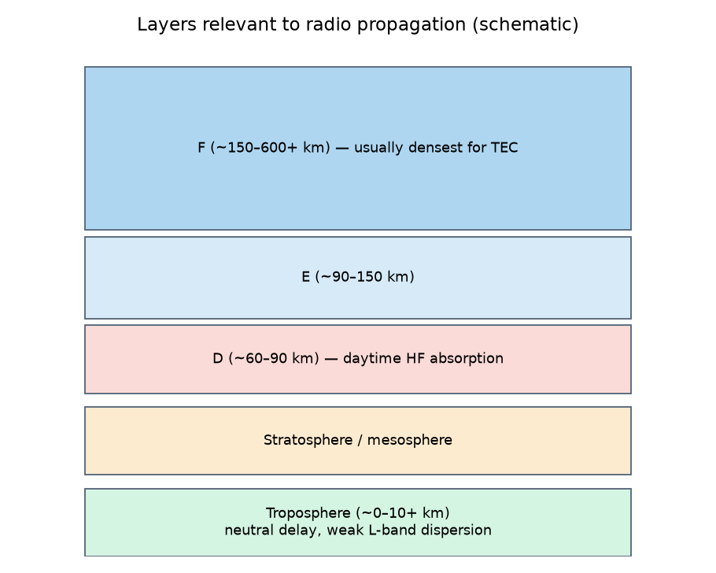
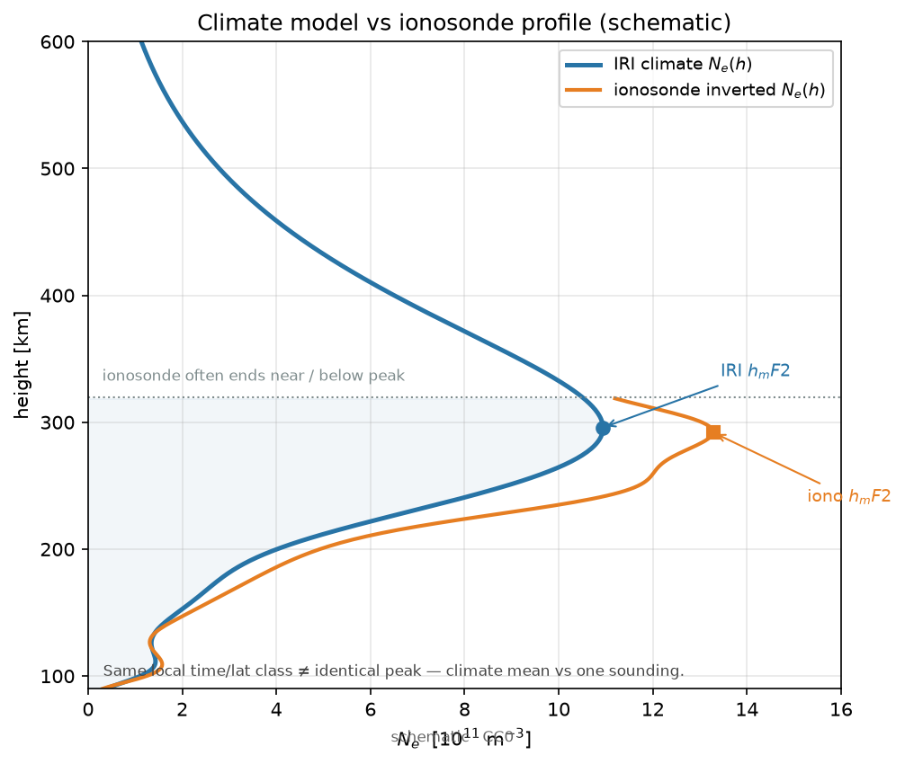
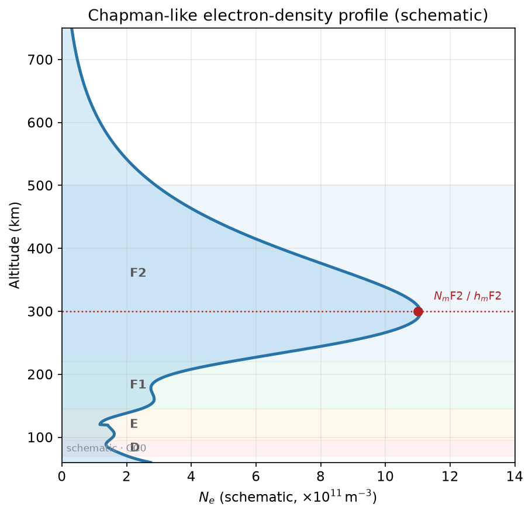
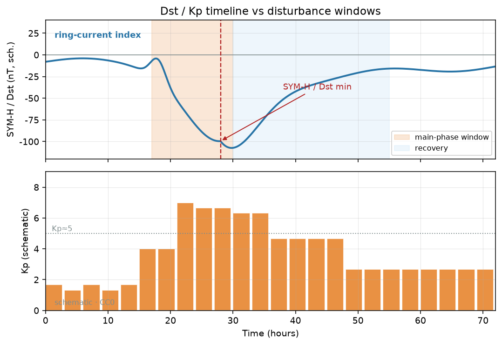
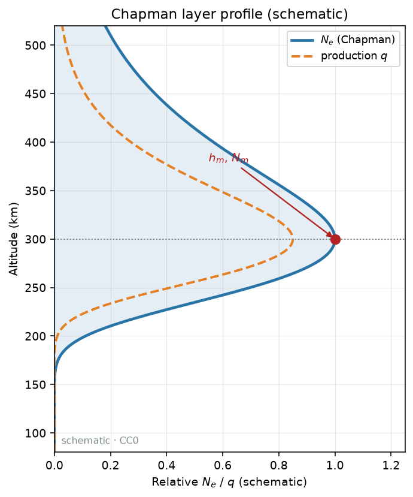
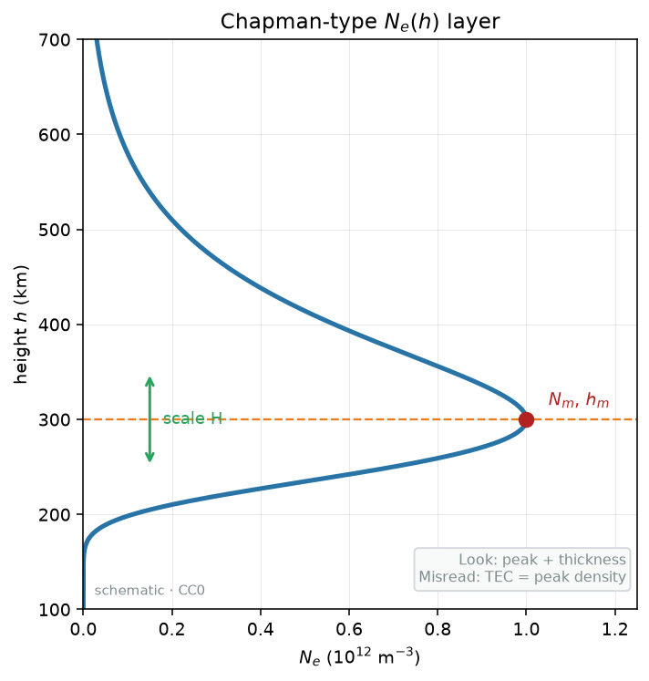
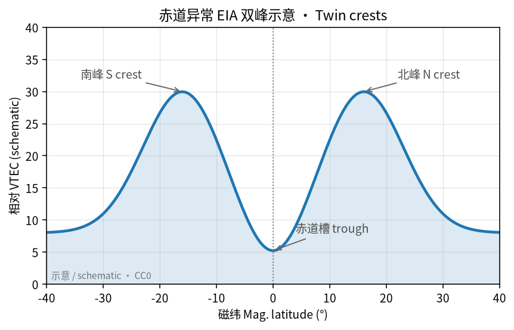
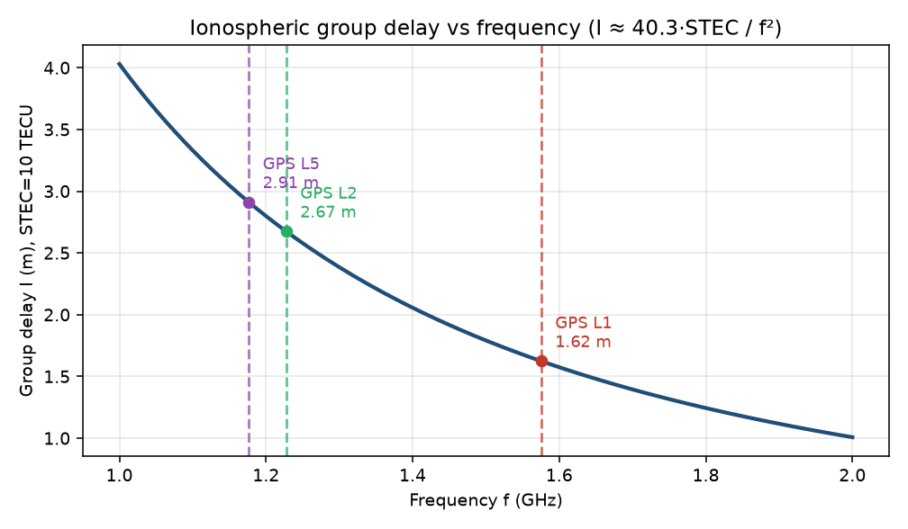

# 04 · IRI / NeQuick / NeQuick-G：气候模型解什么问题？

> **课堂定位**：接 03。你已会说「GIM/IONEX 是当天（或近实时）由 GNSS 观测估计的图」。本课换一条完全不同的答案来源：**经验气候模型**——IRI、NeQuick、以及 Galileo 单频用的 NeQuick-G。
> 路线固定为四段：**机制 → 公式拆解（逐步推导）→ 观测签名 → 分析步骤**。
>
> **写给谁**：第一次把 IRI 输出当「真值」、第一次听说 F10.7 / Az、第一次在单频接收机里看到 Galileo 电离层改正、以及分不清「气候平均」和「今天实况」的人。
>
> **学完交付**：一句话区分 IRI / NeQuick / NeQuick-G；口述气候 vs 天气；逐步写出 $N_e(h)\to\mathrm{TEC}$ 积分与驱动进方程的直觉链；按 γ→β→α 判读「数据−模型」残差；说出何时**不该**把模型当真值；点名本仓真实 `name`。

---

## 0. 开场：三个真实场景

请先合上笔记本，想三件事：

1. **没有双频、没有 GIM 下载权限，领导仍要「给个电离层延迟」**：单频消费设备、教学仿真、链路预算，常常只能靠**广播式/经验式模型**。Galileo 单频用户走的是 NeQuick-G（与 GPS 经典 Klobuchar 是不同家族）。
2. **论文写「与 IRI 符合良好」，审稿人问：你比的是气候还是天气？**：IRI 答的是「这类太阳/地磁条件下，平均长什么样」；GIM/双频 STEC 答的是「这一天、这一网，观测反演长什么样」。把气候当天气，结论会虚胖。
3. **磁暴夜，模型仍给出「平静的漂亮廓线」，你的定位残差却炸了**：经验模型在强扰动期可以系统性失灵。这不是软件 bug，而是**方法边界**：气候统计外推，不保证捕捉极端事件。

**本课地图（请对照目录）：**

| 段落 | 你在学什么 | 类比 |
|---|---|---|
| §1 词表 | 先认名字 | 进厨房前认厨具 |
| §2–5 **机制** | 气候相册、廓线、旋钮、Galileo 单频绑定 | 气候志 vs 温度计；收音机旋钮 |
| §6–11 **公式拆解** | $N_e$ 积分 → 驱动链 → Az → 残差法庭 | 把菜谱拆成一步一步 |
| §12 **观测签名** | 图上/序列上长什么样、假象怎么认 | 监控录像怎么认人 |
| §13–21 **分析步骤** | 调用清单、打假、测验、出门 | 值班清单与过关 |

配图均在 [`images/`](./images/)，版权见 [`images/SOURCES.md`](./images/SOURCES.md)。

**边界**：不重讲 IONEX 字段（回 [03](./03-gim-ionex.md)）；不把 TIE-GCM 等物理数值模式当 IRI；不把闪烁模型当 TEC 气候（见 05/13）；现象课 19–23 保持独立短文，**不回灌成本课超长文墙**。模型可以很有用；「有用」≠「当天实况真值」。

---

## 1. 词表（先扫一遍，主讲后再回看）

### 1.1 模型家族

| 术语 | 人话 | 稍严 |
|---|---|---|
| 经验模型 | 长期观测统计里「总结出的平均长相」 | 指数与坐标驱动，不是逐分钟同化预报 |
| 气候态（climatology） | 「这类日子通常怎样」 | 相对「今天实测天气」 |
| IRI | 国际参考电离层，电子密度等的「标准肖像」 | International Reference Ionosphere；COSPAR/URSI |
| NeQuick / NeQuick2 | 便于给 $N_e$ 廓线并积出 TEC 的经验族 | ITU 等传播场景常见；科研调用口径 |
| NeQuick-G | Galileo **单频电离层改正**采用的 NeQuick 版 | 输入绑 Galileo 广播消息 |
| Klobuchar | GPS 经典单频改正（另一家族） | 八点系数广播；本课对照用 |
| NTCM-G | Galileo 相关另一经验改正思路 | 与 NeQuick-G 不同族；目录有 `ntcmg` |
| 廓线 $N_e(h)$ | 电子密度随高度怎么变 | 模型常能给；GNSS TEC 直接给的是柱积分 |
| TEC（模型） | 把廓线沿路径或竖直积分得到的柱总量 | 与 GIM TEC 比时要统一几何与口径 |

### 1.2 驱动与坐标

| 术语 | 人话 | 稍严 |
|---|---|---|
| 世界时 / 地方时 | 「几点」与「当地白天还是晚上」 | 时间与经度一起决定太阳天顶几何 |
| 年积日 / 月份 | 季节信息 | 冬夏气候不同 |
| 地理纬经高 | 你在地球哪里、多高 | 输入的基本三维位置 |
| 地磁纬 / 修正磁纬 | 「相对磁极」的位置 | 许多过程按磁纬组织 |
| F10.7 | 太阳 10.7 cm 射电流量，「体温计」 | 驱动高层电离；有日值/多日平均等用法 |
| Az（有效电离参数） | NeQuick 把太阳活动「塞进」廓线的旋钮 | 可由 F10.7 或 Galileo 广播参数映射 |
| Ap / Kp / Dst 等 | 地磁活动指数家族 | 不同模型选用不同；暴期尤其敏感 |
| 太阳天顶角 $\chi$ | 太阳在当地「抬多高」 | 白天电离的重要几何量 |
| 广播电离层参数 | 导航电文发给单频用户的系数 | Galileo NeQuick-G ≠ GPS Klobuchar 八点 |

### 1.3 残差与使用场景

| 术语 | 人话 | 稍严 |
|---|---|---|
| 残差 $R$ | 实况减气候（或减模型）剩下的差 | $R=X_{\mathrm{data}}-X_{\mathrm{model}}$ |
| 单频改正 | 只有一个频率时，用模型猜电离层延迟 | 消不掉的一阶项靠模型减 |
| 双频无电离层 | 两频组合消一阶电离层 | 02 课；不依赖 IRI |
| 背景场 / 对照气候 | 同化或异常分析里「先铺的平均底子」 | 模型常当背景，实测改背景 |
| 模型天花板 | 气候平滑表达能力的上限 | 超级风暴精细结构本来就不会 |
| 失效模式 | 模型最容易错的时候 | 强磁暴、强 ESA、突发 TID 等 |

**纪律**：禁止说「IRI 测到了 TEC」——应说「IRI 给出了气候态估计」；禁止把 NeQuick2 与 NeQuick-G 输入输出当成可随意互换；禁止在磁暴个例里只用模型不引用实测/GIM 还宣称「表征了该事件」；允许教学先跑在线 IRI，但必须口头声明「这是气候肖像」。

---

# 第一段 · 机制

> 目标：用「因果」讲清——气候模型在解什么、为何能给 $N_e(h)$、旋钮各自拧哪一块、NeQuick-G 为何绑 Galileo。完整公式留给第二段。

---

## 2. 先问对问题：你缺的是「实况」还是「可重复的平均」？

> 图源：本仓库自制示意，见 [`images/SOURCES.md`](./images/SOURCES.md)。电离层是大气被电离的那一段高度域；气候模型要画的是这段域里「平均电子怎么堆」，不是卫星拍的天气照片。

| 你真正需要的 | 更合适的工具 |
|---|---|
| 某日某区尽量贴观测的 VTEC 场 | GNSS GIM / 自建 STEC 建图（03） |
| 完整高度廓线且没有测高仪/掩星 | IRI / NeQuick 等（再声明气候属性） |
| 单频接收机可实现的广播改正 | Klobuchar / **NeQuick-G** / 其他广播模型 |
| 教学、算法基准、可重复实验 | 固定版本的 IRI/NeQuick + 固定指数 |
| 磁暴过程机理与强扰动结构 | 慎用纯气候模型；优先实测 + 物理模式/同化 |

类比总纲（请背）：

- **GIM** ≈ 今天的「实况分析天气图」；  
- **IRI/NeQuick** ≈ 「该季节、该太阳活动档的平均气候图」；  
- **NeQuick-G** ≈ 「Galileo 发给单频用户的那本随身气候小册子（带当日广播参数微调）」。

**机制一句话**：经验模型不「测量」今天的电子柱；它根据坐标与活动指数，从长期统计系数表里取出「这类条件下通常怎样」的肖像。

---

## 3. IRI：百科全书式标准肖像——解的是 $N_e(h)$

> **看图要点**：平滑蓝线是气候平均肖像，橙线是一次测高仪反演；峰高/峰值常有差别，且测高仪往往到不了完整顶部。图源：自制 CC0。

> 图源：自制示意。D/E/F 层是高度上的密度堆叠；IRI 的核心交付是整条（或分段）$N_e(h)$，TEC 是积分后果。

> 图源：自制计算示意。Chapman 型是教学上最常见的「峰在中间、上下衰减」形状直觉；真实 IRI 比单峰 Chapman 更复杂，但「峰密度 + 峰高 + 厚度」三旋钮的心智模型仍然有用。

IRI（International Reference Ionosphere）由国际社区长期维护。版本口头常见 IRI-2016、IRI-2020、IRI-2026 等——**写论文必须写版本**（本仓有 `IRI-2026-package`、`IRI-2020-package`、`IRI-2016-package` 等）。

人话步骤（机制层，公式见第二段）：

1. 你告诉它：何时、何地、多高（或要整条廓线）；  
2. 再提供/让它读取太阳与地磁相关驱动（视实现与开关）；  
3. 它返回：该点的 $N_e(h)$ 等；你也可积分得到 TEC；  
4. 你拿去：教学画廓线、与实测比「偏了多少」、给射线追踪当背景、给其他模块当默认电离层。

类比：IRI 像《某城市气候志》里的「七月午后平均气温廓线」——对城市规划有用，但不能替代今天下午的实况温度计。

跑 IRI 常常不只要一个 `.for` 文件，还要 **公共系数/指数文件**（`IRI-COMMON-FILES`、`IRI-indices`）。缺文件是初学者「能编译、一跑就怪/全零/崩」的主因。

---

## 4. 旋钮机制：时间、位置、F10.7、Ap 各自拧哪一块？

> 图源：自制示意。白天抬升、夜间回落、低纬驼峰——这些是气候肖像里最稳的「平均长相」；模型旋钮主要在调这类大尺度结构的幅度与相位。

把模型想成一台老式收音机：

1. **时间（日期+时刻）**：季节与地方时。白天/夜晚、冬夏，电子含量基线不同。  
2. **纬度（常再映到地磁纬）**：低纬、中纬、高纬过程不同；赤道异常让「纬度」极敏感。  
3. **经度**：与世界时一起变成地方时；也影响磁地方时结构。  
4. **高度**：只要 TEC 时可能积分整柱；做 HF/掩星对照时，峰高与形状比单 TEC 更要命。  
5. **F10.7（及类似太阳指数）**：太阳「亮不亮」的代理。高活动年许多地区白天 TEC 基线更高。用哪一天的 F10.7、是否多日平均，乱填会系统性抬高/压低。  
6. **地磁指数（Ap 等）**：告诉模型「地磁吵不吵」。即使有暴期修正开关，也**不保证**复现某次超级风暴细节。  
7. **Galileo 广播参数（仅 NeQuick-G）**：当日电文微调旋钮——与科研脚本手填 F10.7 **不是同一用户接口**。

**机制口诀**：坐标选「相册哪一页哪个格子」；指数选「翻哪一本平均相册」；广播参数是单频机里的「官方当日微调」。

> 图源：自制示意。Kp/Dst 等窗口告诉你「地磁吵不吵」；把安静默认指数塞进暴期仿真，等于用错相册——残差法庭应先判旋钮事故。

---

## 5. NeQuick 族与 NeQuick-G：传播友好 vs Galileo 绑定

**NeQuick**（如 `NeQuick2-ICTP`、`Nequick-ITUR`、`NeQuickJRC`）同样给经验 $N_e$ 结构，工程上强调：**沿任意射线积分 TEC/延迟比较方便**，故在电波传播、链路预算、ITU 场景出镜率高。

与 IRI 的课堂分工（简化、便于记忆）：

- IRI ≈ 「参考标准肖像、参数丰富、社区对照基准」；  
- NeQuick ≈ 「传播与路径积分友好的经验廓线工具」。

二者都能积 TEC；不要说「只有 NeQuick 才有 TEC」。差别在实现生态、输入习惯、社区用途与版本政策。

**NeQuick-G**（`Galileo-NeQuick-G` / `NequickG` / `NeQuickG-ESSR`）不是「NeQuick2 换皮」。它是 Galileo **开放服务单频电离层改正**采用的实现口径：接收机侧用导航电文中的电离层参数 + 链路几何，估计延迟。

| 用户类型 | 电离层策略直觉 |
|---|---|
| 双频/多频 | 组合消一阶；模型非必须（02） |
| GPS 单频（经典） | Klobuchar 广播八点（`Klobuchar-study-code` / `Klobuchar.jl`） |
| Galileo 单频 | **NeQuick-G** + 电文参数 |
| 另一 Galileo 相关族 | `ntcmg`（NTCM-G，勿与 NeQuick-G 混名） |

类比：NeQuick-G 像「手机地图里内置的官方路况估算公式」；NeQuick2 像「气象实验室自己的气候公式」。都叫路况/气候，**接口票据不同**。

---

# 第二段 · 公式拆解（逐步推导）

> 目标：每个符号有单位、有人话、有「这一步在干什么」。不要只背三个缩写，要能复述 $N_e\to\mathrm{TEC}$、驱动链、Az、残差法庭。

---

## 6. 公式路线图（先看全图，再逐步拆）

$$
(\varphi,\lambda,h,t;\,F10.7,\,Ap,\,Az,\ldots)
\;\xrightarrow{\mathrm{coeff.}}\;
N_e(h)
\;\xrightarrow{\int\mathrm{d}h\ \mathrm{or}\ \int_{\mathrm{ray}}\mathrm{d}s}\;
\mathrm{VTEC}/\mathrm{STEC}
\;\xrightarrow{X_{\mathrm{data}}-X_{\mathrm{model}}}\;
R
\;\xrightarrow{\gamma\to\beta\to\alpha}\;
\{\gamma,\beta,\alpha\}.
$$

读法（中文在公式外）：坐标与指数经系数表选出肖像 → 得到电子密度廓线 → 积分成柱总量 → 与观测/GIM 相减得残差 → 先审口径（γ）、再查旋钮/失灵（β）、最后谈物理（α）。

---

## 7. 解剖台 A：气候问题的可操作定义

| | 气候肖像（IRI / NeQuick 族） | 天气实况（双频 STEC / GIM） |
|---|---|---|
| 问题 | 「这类太阳–地磁–季节–地方时条件下，平均 $N_e(h)$ 长什么样？」 | 「这一天、这条网、这些观测约束下，柱总量场是什么？」 |
| 输入 | 时间位置 + 指数/广播参数 + 系数表 | RINEX/产品 + 偏差与映射假设 |
| 输出 | 廓线与可积分 TEC | STEC/VTEC 场 |
| 暴期 | 可系统性失灵（方法边界） | 仍受站网/平滑限制，但是观测反演 |

**可操作定义**：若你关掉「今天的观测」，只留历书式指数与坐标，仍能给出几乎同一张图——你在用气候模型。若没有当天 GNSS（或掩星/测高仪同化），图就塌——你在用实况路线。

把 IRI 格网写成 IONEX 外形（目录甚至有格式化工具），**产品语义**仍是气候模型场，不是 IGS 分析中心观测建图。文件名和颜色骗不过方法论。

---

## 8. 解剖台 B：$N_e(h)$ → TEC——每个符号 + 迷你数值

IRI/NeQuick 的核心交付是电子密度随高度的经验描述。竖直总电子含量是积分后果：

$$
\mathrm{VTEC}_{\mathrm{model}}
=
\int_{h_{\min}}^{h_{\max}} N_e(h)\,\mathrm{d}h.
$$

斜路径则沿射线：

$$
\mathrm{STEC}_{\mathrm{model}}
=
\int_{\mathrm{ray}} N_e\,\mathrm{d}s.
$$

| 符号 | 含义 | 单位 / 备注 |
|---|---|---|
| $N_e(h)$ | 高度 $h$ 处电子数密度 | $\mathrm{m}^{-3}$（有时写 $\mathrm{el/cm^{3}}$，换算须小心） |
| $h_{\min},h_{\max}$ | 积分下限/上限 | km；口径声明的生命线 |
| $\mathrm{d}h$ / $\mathrm{d}s$ | 竖直微元 / 射线弧长微元 | km 或 m，与 $N_e$ 单位配套 |
| VTEC / STEC | 竖直 / 斜柱总量 | TECU；$1\,\mathrm{TECU}=10^{16}\,\mathrm{el\,m^{-2}}$ |

**迷你数值（建立量感）**：设某层厚度 $H=100\,\mathrm{km}=10^{5}\,\mathrm{m}$，层内近似均匀 $N_e=5\times10^{11}\,\mathrm{m^{-3}}$，则柱贡献

$$
\Delta\mathrm{TEC}
\approx N_e\cdot H
=5\times10^{11}\times10^{5}
=5\times10^{16}\,\mathrm{m^{-2}}
=5\,\mathrm{TECU}.
$$

读法：厚 100 km、密度 $5\times10^{11}\,\mathrm{m^{-3}}$ 的「均匀雾片」≈ 5 TECU。真实廓线有峰有谷，但数量级心智模型：F2 峰区对整柱贡献最大。

因此：

1. 你改 F2 峰密度 $N_mF2$ 或峰高 $h_mF2$，TEC 会变——机理入口在廓线形状；  
2. 只比对 TEC、从不看峰高/峰密度，等于只看柱高不看「雾层堆在哪」；  
3. GNSS GIM 直接约束的是柱，对峰高可辨识性弱——**模型有廓线、GIM 有柱，可比但不可冒充同一观测**。

> **看图**：峰高 $h_m$、峰密 $N_m$、标高 $H$ 决定廓线胖瘦。**误读**：把峰密度直接叫 TEC。

> 图源：自制示意。教学上常用 Chapman 型直觉：$N_e$ 在某高度达峰、上下衰减。IRI 实现远比单峰复杂，但「峰 + 厚度」仍是读图第一眼镜。

---

## 9. 解剖台 C：驱动如何进入方程（课堂直觉链）

> 下列是**课堂直觉方程**，不是某一 Fortran 行的逐行翻译。目标：你能回答「F10.7 / Ap / 纬经时」各自拧的是肖像的哪一块。

### 9.1 总结构：坐标选点 + 指数选相册

抽象两步：

1. **几何–时间坐标** $(\varphi,\lambda,h,t)$（常再映到地磁纬、地方时、太阳天顶角 $\chi$）；  
2. **活动指数**（太阳：F10.7 / 黑子数等；地磁：Ap 等）决定在系数表里取哪一套「平均行为」。

### 9.2 太阳活动：抬峰与整柱

经验上，白天 F2 层峰密度与 TEC 基线随太阳活动升高。直觉写法：

$$
N_mF2 \;\sim\; \mathcal{F}(\varphi_{\mathrm{mag}},\,LT,\,season,\,F10.7,\ldots).
$$

- **F10.7 偏高**：许多地区白天 $N_mF2$ 与积分 TEC 的气候期望上移；  
- **填错日期或用错「日值/多日平均」**：整图系统性抬高或压低——残差像「全球平移」，很像旋钮事故而非新物理；  
- **暴期只猛拧 F10.7**：太阳代理 ≠ 磁暴电动力学；正负相分区不会因此自动出现。

课堂实验：固定地点地方时，只扫 F10.7，看廓线峰与 TEC 单调抬升——这是在看**气候敏感度**，不是在「模拟一场暴」。

### 9.3 地磁活动：有限统计修正

部分 IRI 选项用地磁指数调节暴时平均行为。直觉：

$$
N_e^{\mathrm{(storm\;opt)}}(h)
=
N_e^{\mathrm{(quiet\;clim)}}(h)
+
\Delta N_e^{\mathrm{(stat\;storm)}}(h;\,Ap,\ldots).
$$

关键限制：$\Delta N_e$ 来自**历史统计平均**，不是这次事件的同化场；超级风暴可远超样本包络 → 残差巨大是**预期**；若指数仍用平静默认却声称「驱动了暴」，残差法庭应判 **β（旋钮错误）**。

### 9.4 纬 / 经 / 时 → 地方时结构

直觉链（请能默写箭头）：

$$
(t,\lambda)\mapsto LT,\quad
(\varphi,\lambda)\mapsto \varphi_{\mathrm{mag}},\quad
(LT,\chi,\varphi_{\mathrm{mag}},F10.7,Ap)\mapsto
\{N_mF2,\,h_mF2,\,\mathrm{shape}\}
\mapsto N_e(h).
$$

（中文在公式外：$\mathrm{shape}$ = 半厚度等形状参数。）

- **地理纬 + 地磁纬**：落在赤道异常、中纬槽还是高纬域。  
- **经度 + 世界时 → 地方时 LT**：同一世界时，东半球可能已是下午驼峰、西半球仍是上午。  
- **季节 / 年积日**：冬夏系数不同。  
- **太阳天顶角 $\chi$**：白天光致电离的几何开关；夜侧转用另一套衰减/维持经验。

> 图源：自制示意。赤道异常双峰是气候肖像里常出现的大尺度结构；模型可以「平均地」画出驼峰轮廓，但不等于捕捉某夜等离子体泡或锋面（现象细节见 21，本课不展开成文墙）。

---

## 10. 解剖台 D：Az 参数与 NeQuick-G 延迟直觉

### 10.1 Az：太阳活动如何「塞进」NeQuick

NeQuick 常用与太阳活动相关的驱动（文献与实现中常称 **Az**，或由 F10.7/广播参数映射而来的有效电离水平）来缩放廓线强度：

$$
N_e(h;\,\varphi,\lambda,t,\,Az),\qquad
\mathrm{STEC}=\int_{\mathrm{ray}} N_e\,\mathrm{d}s.
$$

- **Az 升高** ≈ 「今天电离水平按更活跃的气候页来画」→ 峰与 TEC 基线上移；  
- **Az 不是 GNSS 观测同化**——它是经验驱动旋钮；  
- 科研 NeQuick2：你常手填/文件给定太阳代理再映到 Az；  
- **NeQuick-G**：Az（或等价电离参数）由 **Galileo 导航电文中的电离层参数** 在接收机侧生成。

### 10.2 单频延迟：模型 TEC → 等效距离

接 01 课一阶群延迟直觉（系数以教材/标准为准，这里钉结构）：

$$
I(f)\;\approx\;\frac{40.3}{f^{2}}\,\mathrm{STEC},
$$

其中 $I$ 为等效距离延迟（m），$f$ 为频率（Hz），STEC 需与单位配套（常用把 TECU 换成 $\mathrm{el\,m^{-2}}$）。单频用户无法用双频消掉这一项，于是用模型估 $\widehat{\mathrm{STEC}}$ 再减：

$$
\hat{I}_{\mathrm{NeQuick\text{-}G}}(f)
\;\approx\;
\frac{40.3}{f^{2}}\,\widehat{\mathrm{STEC}}(\mathrm{bcast},\,\mathrm{geom}).
$$

（中文在公式外：$\mathrm{bcast}$ = Galileo 广播电离层参数；$\mathrm{geom}$ = 链路几何。）

**纪律**：模型改正是折中；**不能**宣称达到双频无电离层同等水平。禁止把 NeQuick2 参数硬塞进 Galileo 电文槽还自称合规。

> 图源：自制计算示意。同一 STEC，频率越低延迟越大；单频改正猜的是「这一刀有多长」，双频测的是「两刀之差」。

### 10.3 驱动进方程对照表（背诵用）

| 驱动 | 进方程的直觉位置 | 拧错时的残差长相 |
|---|---|---|
| F10.7 / Az | 缩放 $N_m$ / 整柱气候水平 | 大范围近均匀偏置 |
| Ap 等 | 统计暴时修正项（若开启） | 该开没开 → 暴期残差爆炸；乱开 → 假暴结构 |
| 纬/磁纬 | 选择结构域（EIA/槽/高纬） | 驼峰位置、高低纬符号错 |
| 经度+时间 | 地方时 / $\chi$ | 日变化相位错（「东边的下午接到西边」） |
| 广播 NeQuick-G 参数 | 接收机侧 Az 等效 | 电文槽错 → 单频延迟整体漂 |
| 版本/公共文件 | 系数表本身 | 怪零、崩、不可复现 |

---

## 11. 解剖台 E：残差公式与法庭顺序

> 图源：自制示意。03 课安静日差值是「实况−实况」；本节模型残差是「实况−气候」。两者都有用，问题不同，不能偷换。

$$
R(\lambda,\varphi,t)=X_{\mathrm{data}}(\lambda,\varphi,t)-X_{\mathrm{model}}(\lambda,\varphi,t).
$$

**先 γ（口径）→ 再 β（旋钮/失灵）→ 最后 α（物理）。**

| 判决 | 关键判据 |
|---|---|
| γ 假残差 | STEC 减竖直；时标/经度乱；积分高度口径不一；把单频改正输出当 VTEC |
| β 失灵/旋钮 | 指数日期错；缺 `IRI-COMMON-FILES`/`IRI-indices`；NeQuick2↔G 混用；残差随你改 F10.7 整体滑、却不随 Dst 窗口走 |
| α 物理天气 | 与主相/恢复相对齐；空间型像正负暴/EIA 变形；换 GIM/换质控站仍同号；指数版本已核对 |

**模型天花板**（操作化）：强扰动期 $|R|$ 系统变大且模型绝对场仍「平静漂亮」；你提高 F10.7/Ap 只能整体平移或轻度变形，**造不出**观测上的分区锋面；残差空间型跟着数据走，不跟着你改模型开关的时间戳走。

此时正确叙事：**「气候模型达到天花板；残差度量偏离气候的幅度」**——不是「IRI 表征了该暴的精细结构」。现象剧本（正负暴、泡、TID、耀斑/日食）见 19–23，本课只留判据，不展开成文墙。

**与安静日 GIM 差值的分工：**

| 基线 | 做法 | 含义 |
|---|---|---|
| 安静日 GIM | 风暴 GIM − 安静 GIM | 相对近期安静**实况**的天气差（03） |
| IRI/NeQuick | 数据 − 模型 | 相对**气候肖像**的偏离（本节） |

---

# 第三段 · 观测签名

> 目标：合上公式，只看「图上/序列上会长什么样」。先认脸，再决定要不要开庭。

---

## 12. 模型场、残差、单频改正：会长什么样？

### 12.1 安静日「气候」场（模型侧）

- 日变化平滑：正午附近抬升、夜间回落；低纬可出现平均 EIA 双峰轮廓。  
- 太阳活动高年整图偏「厚」；低年偏「薄」——像曝光旋钮。  
- 空间上大尺度光滑，很少出现观测里那种细碎锋面或空洞噪声斑。

**签名口诀**：太漂亮、太光滑、换指数只整体胖瘦 → 气候肖像在正常工作。

### 12.2 F10.7 / Az 拧错的签名

- 全球或大区域近均匀偏置；残差色块像「整层楼加减」而非分区锋面。  
- 你只改 F10.7，异常斑块整体滑走或整体变淡 → 偏 β，不要急着宣 α。  
- 日值/多日平均用错：可能出现「相位差不多但对不齐幅度」的全日偏置。

### 12.3 地方时 / 经度搞反的签名

- 日变化驼峰接到错误经度带（「东边的下午接到西边」）。  
- 与同日 GIM 比，残差呈「东西反号」或相位错半拍。  
- 扫 F10.7 时若出现「移动的窄锋」，先查经度/地方时 bug（γ），不是新物理。

### 12.4 缺公共文件 / 版本混乱的签名

- 全零、常数怪值、峰高离谱（如 $h_mF2$ 飞到不合理高度）、程序崩。  
- 同一脚本换机器结果不可复现（系数包未随仓库走）。  
- 在线点选（`CCMC-IRI-online`）与本地包差一截且说不清开关 → 先记版本，再比残差。

### 12.5 暴期「天花板」签名

- 模型绝对场仍平静漂亮；GIM/STEC 已大起大落。  
- $|R|$ 巨大且空间型跟着数据/指数窗口走，不跟着你改模型开关的时间戳走。  
- 提高 Ap 只有轻度变形，造不出观测锋面 → 天花板叙事，不是「模型表征了精细暴结构」。

### 12.6 口径假残差签名（γ）

- 用 STEC 减竖直模型 TEC：残差随仰角/地方时几何走，像「天气」其实是苹果减橘子。  
- 积分上限不同（是否含上层/等离子体层）：系统性数 TECU 差，全日同号。  
- 把 NeQuick-G 单频延迟输出当成 VTEC 真值去减 GIM：单位与几何双重错。

### 12.7 NeQuick2 vs NeQuick-G 混用签名

- 科研 Az 路径的残差被拿去评价「官方 Galileo 单频改正性能」——接口票据不同，结论不可搬家。  
- 电文槽填了 NeQuick2 习惯参数：单频延迟整体漂，定位残差像「电离层多了一层楼」。

### 12.8 TEC 大 ≠ 闪烁强（再次钉死）

气候模型给的是平滑柱/廓线；闪烁与 ROTI 是另一现象族（05）。模型 TEC 高，不自动等于强闪烁；残差大，也不自动等于闪烁。

---

# 第四段 · 分析步骤

> 目标：把机制与公式收成可执行的值班清单、打假口诀、仓库对照与过关测验。

---

## 13. 调用与残差走查清单（建议打印）

### 13.1 固定「数据侧」是谁

1. 质控后的双频 STEC→映射 VTEC（02 课门禁通过）；或  
2. 某 AC 的 GIM/IONEX（03：`CDDIS-IONEX`、`ionex` / `ionex_reader` 等）；  
3. 近实时产品（`ESA-TIO-NRT-TEC`、`NOAA-SWPC-GloTEC`、`CAS-BDsmart-RTS-Iono`）只作快速看图，精密结论慎用。

### 13.2 固定「模型侧」是谁

1. 写死版本：`IRI-2026-package` / `IRI-2020-package` / `iri2020` / `PyIRI`，或 `NeQuick2-ICTP`。  
2. 配齐 `IRI-COMMON-FILES`、`IRI-indices`（IRI 路径）。  
3. 记录 F10.7、Ap 等来源与日期；暴期不要偷用平静默认还假装「驱动了暴」。  
4. Galileo 单频场景用 `Galileo-NeQuick-G` / `NequickG` / `NeQuickG-ESSR`，不要拿科研 NeQuick2 残差解释电文改正性能，除非明确做跨口径对比。

### 13.3 对齐几何与时间

1. 统一到 VTEC 或统一到同一射线 STEC。  
2. 同一世界时（或地方时）切片。  
3. 积分高度范围若可知，尽量声明；不知则当局限写进结论。

### 13.4 算残差并可视化

对称色标；同时保留数据绝对场与模型绝对场，避免「只看残差做梦」。  
`mgfernan-pygnss`、`gri-iono`、`CCMC-IRI-online`、`DiffIonMap` 等可辅助（以各项目文档为准）。

### 13.5 开庭问题清单（代替感觉）

1. 我改对 F10.7 之后，残差是否只发生整体平移？若是，可能是旋钮，不是新物理。  
2. 残差是否在测站稠密区与稀疏区同样「精细」？稀疏区过细 → 降级。  
3. 残差时间演变是否跟着 Dst/Kp，而不是跟着我换模型版本的时间？  
4. 残差空间型是否像文献中的正/负暴，而不是像截断/平滑斑？  
5. 若只用模型、不用数据，我还能讲同一个「事件故事」吗？若能，故事太可疑。

### 13.6 「不要用模型当真值」的操作化检查单

出现任一即暂停：

1. 研究目标写着「事件期间 TEC 变化/精细结构」；  
2. 地磁指数显示强扰动，而你仍只用平静气候默认；  
3. 你需要小尺度梯度/闪烁，而模型只有平滑气候；  
4. 你无法说清指数与版本；  
5. 审稿人问「观测在哪」时你只能指模型图；  
6. 残差已显示天花板，仍把模型等值线当锋面证据。

**正确组合**：模型作气候基线或单频改正；GIM/STEC 作实况近似；残差作偏离度量——三者标签不许撕掉。

### 13.7 90 秒口播稿（可直接背）

GIM 是今天的实况分析图；IRI/NeQuick 是平均气候肖像；NeQuick-G 是 Galileo 单频机里的官方小册子。模型解的是 $N_e(h)$，TEC 是积分出来的。F10.7 与 Az 拧曝光，Ap 至多贴统计滤镜。残差等于当天的脸减平均肖像：先排口径，再查旋钮，最后才谈物理。碰到天花板，请 GIM 上场，不要给模型加冕为风暴真值。

---

## 14. 何时用模型？合法工作流口述

**更倾向模型：**

- 单频定位需要广播改正（NeQuick-G / Klobuchar 等）；  
- 教学演示廓线形状、写单元测试需要可重复背景；  
- 需要 $N_e(h)$ 而你没有测高仪/掩星/非相干散射；  
- 历史极早期或无 GNSS 网覆盖时段，只能给气候背景；  
- 做「实测减气候」的异常分析（模型当气候基线）。

**驱动–残差联合练习（无代码口述版）：**

1. 固定 IRI 版本，安静日中纬正午，扫 F10.7 → TEC 气候值单调变；与同日 GIM 残差主要呈近似偏差。若出现「移动窄锋」，先查经度/地方时（γ）。  
2. 主相日正确填 Ap/F10.7，仍见分区正负残差且换 GIM 同号 → 倾向 α；仍须写「相对 IRI-某版气候」。Ap 改回 0 残差更大但空间型差不多 → 天花板叙事。  
3. Galileo 单频仿真用官方 NeQuick-G + 电文；不要用 NeQuick2 残差评价官方改正性能，除非题目就是跨口径。  
4. 故意制造 β——指数错一天 → 残差应接近大尺度偏置；若写成「发现 TID」，不及格。

---

## 15. 常见误解专节

**误解 1：IRI 比 GIM 更「物理」、所以更真。**  
错。IRI 是经验参考；GIM 是观测反演产品。真假维度不同。物理数值模式（如 TIE-GCM）又是第三条路。

**误解 2：NeQuick-G 就是 NeQuick2 换皮。**  
错。接口、参数、官方用途绑定 Galileo 单频改正；科研 NeQuick2 不能无声明替换。

**误解 3：把 F10.7 填成「随便一个常数」没关系。**  
错。太阳活动旋钮会整体抬升/压低；对比实验必须记录指数。

**误解 4：模型 TEC 与 GIM TEC 差 5～10 TECU 就说明程序写错。**  
不一定。气候 vs 实况、上层口径、映射与壳高、地方时结构，都可能造成数 TECU 级差异。先查对齐，再查 bug。

**误解 5：单频 + NeQuick-G 可以达到双频无电离层同等水平。**  
错。模型改正是折中；双频消除一阶项是另一量级的故事。

**误解 6：有了 IRI 就不需要 `IRI-COMMON-FILES` / 指数。**  
错。缺公共文件是初学者最常见翻车点。

**误解 7：在线点选 IRI 的结果可以不写版本直接进论文。**  
危险。必须记录模型版本、选项开关、指数与时间。

**误解 8：残差大 = 我发现了新物理；残差小 = 无天气。**  
打假：先排口径与指数；小残差也可能是两边都被平滑。

**误解 9：把 IRI 格网存成 IONEX 外形，就能在论文里称为 IGS GIM。**  
不能。格式外壳 ≠ IGS 观测分析中心产品语义。

**误解 10：赤道夜间模型很准，因为「晚上简单」。**  
错。低纬夜间结构、等离子体泡等可让气候与实况差很远；夜间 ≠ 简单（细节见 21，此处不展开）。

---

## 16. 和本仓库工具对上号

下列名称均已在 `PROJECTS.json` 核对存在。

| 目的 | 真实 `name` |
|---|---|
| IRI 年代包 | `IRI-2026-package`、`IRI-2020-package`、`IRI-2016-package`、`IRI-2012-package` |
| 公共文件/指数 | `IRI-COMMON-FILES`、`IRI-indices`、`IRI2020_parameters` |
| Fortran/包装 | `IRI-Fortran`、`iri2020`、`iri2016`、`iri90`、`PyIRI`、`pyIRI2016`、`iricore`、`IRI-MATLAB-FileExchange` |
| 在线 | `CCMC-IRI-online` |
| 扩展/更新气候 | `IRI-Plas-SPIM-IZMIRAN`、`GIRO-IRTAM`、`PyIRTAM` |
| NeQuick2 | `NeQuick2-ICTP`、`Nequick-ITUR`、`NeQuickJRC` |
| NeQuick-G | `Galileo-NeQuick-G`、`NequickG`、`NeQuickG-ESSR`、`NeQuick2-MLF2`（慎） |
| 多模型延迟 | `gri-iono` |
| 对照脚本 | `mgfernan-pygnss` |
| 单频对照 | `Klobuchar-study-code`、`Klobuchar.jl`、`ntcmg` |
| 数据场 | `CDDIS-IONEX`、`ionex`、`ionex_reader` |
| 差分 | `DiffIonMap` |
| 扰动线索（进阶） | `IRI_TID`、`TEC_gradient_computation` |

**对照口诀**：要气候肖像 → IRI 包 + 公共文件；要传播积分 → NeQuick2；要 Galileo 单频 → NeQuick-G 官方；要当天实况图 → 回到 03 的 GIM/IONEX。

流程物理根 → [01-ionosphere-tec-basics.md](./01-ionosphere-tec-basics.md)；双频 STEC → [02-gnss-dualfreq-tec.md](./02-gnss-dualfreq-tec.md)；GIM → [03-gim-ionex.md](./03-gim-ionex.md)；定位改正语境 → [06-iono-positioning.md](./06-iono-positioning.md)。

**别做**：把模型当事件真值；混用 NeQuick2/G；不记版本与指数；把现象课 19–23 需求回灌成本课超长文墙。

---

## 17. 课堂测验（带演算的完整答案）

> **阅读提示：** 请在 github.com 网页预览本文。下面答案刻意写成纯文本，避免公式块在测验区露源码。

**题 1.** 一句话区分 IRI、NeQuick、NeQuick-G。  
**答：** IRI 是国际参考经验电离层（标准肖像）；NeQuick 是便于廓线/TEC 积分的经验模型族；NeQuick-G 是 Galileo 单频改正采用的 NeQuick 版本，接口绑广播参数。

**题 2.** 气候态与实测 GIM 的核心差别？可操作定义？  
**答：** 气候态由历史统计+指数驱动给「通常怎样」；GIM 由当天观测建「这一天怎样」。关掉当天观测图仍在→气候；图塌→实况。

**题 3.** IRI 解的核心状态量是什么？TEC 从哪来？  
**答：** $N_e(h)$ 廓线；TEC 是沿竖直或射线积分的后果。

**题 4.** 均匀层 $N_e=5\times10^{11}\,\mathrm{m^{-3}}$，厚 $100\,\mathrm{km}$，柱贡献约几 TECU？  
**答：** $5\times10^{16}\,\mathrm{m^{-2}}=5\,\mathrm{TECU}$。

**题 5.** F10.7 与 Az 在模型里像什么旋钮？拧错残差长什么样？  
**答：** 太阳活动/有效电离水平的「曝光」旋钮；拧错常呈大范围近均匀偏置。

**题 6.** 残差法庭为何先 γ 再 β 最后 α？  
**答：** 口径错误与旋钮错误会造成假现象；先排除，才不会把伤疤写成新物理。

**题 7.** 超级风暴期模型残差巨大，正确解释？  
**答：** 常表明气候经验模型达到天花板、不是事件真值；可用作偏离气候的度量，不可伪称模型表征了精细暴结构。

**题 8.** Galileo 单频与 GPS 经典单频改正模型各点名一个。  
**答：** Galileo → NeQuick-G；GPS 经典 → Klobuchar。

**题 9.** 安静日 GIM 差值与 IRI 残差有何不同？  
**答：** 前者实况减实况；后者实况减气候肖像。

**题 10.** 举出三种「不该把模型当真值」的场合。  
**答示例：** 磁暴事件精细结构表征；小尺度梯度/闪烁研究；论文需要观测实况却只交模型图。

**题 11.** name：两个 IRI 包、一个公共文件、一个 NeQuick2、一个 NeQuick-G、一个 IONEX 入口。  
**答示例：** `IRI-2026-package`、`IRI-2020-package`；`IRI-COMMON-FILES`；`NeQuick2-ICTP`；`Galileo-NeQuick-G`；`CDDIS-IONEX`。

**题 12.** 把 IRI 格网存成 IONEX 外形，能否称为 IGS GIM？  
**答：** 不能。格式外壳≠ IGS 观测分析中心产品语义。

**题 13.** 只改 F10.7 就让「异常斑块」整体滑走，更像哪类判决？  
**答：** 偏 β（旋钮/模型驱动问题）。

**题 14.** 一阶群延迟结构：$I\approx 40.3/f^{2}\times\mathrm{STEC}$。单频 NeQuick-G 在估什么？  
**答：** 用广播参数+几何估 $\widehat{\mathrm{STEC}}$，再换成等效距离改正；不是双频实测。

---

## 18. 综合演算作业（建议限时 25 分钟）

**(1)** 某均匀片层 $N_e=2\times10^{11}\,\mathrm{m^{-3}}$，厚度 $200\,\mathrm{km}$。柱贡献约几 TECU？  
**(2)** 若 IRI 积分得 $\mathrm{VTEC}_{\mathrm{model}}=18\,\mathrm{TECU}$，同点同时刻 GIM 为 $25\,\mathrm{TECU}$（已确认同为 VTEC、同时刻）。残差 $R=$？先倾向哪类解释，还缺什么证据才能宣 α？  
**(3)** 固定地点地方时，把 F10.7 从 70 改到 180，模型 TEC 从 12 升到 28 TECU，GIM 仍约 20 TECU。两种 F10.7 下残差各约多少？这说明什么实验？  
**(4)** 主相日模型场几乎不变，GIM 某区从 22 升到 40 TECU。相对模型的残差约多少？更像天花板还是「模型表征了风暴」？  
**(5)** Galileo 单频：电文参数驱动 NeQuick-G 估得 $\widehat{\mathrm{STEC}}=20\,\mathrm{TECU}$。若频率约 $1.575\,\mathrm{GHz}$（L1 量级），只谈结构——延迟与 STEC 成正比、与 $f^{2}$ 成反比；若 STEC 估错 +5 TECU，延迟相对真值会怎样（定性）？

**参考答案（纯文本）：**

(1) $N_e\cdot H=2\times10^{11}\times2\times10^{5}=4\times10^{16}\,\mathrm{m^{-2}}=4\,\mathrm{TECU}$。  
(2) $R=+7\,\mathrm{TECU}$；先排除 γ（口径）与 β（指数/版本），再谈天气；还需指数窗口、多源同号等才能宣 α。  
(3) F10.7=70 时 $R\approx+8$；F10.7=180 时 $R\approx-8$。这是气候敏感度扫描，不是暴期仿真；残差符号随旋钮翻面说明幅度被曝光拧歪。  
(4) $R\approx+18\,\mathrm{TECU}$；更像模型天花板——气候场跟不上事件，残差度量偏离，不是模型「表征」了精细风暴。  
(5) 估高 5 TECU → 改正偏大（多减了一截），单频伪距电离层改正过度；定性上延迟误差与 ΔSTEC 同号放大（仍按 $1/f^{2}$）。

**加练：** 口述默写 §9.4 箭头链；手算题 (1) 换厚度 50 km、密度 $10^{12}\,\mathrm{m^{-3}}$ → 亦为 5 TECU——说明「薄而密」与「厚而稀」可积出相近柱，故只比 TEC 看不见峰形。

---

## 19. 板书八行 · 符号速查 · 口述检查

**板书八行：**

1. GIM = 实况估计；IRI/NeQuick = 气候肖像；NeQuick-G = Galileo 单频官方册。  
2. 模型核心状态是 $N_e(h)$；$\mathrm{VTEC}=\int N_e\,\mathrm{d}h$。  
3. 坐标选格子；F10.7/Az 拧曝光；Ap 至多统计滤镜。  
4. $R=X_{\mathrm{data}}-X_{\mathrm{model}}$；法庭顺序 γ→β→α。  
5. 天花板：暴期模型仍漂亮、拧指数造不出锋面。  
6. 禁止 NeQuick2 ↔ NeQuick-G 无声明互换；禁止 IRI 外形 IONEX 冒充 IGS GIM。  
7. 单频改正是折中；$I\sim 40.3/f^{2}\times\mathrm{STEC}$，测不到就靠模型猜。  
8. 工具口诀：IRI 包+公共文件 / NeQuick2 / Galileo-NeQuick-G / CDDIS-IONEX。

**符号速查卡：**

$$
\mathrm{VTEC}_{\mathrm{model}}=\int_{h_{\min}}^{h_{\max}} N_e(h)\,\mathrm{d}h,
\quad
\mathrm{STEC}_{\mathrm{model}}=\int_{\mathrm{ray}} N_e\,\mathrm{d}s,
$$

$$
(t,\lambda)\mapsto LT,\quad
(\varphi,\lambda)\mapsto\varphi_{\mathrm{mag}},\quad
(LT,\chi,\varphi_{\mathrm{mag}},F10.7,Ap,Az)\mapsto N_e(h),
$$

$$
R=X_{\mathrm{data}}-X_{\mathrm{model}},
\quad
I(f)\approx\frac{40.3}{f^{2}}\,\mathrm{STEC}.
$$

**值班速算条（建议抄卡片）：**

- $1\,\mathrm{TECU}=10^{16}\,\mathrm{el\,m^{-2}}$。  
- 均匀片：$N_e\cdot H$ 直接积柱（单位先齐）。  
- 残差先问：斜/竖？积分限？指数日期？版本？  
- 大范围平移 → 先疑 F10.7/Az；东西反号 → 先疑地方时/经度。  
- 暴期巨大残差 → 天花板叙事，不是模型加冕。

**口述检查（任抽三问）：**

1. 用气候志 vs 温度计区分 IRI 与 GIM。  
2. 默写 $N_e\to\mathrm{VTEC}$ 积分并给出一个均匀层数值。  
3. 说出 γ→β→α 各一条判据。  
4. 区分 NeQuick2 与 NeQuick-G 的接口票据。  
5. 列出四个真实 `name`（IRI 包、公共文件、NeQuick2、NeQuick-G）。  
6. 解释为何「与 IRI 符合良好」不能直接当「表征了该磁暴」。

合格标准：能写积分与残差式、能手算均匀层 TECU、能按法庭顺序说话，不只会背三个缩写。

---

## 20. 与前后课的接口 · 出门任务

| 你现在会的 | 下一课才会的 | 不要提前假装会 |
|---|---|---|
| 气候肖像 vs GIM 实况 | 闪烁 / ROTI 工艺 | 「高 TEC = 强闪烁」 |
| $N_e$ 积分与驱动旋钮 | 定位误差预算深挖 | 单频改正 = 双频 |
| 残差法庭 γ→β→α | 现象课 19–23 剧本 | 本课写成现象文墙 |
| NeQuick-G 与 Galileo 单频链接 | DCB 产品深挖 | 不问版本就引用模型 |

从 01/02/03 带来：STEC/VTEC；$M(e)$；双频 STEC；GIM 是观测反演产品。  
本课交出：会区分 IRI/NeQuick/NeQuick-G、会积 $N_e$、会判残差、知道模型边界。  
交给 05：气候与柱总量讲完；下一现象是信号发抖与 ROTI。

**下一课**：[05-scintillation-roti.md](./05-scintillation-roti.md)——高 TEC ≠ 一定强闪烁；ROTI 在测什么。

**出门任务：**

1. 用 `CCMC-IRI-online` 或 `PyIRI` / `iri2020` 拉一条正午与午夜廓线，记录版本与 F10.7；目视峰高是否离谱；  
2. 同日同点与某一 GIM（`CDDIS-IONEX` + `ionex`）比 VTEC，写出 $R$ 并先排 γ/β；  
3. （可选）打开 `Galileo-NeQuick-G` 文档目录，找到「广播参数输入」一节，用一句话对比科研 NeQuick2 的 Az 路径。

---

## 21. 本课验收与终句

- [ ] 能区分气候问题与天气问题，并说出 IRI 解的是 $N_e(h)$  
- [ ] 能口述 F10.7/Az、Ap、纬经时如何进入肖像  
- [ ] 能手算均匀层柱贡献（TECU）并写残差定义  
- [ ] 能区分 NeQuick2 与 NeQuick-G，并点名 Galileo 单频角色  
- [ ] 能按 γ→β→α 判读残差，并解释模型天花板  
- [ ] 能列出风暴个例禁止把模型当真值的场合  
- [ ] 能点名真实 IRI/NeQuick/GIM `name`

**终句**：指数与坐标选的是哪一本平均相册；Az/F10.7 拧的是相册的曝光；Ap 至多贴一层统计滤镜；廓线积分才得到 TEC。残差是当天的脸减平均肖像——先审口径与旋钮，再谈物理；碰到天花板，就请 GIM 与双频实况上场，而不是给模型加冕为风暴真值。

**版本说明**：本文件按「机制 → 公式拆解 → 观测签名 → 分析步骤」与 01–03 课同深度重写；嵌入大气分层、Chapman/$N_e$ 廓线、日夜 TEC、EIA、指数时间线、延迟–频率、残差等自制 CC0 图；引用项目名均来自 `PROJECTS.json` 核验。现象课 19–23 保持独立短文，不回灌成长文墙。

**相关软件 / 数据入口**（对照观测产品）：[`ionex-gim`](../software/ionex-gim.md) · [`data-access`](../data-access.md) · 相关课 [03](./03-gim-ionex.md)

（完）
