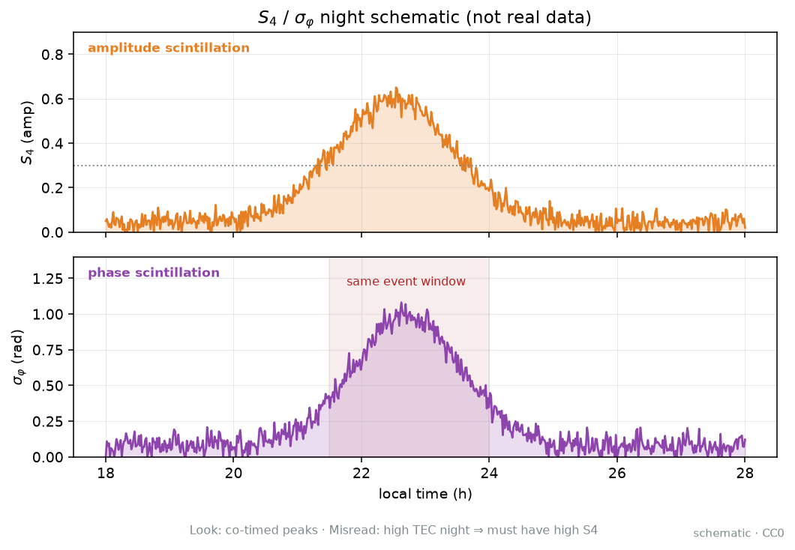

# 05 · 闪烁、S4、σφ、ROTI：和 TEC 图什么关系？

> **课堂定位**：接 04。你已会说「气候肖像 ≠ 当天实况」。本课换一条账本：**信号抖不抖**——幅度闪烁指数 S4、相位闪烁指数 σφ、以及无专用闪烁仪时的代理指标 ROTI。
> 路线固定为四段：**机制 → 公式拆解（逐步推导）→ 观测签名 → 分析步骤**。
>
> **写给谁**：第一次把 ROTI 图当成 TEC 图、第一次听说 S4/σφ、第一次在低纬夜里丢星却不知道该开哪本账的人。
>
> **学完交付**：一句话区分 TEC 与闪烁；口述相位屏→衍射→地面起伏；逐步写出 S4、σφ、ROT、ROTI；按图认签名（含假阳性）；完成一夜分析清单；点名本仓真实 `name`。

---

## 0. 开场：三个真实场景

请先合上笔记本，想三件事：

1. **赤道站日落后，定位突然失锁**：TEC 图仍「挺厚」，GIM 也没炸。值班员却看到周跳浪涌、可用星骤降。问题往往不在「电子有多少」，而在小尺度不规则体让信号**幅度/相位快速抖**——跟踪环跟不住。
2. **论文写「ROTI 升高说明闪烁强」**：审稿人问：你有没有专用闪烁仪？采样多少？窗口多长？ROTI 是 TEC 变化率的起伏统计，是**代理**，不是 S4 的同义语。相关 ≠ 恒等。
3. **只有 1 Hz CORS RINEX，领导仍要「今晚闪烁指数」**：正统 S4/σφ 需要高采样闪烁监测链。你可以算 ROTI 并负责任地写「不规则体活动代理」，但不能把 1 Hz C/N0 硬算成文献里的专用 S4 去横比绝对值。

**本课地图（请对照目录）：**

| 段落 | 你在学什么 | 类比 |
|---|---|---|
| §1 词表 | 先认名字 | 进厨房前认厨具 |
| §2–5 **机制** | 两本账、相位屏、Fresnel、纬度剧本 | 雾厚 vs 雾碎；纱窗摩尔纹 |
| §6–10 **公式拆解** | S4 / σφ / ROT / ROTI 逐步推导 | 把菜谱拆成一步一步 |
| §11–12 **观测签名** | 时间序列与地图上长什么样 | 监控录像怎么认人 |
| §13–20 **分析步骤** | 一夜清单、工具、测验、出门 | 值班清单与过关 |

配图均在 [`images/`](./images/)，版权见 [`images/SOURCES.md`](./images/SOURCES.md)。

**边界**：不重讲双频 STEC（回 [02](./02-gnss-dualfreq-tec.md)）；不把 GIM 平滑场当闪烁图（回 [03](./03-gim-ionex.md)）；不把气候 TEC 当闪烁（回 [04](./04-iri-nequick.md)）；定位误差预算深挖留给 [06](./06-iono-positioning.md)；闪烁仿真建模留给 [13](./13-scintillation-modeling.md)；现象课 19–23 保持独立短文，**不回灌成本课超长文墙**。

---

## 1. 词表（先扫一遍，主讲后再回看）

### 1.1 物理与传播

| 术语 | 人话 | 稍严 |
|---|---|---|
| 不规则体 | 电子密度小尺度「疙瘩」 | irregularities；百米–数十 km 谱 |
| 相位屏 | 一层「搓皱波前」的薄屏近似 | phase screen |
| 衍射 / 折射 | 碎成干涉斑 / 慢慢掰弯路径 | 小尺度谱 vs 大尺度梯度 |
| Fresnel 尺度 $r_F$ | 和 L 波段衍射「对得上」的特征横向尺度 | $r_F\sim\sqrt{\lambda z_{\mathrm{eff}}}$ |
| 幅度闪烁 | 强度忽明忽暗 | intensity / amplitude scintillation |
| 相位闪烁 | 载波相位忽前忽后 | phase scintillation |
| EPB / 气泡 | 赤道夜侧低密度等离子体泡 | equatorial plasma bubbles |

### 1.2 指数与代理

| 术语 | 人话 | 稍严 |
|---|---|---|
| S4 | 强度相对起伏有多凶 | 无量纲；窗口内强度归一化标准差 |
| σφ（sigma-phi） | 相位抖得有多厉害 | 去趋势相位残差的窗口标准差 |
| ROT | TEC 下一拍变了多快 | Rate of TEC；常见单位 TECU/min |
| ROTI | 这段时间 ROT「毛不毛」 | 窗口内 ROT 的标准差一类 |
| 代理指标（proxy） | 相关、可监测，但不是同一观测 | ROTI 相对 S4/σφ |
| ISMR | 专用闪烁监测记录/格式族 | 常含 S4、σφ 等产品字段 |

### 1.3 仪器与定位症状

| 术语 | 人话 | 稍严 |
|---|---|---|
| 闪烁接收机 | 高采样、专用固件的正统来源 | 数十 Hz 量级常见（以说明书为准） |
| 测绘型 CORS | 多给 1 Hz RINEX | 宜做 ROTI，不宜冒充专用 S4 |
| 跟踪环 | 跟上伪码/载波的闭环 | 抖太狠 → 失锁 |
| 周跳 / 失锁 | 相位计数跳变 / 跟丢 | 定位连续性崩 |
| C/N0 | 载噪比，强度的工程读数 | 幅度闪烁时常乱跳 |
| IPP | 视线戳到假定壳的点 | 空间归因用 |

**纪律**：禁止说「ROTI = 闪烁强度 = S4」；禁止用未声明窗口的 ROTI 与文献横比；禁止把 GIM 看不见小尺度说成「无闪烁」；允许只有 RINEX 时用 ROTI，但摘要必须写「代理」。

---

# 第一段 · 机制

> 目标：用「因果」讲清——抖从哪来、为何分幅度/相位两本账、Fresnel 为何重要、低纬气泡与高纬暴为何剧本不同。完整公式留给第二段。

---

## 2. 先问对问题：你关心「有多少」还是「抖不抖」？

| 你真正需要的 | 更合适的工具 |
|---|---|
| 某日某区电子柱有多厚 | GNSS STEC/VTEC、GIM（02/03） |
| 气候平均廓线 / 单频改正 | IRI / NeQuick / NeQuick-G（04） |
| 强度是否在快速起伏 | **S4**（专用闪烁链） |
| 载波相位是否在快速抖动 | **σφ**（同上） |
| 只有常规 RINEX，仍要监测不规则体活动 | **ROTI**（代理） |
| 定位是否因跟踪失败而断 | 失锁/周跳日志 + 上列指标合轴 |

类比总纲（请背）：

- **TEC / GIM** ≈ 「雾有多厚」——慢变背景与大尺度结构；  
- **S4 / σφ** ≈ 「雾里疙瘩碎不碎、光斑晃不晃」——秒级及以下的真实信号起伏；  
- **ROTI** ≈ 「用汤面皱纹多少，代理推测底下湍流活不活跃」——有用，但是听诊器，不是 CT。

**机制一句话**：闪烁不是 TEC 的别名；它是小尺度不规则体经衍射/干涉，在天线口面造成的幅度与相位快速起伏。

---

## 3. 不规则体 → 相位屏 → 地面干涉图样

> **看图要点（为什么画泡切射线）**
> - **看什么**：磁赤道附近 F 层低密度「泡」（EPB）横切 GNSS 射线；射线在泡区由直变「抖」。
> - **为什么**：大尺度耗空改变路径上的电子库存，壁上/尾流的小尺度不规则体才是衍射闪烁的直接推手——两本账可同窗。
> - **别误判**：有泡示意 ≠ 已测得 S4；地面接收机看到的是干涉图样扫过的时间序列。
> 图源：自制示意，见 [`images/SOURCES.md`](./images/SOURCES.md)。

GNSS L 波段穿过电离层时，若电子密度在横截面上不均匀，折射率就起伏。教学上常把一层不规则体近似成**相位屏**：

1. 波穿过屏 → 波前被「搓皱」（有的地方相位超前，有的落后）；  
2. 再往下自由空间传播一段距离 → **衍射与干涉**；  
3. 地面天线口面出现明暗与相位斑驳的**干涉图样**；  
4. 卫星在动、不规则体在漂 → 图样扫过天线 → 你看到时间序列上的快速起伏 = **闪烁**。

人话三句：不规则体是雾里的疙瘩；相位屏是花玻璃那一层；闪烁是花玻璃后面光斑在地上晃。

**为何会「发生」闪烁（因果链，四拍）：**

1. **密度疙瘩**把折射率搓皱 → 波前相位被局部提前/推后（相位屏动作）；  
2. **再传播一段距离**后，不同路径的波互相干涉 → 地面出现亮斑/暗斑与相位斑；  
3. **卫星在动、等离子体在漂** → 干涉图样扫过天线口面；  
4. 你在时间轴上看到的，就是秒级及以下的幅度/相位快速起伏。

缺任一拍都不叫教学意义上的「闪烁夜」：只有慢变 TEC 梯度、没有小尺度谱能量 → 更像延迟账；图样不动、视线也不扫 → 你几乎看不到时间序列上的抖。

厚雾可以不晃；薄雾也可以碎得厉害——**库存（TEC）与湍流（闪烁）是两本账**。

---

## 4. Fresnel 尺度：哪一档「纱孔」最会晃 L 波段？

衍射干涉有一个特征横向尺度，课堂称 **Fresnel 尺度**：

$$
r_F \sim \sqrt{\lambda\, z_{\mathrm{eff}}}
$$

| 符号 | 含义 | 量级直觉 |
|---|---|---|
| $\lambda$ | 载波波长 | GPS L1 约 0.19 m |
| $z_{\mathrm{eff}}$ | 等效几何尺度（屏高、接收几何） | F 区高度量级时常很大 |
| $r_F$ | 特征横向尺度 | GNSS 场景常落在数百米–数公里档 |

直觉：

- 不规则体谱在 Fresnel 尺度附近有能量 → 地面干涉对比度易大 → **幅度闪烁**更显眼；  
- 很大尺度的平滑梯度 → 更像慢慢弯折射线（延迟/TEC 形态），不一定制造强衍射斑；  
- 极小尺度若能量弱或被仪器带宽滤掉 → 你也「看不见」。

类比：用手机拍纱窗——孔洞尺度和像素「对上」时摩尔纹最明显。Fresnel 尺度就是和 L 波段衍射最对得上的那档纱孔。

**课堂纠错**：「有不规则体」≠「一定强闪烁」。还要看尺度是否对上 Fresnel、视线几何、背景密度、以及你的采样/带宽能不能抓住起伏。

> **看图要点（为什么画三档）**
> - **看什么**：左档「太大」→ 更像慢慢掰弯路径（折射/延迟账）；中档≈$r_F$ → 衍射干涉对比度最大（幅度闪烁最出镜）；右档「太小」→ 能量弱或被仪器带宽滤掉。
> - **为什么**：L 波段只对「对得上」的纱孔过敏——不是凡有疙瘩就猛晃。
> - **别误判**：有不规则体谱 ≠ 一定强 S4；还要几何与采样跟上。
> 图源：自制 CC0 示意。

**小数值例（Fresnel 量级，课堂必算）：**

取 GPS L1 $\lambda\approx0.1903\,\mathrm{m}$，等效屏高 $z_{\mathrm{eff}}=350\,\mathrm{km}=3.5\times10^{5}\,\mathrm{m}$：

$$
r_F\sim\sqrt{0.1903\times3.5\times10^{5}}=\sqrt{6.6605\times10^{4}}\approx258\,\mathrm{m}.
$$

换 $z_{\mathrm{eff}}=250\,\mathrm{km}$ → $r_F\sim\sqrt{0.1903\times2.5\times10^{5}}\approx218\,\mathrm{m}$；换 L5 $\lambda\approx0.255\,\mathrm{m}$、$z=350\,\mathrm{km}$ → $r_F\sim\sqrt{0.255\times3.5\times10^{5}}\approx299\,\mathrm{m}$。  
人话：GNSS 教学场景里，$r_F$ 常落在**数百米**档；气泡壁上「几百米–数公里」的谱能量最容易把幅度账掀翻。

**尺度过滤一览（机制侧）：**

| 不规则体横向尺度 | 更像什么 | 哪本账先响 |
|---|---|---|
| $\gg r_F$（平滑大梯度） | 慢慢弯折射线 | TEC / 延迟形态 |
| $\sim r_F$ | 强衍射干涉斑 | **S4** 易抬 |
| $\ll r_F$ 且能量弱 | 被滤掉或仪器看不见 | 你「测不到」≠ 物理为零 |

相对速度还会把空间尺度「翻译」成时间频率：

$$
f_{\mathrm{char}} \sim \frac{v_{\mathrm{eff}}}{L}
$$

$L$ 靠近 $r_F$ 且扫掠快 → $f_{\mathrm{char}}$ 升高 → **采样必须够**，否则指数被糊掉。

---

## 5. 幅度 vs 相位；低纬气泡钟 vs 高纬地磁钟

### 5.1 两本账为何要分开？

| 账本 | 物理直觉 | 工程症状 | 常用指数 |
|---|---|---|---|
| **幅度闪烁** | 衍射让能量重新铺开，天线进亮斑/暗斑 | C/N0 乱跳、相关峰变形、码跟踪难 | **S4** |
| **相位闪烁** | 波前搓皱 + 相对运动 → 相位快抖 | 载波环吃力、周跳、失锁、相位 TEC 毛 | **σφ** |

有时一边很凶、另一边还好——取决于谱形状、频率、几何与接收机环路带宽。报告禁止只写「闪烁强」四个空字。

**幅度 vs 相位：差异从哪来（机制侧加厚）**

| 问题 | 幅度账（S4） | 相位账（σφ） |
|---|---|---|
| 物理近邻 | 干涉**亮暗斑**扫过天线 → 强度相对起伏 | 波前搓皱 + 相对运动 → 相位快抖 |
| 对谱的敏感 | 更吃靠近 $r_F$ 的能量（衍射对比度） | 对更宽的相位扰动也敏感（去趋势不净时大尺度会混入） |
| 工程第一受害者 | 码环 / C/N0 / 相关峰 | 载波环 / 周跳 / 失锁 |
| 经典出镜舞台 | 低纬夜侧 EPB（幅度常很「吵」） | 高纬暴时相位失锁更扎眼 |
| 能否互相替代？ | **不能**——同夜可一边凶一边温 | **不能** |

人话比喻：幅度闪烁像「灯在闪」；相位闪烁像「音叉在抖音高」。灯稳但音高乱、或灯狂闪但音高还行——两种病，两本药。

> **看图要点（为什么两面板并排）**
> - **看什么**：同一事件窗内 S4 与 σφ 可以同向鼓包，也可以一高一平。
> - **为什么**：衍射强度起伏与相位抖动不是同一个统计量；谱形状与环路带宽会把两本账拉开。
> - **别误判**：高 TEC 夜 ≠ 一定高 S4；σφ 高也不许偷写成「S4=…」。
> 图源：自制 CC0 示意。

频率直觉（板书级，不堆严式）：同一环境下通常频率越低越容易抖得凶；多频机「某频点先失锁」并不奇怪。写事件请按频点分列症状。

### 5.2 赤道夜：地方时气泡剧本

日落后底部 F 区抬升、瑞利–泰勒类不稳定性放大 → EPB + 小尺度不规则体。故事主角是**日落之后数小时**，用**地方时**叙事比纯 UTC 更直觉。背景 VTEC 往往仍不低；ROTI、S4 易抬升；幅度闪烁常很「出镜」。气泡壁可同时有：大尺度耗空（TEC 局部降）+ 小尺度衍射（S4 升）——不是矛盾。

细节舞台见 [21](./21-equatorial-anomaly-bubbles.md)；本课只借机制，不扩写成现象文墙。

> **看图要点（为什么看海岸带）**
> - **看什么**：低纬夜侧泡/闪烁活动带相对海岸与磁赤道的走向（地方时气泡钟舞台）。
> - **为什么**：EPB 走廊贴磁纬而非贴国界；海岸线只是帮你把「舞台」钉到地图上。
> - **别误判**：带状示意不是单条实测羽；白天双峰凹槽勿直接贴「泡」。
> 图源：自制示意场 + Natural Earth 海岸线（非实测）。现象细读见 19–23。

> **看图要点**
> - **机制**：昏界线以西进入夜侧，不规则体走廊易抬头——用地方时对齐更清楚。
> - **看什么**：terminator 线与高值走廊谁在西侧。
> - **别误判**：示意走廊非逐泡轨迹；勿把日界线画成物理墙。
> 图源：本仓库自制示意场 + Natural Earth 海岸线（非实测事件）。

### 5.3 高纬：地磁钟剧本

磁层–电离层耦合、粒子沉降、对流增强——与赤道「每晚日落必演」不是同一剧本。时间更跟 Kp、Dst/SYM-H、AE 等走。教学上 **σφ / 相位失锁** 常更扎眼。勿把低纬气泡阈值原样粘贴到极区。

### 5.4 中纬

平时相对温和；暴时仍可有异常梯度、偶发闪烁风险。「中纬永远安全」是误解。

**口诀**：低纬夜看气泡钟（地方时）；高纬暴看地磁钟；中纬别装睡。

---

# 第二段 · 公式拆解（逐步推导）

> 目标：每个符号有单位、有人话、有「这一步在干什么」。不要只背三个缩写，要能复述 S4、σφ、ROT→ROTI，并解释采样与窗口为何是生死线。

---

## 6. 公式路线图（先看全图，再逐步拆）

$$
\text{irregularities}
\;\xrightarrow{\text{phase screen + diffraction}}\;
\{I(t),\,\varphi(t)\}
\;\xrightarrow{T,\,W}\;
\{\mathrm{S4},\,\sigma_\varphi\}
$$

$$
\mathrm{STEC}(t)
\;\xrightarrow{\Delta t}\;
\mathrm{ROT}(t)
\;\xrightarrow{W}\;
\mathrm{ROTI}(t)
\;\xrightarrow{\text{proxy ethics}}\;
\text{activity}\uparrow\ \text{not}\ \mathrm{S4}=\cdots
$$

读法（中文在公式外）：不规则体经相位屏/衍射成强度与相位序列，再得 S4、σφ；ROTI 来自 TEC 变化率起伏，只代理「不规则体活动↑」，不能直接写成「S4=…」。两条箭头可以同向，但终点物理量不同。

---

## 7. 解剖台 A：S4——强度相对起伏

> 解剖台统一格式：**符号表 → 逐步推导（每步人话）→ 小数值例**。实现细节随标准略有出入，写报告务必引用产品定义。

### 7.1 符号表

教学常用形式：

$$
\mathrm{S4}
=
\sqrt{
\frac{\langle I^{2}\rangle - \langle I\rangle^{2}}{\langle I\rangle^{2}}
}
$$

| 符号 | 含义 | 单位 / 备注 |
|---|---|---|
| $I$ | 信号**强度**（功率或幅度平方等） | 先读产品：「I 是什么」；任意功率单位均可，因会归一化 |
| $\langle\cdot\rangle$ | 长度 $T$ 的统计窗口内时间平均 | 常见约 $60\,\mathrm{s}$ 量级，以文档为准 |
| $\langle I^{2}\rangle-\langle I\rangle^{2}$ | 强度的方差 | 「晃了多少」（绝对） |
| $\langle I\rangle^{2}$ | 均值平方 | 归一化分母 → 相对起伏 |
| $\mathrm{S4}$ | 相对起伏的标准差量级 | **无量纲**；强闪烁可饱和 |

### 7.2 逐步推导（每步人话）

1. 在窗口 $T$ 内采集强度序列 $I(t)$——「这段时间灯亮了哪些读数」。  
2. 算一阶矩 $\langle I\rangle$（平均有多亮）与二阶矩 $\langle I^{2}\rangle$（亮度平方的平均）。  
3. 方差 $=\langle I^{2}\rangle-\langle I\rangle^{2}$——「绝对晃幅」。  
4. 除以 $\langle I\rangle^{2}$——换成**相对**方差，避免「本来就很亮所以方差大」的假象。  
5. 开方 → S4，回到「相对标准差」量级，方便和文献阈值对话。

等价心智：$\mathrm{S4}=\sigma_I/\langle I\rangle$（当强度均值 $>0$）。  
直觉阶梯：$\mathrm{S4}\approx 0$ 几乎不晃；升高则相对起伏变大；强闪烁可能**饱和**，阈值勿生搬。

### 7.3 小数值例（手算相对起伏）

设窗口内四个强度样本（任意功率单位）：$I=\{8,\,10,\,12,\,10\}$。

1. $\langle I\rangle=(8+10+12+10)/4=10$；  
2. $\langle I^{2}\rangle=(64+100+144+100)/4=102$；  
3. 方差 $=102-100=2$；相对方差 $=2/100=0.02$；  
4. $\mathrm{S4}=\sqrt{0.02}\approx0.141$。

人话：平均亮度 10，标准差约 $\sqrt{2}\approx1.41$，相对起伏约 14%。  
再练：若 $I=\{9.5,\,10,\,10.5,\,10\}$，方差更小 → $\mathrm{S4}\approx0.035$（近安静）。  
**采样提醒**：真实闪烁仪在 $T\approx60\,\mathrm{s}$ 内有成百上千点；上面四点数只为演示代数，不是产品定义。

**采样为何致命**：闪烁时间谱可延伸到数 Hz 甚至更高。1 Hz C/N0 快照 ≈ 用「每秒拍一张」估风扇转速——高频能量看不见。专用闪烁接收机用高采样 + 明确前端定义，才谈得上与文献 S4 横比。

有的产品输出「去除热噪声贡献」后的 S4。把未校正与已校正混在一张散点图里，相关系数会撒谎。

> **看图要点（为什么多频同窗）**
> - **看什么**：同一事件窗内，较低频（如 L5）的 S4 往往高于 L1；中间鼓包是事件本体，两侧近安静。
> - **为什么**：同一不规则体环境下，频率越低衍射/相位扰动通常更凶——多频分层是机制指纹，不是绘图彩蛋。
> - **别误判**：图中 moderate/strong 虚线是**示意阈值**，不是全球统一警戒线；引用时换成本地统计或文献来源。
> 图源：自制 CC0 示意。

---

## 8. 解剖台 B：σφ——去趋势相位的窗口标准差

> 格式同上：**符号表 → 逐步推导 → 小数值例**。

### 8.1 符号表

教学写法：

$$
\sigma_\varphi
=
\sqrt{
\langle (\varphi' - \langle\varphi'\rangle)^{2} \rangle
}
$$

其中 $\varphi'$ 是**去趋势后**的相位残差（高通、多项式或产品固件滤波器），不是原始载波相位。

| 符号 | 含义 | 单位 / 备注 |
|---|---|---|
| $\varphi$ | 原始载波相位 | rad 或周；含几何、钟、慢变电离层 |
| $\varphi'$ | 去趋势 / 滤波后残差 | σφ 的真正输入；单位与 $\varphi$ 一致 |
| $\langle\cdot\rangle$ | 窗口 $T$ 内平均 | 与产品一致；必须写进方法 |
| $\sigma_\varphi$ | 残差标准差 | 常用 $\mathrm{rad}$；报告必须声明单位 |

### 8.2 逐步推导（每步人话）

1. 拿到高采样相位（或产品已处理序列）——「音高原始录音」。  
2. **去趋势**：拿掉「地球在转、钟在漂、慢变 TEC」——只留「风吹的抖」。  
3. 在窗口 $T$ 内对 $\varphi'$ 去均值（若尚未零均值）。  
4. 算残差标准差 → $\sigma_\varphi$。

去趋势截止频率太高 → 真闪烁被削（假阴性）；太低 → 慢变泄漏（假阳性）。类比：量「绳子被风吹的抖」，先拿掉「人在慢慢收绳」。

### 8.3 小数值例（去趋势后的标差）

设去趋势后残差（单位 $\mathrm{rad}$）：$\varphi'=\{0.02,\,-0.03,\,0.05,\,-0.04,\,0.00\}$。

1. 均值 $\langle\varphi'\rangle=(0.02-0.03+0.05-0.04+0)/5=0$；  
2. 方差 $=(0.02^{2}+0.03^{2}+0.05^{2}+0.04^{2}+0)/5=0.00108$；  
3. $\sigma_\varphi=\sqrt{0.00108}\approx0.033\,\mathrm{rad}$。

人话：这段「风」大约把相位吹偏了 $0.033\,\mathrm{rad}$（约 $1.9^{\circ}$）。  
对照：若残差只有 $\{\pm0.005\}$ 量级 → $\sigma_\varphi$ 约 $0.005\,\mathrm{rad}$ 档，近安静。  
**单位陷阱**：有产品用「周」报 σφ；与「弧度」混比会差 $2\pi$ 倍——摘要必须写清。

> **看图要点（为什么上下两面板）**
> - **看什么**：上方「phase jitter burst」是残差炸毛；下方滚动 σφ 随之抬升并越过示意阈值。
> - **为什么**：σφ 不是另一套神秘物理，而是对抖动做窗口统计后的读数——先有风，才有风速计。
> - **别误判**：未去趋势就把慢变几何当闪烁。
> 图源：自制 CC0 示意。

> **看图要点（为什么标红色窗）**
> - **看什么**：安静段 δφ 贴零；中间红色 scintillation window 内快速大幅振荡。
> - **为什么**：你要对「有风的那段」做标准差——窗选错，σφ 会被安静段稀释或被慢变污染。
> - **别误判**：整晚平均成一个数会抹掉四幕演化。
> 图源：自制 CC0 示意。

**口诀**：S4 看「灯亮不亮在跳」；σφ 看「音调准不准在飘」。

---

## 9. 解剖台 C：从 STEC 到 ROT 再到 ROTI

### 9.1 先有干净的 STEC

由双频几何无关组合估 **STEC**（见 02）。QC 先行：周跳、钟跳、明显多路径不处理就求导，ROTI 假峰会羞辱你。

工具入口（`lists/01-ionosphere.md`）：`gnss-tec`、`pygnss-tec`、`tec-suite`、`Seemala-GPS-TEC` 等。QC：`georinex`、`TEQC`、`Anubis`（`lists/03-gnss-data.md`）。

### 9.2 ROT：变化率

$$
\mathrm{ROT}(t)
=
\frac{\mathrm{STEC}(t)-\mathrm{STEC}(t-\Delta t)}{\Delta t}
$$

| 符号 | 含义 | 单位 / 备注 |
|---|---|---|
| $\mathrm{STEC}(t)$ | 时刻 $t$ 的斜 TEC | 常用 TECU |
| $\Delta t$ | 采样间隔 | 如 $30\,\mathrm{s}$、$1\,\mathrm{s}$；必须写进方法 |
| $\mathrm{ROT}$ | TEC 变化率 | 常见 $\mathrm{TECU/min}$（读文献核对换算） |

人话：下一拍比上一拍「电子柱」变了多快。平静时相对光滑；小尺度结构扫过视线时出现毛刺。

**小数值例（ROT）：**

设 $\mathrm{STEC}(t-\Delta t)=32.0\,\mathrm{TECU}$，$\mathrm{STEC}(t)=32.6\,\mathrm{TECU}$，$\Delta t=30\,\mathrm{s}=0.5\,\mathrm{min}$：

$$
\mathrm{ROT}=\frac{32.6-32.0}{0.5}=1.2\,\mathrm{TECU/min}.
$$

若用秒做分母：$\mathrm{ROT}=(0.6\,\mathrm{TECU})/(30\,\mathrm{s})=0.02\,\mathrm{TECU/s}=1.2\,\mathrm{TECU/min}$（同一物理量，单位写法不同）。  
**纪律**：摘要里写清「我的 ROT 用 TECU/min 还是 TECU/s」——否则和文献差 60 倍。

### 9.3 ROTI：窗口内 ROT 的起伏

最常见定义是滑动窗口 $W$ 内 ROT 的样本标准差：

$$
\mathrm{ROTI}(t)
=
\sqrt{
\frac{1}{N-1}
\sum_{i=1}^{N}
\bigl(\mathrm{ROT}_{i}-\overline{\mathrm{ROT}}\bigr)^{2}
}
$$

| 符号 | 含义 | 单位 / 备注 |
|---|---|---|
| $W$ | 窗口时长 | 如 $5\,\mathrm{min}$；软件默认可能不同 |
| $N$ | 窗内样本数 | 由 $\Delta t$ 与 $W$ 决定；$N=W/\Delta t$（计数时注意端点约定） |
| $\overline{\mathrm{ROT}}$ | 窗内均值 | 同 ROT 单位 |
| $\mathrm{ROTI}$ | 「这段时间变化率有多毛」 | 与 ROT 同单位；**代理**不规则体活动 |

**ROTI 测什么 / 不测什么（答辩用一句话）：**

| 它测得到 | 它测不到 / 不等于 |
|---|---|---|
| TEC 时间粗糙度（变化率有多毛） | 专用 S4 的强度相对起伏 |
| 不规则体活动的**代理**抬升 | 幅度闪烁的绝对物理量 |
| 与闪烁夜统计相关的信号 | 「S4=ROTI」等式 |
| 在 1 Hz / 30 s RINEX 上可算 | 欠采样时的高频闪烁谱细节 |

**小数值例（ROTI + 采样窗）：**

取五个 ROT 样本（$\mathrm{TECU/min}$）：$\{0.2,\,1.5,\,-0.4,\,2.0,\,0.1\}$。

1. 均值 $\overline{\mathrm{ROT}}=(0.2+1.5-0.4+2.0+0.1)/5=0.68$；  
2. 残差平方和 $\approx0.48^{2}+0.82^{2}+1.08^{2}+1.32^{2}+0.58^{2}\approx4.00$；  
3. 样本方差 $=4.00/(5-1)=1.00$ → $\mathrm{ROTI}=1.0\,\mathrm{TECU/min}$。

对照安静窗 $\{0.1,\,0.0,\,-0.1,\,0.05,\,0.0\}$ → ROTI 约 $0.07\,\mathrm{TECU/min}$ 档。  
**窗长计数**：若 $\Delta t=30\,\mathrm{s}$、$W=5\,\mathrm{min}$，则 $N=W/\Delta t=10$ 个 ROT 样本（端点约定以你用的软件为准，报告里写一句即可）。

ROTI 工具举例：`igs-roti`、`Okoh-MATLAB-ROT-ROTI`、`Ionospheric-TEC-ROTI-Interactives`、`roti-gnss-ml`。

> **看图要点（为什么上下对照）**
> - **看什么**：上方面板全日贴底；下方面板在日落后（约 19–23 LT）鼓起高峰。
> - **为什么**：这是低纬 EPB 窗口的经典**时间签名**——有对照日，才分得出「今晚事件」与「季节底噪」。
> - **别误判**：纵轴单位示意为 TECU/min；阈值勿跨国论文生搬；ROTI 高峰 ≠ 已测得 S4。
> 图源：自制 CC0 示意。

### 9.4 窗口旋钮：假阳性 / 假阴性

| 旋钮 | 拧歪的后果 | 课堂建议 |
|---|---|---|
| TEC 强平滑后再求导 | ROTI 被熨平 → 假阴性 | 平滑参数写进方法 |
| $W$ 过短 | 毛刺放大 → 假阳性 | 与文献对齐并报告 |
| $W$ 过长 | 短时气泡被平均 → 假阴性 | 双窗口对照 |
| 忽略周跳 | 台阶进 ROT → 假峰 | QC → 修复/分段 |
| 只盯最低仰角星 | 多路径冒充气泡 | 中高仰角 + 多星共现 |
| 不同软件默认同窗 | 数值不可横比 | 注明 `igs-roti` 与 `Okoh-MATLAB-ROT-ROTI` 的窗 |

课堂练习：同一 STEC，两个窗口各算 ROTI，把差异写进讨论——比背公式更有用。

---

## 10. 解剖台 D：ROTI ≠ S4 ≠ σφ（必须会答辩）

先把答辩句钉死：**ROTI 测的是 TEC 变化率在窗口内有多毛（不规则体活动代理）；不测强度相对起伏（那是 S4），也不测去趋势相位标差（那是 σφ）。** 相关可以很强，恒等永远危险。

| 维度 | ROTI | S4 | σφ |
|---|---|---|---|
| 原始观测量 | TEC（相位/伪距导出） | 信号强度 | 载波相位 |
| 物理近邻 | TEC 时间粗糙度 / 不规则体代理 | 衍射导致的强度起伏 | 相位抖动 |
| 典型数据 | 1 Hz 或 30 s RINEX 也可教学 | 高采样闪烁仪 / ISMR | 同上 |
| 可相关？ | 常与闪烁活动同向 | — | — |
| 可恒等？ | **否** | **否** | **否** |

分家情景（写进报告的免责素材）：

- ROTI↑ 但 S4 平：大尺度 TEC 梯度混入 ROT；或采样/窗口不对齐。  
- S4↑ 但 ROTI 平：强度在抖，但 TEC 被平滑过度、采样不够，或窗口错位。  
- σφ↑ 而 S4 一般：更偏相位闪烁叙事（高纬教学经典）。

**代理伦理三行（建议贴显示器下方）：**

1. **定义行**：我计算的是窗口 $W$、采样 $\Delta t$ 下的 ROTI（或产品版 S4/σφ）。  
2. **关系行**：它与闪烁活动统计相关，但不是 S4 的同义语。  
3. **边界行**：假阳性已用 QC / 仰角 / 邻站 / 对照日约束；未约束项明示。

负责任句式：「ROTI 升高，提示视线方向 TEC 变化率起伏增强，作为不规则体活动的**代理指标**；因无专用闪烁仪，本文不将 ROTI 等同为 S4。」

---

# 第三段 · 观测签名

> 目标：合上公式，只看「图上/序列上会长什么样」。先认脸，再决定要不要开庭。

---

## 11. 时间序列与地图：闪烁会长什么样？

### 11.1 低纬日落后 ROTI「鼓包」

签名：地方时约日落后数小时，ROTI 由贴底变为持续数十分钟的片状抬升；多颗中高仰角星共现；邻站可同步。安静日同窗无此结构。

**假象**：单星低仰角尖峰、单历元毛刺、无对照日的「季节气候当事件」。

### 11.2 S4 事件峰 + 频率分层

签名：S4 在事件窗内鼓包；较低频常更高；事件前后回落。与 ROTI 同向时证据链最稳。

**假象**：把示意阈值 0.3/0.6 当全球法律；混用噪声校正前后的 S4；用 1 Hz 山寨 S4 与 ISMR 绝对值横比。

### 11.3 相位抖动窗 → σφ 抬升

签名：δφ 在短窗内炸毛，滚动 σφ 随之超过「elevated」示意线；高纬暴时更常见「相位账先翻脸」。

**假象**：未去趋势就把慢变几何当闪烁；截止频率乱拧导致假阴/假阳。

### 11.4 ROTI 地图上的夜侧热点

> **看图要点（为什么成对贴磁赤道）**
> - **看什么**：高 ROTI 色斑成对出现在磁赤道南北附近（EIA 峰区直觉），标注为 nightside EPB / scint hotspots。
> - **为什么**：这是**空间签名**——成片、对称带、贴夜侧；随机单站噪点不会画出这种几何。
> - **别误判**：示意色斑不是 S4 绝对值；舞台细节见 21，本课不展开文墙。
> 图源：自制 CC0 示意。

> **看图要点（为什么成片贴夜侧）**
> - **机制**：日落后低纬不规则体抬升 ROTI；海岸线把「热点」钉到大西洋/南美一带示意舞台。
> - **看什么**：成片贴夜侧的高值斑，而非孤立单站毛刺——空间共现是真事件的指纹。
> - **为什么**：单站尖峰优先怀疑周跳/多路径；成片+对称带才像 EPB 走廊。
> - **别误判**：示意场非实测 ROTI 产品；勿把色斑绝对值当 S4；高 ROTI ≠ 高 TEC。
> 图源：本仓库自制示意场 + Natural Earth 海岸线（非实测事件）。

> **看图要点（为什么换亚太舞台）**
> - **机制**：同一套日落后剧本，换到东亚—东南亚—西太平洋；地方时叙事比纯 UTC 更贴。
> - **看什么**：赤道南北附近的热点带相对海岸与群岛的落点。
> - **为什么**：换舞台是为证明「钟」是地方时/磁纬，不是某张美洲地图的版权。
> - **别误判**：区域裁剪示意；勿与美洲窗口在窗长未对齐时横比数值。
> 图源：本仓库自制示意场 + Natural Earth 海岸线（非实测事件）。

### 11.5 「TEC 降 + S4 升」可以同窗

气泡壁：大尺度耗空让柱总量局部下降；壁内/尾流小尺度衍射让 S4 上升。签名上像「库存与抖动分家」——机制上完全相容。勿用「TEC 低所以安全」一句话结案。

### 11.6 定位后果签名（衔接到 06）

| 现象 | 更像哪本账 |
|---|---|
| 位置慢慢偏、跟踪仍在 | 慢变延迟 / 模型粗（TEC 账） |
| 失锁、周跳浪涌、可用星骤降、解中断 | 闪烁 / 跟踪失败 |
| 长基线难固定、短基线还行 | 梯度 / 站间不再公共 |
| 残差突然散 vs 缓慢系统偏 | 前者偏闪烁，后者偏延迟 |

人话：TEC 高像「雾厚，尺子整体偏」；闪烁强像「手抖到读数失败甚至摔地上」。

---

## 12. 真闪烁 vs 假阳性：一眼区分

合上公式，用「长相」分人。下表专治值班室最常见的三种冒充者。

| 你看到的 | 更像真闪烁 / 不规则体代理 | 更像冒充者 | 一眼判别口诀 |
|---|---|---|---|
| **多路径** | 中高仰角多星同窗抬升；邻站可共现；贴日落后 LT 窗（低纬） | 低仰角单星、随方位重复的「每日同一扇区」尖峰 | 换仰角门限后还在？邻站有没有？ |
| **周跳** | 抬升持续数十分钟的片状鼓包；多星平滑抬升 | 孤立尖峰、相位台阶对齐的单历元爆炸 | 先看相位台阶/QC 旗；修完周跳还鼓吗？ |
| **低仰角噪声** | ≥30°（或你预设门限）仍抬升 | 只在 <15°–20° 星上凶，抬高门限后「事件蒸发」 | 做 ≥20° / ≥30° 两版对照 |

**签名叠加才开庭**：时间（贴 LT/地磁钟）+ 空间（多星/邻站）+ 对照日 + QC 过关。缺一环，摘要只能写「待查尖峰」，不能写「闪烁事件」。

### 12.1 假阳性指纹速查（操作版）

| 指纹 | 你看到什么 | 先做什么 |
|---|---|---|
| 周跳未修 | ROTI 孤立尖峰、相位台阶 | QC → 分段/修复 |
| 多路径 | 随方位/高度角重复；脏扇区 | 仰角门限；排除已知扇区 |
| 低仰角门限过松 | 「全天都有闪烁」 | 抬高门限做敏感性 |
| 无宁静日对照 | 「每晚都有」却当个例 | 同季节同 LT 对照 |
| GIM 看不见小尺度 | 断言「无闪烁」 | GIM 分辨率本来不够 |
| 窗口购物 | 改窗后结论大变 | 预先锁定窗并报告敏感性 |
| 纬度剧本错配 | 高纬事件套赤道 LT 阈值 | 换地磁钟 |
| 仪器过载/数据空洞 | 假平静或假尖峰 | 查原始完整度 |

**原则：先 QC，再物理。**

---

# 第四段 · 分析步骤

> 目标：把机制与公式收成可执行的一夜清单、工具对照、误解专节与过关测验。

---

## 13. 闪烁夜 Playbook（建议打印）

### 13.1 开场三问

1. **纬度带**：赤道异常区 / 中纬 / 高纬 → 选先验剧本。  
2. **数据种类**：仅 RINEX → 主战场 ROTI；有 ISMR/闪烁仪 → 可谈 S4/σφ。  
3. **对照日**：同季节、同地方时窗、地磁更平静。

### 13.2 对表（每步附失败模式）

| 步骤 | 动作 | 失败模式（拧歪会怎样） |
|---|---|---|
| T0 | UTC + 地方时双标注 | 只写 UTC → 低纬日落后窗对不齐，把气候底噪当事件 |
| T1 | 标日落与易发窗（低纬）；或地磁主相窗（高纬） | 高纬事件硬套赤道 LT 阈值 → 剧本错配 |
| T2 | 固定 ROTI 窗 / S4 产品定义——禁止事后改窗讨好结论 | 「窗口购物」让结论可任意翻转 |
| T3 | 记录地磁指数与出处 | 事后才查 Kp → 无法分辨暴时驱动与地方时气泡 |

### 13.3 仅 RINEX 链（每步附失败模式）

1. QC：`Anubis` / `TEQC` / `georinex` ——**失败**：跳过 QC → 周跳台阶灌进 ROTI 假峰。  
2. STEC：`gnss-tec` / `pygnss-tec` / `tec-suite` / `Seemala-GPS-TEC` ——**失败**：强平滑后再求导 → ROTI 被熨平（假阴性）。  
3. ROT→ROTI：`Okoh-MATLAB-ROT-ROTI` / `igs-roti` / `Ionospheric-TEC-ROTI-Interactives` / `roti-gnss-ml` ——**失败**：默认同窗、不写 $\Delta t$/$W$ → 与文献无法横比。  
4. **按卫星拆开**；要求中高仰角多星共现 ——**失败**：只盯一颗低仰角星 → 多路径冒充气泡。  
5. 仰角门限敏感性（如 ≥20° 与 ≥30° 两版） ——**失败**：只交一版 → 审稿人一问门限，结论动摇。  
6. 与 VTEC/GIM 同窗对照：库存 vs 毛刺分写 ——**失败**：用 GIM「看不见」反证无闪烁（分辨率本来不够）。

### 13.4 有 S4/σφ 时的对照（附失败模式）

| 观察 | 课堂级含义 | 失败模式 |
|---|---|---|
| ROTI↑ 且 S4↑ | 证据链最稳 | 仍须写清频点与窗口，否则无法复现 |
| ROTI↑ S4 平 | 先查梯度/QC/定义，勿宣称闪烁强 | 把梯度当闪烁写进摘要 |
| S4↑ ROTI 平 | 查 TEC 平滑与窗对齐 | 未对齐时间窗就报「分家」 |
| σφ↑ S4 一般 | 偏相位闪烁叙事 | 偷换成「S4 也高」 |
| 指标高但定位没事 | 几何好或受害星被剔——仍报风险窗 | 以「定位没事」否定风险窗存在 |

闪烁数据入口：`ismr_downloader`。处理：`scintkit`、`OASIS`、`OASIS-ohm1122`、`IonoMoni`、`BiScEF`、`scintill-ai`、`gnssutils`、`M_ISSION` 等。

### 13.5 一夜字段表（先填表再写段落）

站名与纬度带｜UTC 与 LT 窗｜地磁背景｜数据种类｜QC｜VTEC 趋势｜ROTI 行为｜S4/σφ｜空间共现｜IPP/方位扇区｜定位后果｜一句话主因（代理闪烁 / 梯度 / 多路径 / 数据病，单选）。

### 13.6 时间演化四幕（低纬地方时直觉）

| 幕 | 直觉 | 你应记录 |
|---|---|---|
| I 点火 | 日落后 ROTI 开始毛，VTEC 仍高 | 第一颗中高仰角星是否参与 |
| II 发展 | 多星峰值、周跳升 | 邻站是否同步 |
| III 可能的 S4 峰 | 有仪则记；无仪则保持代理措辞 | ROTI–S4 同向或分家 |
| IV 衰减 | 指标回落、固定率恢复 | 结束时刻 + QC 备注 |

高纬把「地方时四幕」换成「地磁主相/恢复相」——逻辑同构、时钟不同。

### 13.7 报告句式（可改写）

> 某站（纬度带…）于 UTC…（LT…）出现 ROTI 升高；中高仰角多星与邻站共现；宁静日对照无此结构。数据为 1 Hz RINEX，故以 ROTI 为不规则体**代理**，不直接等同 S4。同窗 VTEC…；周跳/固定率…。归因主因：小尺度不规则体 / 梯度 / 多路径 / 数据病（四选一写清）。

### 13.8 摘要强度不得超过证据最弱一环

| 证据完备度 | 允许写进摘要的句子 | 禁止句 |
|---|---|---|
| 仅单站 ROTI，未 QC | 「ROTI 出现尖峰，待质检」 | 「检测到强闪烁」 |
| QC + 多星中高仰角 | 「不规则体活动代理指标升高」 | 「S4 超标」 |
| 上款 + 邻站 + 对照日 | 「区域性不规则体活动增强（ROTI 代理）」 | 无耗空证据却写「气泡已证实」 |
| 再加 ISMR S4/σφ 同向 | 「幅度/相位闪烁增强，ROTI 同向支持」 | 仍应写清频点与窗口 |

### 13.9 90 秒口播稿（可直接背）

TEC 图回答电子有多少；闪烁回答信号抖不抖。不规则体搓皱波前，衍射后在地面晃出明暗与相位斑——S4 管强度相对起伏，σφ 管去趋势相位抖动，二者都要高采样与产品定义。只有 RINEX 时算 ROTI：它是 TEC 变化率窗口标差，是代理不是等式。低纬看日落地方时，高纬看地磁钟。一夜分析：对表、QC、多星邻站、对照日、假阳性清单、诚实摘要。

---

## 14. 和本仓库工具对上号

均优先查 [`lists/01-ionosphere.md`](../../lists/01-ionosphere.md) 子类 **闪烁** / **闪烁/ROTI**；名称以 `PROJECTS.json` 为准。

| 方向 | 已核验条目举例 | 你拿它干什么 |
|---|---|---|
| ROTI 计算 / 演示 | `igs-roti`、`Okoh-MATLAB-ROT-ROTI`、`Ionospheric-TEC-ROTI-Interactives`、`roti-gnss-ml` | TEC→ROT→ROTI 或看图 |
| 闪烁仿真 | `gnss-scintillation-simulator`、`gnss-scintillation-simulator_2-param` | 无实测强闪烁时做信号层教学 |
| 闪烁处理 / 指标 | `scintkit`、`BiScEF`、`OASIS`、`OASIS-ohm1122`、`IonoMoni`、`scintill-ai`、`gnssutils`、`M_ISSION` | 指标计算与监测流 |
| 闪烁数据 | `ismr_downloader`；`SbfParser`（SBF/ISMR 块） | 拉/解析专用监测数据 |
| 可视化灵感 | `Ionospheric-Scintillation-Maps-and-PDOP` | 闪烁与几何联合看图 |
| TEC 前置 | `gnss-tec`、`pygnss-tec`、`tec-suite`、`Seemala-GPS-TEC` | 给 ROTI 提供 STEC |
| QC | `Anubis`、`TEQC`、`georinex` | 假阳性第一道闸 |

数据门户侧见 [`lists/10-gnss-datasets.md`](../../lists/10-gnss-datasets.md)。索引仓只指路；克隆去上游；许可证看上游。

**软件用法短文**（若需命令级入门）：[`docs/software/iono-scintillation.md`](../software/iono-scintillation.md)、[`docs/software/oasis-roti.md`](../software/oasis-roti.md)。 数据门户：[`data-access`](../data-access.md)；批处理监测另见 [`ionomoni`](../software/ionomoni.md)。

---

## 15. 常见误解专节

### 误解 A：「ROTI 高 = 闪烁强 = S4 高」

**纠正**：物理量、采样、频段、统计定义都可不同。写「代理指标」三个字。

### 误解 B：「有了全球 TEC 图就不需要闪烁产品」

**纠正**：GIM 像大尺度天气图，吃掉小尺度。飞机起降要看阵风，不能只看「今天多云」。

### 误解 C：「双频接收机就不会受闪烁影响」

**纠正**：双频消一阶延迟（02/06）；闪烁是跟踪层与小尺度问题。双频不是抗闪烁光环。

### 误解 D：「中纬永远不用担心」

**纠正**：相对少 ≠ 暴时为零。

### 误解 E：「1 Hz RINEX 算出的 S4 可与专用 S4 直接比」

**纠正**：采样与仪器定义不对齐。宁可报 ROTI 并写明窗口。

### 误解 F：「TEC 低就一定安全」

**纠正**：低 TEC 仍可能有不规则体；高 TEC 也未必处处闪烁。气泡壁可 TEC 降而 S4 升。

### 误解 G：「把整晚平均成一个数就能讲故事」

**纠正**：闪烁夜的灵魂是**时间演化**；四幕记录 > 单一魔法平均值。

### 误解 H：「仰角越低越能抓住闪烁，所以门限越低越好」

**纠正**：门限过低，多路径与对流层残差会灌进 ROTI。真事件应在中高仰角多星上站得住；门限是滤网，不是越疏越好。

### 误解 I：「邻站没有抬升，所以本站尖峰一定是真闪烁（更局部）」

**纠正**：更优先怀疑本站多路径、周跳、天线环境。真 EPB 走廊常有空间尺度；「只有我站抖」先当数据病，除非有充分几何/环境证据。

### 误解 J：「σφ 单位反正都是相位，弧度与周可以混着比」

**纠正**：差一个 $2\pi$。产品用周、文献用弧度时，未换算的散点图会=======说谎。摘要必须声明单位。

---

## 16. 数据最低配置矩阵（选题用）

| 你的目标 | 最低数据 | 推荐指标 | 不可宣称 |
|---|---|---|---|
| 课程作业：今晚毛不毛 | 1 站 1 Hz RINEX | ROTI + QC | S4 绝对值 |
| 代理风险图 | 多站 RINEX | ROTI 空间共现 | 替代航空认证 |
| 机制论文：幅度闪烁 | ISMR/闪烁仪 | S4（+σφ） | 只用 GIM |
| 高纬相位故事 | 高采样相位产品 | σφ + 失锁日志 | 赤道气泡阈值 |
| 定位影响评估 | 指标 + RTK/PPP 日志 | 合轴时间序列 | 「电离层」一锅炖 |

---

## 17. 课堂测验（带演算）

**Q1.** 用相位屏三句话解释：电子疙瘩如何变成天线口面的明暗/相位起伏。

**Q2.** 写出 $r_F\sim\sqrt{\lambda z_{\mathrm{eff}}}$。若 $\lambda=0.19\,\mathrm{m}$，$z_{\mathrm{eff}}=350\,\mathrm{km}=3.5\times10^{5}\,\mathrm{m}$，估算 $r_F$ 量级（只要数量级）。

**Q3.** 默写 S4 公式，并说明分子、分母各是什么；为何 1 Hz C/N0 难冒充专用 S4。

**Q4.** σφ 为何必须去趋势？截止频率太高/太低各导致什么假象？

**Q5.** 由 STEC 写 ROT 与 ROTI 两式。若 $\Delta t=30\,\mathrm{s}$，$W=5\,\mathrm{min}$，窗内大约有多少个 ROT 样本？用手算：$\mathrm{STEC}$ 从 32.0 到 32.6 TECU（$\Delta t=30\,\mathrm{s}$）时 ROT 是多少 TECU/min？

**Q6.** 举出两种 ROTI 与 S4 分家的情景，并给出优先排查。再补：ROTI「测什么 / 不测什么」各写一条。

**Q7.** 对比赤道气泡与高纬闪烁的驱动、时间钟、指标画像各一点。

**Q8.** 为何「单星低仰角 ROTI 尖峰」不能直接写成 EPB？用「一眼区分」表说出你会先排除的两种冒充者。

**Q9.** 从本仓库点名：两个 ROTI 条目、两个闪烁处理/仿真条目、一个数据下载条目。

**Q10.** 写出代理伦理三行。

**Q11.（加厚）** 默写 S4 小数值例思路：若 $I=\{8,10,12,10\}$，S4 约多少？σφ 单位写成「周」与「弧度」混比会错多少倍？

### 参考要点

1. 屏搓皱波前 → 衍射干涉 → 图样扫过天线。  
2. $r_F\sim\sqrt{0.19\times3.5\times10^{5}}\approx\sqrt{6.65\times10^{4}}\approx258\,\mathrm{m}$（数百米量级）。  
3. $I$ 强度；方差/均值²；欠采样丢高频。  
4. 原始相位含几何钟差；太高假阴、太低假阳。  
5. $\mathrm{ROT}=\Delta\mathrm{STEC}/\Delta t$；ROTI 为窗内标差；$N=W/\Delta t=10$；例题 ROT $=1.2\,\mathrm{TECU/min}$。  
6. 梯度混入 / 平滑过度等；先 QC 与对齐定义；ROTI 测 TEC 粗糙度代理，不测 S4。  
7. 气泡 vs 磁层耦合；地方时 vs 地磁；S4 常出镜 vs σφ 常出镜。  
8. 优先多路径/周跳；需多星、中高仰角、最好邻站。  
9. 例：`igs-roti`、`Okoh-MATLAB-ROT-ROTI`；`scintkit`、`gnss-scintillation-simulator`；`ismr_downloader`。  
10. 定义行 / 关系行 / 边界行（见 §10）。  
11. S4 $\approx0.141$；弧度与周差 $2\pi$ 倍。

---

## 18. 综合演算作业（建议限时 25 分钟）

某低纬站，1 Hz RINEX，无闪烁仪。地方时 20:10–21:40 多颗 ≥30° 卫星 ROTI 抬升，邻站共现；宁静日对照无此结构；同窗 VTEC 偏高但 GIM 光滑。周跳计数在 20:30–21:10 浪涌。

请完成：

1. 写出你将采用的指标名称与窗口声明句（须含 $\Delta t$ 与 $W$）；  
2. 用 §13.8 表格选择**允许**写进摘要的句子，并改写一版中文摘要（≤80 字）；  
3. 列出至少三项假阳性对抗，并各用「一眼区分」口诀说一句；  
4. 说明为何此时仍不应写「S4=0.7」；  
5. 点名你会打开的本仓 `name` 至少四个（QC、TEC、ROTI、列表入口任一）；  
6. （加厚）若把 $W$ 从 5 min 改成 1 min，你预期 ROTI 峰值会怎样变？写一句失败模式。

---

## 19. 板书八行 · 符号速查 · 口述检查

**板书八行：**

1. 闪烁 ≠ TEC；库存与湍流两本账。  
2. 不规则体 → 相位屏 → 衍射 → 地面起伏。  
3. Fresnel：$r_F\sim\sqrt{\lambda z_{\mathrm{eff}}}$。  
4. S4：强度相对起伏；要高采样。  
5. σφ：去趋势相位标差；高纬常抢戏。  
6. ROT＝ΔSTEC/Δt；ROTI＝std(ROT)$_W$。  
7. 代理 ≠ 恒等；伦理三行。  
8. 低纬看 LT 气泡；高纬看地磁相位。

**符号速查卡：**

$$
\mathrm{S4}=\sqrt{\frac{\langle I^{2}\rangle-\langle I\rangle^{2}}{\langle I\rangle^{2}}},
\quad
\sigma_\varphi=\mathrm{std}(\varphi'),
\quad
\mathrm{ROT}=\frac{\Delta\mathrm{STEC}}{\Delta t},
\quad
\mathrm{ROTI}=\mathrm{std}(\mathrm{ROT})_{W},
\quad
r_F\sim\sqrt{\lambda z_{\mathrm{eff}}}.
$$

**口述检查（任抽三问）：**

1. 用雾厚 vs 雾碎区分 TEC 与闪烁。  
2. 默写 S4 与 ROTI，并说出一个分家理由。  
3. 解释为何 1 Hz 不宜冒充专用 S4。  
4. 低纬 vs 高纬各用什么「钟」。  
5. 列出四个真实 `name`。  
6. 背代理伦理三行。

合格标准：能写四式、能量级估 $r_F$、能按 Playbook 说话，不只会背「ROTI≠S4」六个字。

---

## 20. 与前后课的接口 · 出门任务 · 验收

| 你现在会的 | 下一课才会的 | 不要提前假装会 |
|---|---|---|
| S4 / σφ / ROTI 分账 | 定位误差预算深挖 | 双频 = 抗闪烁 |
| 一夜 Playbook 与假阳性 | 闪烁仿真参数化 | 无锚定仿真当证据 |
| 代理伦理措辞 | 现象课 19–23 剧本 | 本课写成现象文墙 |
| 工具实名点名 | DCB / 层析深挖 | 不问采样就横比 S4 |

从 01–04 带来：STEC/VTEC；GIM 是大尺度实况近似；气候模型不是闪烁。  
本课交出：会开幅度/相位/代理三本账；会认图上签名；会做一夜分析。  
交给 06：延迟改正 vs 跟踪失败，不是一回事。

**下一课**：[06-iono-positioning.md](./06-iono-positioning.md)。

**相关但不在本课扩写**：[13-scintillation-modeling.md](./13-scintillation-modeling.md)；[21-equatorial-anomaly-bubbles.md](./21-equatorial-anomaly-bubbles.md)（气泡舞台，保持短文）。

**出门任务：**

1. 选一站低纬（或你手头有的站）RINEX，完成 QC→STEC→ROTI，写明 $\Delta t$ 与 $W$；  
2. 画同窗 VTEC 与 ROTI，用两句话分写「库存」与「毛刺」；  
3. （可选）若有 ISMR，用 `ismr_downloader` + `scintkit`/`OASIS`/`IonoMoni` 对照 S4，写同向或分家。

### 验收清单

- [ ] 能区分 TEC 图与闪烁指标各回答什么  
- [ ] 能口述相位屏机制与 Fresnel 量级  
- [ ] 能默写 S4、σφ、ROT、ROTI 并指出采样/窗口依赖  
- [ ] 能列举至少三种 ROTI≠S4 的分家原因  
- [ ] 能对比赤道气泡与高纬驱动/时钟/指标画像  
- [ ] 能按 Playbook 填一夜字段表并写出假阳性对抗  
- [ ] 能点名真实闪烁/ROTI `name`

**终句**：厚雾是 TEC；碎雾才闪烁。S4 看灯跳，σφ 看音调飘，ROTI 用汤面皱纹当听诊器——相关有用，等式危险。低纬对地方时，高纬对地磁钟；一夜先对表与 QC，再谈物理。摘要强度不得超过证据最弱一环。

**版本说明**：本文件按「机制 → 公式拆解 → 观测签名 → 分析步骤」骨架加厚（非推倒重写）：机制侧补因果链/尺度过滤/幅度–相位差异；公式侧统一「符号表 → 逐步推导 → 小数值例」（S4、σφ、ROT/ROTI）；观测侧补真闪烁 vs 多径/周跳/低仰角一眼区分；分析侧每步补失败模式并新增误解 H–J。嵌入气泡、Fresnel、S4、相位闪烁、ROTI 时序与地图等自制 CC0 图，图注强调「为什么」。引用项目名均来自 `PROJECTS.json` 核验。现象课 19–23 保持独立短文，不回灌成长文墙。

（完）
