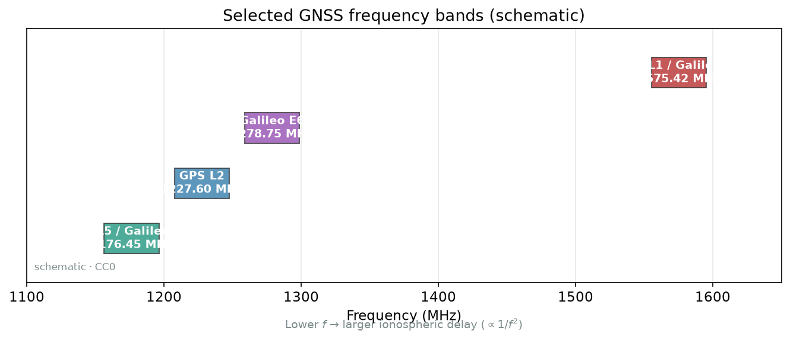
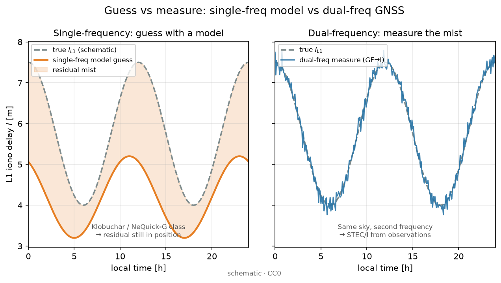
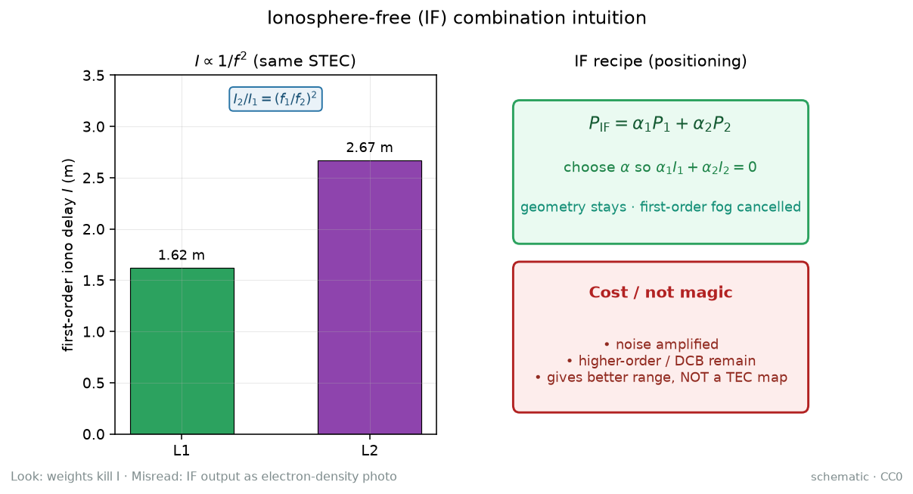
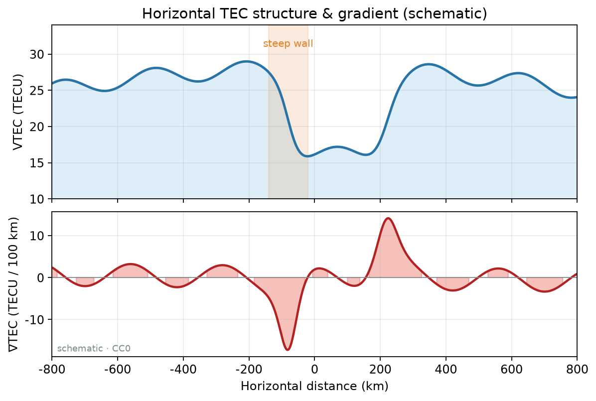
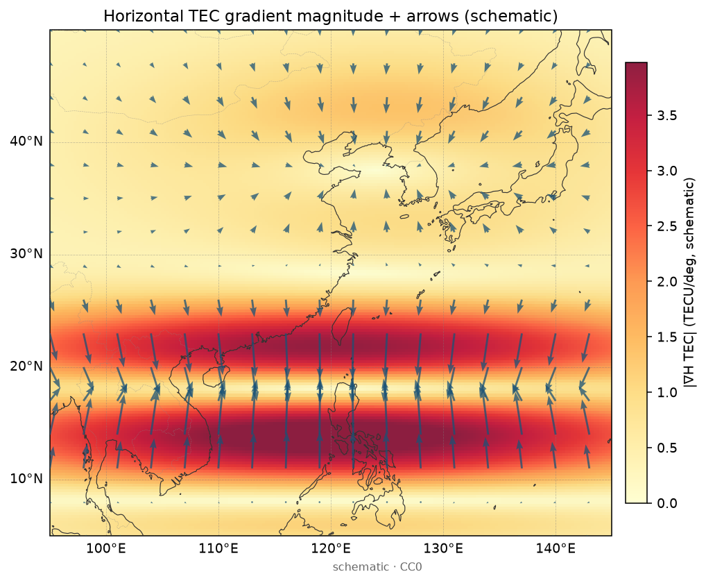

# 06 · 定位里怎么处理电离层？（单频 / 双频 / PPP / RTK）

> **课堂定位**：接 05。你已会分「雾有多厚」（TEC）与「雾碎不碎」（闪烁）。本课换到**定位误差预算**：伪距/载波上的电离层延迟怎么改、怎么消、怎么估、怎么差掉；以及残差图上如何认「慢偏 / 梯度撕 / 跟踪崩」。
> 路线固定为四段：**机制 → 公式拆解（逐步推导）→ 观测签名 → 分析步骤**。
>
> **写给谁**：第一次在单频手机和双频测绘之间迷路、第一次听说无电离层组合却把它当成 TEC 图、第一次 RTK 固定失败就骂「电离层坏了」的人。
>
> **学完交付**：一句话区分改 / 消 / 差 / 估；逐步写出 $I(f)$、无电离层组合与映射改正；按残差图认三种签名；完成选题决策树与暴时分诊清单；点名本仓真实 `name`。

---

## 0. 开场：三个真实场景

请先合上笔记本，想三件事：

1. **单频手持 vs 双频测绘**：同一片天，单频靠广播模型「猜雾厚」；双频可做无电离层组合「消一阶雾」。有人以为「开了双频 = 电离层归零」——噪声放大、高阶项、闪烁失锁都还在。
2. **短基线 RTK 很香，长基线突然难固定**：差分削的是**公共**延迟。基线变长或暴时梯度变陡，公共性变差；残差从「慢偏」变成「梯度撕裂」。
3. **PPP 收敛锯齿化，值班员只盯 GIM**：GIM 说 TEC 还行，但 ROTI/周跳同窗暴涨——瓶颈在**跟踪层**，不是延迟模型少改了半米。05 课的闪烁账，在这里变成定位日志。

**本课地图（请对照目录）：**

| 段落 | 你在学什么 | 类比 |
|---|---|---|
| §1 词表 | 先认名字 | 进工地前认工具 |
| §2–6 **机制** | 改/消/差/估；单频·双频·RTK·PPP | 雾天开车的四种态度 |
| §7–11 **公式拆解** | $I(f)$、IF、映射、差分残余、噪声放大 | 把菜谱拆成一步一步 |
| §12–13 **观测签名** | 残差三种长相与假阳性 | 监控录像怎么认人 |
| §14–20 **分析步骤** | 决策树、分诊清单、测验、出门 | 值班清单与过关 |

配图均在 [`images/`](./images/)，版权见 [`images/SOURCES.md`](./images/SOURCES.md)。

**边界**：不重讲 STEC 估计工艺（回 [02](./02-gnss-dualfreq-tec.md)）；不重讲 GIM 建图（回 [03](./03-gim-ionex.md)）；不把气候模型当广播改正（回 [04](./04-iri-nequick.md)）；闪烁指数定义回 [05](./05-scintillation-roti.md)。现象课 [19–23](./19-phenomena-overview.md) 保持独立短文，**本课不回灌成现象文墙**。

---

## 1. 词表（先扫一遍，主讲后再回看）

### 1.1 模式与策略

| 术语 | 人话 | 稍严 |
|---|---|---|
| SPP | 单点定位，米级常见 | Single Point Positioning |
| RTK | 流动站+基准站，差分追厘米 | Real-Time Kinematic |
| PPP | 单站精密，靠精密轨道钟差 | Precise Point Positioning |
| 改正（correct） | 用模型/图把延迟减一部分 | 单频广播、GIM 约束 |
| 消除（eliminate） | 组合让一阶电离层系数变 0 | 无电离层组合 IF |
| 差分（difference） | 站间/星间相减削公共项 | 短基线 RTK 经典 |
| 估计（estimate） | 把 STEC 当未知数一起解 | 非差非组合 PPP 等 |

### 1.2 模型、组合与几何

| 术语 | 人话 | 稍严 |
|---|---|---|
| Klobuchar | GPS 电文 8 参数「全球雾况简报」 | 广播单频改正 |
| NeQuick-G | Galileo 单频广播改正族 | ≠ 科研 NeQuick2/IRI 混开关 |
| 无电离层组合（IF） | 加权两频，消一阶 $I$ | ionosphere-free |
| 几何无关组合（GF） | 消几何，留 TEC | 服务测雾，见 02 |
| IPP / 穿刺点 | 视线戳到假定壳的点 | 插值 GIM 用 |
| 映射 $M(E)$ | 斜↔竖的几何放大 | 低仰角很敏感 |
| 一阶延迟 $I(f)$ | $\propto\mathrm{STEC}/f^{2}$ | 码延迟主项 |

### 1.3 残差与故障画像

| 术语 | 人话 | 稍严 |
|---|---|---|
| 慢漂移型 | 位置慢慢偏，跟踪大体还在 | 模型不足 / 高 TEC |
| 梯度撕裂型 | 短基线尚可、长基线崩 | 站间不公共 |
| 闪烁崩盘型 | 周跳、失锁、重收敛 | 跟踪环跟不住 |
| 模糊度固定 | 载波整周「锁死」 | 固定率是 RTK 成绩单 |
| 收敛 | PPP 从粗到精的过程 | 闪烁窗常锯齿化 |

**纪律**：禁止说「双频 = 电离层为零」；禁止把 IF 组合当成画 TEC 的工具；禁止用 GIM 平滑场解释闪烁失锁；允许单频用模型，但摘要必须写「残差仍在」。

---

# 第一段 · 机制

> 目标：用「因果」讲清——电离层如何进定位方程、四种态度各吃哪一味药、为何 RTK 与 PPP 怕的东西不完全一样。完整公式留给第二段。

---

## 2. 先问对问题：你要坐标，还是要大气？

| 你真正需要的 | 更合适的路 |
|---|---|
| 米级导航大概对 | 单频 + Klobuchar/NeQuick-G（有条件再叠 GIM） |
| 分米–厘米坐标（双频） | 无电离层组合为主 | 
| 短基线工程 RTK | 差分削公共雾；盯暴时残余与闪烁 |
| 长基线 / 网络 RTK | 区域大气约束；勿幻想差分万能 |
| 单站 PPP | IF 消雾，或估 STEC / 加 SSR·GIM 先验 |
| 只要 TEC/GIM 产品 | 回 `lists/01-ionosphere`，不必先跑通全套 PPP |

类比总纲（请背）：

- **改正** ≈ 看天气预报出门——能挡雨，不准到不湿鞋；  
- **消除** ≈ 两只眼睛做立体抵消——消的是一阶色散，不是物理学毕业；  
- **差分** ≈ 两人手拉手走同一片雾——公共偏置相减；  
- **估计** ≈ 把雾厚当成要解的未知数——主产品仍常是坐标，TEC 是副产品或约束。

**机制一句话**：定位软件对电离层必须有态度；态度选错，残差长相会告诉你——但你要会读。

---

## 3. 电离层如何「长」进伪距？


> **看图要点**：伪距一阶电离层延迟随 $1/f^{2}$ 下降；L1 比 L2/L5「短一截」。定位看见的是**等价距离误差（米）**，驱动它的库存是 STEC。图源：自制 CC0，见 [`images/SOURCES.md`](./images/SOURCES.md)。

人话三句：

1. 电子柱越厚，码伪距越容易「量长」一截（群延迟）；  
2. 频率越低，同一 STEC 造成的延迟越大——这是色散；  
3. 载波相位的一阶符号与伪距相反（相位超前），但本课定位叙事先抓住：**电离层是与频率有关的误差源**。



> **看图要点**：多频不是炫配，是给「消雾」和「测雾」两条组合路线提供原料。图源：自制 CC0 示意。

单频只有一个测量方程：几何距离、钟差、对流层、电离层缠在一起——除非**借入外部模型**给 $I$ 一个先验值，否则分不开。双频则让 $I$ 在两频上成固定比例，于是可以消或测。

---

## 4. 单频：只能「改正」，不能魔术消除




> **看图要点**：左图单频靠广播/气候模型「猜雾厚」，残差仍在；右图双频从观测量出延迟。猜 ≠ 测。图源：自制 CC0。

只有一个频率时，做不了经典 IF 戏法。选项主要是：

### 4.1 广播模型

- **GPS：Klobuchar** — 电文 8 参数，粗、快、全球可用。像「全球平均雾况简报」，不是当地雷达。平静中纬常能改掉相当一部分平均延迟；暴时、低纬、黎明黄昏，简报更容易离谱。  
- **Galileo：NeQuick-G** — 官方单频改正实现；与科研用 NeQuick2 / IRI **用途与输入不要混用**（见 [04](./04-iri-nequick.md)）。

本目录：`Klobuchar-study-code`、`Galileo-NeQuick-G`、`NequickG`、`NeQuickG-ESSR`（`lists/01-ionosphere.md`）。

### 4.2 外源格网（GIM / IONEX）

联网拿到全球/区域图 → 在 IPP 插值 VTEC → 映射成斜路径延迟。比广播细，但要纪律：产品时刻、映射函数、低仰角敏感（见 [03](./03-gim-ionex.md)）。


> **看图要点**：改正用的是「射线戳壳」那一点的 VTEC，不是接收机正上方的天顶神话。图源：自制 CC0。


> **看图要点**
> - **机制**：GIM 插值点随卫星运动在壳上滑动；定位改正跟的是 IPP，不是测站固定天顶。
> - **看什么**：弧线扫过的地理范围与测站相对位置。
> - **别误判**：示意几何；低仰角 IPP 远离测站时，改正误差更敏感。
> 图源：本仓库自制示意场 + Natural Earth 海岸线（非实测事件）。


> **看图要点**
> - **机制**：站网密度决定区域大气/差分公共性；IPP 足迹示意「雾」被采样到哪里。
> - **看什么**：陆密洋疏；你的基线是否落在稀疏采样区。
> - **别误判**：示意站网非完整 IGS 清单。
> 图源：本仓库自制示意场 + Natural Earth 海岸线（非实测事件）。

### 4.3 课堂预期

> 单频改正后残差仍在，**不能指望达到双频 IF 的水平**。它解决「别裸奔」，不是「厘米级免检」。

---

## 5. 双频分叉：IF 为测距，GF 为测雾


> **看图要点**：同一套双频观测，向左走几何无关 → TEC；向右走无电离层 → 更好的距离。配料相同，菜谱相反。图源：自制 CC0。



> **看图**：权重洗掉一阶 $I$；噪声变吵、高阶/偏差仍在。**误读**：开了 IF=电离层等于零。

```
双频观测
   ├─► 无电离层组合（IF）──► 服务定位（消一阶延迟）
   └─► 几何无关组合（GF）──► 服务 TEC（测雾厚）
```

IF 的机制动机：两频延迟成 $1/f^{2}$ 比例，选权重使组合后电离层系数变 0，几何距离留下。

代价（考试爱考）：

1. **噪声被放大**；  
2. **高阶项可能残留**；  
3. **偏差/硬件效应**仍在（见 [09](./09-dcb-biases-deep.md)）；  
4. 你得到更好的距离，**不是**电子密度照片。

---

## 6. RTK 差分削雾；PPP 一个人怎么对付雾？

### 6.1 RTK：公共雾相减

两站近时，看向同一颗卫星的路径穿过的电离层「差不多」。**站间差分**后公共延迟大幅削弱——像两人在同一雾房间用同一把尺子，偏置相减。

什么时候雾又回来？

- 基线变长 → 站间梯度不可忽略；  
- 暴时 / EIA 加强 / TID 扫过 → 「公共」假设变脆；  
- 强闪烁 → 即使短基线，周跳与失锁让模糊度难固定。

### 6.2 PPP：消 / 估 / 增强

| 策略 | 直觉 | 注释 |
|---|---|---|
| 双频 IF | 先消一阶雾再精密测距 | 经典 PPP 常见入口 |
| 非差非组合 / 估 STEC | 每星电离层当参数 | 可加 GIM 约束；科研向 |
| 增强改正 | 区域电离层 / SSR 先验 | 「带大气补丁的 PPP」 |

PPP 再精密，也怕跟踪层崩溃。05 课的闪烁在这里表现为：收敛变慢、周跳、重收敛。**延迟模型完美，救不了失锁。**

开源套件里电离层常嵌在大仓库中：`RTKLIB`、`gLAB-UPC`、`PRIDE-PPPAR`、`ginan`、`pyrtklib`（`lists/04-gnss-positioning.md`）。先选套件，再读其 Ionosphere / IF 章节。

---

# 第二段 · 公式拆解（逐步推导）

> 目标：每个符号有单位、有人话、有「这一步在干什么」。要能复述 $I(f)$、写出 IF 权重、完成一次映射改正心算，并解释 IF 噪声为何变吵。

---

## 7. 公式路线图（先看全图，再逐步拆）

$$
\mathrm{STEC}
\;\xrightarrow{40.3/f^{2}}\;
I(f)
\;\xrightarrow{\text{single-freq}}\;
\text{model/GIM corr.}
$$

$$
\{P_1,P_2\}
\;\xrightarrow{\text{IF weights}}\;
P_{\mathrm{IF}}
\;\xrightarrow{\text{1st-order }I\to 0}\;
\text{better range}
$$

$$
\mathrm{VTEC}_{\mathrm{GIM}}
\;\xrightarrow{M(E)}\;
I_{\mathrm{corr}}
\;\xrightarrow{\text{subtract from }P}\;
\text{corrected range}
$$

读法（中文在公式外）：库存 STEC 经色散变成米级延迟；单频借入模型/GIM 改正去减；双频用 IF 权重把一阶 $I$ 洗成 0，得到更好的距离观测；GIM 路径还多一步「竖→斜」映射，再从伪距减掉。

---

## 8. 解剖台 A：一阶延迟 $I(f)$——定位看见的米

教学核心式（与 01 课对齐）：

$$
I(f)=\frac{40.3}{f^{2}}\,\mathrm{STEC}
$$

| 符号 | 含义 | 单位 / 备注 |
|---|---|---|
| $I(f)$ | 码伪距一阶电离层延迟 | m |
| $f$ | 载波频率 | Hz |
| $\mathrm{STEC}$ | 斜路径电子含量 | m⁻²；常用 TECU，$1\,\mathrm{TECU}=10^{16}\,\mathrm{m}^{-2}$ |
| $40.3$ | 常数系数 | 约 m³·s⁻² 量级 |

逐步心智：

1. 视线积分得到 STEC；  
2. 除以 $f^{2}$，乘 40.3 → 得到**米**；  
3. 这米直接进伪距方程，和几何距离缠在一起。

**迷你数值（请手算一遍）：**  
取 $\mathrm{STEC}=20\,\mathrm{TECU}=2.0\times10^{17}\,\mathrm{m}^{-2}$，$f_1=1.57542\times10^{9}\,\mathrm{Hz}$：

$$
I_1\approx\frac{40.3\times 2.0\times10^{17}}{(1.57542\times10^{9})^{2}}\approx 3.25\,\mathrm{m}.
$$

L2（$f_2=1.22760\times10^{9}$）约 $5.35\,\mathrm{m}$。差额约 $2.1\,\mathrm{m}$——GF 测 TEC 看见的「雾差」；IF 则要让这类项在组合里抵消。

伪距示意（略去其它项）：

$$
P_i=\rho+c\Delta t+T_{\mathrm{trop}}+I_i+\varepsilon_i.
$$

单频：一个方程里 $\rho$ 与 $I_1$ 缠死 → 必须改正。双频：$I_2=(f_1/f_2)^{2}I_1$（同一 STEC）→ 可消可测。

---

## 9. 解剖台 B：无电离层组合——逐步推导

目标：找系数，使组合观测里 $I$ 的一阶贡献为 0。

### 9.1 从比例关系出发

$$
I_1=\frac{40.3}{f_1^{2}}\mathrm{STEC},\qquad
I_2=\frac{40.3}{f_2^{2}}\mathrm{STEC}
\implies
I_2=\frac{f_1^{2}}{f_2^{2}}I_1.
$$

构造

$$
P_{\mathrm{IF}}=\alpha_1 P_1+\alpha_2 P_2,
$$

希望 $\alpha_1 I_1+\alpha_2 I_2=0$，并常要求 $\alpha_1+\alpha_2=1$ 以保持几何距离尺度。

由 $\alpha_1 I_1+\alpha_2 (f_1^{2}/f_2^{2})I_1=0$ 得

$$
\alpha_1+\alpha_2\frac{f_1^{2}}{f_2^{2}}=0.
$$

与 $\alpha_1+\alpha_2=1$ 联立，经典解为：

$$
P_{\mathrm{IF}}
=
\frac{f_1^{2}}{f_1^{2}-f_2^{2}}P_1
-
\frac{f_2^{2}}{f_1^{2}-f_2^{2}}P_2.
$$

（等价写法：$P_{\mathrm{IF}}=(f_1^{2} P_1-f_2^{2} P_2)/(f_1^{2}-f_2^{2})$。）

### 9.2 手算权重（GPS L1/L2）

$f_1^{2}\approx2.4819\times10^{18}$，$f_2^{2}\approx1.5070\times10^{18}$，$f_1^{2}-f_2^{2}\approx9.749\times10^{17}$。

$$
\frac{f_1^{2}}{f_1^{2}-f_2^{2}}\approx2.546,\qquad
\frac{f_2^{2}}{f_1^{2}-f_2^{2}}\approx1.546.
$$

故教学口诀：**约 $2.55\,P_1-1.55\,P_2$**（保留你软件文档的精确系数）。相位 IF 同型，把 $P$ 换成 $L$（注意模糊度变成组合模糊度）。

### 9.3 数值验收：一阶真的没了吗？

沿用 $I_1=3.25\,\mathrm{m}$，$I_2=5.35\,\mathrm{m}$：

$$
I_{\mathrm{IF}}
=
\frac{f_1^{2} I_1-f_2^{2} I_2}{f_1^{2}-f_2^{2}}
\approx
\frac{2.4819\times10^{18}\cdot 3.25-1.5070\times10^{18}\cdot 5.35}{9.749\times10^{17}}
\approx 0.
$$

（手算允许四舍五入误差；代数上在一阶模型内恒为 0。）

**要点**：IF 消的是**一阶** $40.3\,\mathrm{STEC}/f^{2}$；不是宣称电离层物理学结束。


> **看图要点**：两频延迟不同，正是 IF 与 GF 能成立的物理前提。图源：自制 CC0。

---

## 10. 解剖台 C：GIM 改正中的映射 $M(E)$

单频或 PPP 约束使用 GIM 时，流程是：

1. 求 IPP；  
2. 在 IONEX 格网内插 $\mathrm{VTEC}$；  
3. 映射成斜延迟再减掉。

教学薄壳映射（形式随软件略异，写报告以文档为准）：

$$
\mathrm{STEC}\approx M(E)\cdot\mathrm{VTEC},\qquad
I_{\mathrm{corr}}(f)=\frac{40.3}{f^{2}}\,M(E)\cdot\mathrm{VTEC}.
$$


> **看图**：低仰角改正被放大，误差也一起放大。**误读**：忽略高度角门限仍信改正米数。

> **看图要点**：天顶附近 $M\approx 1$；低仰角 $M$ 陡增——几何放大，不是「雾突然变厚」。图源：自制 CC0。


> **看图要点**：改正链是「图上的竖直量 → 乘映射 → 变成你视线方向的米」。三问不清（壳高、映射、仰角截止）就没有资格抱怨「GIM 不准」。图源：自制 CC0。

**迷你心算：** $\mathrm{VTEC}=20\,\mathrm{TECU}$，$E=30°$，设 $M\approx 1.7$ → $\mathrm{STEC}\approx 34\,\mathrm{TECU}$ → L1 延迟约 $5.5\,\mathrm{m}$ 量级。单频若完全不改，这几米直接进位置误差预算。

课堂事故：产品时刻错、低仰角硬改、把映射噪声全怪给 GIM。

---

## 11. 解剖台 D：IF 噪声放大、差分残余、与「估 STEC」

### 11.1 噪声为何变吵？

设两频伪距噪声独立、标准差均为 $\sigma_P$。IF 是大系数线性组合，误差传播后

$$
\sigma_{\mathrm{IF}}
\approx
\sqrt{
\left(\frac{f_1^{2}}{f_1^{2}-f_2^{2}}\right)^{2}
+
\left(\frac{f_2^{2}}{f_1^{2}-f_2^{2}}\right)^{2}
}\,\sigma_P
\approx 3\,\sigma_P.
$$

（L1/L2 量级口算。）

人话：消雾要付「尺子变毛」的税。相位 IF 同理，但相位原始噪声小，税相对可承受——这也是精密定位爱相位的原因之一。

### 11.2 差分后的电离层残余（直觉式）

站间单差后，电离层项变成「两站路径之差」。短基线时差很小；基线拉长或水平梯度变陡时，残余上升。教学上可记：

$$
\Delta I
\;\sim\;
(\text{baseline proj.})\times(\text{horiz. TEC grad.})\times(\text{mapping geom.}).
$$

读法：基线投影 × 水平 TEC 梯度 × 映射几何。

不必背严式；要会说：**RTK 怕的是梯度，不只是绝对 TEC 高低。**



> **看图要点**：颜色陡变的地方，长基线差分最痛；短基线可能还在「同一色块」里。图源：自制 CC0。



> **看图要点**
> - **机制**：水平 ∇TEC 才是 RTK/长基线残余的痛点；箭头示意梯度方向，色强示意量级。
> - **看什么**：EIA 峰区、舌状结构附近色带是否陡；基线是否跨色带。
> - **别误判**：示意场；勿把箭头当风速或 TID 相速矢量。
> 图源：本仓库自制示意场 + Natural Earth 海岸线（非实测事件）。

### 11.3 估 STEC 时你在解什么？

非差非组合思路（板书级）：每颗星一个电离层参数（常加随机游走或 GIM 约束），与坐标、钟差、对流层一起估。主产品仍常是坐标；顺带输出的 STEC 要接受偏差/基准定义约束——**不是**自动等于 02 课科研 TEC 产品。


> **看图要点**：硬件延迟会假装成「雾」。IF 定位与 GF 测 TEC 都会撞上它；精密应用请回 09 课。图源：自制 CC0。

---

# 第三段 · 观测签名

> 目标：合上公式，只看残差图与日志「会长什么样」。先认脸，再开庭。深度现象剧本留给 [19–23](./19-phenomena-overview.md)，本课只建**定位侧第一眼签名**。

---

## 12. 残差三种长相（必背）

| 类型 | 残差 / 日志直觉 | 更像哪类故事 |
|---|---|---|
| **慢漂移型** | 位置偏差缓慢拉大或系统性偏；跟踪大体还在 | 高 TEC、单频简报失效、GIM 太滑、改正不足 |
| **梯度撕裂型** | 短基线尚可、长基线固定率崩；站间双差残差抬升 | 暴时大尺度梯度、EIA 加强、TID 扫网 |
| **闪烁崩盘型** | 周跳浪涌、失锁、可用星骤降、解中断或频繁重收敛 | 不规则体 / 高 ROTI·S4 窗口 |

**口诀：** 偏了 ≠ 撕了 ≠ 抖了。三张脸对应三套药：换/加改正、缩短基线或区域约束、闪烁监测与拒星。


> **看图**：斜坡、撕裂、乱抖+断弧，药不同。**误读**：所有怪残差都用同一句「电离层」结案。


> **看图要点**：上方面板贴底（宁静）；下方面板缓慢抬起或散开（扰动）——先问「斜坡还是刺还是断」，再问怪谁。图源：自制 CC0。


> **看图要点**
> - **机制**：暴时 ΔTEC 空间分区，对应定位里「全网慢偏」的大尺度延迟背景。
> - **看什么**：红/蓝斑相对海岸的落区；与残差「慢漂移型」同窗对照。
> - **别误判**：空间天气图 ≠ 周跳账；ROTI 同窗暴涨时先查跟踪。
> 图源：本仓库自制示意场 + Natural Earth 海岸线（非实测事件）。

### 12.1 模式×签名速配

| 你在跑什么 | 慢漂移时常见原因 | 崩盘时常见原因 |
|---|---|---|
| 单频 SPP | Klobuchar/NeQuick-G 天花板 | 也可能「还能出点」但偏差阴险 |
| 双频 IF-SPP/PPP | 高阶/偏差/产品问题；IF 后慢偏应明显变瘦 | IF **不免疫**失锁 |
| 短基线 RTK | 通常不是主角 | 闪烁仍可打穿固定率 |
| 长基线 / 网络 RTK | 梯度残余、大气内插假设脆 | 叠加闪烁更惨 |

### 12.2 同窗对照签名（与 05 握手）

- IF 打开后慢漂移明显变瘦 → 一阶延迟故事成立；  
- IF 仍崩、周跳与 ROTI 同峰 → 跟踪故事；  
- 仅跨 EIA 的基线痛、区内短基线无事 → 梯度故事；  
- 全网一起慢偏、ROTI 不高 → 大尺度 TEC / 产品滞后。


> **看图要点**：低纬夜里气泡横切射线时，定位日志常先报周跳而不是「米级慢偏」。延迟账与跟踪账必须分案。图源：自制 CC0；舞台细节见 21，不在本课扩写。

---

## 13. 假阳性指纹速查

| 指纹 | 你看到什么 | 先做什么 |
|---|---|---|
| 配置未备案 | 「怪电离层」但不知有没有开 IF | 先写清模式与改正链 |
| 多路径扇区 | 特定方位重复毛刺 | 仰角/方位门限；查环境 |
| 产品时刻错 | GIM 改正越改越歪 | 核对快速/最终与时间标签 |
| 低仰角硬刚 | 映射放大噪声当「暴时」 | 提高截止角做对照 |
| 无宁静日对照 | 把仪器病当空间天气 | 同配置跑对照日 |
| 只看坐标域 | 错过周跳主因 | 同时看相位残差与 QC |
| 纬度剧本错配 | 高纬事件套赤道经验 | 换地磁上下文（见 05） |

---

# 第四段 · 分析步骤

> 目标：选题有决策树，故障有分诊清单，报告有句式。打印 §14–15 即可上机。

---

## 14. 选题决策树（先选路，再开软件）

```
只要 TEC / 空间天气图
  └─► lists/01-ionosphere；不必先精通 PPP

单频手持 / 教学演示
  └─► Klobuchar 或 NeQuick-G；有条件叠加 GIM

双频精密测距（坐标为主）
  └─► 无电离层组合（+ 必要偏差/产品）

短基线工程 RTK
  └─► 差分；关注暴时残余与闪烁

长基线 / 网络 RTK
  └─► 区域大气约束、网络产品；差分非万能

科研 PPP / 想顺带出 STEC
  └─► 估电离层或引入 GIM/SSR 约束；写清主产品是坐标还是大气
```

**工程对话模板（可背）：**

> 我是 **[单频/双频]** 接收，模式 **[SPP/RTK/PPP]**，基线约 **[x km]**，目标 **[米/分米/厘米]**，当天地磁 **[平静/活跃]**。  
> 电离层策略：**[Klobuchar / NeQuick-G / GIM / IF / 差分 / 估 STEC]**。  
> 我担心 **[慢变偏差 / 固定失败 / 失锁]**，对照会看 **[GIM / ROTI / 周跳统计]**。

---

## 15. 定位故障 Playbook（建议打印）

### 15.1 开场三问

1. 几个频率？开了 IF 吗？用了什么改正/约束？  
2. 残差是斜坡、撕裂，还是崩盘？  
3. 同窗 GIM 与 ROTI/周跳谁在说话？

### 15.2 七步分诊（按序，勿跳步）

```
① 锁定事件窗（UTC + 地方时）
② 模式与产品备案（SPP/RTK/PPP；IF？模型？GIM？）
③ 质量与几何（周跳、SNR、可用星、PDOP）
④ 残差画像（慢偏 / 梯度 / 崩盘）
⑤ 空间天气对照（GIM VTEC、ROTI/S4、地磁指数）
⑥ 多站/多基线一致性
⑦ 结论句式（改/消/差/估 哪一环失败）
```

### 15.3 步骤要点

**① 事件窗** — 圈出固定率下跌、RMS 爆表、重收敛时刻；低纬加注地方时。  

**② 备案** — 没有备案，无法判断「没改雾」还是「雾策略对但跟踪挂了」。  

**③ QC** — `Anubis` / `TEQC` / `georinex`：SNR 乱跳+周跳浪涌 → 向闪烁倾斜；数据干净但位置慢慢偏 → 向延迟倾斜。  

**④ 三张图** — 东/北/天误差对时间；周跳计数对时间；双差残差或创新范数（若可输出）。  

**⑤ 对照表**

| 对照层 | 看什么 | 去哪 |
|---|---|---|
| 大尺度 TEC | VTEC 是否暴涨、梯度是否变陡 | 03；`ionex` + `CDDIS-IONEX` |
| 不规则体代理 | ROTI 是否同窗升高 | 05；`igs-roti` 等 |
| 正统闪烁 | S4/σφ（若有） | `ismr_downloader`、`scintkit`、`OASIS`… |
| 地磁背景 | Kp、Dst/SYM-H 等 | 外部指数；写清来源 |

**⑥ 多站** — 全网一起偏：大尺度/产品；仅赤道站崩：低纬闪烁叙事；仅长基线难：梯度残余。  

**⑦ 结论句式（可粘贴）**

> 本事件窗内，[模式] 呈 [慢漂移/梯度撕裂/闪烁崩盘] 画像；同窗 GIM…，ROTI/S4…。瓶颈在 [单频改正不足 / IF 后高阶与偏差 / 差分残余梯度 / 跟踪失锁]。下一步：[换双频 IF / 加区域约束 / 拒星与提高屏蔽角 / 估 STEC]，而非仅更换接收机品牌话术。

### 15.4 两小时上机脚本（口述）

1. 宁静日与暴日各一天 RINEX（同站）。  
2. `gLAB-UPC` 或 `RTKLIB`：单频无改正 / 单频+Klobuchar / 双频 IF 三组。  
3. 导出坐标误差与周跳统计。  
4. 同窗画 VTEC（GIM）与 ROTI。  
5. 用结论句式写 400 字：**哪一组瘦了慢漂移，哪一组救不了崩盘**。

### 15.5 对策菜单

| 诊断类型 | 优先工程对策 | 优先学习 |
|---|---|---|
| 慢漂移型 | 双频 IF；或单频换 GIM/更好模型 | 02/03/04/本课；`Klobuchar-study-code`、`Galileo-NeQuick-G`、`ionex` |
| 梯度撕裂型 | 缩短基线、网络 RTK/区域大气 | 03/本课；GIM 梯度目视 |
| 闪烁崩盘型 | 提高屏蔽角、剔除危险星、等窗口 | 05；ROTI/S4 工具链 |
| 混杂型 | 先拆窗：哪段偏、哪段抖 | 两讲对照表 |

---

## 16. 和本仓库工具对上号

| 需求 | 优先打开 | 条目举例（`PROJECTS.json` 实名） |
|---|---|---|
| 跑 RTK/PPP | `lists/04-gnss-positioning.md` | `RTKLIB`、`gLAB-UPC`、`PRIDE-PPPAR`、`ginan`、`pyrtklib` |
| 单频广播模型 | `lists/01-ionosphere.md` | `Klobuchar-study-code`、`Galileo-NeQuick-G`、`NequickG` |
| 读/用 GIM | 01 + 数据集列表 | `ionex`、`CDDIS-IONEX`、`JPL-IONEX-Rapid` |
| 解释暴时失败 | 05 + 闪烁子类 | `igs-roti`、`OASIS`、`IonoMoni` |
| 只要 TEC | 01 TEC 估计 | `gnss-tec`、`pygnss-tec`、`tec-suite`、`Seemala-GPS-TEC` |
| QC | `lists/03-gnss-data.md` | `Anubis`、`TEQC`、`georinex` |

**别做**：在 PPP 迷宫里找 TEC 却不肯打开 `gnss-tec`；只搜文件名 `iono` 就断言目录没覆盖。

---

## 17. 常见误解专节

### 误解 A：「开了双频，电离层就等于零了」

**纠正：** IF 消的是一阶项；噪声放大、高阶、偏差、闪烁跟踪问题都还在。

### 误解 B：「Klobuchar 改完就该和双频一样准」

**纠正：** 广播模型是粗改正。平静中纬「看起来差不多」≠ 暴时/低纬也成立。

### 误解 C：「RTK 很准，所以电离层不存在」

**纠正：** 短基线差分削公共部分；长基线与暴时残余会回来。准是有条件的准。

### 误解 D：「PPP 一定要先估 TEC」

**纠正：** 经典双频 IF-PPP 可以不显式输出 TEC。估 STEC 是策略之一，不是宗教。

### 误解 E：「GIM 代入定位 = 区域精密大气」

**纠正：** 全球图平滑、时间分辨率有限。区域强梯度与闪烁仍可能打穿预期。

### 误解 F：「定位套件里找不到单独 iono 程序 = 没覆盖」

**纠正：** 电离层常嵌在 `RTKLIB` / `gLAB-UPC` / `ginan` / `PRIDE-PPPAR`；按列表读套件。

### 误解 G：「NeQuick-G 和 IRI 调同一组参数就行」

**纠正：** 广播改正 ≠ 科研气候学模型。详见 04，勿混用开关。

### 误解 H：「IF 组合可以当 TEC 图用」

**纠正：** IF 为测距服务；画 TEC 走几何无关（02）。菜谱相反。

### 误解 I：「所有怪残差都怪电离层」

**纠正：** 先问频率与模式，再问空间天气，再问 QC（多路径、周跳、可用星）。误差是一桌菜。

---

## 18. 课堂测验（带演算）

**题 1.** 单频处理电离层的主要手段是「消」还是「改」？为什么？  

**题 2.** 写出 $I(f)=40.3\,\mathrm{STEC}/f^{2}$。STEC 固定，$f$ 加倍，$I$ 如何变？  

**题 3.** GPS L1/L2 的 IF，教学权重约多少？一阶 $I_{\mathrm{IF}}$ 应接近什么？  

**题 4.** 设 $\sigma_P=0.3\,\mathrm{m}$，用 §11.1 口算，IF 伪距噪声大约多少米？  

**题 5.** $\mathrm{VTEC}=15\,\mathrm{TECU}$，$M=2$，求 STEC；再估 L1 延迟量级（约几米）。  

**题 6.** 短基线 RTK 为何能削弱电离层？长基线为何变难？  

**题 7.** PPP 三种电离层策略各用一句话描述。  

**题 8.** SNR 乱跳 + 周跳浪涌，优先怀疑慢漂移还是闪烁崩盘？  

**题 9.** 为何课题只要 GIM 时不必先精通 PPP？  

**题 10.** 举出本目录至少三个定位套件 `name`。

### 参考要点

1. **改**；单频不能靠经典 IF 魔术消除。  
2. $I\propto 1/f^{2}$ → $f$ 加倍则 $I$ 变为 1/4。  
3. 约 $2.55\,P_1-1.55\,P_2$；一阶 $I_{\mathrm{IF}}\to 0$。  
4. $\sigma_{\mathrm{IF}}\sim 3\times 0.3\approx 0.9\,\mathrm{m}$ 量级。  
5. $\mathrm{STEC}=30\,\mathrm{TECU}$；$I_1\sim 40.3\times 3\times10^{17}/f_1^{2}\approx 5\,\mathrm{m}$ 量级。  
6. 近距公共延迟相似；距离大或暴时公共性变差。  
7. 消：IF；估：STEC 参数；增强：外部电离层/SSR 先验。  
8. 闪烁崩盘（跟踪层）。  
9. GIM 工具链与「解坐标」是不同产品目标。  
10. 如 `RTKLIB`、`gLAB-UPC`、`PRIDE-PPPAR`、`ginan`（答三即可）。

---

## 19. 综合演算作业（建议限时 25 分钟）

> 注意：本节是**本课练习编号**，不是去扩写现象课教程 19–23。

**给定：** 某双频静态 PPP 教学配置。宁静日：单频无改正 RMS（天向）约 4 m；单频+Klobuchar 约 1.5 m；双频 IF 约 0.3 m（数字假但合理）。暴日同站：三组分别约 6 m、3 m、0.4 m，但暴日 20–23 LT 周跳数是宁静日的 8 倍，ROTI 同窗鼓包。

请写半页纸：

1. 用三种残差长相给暴日画像（可混型，但须拆窗）；  
2. 解释为何 IF 仍显著瘦于 Klobuchar，却救不了固定/连续性问题；  
3. 下一步工具点名（至少一个定位套件 + 一个 ROTI/闪烁入口）；  
4. 用 §15.3 结论句式收尾。

合格标准：分得清「改/消」与「抖」；不把 ROTI 写成 S4；不把本练习扩写成 19–23 现象长文。

---

## 20. 板书八行 · 符号速查 · 口述检查

1. 定位对电离层：改 / 消 / 差 / 估（+ 抖另案）。  
2. $I(f)=40.3\,\mathrm{STEC}/f^{2}$（米）。  
3. 单频：Klobuchar / NeQuick-G / GIM；残差仍在。  
4. IF：$(f_1^{2}P_1-f_2^{2}P_2)/(f_1^{2}-f_2^{2})$；一阶 $I\to 0$。  
5. IF 噪声≈数倍 $\sigma_P$；高阶与偏差仍可能在。  
6. GIM 链：IPP → VTEC → $M(E)$ → $I_{\mathrm{corr}}$。  
7. RTK 削公共雾；怕的是梯度与闪烁。  
8. 残差三脸：慢偏 / 撕裂 / 崩盘。

**符号速查卡：**

$$
I(f)=\frac{40.3}{f^{2}}\mathrm{STEC},
\quad
P_{\mathrm{IF}}=\frac{f_1^{2}P_1-f_2^{2}P_2}{f_1^{2}-f_2^{2}},
\quad
I_{\mathrm{corr}}=\frac{40.3}{f^{2}}M(E)\,\mathrm{VTEC}.
$$

**口述检查（任抽三问）：**

1. 用天气预报 / 双眼抵消 / 手拉手 / 把雾当未知数类比四种态度。  
2. 默写 IF 公式，并说出一个代价。  
3. 解释为何短基线香、长基线难。  
4. 残差三脸各配一对策。  
5. 列出四个真实 `name`（含定位与模型）。  
6. 说明 IF 与 GF 为何必须分家。

---

## 21. 与前后课的接口 · 出门任务 · 验收

| 你现在会的 | 下一课才会的 | 不要提前假装会 |
|---|---|---|
| 改/消/差/估决策 | 测高仪/掩星几何深挖 | 双频 = 抗闪烁 |
| IF 与映射心算 | 层析/同化 | 无锚定仿真当证据 |
| 残差分诊 Playbook | 现象课 19–23 剧本细节 | 本课写成现象文墙 |
| 工具实名点名 | DCB 深挖、建 GIM 工作流 | 不问 QC 就怪电离层 |

从 01–05 带来：STEC/VTEC；$I\propto 1/f^{2}$；GIM 大尺度；闪烁是另一本账。  
本课交出：会选改正策略；会写 IF 与映射；会认残差三脸并分诊。  
交给 07：地基垂直探测与掩星如何补 GNSS 定位视角看不到的廓线。

**下一课**：[07-ionosonde-occultation.md](./07-ionosonde-occultation.md)。

**相关但不在本课扩写**：[09-dcb-biases-deep.md](./09-dcb-biases-deep.md)；[19-phenomena-overview.md](./19-phenomena-overview.md) 起诸短文（暴时/EIA/TID/耀斑日食）保持独立，不回灌。

**出门任务：**

1. 同站宁静日/活跃日，跑通「无改正 / Klobuchar / IF」三组，表列 RMS 与周跳；  
2. 同窗叠 GIM VTEC 与 ROTI，用两句话分写「延迟账」与「跟踪账」；  
3. 用工程对话模板写进实验笔记（填空即可）。

### 验收清单

- [ ] 能口述改 / 消 / 差 / 估（并指出闪烁另案）  
- [ ] 能默写 $I(f)$ 与 IF 组合式，并完成权重/噪声量级口算  
- [ ] 能说明 GIM 改正的 IPP→映射链与三问  
- [ ] 能区分 IF（测距）与 GF（测 TEC）  
- [ ] 能按残差三脸做分诊并写出结论句式  
- [ ] 能点名真实定位套件与单频模型 `name`  
- [ ] 不把本课内容膨胀成现象课 19–23 文墙

**终句**：单频靠简报改雾，双频 IF 消一阶为尺子服务，RTK 靠差分削公共，PPP 在消/估/增强之间选路；闪烁打的是跟踪，不是再调一点 Klobuchar 能救的。残差先认脸，再开药。

**版本说明**：本文件按「机制 → 公式拆解 → 观测签名 → 分析步骤」与 01–05 课同深度重写；嵌入延迟–频率、频段、双频组合、IPP、映射、薄壳、梯度、宁静/扰动残差、气泡与 DCB 等自制 CC0 图；引用项目名均来自 `PROJECTS.json` 核验。现象课 19–23 保持独立短文，不回灌成长文墙。

**相关软件 / 数据入口**：[`rtklib`](../software/rtklib.md) · [`pride-pppar`](../software/pride-pppar.md) · [`bnc`](../software/bnc.md) · [`pygnssutils`](../software/pygnssutils.md) · [`data-access`](../data-access.md)

（完）
