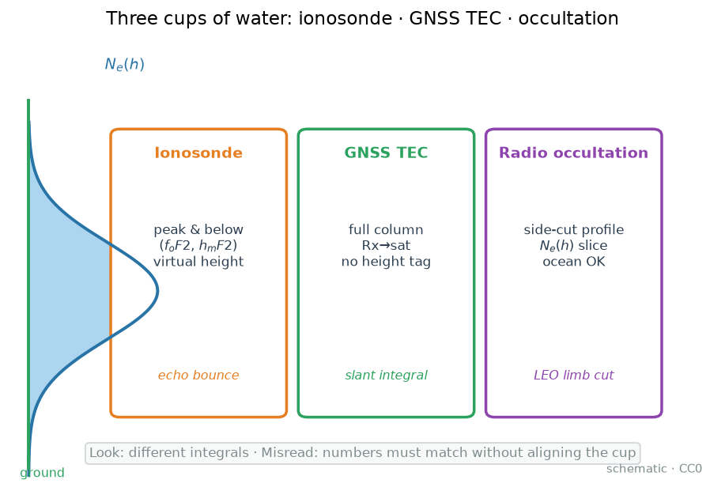
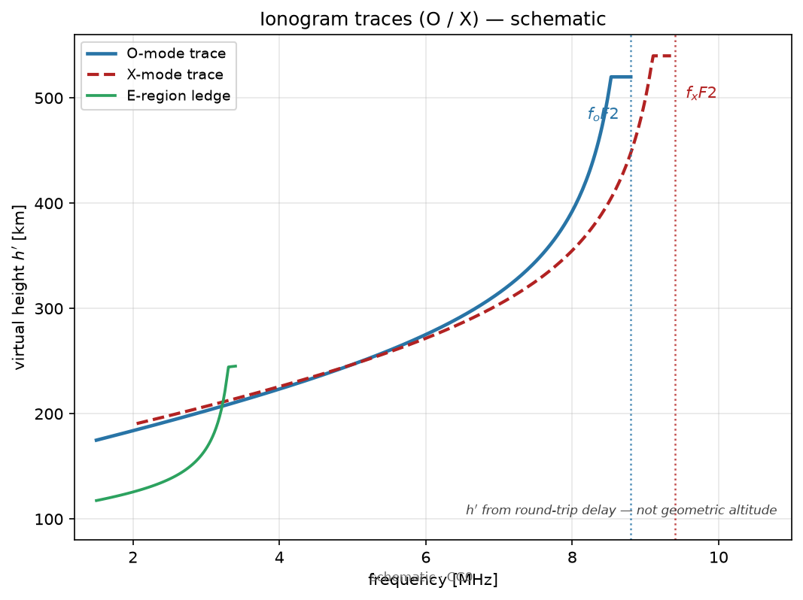
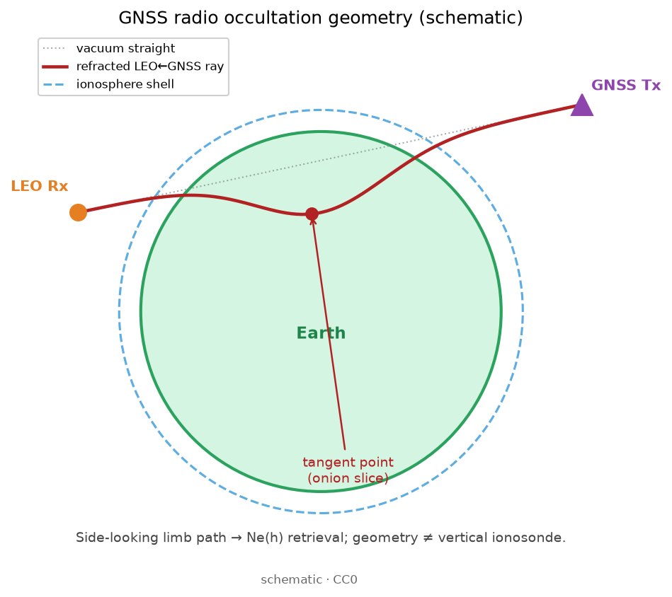

# 07 · 测高仪、GNSS TEC、掩星：各看什么？如何互补？

> **课堂定位**：接 06。你已会从**定位误差预算**看电离层（改 / 消 / 差 / 估）。本课换到**观测几何**：地基测高仪、GNSS 柱积分、LEO 无线电掩星（RO）各自摸到哪一段高度、交出什么产品、数字为何常「对不上却都没错」。
> 路线固定为四段：**机制 → 公式拆解（逐步推导）→ 观测签名 → 分析步骤**。
>
> **写给谁**：第一次把「测高仪 TEC」和 GNSS VTEC 横比就慌、第一次把掩星廓线当成某站 24 h 连续剖面、第一次以为「有了 GIM 就不需要测高仪」的人。
>
> **学完交付**：用「声呐 / 雾柱 / 侧切」对应三种手段；逐步写出 $f_p\leftrightarrow N_e$、$f_oF2\leftrightarrow N_mF2$、虚高与柱积分；按图认离子图 / VTEC 平面 / 掩星廓线三种签名；完成选题决策树与定义对齐清单；点名本仓真实 `name`。

---

## 0. 开场：三个真实场景

请先合上笔记本，想三件事：

1. **论文里两张 TEC 差一截**：同一暴日，测高仪导出的「底部 TEC」比 GNSS VTEC 小一截。有人立刻改仪器常数——更常见的原因是**积分上限与等离子体层贡献不同**，不是谁造假。
2. **洋面没有测高仪，却要谈廓线**：GIM 只给柱总量；要 $N_e(h)$ 形状，掩星（如 COSMIC 产品链）能从侧面切一刀。但那是**过境切片**，不是该经纬点全天电影。
3. **领导只要「电离层高度」**：测高仪最直接给 $h_mF2$；GNSS TEC **没有**高度分辨；掩星给廓线但时空稀疏。三种手段合在一起才像「立体电离层」。

**本课地图（请对照目录）：**

| 段落 | 你在学什么 | 类比 |
|---|---|---|
| §1 词表 | 先认名字 | 进工地前认工具 |
| §2–6 **机制** | 声呐 / 雾柱 / 侧切；互补与盲区 | 汤锅怎么量 |
| §7–11 **公式拆解** | $f_p$、$f_oF2$、虚高、柱积分、Abel 直觉 | 把菜谱拆成一步一步 |
| §12–13 **观测签名** | 离子图 / VTEC / 廓线长什么样 | 监控录像怎么认人 |
| §14–20 **分析步骤** | 决策树、对齐清单、测验、出门 | 值班清单与过关 |

配图均在 [`images/`](./images/)，版权见 [`images/SOURCES.md`](./images/SOURCES.md)。

**边界**：不重讲双频估 STEC 工艺（回 [02](./02-gnss-dualfreq-tec.md)）；不重讲 GIM 建图（回 [03](./03-gim-ionex.md)）；气候模型 $N_e(h)$ 回 [04](./04-iri-nequick.md)；闪烁指数回 [05](./05-scintillation-roti.md)；定位改消差估回 [06](./06-iono-positioning.md)。现象课 [19–23](./19-phenomena-overview.md) 保持独立短文，**本课不回灌成现象文墙**。

---

## 1. 词表（先扫一遍，主讲后再回看）

### 1.1 三种手段

| 术语 | 人话 | 稍严 |
|---|---|---|
| 测高仪（ionosonde） | 地面短波「声呐」，向上扫频听回波 | 垂直/斜向电离层探测雷达 |
| 离子图（ionogram） | 横轴频率、纵轴虚高的回波图 | 缩放得临界频率与虚高轨迹 |
| GNSS TEC | 卫星到接收机「雾柱有多厚」 | STEC / 映射后的 VTEC |
| 掩星（RO） | 从侧面切一刀的 CT 切片 | Radio Occultation；LEO 收 GNSS |
| LEO | 低地球轨道卫星 | 掩星接收机常装在这里 |

### 1.2 峰值与高度

| 术语 | 人话 | 稍严 |
|---|---|---|
| $f_oF2$ | F2 层「密到把普通波弹回」的临界频率 | F2 普通波临界频率（MHz） |
| $N_mF2$ | F2 峰有多密 | 峰值电子密度（$\mathrm{m}^{-3}$） |
| $h_mF2$ | 峰在多高 | 峰值真高（km） |
| 虚高 $h'$ | 用时延假装光速匀速算的高度 | $h'=c\,\Delta t/2$；$\neq$ 真高 |
| 真高 $h$ | 几何高度 | 需反演/缩放，不是离子图直接纵轴 |

### 1.3 柱与廓线

| 术语 | 人话 | 稍严 |
|---|---|---|
| $N_e(h)$ | 电子密度随高度怎么变 | 廓线；测高/掩星/模型常给 |
| STEC / VTEC | 斜/垂直总电子含量 | 柱积分；GNSS 主力产品 |
| 底部 TEC | 峰附近及以下积出来的柱 | $\neq$ GNSS 整柱（常缺峰上） |
| Abel 反演 | 从弯曲角推径向廓线的经典路 | 掩星教学核心直觉 |
| 切点 / 正切点 | 掩星射线离地最近处附近 | 廓线「钉」在过境几何上 |

**纪律**：禁止把虚高当真高；禁止把测高仪 TEC 与 GNSS VTEC 无脑横比；禁止把单次掩星当某站连续天气图；允许只用一种数据，但摘要必须写清物理量名称。

---

# 第一段 · 机制

> 目标：用「因果」讲清——三种手段各自摸到什么、为何互补、数字对不上时先查哪一层定义。完整公式留给第二段。

---

## 2. 先问对问题：柱总量，还是高度结构？

| 你真正需要的 | 更合适的路 |
|---|---|
| 全球/区域每小时 VTEC 图 | GNSS TEC / GIM（[03](./03-gim-ionex.md)） |
| 单站 F2 峰频/峰高连续值班 | 测高仪特征参数 |
| 洋面或无站区的 $N_e(h)$ 形状 | 掩星廓线产品 |
| 验证 IRI 气候肖像 | 测高钉峰值 + GNSS 钉整柱 + 掩星看形状（[04](./04-iri-nequick.md)） |
| 暴时「谁先动」立体叙事 | 三类一起；单类只写它擅长的句子 |
| 只要定位延迟改正 | 回 [06](./06-iono-positioning.md)，不必先开测高仪 |

类比总纲（请背）：

- **测高仪** ≈ 声呐 / 向上探照灯——摸**头顶峰值及以下**；  
- **GNSS TEC** ≈ 把汤从上到下倒进量杯——只知**总共多少**；  
- **掩星** ≈ 透明刀片从侧面切开——看见**一层层剖面**，但每一刀只切一瞬间。

**机制一句话**：立体电离层要三类约束；单独任何一种都有盲区——盲区写进摘要，比硬凑「互相验证」更体面。



> **看图**：峰下、整柱、侧切廓线不是同一杯。**误读**：数字对不上就判某仪器「错了」。

---

## 3. 测高仪：短波在临界频率处「弹回来」




> **看图要点**：横轴频率、纵轴虚高 $h'$；O/X 两支靠近临界频率上翘。虚高来自时延，不是海拔碑。图源：自制 CC0。


> **看图要点**：测高仪工作在 HF 短波，关心的是 D/E/F 层高度上的密度结构；GNSS 载波在 GHz，通常 $f\gg f_p$，穿得过但迟到一点点。图源：自制 CC0，见 [`images/SOURCES.md`](./images/SOURCES.md)。

测高仪向上发射**扫频**无线电波：频率低时，波在较低、较稀的层就可能反射；频率升高，反射高度上移，直到某层峰值密度对应的**临界频率**——再高就穿过去、听不到该层回波。

人话三句：

1. 回波时延告诉你「好像」多高（虚高）；  
2. 临界频率告诉你「这层有多密」；  
3. 离子图是这两者的合影；缩放/反演才把虚高叙事推进到 $h_mF2$、$N_mF2$。


> **看图要点**：F2 峰通常是白天最显眼的密度峰；测高仪对峰及以下结构清楚，对峰上（顶部/等离子体层）信息有限。图源：自制 CC0。

**适合**：单站暴时峰抬升/下降；与 IRI 对比 $f_oF2$/$h_mF2$；短波通信可通频率教学。  
**不擅长**：与 GNSS **同定义**的整柱 TEC；无台站大洋正面连续监测。

本目录入口：`GIRO-portal`、`GIRO-DIDBase`、`Ionosonde-Data-Downloader`、`NICT-Ionosonde-Data`、`HamSCI-ionosonde`；缩放/处理：`Autoscala-INGV`、`SAO-Explorer`、`POLAN`（见 `lists/01-ionosphere.md`）。

---

## 4. GNSS TEC：整条视线的电子柱——没有高度标签


> **看图要点**：GNSS 直接约束的是视线积分 STEC；VTEC 是映射到穿刺点后的「竖柱」产品。图上**没有**告诉你峰在 250 km 还是 400 km。图源：自制 CC0。

人话：你量的是「雾柱总厚度」，不是「雾在哪一层最浓」。陆地网密、时间连续，是 GIM 与平面空间天气监测的主力；海洋疏（除非加岛站/浮标/LEO GNSS）。

**局限（必须会背）**：

1. **无高度分辨**——要立体需测高/掩星/层析/同化；  
2. DCB 与映射影响绝对值（[02](./02-gnss-dualfreq-tec.md)、[09](./09-dcb-biases-deep.md)）；  
3. 低仰角映射误差放大。

工具指向：`gnss-tec`、`pygnss-tec`、`tec-suite`、`Seemala-GPS-TEC`、`ionex`；数据：`CDDIS-GNSS-Archive`、`CDDIS-IONEX`。

---

## 5. 掩星：LEO 侧视 GNSS，切一刀洋葱




> **看图要点**：LEO 收、GNSS 发，射线在临边弯曲，切点像切洋葱的一刀——得到的是侧视路径反演的 $N_e(h)$，不是地基垂直测高。图源：自制 CC0。

掩星几何：低轨卫星跟踪正在沉入或升起于地球边缘的 GNSS 卫星。信号在电离层中弯曲与延迟，经处理得到沿高度的折射/电子密度信息。

人话：**不是站在地面抬头看，而是在太空侧着刀切开地球周围的电离层洋葱。**


> **看图**：有峰有厚度；积分上限一变，柱总量就变。**误读**：廓线积分随便截断还硬比 GNSS TEC。

> **看图要点**：掩星产品常以 $N_e(h)$ 廓线交付；教学上可用 Chapman 型建立「峰 + 厚度」直觉，真实剖面可更复杂。图源：自制 CC0。

**适合**：需要廓线形状；洋面/极区测高稀疏处；与测高峰值、GNSS 整柱联合约束。  
**局限**：单次 occultation 是短暂一刀；反演有假设与水平平滑；必须读质量标记与产品版本。

本目录：`COSMIC-CDAAC`、`COSMIC-GNSS-RO-Data`、`pysatCDAAC`、`cosmic-crunch`、`awsgnssroutils`、`ROM-SAF-ROPP`、`CDAAC_COSMIC-TEC_Data-Research`、`COSMIC-IONPRF-Ne-TEC`。

---

## 6. 为什么数字对不上？——先对齐「杯子装了什么」


> **看图要点**：同一条 $N_e(h)$，从地面积到峰、积到 LEO、积到 GNSS 卫星，柱总量本就可差一截。图源：自制 CC0。

| 名称（课堂说法） | 大致包含什么 |
|---|---|
| 测高仪可探段 / 底部积分 | 峰值以下为主，峰上信息有限 |
| GNSS 整柱 TEC | 接收机→卫星整段，含峰上与等离子体层 |
| 掩星廓线积分到某高度 | 取决于产品有效高度与你选的积分上限 |

类比：量「杯子里的水」和量「杯子+吸管+水龙头管道里的水」，当然不同。  
**机制结论**：对比前写清比的是 $N_e(h_mF2)$、$f_oF2$、底部积分，还是 GNSS VTEC——物理量名称写进标题，比事后解释「差一截」省事。

---

# 第二段 · 公式拆解（逐步推导）

> 目标：每个符号有单位、有人话、有「这一步在干什么」。要能从 $N_e$ 算出 $f_p$，从 $f_oF2$ 还原 $N_mF2$，解释虚高为何不是真高，并口述掩星 Abel 链与柱积分对齐。

---

## 7. 公式路线图（先看全图，再逐步拆）

$$
N_e
\;\xrightarrow{\propto\sqrt{N_e}}\;
f_p
\;\xrightarrow{\text{垂直反射条件}}\;
f_oF2,\,N_mF2
$$

$$
\Delta t
\;\xrightarrow{c/2}\;
h'
\;\xrightarrow{\text{缩放/反演}}\;
h,\,h_mF2
$$

$$
N_e(h)
\;\xrightarrow{\int\mathrm{d}h}\;
\mathrm{TEC}_{\mathrm{partial}}
\;\xleftrightarrow{\text{定义对齐}}\;
\mathrm{VTEC}_{\mathrm{GNSS}}
$$

$$
\text{弯曲角}/\text{多余相位}
\;\xrightarrow{\text{Abel 等}}\;
N_e(h)
\;\xrightarrow{\text{过境几何}}\;
\text{切片廓线}
$$

读法（中文在公式外）：密度决定等离子体频率；临界频率钉住峰值密度；时延先变成虚高再努力还原真高；柱总量是积分，积分上下限不同数值就不同；掩星从路径观测量反演径向廓线。

---

## 8. 解剖台 A：等离子体频率 $f_p$ 与临界频率

与 [01](./01-ionosphere-tec-basics.md) 对齐的出发点：

$$
\omega_p=\sqrt{\frac{N_e\,e^{2}}{\varepsilon_0\,m_e}},\qquad
f_p=\frac{\omega_p}{2\pi}.
$$

| 符号 | 含义 | 单位 / 备注 |
|---|---|---|
| $N_e$ | 电子数密度 | $\mathrm{m}^{-3}$ |
| $\omega_p$ | 等离子体角频率 | rad/s |
| $f_p$ | 等离子体频率 | Hz（课堂常说 MHz） |
| $e,\,\varepsilon_0,\,m_e$ | 电子电荷、真空介电、电子质量 | 常数 |

工程近似（$N_e$ 用 $\mathrm{m}^{-3}$，$f_p$ 用 Hz）：

$$
f_p \approx 8.98\,\sqrt{N_e}
\quad\text{（数量级口诀常记 }f_p[\mathrm{MHz}]\approx 9\sqrt{N_e[10^{12}\,\mathrm{m}^{-3}]}\text{）}.
$$

**垂直探测反射条件（理想化）**：波频率 $f$ 升到与当地 $f_p$ 相当，折射率趋近 0，波难以继续上行——回波来自「刚好够密」的高度。对 F2 层普通波，临界频率记为 $f_oF2$，对应峰值密度 $N_mF2$。

常用换算（$f_oF2$ 用 MHz，$N_mF2$ 用 $\mathrm{m}^{-3}$）：

$$
N_mF2 \approx 1.24\times 10^{10}\,(f_oF2)^2.
$$

等价记忆：$f_oF2 \approx 8.98\times 10^{-6}\sqrt{N_mF2}$（$f_oF2$ 为 MHz 时注意数量级检算）。

**迷你数值：**  
取 $f_oF2=10\,\mathrm{MHz}$：

$$
N_mF2 \approx 1.24\times 10^{10}\times 100 = 1.24\times 10^{12}\,\mathrm{m}^{-3}.
$$

再取 $N_e=10^{12}\,\mathrm{m}^{-3}$，则 $f_p$ 约 $9\,\mathrm{MHz}$ 量级——与 01 课例一致。短波在 MHz 工作；GNSS 在 ~1.2–1.6 GHz，$f\gg f_p$，故穿得过。

---

## 9. 解剖台 B：虚高 $h'$——时延尺子，不是海拔碑

回波双程时延 $\Delta t$（秒），若假装路径上光速恒为 $c$：

$$
h'=\frac{c\,\Delta t}{2}.
$$

| 符号 | 含义 | 单位 |
|---|---|---|
| $\Delta t$ | 发—收时延 | s |
| $c$ | 真空光速 | $\approx 3.00\times 10^{8}\,\mathrm{m/s}$ |
| $h'$ | 虚高 | m 或 km |

**迷你数值：** $\Delta t=2.0\,\mathrm{ms}=2.0\times 10^{-3}\,\mathrm{s}$，则

$$
h'=\frac{3.00\times 10^{8}\times 2.0\times 10^{-3}}{2}=3.00\times 10^{5}\,\mathrm{m}=300\,\mathrm{km}.
$$

为何虚高 $\neq$ 真高？因为群速在电离层里**小于** $c$，同样几何高度会「显得更高」。离子图纵轴先是 $h'(f)$ 轨迹；要得到真高剖面 $N_e(h)$，需要缩放/反演（`POLAN`、`Autoscala-INGV`、`SAO-Explorer` 等存在的原因）。

课堂纪律句：

> **离子图上读到的高度，默认先当虚高；说 $h_mF2$ 时，确认产品已经过真高还原。**

---

## 10. 解剖台 C：从廓线到柱——以及为何与 GNSS 差一截

竖直柱（教学定义）：

$$
\mathrm{VTEC}_{\mathrm{profile}}
=
\int_{h_{\min}}^{h_{\max}} N_e(h)\,\mathrm{d}h.
$$

GNSS 斜路径：

$$
\mathrm{STEC}=\int_{\mathrm{ray}} N_e\,\mathrm{d}s,
\quad
\mathrm{VTEC}\approx \frac{\mathrm{STEC}}{M(E)}
\quad\text{（映射，见 02/03）}.
$$

| 符号 | 含义 | 单位 |
|---|---|---|
| $h_{\min},h_{\max}$ | 积分上下限 | km |
| $\mathrm{d}h$ / $\mathrm{d}s$ | 竖直 / 射线微元 | m（与 $N_e$ 配套） |
| $M(E)$ | 映射函数 | 无量纲；低仰角敏感 |

**迷你数值（建立量感）：**  
均匀片层 $N_e=5\times 10^{11}\,\mathrm{m}^{-3}$，厚 $H=200\,\mathrm{km}=2\times 10^{5}\,\mathrm{m}$：

$$
N_e\cdot H = 5\times 10^{11}\times 2\times 10^{5}=1.0\times 10^{17}\,\mathrm{m}^{-2}=10\,\mathrm{TECU}.
$$

若测高仪只能可靠约束到峰附近，而 GNSS 还吃进峰上数百 km 与等离子体层，**差几个 TECU 完全可以「双方都没错」**。

对齐检查清单（写进方法节）：

1. 积分上限各是多少 km？  
2. 是否含等离子体层？  
3. GNSS 侧是否已去 DCB、用了何种映射？  
4. 时间是否对齐到同一 UTC / 地方时窗？

---

## 11. 解剖台 D：掩星链——从路径观测量到 $N_e(h)$

教学直觉链（不把 Abel 写成考试吓人口径，但必须有步骤感）：

$$
\text{多余相位 / 多普勒}
\;\rightarrow\;
\text{弯曲角 }\alpha(a)
\;\rightarrow\;
\text{折射指数 }n(r)
\;\rightarrow\;
N_e(h).
$$

球对称假设下，经典 Abel 型关系把弯曲角剖面换成径向折射率剖面；电离层段再把折射率亏损与 $N_e$ 联系起来（色散背景与 01 课 $n-1\propto N_e/f^{2}$ 同族）。

| 步骤 | 你在干什么 | 课堂提醒 |
|---|---|---|
| 1 | 从 LEO–GNSS 链路提取路径观测量 | 产品级常已预处理 |
| 2 | 得弯曲角随碰撞参数变化 | 水平不均匀会污染「径向」假设 |
| 3 | Abel（或等价算法）→ $n(r)$ | 平滑、初值、上限假设影响峰 |
| 4 | $n\to N_e(h)$ | 读质量旗与有效高度 |
| 5 | （可选）$\int N_e\,\mathrm{d}h$ 得局部柱 | 勿直接当全球 GIM 格点真值 |

**与测高仪联合时的几何纪律：**  
掩星切点与测高仪台站相距数百 km，只能说「区域相容」，不能说「同地验证」。先查切点纬度/经度/地方时，再决定确认等级。

本目录处理入口：`pysatCDAAC`、`ROM-SAF-ROPP`、`awsgnssroutils`、`cosmic-crunch`；门户：`COSMIC-CDAAC`。

---

# 第三段 · 观测签名

> 目标：闭上眼睛能描述三种「录像」——离子图、VTEC 平面、掩星廓线——以及「定义错位」在图上的假冲突长相。

---

## 12. 三种产品的「长相」（必背）

### 12.1 测高仪：离子图与峰参时间序列

- **离子图**：横轴频率（MHz），纵轴虚高（km）；描迹随频率爬升，在临界频率附近「到头」。  
- **峰参序列**：$f_oF2$、$h_mF2$ 随地方时起伏；暴时可见抬升、咬蚀或 spread-F 等形态（细节剧本见现象课，本课只认「峰参在动」）。  
- **签名关键词**：临界频率、虚高描迹、缩放质量、台站连续性。

### 12.2 GNSS：VTEC 地图与单站时间序列


> **看图要点**：平面/纬度剖面上你看见柱总量的昼夜与纬度结构；**看不见**峰高。图源：自制 CC0。

- 单站 VTEC：平滑日变化 + 暴时扰动；  
- GIM：大尺度场，海洋靠插值/稀疏约束；  
- **签名关键词**：柱厚、梯度、映射，不谈 $h_mF2$。


> **看图要点**：改正与建图用的是射线戳壳的 IPP，不是「接收机天顶神话」。图源：自制 CC0。

### 12.3 掩星：一刀廓线

- 横轴 $N_e$，纵轴高度；常见单峰或更复杂结构；  
- 地图上应标**切点**与过境时刻，而不是涂成整格点气候平均；  
- **签名关键词**：切片、有效高度、质量旗、水平平滑。


> **看图要点**：EIA 等大尺度结构，GNSS VTEC 纬度剖面常是主力签名；测高仪两侧峰频、掩星沿纬切片可作旁证——但确认剧本留给 [19–21](./19-phenomena-overview.md)，本课只练「谁擅长问什么」。图源：自制 CC0。

---

## 13. 「假冲突」指纹速查

| 图上样子 | 先查 | 可能裁断 |
|---|---|---|
| 测高 TEC ≪ GNSS VTEC | 积分上限、等离子体层 | 定义差，未必故障 |
| 测高 $h_mF2$ 大变，VTEC 几乎不动 | 峰形补偿、映射、时间窗 | 峰变≠柱变 |
| 掩星峰高 vs 测高差很多 | 切点距离、虚高/真高、平滑 | 先查是否允许「联合」 |
| 只有 GIM 大扰动 | 有无峰参/廓线旁证 | 保持「平面提示」，勿写峰抬升 |
| 洋面无测高、只有掩星一刀 | 采样稀疏 | 写切片统计，勿写连续天气图 |

**裁断句式：**  
「A 与 B 在物理量 X 上看似冲突；因 A 测的是…、B 测的是…，在…条件下本可不一致。确认等级保持为…。」

---

# 第四段 · 分析步骤

> 目标：选题先选路；对比先对齐；流水线能点名；测验能算；出门能做。

---

## 14. 选题决策树（先选路，再开软件）

```
你要什么？
├─ 全球/区域 VTEC 平面 ──► GNSS / GIM
├─ 单站峰频/峰高连续 ──► 测高仪
├─ 廓线形状（含洋面）──► 掩星
├─ 模型验证（立体）──► 峰值锚 + 整柱 + 廓线形状
└─ 定位延迟/残差 ──► 回 06；闪烁另账回 05
```

**只有一种数据时的老实写法：**

- 只有 GNSS：谈柱总量与 ROTI，**别假装有廓线**；  
- 只有测高仪：谈峰值与层结构，**慎称全球 TEC**；  
- 只有掩星：谈廓线统计与采样偏差，**慎称连续天气图**。

---

## 15. 多仪器对比 Playbook（建议打印）

### 15.1 七步（任何对比共用）

| 步 | 动作 | 产出 |
|---|---|---|
| 1 | 一句话假设（例：「该站暴时 $h_mF2$ 抬升且整柱上升」） | 假设卡 |
| 2 | 列证实/证伪证据 | 证据表 |
| 3 | 选最小仪器集 | 购物单 |
| 4 | 各自流水线出图 | 峰参 / VTEC / 廓线 |
| 5 | 填一致/冲突/缺测矩阵 | 确认矩阵 |
| 6 | 定确认等级并写边界 | 结论段 |
| 7 | 记录本仓真实 `name` | 可重复性 |

确认等级（课堂约定）：**单仪器提示 → 双仪器支持 → 三仪器确认（仍声明不确定）**。

### 15.2 定义对齐清单（可贴墙）

1. 物理量名称写全（$f_oF2$ / $h_mF2$ / VTEC / $N_e(h)$）；  
2. 积分上下限与是否含等离子体层；  
3. UTC、地方时、台站 vs IPP vs 掩星切点；  
4. 虚高 vs 真高；  
5. 产品版本与质量旗。

### 15.3 三条流水账（方向级）

**测高：** `GIRO-DIDBase` →（可选）`Autoscala-INGV` / `SAO-Explorer` / `POLAN` → 峰参时间序列。  
**TEC：** `CDDIS-GNSS-Archive` 或 `CDDIS-IONEX` → `georinex` / `gnss-tec` / `ionex`。  
**掩星：** `COSMIC-CDAAC` → `pysatCDAAC` / `ROM-SAF-ROPP` / `awsgnssroutils` → 标切点的 $N_e(h)$。

注册与访问：[`docs/data-access.md`](../data-access.md)。

---

## 16. 和本仓库工具对上号

| 需求 | 真实 `name`（示例） | 列表 |
|---|---|---|
| 测高数据门户 | `GIRO-DIDBase`、`GIRO-portal`、`NICT-Ionosonde-Data` | `lists/10-gnss-datasets.md` |
| 测高下载/社区 | `Ionosonde-Data-Downloader`、`HamSCI-ionosonde` | 同上 / `01` |
| 离子图缩放 | `Autoscala-INGV`、`SAO-Explorer`、`POLAN` | `lists/01-ionosphere.md` |
| GNSS TEC / GIM | `gnss-tec`、`pygnss-tec`、`ionex`、`CDDIS-IONEX` | `01` / `10` |
| 掩星门户 | `COSMIC-CDAAC`、`COSMIC-GNSS-RO-Data` | `10` |
| 掩星读取/处理 | `pysatCDAAC`、`cosmic-crunch`、`awsgnssroutils`、`ROM-SAF-ROPP` | `01` |
| 掩星 TEC 研究脚本 | `CDAAC_COSMIC-TEC_Data-Research`、`COSMIC-IONPRF-Ne-TEC` | `01` |
| 气候对照 | `IRI-Fortran`、`PyIRI`、`NeQuick2-ICTP` | `01` |

点名纪律：摘要与笔记里写**仓库实名**，避免只写「用了一个 Python 包」。

---

## 17. 常见误解专节

### 误解 A：「都是测电离层，数字应该一样」

**纠正：** 几何、积分上下限、反演假设不同。先对齐物理量名称。

### 误解 B：「有了 GNSS TEC，测高仪过时了」

**纠正：** GNSS 无高度分辨；峰值行为常要测高仪或掩星。

### 误解 C：「掩星有廓线，可以取代所有测高仪」

**纠正：** 采样是轨道切片，不是单站 24 h 连续离子图。

### 误解 D：「离子图虚高 = 真高」

**纠正：** 虚高是时延尺子；真高需反演。

### 误解 E：「掩星 TEC 与地基 GNSS TEC 可无脑横比」

**纠正：** 路径几何与积分方式不同；读产品说明。

### 误解 F：「洋面没有电离层观测」

**纠正：** 测高仪少，但掩星与岛站/LEO GNSS 仍提供约束。

### 误解 G：「GIM TEC 上升 = $h_mF2$ 抬升」

**纠正：** 柱总量不含峰高信息；物理量不同。

---

## 18. 课堂测验（带演算）

**题 1.** 用「声呐 / 雾柱 / 侧切」对应三种手段。  
**答：** 测高仪≈声呐；GNSS TEC≈雾柱；掩星≈侧切。

**题 2.** $f_oF2=8\,\mathrm{MHz}$，估算 $N_mF2$。  
**答：** $N_mF2\approx 1.24\times 10^{10}\times 64 \approx 7.9\times 10^{11}\,\mathrm{m}^{-3}$。

**题 3.** 时延 $\Delta t=1.5\,\mathrm{ms}$，虚高 $h'$？  
**答：** $h'=c\Delta t/2=3\times 10^{8}\times 1.5\times 10^{-3}/2=225\,\mathrm{km}$。

**题 4.** 均匀层 $N_e=2\times 10^{11}\,\mathrm{m}^{-3}$，厚 $150\,\mathrm{km}$，柱贡献约几 TECU？  
**答：** $2\times 10^{11}\times 1.5\times 10^{5}=3\times 10^{16}\,\mathrm{m}^{-2}=3\,\mathrm{TECU}$。

**题 5.** GNSS TEC 最大的先天缺陷？  
**答：** 无高度分辨（柱积分）。

**题 6.** 为何测高 TEC 与 GNSS VTEC 可差一截仍都没错？  
**答：** 积分上限与等离子体层等贡献不同。

**题 7.** 掩星时间采样为何不像 CORS 连续？  
**答：** 依赖 LEO 轨道几何，是过境切片。

**题 8.** 举两个测高、两个掩星本仓条目。  
**答：** 例：`GIRO-DIDBase`、`Autoscala-INGV`；`COSMIC-CDAAC`、`ROM-SAF-ROPP`（其它实名亦可）。

**题 9.** 只要全球每小时 VTEC 图，主力是谁？  
**答：** GNSS TEC / GIM。

**题 10.** 研究 $h_mF2$ 抬升，优先谁？  
**答：** 测高仪（掩星可辅助廓线）。

**题 11.** 默写 $N_mF2\approx 1.24\times 10^{10}(f_oF2)^2$ 的单位约定。  
**答：** $f_oF2$ 为 MHz，$N_mF2$ 为 $\mathrm{m}^{-3}$。

**题 12.** 裁断句式必须出现哪两类信息？  
**答：** 各测何量（为何可不一致）+ 确认等级。

---

## 19. 综合演算作业（建议限时 25 分钟）

**(1)** 某站缩放得 $f_oF2=12\,\mathrm{MHz}$。求 $N_mF2$。若均匀近似把该密度铺在 $100\,\mathrm{km}$ 厚的峰层，柱贡献约几 TECU？（说明这只是量感，不是真实测高 TEC 算法。）

**(2)** 掩星产品在 $h_{\max}=800\,\mathrm{km}$ 内积分得 $18\,\mathrm{TECU}$；同区域 GNSS VTEC 为 $24\,\mathrm{TECU}$。列出至少三条「不必先怪仪器」的原因。

**(3)** 测高仪台站与掩星切点相距 $600\,\mathrm{km}$，地方时差 $1\,\mathrm{h}$。你是否允许在摘要写「同地联合验证」？应改成什么表述？

**参考要点：**  
(1) $N_mF2\approx 1.24\times 10^{10}\times 144\approx 1.79\times 10^{12}\,\mathrm{m}^{-3}$；$N_e H\approx 1.79\times 10^{12}\times 10^{5}\approx 1.79\times 10^{17}\,\mathrm{m}^{-2}\approx 18\,\mathrm{TECU}$（量感）。  
(2) 积分上限、等离子体层、水平平滑/切点偏移、GNSS 映射与 DCB、时间不对齐等。  
(3) 不允许「同地」；改为「区域/相近地方时相容性讨论」，并报告距离与地方时差。

---

## 20. 板书八行 · 符号速查 · 口述检查

1. 测高≈声呐（峰值）；GNSS≈雾柱；掩星≈侧切廓线。  
2. $f_p\propto\sqrt{N_e}$；短波可反射，GNSS 通常穿过。  
3. $N_mF2\approx 1.24\times 10^{10}(f_oF2)^2$（$f_oF2$ 用 MHz）。  
4. $h'=c\Delta t/2$；虚高 $\neq$ 真高。  
5. $\mathrm{VTEC}=\int N_e\,\mathrm{d}h$；上下限不同则数值不同。  
6. 掩星：观测量 → 弯曲角 → Abel → $N_e(h)$（切片）。  
7. 对不上：先对齐物理量与几何，再谈故障。  
8. 确认等级：提示 → 支持 → 确认（仍写不确定）。

**符号速查卡：**

$$
N_mF2 \approx 1.24\times 10^{10}\,(f_oF2)^2,
\quad
h'=\frac{c\,\Delta t}{2},
\quad
\mathrm{VTEC}=\int_{h_{\min}}^{h_{\max}} N_e(h)\,\mathrm{d}h.
$$

**口述检查（任抽三问）：**

1. 三种手段类比各一句。  
2. 从 $f_oF2=10\,\mathrm{MHz}$ 口算 $N_mF2$ 量级。  
3. 解释虚高为何偏高。  
4. 说出 GNSS 与测高 TEC 差一截的两个合法原因。  
5. 掩星联合测高前要查什么几何量。  
6. 列出四个真实 `name`（测高与掩星各二）。

---

## 21. 与前后课的接口 · 出门任务 · 验收

| 你现在会的 | 下一课才会的 | 不要提前假装会 |
|---|---|---|
| 三手段几何与产品 | 目录怎么按需求找软件 | 虚高 = 真高 |
| $f_oF2\leftrightarrow N_mF2$、虚高、柱积分对齐 | DCB 深挖、建 GIM、层析同化 | 单次掩星 = 连续天气图 |
| 对比 Playbook 与确认等级 | 现象课 19–23 分现象剧本细节 | 本课写成现象文墙 |
| 工具实名点名 | 软件 howto 细操作 | 不问定义就改仪器常数 |

从 01–06 带来：$N_e$ 与 TEC；$I\propto 1/f^{2}$；GIM；闪烁另账；定位改消差估。  
本课交出：会分声呐/雾柱/侧切；会算临界频率与虚高；会对齐积分定义；会按签名与清单做多仪器对比。  
交给 08：按「我想要测高/掩星/TEC」回列表找软件与数据。

**下一课**：[08-how-to-use-this-catalog.md](./08-how-to-use-this-catalog.md)。

**相关但不在本课扩写**：[09-dcb-biases-deep.md](./09-dcb-biases-deep.md)；[11-tomography-basics.md](./11-tomography-basics.md)；[12-data-assimilation-intro.md](./12-data-assimilation-intro.md)；现象短文 [19](./19-phenomena-overview.md)–[23](./23-flare-eclipse-special.md)（暴/EIA/TID/耀斑日食）保持独立，不回灌。

**出门任务：**

1. 选一活跃日：下载单站测高峰参、区域 GIM VTEC、2 条掩星廓线；只做三张图，用裁断句式写 300 字；  
2. 把 GNSS VTEC 与「测高底部积分」并排，专写差异来源表（至少四行）；  
3. 在笔记里点名本课用过的 ≥6 个真实 `name`。

### 验收清单

- [ ] 能用声呐/雾柱/侧切对应三种手段并说出盲区  
- [ ] 能默写 $N_mF2\leftrightarrow f_oF2$ 与 $h'=c\Delta t/2$，并完成迷你数值  
- [ ] 能解释虚高≠真高、测高 TEC≠GNSS VTEC 的合法原因  
- [ ] 能口述掩星 Abel 直觉链并强调切片采样  
- [ ] 能按确认矩阵与裁断句式做对比  
- [ ] 能点名测高/TEC/掩星真实 `name`  
- [ ] 不把本课内容膨胀成现象课 19–23 文墙

**终句**：测高仪钉峰值结构，GNSS 量整柱厚度，掩星切廓线形状；三者积分与几何不同，对不上先查定义。立体图像靠互补，不靠强迫数字相等。

**版本说明**：本文件按「机制 → 公式拆解 → 观测签名 → 分析步骤」与 01–06 课同深度重写；嵌入大气分层、$N_e$/Chapman 廓线、薄壳 STEC/VTEC、日夜 TEC、IPP、EIA 等自制 CC0 图；引用项目名均来自 `PROJECTS.json` 核验。现象课 19–23 保持独立短文，不回灌成长文墙。

**相关软件 / 数据入口**（GNSS 侧读盘）：[`georinex`](../software/georinex.md) · 门户见上文 [`data-access`](../data-access.md) · 层析衔接 [11](./11-tomography-basics.md)

（完）
