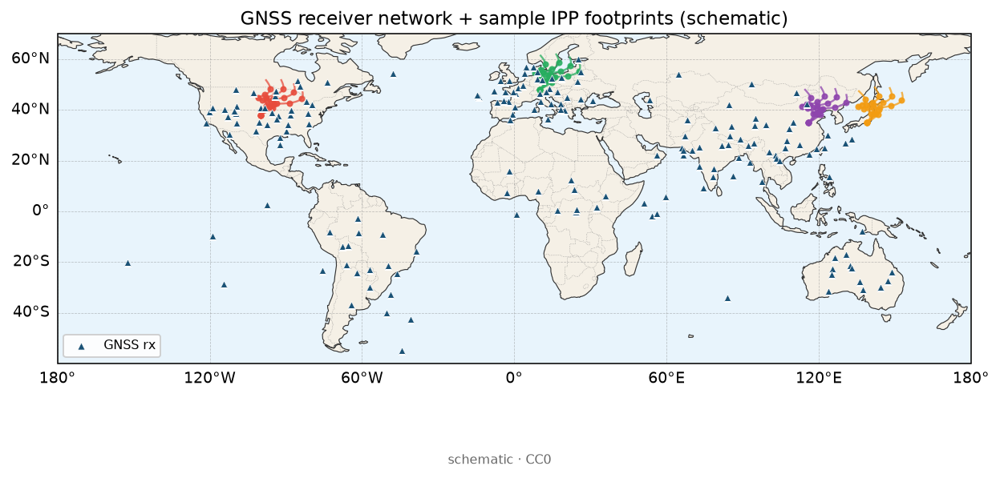

# 10 · 从多站 GNSS 到 GIM：一条能落地的流水线（含失败模式）

> **先修**：[02-gnss-dualfreq-tec.md](./02-gnss-dualfreq-tec.md)、[03-gim-ionex.md](./03-gim-ionex.md)、[09-dcb-biases-deep.md](./09-dcb-biases-deep.md)  
> **学完应能**：在白板上画出「RINEX → STEC → IPP/映射 → 空间模型 → IONEX → 验证」全流程；说出每一步的典型失败模式；解释薄壳与高度角截止；按清单做交叉验证；在 [`lists/01-ionosphere.md`](../../lists/01-ionosphere.md) 对上工具名。  
> **项目名**均来自 [`PROJECTS.json`](../../PROJECTS.json)。

---

## 0. 学习目标与「菜谱」类比

目标不是背「球谐阶数取多少」，而是能独立回答：

1. 我的区域/全球电子含量图，数据从哪来、经过哪些站？  
2. 每一步会引入什么误差？哪一步失败时，图会「好看但不可吃」？  
3. 我如何证明这张图不是插值算法的幻觉？

**类比：做菜。**  
选菜（站网）→ 洗净（QC/周跳）→ 切配（STEC）→ 调味（DCB/映射）→ 摆盘（空间模型与时间维）→ 尝味（和官方产品、测高仪、掩星比）。  
缺一步，盘子上可能色泽诱人，但不可端上桌。

---

## 1. 术语表（建图课必会）

| 术语 | 定义 | 为什么建图时要命 |
|---|---|---|
| **GIM** | Global Ionosphere Map，全球（或大区域）电离层图，通常给 VTEC | 产品形态；不等于三维密度 |
| **IONEX** | IONosphere map EXchange：交换 GIM 的常用文本格式 | 不会读写就难与社区互操作 |
| **IPP** | Ionospheric Pierce Point，穿刺点：射线与薄壳的交点 | VTEC「采样点」落在地图上的位置 |
| **薄壳（thin shell）** | 假设电子集中在某一高度的薄层上 | 把 STEC→VTEC 的常用简化；是误差源 |
| **壳高 $h_{\mathrm{ion}}$** | 薄壳假设的高度（常取 350–450 km） | 选错会扭赤道异常等结构 |
| **映射函数** | 把斜路径 STEC 换成 VTEC 的几何因子 | 低高度角误差急剧变大 |
| **高度角截止（elevation cutoff）** | 丢弃低于某仰角的观测（如 15°–20°） | 用数据量换映射与多路径稳健性 |
| **球谐 GIM** | 用球谐函数展开全球 VTEC | 与 IGS 传统接近；阶次有截断与振荡问题 |
| **格网插值 GIM** | 在 IPP 采样上做 IDW/Kriging 等 | 区域网实现快；稀疏区易假结构 |
| **分析中心（AC）** | 产出官方/准官方 GIM 的机构路线 | 你的验证「真值」其实也是估计 |

---

## 2. 总流程图（请能默画）

```
连续跟踪站 RINEX
    → 质量检查 / 周跳探测与修复
    → 每站每星 STEC（处理 DCB，见第 09 课）
    → 计算穿刺点 IPP + 映射函数 → VTEC 采样
    → 空间表示（格网插值 或 球谐/其他基函数）
    → 时间滑动或逐时段解算
    → 写出 IONEX / 自有格网
    → 和 IGS GIM / 测高仪 / 掩星交叉验证
```

下面按步骤展开：**每步先讲「在干什么」，再讲「失败模式」，再给「本仓库落点」。**

---

## 3. 步骤详解与失败模式

### 3.1 选站与数据

**在干什么**  
决定空间覆盖与时间分辨率。全球用 IGS 及合作站；区域用各国 CORS、陆态网等（注意申请与引用）。科学分析常用 30 s 或更高采样；出图可先 15 min / 1 h 一帧以降算力。

**失败模式**

| 失败 | 图上长什么样 | 怎么发现 / 补救 |
|---|---|---|
| 站太稀 | 大片平滑色块，结构「像真的」 | 把 IPP 点画在地图上：若目标区几乎没有点，色块就是编的 |
| 站太密但质量不齐 | 局部麻点、假梯度 | 看单站残差与周跳率；剔除坏站比硬插更重要 |
| 只选「好天气日」调参 | 扰动日全面翻车 | 安静日 + 磁暴日各留一天做稳健性测试 |
| 时间戳/时区搞错 | 和地方时结构错位 | 检查 IONEX epoch 与 RINEX 时间系统 |
| 数据许可未声明 | 论文/报告合规风险 | 按 [`docs/data-access.md`](../data-access.md) 走申请与引用 |

**落点**：`IGS-Data-Access`、`IGS-Products`、`EarthScope-gnsstools`、`CDDIS-GNSS-Archive`；产品对照 `CDDIS-IONEX`、`JPL-IONEX-Rapid`、`DLR-IMPC`、`ESA-TIO-NRT-TEC`、`NOAA-SWPC-GloTEC`、`ROB-European-TEC`、`INPE-TEC-Maps-IONEX`、`GFZ-Global-Ionosphere-Maps`、`WHU-IGS-Ionosphere-AC`。列表：[`lists/10-gnss-datasets.md`](../../lists/10-gnss-datasets.md)。



> **看图要点**
> - **机制**：选站决定 IPP 能钉住哪里；陆密洋疏是结构性的，不是画图软件的锅。
> - **看什么**：目标区周围有没有站/足迹；大片空白就要接受平滑外推。
> - **别误判**：示意站网；点得多不等于质控都过关。
> 图源：本仓库自制示意场 + Natural Earth 海岸线（非实测事件）。

### 3.2 质量检查与周跳

**在干什么**  
脏数据进网，后面所有「智能算法」都会认真拟合垃圾。检查完整率、多路径指标、周跳、钟跳、明显野值。

**失败模式**

- 未修周跳 → STEC 台阶被空间模型当成真实结构。  
- 把多路径高峰当电离层扰动 → 低高度角、反射环境差的站周围出现「永恒热点」。  
- 只看 SNR 不看相位连续性 → 漏掉小周跳。

**落点**：`TEQC`、`GFZRNX`、`georinex`（见 [`lists/03-gnss-data.md`](../../lists/03-gnss-data.md)）。

### 3.3 单站 STEC（含 DCB）

**在干什么**  
双频观测量 → 几何无关 →（相位平滑）→ STEC；按第 09 课处理卫星/接收机偏差。

**失败模式**

- 忽略 DCB → 整站系统性偏高/偏低，球谐低阶「背锅」。  
- 码类型与 DCB 产品不一致 → 零点改正变成零点破坏。  
- 不同软件默认映射/截止角不同 → 「同站不同 TEC」其实是流程差。

**落点**：`gnss-tec`、`pygnss-tec`、`tec-suite`、`Seemala-GPS-TEC`、`Okoh-MATLAB-TEC-from-RINEX`、`IONOLAB-TEC-Software`；偏差线索 `Gkit-Bias`。先求「能复现文献量级与日变形态」，再抠绝对标定。

### 3.4 穿刺点 IPP + 薄壳映射（本课重点之一）

**在干什么**  
常用简化：假设电子集中在高度 $h_{\mathrm{ion}}$ 的薄壳上。斜路径 TEC 通过映射函数变成 VTEC，并把该 VTEC 记在 IPP 的经纬度上，供后续插值或球谐拟合。

**薄壳类比**  
把厚厚的大气层「压成一张透明保鲜膜」。保鲜膜的高度你要猜。猜错了：斜着看时，投影位置和厚度换算都会歪——赤道异常的「双峰」可能被拉近、拉远或抹糊。

**高度角截止为什么常见**  
低高度角：路径更斜 → 映射因子对壳高更敏感；对流层/多路径更脏；射线可能擦过更多水平梯度。实务常用 15°–20°（不是圣旨，但是课堂默认起点）。

**失败模式**

| 失败 | 后果 |
|---|---|
| 壳高固定不当 | 系统性扭歪低纬结构；与测高仪/掩星比时高度不一致 |
| 截止角过低 | 噪声与假梯度灌图 |
| 截止角过高 | 中高纬冬季或站网边缘有效点过少，图「破洞」 |
| 把映射误差当成空间天气 | 磁暴日「假空洞」——其实是数据/映射空洞 |
| 忽略水平梯度 | 薄壳假设在强梯度区更假；层析/同化才是下一步（11、12 课） |

**课堂必记局限**：真实电离层有厚度、有倾斜梯度；GNSS 几何很斜；**垂直结构不能靠薄壳 magically 变出来**。


> **看图要点**
> - **机制**：壳高与仰角决定 IPP 落点；轨迹图是检查「采样是否围住研究区」的第一眼工具。
> - **看什么**：弧线是否盖住目标海岸带；低仰角是否滑出区外。
> - **别误判**：示意几何；壳高一改，弧线水平位置会挪。
> 图源：本仓库自制示意场 + Natural Earth 海岸线（非实测事件）。


> **看图要点**
> - **机制**：建图 = 把 IPP 上的 VTEC 采样估计到格网；点的疏密直接决定哪里可信。
> - **看什么**：格网场与红点覆盖是否匹配；空洞处的漂亮等值线要降权。
> - **别误判**：示意产品；换网格重跑漂亮 ≠ 独立验证。
> 图源：本仓库自制示意场 + Natural Earth 海岸线（非实测事件）。

### 3.5 空间模型怎么选

| 做法 | 适合 | 代价 | 目录可对号 |
|---|---|---|---|
| 格网 + 插值（IDW/Kriging 等） | 区域网、实现快 | 边界与稀疏区易假结构 | 思路参考 `Ionospheric-TEC-Kriging-Turkiye` |
| 球谐展开 | 全球/大区域、贴近 IGS 传统 | 阶次截断、Gibbs 假振荡、空洞处环状假波 | `SH-GIM`、`mosgim`、`mosgim2`、`m_gim`、`M_GIM` |
| 其他基函数 / 层析 | 研究型三维 | 病态、要先验 | 见 [11-tomography-basics.md](./11-tomography-basics.md) |

**失败模式**

- 「插值很漂亮 = 物理真实」。  
- 「球谐阶数越高越好」→ 拟合噪声，空洞处振荡。  
- 换网格重跑一遍就宣称「验证成功」→ 那只是同一观测的不同光滑版本。

读写与分析：`ionex`、`ionex-rs`、`ionex_reader`、`ionex-analyzer`、`ionex-downloader`、`ionex_formatter`、`INX_Editor`。

### 3.6 时间维

可逐小时独立解，或滑动窗口 / 递推。太粗：糊掉 TID；太细：噪声主导。入门先固定 1 h 或 2 h，能画出地方时结构再说。

**失败模式**：用 2 h 平均图去「发现」20 分钟 TID；或 30 s 出图却无空间平滑，把多路径当行进式扰动。

### 3.7 输出与互操作

优先学会写/读 **IONEX**（[03-gim-ionex.md](./03-gim-ionex.md)）。自有二进制可以，但别人难复现你的论文图。头文件里的 epoch、半径、壳高、指数约定要写全。

**失败模式**：图在自己电脑很美，审稿人无法用标准工具打开；或经纬度网格与 IGS 产品不对齐却硬做差分。

---

## 4. 验证清单（精通的人天天做）

把下面做成你的「出厂质检表」。每项写：做了 / 结果摘要 / 是否合格。

- [ ] **与多家 GIM 差分**：对 CODE/JPL/CAS/WHU/GFZ 等（入口见 `CDDIS-IONEX`、`JPL-IONEX-Rapid`、`WHU-IGS-Ionosphere-AC`、`GFZ-Global-Ionosphere-Maps`）做差分直方图，记录均值与标准差；记得中心间本身有差（`UWM-IGS-Iono-Combination`）。  
- [ ] **安静日形态**：地方时白天高、夜里低；低纬是否可见赤道异常双峰趋势。  
- [ ] **磁暴日 sanity**：是否出现「假空洞」（映射/数据空洞）？抬升是否与空间天气指数时间线同向？  
- [ ] **多源同向**：测高仪 foF2、掩星电子密度积分是否同向变化（[07-ionosonde-occultation.md](./07-ionosonde-occultation.md)；掩星数据如 `CDAAC_COSMIC-TEC_Data-Research`、`COSMIC-CDAAC`）。  
- [ ] **参数扰动实验**：换高度角截止、换壳高（350↔450 km），图是否「面目全非」——若是，结构不稳健。  
- [ ] **IPP 覆盖图**：采样点是否围住感兴趣区域？  
- [ ] **DCB 声明**：绝对水平用的哪套产品/约束？（回 [09](./09-dcb-biases-deep.md)）  
- [ ] **物理模式仅作对照**：`TIE-GCM`、`GEMINI3D`、`pytiegcm` 可正演对照，**谨慎**当「观测替代品」。

---

## 5. 端到端「一日最小可行」建议路径


> **看图要点**
> - **机制**：一日最小路径先能画出「像气候」的 VTEC 地理格局，再谈与官方 GIM 差分。
> - **看什么**：日侧/夜侧、低纬双峰趋势是否出现在你的区域裁剪里。
> - **别误判**：示意场只作读图锚点；你的正式产品仍要以 IONEX/自建流程为准。
> 图源：本仓库自制示意场 + Natural Earth 海岸线（非实测事件）。

1. 下载一天 `CDDIS-IONEX`，用 `ionex` 画出中国区或你所在经纬带 VTEC。  
2. 选 5–10 个 IGS 站，用 `gnss-tec` 或 `Seemala-GPS-TEC` 等跑通单站 STEC，把 IPP 投到地图上。  
3. 壳高 350 km 与 450 km 各出一张 VTEC 采样散点/插值图，写三句话差异。  
4. 对照同一天官方 GIM，做差分粗统计。  
5. 把失败模式表里你踩过的坑打勾。

完整闭环作业见 [16-practice-one-day-tec.md](./16-practice-one-day-tec.md)。

---

## 6. 常见误区（建图版）

1. **「插值很漂亮 = 物理真实」** — 稀疏区色块可能是算法填的。  
2. **「和某家 GIM 差 8 TECU 就是我错了」** — 先查 DCB 基准与时间对齐。  
3. **「全球球谐阶数越高越好」** — 过高拟合噪声并在空洞振荡。  
4. **「只用一个安静日调参」** — 扰动日才暴露映射与站网漏洞。  
5. **「物理模式输出可以直接当 GIM」** — `TIE-GCM` / `GEMINI3D` / `pytiegcm` 是正演/研究工具。  
6. **「薄壳是真理」** — 它是工程近似；强梯度与三维问题要进 11/12 课。  
7. **「截止角是玄学」** — 它是噪声、映射、覆盖三者之间的显式折中，必须写进方法节。

---

## 7. 测验

**Q1.** 默画总流程图（至少 7 个框），并在「映射」与「空间模型」两框旁各写一条失败模式。

**Q2.** 为什么低高度角观测常被截止？用「映射敏感性 + 多路径」各答一句。

**Q3.** 壳高从 350 km 改到 450 km，同一套 STEC 的 VTEC 图可能差在哪里？你的验证清单会看哪一项？

**Q4.** 球谐阶数盲目升高，图上可能出现什么假象？与「站太稀却强行 Kriging」的假象如何区分？

**Q5.** 指出本仓库：两个估 TEC 条目、两个球谐/GIM 实现、两个官方/业务 IONEX 或 TEC 产品入口。

**Q6.** 「磁暴日假空洞」更可能来自物理真洞还是数据处理？你如何用 IPP 覆盖图与多家 GIM 差分来判别？

---

## 8. 本仓库工具落点总表

| 步骤 | 条目（`PROJECTS.json`） |
|---|---|
| 估 TEC | `gnss-tec`、`pygnss-tec`、`tec-suite`、`Seemala-GPS-TEC`、`Okoh-MATLAB-TEC-from-RINEX`、`IONOLAB-TEC-Software` |
| QC / RINEX | `TEQC`、`GFZRNX`、`georinex` |
| 读写 IONEX | `ionex`、`ionex-rs`、`ionex_reader`、`ionex-analyzer`、`ionex-downloader`、`ionex_formatter` |
| 球谐/GIM 实现 | `SH-GIM`、`mosgim`、`mosgim2`、`m_gim`、`M_GIM` |
| 插值思路参考 | `Ionospheric-TEC-Kriging-Turkiye` |
| 官方/业务产品 | `CDDIS-IONEX`、`JPL-IONEX-Rapid`、`GFZ-Global-Ionosphere-Maps`、`DLR-IMPC`、`ESA-TIO-NRT-TEC`、`NOAA-SWPC-GloTEC`、`ROB-European-TEC`、`INPE-TEC-Maps-IONEX`、`WHU-IGS-Ionosphere-AC` |
| 物理对照 | `TIE-GCM`、`pytiegcm`、`GEMINI3D` |

---

---

## 10. 薄壳映射：把数学直觉说到「能给本科生讲懂」

设卫星高度角为 $E$（elevation），薄壳高度为 $h_{\mathrm{ion}}$，地球半径为 $R_e$。教学里常见的单层映射函数大致长这样（形式因文献略有出入）：

$$
\mathrm{VTEC} \approx \mathrm{STEC} \times \cos z' 
\quad\text{或等价地}\quad
\mathrm{STEC} \approx \mathrm{VTEC} \times m(E,h_{\mathrm{ion}})
$$

其中 $z'$ 是射线在穿刺点处与薄壳法向的夹角，由 $E$ 与 $h_{\mathrm{ion}}$ 几何决定；$m$ 是映射因子，低高度角时 $m$ 显著大于 1。

**人话**：你斜着穿过雾，路径更长，读数更大；要换算成「竖直穿透该点的雾厚」，就得除以一个「斜路有多斜」的因子。薄壳告诉你「雾只存在于那张膜上」，所以几何可以闭式算；真实雾有厚度时，这个除法就会偏。

### 10.1 壳高敏感的课堂演示（口述即可）

同一条 STEC：

- 壳高抬高 → IPP 水平位置外移（斜路径与更高膜相交更远），映射因子也变；  
- 赤道异常峰的位置可能在图上「搬家」；  
- 若你的站网只在大陆一侧密集，壳高一变，海洋一侧空白区的插值会跟着变脸。

因此：**壳高不是调色板滑杆，而是模型假设。** 写方法节时必须给出数值与文献依据；做稳健性时必须做 350/400/450 km 对照。

### 10.2 高度角截止的「三维权衡」

把它想成三角形的三个角：

1. **数据量**：截止越高，点越少；  
2. **观测质量**：截止越高，多路径与映射误差通常越小；  
3. **空间覆盖**：截止越高，站网有效足迹收缩，边界更破。

没有免费午餐。区域网若本身就稀，盲目 30° 截止可能让你「没东西可画」；全球网在低纬若保留 5°，假结构风险上升。课堂默认 15°–20°，是让你先有可运行基线，再按区域与季节调。

---

## 11. 和官方产品对齐时的「差分礼仪」

初学者常把「我的图减 CODE」直接当误差。更干净的做法：

1. **时间对齐**：同一 epoch（注意 IONEX 常为整点或 1–2 h）；需要时对两套图做时间插值，并记录插值假设。  
2. **空间对齐**：插到同一经纬网格；注意 180° 经线、纬度方向约定。  
3. **掩膜**：只在双方都有有效值、且你的 IPP 覆盖足够的地方比。  
4. **分带统计**：低纬 / 中纬 / 高纬分开报 RMSE，避免「全球一个数」掩盖低纬灾难。  
5. **报告偏差均值**：系统偏差（bias）与标准差（std）分开写——前者常连着 DCB/基准，后者连着噪声与结构差。

若你的目标是业务监测，也可对照 `DLR-IMPC`、`ESA-TIO-NRT-TEC`、`NOAA-SWPC-GloTEC` 等近实时产品，但要读清它们是分析场、预报还是同化混合（预习 [12](./12-data-assimilation-intro.md)）。

---

## 12. 迷你项目规格书（可当作业提交模板）

**标题**：一日区域 VTEC 试生产  
**输入**：日期 D；站表（≥8 站）；壳高；截止角；DCB 来源声明  
**流程**：按本课总流程图执行并截图 IPP 覆盖  
**输出**：

1. 一张 VTEC 图（注明色标单位 TECU）；  
2. 与 `CDDIS-IONEX` 当日产品差分直方图；  
3. 失败模式表：至少勾选 3 条你认为最危险的，并说明你如何缓解；  
4. 半页讨论：若把壳高 ±50 km，结论哪些不变、哪些变。

评分更看「你是否知道图可能错在哪」，而不是色图是否炫。

---

## 13. 从 GIM 走向三维之前：你已经站在门槛上

若验证清单都过了，你仍会问：VTEC 只是柱总量，高度上电子怎么分布？那是 [11-tomography-basics.md](./11-tomography-basics.md) 的问题——层析比 GIM **更病态**，需要先验。  
若你想让物理模式「跟着 GNSS 走」，那是 [12-data-assimilation-intro.md](./12-data-assimilation-intro.md)。  
**不要**在 GIM 还不稳定时跳去三维可视化：三维假立方体比二维假色图更会骗人。

---

## 14. 延伸阅读

- [03-gim-ionex.md](./03-gim-ionex.md) · [09-dcb-biases-deep.md](./09-dcb-biases-deep.md) · [11-tomography-basics.md](./11-tomography-basics.md) · [16-practice-one-day-tec.md](./16-practice-one-day-tec.md)

**相关软件**：[`ionex-gim`](../software/ionex-gim.md) · [`sh-gim`](../software/sh-gim.md) · [`pytecgg`](../software/pytecgg.md)
