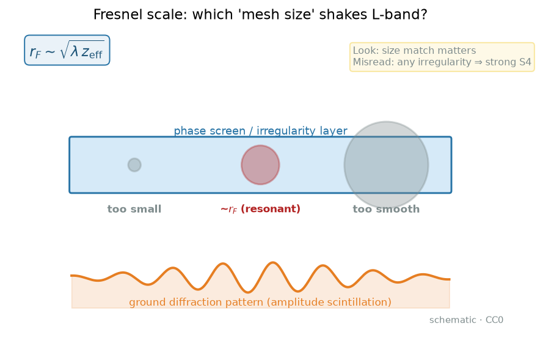
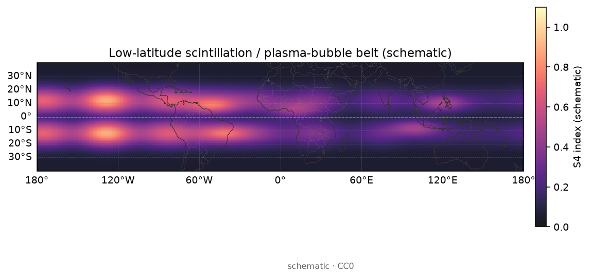
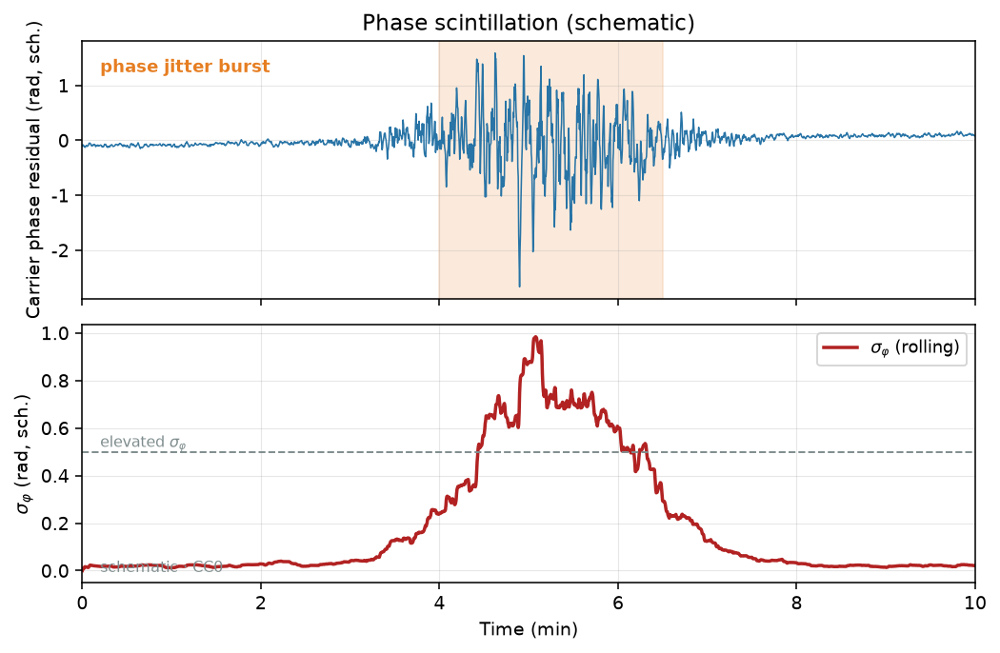
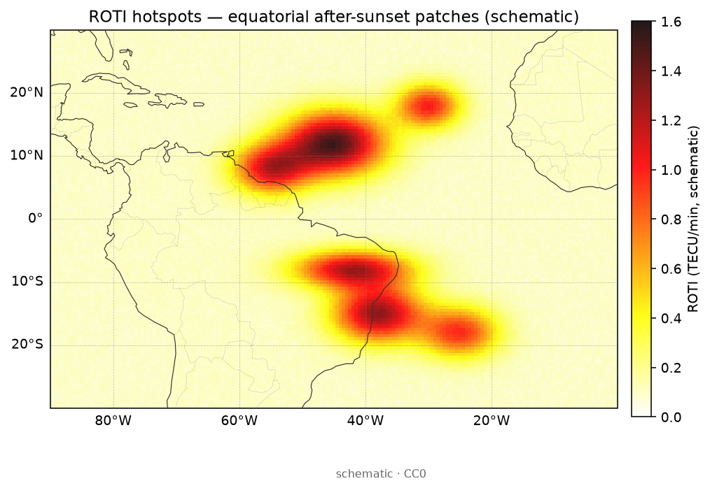
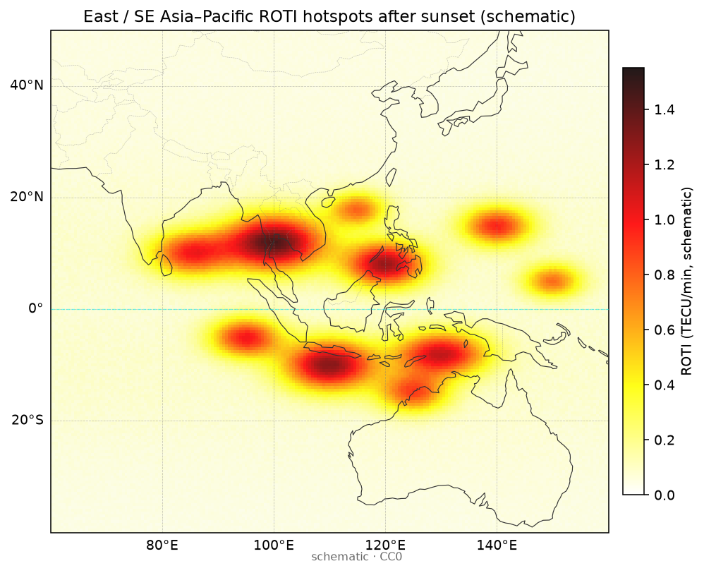

# 13 · 闪烁建模：统计 / 相位屏 / 经验，如何对接 S4、σφ、ROTI

> **课堂定位**：接 [05](./05-scintillation-roti.md)（指数入门）与 [06](./06-iono-positioning.md)（定位侧痛点）。05 课教你**怎么报指数**；本课回答：**为何要建模、模型在模什么、公式怎么一步步拆、模型输出与真闪烁/多径怎么一眼区分、何时指数够用何时必须上仿真**。
> 路线固定为四段：
> **机制 → 公式拆解（逐步推导）→ 观测签名 → 分析步骤**。
> 你会听到「花玻璃 / 马路颠簸加速度计 / 天气预报 vs 气候志 / 风扇转速用慢快门」类比；每条后面立刻配符号、单位与可追问的机制。
>
> **写给谁**：第一次在论文里同时看到 phase screen、weak scatter、power-law spectrum、S4、ROTI 就晕的人；以及想在本仓库为「监测」「ROTI」「仿真」各点名真实 `name` 的人。
>
> **学完交付**：口述湍流尺度与 Fresnel 对上才晃；默画相位屏→衍射→地面时间序列；逐步写出弱闪烁下起伏强度与 S4 的教学关系；按图认「模型输出 / 真闪烁 / 多径」；完成选题—输入检查—验收清单；说出至少三条误区与一套自测题答案要点。
>
> **项目名**均来自根目录 [`PROJECTS.json`](../../PROJECTS.json) 的 `name` 字段。

---

## 0. 开场：三个真实场景

请先合上笔记本，想三件事：

1. **值班室已有 ROTI 图，领导还要「仿真一段闪烁波形给接收机」**：ROTI 回答「今晚路面颠不颠」；仿真回答「车灯会怎么晃、跟踪环会不会丢」。两层需求不同——见 §2 四象限。链回 [05](./05-scintillation-roti.md)。
2. **论文写「我们用相位屏模型复现了 S4」**：审稿人问：谱指数从哪来？有效高度多少？有没有和当晚 ISMR 对照？没有锚定的相位屏只是动画。
3. **只有 CORS 1 Hz，却想「校准」某气候学闪烁概率产品**：你可以做地方时分箱的 ROTI 气候，但**不能**把 ROTI 绝对值改名成文献 S4 去横比。本课钉死接口规则。

**本课地图（请对照目录）：**

| 段落 | 你在学什么 | 类比 |
|---|---|---|
| §1 词表 | 先认名字 | 进厨房前认厨具 |
| §2–6 **机制** | 为何建模；尺度；相位屏；能预言什么 | 花玻璃、气候志、天气预报 |
| §7–11 **公式拆解** | 弱闪烁、谱斜率、S4 接口、小数值例 | 把菜谱拆成一步一步 |
| §12–13 **观测签名** | 模型输出 vs 真闪烁 vs 多径 | 监控录像怎么认人 |
| §14–20 **分析步骤** | 选题、输入检查、验收、误解、测验 | 值班清单与过关 |

配图均在 [`images/`](./images/)，版权见 [`images/SOURCES.md`](./images/SOURCES.md)。

**边界**：不重讲 S4 / σφ / ROTI 的入门定义与采样生死线（回 [05](./05-scintillation-roti.md)）；不重讲气泡气候长文（链 [21](./21-equatorial-anomaly-bubbles.md)）；不改 [`docs/software/`](../software/) 软件卡。现象课 [19–23](./19-phenomena-overview.md) 保持独立短文。**不画新流程图**——决策用口述树与勾选表，配图用已有自制图。

---

## 1. 词表（先扫一遍，主讲后再回看）

### 1.1 监测与建模

| 术语 | 人话 | 稍严 |
|---|---|---|
| **监测（monitoring）** | 报「现在强不强」 | 近实时指数、地图、告警 |
| **建模（modeling）** | 描述/仿真「为何/若怎样」 | 经验气候、统计谱、相位屏、半物理 |
| **气候学模型** | 「这一季晚上容易吗」 | 按地方时/季节/太阳活动/磁纬给概率或平均强度 |
| **统计 / 传播模型** | 在计算机里长出起伏时间序列 | 常经相位屏 + 衍射传播 |
| **半物理 / 物理** | 尝试长出气泡与不规则体本身 | 开源完整链路少、门槛高 |

### 1.2 尺度与相位屏

| 术语 | 人话 | 稍严 |
|---|---|---|
| **不规则体** | 电子密度小尺度疙瘩 | 闪烁的「路面碎石」本身 |
| **湍流外尺度 / 内尺度** | 疙瘩谱的大端与小端 | outer / inner scale；决定功率谱形状 |
| **Fresnel 尺度 $r_F$** | 和 L 波段衍射最对得上的纱孔 | $r_F\sim\sqrt{\lambda z_{\mathrm{eff}}}$；详 [05](./05-scintillation-roti.md) |
| **相位屏** | 把一层不规则体压成「搓皱波前」的薄屏 | phase screen；仿真常用中间层 |
| **弱闪烁 / 强闪烁** | 晃得轻 vs 晃到饱和 | 弱闪烁可用线性/Born 类近似；强闪烁要小心饱和 |

### 1.3 指数接口（与 05 对齐）

| 术语 | 人话 | 稍严 |
|---|---|---|
| **S4** | 光强相对起伏有多凶 | 强度归一化标准差；无量纲 |
| **σφ** | 相位抖得有多凶 | 相位起伏统计；与载波环压力相关 |
| **ROTI** | TEC 变化率在抖不抖 | 双频网代理；**≠** S4 |
| **ISMR** | 专用闪烁监测记录语境 | 真 S4/σφ 常来自此类 |
| **起伏强度（教学量）** | 「屏有多皱」的标量旋钮 | 下文用 $\sigma_\chi^{2}$ 或 $C_s$ 量级直觉，不堆巨式 |

**纪律**：禁止说「ROTI = S4」；禁止无实测对照就宣称「模型验证了闪烁」；禁止把多径尖峰写成电离层闪烁；禁止赤道阈值原封搬到极光区。

---

# 第一段 · 机制

> 目标：用因果讲清——**为何要建模**、湍流/不规则体尺度如何决定「晃不晃」、相位屏在仿真里扮演什么、模型**能预言什么 / 不能预言什么**。完整公式留给第二段。

---

## 2. 为何要建模？先分清你的需求（四象限）

| 需求 | 你真正要的 | 典型出口 | 本仓库钩子 |
|---|---|---|---|
| 监测告警 | 今晚/本区域强不强 | ROTI 图、S4 链、告警阈值 | `igs-roti`、`scintkit`、`Ionospheric-Scintillation-Maps-and-PDOP` |
| 气候统计 | 季节/地方时/太阳活动概率 | 经验气候学 | 论文+自建统计；产品侧看 `DLR-IMPC` 等是否提供扰动类信息 |
| 影响评估 | 失锁概率、定位误差怎么变 | 闪烁仿真 + 接收机/基带模型 | `gnss-scintillation-simulator`、`gnss-scintillation-simulator_2-param` |
| 科学研究 | 谱指数、气泡演化、机制 | 相位屏、物理/半物理 | 开源完整链路少；先读论文再找工具 |

口诀：**先监测，后模型；先分纬，后定阈值；要波形才上相位屏。**

类比三层：

- **监测** = 今晚实况与临近告警（看窗外有没有在下冰雹）；  
- **气候学模型** = 「夏季午后多雷雨」那种概率（气候志）；  
- **相位屏仿真** = 尝试在计算机里长出那阵雹暴的声响给试车用（风洞）。

> **图注（为什么放这里）**  
> - **看什么**：气泡/耗空切断或搓皱视线 → 地面收到的是干涉图样扫过的时间序列。  
> - **为什么**：建模的第一动机常常是「气泡壁附近会发生什么」——但有泡示意 ≠ 已测得 S4。  
> - **别误判**：示意图不能代替当晚 ROTI/ISMR 锚定。

---

## 3. 湍流与不规则体尺度：哪一档疙瘩最会晃 L 波段？

电离层不规则体很少是「单一波长的正弦波」，更像**多尺度湍流**：大涡碎成小涡，功率谱常近似幂律。

教学上记住三档：

| 尺度档 | 直觉 | 对 GNSS L 波段的典型后果 |
|---|---|---|
| $\gg r_F$ | 大尺度「丘陵」 | 主要慢慢拧相位 / 调 TEC；幅度干涉不一定凶 |
| $\sim r_F$ | 和衍射「对得上」的纱孔 | **幅度闪烁（S4）** 易出镜 |
| $\ll r_F$ | 很碎的沙粒 | 贡献谱的高频尾；是否可见取决于采样与内尺度 |

Fresnel 尺度课堂式：

$$
r_F \sim \sqrt{\lambda\, z_{\mathrm{eff}}}
$$

其中 $\lambda$ 为载波波长（m），$z_{\mathrm{eff}}$ 为有效传播几何距离（m 量级，常与层高/仰角相关）。L1 量级算例与纠错见 [05 §4](./05-scintillation-roti.md)——本课只强调：**模型若乱设谱斜率或有效高度，等于把纱孔拧到错档。**

> **图注（为什么）**  
> - **看什么**：只有「纱孔」落在 Fresnel 附近时，地面干涉对比度才容易大。  
> - **为什么**：这是统计/传播模型选谱参数时的第一道物理门闩。  
> - **别误判**：有不规则体谱 ≠ 一定强 S4；还要几何与接收机采样跟上。

**低纬 vs 高纬驱动不同（运营纪律）**：

| 问题 | 低纬优先看 | 高纬优先看 |
|---|---|---|
| 何时紧张 | 日落后地方时（EPB 剧本） | 磁层/极光活跃时段 |
| 代理指数 | ROTI/S4 + 气泡气候 | S4/σφ + 地磁/极光活动 |
| 阈值 | 分季分太阳活动 | 分磁情，勿用赤道表 |

> **图注（为什么）**  
> - **看什么**：低纬夜侧「通道」——建模气候学时地方时比纯 UTC 更直觉。  
> - **为什么**：经验模型若不分磁纬/地方时，概率表会系统性歪。  
> - **别误判**：海岸示意图 ≠ 全球单一阈值授权书。

---

## 4. 相位屏直觉：仿真里那层「花玻璃」在干什么？

教学链路（与 05 对齐，本课强调**建模用途**）：

1. **密度疙瘩**把折射率搓皱 → 波前相位被局部提前/推后（**相位屏**动作）；  
2. 屏后自由空间传播 → 衍射把能量重新铺成亮斑/暗斑；  
3. 卫星—接收机相对运动让图样扫过天线 → **时间序列**上的幅度/相位起伏；  
4. 对时间序列做统计 → 模型输出的 S4、σφ，或直接把复数基带送给接收机仿真。

人话三句：不规则体是雾里的疙瘩；相位屏是花玻璃那一层；闪烁是花玻璃后面光斑在地上晃。

开源入口（点名，不替代读文档）：`gnss-scintillation-simulator`、`gnss-scintillation-simulator_2-param`。

> **图注（为什么）**  
> - **看什么**：相位残差在抖、滚动 σφ 在抬——这是相位账。  
> - **为什么**：相位屏模型常**同时**产幅度与相位；你要会对照「模型 σφ」与「实测 σφ」窗口定义是否一致。  
> - **别误判**：高 σφ 不许偷写成「S4=…」。

> **图注（为什么）**  
> - **看什么**：同一事件窗内相位账如何随时间鼓包。  
> - **为什么**：仿真验收时，对齐的是**同一地方时/同一卫星通道窗口**，不是随便截一段好看的。  
> - **别误判**：模型窗口 60 s、实测窗口 300 s，不能直接横比绝对值。

---

## 5. 模型能预言什么？不能预言什么？

| 模型类型 | 常能给出 | 常常不能诚实给出 |
|---|---|---|
| **指数 + 阈值** | 「超阈了」 | 机制、波形、未建站处的物理必然性 |
| **经验气候学** | 季节/地方时发生概率或平均强度 | 今晚某一分钟会不会炸；单事件精细结构 |
| **统计谱 + 相位屏** | 给定谱参数下的起伏统计与合成时间序列 | 「真实大气今晚的精确谱指数」——那是观测反演题 |
| **半物理 / 物理** | 机制叙事、情景试验 | 不经观测锚定的「运营级预报保证」 |

**清醒句**：模型预言的是**在你声明的假设下**系统会怎样；监测锚定的是**当晚实况**。把气候概率写成「今晚 23:10 必然失锁」，是文案事故。

---

## 6. 建模四层（由浅到深）与课堂三问

1. **指数与阈值** — 值班第一道闸；物理解释弱。  
2. **经验气候学** — 「这个月日落后低纬风险高不高」。  
3. **相位屏 / 弱散射统计** — 可输出时间序列给接收机仿真。  
4. **半物理 / 物理** — 耦合气泡与不稳定性；门槛高。

每一层开跑前三问：

1. **输入参数从哪来？** 谱指数、有效高度、$C_s$ 量级、地方时气候表——写进方法节。  
2. **有没有和实测 S4 / σφ / ROTI 对照的算例？** 没有就标成「情景演示」。  
3. **主产品标签是什么？** 监测图 / 气候概率 / 合成波形 / 机制研究——只能有一个主标签。

进 [`lists/01-ionosphere.md`](../../lists/01-ionosphere.md) 搜 scintillation / ROTI / ISMR。

---

# 第二段 · 公式拆解（逐步推导）

> 目标：选可跟的解剖台——**弱闪烁近似下起伏强度与 S4 的教学关系**、以及**功率谱斜率直觉**。每个解剖台统一：**符号表 → 逐步推导（每步人话）→ 小数值例**。单位用 Unicode（Hz、m、无量纲）。不堆不可读巨式；中文叙述不进 `$...$`。

---

## 7. 公式路线图（先看全图，再逐步拆）

| 解剖台 | 核心问题 | 你带走的式子直觉 |
|---|---|---|
| A 弱闪烁与 S4 | 「屏有多皱」如何接到幅度指数？ | 弱时 $\mathrm{S4}^{2}$ 随起伏强度近似正比抬升 |
| B 谱斜率 | 谱指数拧一下，谁先变？ | 能量是否堆在 $\sim r_F$ 附近 |
| C 模型—指数接口 | 仿真输出如何对上 05 的账本？ | 同窗口、同采样、同定义才能比 |
| D ROTI 代理边界 | 何时用 05 指标、何时必须上模型？ | 代理可监测；波形/失锁机理要仿真 |

完整 Rytov/Born 积分与交叉谱留给专著；你若能手算弱闪烁数值例并说清谱斜率旋钮，读论文时就不会被「scintillation strength」吓退。

---

## 8. 解剖台 A：弱闪烁近似——起伏强度如何接到 S4？

> 格式：**符号表 → 逐步推导 → 小数值例**。把「屏有多皱」翻译成可与监测对话的 S4。

### 8.1 符号表

| 符号 | 含义 | 单位 / 备注 |
|---|---|---|
| $I(t)$ | 接收强度（或功率代理）时间序列 | 任意正单位；最后会归一化 |
| $\langle I\rangle$ | 窗口内强度均值 | 与 $I$ 同单位 |
| $\mathrm{S4}$ | 幅度闪烁指数 | **无量纲**；$\mathrm{S4}=\sigma_I/\langle I\rangle$ 心智（均值$>0$） |
| $\chi$ | 对数幅度（教学用） | 无量纲；弱起伏时 $|\chi|$ 小 |
| $\sigma_\chi^{2}$ | 对数幅度方差（起伏强度教学量） | 无量纲；「屏皱度」旋钮 |
| $U$ | 教学用「弱闪烁强度旋钮」 | 无量纲；下文令弱闪烁下 $\mathrm{S4}^{2}\approx U$ |

> 说明：文献里起伏强度常与折射率结构常数、谱积分、几何因子绑在一起，符号家族很杂。本课用 $U$ / $\sigma_\chi^{2}$ 做**课堂旋钮**，避免一上来堆三维积分。

### 8.2 逐步推导（每步人话）

**步骤 1 — 先回到 05 的 S4 定义心智。**  
在强度均值 $>0$ 的窗口内：

$$
\mathrm{S4}=\frac{\sigma_I}{\langle I\rangle}=\frac{\sqrt{\langle(I-\langle I\rangle)^{2}\rangle}}{\langle I\rangle}.
$$

人话：光强相对标准差——风扇转速用「亮度晃多少」来报。

**步骤 2 — 引入对数幅度（弱起伏常用）。**  
令 $I=I_0\mathrm{e}^{2\chi}$（常见教学约定之一；$I_0$ 为无起伏参考）。弱闪烁时 $|\chi|\ll 1$，可线性化：

$$
\frac{I-I_0}{I_0}\approx 2\chi.
$$

人话：强度的相对起伏 ≈ 对数幅度的两倍——「屏轻轻搓一下，亮度跟着比例动」。

**步骤 3 — 把相对强度方差接到 $\sigma_\chi^{2}$。**  
由上式，相对强度的标准差 $\sigma_I/\langle I\rangle$ 在弱且 $\langle I\rangle\approx I_0$ 时满足教学关系：

$$
\mathrm{S4}\approx 2\,\sigma_\chi
\quad\Rightarrow\quad
\mathrm{S4}^{2}\approx 4\,\sigma_\chi^{2}.
$$

不同教材对 $\chi$ 定义差个因子 2；**课堂纪律**是：读论文先看它对 $\chi$ 的定义，再谈系数。本课关心的结构是——**弱闪烁下 $\mathrm{S4}^{2}$ 随「屏皱度」近似线性抬升**。

**步骤 4 — 收成一个可拧的旋钮 $U$。**  
定义教学旋钮 $U:=\mathrm{S4}^{2}$（弱闪烁工作点），并强调：

$$
U\uparrow\ \Rightarrow\ \mathrm{S4}\uparrow
\quad\text{（弱闪烁、未饱和）}.
$$

相位屏仿真里，你调的「scintillation strength / $C_s$ / 屏相位方差」一类参数，最终要通过传播算子落到 $U$ 上；**不要**以为输入栏写 0.3 就等于输出 S4=0.3——以仿真器文档与自测窗口为准。

**步骤 5 — 强闪烁警告（饱和）。**  
当起伏不再「轻轻搓」，亮斑/暗斑统计进入强散射制度，$\mathrm{S4}$ 可能**饱和**（量级上接近但不必等于 1 的经验上限叙事），$\mathrm{S4}^{2}\propto U$ 的线性故事破裂。运营含义：强事件日不要用弱闪烁公式外推「再加倍强度就双倍 S4」。

### 8.3 小数值例（请手算一遍）

**例 1 — 从强度序列到 S4（与 05 对齐）。**  
取窗口内相对强度（已除以均值）样本 $\{0.90,\,1.00,\,1.10,\,1.00\}$：

1. 均值 $=1$（已归一）；  
2. 偏差平方：$(-0.1)^{2}+0+0.1^{2}+0=0.02$；  
3. 方差 $=0.02/4=0.005$（若用总体方差教学；样本方差分母 $N-1$ 亦可，**方法节写死**）；  
4. 若改用总体：$\sigma_I=\sqrt{0.005}\approx0.071$ → $\mathrm{S4}\approx0.071$。  

更贴近 05 课堂常用的「直接对四点」演示：方差取 $\langle(I-\langle I\rangle)^{2}\rangle=0.02/4$ 或按 05 的讲法走——**关键是窗口与分母约定必须自洽**。

**例 2 — 弱闪烁旋钮扫描（教学表）。**  
假定某仿真器在弱区近似满足 $\mathrm{S4}\approx\sqrt{U}$（即我们把系数收进 $U$ 的定义）：

| 设定 $U$ | 预言 $\mathrm{S4}$ | 人话 |
|---|---|---|
| 0.01 | 0.10 | 近安静，定位用户常无感 |
| 0.04 | 0.20 | 开始要盯 C/N0 |
| 0.09 | 0.30 | 低纬夜里常见「惹麻烦」量级叙事 |
| 0.25 | 0.50 | 进入麻烦区；检查是否仍弱闪烁假设 |

**课堂追问**：若你把 $U$ 从 0.09 拧到 0.36，弱公式预言 S4 从 0.3→0.6；但实测饱和在 ~1 附近——你会如何改验收标准？（答：强区改用实测对照 + 饱和叙事，禁止线性外推。）

> **图注（为什么）**  
> - **看什么**：多频 S4 同窗鼓包——模型若声称「复现 S4」，应对齐这种时间结构，而不是只报一个季节平均。  
> - **为什么**：解剖台 A 的输出接口就是这类曲线。  
> - **别误判**：仿真平滑曲线 ≠ 已通过 ISMR 验证。

---

## 9. 解剖台 B：功率谱斜率——拧谱指数时谁先变？

> 格式：**符号表 → 逐步推导 → 小数值例**。说明「不是有谱就闪，而是能量堆在哪」。

### 9.1 符号表

| 符号 | 含义 | 单位 / 备注 |
|---|---|---|
| $\kappa$ | 空间波数（约 $2\pi$/波长） | m⁻¹ |
| $p$ | 三维/相位屏功率谱谱指数（教学符号） | 无量纲；文献定义差符号，先看论文 |
| $S(\kappa)\propto\kappa^{-p}$ | 幂律谱段 | 只在内外尺度之间成立 |
| $r_F$ | Fresnel 尺度 | m |
| $\kappa_F\sim 1/r_F$ | Fresnel 波数档 | m⁻¹ |

### 9.2 逐步推导（每步人话）

**步骤 1 — 谱是「哪一档疙瘩有多少能量」。**  
幂律段 $S(\kappa)\propto\kappa^{-p}$：$p$ 更大 → 能量更偏大尺度（谱掉得更快）；$p$ 更小 → 相对更多小尺度能量。

**步骤 2 — 幅度闪烁偏爱 $\kappa\sim\kappa_F$。**  
衍射滤波大致突出 Fresnel 附近贡献（课堂直觉，不展开传递函数积分）。因此：你把能量从 $\kappa_F$ 挪走，S4 倾向降；把能量堆回 $\kappa_F$，S4 倾向升。

**步骤 3 — 相位闪烁还吃更大尺度。**  
更大尺度（更小 $\kappa$）更能慢慢拧相位；所以拧 $p$ 时，**S4 与 σφ 的相对变化不必同百分比**——这是「两本账」在模型参数空间里的回声。

**步骤 4 — 内外尺度截断。**  
外尺度太大 → 接近「几乎均匀的坡」；内尺度太粗 → 高频尾被砍。仿真输入若默认截断与真实不符，会出现「S4 还行、时间谱形状不对」。

### 9.3 小数值例（量级思维，不必当真机精确）

假设教学传递后，幅度方差大致吃进「$\kappa_F$ 附近一档」的谱密度。若某次你把谱指数从 $p=4$ 调到 $p=3$（能量相对移向小尺度），在内外尺度不变时：

- 预期：**S4 对小尺度更敏感 → 往往变大**（方向性直觉）；  
- σφ 可能变，但比例不同；  
- ROTI（TEC 变化率代理）对更大尺度/更慢变化也敏感，**三者不会锁死同一百分比**。

**作业级追问**：只调 $p$、固定「总功率」，画一张「S4 与 σφ 谁先跳」的定性草图——比背一个 $p$ 标准值更有用。

---

## 10. 解剖台 C：模型输出如何对接 S4 / σφ / ROTI？

> 格式：**符号表 → 逐步推导 → 小数值例**。这是本课与 [05](./05-scintillation-roti.md) 的正式接口。

### 10.1 符号表

| 符号 / 物件 | 含义 |
|---|---|
| 模型强度序列 $I_{\mathrm{mod}}(t)$ | 相位屏传播后的合成强度 |
| 模型相位 $\varphi_{\mathrm{mod}}(t)$ | 合成相位（含几何/时钟要按文档剥离） |
| $\mathrm{S4}^{(\mathrm{mod})}$ | 对 $I_{\mathrm{mod}}$ 按与实测**相同窗口**算出的 S4 |
| $\sigma_\varphi^{(\mathrm{mod})}$ | 对 $\varphi_{\mathrm{mod}}$ 同窗统计 |
| $\mathrm{ROTI}^{(\mathrm{obs})}$ | 双频 TEC 变化率代理（观测侧） |

### 10.2 逐步推导（接口纪律）

**步骤 1 — 先定主产品。**  
若主产品是 S4，就用幅度链；若主产品是失锁机理，可能需要把复数基带送进接收机模型——指数只是摘要。

**步骤 2 — 窗口与采样对齐。**  
05 课强调的采样生死线对模型验收同样生效：模型 50 Hz 输出、实测 1 Hz 代理，不能直接比绝对值。

**步骤 3 — ROTI 只能当「活动代理」对照。**  
流程允许：模型说「不规则体活动↑」↔ 观测 ROTI↑。流程禁止：把模型 S4 曲线改名贴到 ROTI 色标上交差。

**步骤 4 — 写对照表而不是写形容词。**  

| 对照项 | 合格写法 | 不合格写法 |
|---|---|---|
| 时间窗 | 地方时 19–24 h，窗长 60 s | 「晚上看起来像」 |
| 采样 | 模型降采到与 ISMR 一致再比 | 直接比原生高采样与 1 Hz |
| 指标 | $\mathrm{S4}^{(\mathrm{mod})}$ vs $\mathrm{S4}^{(\mathrm{ISM})}$ | 「ROTI 高所以模型 S4 对」 |

### 10.3 小数值例：一次合格对照草稿

- 模型：$U=0.09$ → 弱公式 $\mathrm{S4}^{(\mathrm{mod})}\approx0.30$（窗 60 s）。  
- ISMR：同卫星、同地方时窗，$\mathrm{S4}^{(\mathrm{ISM})}=0.27$。  
- 相对差 $\approx 11\%$ ——可写「量级一致」；若差到 0.30 vs 0.80，先查饱和、窗长、是否多径污染，而不是先改论文形容词。

---

## 11. 解剖台 D：选题公式——用 05 指标还是上模型？

把决策收成三连（口述决策树，**不画流程图**）：

1. **要不要输出信号波形给接收机仿真？**  
   - 否 → 先别上相位屏；用 [05](./05-scintillation-roti.md) 指数 + 分纬阈值。  
   - 是 → 进入仿真层，并准备实测对照。  

2. **用户是值班员还是系统设计者？**  
   - 值班员 → 指数 + 地图通常够。  
   - 系统设计者 → 需要仿真与参数扫描。  

3. **有没有当晚/当周监测锚定？**  
   - 没有 → 任何模型结论只能标「气候概率/假设情景」。  
   - 有 → 可以写「实况 + 模型解释」。

---

# 第三段 · 观测签名

> 目标：练「一眼区分」——**模型合成输出**、**真电离层闪烁**、**多径/仪器假象**在时间序列与地图上长什么样。配图讲「为什么」，不讲绘图软件。

---

## 12. 签名墙：真闪烁 / 模型输出 / 多径

### 12.1 真闪烁（电离层）

- **时间**：低纬常贴日落后地方时鼓包；高纬更贴磁情。  
- **多频**：幅度闪烁常现频率依赖叙事（更高频往往相对温和，细节看事件）。  
- **空间**：ROTI/S4 热点呈带状/通道，而非单站孤立尖刺（单站尖刺先查多径）。  
- **与 TEC**：高 TEC 背景可以很平静；强闪烁可在梯度/气泡边缘。

> **图注（为什么）**  
> - **看什么**：安静日平坦 vs 扰动日鼓包——监测锚定长这样。  
> - **为什么**：模型对照前，先确认观测侧「有事件」。  
> - **别误判**：单点毛刺先想周跳/多径，再想物理。

> **图注（为什么）**  
> - **看什么**：日落后赤道通道状热点。  
> - **为什么**：气候学模型与分纬阈值的「签名靶心」。  
> - **别误判**：把中纬 TID 舌状结构直接叫「闪烁带」。

> **图注（为什么）**  
> - **看什么**：海岸视角的低纬热点——运营值班地图感。  
> - **为什么**：经验模型验收常看「热点是否落在该落的夜侧通道」。  
> - **别误判**：色标饱和造成的「全球通红」不是物理。

> **图注（为什么）**  
> - **看什么**：区域放大后的热点形态。  
> - **为什么**：写「亚太低纬夜间风险」时，用区域图比全球糊图更负责。  
> - **别误判**：无站网覆盖处的空白 ≠ 无闪烁。

### 12.2 模型合成输出（合格时像什么）

- 统计上可复现 S4/σφ 量级与谱形状；  
- 时间序列往往**过于平稳地服从设定谱**——缺少真实气泡间歇、多源叠加的「脏」。  
- 合格报告会写：输入谱指数、有效高度、随机种子、与哪次 ISMR/ROTI 对照。

**一眼假**：完美正弦包络、全星同时同相剧抖、与地方时完全无关的随机喷发——优先怀疑参数乱拧或把噪声当闪烁。

### 12.3 多径与仪器假象（常被写成闪烁）

| 线索 | 更像多径/仪器 | 更像电离层闪烁 |
|---|---|---|
| 仰角 | 低仰角、特定方位重复 | 多星、较高仰角也可出现 |
| 重复性 | 逐日同时段几何重复 | 随空间天气/地方时演变 |
| 地图 | 单站孤立 | 区域通道/多站共现 |
| 频率 | 视环境；未必符合闪烁频率叙事 | 常需与 S4 多频故事对照 |

**纪律**：模型输出再像，也不能自动洗白多径污染的「观测真值」。

---

## 13. 和定位用户对话时的签名（衔接 06）

闪烁期优先看：

1. **跟踪状态**：失锁、周跳暴增、CN0 狂抖；  
2. **多星余度与几何**：能否甩掉受害卫星仍定位；  
3. **接收机策略**：更稳健跟踪环、多频、衰减策略。

而不是只盯 VTEC 绝对值。高 TEC 可以很安静；强闪烁可以不在「全球最高 TECU」点。定位侧工具仍是 `RTKLIB`、`gLAB`、`GAMPII-GOOD`、`PRIDE-PPPAR` 等（[`lists/04-gnss-positioning.md`](../../lists/04-gnss-positioning.md)）；闪烁本身用监测/仿真条目。

---

# 第四段 · 分析步骤

> 目标：把机制与公式收成可执行清单——**选题 → 输入检查 → 跑数/对照 → 验收 → 写报告**；附误解、失败模式、测验与迷你项目。

---

## 14. 分析流水线（打勾用）

### 14.1 选题：用 05 指标还是上模型？

- [ ] 只需告警/气候统计 → 走 ROTI/S4 监测（05 + 本课 §2）  
- [ ] 需要波形/失锁机理/未建站情景 → 上相位屏仿真，并预约对照数据  
- [ ] 主标签只选一个：监测 / 气候概率 / 合成波形 / 机制研究  

### 14.2 输入检查（模型开跑前）

- [ ] 磁纬带、季节、地方时窗口写死  
- [ ] 谱指数 / 强度旋钮 / 有效高度 / 内外尺度有来源或扫描计划  
- [ ] 随机种子可复现  
- [ ] 输出采样率 ≥ 计划对照的观测采样（或声明降采流程）  
- [ ] 低纬事件对齐日落后；高纬事件对齐地磁/IMF 时间线  

### 14.3 验收（对照后）

- [ ] 同窗口定义下比较 $\mathrm{S4}$ / $\sigma_\varphi$（有 ISMR 时）  
- [ ] 无 ISMR 时：只声称与 ROTI「活动同向」，不报「S4 验证通过」  
- [ ] 检查多径清单（§12.3）后再宣称观测真值干净  
- [ ] 强闪烁日检查饱和，禁止弱公式外推  
- [ ] 报告分栏：监测事实 / 模型假设 / 对定位含义  

---

## 15. 常见误解（2–3 条深打 + 速查表）

### 15.1 深打三条

1. **「相位屏跑出来了 = 理解了今晚物理」**  
   你理解的是「在所设谱与几何下传播会怎样」。今晚真实谱指数仍要观测约束。缓解：情景演示与验证研究分栏写。

2. **「ROTI 地图可以当 S4 气候学真值去校准仿真」**  
   ROTI 是 TEC 变化率代理，传感器与定义不同。缓解：校准链优先 ISMR；ROTI 只做空间—时间活动掩膜。

3. **「弱闪烁公式在强事件日仍然线性」**  
   饱和会打断 $\mathrm{S4}^{2}\propto U$。缓解：强区改用实测分布与饱和叙事。

### 15.2 速查打假

| # | 误解 | 纠正 |
|---|---|---|
| 4 | 有仿真就不做监测 | 气候/情景 ≠ 当晚实况 |
| 5 | TEC 图可替代闪烁图 | TEC 大 ≠ 闪烁强 |
| 6 | 赤道阈值全球通用 | 高纬剧本不同 |
| 7 | TID 就是闪烁 | 可相关；机制与指数勿混（`IRI_TID` 分节） |
| 8 | 不问谱参数来源 | 输入垃圾则输出动画 |
| 9 | ML 预测 S4 = 理解物理 | 可能有工程价值；缺事件验证会翻车 |

---

## 16. 常见失败模式（监测与建模流水线）

| 步骤 | 失败 | 后果 | 缓解 |
|---|---|---|---|
| 定义指数 | 窗口长度与文献不一致 | 无法对比 | 方法节写死参数 |
| 选站 | 只用低高度角 | ROTI 虚高 | 截止角与质量控 |
| 分纬 | 全球单一阈值 | 误警/漏警 | 分磁纬气候表 |
| 仿真 | 无实测对照 | 动画科学 | 强制 S4/ROTI 对照 |
| 解释 | TEC 高当闪烁 | 错误运营决策 | 双图并行：TEC + 闪烁 |
| 高纬 | 只盯地方时 | 错过磁层驱动事件 | 对齐 AE/IMF 等 |
| 弱公式 | 强区线性外推 | S4 预言爆炸 | 检查饱和 |

---

## 17. 本仓库工具落点总表

| 目的 | 名称 |
|---|---|
| ROTI | `igs-roti`、`Okoh-MATLAB-ROT-ROTI`、`roti-gnss-ml`、`Ionospheric-TEC-ROTI-Interactives` |
| 监测/地图/ISMR | `Ionospheric-Scintillation-Maps-and-PDOP`、`ScintPi-1.0-Software`、`scintkit`、`scintill-ai`、`ismr_downloader` |
| 仿真 | `gnss-scintillation-simulator`、`gnss-scintillation-simulator_2-param` |
| TID（勿与闪烁混名） | `IRI_TID` |
| 定位上下文 | `RTKLIB`、`gLAB`、`GAMPII-GOOD`、`PRIDE-PPPAR` |
| 空间天气产品对照 | `DLR-IMPC`、`ESA-TIO-NRT-TEC` |

软件卡入口（只读链，本课不改 software 页）：[`iono-scintillation`](../software/iono-scintillation.md) · [`oasis-roti`](../software/oasis-roti.md) · [`ionomoni`](../software/ionomoni.md) · [`data-access`](../data-access.md)

---

## 18. 测验

**Q1.** 用一句话区分「监测」与「相位屏建模」的交付物。  

**Q2.** 为何 Fresnel 尺度附近的谱能量特别能抬 S4？用「纱孔对上」回答。  

**Q3.** 弱闪烁下，$\mathrm{S4}^{2}$ 与起伏强度旋钮 $U$ 的教学关系是什么？强闪烁时哪句必须加？  

**Q4.** 指出本目录两个仿真条目与两个 ROTI 条目（写精确 `name`）。  

**Q5.** 给出三个「指数够用」与三个「需要建模」的场景。  

**Q6.** 模型输出与多径：列出两条「一眼更像多径」的线索。  

**Q7.** 为何不能把赤道 S4 阈值原封用于极光区？  

**Q8.** 设计 5 步「先监测后仿真」作业流，每步点名一个本仓库工具（无则写「自建统计」）。

**参考要点**：Q1 指数/地图 vs 合成时间序列或影响评估；Q2 衍射滤波突出 $\sim r_F$；Q3 弱区近似正比/开方关系，强区饱和；Q4 仿真如 `gnss-scintillation-simulator`、`gnss-scintillation-simulator_2-param`；ROTI 如 `igs-roti`、`Okoh-MATLAB-ROT-ROTI`；Q7 驱动与地方时结构不同。

---

## 19. 迷你项目规格书

**标题**：某站一周「监测锚定 + 可选相位屏情景」报告  

**必做**：

1. 用 `igs-roti` 或 `Okoh-MATLAB-ROT-ROTI` 等产出 ROTI 时间序列；  
2. 按地方时分箱统计；写明磁纬、季节、太阳活动代理；  
3. 若有 ISMR/S4，用 `ismr_downloader` / `scintkit` / `ScintPi-1.0-Software` 之一对照（无则写「仅 ROTI 代理」）；  
4. 结论三栏：监测事实 / 不确定（定义与采样）/ 对定位建议；  
5. 填写文末名词消毒封面。  

**选做**：用 `gnss-scintillation-simulator`（或 `_2-param`）生成一段合成起伏；声明 $U$ 或文档中的强度参数、谱假设；与步骤 3 的指数对照；明确写「未替代实况监测」。

---

## 20. 课堂收束：六句带走

1. 监测回答「今晚怎样」；建模回答「为何/若怎样」。  
2. 相位屏是花玻璃；Fresnel 是最会晃的纱孔档；谱斜率决定能量堆哪。  
3. 弱闪烁下 $\mathrm{S4}$ 随起伏强度旋钮抬升；强区会饱和——勿线性外推。  
4. ROTI ≠ S4；ROTI 可作活动掩膜，不可改名校准绝对值。  
5. 模型输出要与真闪烁、多径三路签名对照；无锚定只能标情景。  
6. 低纬看日落后气泡剧本；高纬看磁层/极光剧本——阈值分纬。

---

## 21. 与第 05、14、21 课的分工

- **05**：认识 S4 / σφ / ROTI 符号、采样生死线、最小数据需求（入门）。  
- **13（本课）**：建模机制、弱闪烁/谱斜率公式拆解、模型—指数接口、签名与验收（进阶）。  
- **14**：选一次空间天气事件，把 TEC、ROTI/闪烁、驱动指数放同一时间线复盘。  
- **21**：赤道异常与气泡现象长叙事——本课只取建模相关钩子。

若 13 课读完仍只会说「闪烁很重要」，请立刻做 §19 迷你项目，用手算一张弱闪烁 $U\leftrightarrow\mathrm{S4}$ 表，再贴一张地方时分箱 ROTI。

---

## 22. 名词消毒封面（可复制到作业）

- 本报告主产品是：□ ROTI 监测  □ S4/σφ 监测  □ 气候概率  □ 相位屏仿真  □ 其他：___  
- 磁纬带：□ 低纬  □ 中纬  □ 高纬  
- 我没有把 ROTI 改名为 S4：□  
- 我没有把 TID（如 `IRI_TID`）写成闪烁机制正文：□  
- 仿真若使用，对照的实测指数是：________；窗口长度：________；采样：________  
- 弱闪烁公式是否用于强事件日：□ 否  □ 是（已说明饱和风险）

**相关课**：[05](./05-scintillation-roti.md) · [06](./06-iono-positioning.md) · [14](./14-space-weather-case.md) · [21](./21-equatorial-anomaly-bubbles.md)

**相关列表**：[`lists/01-ionosphere.md`](../../lists/01-ionosphere.md)
