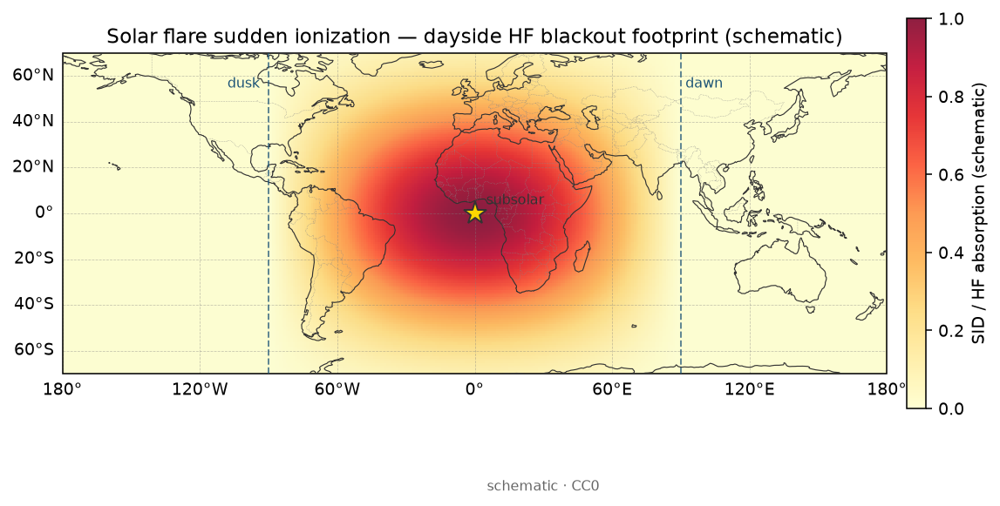

# 14 · 空间天气复盘课：如何做一个可复盘的电离层扰动案例

> **课堂定位**：接 [03 GIM](./03-gim-ionex.md)、[05 闪烁/ROTI](./05-scintillation-roti.md)、[16 一日实战](./16-practice-one-day-tec.md)。你已会读一张 TEC 图、认一个 ROTI 热点；本课回答：**如何选事件、选数据、写因果、避假相关**，把「看过某次暴的论文」变成「换事件也能独立复盘」。
> 路线固定为四段：
> **机制 → 公式拆解（逐步推导）→ 观测签名 → 分析步骤**。
> 你会听到「探案卷宗 / 厨房雾气 / 红绿灯 / 对照组实验 / 假相关陷阱」类比；每条后面立刻配符号、单位与可追问的机制。
>
> **写给谁**：第一次做空间天气/电离层案例报告就堆图、抄幅度、不敢写「不确定」的人；以及想把 TEC、地磁指数、ROTI 钉在同一时间线上的人。
>
> **学完交付**：口述太阳/磁层 → 电离层响应的教学级因果链；逐步写出 ΔTEC 与 ROTI 阈值/对照窗；一眼区分真暴响 vs 数据缺口/产品跳变/本地干扰；按事件选取清单与时间线模板交出半页诚实结论；说出 2–3 条误解与测验要点。
>
> **项目名**均来自根目录 [`PROJECTS.json`](../../PROJECTS.json) 的 `name` 字段。
> **精通标志**：换一个新事件，能按清单独立出图并写半页结论（**不编造数字**）。

---

## 0. 开场：三个真实翻车场景

请先合上笔记本，想三件事：

1. **抄了「2015 年某磁暴 TEC 升高 12.37%」进报告**：审稿人/助教问：你自己的差分图色标读得出这个百分数吗？来源是哪家 GIM、何种对照日？答不上来 = 本课要避免的第一失败模式。
2. **把 ROTI 高峰直接写成「闪烁导致 TEC 暴增」**：ROTI 回答「变化率毛不毛」；VTEC 差分回答「平均雾厚相对对照怎么变」。二者可以同向，也可以不同步——混因果就是假相关。
3. **差分图画得很漂亮，却忘了对照日其实 Kp=5**：对照组脏了，后面所有「暴扰形态」解释都被污染。本课把「选对照」抬到与「选事件」同级。

**本课地图（请对照目录）：**

| 段落 | 你在学什么 | 类比 |
|---|---|---|
| §1 词表 | 先认名字 | 进厨房前认厨具 |
| §2–6 **机制** | 驱动链；案例要回答的问题类型；与现象课接口 | 探案：谁推动了雾重分布 |
| §7–11 **公式拆解** | ΔTEC、ROTI 阈值、Dst/Kp 对照窗：符号表→逐步→小例 | 把菜谱拆成一步一步 |
| §12–14 **观测签名** | 真暴响 vs 缺口/跳变/本地干扰 | 监控录像怎么认人 |
| §15–22 **分析步骤** | 选取清单、时间线、结论禁忌、误解、测验、作业 | 值班清单与过关 |

配图均在 [`images/`](./images/)，版权见 [`images/SOURCES.md`](./images/SOURCES.md)。

**边界**：不重讲 GIM 读写入门（回 [03](./03-gim-ionex.md)）；不把现象课 [19–23](./19-phenomena-overview.md) 回灌成文字墙——需要深机制时**链过去**；不改 [`docs/software/`](../software/) 软件卡。**不画新流程图**——决策用口述树与勾选表，配图用已有自制图。

---

## 1. 词表（先扫一遍，主讲后再回看）

### 1.1 雾厚与地图

| 术语 | 人话直觉 | 为什么关心它 |
|---|---|---|
| **TEC** | 卫星信号穿过「电子雾」的厚度积分 | 雾厚会让测距变慢、定位漂 |
| **VTEC** | 把斜着穿雾的厚度，折算成「竖直往下看」的厚度 | GIM 地图上画的通常是它 |
| **STEC** | 某一颗星到接收机那条斜线的真实雾厚 | 单站估计先得到它 |
| **TECU** | 雾厚的单位（约 $10^{16}$ 电子/m²） | 图上色标必须写它 |
| **GIM** | 全球电离层地图（格网或球谐） | 复盘时最常用的「公开底图」 |
| **IONEX** | GIM 的一种常用交换文件格式 | 下载后用读写库打开 |
| **ΔTEC / ΔVTEC** | 扰动相对对照的雾厚差 | 案例报告的「主证据图」 |

### 1.2 驱动与指数

| 术语 | 人话直觉 | 为什么关心它 |
|---|---|---|
| **磁暴** | 地磁场被太阳风「抽打」后剧烈抖动 | TEC 会跟着大范围变 |
| **耀斑** | 太阳突然喷一束强 X 射线/紫外 | 日侧电离可在分钟–小时尺度跳 |
| **CME / 高速流** | 日冕物质抛射 / 高速太阳风 | 常对应不同时间尺度的扰动剧本 |
| **IMF Bz** | 行星际磁场南北分量 | Bz 南向时常更容易「接上」磁层 |
| **SYM-H / Dst** | 量地磁暴强弱的指数（环电流） | 时间轴上标「主相/恢复相」 |
| **Kp** | 三小时地磁活动等级（0–9 粗档） | 挑安静日/扰动日很快 |

### 1.3 不规则性与产品诚实

| 术语 | 人话直觉 | 为什么关心它 |
|---|---|---|
| **ROTI** | TEC 变化率指数，看「抖不抖」 | 不规则性，不是平均雾厚 |
| **S4** | 信号幅度闪烁指数 | 真正的闪烁强弱感；≠ ROTI |
| **产品不确定性** | 同一天不同分析中心 GIM 本来就差几 TECU | 别把产品差当成物理发现 |
| **假相关** | 两曲线同涨同跌，但没有因果链 | 案例写作第一杀手 |

**厨房雾气类比（贯穿本课）**：

- VTEC ≈ 你站在灶台正上方，量「竖直方向有多厚的雾」。
- STEC ≈ 你斜着从窗口往灶台看，路径更长，雾显得更厚。
- GIM ≈ 气象局每天发的「全国雾厚填色图」。
- ROTI ≈ 「雾是不是在剧烈翻滚」——平均雾厚可能不变，但翻滚会让信号乱跳。
- 磁暴 ≈ 外面突然刮大风，整栋楼的通风系统被抽乱，雾的分布跟着变。
- 对照日 ≈ 科学实验里的「对照组」——减错对照 = 整场实验报废。

**纪律**：禁止无对照就声称「暴扰增强」；禁止把分析中心差写成新物理；禁止用 ROTI 冒充 S4；禁止从论文抄自己图上看不见的精确百分数。

---

# 第一段 · 机制

> 目标：用因果讲清——**太阳/磁层如何驱动电离层响应**、案例报告该回答哪些问题类型、本课与现象课 [19–23](./19-phenomena-overview.md) 如何分工。完整公式留给第二段。

---

## 2. 案例要回答的问题类型（先选题，再堆图）

做复盘不是「把所有图贴满幻灯片」。先选你要回答的**问题类型**：

| 问题类型 | 一句话目标 | 最低证据集 | 常链现象课 |
|---|---|---|---|
| **形态题** | 这次暴在【区域】是增强、耗空，还是先增后耗？ | storm−quiet 差分图 + 色标 TECU | [20](./20-storm-tec-analysis.md) |
| **时间题** | 相对 SYM-H 谷值，TEC 主要响应领先还是滞后？ | 同轴时间序列 | [20](./20-storm-tec-analysis.md) |
| **结构题** | 赤道异常双峰是加强、抑制还是偏移？ | 差分 + EIA 形态对照 | [21](./21-equatorial-anomaly-bubbles.md) |
| **不规则性题** | 「抖」与「平均雾厚」是否同步？ | VTEC 差分 + ROTI（分面板） | [05](./05-scintillation-roti.md)、[21](./21-equatorial-anomaly-bubbles.md) |
| **驱动题** | 耀斑日侧跳变 vs CME/磁暴长窗，谁更像主因？ | 耀斑时刻 + 地磁窗 + TEC 响应尺度 | [23](./23-flare-eclipse-special.md) |
| **产品诚实题** | 换一家分析中心，主瓣还在吗？ | 双中心差分 / RMSE | [18](./18-lab-compare-gims.md) |

**类比**：探案卷宗首页要写清「本案要证明什么」——是「谁进了现场」，还是「凶器从哪来」。证据清单跟着问题走，而不是反过来。

口诀：**先问题，后数据；先对照，后差分；先形态，后幅度；先诚实，后漂亮。**

---

## 3. 驱动链（教学级）：太阳 / 磁层 → 电离层响应

真实事件常**多条链并行**，所以地图上可以「日侧正、夜侧负」同时成立。教学上先记住四条主干（细节深读链现象课，本课不回灌成长文）：

### 链 A — CME / 磁暴主通道（小时–天）

太阳爆发抛出 CME → 行星际磁场与太阳风撞击磁层 → IMF Bz 南向时常利于能量注入 → 环电流增强 → **SYM-H / Dst 下跌（主相）** → 高纬电场、风场、成分变化传到中低纬 → TEC 大尺度重分布（正相/负相可分区）。


> **图注（为什么放这里）**
> - **看什么**：Kp 抬高与 SYM-H/Dst 主相谷如何钉出复盘时间窗。
> - **为什么**：机制段先建立「驱动时钟」；没有时钟，后面的 TEC 峰谷无法对齐因果。
> - **别误判**：指数窗只标定「何时吵」；不代替 TEC 差分图本身。
> 图源：自制 CC0 示意。


> **图注（为什么）**
> - **机制**：初相 / 主相 / 恢复相时间尺度不同；正相偏快，负相常拖恢复相。
> - **观测签名**：上板增强鼓包、下板延迟耗空——可并存于不同纬带。
> - **分析用法**：与 SYM-H 谷值竖线对齐，写清「相对谷值超前/滞后几小时」。
> 图源：自制示意（非实测）。

更深的 PPEF / DDEF / 成分鼓包分工见 [20](./20-storm-tec-analysis.md)——本课只要求你能说：「主相附近日侧低纬快速正相，先怀疑穿透电场类故事；恢复相中纬耗空，先怀疑成分/扰动发电机类故事。」

### 链 B — 耀斑快通道（分钟–数小时，偏日侧）

太阳耀斑 → 日侧 X 射线/EUV 突增 → 低层电离突然加强 → 日侧 TEC 可出现**尖锐抬升**。时间尺度与磁暴主相不同：耀斑像「闪电照亮厨房」，磁暴像「整夜刮风改通风」。


> **图注（为什么）**
> - **看什么**：日侧突然电离的时间尖峰形态。
> - **为什么**：案例若同时有大耀斑与磁暴，必须先分清「哪一段 TEC 跳变跟耀斑时刻锁死」。
> - **别误判**：示意 ≠ 某次事件实测；深读见 [23](./23-flare-eclipse-special.md)。
> 图源：自制示意。



> **图注（为什么）**
> - **看什么**：日侧相对海岸的突然抬升落点。
> - **为什么**：地理落点帮助你排除「全球产品跳变」——真耀斑响应偏日侧。
> 图源：自制示意场 + Natural Earth 海岸线（非实测）。

### 链 C — 赤道异常 / 喷泉变形（结构题常用）

安静日已有喷泉与双峰；暴时可加强、抑制或极移。案例若声称「EIA 变形」，差分图上应能指出双峰相对安静日的位移或强度变化——否则只是形容词。


> **图注（为什么）**
> - **机制**：东向电场 → E×B 上涌 → 双峰。
> - **为什么**：结构题的「因果骨架」；暴时电场调制会改双峰。
> - **别误判**：一张未差分的双峰图 ≠ 已证明暴扰变形。
> 图源：自制示意。


> **图注（为什么两张一起看）**
> - **看什么**：双峰相对磁赤道/海岸的落点；暴日差分是否「峰加强或极移」。
> - **为什么**：形态题与结构题的视觉锚点；深读 [21](./21-equatorial-anomaly-bubbles.md)。
> 图源：自制示意场 + Natural Earth（非实测）。

### 链 D — 高纬沉降与极光卵（高纬扇区旁注）

暴时极光卵可外扩；高纬 TEC / 闪烁故事与中低纬主瓣机制不同。GIM 在高纬常更滑、站更疏——结论置信度要降一档。


> **图注（为什么）**
> - **看什么**：高纬卵状亮环相对海岸的落点与宽度（暴时可外扩）。
> - **为什么**：提醒你「高纬响应」不要硬套低纬 PPEF 话术。
> - **别误判**：示意卵 ≠ 瞬时实测；勿与中低纬 ΔTEC 主瓣混写成同一机制。
> 图源：自制示意场 + Natural Earth（非实测）。

**红绿灯类比（贯穿时间对齐）**：Bz 南向像「绿灯放行能量」，SYM-H 下跌像「路口开始堵」，TEC 变化像「街区雾浓度重分布」——三者不同步不代表你画错，可能是传播与局域动力。

---

## 4. 安静日 vs 扰动日：你到底在比什么

### 4.1 安静日长什么样（直觉）

安静日的 GIM 通常能看到：

- 赤道附近两条「香蕉形」高 TEC 带（赤道异常双峰）随地方时东移；
- 中纬日侧缓升、夜侧缓降；
- 高纬冬季夜侧较低（还受季节影响）。

若你的「安静日」已经乱七八糟、Kp 不低，差分会把「假安静」减进去——等于探案时找错了对照组。

### 4.2 两种对照（含义不同，必须写清）

| 对照类型 | 像什么 | 适合回答 | 陷阱 |
|---|---|---|---|
| 事件前安静日 (Q) | 同一周「没刮风」的对照天 | 短期暴扰相对背景的变化 | 安静日其实不静；或暴前已有缓变 |
| ~27 天前 (R) | 太阳「转一圈」后的相似日 | 削弱季节/地方时气候背景 | 太阳活动本身在变，不是完美双胞胎 |

**强制动作**：在差分图标题写 `Storm − Quiet(Q)` 或 `Storm − Rot27(R)`，让读者一眼知道你在减什么。

### 4.3 扰动日常见叙事（教学用，不是定律）

| 现象 | 时间尺度直觉 | 你优先看的产品 |
|---|---|---|
| 耀斑突然电离 | 分钟–数小时，偏日侧 | 日侧 TEC；链 [23](./23-flare-eclipse-special.md) |
| CME/磁暴 | 更长，有初相/主相/恢复相 | GIM 差分 + SYM-H/Bz；链 [20](./20-storm-tec-analysis.md) |
| 中纬暴扰增强/耗空 | 小时–天 | 区域平均 TEC 时间序列 |
| 低纬等离子体气泡/闪烁 | 夜侧，短时剧烈 | ROTI / S4，不是只看 VTEC 均值；链 [21](./21-equatorial-anomaly-bubbles.md) |
| 高纬粒子沉降相关 | 暴时高纬 | 高纬扇区 + 闪烁产品；GIM 可能过滑 |

**重要纠错**：磁暴时「全球 TEC 一定升高」是谣言级简化。有的纬度增强，有的耗空；有的先增后耗。你的差分图才是法官，传说不是。

---

## 5. 产品不确定性：先承认「地图会吵架」

IGS 分析中心（如 CODE、JPL、CAS、UPC、WHU 等，具体文件以 `CDDIS-IONEX` 当日名为准）各自有站网、球谐/格网、DCB、平滑与填补策略。所以：**分析中心之间差数 TECU，常常是「正常产品噪声」，不是你发现了新物理。**

推荐诚实句式：

> 「在 CODE 与 JPL 最终 GIM 上，该扇区暴扰差分主瓣方向一致；两中心绝对差的 RMSE 约 X TECU。因此我们只声称形态与符号，不声称精确到 1 TECU 的幅度。」

禁止句式：

> 「TEC 精确升高了 12.37%」（图上读不出这种精度时）。

量化实验与 [18](./18-lab-compare-gims.md) 联动：同日两家 IONEX → 同网格 → A−B → Bias / RMSE / $P_5$。

---

## 6. 机制收束：案例因果写作三原则

1. **驱动先于响应**：先钉 Bz / SYM-H / 耀斑时刻，再解释 TEC。  
2. **对照先于幅度**：没有合格对照，不谈「升高了多少」。  
3. **分区先于全球**：先写清纬带、日/夜侧、地方时，再谈「这场暴」。


> **图注（为什么）**
> - **看什么**：storm−quiet 的红/蓝斑相对海岸落在哪一纬带、哪一侧。
> - **为什么**：机制段结束时给你「主证据图」的视觉模板。
> - **别误判**：教学示意场 ≠ 某次暴的实测差分；空洞/平滑区勿当新物理。
> 图源：自制示意场 + Natural Earth（非实测）。

---

# 第二段 · 公式拆解（逐步推导）

> 目标：选案例**最常用**的两三个量——**ΔVTEC**、**ROTI 阈值直觉**、**Dst/Kp 对照窗口**——每个解剖台统一：**符号表 → 逐步推导（每步人话）→ 小数值例**。单位用 Unicode（TECU、nT、TECU/min）。中文叙述不进 `$...$`。

---

## 7. 公式路线图（先看全图，再逐步拆）

| 解剖台 | 核心问题 | 你带走的式子直觉 |
|---|---|---|
| A ΔVTEC | 扰动相对对照「雾厚变了多少」 | $\Delta\mathrm{VTEC}=\mathrm{VTEC}_{\mathrm{storm}}-\mathrm{VTEC}_{\mathrm{ref}}$ |
| B ROTI 阈值 | 「抖」过线没有；窗与单位生死线 | 窗内 ROT 标准差；阈值分纬声明 |
| C Dst/Kp 对照窗 | 时间轴上哪一段叫主相/扰动窗 | 用谷值与 Kp 档钉窗，再与 TEC 对齐 |

读法纪律：公式只服务案例证据；**幅度必须从图上读，不得从记忆里编。**

---

## 8. 解剖台 A：ΔVTEC（符号表 → 逐步 → 小例）

### 8.1 符号表

| 符号 | 含义 | 单位 / 备注 |
|---|---|---|
| $\lambda,\varphi$ | 经度、纬度 | ° |
| $t$ | 扰动日时刻（UTC 或地方时，须声明） | |
| $t_{\mathrm{matched}}$ | 对照日匹配时刻 | 同时刻 UTC 或同地方时 |
| $\mathrm{VTEC}_{\mathrm{storm}}$ | 扰动日垂直 TEC | TECU |
| $\mathrm{VTEC}_{\mathrm{ref}}$ | 对照日垂直 TEC（Q 或 R） | TECU |
| $\Delta\mathrm{VTEC}$ | 暴扰差分 | TECU；正=增强，负=耗空（相对对照） |

### 8.2 逐步推导（每步人话）

1. **选定分析中心与产品代次**：同一中心、同一代次（最终优先）下载 storm 与 ref。  
2. **对齐网格与时间**：插到同一经纬网；选「同时刻 UTC」或「同地方时」之一，写进标题。  
3. **逐点相减**：

$$
\Delta\mathrm{VTEC}(\lambda,\varphi,t)
=\mathrm{VTEC}_{\mathrm{storm}}(\lambda,\varphi,t)
-\mathrm{VTEC}_{\mathrm{ref}}(\lambda,\varphi,t_{\mathrm{matched}}).
$$

4. **掩膜无效点**：任一端缺测/哨兵 → 该点不进统计。  
5. **读形态再读幅度**：先回答「红蓝落在哪」，再从色标读「大约几 TECU」——禁止发明百分数。

**类比**：差分 = 「今天厨房雾厚」减去「对照天雾厚」。减错对照天 = 探案减错指纹库。

### 8.3 小数值例（请手算一遍）

某格点上，最终 GIM 读数：

- 扰动日：$42\,\mathrm{TECU}$
- 安静对照日同时刻：$35\,\mathrm{TECU}$

则

$$
\Delta\mathrm{VTEC}=42-35=+7\,\mathrm{TECU}.
$$

读法：「相对该对照，该点增强约 7 TECU」。不要写成「升高 20%」——除非你明确声明相对量定义，且色标与对照都支持。

若换一家中心同点得 storm $45$、ref $39$，则 $\Delta=+6\,\mathrm{TECU}$。两中心差分同号、量级接近 → 形态结论置信度升；若一家 $+7$、另一家 $-3$ → **先查产品，再谈物理**。


> **图注（为什么）**
> - **看什么**：主相/恢复相 ΔTEC 空间分区是否换符号、换纬带。
> - **为什么**：解剖台 A 的「时间切片」用法——同一公式，不同相位窗口。
> - **别误判**：双联示意是读图剧本，不是一次事件的判决书。
> 图源：自制示意场 + Natural Earth（非实测）。


> **图注（为什么）**
> - **机制**：相对安静基线，主相可先正后负（或分区反号），残差才是「暴的签名」。
> - **分析用法**：先画 storm−quiet，再贴机制标签；禁止只贴一张未差分图。
> 图源：自制示意。

---

## 9. 解剖台 B：ROTI 与阈值（符号表 → 逐步 → 小例）

> ROTI 在案例里的角色：**不规则性活动代理**，与 ΔVTEC **分面板**对照。完整推导与采样生死线见 [05](./05-scintillation-roti.md)；此处只钉「案例怎么用阈值」。

### 9.1 符号表

| 符号 | 含义 | 单位 / 备注 |
|---|---|---|
| $\mathrm{STEC}_k$ | 第 $k$ 历元斜 TEC | TECU |
| $\Delta t$ | 历元间隔 | min 或 s；与 ROT 定义一致 |
| $\mathrm{ROT}_k$ | TEC 变化率 | 常 $\mathrm{TECU/min}$ |
| $W$ | 统计窗口 | 常见 5 min；必须声明 |
| $\mathrm{ROTI}$ | 窗内 ROT 的标准差（常见定义） | 与 ROT 同单位族 |
| $\mathrm{ROTI}_{\mathrm{thr}}$ | 案例自定/文献阈值 | 须分纬、分地方时声明；禁止生搬 |

### 9.2 逐步（案例用法）

1. 得去周跳、leveling 后的 STEC（回 [02](./02-gnss-dualfreq-tec.md)、[05](./05-scintillation-roti.md)）。  
2. 算变化率：

$$
\mathrm{ROT}_k=\frac{\mathrm{STEC}_{k}-\mathrm{STEC}_{k-1}}{\Delta t}.
$$

3. 在窗 $W$ 内取标准差得 $\mathrm{ROTI}(t)$。  
4. **阈值只作「活动抬升」标记**：例如教学上可设「本区安静背景中位数的若干倍」或引用明确文献阈值，但**必须写清来源与适用纬带**。  
5. 与 ΔVTEC **分面板**画：问「抖与平均雾厚是否同步」——不同步常常是正常物理。

### 9.3 小数值例（安静窗 vs 扰动窗）

设单位为 $\mathrm{TECU/min}$，某 5 点窗：

- 安静：$\{0.1,\ 0.0,\ -0.1,\ 0.05,\ 0.0\}$ → 样本标准差约 $0.07\,\mathrm{TECU/min}$ 档。  
- 扰动：$\{0.8,\ -0.6,\ 1.0,\ -0.9,\ 0.7\}$ → 标准差约 $0.9\,\mathrm{TECU/min}$ 档。

若你的教学阈值取 $0.5\,\mathrm{TECU/min}$（**仅作本小例玩具，非全球标准**），则安静未过线、扰动过线。  
**翻车演示**：若误把 $\Delta t$ 从 $0.5\,\mathrm{min}$ 当成 $1\,\mathrm{s}$，ROT 整体放大约 30 倍 → 全日「假闪烁」。这是观测签名里「单位/窗错」的机制指纹。

工具举例：`igs-roti`、`Okoh-MATLAB-ROT-ROTI`、`Ionospheric-TEC-ROTI-Interactives`。


> **图注（为什么）**
> - **成功**：扰动段相对安静段抬升，时段与地方时/纬度叙事一致。  
> - **失败**：全日均匀抬高一个数量级 → 先查 $\Delta t$ 与窗。  
> 图源：自制 CC0。


> **图注（为什么）**
> - **看什么**：日落后赤道/低纬热点带，而非单站孤立尖刺。  
> - **为什么**：案例里「空间签名」帮助区分真不规则性活动与本地多径。  
> 图源：自制示意场 + Natural Earth。

**高速公路类比**：VTEC = 车道平均车密度；ROTI = 车流是否突然急刹加塞。密度高不一定乱；乱的时候密度也可能不高。

---

## 10. 解剖台 C：Dst / Kp 对照窗口（符号表 → 逐步 → 小例）

### 10.1 符号表

| 符号 / 量 | 含义 | 单位 / 备注 |
|---|---|---|
| $\mathrm{Dst}$ / $\mathrm{SYM\text{-}H}$ | 环电流强度指数 | nT；SYM-H 时间分辨率更高，教学常优先 |
| $t_{\mathrm{min}}$ | 主相谷值时刻 | UTC；钉在笔记第一行 |
| $\mathrm{Kp}$ | 三小时地磁活动档 | 0–9；粗筛安静/扰动 |
| $W_{\mathrm{main}}$ | 主相分析窗 | 常取谷值前后数小时（自定并声明） |
| $W_{\mathrm{rec}}$ | 恢复相分析窗 | 谷值之后更长窗；与主相分开报 |

### 10.2 逐步（钉窗礼仪）

1. 从 `GFZ-Kp-Index` / `NOAA-SWPC` / OMNI 类来源下载指数（写链接进笔记）。  
2. 找到 SYM-H（或 Dst）**最低值**及其时刻 $t_{\mathrm{min}}$。  
3. 用 Kp 峰值档位做「这场有多吵」的粗标签（例如峰值 Kp≥5 才进入「中等以上暴」教学档——具体阈值你自定并声明）。  
4. 定义：

$$
W_{\mathrm{main}}=[t_{\mathrm{min}}-\Delta t_{1},\ t_{\mathrm{min}}+\Delta t_{2}],
$$

其中 $\Delta t_{1},\Delta t_{2}$ 用小时计，写进方法；恢复相 $W_{\mathrm{rec}}$ 另开，**禁止把主相与恢复相糊成一个「暴日平均」**。  
5. 只在窗内对区域平均 TEC / ΔVTEC 做统计或出图切片。

### 10.3 小数值例（假但真实量级）

假设 SYM-H 最低 $= -120\,\mathrm{nT}$，出现在 $15:00\,\mathrm{UTC}$。你取

$$
\Delta t_{1}=3\,\mathrm{h},\quad \Delta t_{2}=3\,\mathrm{h}
\Rightarrow W_{\mathrm{main}}=[12:00,\ 18:00]\,\mathrm{UTC}.
$$

恢复相另取 $[18:00,\ 06:00^{+1\mathrm{d}}]$。  
区域平均 ΔVTEC：主相窗均值 $+8\,\mathrm{TECU}$，恢复相窗均值 $-5\,\mathrm{TECU}$。  
合法结论：「该扇区相对对照，主相窗偏正、恢复相窗偏负（基于本图）」。  
非法结论：「全球 TEC 因磁暴升高 8 TECU」——你既没有全球积分，也没有把恢复相算进去。

把 Kp、SYM-H 与区域 TEC 画在同一时间轴时，问三个侦探问题：

1. **谁先动？**（太阳风/Bz → 地磁指数 → TEC）  
2. **主相谷值附近 TEC 是升还是降？**（不同纬度可相反）  
3. **恢复相是否出现长时间耗空？**

---

## 11. 解剖台小结：案例里「对单位」的三行

| 量 | 常见单位 | 一对就错的坑 |
|---|---|---|
| ΔVTEC | TECU | 把中心差当成暴扰；百分数无定义 |
| ROTI | TECU/min（视实现） | $\Delta t$ 用秒还是分钟；窗长与文献不一致 |
| SYM-H / Dst | nT | 主相/恢复相糊成一日平均；谷值时刻配错时区 |

---

# 第三段 · 观测签名

> 目标：在图上**一眼区分**真暴响与数据缺口、产品跳变、本地干扰。会认假阳性，比会堆公式更救命。

---

## 12. 四种长相（必背）

### 12.1 真暴响（你想要的）

- **空间**：ΔVTEC 红/蓝主瓣落在合理纬带与日/夜侧；换一家中心主瓣大致还在。  
- **时间**：相对 SYM-H 谷或耀斑峰值，延迟在「小时级」叙事内（耀斑可更短）。  
- **多证据**：驱动指数、TEC 差分、（可选）ROTI 分面板同故事或明确写清不同步原因。

### 12.2 数据缺口假装成耗空

- **长相**：大片规则矩形/条带「蓝到见底」，边界像刀切；时间上突然整块消失又出现。  
- **机制**：站网空洞、文件缺历元、掩膜错误、插值未排除无效值。  
- **动作**：查 IONEX 有效标志与原始覆盖；换中心对照；缺口区**禁止解释为负相物理**。

### 12.3 产品跳变 / 分析中心伪影

- **长相**：差分主瓣随中心「搬家」；或全日平行抬升一整块（像亮度旋钮）。  
- **机制**：DCB/基准、平滑强度、填补策略、快速产品 vs 最终产品。  
- **动作**：做 [18](./18-lab-compare-gims.md) 式双中心检验；结论降级为「形态待定」。

### 12.4 本地干扰假装成闪烁/暴扰

- **长相**：单站 ROTI/TEC 尖刺，邻站安静；或低高度角时段周期性尖峰。  
- **机制**：多径、周跳未修、时钟飞跳、近场遮挡。  
- **动作**：抬截止高度角；多站一致性；尖刺时段对照天空图/环境日志。


> **图注（为什么出现在签名段）**
> - **真暴响指纹**：主相附近日侧低纬快速正相，常与穿透电场故事同向（深读 [20](./20-storm-tec-analysis.md)）。  
> - **假阳性**：只有一张全球平滑「微红」、无时间对齐、无双中心 → 不够贴 PPEF 标签。  
> 图源：自制示意。

---

## 13. 一眼对照表（贴显示器旁）

| 你看见 | 更像 | 不像 | 下一步 |
|---|---|---|---|
| 红蓝分区随纬带/地方时迁移，双中心同向 | 真暴响 | 随机噪声 | 写形态 + 对齐 SYM-H |
| 刀切边界大蓝块、邻帧恢复 | 数据缺口 | 负相物理 | 查覆盖与掩膜 |
| 换中心主瓣消失或反号 | 产品差 | 稳健物理发现 | 降置信度；报 RMSE |
| 单站尖刺、邻站无 | 本地干扰 | 区域闪烁 | 多站 + 截止角 |
| ROTI↑ 且 VTEC 差分平 | 不规则性≠平均厚度 | 「算错了」 | 分面板诚实报告 |
| TEC 尖峰锁死耀斑峰值、偏日侧 | 耀斑通道 | 慢磁暴主相 | 链 [23](./23-flare-eclipse-special.md) 分窗 |


> **图注（为什么）**
> - **看什么**：带状热点 vs 孤立点。  
> - **为什么**：签名段强调「空间一致性」——真活动少见「只有我这一台接收机宇宙特供」。  
> 图源：自制示意场 + Natural Earth。

---

## 14. ROTI vs VTEC：平均雾厚 ≠ 翻滚剧烈度（签名级提醒）

- **VTEC / ΔVTEC**：某一时刻「有多厚 / 相对对照变了多少」。  
- **ROTI**：TEC 时间变化有多「毛」。  

暴时两者常常不同步，可能因为：大尺度重组与小尺度不规则性触发条件不同；GIM 时间分辨率粗而 ROTI 来自高采样站数据；你的研究区夜侧低纬 ROTI 爆表而平均 VTEC 只是缓变。

结论里强制写一句：「ROTI 与 VTEC 是否同步」。不同步时，优先相信「它们回答不同问题」，而不是「一定算错」。

---

# 第四段 · 分析步骤

> 目标：给你可打印的选取清单、时间线模板、结论禁忌、误解、测验与作业。跟做一遍 = 一次合格复盘。

---

## 15. 事件选取清单（开场 20 分钟，打印可贴墙）

### 15.1 事件钉钉

- [ ] 事件起止日期（UTC）写在笔记第一行  
- [ ] 事件类型勾选：耀斑 / CME 驱动磁暴 / 高速流 / 复合事件 / 不确定  
- [ ] 主相大致时段（看 SYM-H 或 Dst 谷值附近）  
- [ ] 最大地磁活动参考：Kp 峰值档位、SYM-H 最低值（写「来源链接」，勿凭记忆）  
- [ ] 若有耀斑：等级与峰值时刻（本课主线仍是 GNSS TEC，耀斑作驱动旁注；深读 [23](./23-flare-eclipse-special.md)）  
- [ ] 研究区域预先声明：全球 / 中国区 / 低纬 / 高纬 / 某测站周边  
- [ ] **科学问题一句话**（选自 §2 问题类型表）

### 15.2 对照日选择（必须写清「用了哪种」）

- [ ] **方案 Q（Quiet day）**：事件前一个真正安静日（Kp 低、无大耀斑）  
- [ ] **或方案 R（Rotation）**：约 27 天前（太阳自转周近似对照）  
- [ ] 笔记里用一句话说明：为何选 Q 或 R，以及该对照**不能证明什么**  
- [ ] 对照日与扰动日的季节/地方时结构是否离谱（跨半年对照要额外小心）

### 15.3 数据与工具（只用本仓库真实条目名）

- [ ] GIM：从 `CDDIS-IONEX` 下载至少一家；推荐再备 `JPL-IONEX-Rapid` 或 `ROB-IONEX-Products` / `GFZ-Global-Ionosphere-Maps` / `WHU-IGS-Ionosphere-AC` 作交叉  
- [ ] 读写：`ionex` / `ionex-rs` / `ionex_reader` / `ionex-analyzer`（任选其一先跑通）  
- [ ] 地磁/空间天气时间线：`GFZ-Kp-Index`、`NOAA-SWPC`、`NOAA-SWPC-Planetary-K`；太阳风可选 `NASA-OMNIWeb`  
- [ ] 近实时/业务 TEC 对照（可选）：`DLR-IMPC`、`DLR-IMPC-Products`、`ESA-TIO-NRT-TEC`、`NOAA-SWPC-GloTEC`  
- [ ] ROTI（可选）：`igs-roti`、`Okoh-MATLAB-ROT-ROTI`、`Ionospheric-TEC-ROTI-Interactives`  
- [ ] 注册与下载门槛已读 [`docs/data-access.md`](../data-access.md)

### 15.4 出图最低集

- [ ] 安静日某时刻全球或区域 VTEC 填色图（色标 TECU，写分析中心与文件名）  
- [ ] 扰动日同地方时/同时刻 VTEC 图  
- [ ] **差分图** = 扰动 − 对照（同分析中心、同格网插值；标题含 Q 或 R）  
- [ ] SYM-H（或 Dst）+ IMF Bz（若有）与区域平均 TEC 的同轴时间序列  
- [ ] （加分）两家分析中心同日差分直方图或 RMSE 表  
- [ ] （加分）同区域 ROTI 时间序列或 ROTI 地图，与 VTEC 差分**分面板**对照  

---

## 16. 时间线模板（直接抄结构）

```
事件：YYYY-MM-DD ~ YYYY-MM-DD (UTC)
类型：CME/磁暴（主相约 HH:MM） / 耀斑（峰值 HH:MM） / 复合
地磁：Kp 峰值 = ?（来源：GFZ-Kp-Index / NOAA-SWPC-Planetary-K）
SYM-H 最低 ≈ ? nT @ HH:MM（来源：……）
对照：Quiet(Q)=YYYY-MM-DD 或 Rot27(R)=YYYY-MM-DD；一句话局限：……
研究区：例如 20°N–50°N, 70°E–140°E
科学问题一句话：……
产品：分析中心 / 代次 / 文件名
主相窗 W_main：……
恢复相窗 W_rec：……
```

**类比**：像写探案卷宗首页——先写清「案发时间与现场」，后面所有图都挂在这张封面上。

下载优先级提醒：

1. 打开 [`lists/10-gnss-datasets.md`](../../lists/10-gnss-datasets.md)，定位 `CDDIS-IONEX`。  
2. 按 [`docs/data-access.md`](../data-access.md) 完成授权（若需要）。  
3. 教学复盘优先**最终或事后分析**产品；快速/近实时必须标明代次。  
4. 地磁指数与太阳风按清单勾选下载。

---

## 17. 结论模板与禁忌

### 17.1 半页结论模板（抄结构，填自己的观察）

```
1) 形态：本次在【区域】表现为【增强/耗空/先增后耗】，主要出现在【日侧/夜侧/地方时 XX】。
2) 时间：相对 SYM-H 谷值，TEC 主要响应大约【领先/滞后约 N 小时】（仅基于本图，不外推）。
3) 结构：与赤道异常的关系是【双峰加强/抑制/偏移 / 未评估】。
4) 产品：同日两家 GIM 差约【X TECU 量级】；差分主瓣在换中心后【仍在/减弱/消失】，
   因此结论置信度为【高/中/低】。
5) ROTI（若有）：不规则性增强【与/不与】VTEC 平均变化同步；说明「抖」与「平均雾厚」是不同故事。
6) 局限：未使用测高仪/掩星交叉；GIM 平滑可能抹掉小于格网尺度的结构；对照为 Q/R 的局限是……。
```

### 17.2 结论禁忌（违反任一 = 退回重写）

1. 出现自己图上读不出的精确百分数或论文抄来的幅度。  
2. 无对照日类型声明（Q 或 R）。  
3. 把分析中心差直接写成暴扰物理。  
4. 用 ROTI 数值冒充 S4，或宣称「已证明闪烁导致 TEC 暴增」却无因果链。  
5. 主相与恢复相糊成「暴日平均」一个数。  
6. UTC / 地方时搞混导致赤道异常「东边升起」讲反。  
7. 下载了预报 IONEX 却当最终产品写进结论。

### 17.3 结论写作门槛（出门前再勾）

- [ ] 全球一致还是区域性？日侧还是夜侧？与赤道异常关系？  
- [ ] 增强/耗空谁先出现？相对 SYM-H 谷值有无延迟？  
- [ ] 是否可能来自 GIM 平滑、数据空洞、分析中心策略差？  
- [ ] 若看了 ROTI：是否与 VTEC 同步？  
- [ ] 全文没有「论文里抄来的、自己图上看不见的」精确百分数  

---

## 18. 常见误解专节（请打假）

**误解 1：「磁暴时全球 TEC 一定升高。」**  
真相：正/负相可分区并存；有的先增后耗。差分图分区写，不写全球同号口号。缓解：强制 storm−quiet + 纬带分箱。

**误解 2：「两家 GIM 差 6 TECU = 我发现赤道异常增强 6 TECU。」**  
真相：先区分「中心间产品差」与「暴扰差分」；至少双中心一致性检查。缓解：走 [18](./18-lab-compare-gims.md) 报 Bias/RMSE，再谈物理幅度。

**误解 3：「ROTI 高就是 TEC 暴增 / 就是 S4。」**  
真相：ROTI 是变化率起伏代理；与平均厚度、与专用 S4 都不是恒等。缓解：分面板作图；摘要写「代理」二字。

（可选加长）**误解 4：「TEC 峰值早于 SYM-H 谷值 = 因果反了、图画错了。」**  
真相：响应链长度不同；局域驱动或产品平滑可造成表观超前。缓解：补 Bz/太阳风，查时间配准与平均区域定义。

---

## 19. 课堂小测验（建议 25 分钟）

**Q1.** 差分图标题写了 `Storm − Quiet`，但对照日 Kp 其实到了 5。最大风险是什么？  
<details><summary>参考答案</summary>
对照不静，差分会把「对照日自身扰动」减进去或加进去，形态解释会被污染。应重选真正安静日，或改用明确标注的 Rot27 并讨论局限。
</details>

**Q2.** 两家 GIM 在赤道差 6 TECU，你能否据此写「发现赤道异常增强 6 TECU」？  
<details><summary>参考答案</summary>
不能直接这么写。先确认这是中心间产品差还是暴扰差分；至少做双中心一致性检查，并把产品不确定性写进结论。
</details>

**Q3.** 某夜侧低纬 ROTI 很高，但 VTEC 相对安静日几乎没变。这矛盾吗？  
<details><summary>参考答案</summary>
不矛盾。ROTI 反映不规则性/梯度抖动，VTEC 反映积分电子含量平均水平。气泡等结构可以「切碎」信号而不显著改变大尺度平均厚度。
</details>

**Q4.** 复盘时优先用近实时业务 TEC，还是事后最终 IONEX？为什么？  
<details><summary>参考答案</summary>
教学与论文式复盘优先事后最终/分析产品（如 CDDIS-IONEX 中的最终系列），可重复性与站网更稳。近实时适合业务演练，但必须标明产品代次。
</details>

**Q5.** 把 SYM-H 与 TEC 画在双轴图上，发现 TEC 峰值早于 SYM-H 谷值 2 小时。是否证明「因果反了、你画错了」？  
<details><summary>参考答案</summary>
不一定。不同物理量响应链长度不同；也可能是局域驱动或产品时间平滑造成的表观超前。应补充 Bz/太阳风，并检查时间配准与平均区域定义。
</details>

**Q6.** 差分图出现刀切边界的大片深蓝，邻帧又恢复。你优先怀疑什么？  
<details><summary>参考答案</summary>
数据缺口/掩膜/插值问题，而不是稳健的负相物理。先查有效覆盖与换中心对照。
</details>

**Q7.** 写出 ΔVTEC 定义式，并指出标题里必须出现的对照标签。  
<details><summary>参考答案</summary>
$\Delta\mathrm{VTEC}=\mathrm{VTEC}_{\mathrm{storm}}-\mathrm{VTEC}_{\mathrm{ref}}$；标题须标 Quiet(Q) 或 Rot27(R)（或等价清晰写法）。
</details>

---

## 20. 作业（可交付物）

选一次公开事件，提交：

1. **两张图**：安静日 GIM；扰动−对照差分 GIM（含色标 TECU、分析中心、日期、Q/R 标签）。  
2. **一张时间轴**：至少 SYM-H（或 Kp）+ 区域平均 TEC；标出 $t_{\mathrm{min}}$ 与 $W_{\mathrm{main}}$。  
3. **十句结论**：必须覆盖「驱动 / TEC 形态 / 产品局限」三类句子；禁用禁忌句式。  
4. **工具清单**：写出你用过的 `PROJECTS.json` 中的 `name`（例如 `CDDIS-IONEX`、`ionex`、`GFZ-Kp-Index`）。  
5. （加分）ROTI 分面板一张 + 「是否与 VTEC 同步」一句。

工具路线细节见 [16](./16-practice-one-day-tec.md)；多中心量化见 [18](./18-lab-compare-gims.md)。

---

## 21. 常见翻车点（墙上贴纸）

1. **只贴暴日图、不做对照** —— 看不出「相对什么变了」。  
2. **色标任意拉伸、单位漏写** —— 审阅直接退回。  
3. **把分析中心差当成暴扰信号** —— 先做双中心检验。  
4. **只用 ROTI 或只用 VTEC 讲完整故事** —— 二者互补。  
5. **从论文抄精确幅度，自己图上没有** —— 违反本课诚实原则。  
6. **UTC / 地方时搞混** —— 赤道异常「东边升起」会讲反。  
7. **下载了预报 IONEX 却当最终产品写进结论** —— 代次必须标注。  
8. **主相/恢复相糊成一日平均** —— 符号可能抵消，故事假干净。  
9. **单站尖刺当区域闪烁** —— 先查多径与邻站。  

---

## 22. 和前后课的接口 · 出门任务

| 课 | 本课如何用它 |
|---|---|
| [03](./03-gim-ionex.md) | 读 IONEX、认格网与色标 |
| [05](./05-scintillation-roti.md) / [13](./13-scintillation-modeling.md) | ROTI/S4 定义与代理边界 |
| [16](./16-practice-one-day-tec.md) | 一日下载→出图脚本化 |
| [18](./18-lab-compare-gims.md) | 双中心 Bias/RMSE，压产品假相关 |
| [19](./19-phenomena-overview.md)–[23](./23-flare-eclipse-special.md) | 现象机制深读；**保持短页，不回灌** |
| [15](./15-from-paper-to-code.md) | 把复盘变成可重复脚本与论文对照 |
| [17](./17-roadmap-beginner-to-expert.md) | 多周进度安排 |

**出门任务（当天）**：选一个已结束的公开磁暴日，只完成 §15.1–15.2 与时间线模板前 8 行——不出图也算及格热身。  
**出门任务（本周）**：补齐最低出图集 + 半页结论，请同学按 §17.2 禁忌表找茬。

---

## 23. 课堂收束：五句带走

1. 案例 = **问题类型 + 对照 + 差分 + 驱动时钟 + 诚实局限**，不是数字收藏册。  
2. ΔVTEC 回答「雾厚相对对照怎么变」；ROTI 回答「变化率毛不毛」——分面板，勿假相关。  
3. Dst/Kp（SYM-H）钉窗；主相与恢复相分开报。  
4. 刀切蓝块、中心搬家、单站尖刺——先当假阳性查。  
5. 换事件能按清单重做，才算学会本课。

**相关软件卡（只链不改）**：[`ionex-gim`](../software/ionex-gim.md) · [`oasis-roti`](../software/oasis-roti.md) · [`ionomoni`](../software/ionomoni.md)

---

**版本说明**：本文件按「机制 → 公式拆解 → 观测签名 → 分析步骤」与 11–13 / 15 / 18 课同深度加厚；主题为可复盘空间天气/电离层扰动案例方法论。保留并扩展原复盘清单、对照日 Q/R、产品不确定性与测验作业；新增问题类型表、四条驱动链（链向 19–23 而不回灌）、ΔVTEC / ROTI 阈值 / Dst–Kp 窗三解剖台（符号表→逐步→小例）、真暴响 vs 缺口/跳变/本地干扰签名表、结论禁忌与误解专节。嵌入 `fig-dst-kp-timeline`、`fig-storm-*`、`fig-eia-*`、`fig-fountain-eia`、`fig-flare-*`、`fig-aurora-oval-coast`、`fig-roti-*`、`fig-penetrating-efield` 等自制 CC0 图；引用项目名均来自 `PROJECTS.json`。现象课 19–23 与 `docs/software/` 未改。
