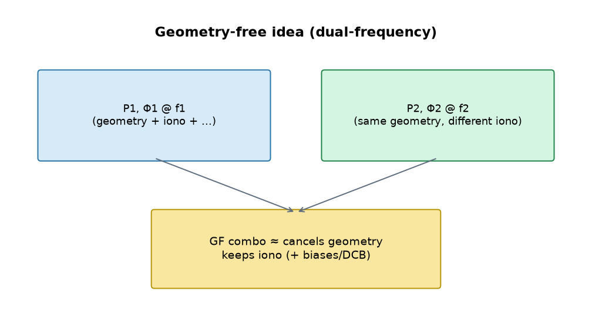
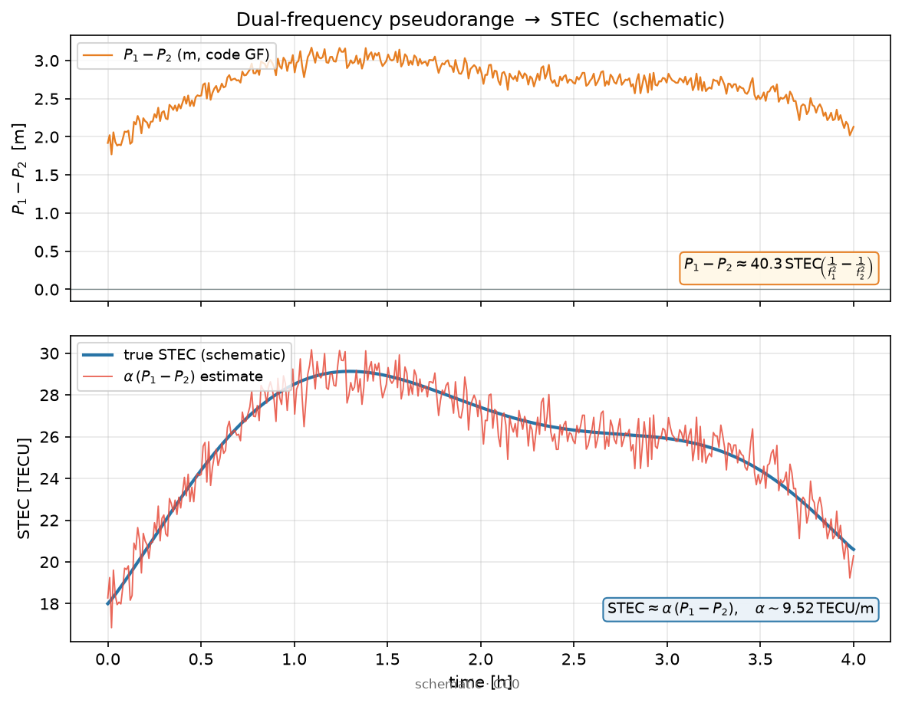
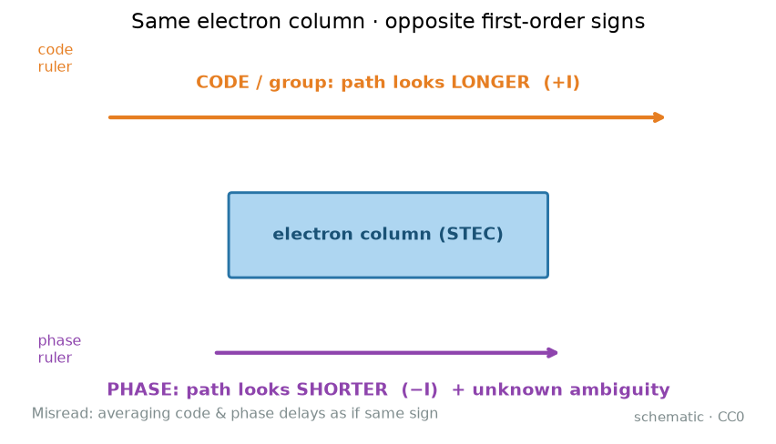
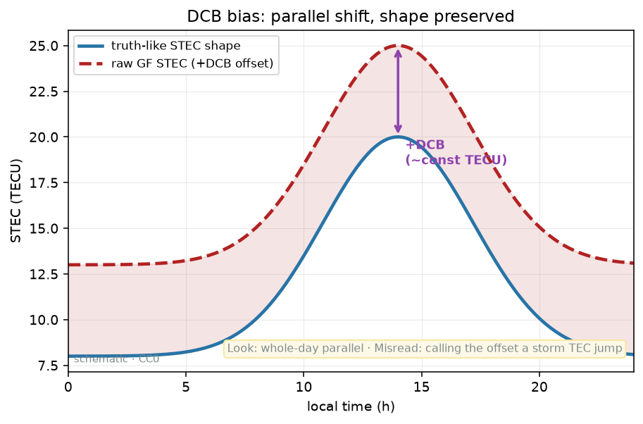
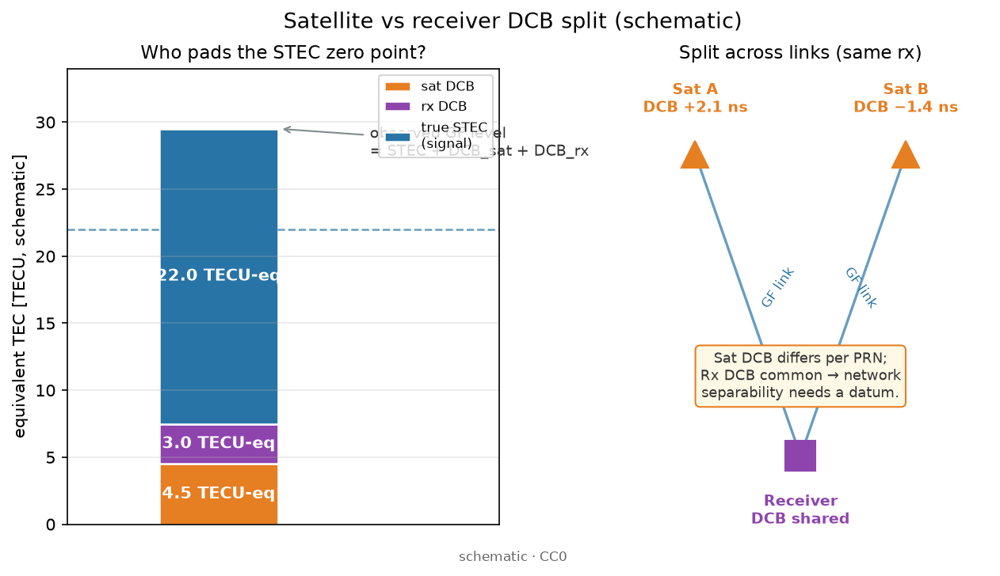
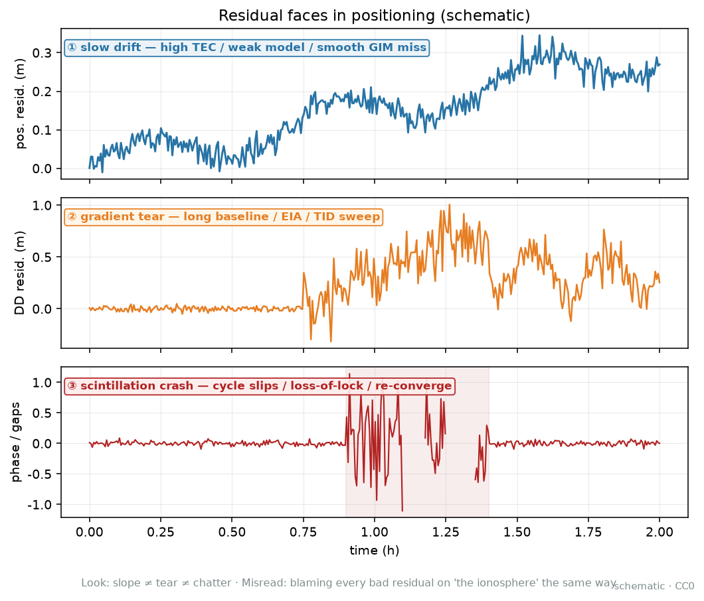
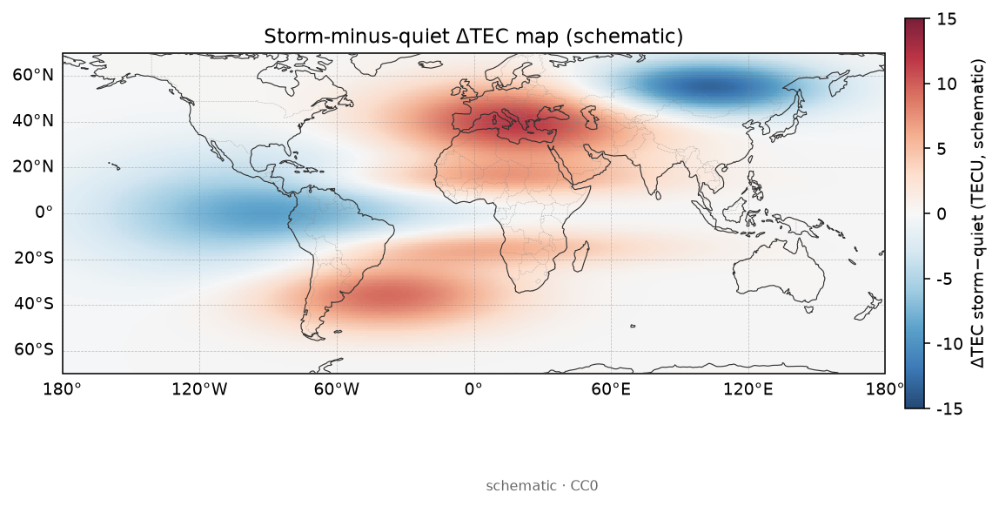

# 16 · 一日实战：从下载到一张 TEC 图

> **课堂定位**：接 [01](./01-ionosphere-tec-basics.md)、[02](./02-gnss-dualfreq-tec.md)、[03](./03-gim-ionex.md)、[09](./09-dcb-biases-deep.md)。你已会「电子雾有多厚」「双频怎么量」「GIM 是别人做好的地图」「DCB 会平移零点」。本课回答：**今天怎么亲手跑通最小闭环**——下载 → 处理 → 出图 → 用三句话解释。
> 路线固定为四段：
> **机制 → 公式拆解（逐步推导）→ 观测签名 → 分析步骤**。
> 你会听到「看天气预报 vs 自己架温度计」「厨房秤去皮」「窗帘透光」「红绿灯时段」类比；每条后面立刻配「这一步在物理/几何上干什么」。
>
> **写给谁**：第一次想在**一天内**交出一张带日期、单位（TECU）、色标与上游工具名的图，并写半页「坑与解释」的人；以及已读 02/03 却不知道「今天先做哪条线」的人。
>
> **学完交付**：说清一天流水线每块在干什么；手算本课钉死的 $\alpha$ 与薄壳映射小例；在时间序列上**一眼区分**好日变化 / 周跳 / 多径 / DCB 平移 / 低仰角；按 A/B/C 时间盒跑通主线并勾验收清单；说出 2–3 条误解与测验答案要点。
>
> **项目名**均来自根目录 [`PROJECTS.json`](../../PROJECTS.json) 的 `name` 字段。本文件是教程，不是 `docs/software/` 手册——命令以各上游 README 为准。

---

## 0. 开场：三个真实场景 + 选一条主线

请先合上笔记本，想三件事：

1. **师兄说「今天出一张 TEC」**：有人直接贴网上的全球色图（那是路线 A：读 GIM/IONEX，见 [03](./03-gim-ionex.md)）；有人死磕一天 RINEX 编译到天黑（路线 B 的坑）；有人暴日安静日一锅炖还没差分（路线 C 半成品）。**一天只选一条主线**，余量再加分。
2. **图出来了，审阅退回**：无日期、无 TECU、色标拉成「艺术对比」、工具名凭记忆拼错——成功标志不是「有颜色」，而是「图能解释、差异说得清」。
3. **和 GIM 差七八 TECU，全日平行偏**：有人喊「算法错了」；更常见是 DCB / 映射 / 高度角没讲清（链回 [09](./09-dcb-biases-deep.md)、[02](./02-gnss-dualfreq-tec.md)）。本课把「差常数」当成**签名**，不是失败标签。

**三条路线（只选一条做主线）**：

| 路线 | 一句话 | 适合谁 | 预计净工作 | 机制上你在干什么 |
|---|---|---|---|---|
| **A** | 只读别人做好的全球地图（GIM/IONEX） | 上午入门、下午要交差 | 2–4 小时 | 跳过站星几何，直接消费 VTEC 格网 |
| **B** | 从单个测站原始观测估 STEC | 已会读 IONEX，想碰 RINEX | 4–7 小时 | 走完 RINEX→GF→STEC→（可选）映射 |
| **C** | 扰动日 vs 安静日差分 + 可选 ROTI | 想讲空间天气故事 | 在 A 通了之后 +1–3 小时 | 用差分突出「天气」相对「气候」 |

**类比**：A 是看天气预报图；B 是自己架温度计；C 是对比「台风天 vs 前天」并讨论阵风（ROTI）。

**本课地图（请对照目录）：**

| 段落 | 你在学什么 | 类比 |
|---|---|---|
| §1 词表 | 先认名字 | 进厨房前认厨具 |
| §2–6 **机制** | 一天流水线每块在物理/几何上干什么 | 雾有多厚、尺子怎么量、壳怎么压扁 |
| §7–10 **公式拆解** | 本课用到的式子钉死（符号表→逐步→小例） | 把菜谱拆成一步一步 |
| §11 **观测签名** | 好日变化 vs 周跳/多径/DCB/低仰角 | 监控录像怎么认人 |
| §12–20 **分析步骤** | 时段、A/B/C 手册、Playbook、验收、测验 | 值班清单与过关 |

配图均在 [`images/`](./images/)，版权见 [`images/SOURCES.md`](./images/SOURCES.md)。建议先扫：[08-how-to-use-this-catalog.md](./08-how-to-use-this-catalog.md)、[`docs/data-access.md`](../data-access.md)。

**边界**：不重写整本 [02](./02-gnss-dualfreq-tec.md)（双频推导）/[03](./03-gim-ionex.md)（GIM 工艺）/[09](./09-dcb-biases-deep.md)（DCB 深讲）；本课只把**今天会用到的式子钉死**并串进可跟做步骤。勿动现象课 [19–23](./19-phenomena-overview.md)。**不画新流程图**——时间盒用表格，几何用已有自制图。

**成功标志**：收工时至少有一张带日期、单位（TECU）、色标与上游工具名的图，以及半页「坑与解释」。

---

## 1. 词表（先扫一遍，主讲后再回看）

### 1.1 今天流水线物件

| 术语 | 人话 | 稍严 |
|---|---|---|
| **RINEX** | 测站「原始账本」 | 观测/导航/气象等交换格式；今天常要观测+导航配对 |
| **双频 / GF** | 两把频率尺子相减，消公共几何 | 几何无关组合；详见 [02](./02-gnss-dualfreq-tec.md) |
| **STEC** | 斜路径上电子柱有多厚 | 沿站星路径的总电子含量；单位常 TECU |
| **VTEC** | 竖直柱有多厚 | 垂直总电子含量；GIM 产品多报这个 |
| **映射 / 薄壳** | 把斜的「压」成竖直的近似 | 常用单层壳高 $H$，因子 $M(e)$；见 [01](./01-ionosphere-tec-basics.md) |
| **IPP** | 射线穿透「壳」的那个点 | 电离层穿刺点；GIM 插值常在 IPP |
| **GIM / IONEX** | 别人收成的全球/区域 VTEC 地图 | [03](./03-gim-ionex.md)；文件常带历元格网 |
| **DCB** | 硬件延迟差，会平移 TEC 零点 | [09](./09-dcb-biases-deep.md)；未改正勿硬比绝对值 |
| **周跳** | 相位计数器「掉了一截」 | 弧段内台阶；要切弧再 leveling |
| **ROTI** | 相位变化率的「颠簸指数」 | 扰动/闪烁相关；≠ TEC 本身 |
| **TECU** | TEC 的常用单位 | $1\,\mathrm{TECU}=10^{16}\,\mathrm{el\,m^{-2}}$ |

### 1.2 质控与产品代次

| 术语 | 人话 | 稍严 |
|---|---|---|
| 高度角截止 | 太贴地平线的星先扔掉 | 教学常见 $15^\circ$–$30^\circ$ |
| 多路径 | 信号「撞墙再进天线」 | 低仰角脏；时间序列毛刺 |
| 最终 / 快速 / 预报 IONEX | 产品成熟度不同 | 结论必须标注代次；别把预报当最终 |
| 分析中心（AC） | 谁做的那张图 | CODE、JPL、CAS、WHU…；两家可差数 TECU |

**纪律**：未声明高度角与 DCB 策略前，禁止把「和 GIM 差一点」叫算法失败；未标产品代次前，禁止把预报图写进「最终结论」；工具名必须与 `PROJECTS.json` 的 `name` 一致。

---

# 第一段 · 机制

> 目标：用「因果」讲清——一天流程里每一块在物理/几何上干什么。完整公式留给第二段；时间盒留给第四段。

---

## 2. 一天流水线在物理上干什么？

把电离层想成「地球外层大气里的电子雾」。今天你要么：

- **读别人已经估好的雾厚地图**（路线 A）；或  
- **自己用双频尺子量一条斜路径的雾厚**（路线 B）；或  
- **比较暴日与安静日雾厚差**（路线 C）。

完整「自己量」的因果链是：

$$
\mathrm{RINEX}
\;\rightarrow\;
\mathrm{GF}
\;\rightarrow\;
\mathrm{STEC}
\;\rightarrow\;
M(e)
\;\rightarrow\;
\mathrm{VTEC}
\;\rightarrow\;
\mathrm{QC/图}.
$$

读法（中文在公式外）：原始观测 → 几何无关组合 → 斜路径 TEC → 映射到垂直 → 质控出图。路线 A 从中间某步直接跳到「别人的 VTEC 格网」。

> **看图要点（为什么一天流程绕不开壳）**
> - **机制**：测到的往往是斜路径积分（STEC）；许多产品与对比习惯说垂直柱（VTEC）。
> - **看什么**：射线穿过整层，壳模型在固定高度记一个穿刺点。
> - **为什么**：映射误差会整段偏；低仰角时 $M(e)$ 变大，噪声与模型误差一起放大。
> - **别误判**：壳图画得漂亮 ≠ 你已经知道 200 km 与 400 km 谁多谁少（那是 [11](./11-tomography-basics.md) 的问题）。
> 图源：自制 CC0；细读见 [01](./01-ionosphere-tec-basics.md)。

---

## 3. RINEX → GF/STEC：两把尺子在减什么？

### 3.1 物理根：电离层色散，几何不色散

同一路径、同一份电子柱，L1 与 L2 延迟不同（$I\propto 1/f^{2}$）；站星几何、对流层、钟差对两频几乎一样。两频相减 → 公共项退出，色散项留下 → 这就是几何无关（GF）的物理根。链回 [02](./02-gnss-dualfreq-tec.md)。

> **看图要点（为什么差能报电子柱）**
> - **看什么**：频率越低，同一 STEC 延迟越大；**两条曲线的竖直差**才是 GF「看见」的东西。
> - **为什么**：今天路线 B 的核心不是「任意两列相减」，而是选对双频观测、理解差在量色散。
> - **别误判**：单频模型改正 ≠ 双频测量；把「无电离层组合」听成「几何无关」会进错门。
> 图源：自制 CC0。

> **看图要点（为什么叫几何无关）**
> - **机制**：差分消掉几何/对流层/钟差，留下电离层差 + 硬件延迟差 + 噪声。
> - **为什么**：名字强调「几何被消」，不是「误差全消」——DCB 与多路径仍在。
> 图源：自制 CC0。

### 3.2 码钉水平、相描波形

生伪距 GF 吵（乘 $\alpha$ 后可达数 TECU 噪声）；相位 GF 相对变化漂亮但差一个未知模糊度常数。工程上：**码钉绝对水平，相描波形**（leveling / 载波平滑）。顺序纪律：先周跳切弧 → 再 leveling → 再谈「漂亮 STEC」。

> **看图要点（为什么先看米再乘 $\alpha$）**
> - **看什么**：上方面板吵闹的米域差，下方乘 $\alpha$ 进 TECU。
> - **为什么**：单位错一层，图就会「全蓝/全红」或量级离谱——这是路线 B 最常见翻车之一。
> 图源：自制 CC0。

---

## 4. 映射 / VTEC / IPP：斜的怎么变成「竖」的？

### 4.1 薄壳直觉

把电离层电子「压」在一个薄壳（常用 $H\approx350$–$450\,\mathrm{km}$）上：斜路径 STEC ≈ 壳上 VTEC × 映射因子 $M(e)$，其中 $e$ 是高度角。高度角越低，路径越斜，$M$ 越大——像斜着看窗帘，透光路径更长。

> **看图要点（为什么低仰角先砍）**
> - **机制**：$M(e)$ 在低仰角陡增；模型误差、多路径、映射近似绑在一起放大。
> - **看什么**：高仰角接近 1，低仰角快速上升。
> - **为什么**：教学截止角不是「随便设个圆整数字」，而是在挡这一整包误差。
> 图源：自制 CC0。

> **看图要点（为什么和 GIM 比要对 IPP）**
> - **机制**：单站 STEC 映射后的 VTEC「属于」IPP 附近，不是接收机正上方一个点。
> - **为什么**：路线 B 与 GIM 比较时，应在**同时刻、近 IPP** 插值，而不是拿测站经纬度瞎比。
> 图源：自制 CC0。

### 4.2 GIM 路线在机制上「省掉」了什么？

路线 A 不重新估 GF：分析中心已用全球网做完偏差处理、映射与建图，你读的是成品 VTEC 格网（IONEX）。你省掉的是站星几何与 DCB 地狱，**没省掉**的是：产品平滑、代次差异、格网分辨率、两家 AC 系统差。

> **看图要点（为什么读 GIM 仍要懂 IPP）**
> - **看什么**：格网点与穿刺轨迹的关系示意。
> - **为什么**：日变化「东边升起」、区域裁剪、与单站对比——都假设你知道图上的值代表壳上哪一带。
> 图源：自制 CC0。

---

## 5. 质控在挡什么？（不是「把曲线弄好看」）

| 质控动作 | 物理/几何上挡什么 | 不做会怎样 |
|---|---|---|
| 观测+导航同日配对 | 轨道/钟错误日期 | 时间轴错乱，STEC「穿越」 |
| Hatanaka/`crx2rnx` 还原 | 压缩观测未展开 | 全空值或读库崩溃 |
| `TEQC` / `Anubis` 扫中断 | 弧段不连续、周跳嫌疑 | 平滑抹成假天气 |
| 高度角截止 | 低仰角多路径+映射炸 | 毛刺如刺猬 |
| 周跳切弧 | 相位模糊度台阶 | 假「突然暴扰」 |
| 声明 DCB 策略 | 硬件延迟平移 | 绝对值与 GIM 冤案 |
| 色标用整数 TECU、标 AC/代次 | 阅读与复现 | 艺术图被退回 |

> **看图要点（为什么质控顺序不能乱）**
> - **机制**：码/相电离层符号相反；相位漂亮但有模糊度。
> - **为什么**：先切周跳再 leveling——否则把假台阶「熨」进科学结论。
> 图源：自制 CC0。

---

## 6. 三条路线各自在机制上「买什么、省什么」

| | 买到的科学问题 | 省掉 / 推迟的负担 | 仍必须讲清的局限 |
|---|---|---|---|
| **A** | 大尺度 VTEC 结构、日变化、两家差 | RINEX、周跳、接收机 DCB | 平滑、代次、AC 差、格网粗 |
| **B** | 单站路径积分、与 GIM 差的原因假设 | 全球建图 | 高度角、DCB、映射、多路径 |
| **C** | 暴扰相对安静的差分形态 | 自己估 STEC（可只做 GIM 差） | 对照日选择、产品代次、ROTI≠TEC |

口诀：**A 看图；B 架表；C 比天气。一天一条主线。**

---

# 第二段 · 公式拆解（逐步推导）

> 目标：把**本课会用到的式子**钉死——符号有单位、有人话、有小数值例。不必重写整本 02；细节与失效模式回链。

---

## 7. 公式路线图（今天只需这条）

$$
I_i=\frac{40.3}{f_i^{2}}\,\mathrm{STEC}
\;\xrightarrow{\mathrm{GF}}\;
\mathrm{STEC}\approx\alpha\,(\Delta P-\mathrm{DCB}_{\mathrm{GF}})
\;\xrightarrow{M(e)}\;
\mathrm{VTEC}\approx\frac{\mathrm{STEC}}{M(e)}.
$$

读法（中文在公式外）：延迟公式 → 几何无关换成 STEC → 薄壳映射到 VTEC。路线 A 直接消费右侧的 VTEC 格网；路线 B 至少走到 STEC，映射可选但与 GIM 比时通常要做。

---

## 8. 解剖台 A：米 → TECU（把 $\alpha$ 钉死）

### 8.1 符号表

| 符号 | 含义 | 单位 / 备注 |
|---|---|---|
| $f_1,f_2$ | GPS L1/L2 频率 | $f_1=1575.42\,\mathrm{MHz}$，$f_2=1227.60\,\mathrm{MHz}$ |
| $P_1,P_2$ | 双频伪距 | m |
| $\Delta P$ | 常取 $P_2-P_1$（读软件确认） | m |
| $\alpha$ | 米 → TECU 的频率因子 | $\mathrm{TECU/m}$；L1/L2 ≈ 9.52 |
| $\mathrm{DCB}_{\mathrm{GF}}$ | 码 GF 硬件延迟差 | m；未改正则吞进 STEC |
| $40.3$ | 一阶系数（与 01/02 课一致） | SI 组合进 $I=40.3\,\mathrm{STEC}/f^{2}$ |

### 8.2 逐步（课堂版）

1. 一阶群延迟：$I_i=40.3\,\mathrm{STEC}/f_i^{2}$（STEC 用 SI，$\mathrm{m}^{-2}$；讨论时常换算到 TECU）。  
2. 伪距差主要吃 $(I_2-I_1)$ 加 DCB 项（公共几何已消）。  
3. 解出 STEC，把频率因子收成 $\alpha$：

$$
\mathrm{STEC}=\alpha\,(P_2-P_1-\mathrm{DCB}_{\mathrm{GF}})+\varepsilon.
$$

4. GPS L1/L2 教学常用值：

$$
\alpha=\frac{1}{40.3}\cdot\frac{f_1^{2}f_2^{2}}{f_1^{2}-f_2^{2}}\approx 9.52\,\mathrm{TECU/m}.
$$

### 8.3 小数值例（假但真实量级）

设某历元 $P_2-P_1=1.05\,\mathrm{m}$，且暂令 $\mathrm{DCB}_{\mathrm{GF}}=0$（教学）：

$$
\mathrm{STEC}\approx 9.52\times 1.05\approx 10.0\,\mathrm{TECU}.
$$

若其实存在 $0.30\,\mathrm{m}$ 的 DCB 项未改正：假 STEC 偏差 $\approx 9.52\times 0.30\approx 2.9\,\mathrm{TECU}$——全日近乎平行平移。这就是「和 GIM 差一截常数」的机制指纹（细讲见 [09](./09-dcb-biases-deep.md)）。

**验算口诀**：$1\,\mathrm{ns}\times c\approx0.30\,\mathrm{m}$；再 ×$\alpha$ → 约 $2.85\,\mathrm{TECU}$。几纳秒绝不可「太小忽略」。

---

## 9. 解剖台 B：薄壳映射（STEC → VTEC）

### 9.1 符号表

| 符号 | 含义 | 单位 / 备注 |
|---|---|---|
| $e$ | 高度角（elevation） | rad 或度；计算时统一 |
| $R_E$ | 地球半径 | ≈ $6371\,\mathrm{km}$ |
| $H$ | 薄壳高度 | 常用 $350$–$450\,\mathrm{km}$ |
| $M(e)$ | 映射因子 | 无量纲；高仰角→1 |
| $\mathrm{VTEC}$ | 垂直 TEC | TECU |

### 9.2 逐步（常用单层公式之一）

许多入门实现用（变体很多，**以你所用工具文档为准**）：

$$
M(e)=\frac{1}{\sqrt{1-\left(\dfrac{R_E\cos e}{R_E+H}\right)^{2}}},\qquad
\mathrm{VTEC}\approx\frac{\mathrm{STEC}}{M(e)}.
$$

1. 高仰角：$e\to 90^\circ$，$\cos e\to 0$，$M\to 1$，STEC≈VTEC。  
2. 低仰角：$M$ 增大，同样噪声变成更大的 VTEC 抖动。  
3. $H$ 选错：整条 VTEC 曲线被错误地「拉长/压扁」——与 DCB 平移不同：映射误差常随高度角变化，不是完美平行。

### 9.3 小数值例

取 $R_E=6371\,\mathrm{km}$，$H=450\,\mathrm{km}$，$e=30^\circ$（$\cos 30^\circ=\sqrt{3}/2\approx0.866$）：

$$
\frac{R_E\cos e}{R_E+H}\approx\frac{6371\times 0.866}{6821}\approx0.809,
\quad
M\approx\frac{1}{\sqrt{1-0.809^{2}}}\approx1.70.
$$

若 $\mathrm{STEC}=34\,\mathrm{TECU}$，则 $\mathrm{VTEC}\approx 34/1.70\approx 20\,\mathrm{TECU}$。  
同一 STEC 若在 $e=15^\circ$，$M$ 更大 → 估出的 VTEC 更敏感于 $e$ 误差与多路径——这就是截止角的「几何理由」。

> **看图要点（为什么例题要算 $M$）**
> - **看什么**：$M(e)$ 曲线在低仰角上扬。
> - **为什么**：把「砍低仰角」从经验口诀变成可手算的几何。
> 图源：自制 CC0。

---

## 10. 解剖台 C：一日量感串起来

| 量 | 安静中纬白天量级（示意） | 你用来干什么 |
|---|---|---|
| 单频 $I_1$（20 TECU） | 约数米 | 理解「电离层延迟可见」 |
| $P_2-P_1$ | 约 1–3 m 量级（视 STEC） | 检查单位是否还在「米」 |
| $\alpha\times\Delta P$ | 十到数十 TECU | 检查是否误用了 $\alpha$ |
| GIM VTEC 色标 | 常 0–50+ TECU（视季节/纬度） | 色标别拉成 ±500 的假对比 |
| 两家 GIM 差 | 数 TECU 常见 | 差分图对称色标 |
| 未改正 DCB | 数 TECU 平行偏 | 先查 [09](./09-dcb-biases-deep.md)，别重写算法 |

> **看图要点（为什么要有量感表）**
> - **机制**：从延迟差到 TECU 的因果链。
> - **为什么**：路线 B 翻车时，先用表核对「数是否还在地球上」，再怀疑代码。
> 图源：自制 CC0。

---

# 第三段 · 观测签名

> 目标：在时间序列或地图上**一眼区分**「真天气」与「尺子事故」。签名是值班语言，不是美学。

---

## 11. 五种长相（必背）

### 11.1 好日变化（你想保留的）

- **时间序列**：地方时上午抬升、午后附近偏高、夜间回落；多星映射 VTEC 大致同趋势（允许散射）。  
- **GIM 地图**：高 TEC 结构大致随地方时东移；低纬或可见赤道异常双峰（视季节/地方时，不是天天标准照）。  
- **不像**：整分钟级方波台阶、全日平行抬高却形状完全不变还硬说「暴扰」。

> **看图要点（为什么先建立「好日」模板）**
> - **看什么**：日侧抬升、夜侧回落的大势。
> - **为什么**：没有「正常脸」，就无法识别周跳/多路径「假脸」。
> 图源：自制 CC0。

> **看图要点（为什么路线 A 要看得出结构）**
> - **成功**：大尺度结构可解释（赤道带、日夜侧等）。  
> - **失败**：噪声雪花、无单位、无日期、色标夸张对比。  
> 图源：自制 CC0。

### 11.2 周跳（尺子掉了重拿）

- **长相**：相位 STEC/GF 出现**突然台阶**，之后在新水平上继续「平滑」；常与某颗星、某段弧绑定。  
- **不像好日**：真实日变化很少在 30 s 内方波跳数 TECU 又永不回跳。  
- **处置**：切弧；不要把台阶熨进 leveling。量级感：L1 跳 1 周量级可制造 $\sim 1$–$2\,\mathrm{TECU}$ 假信号（视 GF 定义，见 [02](./02-gnss-dualfreq-tec.md)）。

### 11.3 多路径 / 低仰角脏段

- **长相**：低高度角时段毛刺加密、散点扇形张开；抬高截止角后「病好一半」。  
- **地图/轨迹**：地平线附近 IPP 轨迹更脏。  
- **处置**：截止角；短弧慎用；别用脏段硬拟合 DCB。

> **看图要点（为什么毛刺常伴低仰角）**
> - **看什么**：穿刺点轨迹扫过的区域。  
> - **为什么**：远端低仰角几何 + 多路径 + 大 $M(e)$ 叠在一起——签名是「扇形变脏」，不是「全球突然暴」。  
> 图源：自制 CC0。

### 11.4 DCB 平移（厨房秤没去皮）

- **长相**：相对 GIM 或相对其他星，**近乎全日平行偏置**数 TECU；形状（起伏）还可认。  
- **不像映射误差**：纯 DCB 更「平」；映射/`H` 问题更随高度角变化。  
- **处置**：声明「只解释相对变化」或引入 DCB 产品/估计；深讲回 [09](./09-dcb-biases-deep.md)。

> **看图要点（为什么「差常数」优先查偏差）**
> - **机制**：未改正 DCB ≈ 整条 STEC 平移；汤的起伏还对，读数高一截。  
> - **为什么**：这是路线 B 与 GIM 比较时的第一嫌疑人，不是第一时间重写 $\alpha$。  
> 图源：自制 CC0。

> **看图要点（为什么笔记要写清改了哪一端）**
> - **看什么**：星端与站端延迟都可进 GF。  
> - **为什么**：只改一端或用了不同基准，绝对值故事会变，相对变化故事仍可能成立。  
> 图源：自制 CC0。

### 11.5 低仰角「炸花」综合症

- **长相**：一放开 $5^\circ$ 截止，曲线刺猬化；地图边缘彩带脏。  
- **一眼区分口诀**：

| 签名 | 一眼 | 先做 |
|---|---|---|
| 好日变化 | 随地方时缓变、多星同势 | 保留 |
| 周跳 | 方波台阶、单星/单弧 | 切弧 |
| 多路径 | 低仰角毛刺、抬截止即好转 | 抬高 $e_{\min}$ |
| DCB 平移 | 全日近平行偏置 | 查 [09](./09-dcb-biases-deep.md) |
| 映射/`H` | 偏置随高度角变 | 查 $M(e)$、壳高 |
| 读错历元/单位 | 地图乱跳或量级荒谬 | 查 IONEX 头、$\alpha$ |

> **看图要点（为什么要「三种脸」）**
> - **机制**：同一套差分，可来自真扰动、系统偏差、或噪声结构。  
> - **为什么**：路线 C 的差分图也要先排除「两天产品代次不同」「色标不对称造成的假戏剧」。  
> 图源：自制 CC0。

---

# 第四段 · 分析步骤

> 目标：保留「一天能跑通」的时间盒气质；每步补上**为什么**；失败有 Playbook；出门有验收。

---

## 12. 时段选择与开工 15 分钟清单

### 12.1 选哪一天？

| 你的主线 | 优先选 | 为什么 |
|---|---|---|
| A 入门出图 | 安静日 | 结构可解释，少把暴扰当读库错误 |
| B 单站 STEC | 数据连续的安静日 | 先通流水线，再挑战脏数据 |
| C 差分故事 | 已知扰动日 + 对照日 | 对照：事件前安静日或 ~27 天前 |

记下 YYYY、年积日 DDD、UTC 与地方时换算——「东边升起」讲反通常是时区混用。

### 12.2 开工前 15 分钟（08:30–08:45 示例）

- [ ] 能打开 `lists/01-ionosphere.md`、`lists/10-gnss-datasets.md`、`PROJECTS.json`  
- [ ] Python 或 Matlab 环境可用（随上游工具；不会两边都装）  
- [ ] 已读 [`docs/data-access.md`](../data-access.md) 里 Earthdata/CDDIS 注册说明  
- [ ] 今天主路线已选定：A / B / C（写在笔记第一行）  
- [ ] 磁盘有数 GB 空闲；网络能访问数据中心  
- [ ] 笔记本模板：`日期 / 路线 / 工具名 / 命令 / 截图文件名 / 翻车记录`

**卡住规则**：任一下载/编译卡超过 **40 分钟**，立刻降级——换更简单的上游 `examples/`（如 `tec-example`），或退回路线 A。不要在编译选项里度过中午。

### 12.3 全天时间盒总表（可打印）

| 时段 | 时钟（示例） | 所有人 | 路线 A 主线 | 路线 B 主线 | 路线 C 主线 |
|---|---|---|---|---|---|
| T0 | 08:30–08:45 | 开工清单 | 同左 | 同左 | 同左 |
| T1 | 08:45–09:30 | 注册与下载通路 | 拿 1 天 IONEX | 确认 Earthdata + 选站 | 选定暴日+安静日 |
| T2 | 09:30–11:00 | — | 读 IONEX 出第一张图 | 下 RINEX+导航并 QC | 下两天 GIM |
| T3 | 11:00–12:00 | 午餐前存档 | 日变化/第二历元 | 跑通 STEC 曲线 | 做出差分图 |
| 午休 | 12:00–13:00 | 离开屏幕 | — | — | — |
| T4 | 13:00–15:00 | — | 两中心对比（加分） | 高度角/DCB 叙事 | 叠 Kp/SYM-H |
| T5 | 15:00–16:00 | — | 写解释三句话 | 与 GIM 插值比 | 可选 ROTI |
| T6 | 16:00–17:00 | 收工检查表 | 交图+笔记 | 交图+笔记 | 交半页结论 |

时区只是示例；核心是**时间盒**，不是必须从 8:30 开始。

---

## 13. 路线 A（最快）：只读 GIM —— 小时级手册 + 为什么

### 13.1 目标与成功标准

- 画出全球或中国区 **VTEC** 填色图；  
- 色标单位 **TECU**；图上有**日期、分析中心、文件名或产品代次**；  
- 能用三句话解释：色标范围为啥这样取、图上最显眼结构是啥、是否像「赤道异常双峰/中纬日变」。

**成功**：看得出大尺度结构，而不是噪声雪花。  
**失败**：只有一张无单位、无日期、色标拉伸到夸张对比的「艺术图」。

### 13.2 小时级步骤（嵌入「为什么」）

#### 08:45–09:30　打通下载

1. 打开 [`lists/10-gnss-datasets.md`](../../lists/10-gnss-datasets.md)，定位：  
   - `CDDIS-IONEX`（主推）  
   - 备选：`JPL-IONEX-Rapid`、`ROB-IONEX-Products`、`GFZ-Global-Ionosphere-Maps`、`UPC-IONEX-Archive`、`WHU-IGS-Ionosphere-AC`  
2. 按 [`docs/data-access.md`](../data-access.md) 完成 `NASA-Earthdata-Login`（若走 CDDIS）。  
3. 选一个**安静日**；记下 YYYY、DDD。  
4. 下载该日至少一家最终或快速 IONEX（长名含 `GIM`/`INX` 字样——以目录实况为准）。  
5. 校验：能解压；非 0 字节；文本偷看头部是否有 `EPOCH OF CURRENT MAP` 等 IONEX 特征。

**为什么先安静日**：暴扰结构难解释时，你分不清是读库错了还是真有赤道喷泉猛涨——先练「正常脸」。

#### 09:30–11:00　读入并出第一张图

1. 安装/克隆其一：`ionex`、`ionex-rs`、`ionex_reader`、`ionex-analyzer`（以各 README 为准）。  
2. 辅助拉取可用 `ionex-downloader`。  
3. 加载 IONEX → 选一个历元（如 12:00 UTC）→ 画填色图。  
4. 色标：先自动范围，再改成「整数 TECU、不要过多小数」。  
5. 标题模板：`VTEC [TECU] | 2024-xx-xx 12:00 UTC | AC=CODE | file=...`

**为什么要写 AC 与代次**：两家中心可差数 TECU；预报≠最终——这是机制局限，不是你画图失败。

#### 11:00–12:00　看日变化是否「东边升起」

1. 再读相邻两小时历元（如 10:00 与 14:00 UTC）。  
2. 问：高 TEC 结构是否大致随地方时东移？赤道附近是否有双峰迹象？  
3. 若完全乱跳：可能读错历元索引，或文件损坏。

> **看图要点（为什么日变化检查值钱）**
> - **机制**：太阳驱动的电离层应随地方时迁移；双峰是否出现取决于地方时/季节。  
> - **别误判**：某一历元「一个馒头」≠ 数据一定错；先换历元、查第二家。  
> 图源：自制 CC0。

#### 13:00–15:00　加分：两家分析中心

1. 同日再下第二家（JPL / CAS / WHU 等——以 `CDDIS-IONEX` 实有文件为准）。  
2. 插值到同一经纬网，画 A、B、A−B。  
3. 统计差分均值与 RMSE（教学用即可）。  
4. 详细实验课见 [18](./18-lab-compare-gims.md)。

#### 15:00–16:00　写三句话解释（必须交）

1. 「色标从 a–b TECU，是因为……」  
2. 「图上最显眼的是……（赤道异常/中纬日侧等）」  
3. 「我信任/怀疑这张图，因为……（产品代次/空洞/与第二家一致性）」

### 13.3 路线 A 收工检查

- [ ] 至少一张合规图  
- [ ] 工具名与 `PROJECTS.json` 一致  
- [ ] 笔记有下载路径与翻车记录  

---

## 14. 路线 B（进阶）：单站 STEC —— 小时级手册 + 为什么

### 14.1 目标与成功标准

- 得到某 IGS 站一天各卫星 **STEC**（或穿刺点 VTEC）时间序列；  
- 能解释与同时刻 GIM 插值的差异（常数偏差？低高度角更散？）；  
- 笔记中出现高度角截止与 DCB 相关讨论（详见 [09](./09-dcb-biases-deep.md)）。

**成功**：不是「和 GIM 差不多」四个字，而是「差在哪、为何可能」。

### 14.2 小时级步骤

#### 08:45–09:30　选站与权限

1. 数据入口：`IGS-Data-Access`、`IGS-Products`、`CDDIS-GNSS-Archive`、`BKG-IGS-Data-Center`。  
2. 选一个数据连续的公开站（常用 IGS 站即可）。  
3. 同一天的**观测 + 导航**都要；日期必须一致。

**为什么导航也要**：没有同日星历/钟，站星几何与时间标签会漂——STEC 时间轴会「穿越」。

#### 09:30–11:00　下载、解压、质检

1. 读写：`georinex`、`GFZRNX`；压缩：`RNXCMP` / `crx2rnx` / `hatanaka` 等（按文件类型）。  
2. 质检：`TEQC` 或 `Anubis`；记下中断、周跳嫌疑、多路径脏时段。  
3. 笔记强制记录：采样间隔、系统、大概可见卫星数。

#### 11:00–12:00 & 13:00–15:00　估 STEC

1. 任选：`gnss-tec`、`pygnss-tec`、`tec-suite`、`Seemala-GPS-TEC`、`Okoh-MATLAB-TEC-from-RINEX`、`IONOLAB-TEC-Software`、`tec-example`（亦可对照业务向阅读 `PyTECGg` 文档，仍以你跑通的上游为准）。  
2. 先跑上游最小例子，再换你的站日。  
3. 设置高度角截止（教学起点 $15^\circ$–$30^\circ$）。  
4. 处理周跳：相位弧段断开要分段；不要假装一条光滑圣线。  
5. 讨论 DCB：绝对值要较真；若只看变化，写明「未改正接收机 DCB，仅解释相对变化」。

**为什么先 examples/**：上游默认频率列名、单位、符号约定（$P_1-P_2$ vs $P_2-P_1$）各不相同——examples 是最便宜的「约定说明书」。

#### 15:00–16:00　与 GIM 比较

1. 用路线 A 的库读同日 IONEX。  
2. 在穿刺点（IPP）位置与时刻插值 GIM VTEC，与你的估计比。  
3. 写差异假设（至少两条）：DCB 基准、映射函数、GIM 平滑、多路径……

### 14.3 路线 B 收工检查

- [ ] STEC/VTEC 曲线图  
- [ ] 高度角策略写明  
- [ ] 与 GIM 差异的原因假设（不是「误差」一词打发）  

---

## 15. 路线 C（选做）：扰动对照 —— 小时级手册 + 为什么

### 15.1 目标与成功标准

- 完成「暴日 − 对照日」差分 GIM；  
- 半页结论同时出现：**驱动、TEC 形态、产品局限**；  
- 可选：ROTI 与 VTEC 是否同步的一句判断。

完整方法论见 [14](./14-space-weather-case.md)。本课只给「一天内能做完」的压缩版。

### 15.2 小时级步骤

#### 08:45–09:30　钉事件

1. 用 `NOAA-SWPC`、`GFZ-Kp-Index`、`NOAA-SWPC-Planetary-K` 选已知扰动日。  
2. 选对照：事件前安静日，或 ~27 天前；标题写 `Storm−Quiet(Q)` 或 `Storm−Rot27(R)`。

**为什么要对照**：没有分母的「暴日色图」分不清气候背景与暴扰——差分才是故事主语。

#### 09:30–12:00　两天 GIM + 差分

1. 对两天重复路线 A 下载与读入。  
2. 同分析中心、同格网插值后相减。  
3. 出差分图；色标对称（正负 TECU）通常更易读。

> **看图要点（为什么色标要对称）**  
> - **机制**：差分可正可负；不对称色标会制造假戏剧。  
> - **为什么**：验收时先问「主瓣位置与符号是否物理可讲」，再问美不美。  
> 图源：自制 CC0。

#### 13:00–15:00　时间轴

1. 区域平均 VTEC 曲线 + Kp 或 SYM-H（来源写条目名）。  
2. 太阳风可选 `NASA-OMNIWeb`。  
3. 问：谁先动？有无延迟？

#### 15:00–16:00　可选 ROTI

1. `igs-roti` 或 `Okoh-MATLAB-ROT-ROTI` 或 `Ionospheric-TEC-ROTI-Interactives`。  
2. 分面板对比，不硬叠。  
3. 写一句同步/不同步——ROTI 高不等于 VTEC 一定高（一个是「颠簸」，一个是「厚度」）。

> **看图要点（为什么 ROTI 单独一栏）**  
> - **机制**：ROTI 刻画相位变化率起伏，不是柱总量本身。  
> - **别误判**：把 ROTI 色斑直接叫「TEC 暴」——词汇混用会害人。  
> 图源：自制 CC0。

### 15.3 路线 C 结论六句模板

1. 事件与对照类型……  
2. 差分主瓣位置与符号……  
3. 相对地磁指数的时间关系……  
4. 两家 GIM 是否同向（若做了）……  
5. ROTI 与 VTEC……  
6. 局限：产品代次/平滑/未用测高仪……

---

## 16. 失败排查 Playbook（三条路线共用）

### 16.1 下载与文件

| 现象 | 可能原因 | 你该做 |
|---|---|---|
| 401/403 | 未登录或未授权 CDDIS | 重走 Earthdata；检查 `.netrc` |
| 空目录 | 日期/路径写错 | 对照 IGS 说明；换镜像思路（仍用本目录条目） |
| `.gz` 打不开 | 未解压 | `gunzip` / 上游自动解压选项 |
| 只有观测没有导航 | 下错目录 | 回同日导航树 / brdc |
| 全是空值 | Hatanaka 未还原 | 先 `crx2rnx` 再读 |

### 16.2 读库与出图

| 现象 | 可能原因 | 你该做 |
|---|---|---|
| 找不到模块 | 环境没激活 | 新建 venv；按 README 装依赖 |
| 图全蓝或全红 | 读错层/单位错 | 确认 TEC 地图不是误差图；查单位因子 |
| 经纬度颠倒 | 行列索引反了 | 海岸线对照；打印 `lon.min/max` |
| 中国区是空的 | 裁剪范围写反 | 检查 $0$–$360$ 与 $-180$–$180$ |
| 历元乱跳 | 索引/时间戳读错 | 打印 IONEX 头与历元列表 |

### 16.3 STEC 科学语义

| 现象 | 可能原因 | 你该做 |
|---|---|---|
| STEC 负得离谱 | 符号/单位/未处理偏差 | 查上游默认；对照 [02](./02-gnss-dualfreq-tec.md)/[09](./09-dcb-biases-deep.md) |
| 毛刺如刺猬 | 低高度角/周跳 | 提高截止角；分段 |
| 每颗星差一个常数 | 正常-ish | 映射+DCB+模糊度常数叙事 |
| 与 GIM 差近常数 | DCB/基准 | 先 [09](./09-dcb-biases-deep.md)，别重写 $\alpha$ |
| 程序要商业 Matlab 工具箱 | 环境不匹配 | 换 Python 系 `gnss-tec` / `pygnss-tec` / `tec-example` |
| 编译卡 >40 min | 依赖地狱 | 降级路线 A 或 `tec-example` |

### 16.4 通用翻车点（背下来）

1. **导航文件与观测日期不一致** — STEC 时间轴错乱。  
2. **没设高度角截止** — 低仰角把图炸花。  
3. **色标单位写成 TEU / 任意拉伸** — 审阅退回。  
4. **DCB 未说明就比较绝对值** — 见 [09](./09-dcb-biases-deep.md)。  
5. **一天内并行三条路线** — 通常三个半成品。  
6. **把预报 IONEX 当最终产品写进结论** — 代次必须标注。  
7. **UTC 与地方时混用** — 「东边升起」会讲反。  
8. **工具名凭记忆拼写** — 必须与 `PROJECTS.json` 的 `name` 一致。

---

## 17. 验收清单（出门前勾选）

### 17.1 图与笔记（所有人）

- [ ] 至少一张带**日期、单位（TECU）、色标、工具名/AC** 的图  
- [ ] 笔记写了所用上游仓库名（与 `PROJECTS.json` 一致）  
- [ ] 写了至少一个「和预期不符」及你的解释  
- [ ] 主路线成功标准已自评（A/B/C 见上文）  

### 17.2 机制口检（抽问 60 秒）

- [ ] 能用一句话说清：RINEX→GF→STEC→映射→VTEC 每步在干什么  
- [ ] 能指出今天**跳过了**哪一步（若走 A/C）  
- [ ] 能举一个「签名」例子（周跳或 DCB 平移）  

### 17.3 下一步指针

- [ ] 下一步指向 [10-build-gim-workflow.md](./10-build-gim-workflow.md)、[14](./14-space-weather-case.md)、[17](./17-roadmap-beginner-to-expert.md) 或 [18](./18-lab-compare-gims.md)

---

## 18. 常见误解专节（请打假）

**误解 1：「路线 A 出的图不是真 TEC，只有我自己算的才真。」**  
打假：GIM 是多站+偏差处理+建图后的产品；单站 STEC 也受 DCB/映射/多路径限制。「真」要定义在你的误差预算里，不是门派口号。

**误解 2：「和 GIM 差几 TECU = 我的程序写错了。」**  
打假：先看差异是**平行平移**还是**随高度角张开**。前者优先 DCB/基准；后者优先映射与低仰角。两家 GIM 彼此也可差数 TECU。

**误解 3：「ROTI 很高，所以 TEC 暴了。」**  
打假：ROTI 量的是相位变化率的起伏（颠簸），VTEC 量的是柱厚度。可以同现，不是同一物理量。分面板写结论。

（加分打假）**误解 4：「截止角设 5° 信息更多，一定更好。」**  
打假：信息更多同时误差更大；$M(e)$ 与多路径在低仰角一起炸。教学上先 $15^\circ$–$30^\circ$ 出能解释的图，再做灵敏度实验。

---

## 19. 课堂小测验与迷你作业

### 19.1 测验

**Q1.** 路线 A 出图后发现赤道是「一个馒头」而不是双峰，一定是数据错了吗？  

参考答案

不一定。可能是地方时/季节/平滑导致双峰不明显，或色标范围不当。先换历元、查第二家 GIM，再怀疑读库错误。

**Q2.** 路线 B 与 GIM 差一截近乎常数的 TECU，下一步最该读哪课？  

参考答案

[09 DCB](./09-dcb-biases-deep.md)。先分清「绝对水平」与「相对变化」目标；平行偏置是 DCB 经典签名。

**Q3.** 卡在编译某 TEC 工具 50 分钟，正确策略是？  

参考答案

触发 40 分钟规则：换 `tec-example` 或路线 A，先出图。编译细节留到有导师/文档的第二日。

**Q4.** 路线 C 只交了暴日 GIM、没有对照，为什么不合格？  

参考答案

看不出相对什么变化；无法区分气候背景与暴扰。必须有对照日与差分叙事。

**Q5.** 手算：取 $\alpha=9.52\,\mathrm{TECU/m}$，$P_2-P_1=2.00\,\mathrm{m}$，忽略 DCB，STEC≈？若漏改 $0.30\,\mathrm{m}$ 的 DCB，偏差≈？  

参考答案

$\mathrm{STEC}\approx 9.52\times 2.00=19.04\,\mathrm{TECU}$；偏差 $\approx 9.52\times 0.30\approx 2.86\,\mathrm{TECU}$（近平行平移）。

**Q6.** 薄壳：$M=1.70$，$\mathrm{STEC}=34\,\mathrm{TECU}$，VTEC≈？为什么低仰角要抬截止？  

参考答案

$\mathrm{VTEC}\approx 34/1.70=20\,\mathrm{TECU}$。低仰角 $M$ 大，映射与多路径误差放大，曲线易刺猬化。

### 19.2 迷你作业（纸面 + 一图即可）

1. 选 A 或 B 主线，交一张合规图 + 半页坑。  
2. 用本课签名表，标注你图里**最像哪一种脸**（好日/周跳/多路径/DCB/低仰角）。  
3. （加分）同日两家 GIM 差分，或单站 vs GIM 的两条差异假设。

---

## 20. 工具索引（名称已核验，勿臆造）

| 步骤 | 去哪 / 用啥 |
|---|---|
| 找软件 | [`lists/01-ionosphere.md`](../../lists/01-ionosphere.md) |
| 找数据 | [`lists/10-gnss-datasets.md`](../../lists/10-gnss-datasets.md) |
| 注册下载 | [`docs/data-access.md`](../data-access.md)、`NASA-Earthdata-Login` |
| 不会选工具 | [08](./08-how-to-use-this-catalog.md) |
| 读观测 | `georinex`、`GFZRNX`、`TEQC`、`Anubis` → [`lists/03-gnss-data.md`](../../lists/03-gnss-data.md) |
| 压缩还原 | `RNXCMP`、`crx2rnx`、`hatanaka` |
| 估 TEC | `gnss-tec`、`pygnss-tec`、`tec-suite`、`Seemala-GPS-TEC`、`Okoh-MATLAB-TEC-from-RINEX`、`IONOLAB-TEC-Software`、`tec-example` |
| 读 IONEX | `ionex`、`ionex-rs`、`ionex_reader`、`ionex-analyzer`、`ionex-downloader` |
| 业务 TEC 对照 | `DLR-IMPC`、`DLR-IMPC-Products`、`ESA-TIO-NRT-TEC`、`NOAA-SWPC-GloTEC`、`eSWua-TEC`、`IONORING` |
| 地磁/空间天气 | `GFZ-Kp-Index`、`NOAA-SWPC`、`NOAA-SWPC-Planetary-K`、`NASA-OMNIWeb` |
| ROTI | `igs-roti`、`Okoh-MATLAB-ROT-ROTI`、`Ionospheric-TEC-ROTI-Interactives` |

克隆请去**上游 URL**。本仓是索引，不内嵌第三方源码。

---

## 21. 板书八行 · 口述检查

1. 今天主线：A 看图 / B 架表 / C 比天气。  
2. 因果链：RINEX → GF → STEC → $M(e)$ → VTEC → QC。  
3. $\alpha\approx 9.52\,\mathrm{TECU/m}$（L1/L2）；单位先米后 TECU。  
4. 映射：低仰角 $M$ 大；截止角在挡误差包。  
5. 签名：缓变好日 / 方波周跳 / 低仰毛刺 / 平行 DCB。  
6. 与 GIM 比：对 IPP 与时刻；差常数先想 DCB。  
7. 图必须：日期、TECU、色标、AC/工具名。  
8. 卡 40 分钟：降级，不殉职编译。

**口述检查（30 秒）**：不看笔记，说出你今天跳过了流水线哪一步、为什么仍算「跑通」。

---

## 22. 课堂收束：五句带走

1. **一天一条主线**：A 读 GIM，B 估 STEC，C 做差分——并行易三空。  
2. **每步有物理**：差分见色散，映射压斜路径，质控挡尺子事故。  
3. **公式只钉课用**：$\alpha$ 与 $M(e)$ 能手算；细节回 02/01/09。  
4. **签名先于美学**：平行偏置≠算法崩；刺猬先抬截止角。  
5. **图能解释才算交卷**：日期、TECU、工具名、半页坑。

---

## 23. 延伸阅读

- 基础链：[01-ionosphere-tec-basics.md](./01-ionosphere-tec-basics.md) · [02-gnss-dualfreq-tec.md](./02-gnss-dualfreq-tec.md) · [03-gim-ionex.md](./03-gim-ionex.md) · [09-dcb-biases-deep.md](./09-dcb-biases-deep.md)  
- 进阶实战：[10-build-gim-workflow.md](./10-build-gim-workflow.md) · [14-space-weather-case.md](./14-space-weather-case.md) · [15-from-paper-to-code.md](./15-from-paper-to-code.md) · [17-roadmap-beginner-to-expert.md](./17-roadmap-beginner-to-expert.md) · [18-lab-compare-gims.md](./18-lab-compare-gims.md)

**相关软件文档**（手册在 `docs/software/`，本课不改那些文件）：[`georinex`](../software/georinex.md) · [`pytecgg`](../software/pytecgg.md) · [`ionex-gim`](../software/ionex-gim.md) · [`anubis`](../software/anubis.md) · [`gnss-tec`](../software/gnss-tec.md)
