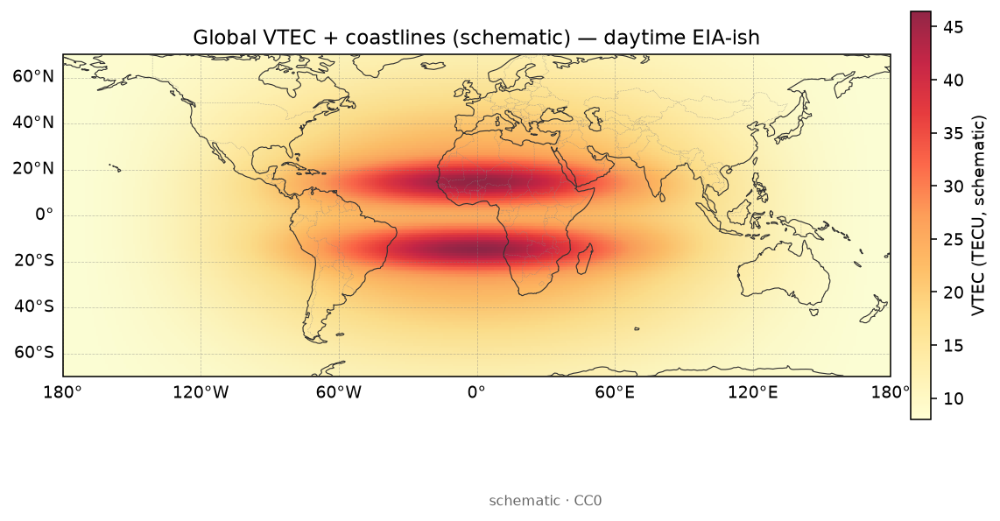
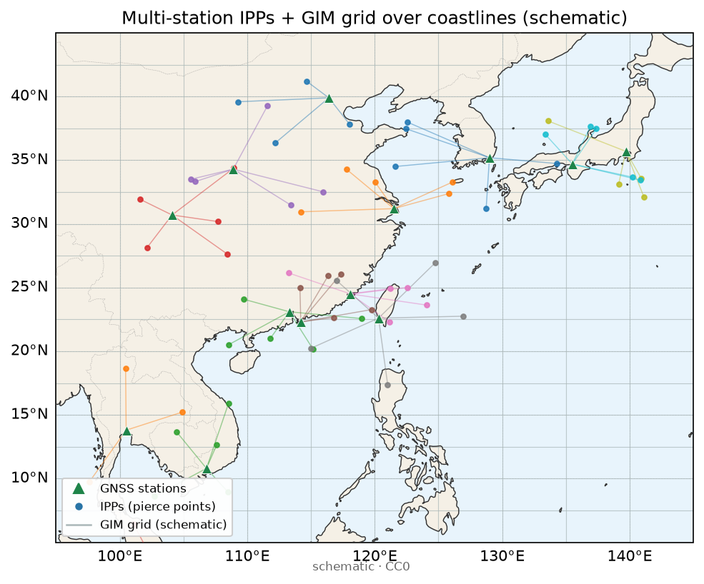

# 18 · 实验课：三家 GIM 比一比

> 前置：[03](./03-gim-ionex.md)、[16](./16-practice-one-day-tec.md) 路线 A；建议穿插 [09](./09-dcb-biases-deep.md)、[14](./14-space-weather-case.md)。  
> 目标：同一天、同一时刻，比较至少**两个**（理想**三个**）IGS 分析中心的 GIM，量化「产品差」有多大。  
> 零基础友好：下面从「GIM 是什么」重讲一遍，再带你逐步做实验、填表、写结论。

---

## 0. 为什么要做这个实验（先建立动机）

读论文或做同化/评估时，人们常把某一个 IONEX 文件当成「真理地面」。  
本实验要你亲眼看到：

> **分析中心之间本来就有数 TECU 量级的差别。**  
> 没有这个数感，后面谈「我的算法改进了 1 TECU」很容易自嗨。

**类比 1：三家气象局的雾图**  
同一时刻，三家单位用不同站网、不同平滑、不同填补空洞办法画「全国雾厚图」。你若只拿其中一张当标准答案去打分另外两张，分数会骗人。

**类比 2：三把尺子量同一张桌子**  
尺子起点（偏差基准）、刻度分辨率、有没有人用手抖着读数——都会让结果差一截。GIM 里的 DCB 约束、球谐阶数、时间间隔，就像这些尺子差异。

本课结束时你应能：

1. 说出 GIM / IONEX / 分析中心各是什么；  
2. 独立下载至少两家同日产品；  
3. 插值到同一经纬网并画出 A、B、A−B；  
4. 报告 RMSE、均值、|Δ|>5 TECU 面积比例；  
5. 用诚实句式写不确定性（而不是「谁绝对正确」）。

---

## 1. 零基础概念铺垫

### 1.1 GIM 是什么

**GIM = Global Ionosphere Map（全球电离层地图）**。  
通常展示的是某一时刻全球（或区域）的 **VTEC**（竖直电子含量），单位 **TECU**。

它不是卫星拍的照片，而是：很多 GNSS 站算出的斜路径 TEC，经过映射、偏差估计、数学展开（格网或球谐等）填成的「分析产品」。



> **看图要点**
> - **看什么**：一张 GIM 式 VTEC 场挂上海岸后，日夜与低纬高值带大概长什么样。
> - **别误判**：产品长相示意 ≠ 某一家「物理真理」；大洋光滑常来自先验。
> 图源：自制示意场 + Natural Earth 海岸线（非实测）。



> **看图要点**
> - **看什么**：格网场与 IPP 采样点疏密——点稀处最容易出现中心间产品差。
> - **别误判**：格距漂亮 ≠ 有效分辨率；产品差 ≠ 物理真理。
> 图源：自制示意场 + Natural Earth 海岸线（非实测）。

### 1.2 IONEX 是什么

**IONEX** 是交换这种地图的一种常用文本/压缩文件格式。  
你在 `CDDIS-IONEX` 下载到的 `.INX` / `.ionex` / 带 `GIM` 字样的长文件名，多半就是它。

用本仓库工具读：`ionex`、`ionex-rs`、`ionex_reader`、`ionex-analyzer`；拉取辅助：`ionex-downloader`。

### 1.3 「分析中心」是什么

IGS（国际 GNSS 服务）体系里，多家机构各自做电离层产品，再可能有综合产品。教学里你常听到 CODE、JPL、CAS、UPC、WHU、GFZ……  
具体哪天有哪些文件，以 `CDDIS-IONEX`（以及 `JPL-IONEX-Rapid`、`ROB-IONEX-Products`、`GFZ-Global-Ionosphere-Maps`、`UPC-IONEX-Archive`、`WHU-IGS-Ionosphere-AC`、`UWM-IGS-Iono-Combination`）实有目录为准——**不要背死文件名，要会看目录。**

相关门户与工作组也可对照：`IGS-Ionosphere-WG`、`IGS-Products`、`CODE-AIUB-Analysis-Center`。

### 1.4 为什么两家会吵架（产品差来源清单）

| 来源 | 人话 | 你实验里可能看到的现象 |
|---|---|---|
| 站网与加权 | 用的站不一样、权重不一样 | 海洋/极区差更大 |
| 数学模型 | 球谐阶数、格网步长、时间间隔 | 细节多少不同，边缘振荡不同 |
| DCB/基准约束 | 尺子起点钉在不同卫星/接收机 | 全球平均偏高/偏低一截 |
| 平滑与约束 | 有人把图熨得更平 | 暴时小结构被抹掉程度不同 |
| 空洞填补 | 数据稀区怎么「编」完 | 差分离群出现在南半球海洋等 |
| 产品代次 | 最终 vs 快速 vs 预报 | 同「中心」不同代次也能差一截 |

**课堂纠错**：差分大 ≠ 暴扰物理强。先做**安静日**基线，再做扰动日，才知道「中心间差异是否暴时系统性变大」。


> **看图要点**
> - **看什么**：相减后相对基线的正负笔迹——先建立「差分图在比什么」的直觉。
> - **别误判**：中心 A−B 的产品差 ≠ storm−quiet 的物理扰动；两套差分勿偷换。
> 图源：自制 CC0 示意。

---

## 2. 实验设计（对照科学）

### 2.1 你要回答的科学问题

1. 安静日，两/三家 GIM 的典型 RMSE 与均值偏差大概多少 TECU？  
2. 扰动日，中心间差异是否明显变大？变大发生在哪些纬度带？  
3. 若用某一家 GIM 当「真值」评估自建算法，应如何表述不确定性？

### 2.2 最小实验配置（必做）

| 项 | 最低要求 | 加分 |
|---|---|---|
| 日期 | 1 个安静日 | +1 个扰动日 |
| 分析中心 | 2 家 | 3 家 |
| 时刻 | 每日期至少 1 个共同历元（如 12:00 UTC） | 一天内 4 个历元看日变 |
| 区域 | 全球统计 + 可选中国区子集 | 低纬/中纬/高纬分带统计 |
| 图 | A、B、A−B | 再加直方图 |
| 表 | RMSE、均值、|Δ|>5 TECU 比例 | 分纬度带表 |

### 2.3 工具与数据（只用真实条目名）

- 数据：`CDDIS-IONEX`（主）、备选 `JPL-IONEX-Rapid`、`ROB-IONEX-Products`、`GFZ-Global-Ionosphere-Maps`、`UPC-IONEX-Archive`、`WHU-IGS-Ionosphere-AC`  
- 注册：[`docs/data-access.md`](../data-access.md)、`NASA-Earthdata-Login`  
- 读写：`ionex`、`ionex-rs`、`ionex_reader`、`ionex-analyzer`、`ionex-downloader`  
- 列表：[`lists/10-gnss-datasets.md`](../../lists/10-gnss-datasets.md)、[`lists/01-ionosphere.md`](../../lists/01-ionosphere.md)  
- 地磁选日：`GFZ-Kp-Index`、`NOAA-SWPC-Planetary-K`、`NOAA-SWPC`

---

## 3. 逐步实验手册（跟做）

### 步骤 0 · 建实验笔记（15 分钟）

复制：

```
实验 18：GIM 对比分析中心
安静日：YYYY-MM-DD（选日依据：Kp≤…，来源 GFZ-Kp-Index）
扰动日：YYYY-MM-DD（可选；SYM-H/Kp 依据：…）
中心 A：________  文件：________
中心 B：________  文件：________
中心 C：________  文件：________（可选）
读库：ionex / ionex_reader / …（圈一）
共同历元：__ : __ UTC
插值网格：Δlon=__°  Δlat=__°
```

### 步骤 1 · 选日（30 分钟）

1. 打开 `GFZ-Kp-Index` 或 `NOAA-SWPC-Planetary-K`。  
2. **安静日**：连续数小时 Kp 较低、无著名大暴的一天。  
3. **扰动日**（加分）：选你在 [14](./14-space-weather-case.md) 用过的事件日，或公开磁暴日。  
4. 把日期写进笔记；禁止「随便选个有文件的日子」却不写地磁依据。

### 步骤 2 · 下载（45–90 分钟，含注册）

1. 走 `CDDIS-IONEX` + Earthdata 流程（见 data-access）。  
2. 同一天下载至少两家分析中心文件。  
3. 记录：最终/快速/预报代次；文件名全文；解压后字节数。  
4. 若某中心当天缺失：换中心或换日，**不要拿不同代次硬冒充同级对比**而不加标注。

**故障排除**

| 现象 | 处理 |
|---|---|
| 401/403 | 重做 `NASA-Earthdata-Login` 授权 |
| 只有一家 | 换日或加 `JPL-IONEX-Rapid` / `ROB-IONEX-Products` 等入口 |
| 历元对不齐 | 选两文件都有的整点；或时间插值并在笔记声明 |
| 长文件名眼花 | 按目录说明识别 AC 缩写与 `GIM`/`INX` |

### 步骤 3 · 读入与对齐网格（60 分钟）

1. 用选定库读取 VTEC 三维/二维数组（经度、纬度、时间）。  
2. 定义公共网格，例如：经度 −180〜180 步长 2.5°，纬度 −87.5〜87.5 步长 2.5°（步长可按产品原生网格调整，但 **A、B 必须同一套**）。  
3. 对每个中心双线性（或库默认）插值到公共网格。  
4. 检查：无全 NaN；陆地轮廓大致正确；单位是 TECU 不是 TECU×10 之类离谱缩放。

**对齐口诀**：先齐时间，再齐网格，最后才相减。

### 步骤 4 · 出图（45 分钟）

对每个选定历元：

1. **图 A**：中心 A 的 VTEC  
2. **图 B**：中心 B 的 VTEC  
3. **图 A−B**：差分（建议对称色标，例如 −10〜+10 TECU，按实际分布调）  
4. 每张图必须有：日期时刻 UTC、中心名、单位 TECU、色标  

加分：差分直方图（横轴 TECU，纵轴格点计数）。

### 步骤 5 · 统计（45 分钟）

在公共网格有效点上计算（教学公式即可）：

$$
\begin{aligned}
\mathrm{Bias} &= \overline{A-B} \\
\mathrm{RMSE} &= \sqrt{\overline{(A-B)^2}} \\
P_{5} &= \frac{\#\{|A-B|>5\,\mathrm{TECU}\}}{\#\{\text{有效点}\}}
\end{aligned}
$$

建议再算：

- 按纬度带：低纬 (|φ|<30°)、中纬 (30°–60°)、高纬 (>60°) 的 RMSE；  
- 中国区子集（若你关心业务）：例如 70°E–140°E，15°N–55°N。

填表模板：

| 日期类型 | 历元 UTC | A vs B | Bias (TECU) | RMSE (TECU) | P(|Δ|>5) | 低纬RMSE | 中纬RMSE | 高纬RMSE |
|---|---|---|---|---|---|---|---|---|
| 安静 | 12:00 | CODE−JPL |  |  |  |  |  |  |
| 扰动 | 12:00 | CODE−JPL |  |  |  |  |  |  |

（中心名换成你真实下载的。）

### 步骤 6 · 解读（30 分钟，强迫写字）

对着图和表回答：

1. 安静日全球 RMSE 大概落在什么量级？（写你的数，不抄别人论文）  
2. 差分大户在海洋、极区还是赤道？是否像「数据稀 + 平滑策略」区？  
3. 扰动日 RMSE / P5 是否上升？若上升，是全球均匀变脏，还是某纬度带主导？  
4. 若你用中心 A 当真值，中心 B 当「竞赛选手」，安静日就会吃到约 RMSE 量级的「产品噪声地板」——这对「改进 1 TECU」意味着什么？

### 步骤 7 · 可选第三家与业务产品（余量）

- 第三家 IGS 分析中心重复步骤 3–5，做两两对比或相对中位数。  
- 业务近实时：`DLR-IMPC`、`ESA-TIO-NRT-TEC`、`NOAA-SWPC-GloTEC`——**代次与算法不同**，对比时必须在结论写「非同级 IGS 最终产品」。  
- 综合产品思考：`UWM-IGS-Iono-Combination` 等条目提醒你「综合」本身也是一种产品选择。

---

## 4. 讨论题（实验报告必答）

1. 安静日与扰动日，哪一天中心间差异更大？你的表是否支持？  
2. 差异主要出现在高纬、赤道，还是数据稀疏区？  
3. 若你用 GIM 做「真值」评估自建算法，该如何表述不确定性？（请写 3–5 句可粘进论文的话）  
4. Bias 长期接近非零，更可能是「谁错了」还是「基准/DCB 策略不同」？联系 [09](./09-dcb-biases-deep.md)。  
5. 时间分辨率粗（如 2 h）时，暴相快速变化会如何夸大或掩盖中心差？

**推荐表述范例（可改写）**：

> 「安静日，A 与 B 最终 GIM 在公共 2.5° 网格上的 RMSE 为 X TECU，|Δ|>5 TECU 的格点占比为 Y%。扰动日同口径 RMSE 为 X₂。因此，以单一分析中心 GIM 为参考时，小于约 X TECU 的『改进』需谨慎解释，并应报告多中心一致性。」

---

## 5. 交什么（验收清单）

- [ ] 安静日：A 图、B 图、A−B 图（合规标注）  
- [ ] 一张统计表（Bias / RMSE / P5；有扰动日则两行以上）  
- [ ] 八句结论（含：数感、空间分布、对「真值」用法的警告、局限）  
- [ ] 工具与文件名列表（`PROJECTS.json` 的 `name` + 真实下载文件名）  
- [ ] （加分）直方图或分纬度带表；（加分）扰动日全套  

然后可以进入 [14](./14-space-weather-case.md) 做事件复盘，或回 [17](./17-roadmap-beginner-to-expert.md) 把「偏差与产品」自测打到 3。

---

## 6. 常见翻车点

1. **不同代次（最终 vs 快速）当同级比** —— 必须标注。  
2. **网格未对齐就相减** —— 假差分花纹。  
3. **色标不对称且单位缺失** —— 审阅退回。  
4. **只比一张漂亮差分、不给 RMSE** —— 没有数感。  
5. **把海洋高纬的大差分直接写成「发现物理结构」** —— 先怀疑空洞与平滑。  
6. **中心名凭记忆拼写错误** —— 以文件与目录为准。  
7. **用业务 NRT 产品打 IGS 最终产品，却不声明** —— 苹果打橙子。

---

## 7. 课堂小测验

**Q1.** 安静日两家 GIM 差 4–8 TECU RMSE，是否说明其中一家坏了？  
<details><summary>参考答案</summary>
不一定。这常是站网、平滑、DCB 基准与空洞策略造成的产品差。应分区域看，并在评估里当作不确定性地板。
</details>

**Q2.** 为什么实验要求「同一公共网格」？  
<details><summary>参考答案</summary>
原生网格可能不同；不对齐就相减会产生插值伪影，被误认为物理差。
</details>

**Q3.** Bias 为 +3 TECU、RMSE 为 6 TECU，怎么用一句话解释？  
<details><summary>参考答案</summary>
平均而言 A 比 B 系统性偏高约 3 TECU，而点对点离散（含系统性）的均方根约 6 TECU。
</details>

**Q4.** 评估自建区域地图时，只拿一家快速 GIM 当天文件当真理，风险？  
<details><summary>参考答案</summary>
快速产品噪声与滞后更大；且单中心偏差会吸进你的「误差」。至少安静日做多中心，或报告相对多中心的散布。
</details>

**Q5.** 本实验与第 14 课差分（暴日−对照日）有何不同？  
<details><summary>参考答案</summary>
14 课减的是「时间/地磁状态」；18 课减的是「分析中心」。一个谈空间天气形态，一个谈产品不确定性。做事件复盘时两者都要。
</details>

---

## 8. 和前后课的衔接

| 若你…… | 去…… |
|---|---|
| 还不会下载/出单张 GIM | [16](./16-practice-one-day-tec.md) 路线 A |
| 想理解绝对偏差从哪来 | [09](./09-dcb-biases-deep.md) |
| 想把产品差写进磁暴结论 | [14](./14-space-weather-case.md) |
| 想安排多周进度 | [17](./17-roadmap-beginner-to-expert.md) |
| 想从论文找对比代码 | [15](./15-from-paper-to-code.md) |

---

## 9. 一页速查：实验日流程

```
选安静日（+可选扰动日）→ CDDIS-IONEX 下 2–3 家
  → ionex* 读入 → 公共网格插值
  → 画 A / B / A−B → 算 Bias、RMSE、P5（+分带）
  → 填表 → 写八句结论（含不确定性表述）
  → 归档文件名与 PROJECTS.json 工具名
```

**记住一句话**：先量「尺子之间差多少」，再声称「我比真理改进了多少」。

---

## 10. 新手操作细节：插值与统计时别踩的坑

### 10.1 经度「掉头」

有的文件经度是 0°–360°，有的是 −180°–180°。相减前统一：

- 把所有经度映射到同一区间；  
- 画图时海岸线才对得上；  
- 否则差分图会在日界线附近出现一条假「裂缝」。

**类比**：两张世界地图，一张从太平洋中间切开，一张从大西洋切开——叠在一起前先把切口对齐。

### 10.2 纬度两端的夸张点

极区格点少、观测几何差，平滑策略不同会让 |A−B| 爆表。教学统计可以：

- 报告「全球」与「|φ|<60°」两套 RMSE；或  
- 明确「高纬单独一列，不并进全球平均值骗人」。

### 10.3 NaN 与填补

若一家在某格点是填充值、另一家是观测约束较强的值，差分会脏。处理原则：

1. 先读清 IONEX 里缺测/哨兵值怎么表示；  
2. 只在两家都有效的格点上统计；  
3. 在结论写「有效格点占比」。

### 10.4 「改进了 1 TECU」如何对照本实验

假设你安静日测得 A vs B 的 RMSE ≈ 5 TECU。  
那么你自建算法相对 A 的 RMSE 若从 6.0 降到 5.2，很亮眼；若从 5.1 降到 4.9，则可能仍埋在产品噪声里——必须多中心或独立测高仪/掩星交叉（见 [07](./07-ionosonde-occultation.md)）。

---

## 11. 八句结论范文（结构可抄，数字必须换成你的）

1. 本实验在安静日 YYYY-MM-DD 的 UU:UU UTC，比较了中心 A 与 B 的最终 GIM。  
2. 公共网格为 Δlon×Δlat，有效格点占比 Z%。  
3. Bias ≈ … TECU，RMSE ≈ … TECU，|Δ|>5 TECU 占比 ≈ …%。  
4. 差分较大区域主要出现在……（极区/海洋/赤道某扇区）。  
5. （若有）扰动日同口径 RMSE 为 …，相对安静日……（升高/接近）。  
6. 因此，以单一 GIM 为真值时，小于约 RMSE 量级的「精度宣示」需要多中心支持。  
7. 局限：未统一评估 DCB 产品文件；时间分辨率限制了对快速暴相的刻画。  
8. 下一步：把该不确定性地板写进 [14](./14-space-weather-case.md) 事件结论，或用于约束自建地图的验证话术。

---

## 12. 与路线图的验收关系

完成本课并达到「表 + 图 + 八句」后，可在 [17](./17-roadmap-beginner-to-expert.md) 中：

- 将「偏差与产品」自测至少打到 **3（良好）**；  
- 勾选能力检查表中「两家 IGS GIM 可差数 TECU」与「完成 18 课统计表」两项。

未交 RMSE 表者，不建议在周报写「已理解产品不确定性」。
