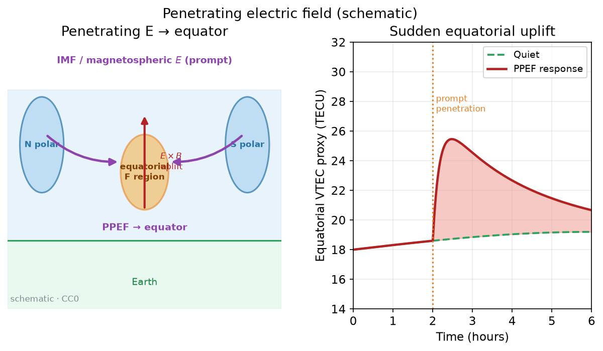
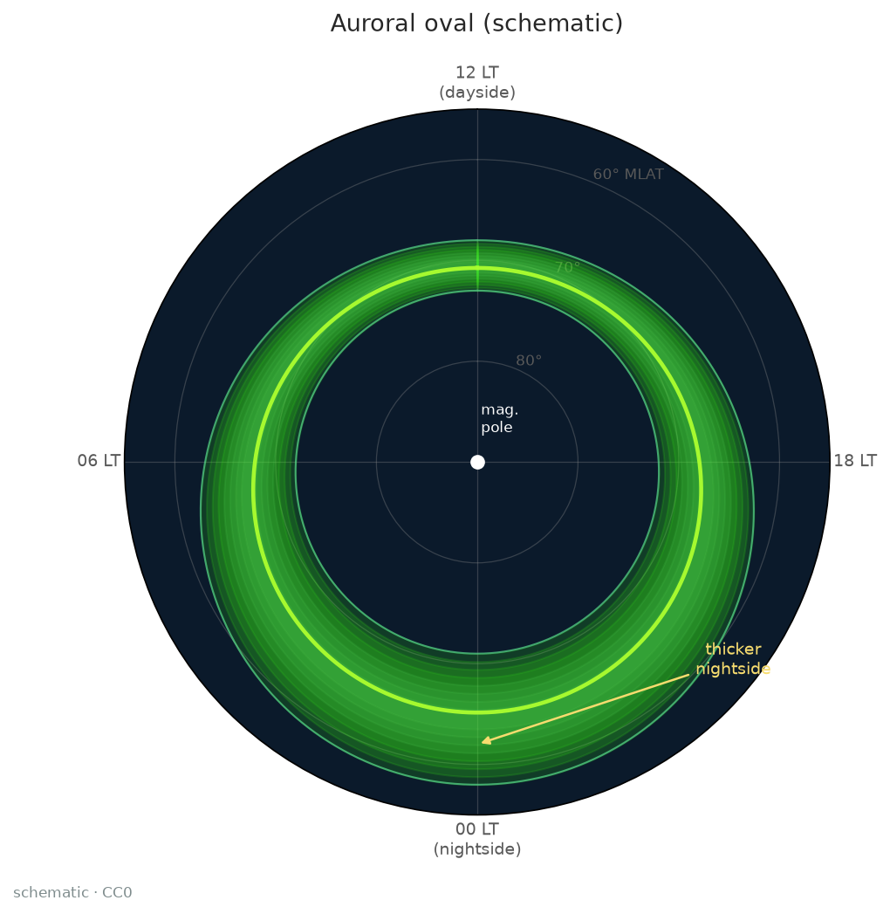
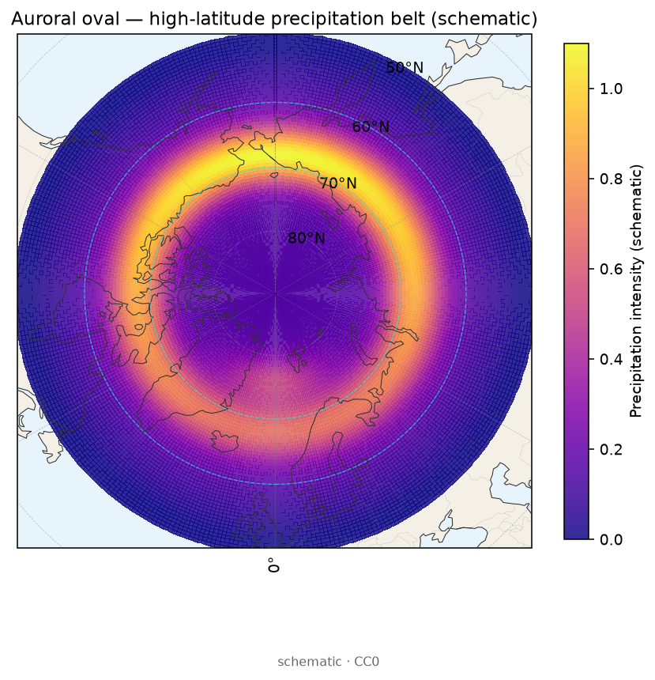

# 20 · 磁暴与 TEC：穿透电场、扰动发电机、成分鼓包与正/负相

> **课堂定位**：现象专题第 2 课。前置：[19](./19-phenomena-overview.md)、[03](./03-gim-ionex.md)、[14](./14-space-weather-case.md)。  
> **学完应能**：解释正/负相为何可分区并存；口述 PPEF、DDEF、O/N₂ 鼓包各自「何时何处推动 TEC」；用 GIM 差分 + SYM-H 完成可复核分析。  
> **双主线**：① 机制因果链；② 差分与对齐操作。模式（`TIE-GCM`/`SAMI3-4.00`）仅作旁注，报告主线仍是观测。

---

## 1. 开场：同一场暴，升与塌可以同时对

> **看图要点**
> - **机制**：相对安静基线，主相可先正后负（或分区反号），残差才是「暴的签名」。
> - **观测签名**：红填＝正相增强，蓝填＝负相耗空；转折常落后于驱动谷值。
> - **分析用法**：先画 storm−quiet，再贴 PPEF/DDEF/成分标签；禁止只贴一张未差分图。
> 图源：本仓库自制示意（非真实事件数据）。

> **看图要点**
> - **机制**：初相/主相/恢复相时间尺度不同；正相偏快，负相常拖恢复相。
> - **观测签名**：上板增强鼓包、下板延迟耗空——可并存于不同纬带。
> - **分析用法**：与 SYM-H 谷值竖线对齐，写清「相对谷值超前/滞后几小时」。
> 图源：本仓库自制示意（非实测）。

值班群常见吵架：甲看日侧低纬增强喊正相，乙看中纬夜侧掉了喊负相——**两人可以同时正确**。电离层暴不是全球同号旋钮。

| 必须填的格子 | 内容 |
|---|---|
| 符号 | 正相（增强）还是负相（耗空） |
| 哪里 | 磁纬带、经度扇区、日/夜侧 |
| 何时 | 相对 SYM-H 谷：初相/主相/恢复相 |
| 哪条链 | PPEF？DDEF？成分鼓包？风场抬升？ |
| 证据 | 哪家 GIM、何种对照、有无 foF2 / O/N₂ |

**厨房类比**：正相＝某些朝向雾被吹浓；负相＝富分子空气抬到 F 层复合加快雾变稀。

### 交付物

1. [ ] 定义正/负相（相对安静对照）。  
2. [ ] 口述 PPEF → 日侧低纬正相（≥4 步）。  
3. [ ] 口述成分鼓包 → 中纬负相（≥4 步）。  
4. [ ] 区分主相快速响应 vs 恢复相延迟（DDEF）。  
5. [ ] 跑完 §6 剧本并写半页结论。  
6. [ ] 点名指数与 GIM 相关 `name` ≥6。

---

## 2. 词表

| 术语 | 人话 |
|---|---|
| 正相 / 负相 | 相对对照 TEC/NmF2 升 / 降 |
| SYM-H / Dst / Kp | 环电流与活动档；SYM-H 钉谷值 |
| PPEF | 高纬电场穿透到低纬；主相日侧快速正相常见驱动 |
| 欠/过屏蔽 | 区电流屏蔽滞后或过头 |
| DDEF | 暴时风改低纬发电机；延迟、可拖到恢复相 |
| 成分鼓包 / O/N₂ | 富 N₂ 空气抬到 F 区 → 复合↑ → 负相 |
| 喷泉 / EIA | PPEF 可加强或变形双峰 |

---

## 3. 三条主因果链

真实事件常**同时**跑多条，故地图上正负分区。

### 链 A — PPEF（主相、偏快、日侧低纬常正）

> **看图要点**
> - **机制**：IMF/磁层电场在欠屏蔽时穿到低纬，日侧东向 E 加强 → E×B 上涌。
> - **观测签名**：主相附近赤道/低纬 VTEC 快速抬升；可伴 EIA 峰极移。
> - **分析用法**：无「快、日侧、低纬正」就不要硬贴 PPEF；对照右板时间尺度。
> 图源：本仓库自制示意（非实测矢量场）。

口诀「风–穿–东–喷–峰–正」：Bz 南向 → 穿透 → 日侧东向 E → 喷泉加强 → 日侧低纬正相。时间偏跟主相。

### 链 B — DDEF（延迟、可反号、拖恢复相）

口诀「热–风–电–拖–变号」：高纬加热改风 → 扰动发电机 → 低纬电场偏移 → TEC **滞后**演变。

| | PPEF | DDEF |
|---|---|---|
| 相对主相 | 偏快 | 偏慢 |
| 驱动 | 磁层电场穿透 | 热层风→发电机 |
| 写法 | 「主相附近日侧正斑块，疑穿透」 | 「谷值后数小时仍演变，疑扰动发电机」 |

### 链 C — 成分鼓包（中纬负相化学心脏）

口诀「热–环流–富分子–O/N₂↓–复合↑–负」。旁证：foF2/NmF2 降、O/N₂ 图（若有）。

> **看图要点**
> - **机制**：暴时 PPEF 可拉高/极移气候双峰；差分才能把「气候」和「正相」分开。
> - **观测签名**：日侧双峰相对对照更高或更极向；夜侧另议。
> - **分析用法**：同 UT（或同 LT）切面做 ΔVTEC，勿把气候双峰本身当正相。
> 图源：本仓库自制示意（非实测）。

---

## 4. 指数时间线 + GIM 差分

> **看图要点**
> - **机制**：Kp 档活动强度；SYM-H/Dst 钉环电流主相谷与恢复。
> - **观测签名**：SSC/主相窗内 Kp 抬高、SYM-H 深谷，其后缓慢回升。
> - **分析用法**：先钉谷值 UTC，再叠 TEC/差分；写「相对谷值 ±N 小时」。
> 图源：本仓库自制示意（非实测）。

> **看图要点**
> - **机制**：暴时能量粒子沉降扩宽极光卵，夜侧往往更厚、更向赤道扩张。
> - **观测签名**：磁纬–地方时极坐标上卵状亮带；夜侧外缘更低纬。
> - **分析用法**：高纬 TEC/闪烁讨论先标 MLAT 与 LT；与中低纬 PPEF 故事分区写。
> 图源：本仓库自制示意（非实测）。

> **看图要点**
> - **机制**：磁层粒子沿磁力线沉降，形成高纬极光卵亮带；暴时可扩宽并向赤道扩张。
> - **看什么**：卵状亮环相对格陵兰/北欧/北美海岸的落点与宽度。
> - **别误判**：示意强度场非瞬时实测卵；勿与中低纬 PPEF ΔTEC 故事混写。
> 图源：本仓库自制示意场 + Natural Earth 海岸线（非实测事件）。

> **看图要点**
> - **机制**：storm−quiet 的 ΔVTEC 在地图上分区正负，对应 PPEF/DDEF/成分等不同纬带响应。
> - **看什么**：海岸轮廓上红/蓝斑块落在哪一洲、哪一侧；相对 SYM-H 谷的时间窗要另轴对齐。
> - **别误判**：这是教学示意场，不是某次暴的实测差分；空洞/平滑区勿当新物理。
> 图源：本仓库自制示意场 + Natural Earth 海岸线（非实测事件）。

1. 用 `GFZ-Kp-Index`、`NASA-OMNIWeb` 钉：扰动开始、SYM-H 谷、恢复。  
2. 选对照（Q/R/C），写局限。  
3. `CDDIS-IONEX` 取**同一 AC** 暴日与对照。  
4. `DiffIonMap` 等做 ΔVTEC + 与 SYM-H 同轴。

| 候选链 | 期望签名 |
|---|---|
| PPEF | 主相附近日侧低纬正 ΔVTEC |
| DDEF | 谷值后仍演变；可反号 |
| 成分鼓包 | 中纬持续负相；foF2 降更贴切 |

---

## 5. 九步剧本（交作业标准）

1. 事件 UTC 与研究区。 2. Kp 峰值、SYM-H 谷值与时刻。 3. 对照方案。 4. IONEX `name` 与 AC。  
5. 安静/暴日/差分三图。 6. 读色标正负带。 7. 相对谷值先后。 8. 旁证 foF2/掩星/第二家 GIM。 9. 结论：哪条链、置信度、怀疑。

**读差分注视点**：日夜是否反号？低纬正斑是否贴赤道？中纬负是否成片？海洋空洞是否假热闹？

---

## 6. 边界、错误、工具

| 别和…搞混 | 分流 |
|---|---|
| 赤道泡 / 高 ROTI | 21 课 |
| TID 波列 | 22 课 |
| 耀斑分钟跳 | 23 课 |

**常见错误**：全球平均当正相；混用不同 AC；无对照贴 PPEF；恢复相延迟全叫穿透。  
**工具**：`CDDIS-IONEX`、`DiffIonMap`、`ionex-analyzer`、`GFZ-Kp-Index`、`NASA-OMNIWeb`、`NOAA-SWPC`、`GIRO-DIDBase`、`geospacelab`、`pysatSpaceWeather`。

---

## 7. 测验 · 作业 · 小结

**口答**：PPEF 四步；DDEF 与 PPEF 时间差；负相为何常看 foF2；为何甲乙可同时对。  
**作业**：选一历史暴，完成九步半页；点名 ≥6 个 `name`；禁止只贴未差分全球图。

### 小结与口令

> 先差分，后贴链；先 SYM-H，后故事；正负可以并存，标签不能偷懒。

下一课：[21-equatorial-anomaly-bubbles.md](./21-equatorial-anomaly-bubbles.md)。
