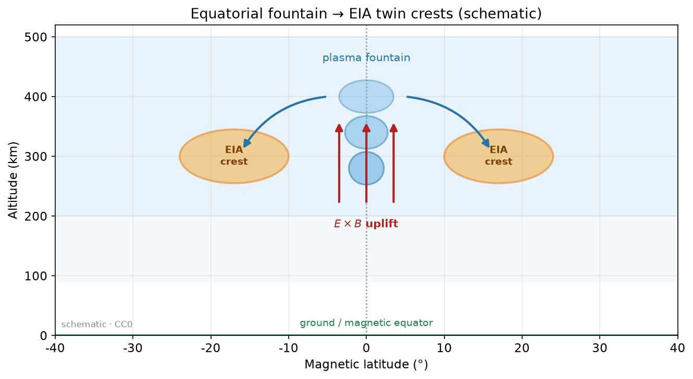
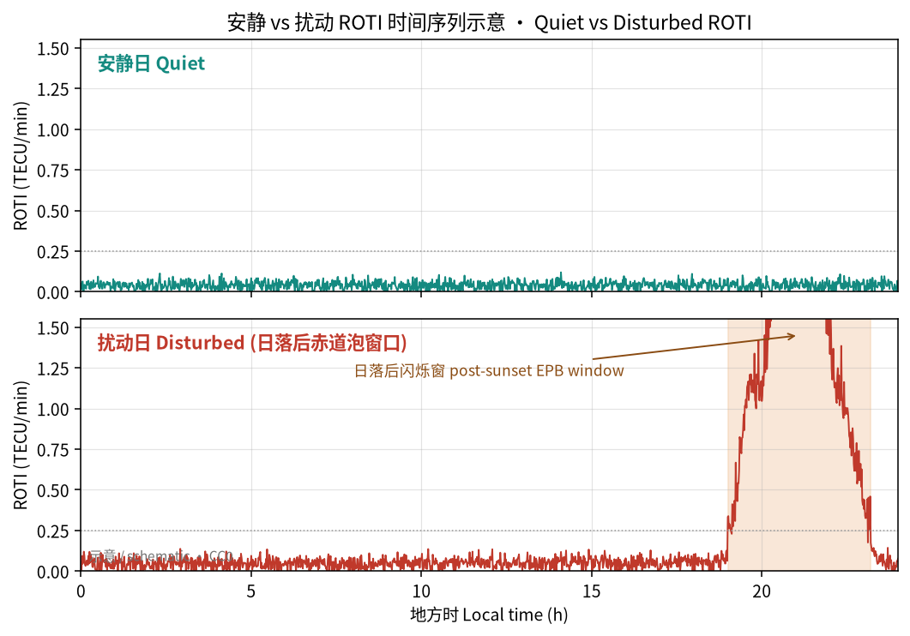
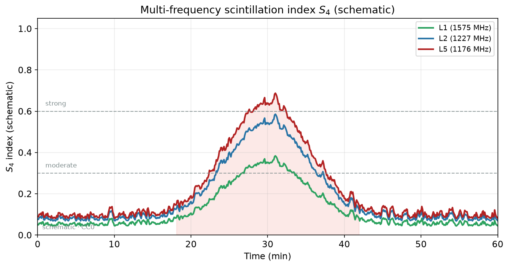
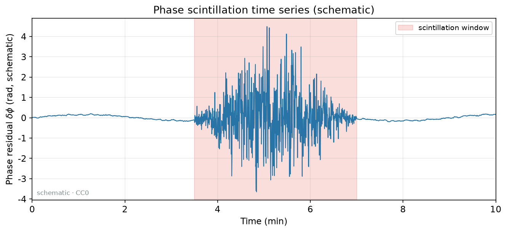

# 21 · 赤道异常与等离子体泡：喷泉、R–T 直觉与 TEC/ROTI 羽状签名

> **课堂定位**：现象专题第 3 课。前置：[19](./19-phenomena-overview.md)、[05](./05-scintillation-roti.md)、[20](./20-storm-tec-analysis.md)。  
> **学完应能**：讲清喷泉如何造就 EIA 双峰；用 R–T 直觉说明 EPB 为何日落后易长；解释 TEC 耗空与 ROTI 羽状为何常成对；按季节/经度/LT 做分析。  
> **双主线**：电动力学原则 + TEC/ROTI 操作。不做完整线性理论；不要求跑通 `SAMI3-4.00`。

---

## 1. 开场：双峰是山，泡是沟

> 图源：本仓库自制示意，非某日实测。先认 EIA 地貌，再谈冲沟（泡）。

> 图源：自制示意。赤道 E×B 上涌后沿磁力线扩散，在 ±15°～±20° 磁纬形成双峰。

| 词 | 是什么 | 典型签名 |
|---|---|---|
| **EIA** | 大尺度双峰（气候+日变化） | VTEC 南北两峰、赤道槽 |
| **EPB** | 叠加的低密度不规则 | 夜侧 TEC 耗空通道、高 ROTI、高 S4、扩展 F |

**第一纪律：先承认 EIA 背景，再谈泡。**

### 交付物

1. [ ] 口述喷泉 E×B → 双峰（≥5 步）。  
2. [ ] 口述 R–T + PRE → 日落后生长窗。  
3. [ ] 解释「TEC 掉口 + ROTI 峰」成对原因。  
4. [ ] 说明季节/经度不能照抄别人论文。  
5. [ ] 跑完 §6 工作流。  
6. [ ] 点名 ≥8 个 `PROJECTS.json` 的 `name`。

---

## 2. 词表

| 术语 | 人话 |
|---|---|
| 喷泉 / E×B | 赤道上涌再沿磁力线扩散 |
| PRE | 日落后向上漂移预反转增强 |
| EPB / 羽状 plume | 低密度上升通道及其扩展 |
| R–T | 「重上轻下」不稳定性类比 |
| 扩展 F / ROTI / S4 | 测高仪模糊迹；TEC 抖；幅度闪烁 |
| 磁纬 / LT | `apexpy`；泡多在日落后 |

---

## 3. 喷泉与 EIA

口诀「东–上–散–峰–槽」：

1. 日侧低纬常有**东向电场**；  
2. 赤道 B 近水平 → **E×B 向上**；  
3. 赤道 F 等离子体被抬升；  
4. 沿磁力线向南北扩散；  
5. 磁纬约 ±10°～±20° 成**双峰**，赤道成**槽**。

必须用**磁纬**思维（地理赤道与磁赤道有偏角）。确认动作：安静日 `CDDIS-IONEX` → 日侧纬度剖面 → 磁纬重标 → 记峰位与槽深。

暴时 PPEF（20 课）可加强/极移双峰——那是调制，不是「双峰＝泡」。

> 图源：自制示意。夜侧整体偏低；找泡请看日落后窗口，勿在 LT=14 硬找 EPB。

---

## 4. R–T 直觉与 EPB

水杯类比：重叠轻，界面受扰可上涌成泡。日落后底部 F 层在合适条件下进入不稳定窗：

1. 需要陡的向上密度梯度（底部 F）；  
2. 向上漂移/抬升有利（**PRE** 常被讨论）；  
3. 生长需要时间 → 多在日落后数小时；  
4. 非线性：耗空通道、羽状、泡壁陡梯度 → 闪烁。

$$
\text{PRE 上涌} \Rightarrow F\text{ 抬高} \Rightarrow R\text{–}T\text{ 生长率↑} \Rightarrow \text{EPB 更可能}
$$

泡沿磁力线映射到南北低纬，故常成「通道/羽」而非孤立圆斑。

---

## 5. 为何 TEC↓ 与 ROTI↑ 常成对？

> 图源：自制示意。低密度泡切断 GNSS 射线 → 相位/幅度闪烁；ROTI 捕捉 TEC 变化率起伏。

- **TEC 掉口**：路径穿过低密度耗空 → 柱含量下降。  
- **ROTI 峰**：泡壁梯度陡、内部不规则 → 变化率抖。  
- 二者成对是几何+不规则的自然结果；**只有 GIM 略凹、无 ROTI，证据弱**。

> 图源：自制示意。扰动日在日落后窗口出现 ROTI 爆发——教学用，非某次实测事件。

> 图源：自制示意。安静弧段突然进入强相位抖窗——与 ROTI/S4 同看。

> 图源：自制示意。夜侧低纬羽状/双带热点提示 EPB 活动区，需与 TEC 掉口对照。

> 图源：自制示意。泡壁不规则导致幅度闪烁指数升高；与 ROTI 同窗互相印证。

---

## 6. 季节、经度与工作流

泡发生率随季节、经度扇区、太阳活动强烈变化。**禁止**把大西洋扇区论文结论直接贴到东亚夜而不改 LT/季节声明。

**工作流**：

1. 选夜侧 LT 窗与磁纬带；写季节/扇区。  
2. VTEC：安静对照 + 事件日，看耗空通道。  
3. ROTI（`igs-roti` / `IonoMoni` / `OASIS`）同窗是否羽状高。  
4. 可选：扩展 F（`GIRO-DIDBase`）、S4（`scintkit` 等）。  
5. 与 20 课分流：大尺度暴斑块 ≠ 泡丝。  
6. 结论写支持/存疑与产品 `name`。

**对照表**：

| | EIA 变形 | EPB | 风暴中纬负相 |
|---|---|---|---|
| 尺度 | 大、双峰 | 通道/羽、夜侧 | 中纬成片 |
| ROTI | 可不高 | 常高 | 视情况 |
| LT | 日侧也见双峰 | 日落后为主 | 随暴相 |

---

## 7. 误解 · 工具 · 测验

| 误解 | 纠正 |
|---|---|
| 双峰＝泡 | 双峰是 EIA；泡是叠加耗空 |
| 白天 GIM 凹＝泡 | 先查 LT；GIM 平滑易假 |
| ROTI 高＝TEC 高 | 常相反：壁陡而柱低 |
| 欧洲中纬网硬找 EIA | 磁纬不够；换低纬产品 |

**工具**：`CDDIS-IONEX`、`INPE-TEC-Maps-IONEX`、`igs-roti`、`IonoMoni`、`OASIS`、`Okoh-MATLAB-ROT-ROTI`、`Seemala-GPS-TEC`、`GIRO-DIDBase`、`apexpy`、`scintkit`。

**口答**：喷泉五步；PRE 为何重要；TEC↓+ROTI↑；为何要磁纬。

### 口令

> 先山后沟；先 LT 后标签；TEC 掉口要对 ROTI。

下一课：[22-tid-traveling-disturbances.md](./22-tid-traveling-disturbances.md)。
