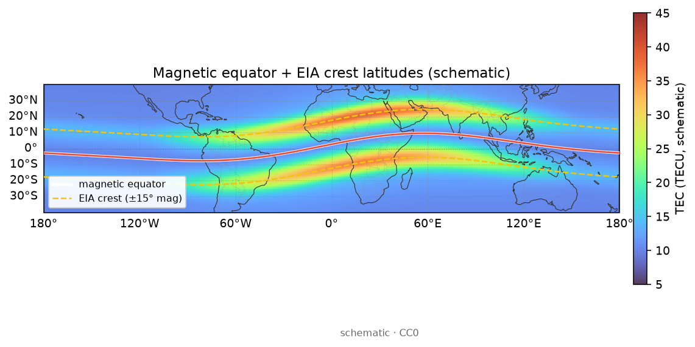
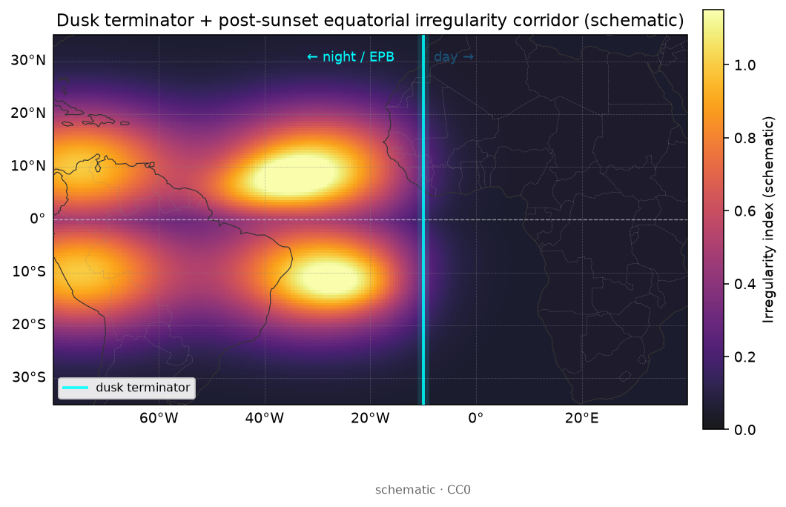

# 21 · 赤道异常与等离子体泡：喷泉、R–T 直觉与 TEC/ROTI 羽状签名

> **课堂定位**：现象专题第 3 课。前置：[19](./19-phenomena-overview.md)、[05](./05-scintillation-roti.md)、[20](./20-storm-tec-analysis.md)。  
> **学完应能**：讲清喷泉如何造就 EIA 双峰；用 R–T 直觉说明 EPB 为何日落后易长；解释 TEC 耗空与 ROTI 羽状为何常成对；按季节/经度/LT 做分析。  
> **双主线**：电动力学原则 + TEC/ROTI 操作。不做完整线性理论；不要求跑通 `SAMI3-4.00`。

---

## 1. 开场：双峰是山，泡是沟

> **看图要点**
> - **机制**：喷泉上涌后沿磁力线扩散，在约 ±15°～±20° 磁纬堆成双峰、赤道成槽。
> - **观测签名**：磁纬剖面「两峰一槽」；地理赤道与磁赤道有偏角。
> - **分析用法**：先承认 EIA 地貌，再谈叠加的泡沟；用磁纬重标安静日剖面。
> 图源：本仓库自制示意（非某日实测）。

> **看图要点**
> - **机制**：赤道东向 E → E×B 上涌 → 沿 B 向南北扩散 → 双峰。
> - **观测签名**：侧视高度–磁纬上，赤道抬升柱 + 两侧峰团。
> - **分析用法**：暴时 PPEF（20）可调制喷泉强度/峰位——那是调制，不是「双峰＝泡」。
> 图源：本仓库自制示意（非实测）。

| 词 | 是什么 | 典型签名 |
|---|---|---|
| **EIA** | 大尺度双峰（气候+日变化） | VTEC 南北两峰、赤道槽 |
| **EPB** | 叠加的低密度不规则 | 夜侧 TEC 耗空通道、高 ROTI、高 S4、扩展 F |

**第一纪律：先承认 EIA 背景，再谈泡。**

### 交付物

1. [ ] 口述喷泉 E×B → 双峰（≥5 步）。  
2. [ ] 口述 R–T + PRE → 日落后生长窗。  
3. [ ] 解释「TEC 掉口 + ROTI 峰」成对原因。  
4. [ ] 说明季节/经度不能照抄别人论文。  
5. [ ] 跑完 §6 工作流。  
6. [ ] 点名 ≥8 个 `PROJECTS.json` 的 `name`。

---

## 2. 词表

| 术语 | 人话 |
|---|---|
| 喷泉 / E×B | 赤道上涌再沿磁力线扩散 |
| PRE | 日落后向上漂移预反转增强 |
| EPB / 羽状 plume | 低密度上升通道及其扩展 |
| R–T | 「重上轻下」不稳定性类比 |
| 扩展 F / ROTI / S4 | 测高仪模糊迹；TEC 抖；幅度闪烁 |
| 磁纬 / LT | `apexpy`；泡多在日落后 |

---

## 3. 喷泉与 EIA

口诀「东–上–散–峰–槽」：东向电场 → E×B 向上 → 抬升 → 沿磁力线扩散 → 双峰+槽。必须用**磁纬**思维。

> **看图要点**
> - **机制**：昼侧喷泉强；夜侧产生率下降，双峰削弱。
> - **观测签名**：LT 下午双峰醒目；夜侧整体偏低。
> - **分析用法**：找泡请看日落后窗口，勿在 LT=14 硬找 EPB。
> 图源：本仓库自制示意（非实测）。

> **看图要点**
> - **机制**：喷泉造就南北双峰与赤道槽；海岸线帮助把磁纬地貌对到大洋/陆地。
> - **看什么**：两峰相对磁赤道/海岸的位置与槽深；昼侧窗口更醒目。
> - **别误判**：双峰是 EIA 背景，不是 EPB；勿把示意场当某日实测 GIM。
> 图源：本仓库自制示意场 + Natural Earth 海岸线（非实测事件）。

> **看图要点**
> - **机制**：喷泉相对**磁赤道**对称堆峰；地理赤道与磁赤道有偏角，故峰带随经度扭动。
> - **看什么**：白/红磁赤线与 ±15° 磁纬虚线相对海岸的落点；双峰是否贴虚线。
> - **别误判**：峰带示意不是泡通道；分析须用磁纬（如 `apexpy`），勿只盯地理赤道。
> 图源：本仓库自制示意场 + Natural Earth 海岸线（非实测事件）。

---

## 4. R–T 直觉与 EPB

水杯类比：重叠轻，界面受扰可上涌成泡。日落后底部 F 层：陡向上梯度 + PRE 上涌 → 生长窗 → 耗空通道/羽状/泡壁陡梯度。

$$
\mathrm{PRE}
\Rightarrow F\uparrow
\Rightarrow \gamma_{R\text{-}T}\uparrow
\Rightarrow \mathrm{EPB}
$$

读法（中文在公式外）：PRE 上涌 ⇒ F 抬高 ⇒ R–T 生长率↑ ⇒ EPB 更可能。

泡沿磁力线映射到南北低纬，故常成「通道/羽」。

---

## 5. 为何 TEC↓ 与 ROTI↑ 常成对？

> **看图要点**
> - **机制**：低密度泡切断 GNSS 射线；壁与内部不规则衍射/折射 → 闪烁。
> - **观测签名**：路径过泡 → 柱含量掉口；同时相位/幅度抖。
> - **分析用法**：TEC 掉口必须对同窗 ROTI/S4；只有 GIM 略凹证据弱。
> 图源：本仓库自制示意（非实测）。

> **看图要点**
> - **机制**：ROTI 量 TEC 变化率起伏，捕捉泡壁/不规则，不量平均柱含量。
> - **观测签名**：安静日低平；扰动日在日落后窗出现爆发峰。
> - **分析用法**：与 LT=19–23 窗对齐；高 ROTI ≠ 高 TEC。
> 图源：本仓库自制示意（非某次实测事件）。

> **看图要点**
> - **机制**：耗空通道两侧形成陡水平梯度；梯度驱动 ROTI/闪烁。
> - **观测签名**：左板通道凹槽，右板 |\nabla TEC| 在壁上最亮。
> - **分析用法**：梯度图辅助解释「为何掉口处最抖」；可用 `TEC_gradient_computation`。
> 图源：本仓库自制示意（非实测）。

> **看图要点**
> - **机制**：ROTI 标 TEC 变化率起伏热点，常贴赤道夜侧泡活动带。
> - **看什么**：热点相对海岸与磁纬的落点；是否落在日落后 LT 窗。
> - **别误判**：高 ROTI ≠ 高 TEC；示意热点勿当实测事件定位。
> 图源：本仓库自制示意场 + Natural Earth 海岸线（非实测事件）。

> **看图要点**
> - **机制**：昏界过后 E 区电导骤降、PRE 上涌窗打开，低纬易出 EPB/不规则廊道。
> - **看什么**：cyan 昏界线西侧（夜侧）高低纬对称高指数区相对大西洋海岸的落点。
> - **别误判**：示意廊道非单条实测羽；日侧（界东）高指数勿当泡证据。
> 图源：本仓库自制示意场 + Natural Earth 海岸线（非实测事件）。

---

## 6. 季节、经度与工作流

泡发生率随季节、经度扇区、太阳活动强烈变化。**禁止**照抄他扇区论文而不改 LT/季节声明。

**工作流**：① 选夜侧 LT 与磁纬带；② VTEC 对照看耗空通道；③ ROTI 同窗羽状高？④ 可选扩展 F / S4；⑤ 与 20 分流；⑥ 写支持/存疑与 `name`。

| | EIA 变形 | EPB | 风暴中纬负相 |
|---|---|---|---|
| 尺度 | 大、双峰 | 通道/羽、夜侧 | 中纬成片 |
| ROTI | 可不高 | 常高 | 视情况 |
| LT | 日侧也见双峰 | 日落后为主 | 随暴相 |

---

## 7. 误解 · 工具 · 测验

| 误解 | 纠正 |
|---|---|
| 双峰＝泡 | 双峰是 EIA；泡是叠加耗空 |
| 白天 GIM 凹＝泡 | 先查 LT；GIM 平滑易假 |
| ROTI 高＝TEC 高 | 常相反：壁陡而柱低 |
| 欧洲中纬网硬找 EIA | 磁纬不够；换低纬产品 |

**工具**：`CDDIS-IONEX`、`INPE-TEC-Maps-IONEX`、`igs-roti`、`IonoMoni`、`OASIS`、`Okoh-MATLAB-ROT-ROTI`、`Seemala-GPS-TEC`、`GIRO-DIDBase`、`apexpy`、`scintkit`。  
**口答**：喷泉五步；PRE 为何重要；TEC↓+ROTI↑；为何要磁纬。

### 口令

> 先山后沟；先 LT 后标签；TEC 掉口要对 ROTI。

下一课：[22-tid-traveling-disturbances.md](./22-tid-traveling-disturbances.md)。

**相关软件 / 数据入口**：[`oasis-roti`](../software/oasis-roti.md) · [`ionomoni`](../software/ionomoni.md) · [`data-access`](../data-access.md) · 相关课 [05](./05-scintillation-roti.md)
