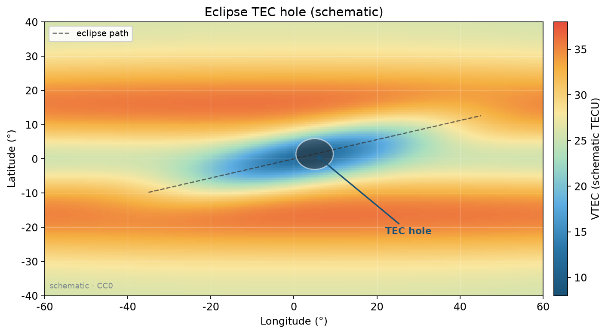

# 23 · 太阳耀斑与日食：突然电离、光化学冷却与时间线分析

> **课堂定位**：现象专题第 5 课（19–23 收官）。前置：[19](./19-phenomena-overview.md)、[20](./20-storm-tec-analysis.md)、[22](./22-tid-traveling-disturbances.md)。  
> **学完应能**：用光化学链解释耀斑 TEC 跳与日食 TEC 洞；坚持高采样 GNSS；按时间线对齐 GOES 峰或食相；判断闪烁何时放下。  
> **双主线**：辐射–光化学–TEC 原则 + 高采样时间线操作。不是太阳物理预报课。

---

## 1. 开场：两种太阳剧本，钟表不同

| 剧本 | 太阳侧 | GNSS 签名 | 钟表 |
|---|---|---|---|
| **耀斑** | SXR/EUV 突增 | 日侧 TEC **突然抬升** | 分钟级 |
| **日食** | 月影挡光 | 食带 **TEC 洞** | 随食相，数十分钟～数小时 |
| （对照）磁暴 | 磁层耦合 | 正负相分区 | 见 20 |
| （对照）TID | AGW 等 | δTEC 斜纹延迟 | 见 22 |

类比：耀斑＝摄影棚主灯猛打（日侧立刻亮）；日食＝遮光板扫过（板下变暗）；磁暴＝中央空调被台风重设。

**采样率与机制同等重要**：标准 IGS GIM 常 1–2 h 一帧，接不住耀斑主跳。主兵器＝**高采样（目标 ≤30 s）单站/区域网 TEC**；GIM 只粗看大洞。

> 图源：本仓库自制示意（非真实耀斑）。上：软 X 射线；中：D 区吸收/SID 家族；下：日侧 ΔTEC 短暂增强——强调分钟级对齐，而非 2 小时 GIM 帧。

### 交付物

1. [ ] 口述耀斑 → 突然电离 → TEC 跳（≥6 步）。  
2. [ ] 说明日侧约束与天顶角 χ。  
3. [ ] 口述日食挡光 → 复合占优 → TEC 洞 → 复圆回填。  
4. [ ] 完成耀斑套与日食套清单。  
5. [ ] 说明闪烁默认何时不看。  
6. [ ] 点名 ≥6 个 `PROJECTS.json` 的 `name`。

---

## 2. 词表

| 术语 | 要点 |
|---|---|
| GOES X 等级 | B/C/M/X；钉子，非 TEC 幅度唯一决定因素 |
| SXR / EUV | 沉积高度不同；EUV 对 E/F 关键 |
| SID | 突然电离层扰动家族（吸收、VLF、TEC 突增等） |
| 产生率 q / 复合 | 水龙头开大 vs 关掉后漏掉 |
| 天顶角 χ | χ 大则响应常弱 |
| 食相 | 初亏–食甚–复圆，与 TEC 极小对齐 |
| SYM-H | 排除「其实是暴」 |

数据：`NOAA-SWPC`、`NASA-OMNIWeb`、`Seemala-GPS-TEC`、`tec-suite`、`gnss-tec`、`IONOLAB-TEC-Software`、`SuperSID`、`OASIS`、`CDDIS-IONEX`、`geospacelab`。

---

## 3. 耀斑：突然电离因果链

口诀「焰–谱–照–产–层–柱–跳」：

1. **焰**：SXR/EUV 通量陡升（GOES 钉峰值 UTC）。  
2. **谱**：波段决定沉积层高（X 射线偏低层，EUV 影响 E/F）。  
3. **照**：只有效作用于**日侧**；夜侧大跳优先查周跳/别的驱动。  
4. **产**：光电离产生率 q 猛增 → Ne↑。  
5. **层**：D/E/F 均可响应；GNSS TEC 以 F 区柱贡献为大。  
6. **柱 / 跳**：STEC/VTEC 相对基线突然抬升，主跳常与 X 射线上升同量级对齐（分钟～十几分钟）。

电磁辐射光速到达 → 「突然」；磁暴经多级耦合 → 慢且分区。  
同样 X 级，日面位置与 χ 不同，TEC 跳可差很多——报告写：**等级 + 峰值 UTC + 是否日侧 + χ 直觉**。

**耀斑 vs TID**：耀斑日侧多站**近乎同相**起立；TID 是 keogram **斜纹**人浪。跳后若叠加行进波，分节写，勿单标签包圆。

**闪烁口令**：*耀斑看跳，不看抖。*（除非另有强不规则报告。）

---

## 4. 日食：挡光、复合与 TEC 洞

> 图源：自制示意。食带路径上叠加局部 TEC 耗空「洞」；须与食相对齐，且用高采样时间序列确认。

口诀「挡–q↓–复合占优–洞–复圆回填」：

1. 月影扫过 → 局部 EUV 减少；  
2. 产生率下降，损失（复合等）相对占优；  
3. Ne / TEC 下降成**洞**，位置跟食带；  
4. 极小值常近食甚（可有滞后，诚实写）；  
5. 复圆后产生率恢复 → 洞回填。

不是「瞬间抽空」：有限复合时间尺度，故曲线平滑下降再回升。恢复相能揭穿假洞（若复圆后不回填，先查数据/别的驱动）。

日食与磁暴同日：先钉 SYM-H 与食相两条轴，分节写，勿把暴负相整盆扣给食。

---

## 5. 时间线分析总则

1. 选定高采样 TEC 源与站点（日侧耀斑；食带附近日食）。  
2. 画 TEC 与驱动（GOES 或食相）**同轴**。  
3. 标峰值/食甚竖线，读超前/滞后。  
4. 多站：耀斑求同步性；日食看洞是否沿路径迁移。  
5. 用 SYM-H / Kp 排除暴污染；用 ROTI 排除误贴闪烁主因。  
6. GIM 仅作背景，不声明「GIM 看见了分钟跳」。

### 耀斑套清单

- [ ] GOES 等级与峰值 UTC（`NOAA-SWPC`）  
- [ ] 研究区当时是否日侧、χ 粗估  
- [ ] ≤30 s TEC；基线与跳变量级（读图，不编造）  
- [ ] 多站是否近同步  
- [ ] SYM-H 无明显主相争功  
- [ ] 声明未把闪烁当主证据  

### 日食套清单

- [ ] 食带与食相时刻  
- [ ] 站点相对本影/半影  
- [ ] TEC 极小 vs 食甚滞后  
- [ ] 复圆后是否回填  
- [ ] 同期地磁是否安静  
- [ ] GIM 粗洞（可选）与高采样一致吗  

---

## 6. 分流 · 工具 · 测验 · 收官

| 易混 | 分流 |
|---|---|
| 暴正负相 | 20；对齐 SYM-H |
| 泡 / ROTI | 21；日落后羽状 |
| TID 斜纹 | 22；去趋势延迟 |
| 耀斑同步跳 | 本课；对齐 GOES |

**专题收官地图**：19 总览签名 → 20 暴差分 → 21 山与沟 → 22 涟漪 → 23 主灯与遮光板。

**口答**：耀斑六步；为何夜侧慎贴耀斑；日食洞为何不瞬间空；为何 GIM 不够。

**作业**：选一历史 M/X 耀斑或日食，完成对应清单半页；点名 ≥6 个 `name`；附时间线草图（手绘可）。

### 口令与小结

> 耀斑看跳对齐 GOES；日食看洞对齐食相；高采样是标配；闪烁默认靠边。

1. 钟表决定兵器：分钟级事件不要用 2 小时产品硬刚。  
2. 光化学是主轴：产生率开大/关小，不是「磁层故事」的缩写。  
3. 多源与分流：暴、泡、TID、耀斑/日食标签不要互相污染。

返回总览：[19-phenomena-overview.md](./19-phenomena-overview.md)。
